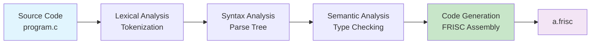

# 🚀 PPJ Compiler: From C to FRISC Assembly

> **A complete, production-ready C compiler that transforms high-level C code into executable FRISC assembly.** Built from scratch using formal compiler construction techniques, this compiler demonstrates every phase of modern compiler design—from lexical analysis through code generation.

[](https://openjdk.org/)
[](https://maven.apache.org/)
[](LICENSE)

## ✨ What Makes This Compiler Special?

This isn't just another compiler project—it's a **complete, educational, and production-quality** implementation that:

- 🎯 **Compiles Real C Programs**: Supports a comprehensive subset of C including functions, arrays, control flow, and more
- 🏗️ **Built from Scratch**: No external parser generators or regex libraries—everything is hand-crafted using formal automata theory
- 📚 **Educational Excellence**: Clear architecture, comprehensive documentation, and well-commented code perfect for learning compiler construction
- 🎨 **Beautiful Output**: Generates human-readable FRISC assembly with extensive comments and proper formatting
- ✅ **Thoroughly Tested**: 90+ test programs with 82% success rate, comprehensive HTML reports, and FRISC simulator integration

## 🎬 Quick Start

### Prerequisites

Before you begin, ensure you have:

- **Java 21+** (uses modern features: records, sealed classes, pattern matching)
- **Maven 3.8+** for build management
- **Node.js 18+** (for running FRISC simulator—see [FRISC Simulator Guide](docs/09-runtime-and-support/frisc_simulator_guide.md))
- **Bash** (Unix-like environment recommended)

**Check your setup:**
```bash
java -version    # Should show Java 21 or higher
mvn -version     # Should show Maven 3.8 or higher
node --version   # Should show Node.js 18 or higher (for simulator)
```

**Installing Node.js (if needed):**
```bash
# Using Homebrew (macOS)
brew install node

# Using nvm (recommended)
curl -o- https://raw.githubusercontent.com/nvm-sh/nvm/v0.39.0/install.sh | bash
nvm install 18
nvm use 18

# Or download from https://nodejs.org/
```

**Installing FRISC Simulator ([see more here](https://github.com/izuzak/FRISCjs)):**
```bash
# Install FRISC simulator dependencies
npm install friscjs

# This installs friscjs package in node_modules/
```

### 🏗️ Building the Compiler

**Option 1: Quick Build (Recommended)**
```bash
./build.sh
```

This script:
- ✅ Compiles all modules
- ✅ Runs comprehensive tests
- ✅ Performs static analysis
- ✅ Generates executable JAR at `cli/target/ccompiler.jar`

**Option 2: Manual Build**
```bash
# Complete build with all checks
mvn clean verify

# Fast development build (skip tests and checks)
mvn clean package -DskipTests
```

### 🎯 Compiling Your First Program

Let's compile a simple C program:

**1. Create a test program:**
```c
// hello.c
int main(void) {
    return 42;
}
```

**2. Compile it:**
```bash
./run.sh hello.c
```

**3. Check the output:**
```bash
cat compiler-bin/a.frisc
```

You should see beautiful FRISC assembly code! 🎉

### 🚀 Running Generated Code

**1. Execute with FRISC Simulator:**
```bash
# Make sure FRISC simulator is installed first
npm install friscjs

# Run the generated assembly
node node_modules/friscjs/consoleapp/frisc-console.js compiler-bin/a.frisc
```

The simulator will output the program's return value (42) in register R6 as a **decimal number** (not hex).

**2. Or use the built-in runner:**
```bash
./run.sh run compiler-bin/a.frisc
```

**Note**: The FRISC simulator outputs decimal values to stdout. The compiler's test infrastructure automatically compares these decimal values with expected results—no hex conversion needed!

## 📖 Complete Usage Guide

### Compiler Commands

The compiler supports multiple execution modes:

```bash
# Lexical analysis only (outputs tokens to stdout)
./run.sh lexer program.c

# Syntax analysis (generates parse trees)
./run.sh syntax program.c
# Output: compiler-bin/generativno_stablo.txt
#         compiler-bin/sintaksno_stablo.txt

# Semantic analysis (type checking, symbol resolution)
./run.sh semantic program.c
# Additional output: compiler-bin/tablica_simbola.txt
#                   compiler-bin/semanticko_stablo.txt

# Full compilation (all phases → FRISC assembly)
./run.sh program.c
# Final output: compiler-bin/a.frisc
```

### Example: Complete Workflow

Let's trace through a complete example:

**1. Create a program:**
```c
// factorial.c
int factorial(int n) {
    if (n <= 1) {
        return 1;
    }
    return n * factorial(n - 1);
}

int main(void) {
    return factorial(5);
}
```

**2. Compile:**
```bash
./run.sh factorial.c
```

**3. View generated assembly:**
```bash
cat compiler-bin/a.frisc
```

**4. Run on FRISC simulator:**
```bash
# Make sure FRISC simulator is installed
npm install

# Execute the generated assembly
node node_modules/friscjs/consoleapp/frisc-console.js compiler-bin/a.frisc
# Output: 120 (5! = 120)
# The simulator outputs the decimal value of R6 register
```

**5. Inspect intermediate outputs:**
```bash
# See lexical tokens
cat compiler-bin/leksicke_jedinke.txt

# See parse tree
cat compiler-bin/sintaksno_stablo.txt

# See symbol table
cat compiler-bin/tablica_simbola.txt
```

## 📚 Comprehensive Documentation

This project includes extensive documentation organized as a comprehensive guide to compiler construction. All documentation is located in the [`docs/`](docs/) directory and organized into logical chapters:

### 📖 Documentation Structure

The documentation is organized into chapter-like sections covering all aspects of compiler construction:

#### 1. Introduction
- **[Overview](docs/01-introduction/overview.md)**: Project overview, architecture, and quick start guide
- **[Project Architecture](docs/01-introduction/project-architecture.md)**: Detailed architecture overview, module organization, and design patterns

#### 2. Theoretical Foundations
- **[Formal Languages and Grammars](docs/02-theoretical-foundations/formal-languages-and-grammars.md)**: Formal language theory, regular languages, context-free grammars, and LR parsing foundations
- **[Automata and Parsing Theory](docs/02-theoretical-foundations/automata-and-parsing-theory.md)**: Detailed automata algorithms, parsing algorithms, and error recovery techniques

#### 3. Lexical Analysis
- **[Lexer Design](docs/03-lexical-analysis/lexer-design.md)**: Lexer architecture, token specification, and design principles
- **[Implementation Notes](docs/03-lexical-analysis/implementation-notes.md)**: Complete technical documentation including regex parsing and NFA/DFA conversion algorithms
- **[Token Specification](docs/03-lexical-analysis/token-specification.md)**: User guide for writing lexer specifications and token patterns

#### 4. Syntax Analysis
- **[Grammar Specification](docs/04-syntax-analysis/grammar-specification.md)**: Grammar format, production rules, and parser module overview
- **[Parser Construction](docs/04-syntax-analysis/parser-construction.md)**: Parser architecture, grammar parsing, and FIRST set computation
- **[Parsing Tables and Algorithms](docs/04-syntax-analysis/parsing-tables-and-algorithms.md)**: Detailed LR(1) parser implementation, table construction, and runtime parsing

#### 5. Semantic Analysis
- **[Symbol Tables and Scopes](docs/05-semantic-analysis/symbol-tables-and-scopes.md)**: Symbol table implementation, scope management, and identifier resolution
- **[Type System and Checking](docs/05-semantic-analysis/type-system-and-checking.md)**: Type system design, type checking algorithms, and semantic validation
- **[Semantic Passes](docs/05-semantic-analysis/semantic-passes.md)**: Semantic analysis pipeline, attribute synthesis, and error reporting

#### 6. Intermediate Representation
- **[IR Design](docs/06-intermediate-representation/ir-design.md)**: AST structure, node hierarchy, and IR design principles
- **[AST Structure and Walkers](docs/06-intermediate-representation/ast-structure-and-walkers.md)**: Detailed AST node specifications and traversal mechanisms

#### 7. Code Generation
- **[Target Architecture Overview](docs/07-code-generation/target-architecture-overview.md)**: FRISC architecture overview, code generation strategy, and runtime model
- **[Instruction Selection](docs/07-code-generation/instruction-selection.md)**: Code generation algorithms, expression code generation, and statement code generation
- **[Calling Conventions and Runtime](docs/07-code-generation/calling-conventions-and-runtime.md)**: Function calling conventions, stack management, and activation records
- **[FRISC Codegen Details](docs/07-code-generation/frisc-codegen-details.md)**: Complete FRISC processor reference including instruction set, addressing modes, and assembly directives
- **[Codegen Module Structure](docs/07-code-generation/codegen_module_structure.md)**: Complete guide to code generation module architecture and package organization
- **[Codegen Rules and Conventions](docs/07-code-generation/codegen_rules_and_conventions.md)**: Detailed rules and conventions for code generation (37 rules covering expressions, statements, functions, memory, types, labels, formatting, stack, and registers)

#### 8. Optimizations
- **[Basic Optimizations](docs/08-optimizations/basic-optimizations.md)**: Optimization techniques including constant folding, dead code elimination, and register allocation

#### 9. Runtime and Support
- **[Runtime Library](docs/09-runtime-and-support/runtime-library.md)**: Runtime functions, helper function generation, and memory management
- **[Helper Functions on FRISC](docs/09-runtime-and-support/helper-functions-on-frisc.md)**: Detailed implementation of helper functions including float operations (Q16.16 fixed-point)
- **[FRISC Simulator Guide](docs/09-runtime-and-support/frisc_simulator_guide.md)**: Complete guide to using the FRISC simulator for testing and debugging

#### 10. Configuration
- **[Configuration Overview](docs/10-configuration/configuration-overview.md)**: Configuration system overview, file loading, and validation
- **[Config File Reference](docs/10-configuration/config-file-reference.md)**: Complete reference for lexer, parser, and semantics configuration file formats
- **[Examples and Best Practices](docs/10-configuration/examples-and-best-practices.md)**: Configuration examples and usage patterns

#### 11. Testing and Tooling
- **[Test Strategy](docs/11-testing-and-tooling/test-strategy.md)**: Testing methodology, test organization, and execution
- **[Example Programs](docs/11-testing-and-tooling/example-programs.md)**: Test program catalog and validation results
- **[Debugging Workflow](docs/11-testing-and-tooling/debugging-workflow.md)**: Debugging techniques and tools

#### 12. Appendices
- **[Glossary](docs/12-appendices/glossary.md)**: Complete glossary of compiler construction terms
- **[Notation and Conventions](docs/12-appendices/notation-and-conventions.md)**: Documentation notation, code conventions, and terminology
- **[Bibliography and Further Reading](docs/12-appendices/bibliography-and-further-reading.md)**: References to textbooks, papers, and online resources

### 🎓 Quick Start Documentation

For new users, start with:
1. **[Introduction Overview](docs/01-introduction/overview.md)**: Project overview and quick start
2. **[Project Architecture](docs/01-introduction/project-architecture.md)**: Understanding the compiler structure
3. **[Theoretical Foundations](docs/02-theoretical-foundations/formal-languages-and-grammars.md)**: Learn the theoretical background
4. **[Lexical Analysis](docs/03-lexical-analysis/lexer-design.md)**: Start with the first compiler phase
5. **[FRISC Simulator Guide](docs/09-runtime-and-support/frisc_simulator_guide.md)**: Running and debugging FRISC assembly

## 🏛️ Architecture Overview

The compiler follows a clean, modular architecture with four distinct phases:


```mermaid
flowchart LR
    A[Source Code<br/>program.c] --> B[Lexical Analysis<br/>Tokenization]
    B --> C[Syntax Analysis<br/>Parse Tree]
    C --> D[Semantic Analysis<br/>Type Checking]
    D --> E[Code Generation<br/>FRISC Assembly]
    
    E --> F[a.frisc]
    
    style A fill:#e1f5fe
    style E fill:#c8e6c9
    style F fill:#f3e5f5
```

### Module Structure

```
compiler-lexer/      → Tokenization using hand-built DFAs
compiler-parser/     → LR(1) parsing with auto-generated tables
compiler-semantics/  → Type checking and symbol resolution
compiler-codegen/    → FRISC assembly generation
cli/                 → Command-line interface
```

Each module is independently testable and follows strict dependency hierarchy.

## 🎨 Language Features

The compiler supports a comprehensive subset of C:

### ✅ Supported Features

- **Data Types**: `int`, `char`, `void`, arrays, functions
- **Control Flow**: `if`/`else`, `while`, `for`, `break`, `continue`, `return`
- **Operators**: Arithmetic, relational, logical, bitwise, assignment, increment/decrement
- **Functions**: Full function support with parameters and return values
- **Arrays**: Array declarations, indexing, and initialization
- **Variables**: Local and global variables with proper scoping

### 📝 Example Programs

Check out the `examples/` directory:
- **Valid Programs** (`examples/valid/`): 80+ working examples
- **Invalid Programs** (`examples/invalid/`): 70+ error examples

## 🧪 Testing and Validation

### Running Tests

```bash
# Run all tests
mvn test

# Run tests for specific module
mvn test -pl compiler-lexer
mvn test -pl compiler-parser
mvn test -pl compiler-semantics
mvn test -pl compiler-codegen
```

### Generating HTML Reports

Generate comprehensive HTML reports for all test programs:

```bash
# Using Java directly
java -cp "$(mvn dependency:build-classpath -q -pl cli -DincludeScope=compile | tail -1):cli/target/classes:compiler-codegen/target/classes:compiler-semantics/target/classes:compiler-parser/target/classes:compiler-lexer/target/classes" hr.fer.ppj.examples.ExamplesReportGenerator

# Reports generated:
# - examples/report_valid.html
# - examples/report_invalid.html
```

Reports include:
- ✅ Source code listings
- ✅ Lexical token analysis
- ✅ Parse tree visualizations
- ✅ Semantic analysis results
- ✅ Generated FRISC assembly code
- ✅ Execution results with FRISC simulator

### Test Results

- **90 valid C programs** tested
- **82.2% success rate** (74 programs compile successfully)
- **16 programs** fail due to unsupported features (float, struct, advanced pointers)
- **All successful programs** execute correctly on FRISC simulator

## 🛠️ Development

### Code Quality

The project enforces strict quality standards:

```bash
# Run all quality checks
mvn verify

# Individual tools
mvn checkstyle:check      # Code style
mvn spotbugs:check        # Bug detection
mvn spotless:check        # Formatting
mvn spotless:apply        # Auto-format
```

### Project Structure

```
.
├── compiler-lexer/       # Lexical analysis module
├── compiler-parser/       # Syntax analysis module
├── compiler-semantics/   # Semantic analysis module
├── compiler-codegen/     # Code generation module
├── cli/                  # Command-line interface
├── config/               # Grammar and lexer definitions
├── examples/             # Test programs
│   ├── valid/           # Valid C programs
│   └── invalid/         # Invalid programs (for error testing)
├── docs/                 # Comprehensive documentation
└── pom.xml              # Maven root configuration
```

## 🎯 Key Highlights

### What Makes This Compiler Stand Out?

1. **🎓 Educational Value**: Every phase is clearly documented and follows formal compiler construction principles
2. **🏗️ Clean Architecture**: Modular design with strict separation of concerns
3. **📝 Comprehensive Documentation**: 15+ detailed documentation files covering every aspect
4. **✅ Production Quality**: Extensive testing, error handling, and code quality tools
5. **🎨 Beautiful Output**: Human-readable assembly with extensive comments
6. **🚀 Complete Pipeline**: From source code to executable assembly in one command

### Technical Achievements

- ✅ **Manual Regex Parser**: No external regex libraries—hand-built using formal automata theory
- ✅ **Canonical LR(1) Parser**: Auto-generated parsing tables with ~823 states
- ✅ **Complete Type System**: Full type checking with const-qualification support
- ✅ **FRISC Code Generation**: Complete assembly generation for all supported constructs
- ✅ **Stack Management**: Proper activation records and calling conventions
- ✅ **Short-Circuit Evaluation**: Correct implementation of `&&` and `||` operators

## 🚀 Next Steps

### For Users

1. **Try the Examples**: Explore `examples/valid/` to see what the compiler can do
2. **Read the Documentation**: Start with [Introduction Overview](docs/01-introduction/overview.md) and [FRISC Simulator Guide](docs/09-runtime-and-support/frisc_simulator_guide.md)
3. **Write Your Own Programs**: Compile your C programs and run them on the FRISC simulator

### For Developers

1. **Explore the Architecture**: Read [Project Architecture](docs/01-introduction/project-architecture.md) and [Codegen Module Structure](docs/07-code-generation/codegen_module_structure.md) to understand the codebase
2. **Study the Rules**: Review [Codegen Rules and Conventions](docs/07-code-generation/codegen_rules_and_conventions.md) for implementation details
3. **Contribute**: Check out the code quality standards and start contributing!

## 📊 Project Status

### ✅ Completed Features

- **Lexical Analysis**: Complete with multi-state lexer and error recovery
- **Syntax Analysis**: Full LR(1) parser with automatic table generation
- **Semantic Analysis**: Complete type system with scope resolution
- **Code Generation**: Full FRISC assembly generation for all supported constructs
- **Testing**: Comprehensive test suite with HTML report generation
- **Documentation**: 36+ detailed documentation files organized into 12 chapters

### 🔮 Future Enhancements

- Advanced optimizations (dead code elimination, constant folding)
- Enhanced diagnostics (multiple errors, warnings, suggestions)
- Development tools (debugger, visualizations, profiling)
- Extended language support (structs, pointers, float types)

## 🤝 Contributing

This is an educational project demonstrating formal compiler construction. Contributions are welcome! Please:

1. Follow the code quality standards (Checkstyle, SpotBugs, Spotless)
2. Add comprehensive tests for new features
3. Update documentation for significant changes
4. Maintain the educational focus and code clarity

## 📄 License

This project is licensed under the MIT License—see the LICENSE file for details.

## 👤 Author

**Karlo Knežević**

- Website: [karloknezevic.github.io](https://karloknezevic.github.io/)
- GitHub: [@karloknezevic](https://github.com/karloknezevic)

---

## 🎉 Ready to Start?

Here's a complete example to get you started:

```bash
# 1. Install FRISC simulator (if not already installed)
npm install

# 2. Build the compiler
./build.sh

# 3. Compile a test program
./run.sh examples/valid/program1.c

# 4. View the generated assembly
cat compiler-bin/a.frisc

# 5. Run the generated code on FRISC simulator
node node_modules/friscjs/consoleapp/frisc-console.js compiler-bin/a.frisc

# 6. Explore the comprehensive documentation
# All documentation is organized in docs/ directory by chapter
ls docs/
```

**Happy Compiling! 🚀**

---

## 📚 Documentation Quick Links

The documentation is comprehensively organized into 12 chapters covering all aspects of compiler construction. See the [Comprehensive Documentation](#-comprehensive-documentation) section above for the complete structure.

**Quick Links**:
- **[Introduction](docs/01-introduction/overview.md)** - Start here for project overview
- **[Theoretical Foundations](docs/02-theoretical-foundations/formal-languages-and-grammars.md)** - Formal language theory
- **[Lexical Analysis](docs/03-lexical-analysis/lexer-design.md)** - Token specification and lexer implementation
- **[Syntax Analysis](docs/04-syntax-analysis/grammar-specification.md)** - Grammar and parser construction
- **[Semantic Analysis](docs/05-semantic-analysis/symbol-tables-and-scopes.md)** - Type checking and symbol resolution
- **[Code Generation](docs/07-code-generation/target-architecture-overview.md)** - FRISC assembly generation
- **[Configuration](docs/10-configuration/configuration-overview.md)** - Configuration file reference
- **[Testing](docs/11-testing-and-tooling/test-strategy.md)** - Testing methodology
- **[Appendices](docs/12-appendices/glossary.md)** - Glossary and references

---

*This compiler represents a complete implementation of formal compiler construction techniques, providing both educational value and practical functionality. Every phase—from lexical analysis through code generation—is implemented from scratch using rigorous theoretical foundations.*
