# PPJ Compiler

A complete implementation of a C compiler for the PPJ-C language subset, featuring lexical analysis, syntax analysis, semantic analysis, and code generation. The compiler generates FRISC assembly code from C source files using formal compiler construction techniques.

## Table of Contents

- [Overview](#overview)
- [Language Specification](#language-specification)
- [Project Architecture](#project-architecture)
- [Prerequisites](#prerequisites)
- [Building the Project](#building-the-project)
- [Running the Compiler](#running-the-compiler)
- [Output Files](#output-files)
- [Configuration](#configuration)
- [Documentation](#documentation)
- [Development](#development)
- [Testing](#testing)
- [Status](#status)

## Overview

The PPJ Compiler implements a complete compilation pipeline for the PPJ-C language, a carefully designed subset of C that includes all essential language constructs while maintaining formal semantic specifications. The compiler is built using rigorous compiler construction principles and modern Java features.

### Compilation Pipeline

The compiler operates through four distinct phases:


1. **Lexical Analysis**: Tokenizes source code using hand-built deterministic finite automata (DFAs) constructed from formal regular expressions
2. **Syntax Analysis**: Parses token streams into parse trees using canonical LR(1) parsing with automatically generated parsing tables
3. **Semantic Analysis**: Validates program semantics including type checking, scope resolution, and control flow analysis
4. **Code Generation**: Produces human-readable FRISC assembly code with proper calling conventions, stack management, and comprehensive language construct support

Each phase is implemented as an independent module with well-defined interfaces, enabling modular development and testing.

## Language Specification

PPJ-C supports a comprehensive subset of C programming language features:

### Data Types
- **Primitive Types**: `void`, `char`, `int`
- **Composite Types**: Arrays (`type[]`, `type[size]`), Functions (`returnType(paramTypes)`)
- **Type Qualifiers**: `const` for immutable values

### Language Constructs
- **Control Flow**: `if`/`else`, `while`, `for`, `break`, `continue`, `return`
- **Operators**: Arithmetic (`+`, `-`, `*`, `/`, `%`), Relational (`<`, `>`, `<=`, `>=`, `==`, `!=`), Logical (`&&`, `||`, `!`), Bitwise (`&`, `|`, `^`, `~`), Assignment (`=`), Increment/Decrement (`++`, `--`)
- **Declarations**: Variable declarations, Function declarations and definitions, Array declarations
- **Expressions**: Primary expressions, Postfix expressions (array indexing, function calls), Unary expressions, Binary expressions, Assignment expressions

### Semantic Rules
- **Type System**: Static typing with implicit conversions between `char` and `int`
- **Scope Rules**: Lexical scoping with block-level scope management
- **Function Semantics**: Mandatory `int main(void)` entry point, Function prototype matching, Parameter type checking
- **Array Semantics**: Zero-based indexing, Array-to-pointer decay in function parameters, Bounds checking (compile-time for constant indices)

## Project Architecture

The compiler is implemented as a Maven multi-module project with strict dependency hierarchy:


### Module Dependencies

The project maintains a strict layered architecture with clear dependency flow:


Each module has well-defined responsibilities and interfaces, enabling independent development and testing.

### Core Components

### Core Components



```mermaid
graph LR
    subgraph "Lexer Module"
        A1[Regex Parser] --> A2[ε-NFA Builder]
        A2 --> A3[DFA Converter]
        A3 --> A4[Tokenizer]
        A4 --> A5[Symbol Table]
    end
    
    subgraph "Parser Module"
        B1[Grammar Parser] --> B2[FIRST Sets]
        B2 --> B3[LR Items]
        B3 --> B4[CLOSURE/GOTO]
        B4 --> B5[Parse Tables]
        B5 --> B6[LR Parser]
    end
    
    subgraph "Semantics Module"
        C1[Symbol Table] --> C2[Type System]
        C2 --> C3[Expression Rules]
        C3 --> C4[Declaration Rules]
        C4 --> C5[Statement Rules]
    end
    
    subgraph "Codegen Module"
        D1[Instruction Gen] --> D2[Register Alloc]
        D2 --> D3[Code Optimizer]
        D3 --> D4[FRISC Output]
    end
    
    A5 --> B6
    B6 --> C1
    C5 --> D1
    
    style A1 fill:#f8bbd9
    style B1 fill:#f8bbd9
    style C1 fill:#f8bbd9
    style D1 fill:#f8bbd9
```

**Lexer Module** (`compiler-lexer`):
- Manual regular expression parser (no external regex libraries)
- ε-NFA to DFA conversion using subset construction algorithm
- Multi-state lexer support for context-sensitive tokenization
- Maximal munch tokenization with rule priority resolution
- Comprehensive error recovery and reporting

**Parser Module** (`compiler-parser`):
- Canonical LR(1) parser generator from grammar specifications
- FIRST set computation and grammar augmentation
- CLOSURE and GOTO algorithm implementations
- Automatic parsing table generation (~823 states for PPJ grammar)
- Conflict resolution for SHIFT/REDUCE and REDUCE/REDUCE conflicts
- Parse tree and abstract syntax tree generation

**Semantics Module** (`compiler-semantics`):
- Hierarchical symbol table with lexical scoping
- Comprehensive type system with const-qualification support
- Expression type checking and implicit conversion handling
- Control flow validation and jump statement analysis
- Modular rule system aligned with formal semantic specification

**Code Generation Module** (`compiler-codegen`):
- FRISC assembly instruction generation with human-readable output
- Stack-based expression evaluation and register management
- Standard function calling convention with caller-cleans-stack
- Comprehensive memory management and activation record handling
- Short-circuit evaluation for logical operators (&&, ||)
- Complete control flow implementation (if/else, while, for loops)
- Global variable initialization and local variable allocation

## Prerequisites

- **Java 21** or higher (uses modern language features: records, sealed classes, pattern matching)
- **Maven 3.8+** for build management
- **Bash** for build and run scripts (Unix-like environment recommended)

## Building the Project

### Quick Build

Build the entire project into a single executable JAR:

```bash
./build.sh
```

This script performs:
- Clean compilation of all modules
- Execution of comprehensive test suite
- Static analysis (Checkstyle, SpotBugs, Error Prone)
- Code formatting verification (Spotless)
- Generation of executable JAR with all dependencies

### Manual Build

Using Maven directly:

```bash
# Complete build with all checks
mvn clean verify

# Fast build for development (skip checks)
mvn clean package -DskipTests -Dspotbugs.skip=true -Dcheckstyle.skip=true

# Build specific modules
mvn clean install -pl compiler-lexer -am
mvn clean install -pl compiler-parser -am
mvn clean install -pl compiler-semantics -am
```

The executable JAR is generated at: `cli/target/ccompiler.jar`

## Running the Compiler

### Command Line Interface

The compiler provides multiple execution modes:


```bash
# Lexical analysis only
java -jar cli/target/ccompiler.jar lexer program.c

# Syntax analysis (lexer + parser)
java -jar cli/target/ccompiler.jar syntax program.c

# Semantic analysis (lexer + parser + semantics)
java -jar cli/target/ccompiler.jar semantic program.c

# Full compilation (all phases)
java -jar cli/target/ccompiler.jar program.c
```

### Using Run Scripts

Convenient wrapper scripts are provided:

```bash
# Individual phases
./run.sh lexer program.c
./run.sh syntax program.c
./run.sh semantic program.c

# Full compilation
./run.sh program.c
```

### Example Usage

```bash
# Analyze lexical structure
./run.sh lexer examples/valid/program1.c

# Generate parse trees
./run.sh syntax examples/valid/program1.c
# Output: compiler-bin/leksicke_jedinke.txt
#         compiler-bin/generativno_stablo.txt
#         compiler-bin/sintaksno_stablo.txt

# Perform semantic validation
./run.sh semantic examples/valid/program1.c
# Additional output: compiler-bin/tablica_simbola.txt
#                   compiler-bin/semanticko_stablo.txt

# Complete compilation
./run.sh examples/valid/program1.c
# Output: All above files plus compiler-bin/a.frisc
```

## Output Files

The compiler generates detailed output files for each compilation phase:

### Lexical Analysis Output

**Symbol Table** (`leksicke_jedinke.txt`):
```
tablica znakova:
indeks   uniformni znak   izvorni tekst
    0   KR_INT           int
    1   IDN              main
    2   L_ZAGRADA        (
    3   KR_VOID          void
    4   D_ZAGRADA        )

niz uniformnih znakova:
uniformni znak    redak    indeks u tablicu znakova
KR_INT            1        0
IDN               1        1
L_ZAGRADA         1        2
KR_VOID           1        3
D_ZAGRADA         1        4
```

### Syntax Analysis Output

**Generative Tree** (`generativno_stablo.txt`):
```
<prijevodna_jedinica>
  <vanjska_deklaracija>
    <definicija_funkcije>
      <ime_tipa>
        KR_INT
      <izravni_deklarator>
        IDN
        L_ZAGRADA
        KR_VOID
        D_ZAGRADA
      <slozena_naredba>
        L_VIT_ZAGRADA
        <lista_naredbi>
          <naredba_skoka>
            KR_RETURN
            <izraz>
              <primarni_izraz>
                BROJ
            TOCKAZAREZ
        D_VIT_ZAGRADA
```

**Abstract Syntax Tree** (`sintaksno_stablo.txt`):
```
<prijevodna_jedinica>
  <vanjska_deklaracija>
    <definicija_funkcije>
      <ime_tipa>
        KR_INT
      <izravni_deklarator>
        IDN
        L_ZAGRADA
        KR_VOID
        D_ZAGRADA
      <slozena_naredba>
        L_VIT_ZAGRADA
        <lista_naredbi>
          <naredba_skoka>
            KR_RETURN
            <izraz>
              <primarni_izraz>
                BROJ
            TOCKAZAREZ
        D_VIT_ZAGRADA
```

### Semantic Analysis Output

**Symbol Table Dump** (`tablica_simbola.txt`):
```
=== SYMBOL TABLE DUMP ===
Scope (Level 0):
  main : int(void) [defined=true]
  factorial : int(int) [defined=true]
  global_var : int [const=false]

Scope (Level 1):
  n : int [const=false]
  result : int [const=false]
```

**Semantic Tree Dump** (`semanticko_stablo.txt`):
```
=== SEMANTIC TREE DUMP ===
<<prijevodna_jedinica>> [type=null, lvalue=false, id=null, elements=0]
  <<vanjska_deklaracija>> [type=null, lvalue=false, id=null, elements=0]
    <<definicija_funkcije>> [type=int(void), lvalue=false, id=main, elements=0]
      <<ime_tipa>> [type=int, lvalue=false, id=null, elements=0]
        KR_INT (1,int) [symbol=null, type=null]
      <<izravni_deklarator>> [type=int(void), lvalue=false, id=main, elements=0]
        IDN (1,main) [symbol=null, type=null]
```

### Semantic Analysis Process


## Configuration

### Lexer Configuration

The lexer specification file (`config/lexer_definition.txt`) defines:

- **Macro Definitions**: Reusable regular expression patterns
- **State Declarations**: Lexer states for context-sensitive tokenization
- **Token Definitions**: Terminal symbol declarations
- **Lexical Rules**: Pattern-action pairs with state transitions

Example lexer rules:
```
%X KOMENTAR

%%

"//".*              { ; }
"/*"                { UDJI_U_STANJE(KOMENTAR); }
<KOMENTAR>"*/"      { VRATI_SE; }
<KOMENTAR>.         { ; }

[0-9]+              { return BROJ; }
[a-zA-Z_][a-zA-Z0-9_]*  { return IDN; }
"int"               { return KR_INT; }
"void"              { return KR_VOID; }
```

### Parser Configuration

The grammar specification file (`config/parser_definition.txt`) contains:

- **Non-terminal Declarations** (`%V`): Production left-hand sides
- **Terminal Declarations** (`%T`): Token symbols from lexer
- **Synchronization Tokens** (`%Syn`): Error recovery points
- **Production Rules**: Context-free grammar rules

Example grammar rules:
```
%V <prijevodna_jedinica> <vanjska_deklaracija> <definicija_funkcije>
%T IDN BROJ KR_INT KR_VOID L_ZAGRADA D_ZAGRADA
%Syn IDN

<prijevodna_jedinica> ::= <vanjska_deklaracija>
<prijevodna_jedinica> ::= <prijevodna_jedinica> <vanjska_deklaracija>
<vanjska_deklaracija> ::= <definicija_funkcije>
<definicija_funkcije> ::= <ime_tipa> <izravni_deklarator> <slozena_naredba>
```

### Semantic Configuration

The semantic rules specification (`config/semantics_definition.txt`) defines:

- **Type Checking Rules**: Type compatibility and conversion rules
- **Scope Resolution Rules**: Symbol visibility and declaration rules
- **Control Flow Rules**: Jump statement and loop validation rules
- **Function Call Rules**: Parameter matching and return type validation

## Documentation

Comprehensive technical documentation is available in the `docs/` directory:

### Core Documentation

- **[semantic_analyzer.md](docs/semantic_analyzer.md)**: High-level overview of semantic analysis phase, including pipeline integration, responsibilities, and usage examples
- **[semantic_analyzer_implementation.md](docs/semantic_analyzer_implementation.md)**: Detailed technical reference covering algorithms, data structures, and implementation details

### Code Generation Documentation

- **[frisc_architecture.md](docs/frisc_architecture.md)**: Complete FRISC processor architecture reference including instruction set, addressing modes, memory model, and assembly directives
- **[code_generation_overview.md](docs/code_generation_overview.md)**: High-level overview of code generation strategy, runtime model, and implementation approach
- **[code_generation_implementation.md](docs/code_generation_implementation.md)**: Comprehensive technical documentation covering algorithms, data structures, optimization techniques, and implementation details
- **[frisc_simulator_guide.md](docs/frisc_simulator_guide.md)**: Complete guide for using the FRISC simulator including console and web interfaces, debugging tools, and integration with the PPJ compiler

### Lexer Documentation

- **[lexer_implementation.md](docs/lexer_implementation.md)**: Complete technical documentation of lexer implementation including regex parsing, NFA/DFA conversion algorithms
- **[lexer_user_guide.md](docs/lexer_user_guide.md)**: User guide for writing lexer specifications and using the lexer module
- **[lexer_documentation.md](docs/lexer_documentation.md)**: General lexer overview and architecture documentation

### Parser Documentation

- **[parser_documentation.md](docs/parser_documentation.md)**: Parser module overview, architecture, and usage documentation
- **[lr_parser_technical.md](docs/lr_parser_technical.md)**: Detailed technical documentation of canonical LR(1) parser implementation

### Additional Documentation

- **[implementation_notes.md](docs/implementation_notes.md)**: Implementation decisions, design rationale, and architectural notes
- **[testing_status.md](docs/testing_status.md)**: Testing coverage, validation status, and quality metrics
- **[lexer_consistency_check.md](docs/lexer_consistency_check.md)**: Lexer validation and consistency verification procedures

## Development

### Code Quality Standards

The project enforces strict code quality standards:

- **Error Prone**: Advanced static analysis for bug detection
- **Checkstyle**: Code style and formatting consistency
- **SpotBugs**: Bug pattern detection and analysis
- **Spotless**: Automatic code formatting and import organization

### Running Quality Checks

```bash
# All quality checks
mvn verify

# Individual tools
mvn checkstyle:check
mvn spotbugs:check
mvn spotless:check
mvn spotless:apply  # Auto-format code
```

### Architecture Constraints

1. **No External Regex Libraries**: All regular expression parsing is implemented manually using formal automata theory
2. **Canonical LR(1) Parsing**: Parser uses only canonical LR(1) construction, no LALR or other variants
3. **Modern Java Features**: Extensive use of Java 21 features (records, sealed classes, pattern matching, text blocks)
4. **Modular Design**: Strict module boundaries with well-defined interfaces
5. **Formal Specifications**: All phases follow formal specifications in configuration files

## Testing

### Comprehensive Test Suite

**Code Generator Testing**:
- **90 valid C programs** tested from examples directory
- **Success Rate**: 82.2% (74 programs successfully generate FRISC code)
- **Failed Programs**: 16 programs fail due to unsupported features:
  - Float types (4 programs)
  - Struct types (4 programs) 
  - Pointers and arrays (8 programs)

**FRISC Simulator Integration**:
- Generated assembly code executes correctly on FRISCjs simulator
- Proper program termination with HALT instruction
- Return values correctly stored in R6 register
- Stack operations function correctly

**HTML Report Generation**:
- Comprehensive reports include FRISC code for all successful compilations
- Status badges show compilation phase results (Lexer, Parser, Semantic, CodeGen)
- Detailed error reporting for failed compilations

### Type System Architecture


### Test Suite Organization

The project includes comprehensive testing at multiple levels:

**Unit Tests**: Individual component testing for each module
```bash
mvn test -pl compiler-lexer
mvn test -pl compiler-parser
mvn test -pl compiler-semantics
```

**Integration Tests**: Cross-module integration testing
```bash
mvn test -Dtest=*IntegrationTest
```

**Golden Tests**: Reference output validation
```bash
mvn test -Dtest=*GoldenTest
```

### Test Program Suite

The `examples/` directory contains extensive test programs:

- **Valid Programs** (`examples/valid/`): 80+ semantically correct programs covering all language features
- **Invalid Programs** (`examples/invalid/`): 70+ programs with various error types (lexical, syntactic, semantic)

### HTML Report Generation

Generate comprehensive HTML reports for all test programs:

```bash
# Using Maven
mvn -pl cli exec:java -Dexec.mainClass=hr.fer.ppj.examples.ExamplesReportGenerator

# Using JAR
java -cp cli/target/ccompiler.jar hr.fer.ppj.examples.ExamplesReportGenerator
```

Generated reports:
- `examples/report_valid.html`: Analysis results for valid programs
- `examples/report_invalid.html`: Error analysis for invalid programs

Each report includes:
- Complete source code listing
- Lexical token analysis
- Parse tree visualization
- Semantic analysis results
- Symbol table dumps
- Generated FRISC assembly code (for valid programs)
- Error diagnostics (for invalid programs)

## Status


**Lexical Analysis**:
- Manual regex parser with formal NFA/DFA construction
- Multi-state lexer with context-sensitive tokenization
- Comprehensive error recovery and reporting
- Symbol table generation with correct output formatting
- Maximal munch tokenization with rule priority

**Syntax Analysis**:
- Canonical LR(1) parser generator from grammar specifications
- Complete FIRST set computation and grammar augmentation
- CLOSURE and GOTO algorithm implementations
- Automatic parsing table generation (~823 states)
- Conflict resolution for parsing conflicts
- Parse tree and AST generation with proper formatting

**Semantic Analysis**:
- Hierarchical symbol table with lexical scoping
- Complete type system with const-qualification support
- Expression type checking with implicit conversions
- Control flow validation and jump statement analysis
- Debug output generation (symbol table and semantic tree dumps)
- Comprehensive coverage of semantic specification

**Code Generation**:
- Complete FRISC assembly code generation for all PPJ-C constructs
- Stack-based expression evaluation with proper register management
- Standard function calling convention with caller-cleans-stack model
- Comprehensive control flow implementation (if/else, while, for loops)
- Local and global variable management with proper stack frames
- Short-circuit evaluation for logical operators (&&, ||)
- Pre/post increment and decrement operators with correct semantics
- Human-readable assembly output with extensive comments
- Integration with HTML report generation for complete analysis
- **Testing Results**: 82.2% success rate (74/90 valid programs)
- **FRISC Simulator Integration**: Generated code executes correctly on FRISCjs simulator
- **Comprehensive Coverage**: All basic C constructs successfully implemented

**Command Line Interface**:
- Unified CLI for all compilation phases
- Multiple execution modes (lexer-only, syntax-only, semantic-only, full)
- Comprehensive error reporting and status codes
- Integration with build and test infrastructure

### 📋 Future Enhancements

**Advanced Optimizations**:
- Dead code elimination and unreachable code removal
- Constant folding and propagation optimizations
- Loop optimization techniques (loop unrolling, strength reduction)
- Advanced register allocation with graph coloring
- Peephole optimization for instruction sequences

**Enhanced Diagnostics**:
- Multiple error reporting with intelligent recovery
- Warning system for potential runtime issues
- Detailed error location reporting with source context
- Suggested fixes and code improvement recommendations

**Development Tools**:
- Interactive debugger for compilation phases
- Visualization tools for automata, parse trees, and control flow
- Performance profiling and analysis tools
- Enhanced IDE integration with language server protocol
- FRISC simulator integration for code testing

The PPJ Compiler represents a complete implementation of formal compiler construction techniques, providing both educational value and practical functionality for C program compilation. The compiler successfully transforms high-level PPJ-C programs into executable FRISC assembly code, demonstrating all phases of modern compiler design from lexical analysis through code generation.