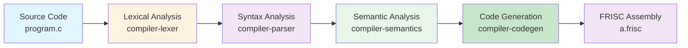

# Introduction

## Overview

This document provides a comprehensive introduction to the PPJ compiler project—a complete, production-ready C compiler that transforms high-level C source code into executable FRISC assembly language. The compiler is built from scratch using formal compiler construction techniques, demonstrating every phase of modern compiler design from lexical analysis through code generation.

A **compiler** is a computer program that translates source code written in a high-level programming language (in this case, a subset of C) into a lower-level language (FRISC assembly). The compilation process involves multiple distinct phases, each responsible for a specific aspect of translation. The PPJ compiler implements all of these phases using rigorous theoretical foundations from formal language theory, automata theory, and compiler construction principles.

Unlike many compiler projects that rely on external tools or libraries for parsing and code generation, the PPJ compiler is implemented entirely from scratch. This means that every component—from the regular expression parser used in lexical analysis to the LR(1) parser used in syntax analysis—is hand-crafted using formal algorithms. This approach provides exceptional educational value, as it demonstrates how theoretical concepts translate into practical implementations.

The compiler serves multiple purposes: it is both an educational tool for learning compiler construction and a production-quality implementation that can compile real C programs. Every design decision is documented, every algorithm is explained, and every phase is implemented with clarity and correctness as primary goals.

## Purpose and Scope

The PPJ compiler serves multiple purposes, each carefully balanced to provide both educational value and practical utility:

### Educational Excellence

The compiler is designed as a pedagogical tool that demonstrates formal compiler construction principles. Every phase—from lexical analysis through code generation—is implemented using rigorous theoretical foundations, making it an ideal resource for learning compiler design. 

When learning compiler construction, students often struggle to connect abstract theoretical concepts (such as finite automata, context-free grammars, and type systems) with concrete implementations. The PPJ compiler bridges this gap by implementing these concepts directly, with clear code and comprehensive documentation that explains both the theory and its practical application.

For example, the lexical analyzer doesn't use a library-based regex engine; instead, it implements Thompson's construction algorithm to convert regular expressions into epsilon-NFAs, then uses subset construction to convert these to DFAs. This approach ensures that students understand not just *what* the lexer does, but *how* it does it, and *why* these algorithms work.

### Production Quality

Despite its educational focus, the compiler achieves production-quality standards through comprehensive testing, extensive error handling, and well-structured code that follows industry best practices. The codebase includes over 90 test programs, comprehensive unit tests for each module, and integration tests that verify end-to-end compilation correctness.

The compiler handles error cases gracefully, providing clear error messages that help users understand what went wrong. Code quality tools (Checkstyle, SpotBugs, Spotless) ensure consistent formatting and catch potential bugs. The modular architecture allows each component to be tested independently, ensuring reliability and maintainability.

### Complete Implementation

Unlike many educational compilers that implement only a subset of functionality, this compiler provides a complete pipeline from source code to executable assembly, including all intermediate representations and analysis phases. A student using this compiler can trace a program from its source code form all the way through to the generated assembly instructions, understanding how each phase transforms the program representation.

The compiler supports a substantial subset of C, including functions, variables, control flow statements, arrays, and more. While it doesn't support every C feature (by design, to keep the implementation manageable), it supports enough features to compile real, useful programs. This completeness makes the compiler more than just a learning exercise—it's a functional tool.

### Documentation

The compiler includes extensive documentation that can serve as a reference for compiler construction techniques, making it suitable for adaptation into a full textbook on compiler design. Every major concept is explained in detail, with theoretical background, implementation details, examples, and diagrams. The documentation is organized into logical chapters that correspond to compiler phases, making it easy to navigate and understand the complete compilation process.

The documentation doesn't assume prior knowledge of compiler construction. Concepts are introduced gradually, with clear explanations and examples. Technical terms are defined when first used, and complex ideas are broken down into understandable components. This makes the documentation accessible to students learning compiler construction for the first time, while still being comprehensive enough for more advanced readers.

## Compiler Architecture

The PPJ compiler follows a traditional multi-phase compilation architecture, organized into distinct modules that correspond to the classical phases of compilation:



### Compilation Phases

The compilation process consists of four major phases, each transforming the program representation in a specific way:

#### Phase 1: Lexical Analysis (`compiler-lexer`)

Lexical analysis, also called **tokenization** or **scanning**, is the first phase of compilation. It transforms the raw source code (a stream of characters) into a stream of **tokens**—meaningful units such as keywords, identifiers, operators, and literals.

The PPJ compiler's lexer is implemented using hand-built deterministic finite automata (DFA). A **deterministic finite automaton** is a state machine that reads input characters one at a time and transitions between states based on the current character. When the automaton reaches an accepting state, it recognizes a token.

The lexer supports **multi-state operation**, meaning it can be in different states (such as "normal", "inside a comment", or "inside a string literal") and apply different token recognition rules depending on the current state. This is essential for handling constructs like comments and string literals, which have special syntax that requires context-aware processing.

For example, when the lexer encounters a double quote (`"`), it transitions to a "string" state. In this state, it recognizes characters differently—it looks for the closing quote rather than trying to match operators or keywords. This multi-state approach allows the lexer to correctly handle the lexical structure of C programs.

The lexer implementation uses formal automata theory: regular expressions from the lexer specification are converted to epsilon-NFAs using Thompson's construction, then converted to DFAs using subset construction. This ensures that token recognition is both correct and efficient. For detailed information, see [Lexical Analysis](../03-lexical-analysis/lexer-design.md).

#### Phase 2: Syntax Analysis (`compiler-parser`)

Syntax analysis, also called **parsing**, is the second phase of compilation. It takes the stream of tokens produced by the lexer and determines whether they form a syntactically valid program according to the language's grammar rules.

The PPJ compiler implements a **canonical LR(1) parser**. LR parsing is a bottom-up parsing technique that reads input from left to right and constructs a rightmost derivation in reverse. The "(1)" indicates that the parser uses one token of lookahead to resolve parsing decisions.

The parser uses **automatically generated parsing tables**—large data structures that specify what action to take (shift, reduce, accept, or error) for each parser state and input token. These tables are generated from the grammar specification using algorithms that compute item sets and transitions. The PPJ grammar produces approximately 823 parser states, demonstrating the complexity of parsing even a subset of C.

During parsing, the parser constructs **parse trees**—tree structures that represent how the input program was derived from the grammar. The compiler generates two types of trees: a **generative tree** (complete parse tree with all grammar nodes) and a **syntax tree** (simplified abstract syntax tree with non-semantic nodes removed). The syntax tree is used by later phases, while the generative tree provides detailed information about the parsing process.

The parser implementation demonstrates canonical LR(1) construction algorithms, including CLOSURE computation, GOTO transitions, and table generation. For detailed information, see [Syntax Analysis](../04-syntax-analysis/grammar-specification.md).

#### Phase 3: Semantic Analysis (`compiler-semantics`)

Semantic analysis is the third phase of compilation. While syntax analysis ensures that a program is grammatically correct, semantic analysis ensures that it is **meaningfully correct**—that is, that it follows language-specific rules that cannot be expressed in a context-free grammar.

The semantic analyzer performs several critical tasks:

- **Type Checking**: Verifies that operations are performed on compatible types. For example, it ensures that you can't add an integer to a function, or assign a value to a constant variable.

- **Scope Resolution**: Determines which declaration each identifier refers to. In C, identifiers can be declared in different scopes (global, function, block), and the semantic analyzer ensures that identifier references resolve to the correct declaration according to lexical scoping rules.

- **Semantic Validation**: Checks that the program follows semantic rules, such as ensuring functions are called with the correct number and types of arguments, that return statements match function return types, and that control flow statements (break, continue) appear in appropriate contexts.

The semantic analyzer builds a **symbol table**—a data structure that maps identifiers to their declarations, including type information, scope level, and other attributes. The symbol table is hierarchical, reflecting the nested scopes in the program. As the analyzer traverses the parse tree, it enters and exits scopes, building and maintaining this symbol table.

During semantic analysis, the parse tree is annotated with type information and other semantic attributes. This annotated tree is then passed to the code generator. For detailed information, see [Semantic Analysis](../05-semantic-analysis/symbol-tables-and-scopes.md).

#### Phase 4: Code Generation (`compiler-codegen`)

Code generation is the final phase of compilation. It takes the semantically validated abstract syntax tree and symbol table, and produces **target code**—in this case, FRISC assembly language.

The code generator implements a **syntax-directed translation** approach, where code generation actions are associated with grammar rules. As the generator traverses the AST, it emits FRISC assembly instructions that implement the semantics of each construct.

The code generator must handle many complex tasks:

- **Expression Evaluation**: Generate code that evaluates expressions and leaves results in registers. The generator must handle operator precedence, type conversions, and short-circuit evaluation for logical operators.

- **Control Flow**: Generate code for if statements, loops, and function calls. This includes generating labels, conditional branches, and managing the program counter.

- **Memory Management**: Allocate space for variables on the stack, manage activation records for function calls, and handle global variable storage.

- **Calling Conventions**: Implement the standard FRISC calling convention, including parameter passing, return value handling, and stack frame management.

- **Helper Functions**: Generate helper functions for operations not directly supported by FRISC hardware, such as 32-bit multiplication, division, and floating-point arithmetic.

The generated FRISC assembly code is human-readable and well-commented, making it easy to understand how high-level constructs translate to machine instructions. For detailed information, see [Code Generation](../07-code-generation/target-architecture-overview.md).

## Language Features

The compiler supports a comprehensive subset of the C programming language. This section describes what features are supported, how they work, and what limitations exist.

### Supported Data Types

The compiler implements a complete type system with several categories of types:

#### Primitive Types

**Integer Types**:
- `int`: 32-bit signed integer type. This is the primary numeric type in the compiler. Integer literals are recognized by the lexer and represented as 32-bit values.
- `char`: 8-bit signed integer type. While `char` is technically an integer type in C, it's often used for character data. Character literals (enclosed in single quotes) are converted to their ASCII values.

**Void Type**:
- `void`: Used exclusively for function return types (functions that don't return a value) and function parameter lists (functions that take no parameters). The `void` type cannot be used for variable declarations.

**Floating-Point Type**:
- `float`: 32-bit floating-point type implemented using **Q16.16 fixed-point representation**. Unlike standard C implementations that use IEEE-754 floating-point, this compiler represents floating-point numbers as fixed-point values. The Q16.16 format uses 16 bits for the integer part and 16 bits for the fractional part, providing approximately 0.00001526 precision. This approach simplifies implementation on architectures without floating-point hardware (like FRISC) while still providing useful floating-point capabilities.

#### Composite Types

**Array Types**: Arrays are sequences of elements of the same type. Arrays can be declared with a fixed size (e.g., `int arr[10]`) and accessed using indexing (e.g., `arr[5]`). Arrays decay to pointers when passed as function arguments, following C's standard behavior.

**Pointer Types**: Pointers store memory addresses. Basic pointer operations are supported, including declaration (`int *ptr`), dereferencing (`*ptr`), and address-of (`&var`). Advanced pointer arithmetic and complex pointer operations are not fully implemented.

**Structure Types**: Structures allow grouping related data together. Structure types can be named (using a tag) or anonymous. Structure members are accessed using the dot operator (`.`). The compiler provides comprehensive support for struct types, including nested structures, arrays within structs, arrays of structs, struct assignments, and struct-returning functions. For detailed documentation, see [Struct Grammar and Parsing](../04-syntax-analysis/struct-grammar-and-parsing.md), [Struct Type System and Semantic Checking](../05-semantic-analysis/struct-type-system-and-checking.md), and [Struct Code Generation](../07-code-generation/struct-code-generation.md).

**Function Types**: Functions have types determined by their parameter types and return type. Function types are used for type checking function calls and ensuring compatibility between function declarations and definitions.

#### Type Qualifiers

**Const Qualification**: The `const` keyword creates **immutable values**—values that cannot be modified after initialization. Const-qualified variables must be initialized when declared, and attempts to modify them result in semantic errors. Const qualification is part of the type system and affects type compatibility rules.

### Supported Constructs

The compiler supports a wide range of C language constructs:

#### Control Flow Statements

**Conditional Statements**: The `if` statement allows conditional execution of code. The `if-else` statement provides alternative execution paths. The condition expression must evaluate to an integer (zero is false, non-zero is true).

**Loop Statements**: 
- `while` loops execute a statement repeatedly while a condition is true.
- `for` loops provide initialization, condition checking, and increment expressions, allowing compact loop definitions.
- Both loop types support `break` (exit the loop immediately) and `continue` (skip to the next iteration).

**Return Statements**: Functions use `return` statements to return values to the caller. Functions with non-void return types must return a value; void functions can use `return` without a value.

#### Operators

The compiler supports the full range of C operators:

**Arithmetic Operators**: Addition (`+`), subtraction (`-`), multiplication (`*`), division (`/`), and modulo (`%`). These operators work on integer and floating-point types, with appropriate type conversions.

**Relational Operators**: Less than (`<`), greater than (`>`), less than or equal (`<=`), greater than or equal (`>=`), equality (`==`), and inequality (`!=`). These operators return integer values (0 for false, 1 for true).

**Logical Operators**: Logical AND (`&&`), logical OR (`||`), and logical NOT (`!`). These operators implement **short-circuit evaluation**—`&&` doesn't evaluate the right operand if the left is false, and `||` doesn't evaluate the right operand if the left is true.

**Bitwise Operators**: Bitwise AND (`&`), bitwise OR (`|`), bitwise XOR (`^`), and bitwise NOT (`~`). These operators work on the binary representation of integers.

**Assignment Operator**: The assignment operator (`=`) assigns a value to a variable. The left operand must be an **L-value** (a location that can be assigned to).

**Increment/Decrement Operators**: Prefix and postfix increment (`++`) and decrement (`--`) operators. These modify variables and return values according to C semantics.

#### Functions

Functions are first-class constructs in the compiler. Functions can:
- Take zero or more parameters of any supported type
- Return values of any supported type (including `void`)
- Be called recursively
- Have their addresses taken (function pointers)

Function calls follow standard C calling conventions, with parameters evaluated left-to-right and passed on the stack. Return values are passed in registers according to FRISC conventions.

#### Arrays

Arrays provide indexed access to sequences of elements. Arrays can be:
- Declared with explicit sizes: `int arr[10]`
- Initialized with values: `int arr[] = {1, 2, 3}`
- Accessed using indexing: `arr[5]`
- Passed to functions (arrays decay to pointers)

Array bounds are not checked at runtime, following C's standard behavior.

#### Variables

Variables can be declared at global scope (outside functions) or local scope (inside functions or blocks). Variables have:
- A type (determining size and representation)
- A name (identifier)
- Optional initialization
- Optional const qualification
- Scope (determining visibility)

Variable declarations follow C's scoping rules, with inner scopes shadowing outer scopes.

### Language Limitations

The compiler intentionally limits support to a well-defined subset of C. These limitations are by design, to keep the implementation manageable while still providing a useful and educational compiler:

**No Preprocessor**: The compiler does not implement C preprocessor directives such as `#include`, `#define`, `#ifdef`, etc. Programs must be self-contained single files. This limitation simplifies the compiler implementation while still allowing meaningful programs to be written.

**Limited Pointer Support**: Basic pointer operations are supported (declaration, dereferencing, address-of), but advanced pointer arithmetic, pointer-to-pointer types, and complex pointer operations are not fully implemented. This limitation keeps the type system and code generation manageable while still demonstrating pointer concepts.

**No Dynamic Memory**: There is no support for `malloc`, `free`, or dynamic memory allocation. All memory is statically allocated (global variables) or stack-allocated (local variables). This limitation simplifies memory management and aligns with the educational focus of the compiler.

**Fixed-Point Floats**: Floating-point numbers use Q16.16 fixed-point representation rather than IEEE-754. This provides floating-point capabilities without requiring complex floating-point hardware or software emulation, making it suitable for the FRISC architecture. The precision and range are limited compared to IEEE-754, but sufficient for many applications.

These limitations are documented and understood. The compiler is designed to be extended, and future versions could add support for additional features. However, the current feature set provides a solid foundation for learning compiler construction and compiling useful programs.

## Target Architecture: FRISC

The compiler targets the **FRISC (Faculty RISC)** processor architecture, a simplified RISC (Reduced Instruction Set Computer) architecture designed specifically for educational purposes. Understanding the target architecture is essential for understanding how the compiler generates code.

### FRISC Architecture Overview

FRISC is a **32-bit architecture**, meaning that all registers, memory operations, and data paths operate on 32-bit words. This simplifies the architecture compared to variable-width architectures, as there's only one word size to consider. All integer operations work on 32-bit values, and memory is addressed in bytes but accessed in 32-bit words.

The architecture follows a **load/store model**, which is characteristic of RISC architectures. In a load/store architecture, only dedicated load and store instructions can access memory. All arithmetic and logical operations work exclusively on registers. This design simplifies instruction decoding and execution, as operations don't need to handle complex memory addressing modes.

To perform an operation on a value in memory, you must first load it into a register (using a `LOAD` instruction), perform the operation using register-to-register instructions, then store the result back to memory (using a `STORE` instruction) if needed. This three-step process (load-operate-store) is fundamental to RISC architectures and is reflected in the code generated by the compiler.

### FRISC Instruction Set

FRISC provides a **simple instruction set** with approximately 30 instructions covering the essential operations needed for computation:

**Arithmetic Instructions**: Addition (`ADD`), subtraction (`SUB`), and basic arithmetic operations. Note that multiplication and division are not provided directly—the compiler generates helper functions for these operations.

**Logical Instructions**: Bitwise AND (`AND`), OR (`OR`), XOR (`XOR`), and NOT (`NOT`). These operate on 32-bit values bit-by-bit.

**Memory Instructions**: Load (`LOAD`) and store (`STORE`) instructions for moving data between memory and registers. Memory is byte-addressable, but loads and stores operate on 32-bit words.

**Control Flow Instructions**: Conditional branches (`BEQ`, `BNE`, `BLT`, etc.), unconditional jumps (`JMP`), function calls (`CALL`), and returns (`RET`). These instructions manage program flow and function calls.

**Data Movement Instructions**: Move (`MOVE`) for copying values between registers or loading immediate values. Stack operations (`PUSH`, `POP`) for managing the stack.

**System Instructions**: Halt (`HALT`) for program termination.

### FRISC Register Set

FRISC provides eight general-purpose registers (R0 through R7), plus special-purpose registers:

- **R0-R5**: General-purpose registers used for computation and temporary values. These registers are **caller-saved**, meaning functions can modify them without preserving their values.

- **R6**: Return value register. Functions place their return values in R6, and callers read return values from R6.

- **R7**: Stack pointer (SP). Points to the top of the stack, which grows downward (toward lower addresses). The stack pointer is initialized to a high memory address (typically 40000) and decremented as stack space is allocated.

- **R5**: Frame pointer (FP). Used to access function parameters and local variables relative to a fixed point in the stack frame. The frame pointer provides a stable reference point even as the stack pointer changes.

- **PC**: Program counter. Points to the currently executing instruction. Modified by branches, jumps, and function calls.

- **SR**: Status register. Contains condition flags (zero, negative, carry, overflow) set by arithmetic and comparison operations, used by conditional branch instructions.

### Floating-Point Implementation

FRISC has **no floating-point hardware**—there are no floating-point registers or floating-point instructions. Floating-point operations must be implemented in software using integer arithmetic.

The compiler implements floating-point using **Q16.16 fixed-point representation**. In this format, a 32-bit integer represents a fixed-point number with 16 bits for the integer part and 16 bits for the fractional part. The actual floating-point value is computed by dividing the stored integer by 65536 (2^16).

For example, the floating-point value 3.5 is represented as the integer 229376 (which equals 3.5 × 65536). Floating-point operations (addition, subtraction, multiplication, division, comparison) are implemented as helper functions that perform integer arithmetic on these fixed-point representations.

This approach provides floating-point capabilities without requiring complex hardware or software floating-point emulation, making it suitable for educational purposes while still demonstrating how floating-point can be implemented on integer-only architectures.

For detailed information about the FRISC architecture, instruction set, addressing modes, and assembly language syntax, see [FRISC Architecture Overview](../07-code-generation/target-architecture-overview.md) and [FRISC Codegen Details](../07-code-generation/frisc-codegen-details.md).

## Project Structure

The compiler is organized as a multi-module Maven project:

```
ccompiler/
├── compiler-lexer/          # Lexical analysis module
├── compiler-parser/          # Syntax analysis module
├── compiler-semantics/       # Semantic analysis module
├── compiler-codegen/         # Code generation module
├── cli/                      # Command-line interface
├── config/                   # Grammar and lexer definitions
│   ├── lexer_definition.txt
│   ├── parser_definition.txt
│   └── semantics_definition.txt
├── examples/                 # Test programs
│   ├── valid/               # Valid C programs
│   └── invalid/             # Invalid programs (for error testing)
└── docs/                     # Comprehensive documentation
```

Each module is independently testable and follows strict dependency hierarchy: later phases depend only on earlier phases, ensuring clean separation of concerns.

## Documentation Organization

This documentation is organized into logical chapters that correspond to compiler phases and related topics:

- **[Chapter 1: Introduction](overview.md)**: Project overview and architecture (this document)
- **[Chapter 2: Theoretical Foundations](../02-theoretical-foundations/formal-languages-and-grammars.md)**: Formal language theory, grammars, and automata
- **[Chapter 3: Lexical Analysis](../03-lexical-analysis/lexer-design.md)**: Token specification and lexer implementation
- **[Chapter 4: Syntax Analysis](../04-syntax-analysis/grammar-specification.md)**: Grammar specification and parser construction
- **[Chapter 5: Semantic Analysis](../05-semantic-analysis/symbol-tables-and-scopes.md)**: Type system, symbol tables, and semantic checking
- **[Chapter 6: Intermediate Representation](../06-intermediate-representation/ir-design.md)**: AST structure and tree walkers
- **[Chapter 7: Code Generation](../07-code-generation/target-architecture-overview.md)**: FRISC code generation and runtime model
- **[Chapter 8: Optimizations](../08-optimizations/basic-optimizations.md)**: Optimization techniques and passes
- **[Chapter 9: Runtime and Support](../09-runtime-and-support/runtime-library.md)**: Runtime library and helper functions
- **[Chapter 10: Configuration](../10-configuration/configuration-overview.md)**: Configuration file reference and usage
- **[Chapter 11: Testing and Tooling](../11-testing-and-tooling/test-strategy.md)**: Testing methodology and development tools
- **[Chapter 12: Appendices](../12-appendices/glossary.md)**: Glossary, notation, and references

## Quick Start

### Prerequisites

- **Java 21+**: The compiler uses modern Java features (records, sealed classes, pattern matching)
- **Maven 3.8+**: For build management
- **Node.js 18+**: For running the FRISC simulator (optional, for testing generated code)
- **Bash**: Unix-like environment recommended

### Building the Compiler

```bash
# Quick build (recommended)
./build.sh

# Manual build
mvn clean verify
```

### Compiling a Program

```bash
# Compile a C program
./run.sh program.c

# Output: compiler-bin/a.frisc
```

### Running Generated Code

```bash
# Using FRISC simulator
node node_modules/friscjs/consoleapp/frisc-console.js compiler-bin/a.frisc
```

## Design Principles

The PPJ compiler is designed according to several key principles that guide both its implementation and its documentation. These principles ensure that the compiler serves its educational purpose while maintaining high quality:

### Correctness First

The primary goal of the compiler is to generate **correct code**—code that correctly implements C language semantics. Every design decision prioritizes correctness over performance optimizations. This means that the compiler may generate code that is not optimally efficient, but it will always be semantically correct.

Correctness is ensured through multiple mechanisms:
- **Formal Algorithms**: All algorithms are based on well-established formal methods with proven correctness properties
- **Comprehensive Testing**: Extensive test suites verify that the compiler produces correct output for a wide range of programs
- **Type Safety**: The semantic analyzer enforces type safety, preventing many classes of errors
- **Clear Semantics**: Each phase has well-defined input and output contracts, making correctness easier to verify

### Educational Clarity

The compiler prioritizes **clarity and understandability** over optimization. Code is written to be readable and well-commented, making it easy for students to understand how compiler phases work. The documentation explains not just *what* the compiler does, but *how* and *why* it does it.

This principle manifests in several ways:
- **Explicit Algorithms**: Algorithms are implemented explicitly rather than using library functions, so students can see how they work
- **Clear Naming**: Classes, methods, and variables have descriptive names that explain their purpose
- **Comprehensive Comments**: Code includes comments explaining non-obvious decisions and algorithm steps
- **Detailed Documentation**: Every component is thoroughly documented with explanations, examples, and diagrams

### Modularity

The compiler is organized into **independent, modular components** that can be understood, tested, and modified separately. Each compiler phase is implemented as a separate module with clear interfaces. This modularity provides several benefits:

- **Independent Testing**: Each module can be tested in isolation, making it easier to identify and fix bugs
- **Clear Dependencies**: The dependency structure is explicit and follows a strict hierarchy
- **Easier Maintenance**: Changes to one module don't require understanding the entire codebase
- **Educational Value**: Students can study one phase at a time without being overwhelmed by the entire system

The modular architecture also makes it easier to extend the compiler. New features can be added by extending existing modules or adding new ones, without requiring changes to unrelated code.

### Formal Foundations

All algorithms and data structures are based on **formal compiler construction theory**. The compiler doesn't use ad-hoc solutions or heuristics; instead, it implements well-established algorithms from compiler construction literature.

For example:
- **Lexical Analysis**: Uses Thompson's construction and subset construction algorithms from automata theory
- **Syntax Analysis**: Implements canonical LR(1) parsing, a formal parsing method with proven properties
- **Semantic Analysis**: Uses attribute grammars and symbol table algorithms from formal semantics
- **Code Generation**: Implements syntax-directed translation, a formal method for generating code from ASTs

This formal foundation ensures correctness and provides educational value, as students learn the same algorithms they would study in a compiler construction course.

### Comprehensive Documentation

Every component of the compiler is **thoroughly documented**. The documentation explains:
- **What** each component does (its purpose and responsibilities)
- **How** it works (the algorithms and data structures it uses)
- **Why** design decisions were made (the rationale behind choices)
- **When** to use it (its role in the compilation pipeline)

The documentation is organized into logical chapters that correspond to compiler phases, making it easy to find information about specific topics. Examples, diagrams, and code snippets illustrate concepts and make the documentation accessible to readers with varying levels of compiler construction knowledge.

This comprehensive documentation makes the compiler suitable for use as a teaching resource and as a reference for compiler construction techniques. It can serve as the foundation for a compiler construction textbook, providing both theoretical background and practical implementation details.

## Example: Complete Compilation

Here's a complete example demonstrating the compilation process:

**Source Code** (`factorial.c`):
```c
int factorial(int n) {
    if (n <= 1) {
        return 1;
    }
    return n * factorial(n - 1);
}

int main(void) {
    return factorial(5);
}
```

**Compilation**:
```bash
./run.sh factorial.c
```

**Generated Assembly** (excerpt from `compiler-bin/a.frisc`):
```assembly
MOVE 40000, R7          ; Initialize stack pointer
CALL F_MAIN             ; Call main function
HALT                    ; End program

F_MAIN:
    PUSH R5, R7         ; Save frame pointer
    MOVE R7, R5         ; Set new frame pointer
    SUB R7, 4, R7       ; Allocate local variables
    
    ; Call factorial(5)
    MOVE 5, R0
    PUSH R0, R7
    CALL F_FACTORIAL
    ADD R7, 4, R7       ; Clean up arguments
    
    MOVE R6, R0         ; Get return value
    MOVE R0, R6         ; Set return value
    ADD R7, 4, R7       ; Deallocate locals
    POP R5, R7          ; Restore frame pointer
    RET

F_FACTORIAL:
    ; Function implementation...
    RET
```

**Execution**:
```bash
node node_modules/friscjs/consoleapp/frisc-console.js compiler-bin/a.frisc
# Output: 120 (5! = 120)
```

## Further Reading

- **[Project Architecture](project-architecture.md)**: Detailed architecture overview
- **[Theoretical Foundations](../02-theoretical-foundations/formal-languages-and-grammars.md)**: Formal language theory
- **[Lexical Analysis](../03-lexical-analysis/lexer-design.md)**: Token specification and lexer implementation

---

*This compiler represents a complete implementation of formal compiler construction techniques, providing both educational value and practical functionality. Every phase—from lexical analysis through code generation—is implemented from scratch using rigorous theoretical foundations.*
