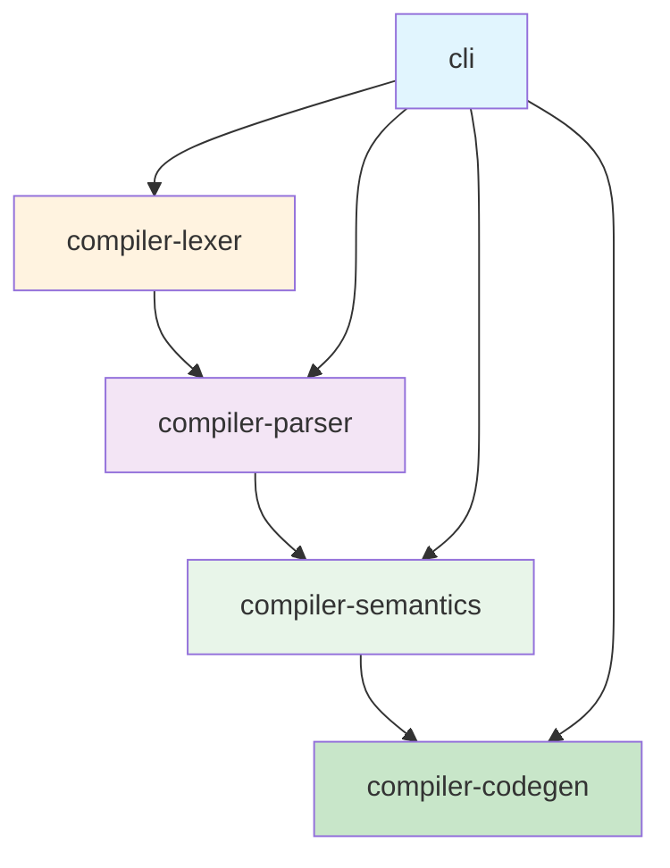
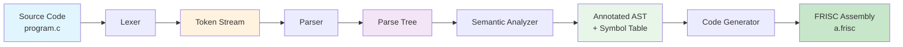

# Project Architecture

## Overview

This document provides a detailed architectural overview of the PPJ compiler project, describing the organization of modules, their responsibilities, dependencies, and interaction patterns. Understanding the architecture is essential for navigating the codebase and extending the compiler.

## Module Organization

The compiler is organized as a multi-module Maven project with strict dependency hierarchy:

### Module Dependencies

The dependency graph follows a strict linear order:

1. **compiler-lexer**: No dependencies on other compiler modules
2. **compiler-parser**: Depends on `compiler-lexer` for token definitions
3. **compiler-semantics**: Depends on `compiler-parser` for AST structures
4. **compiler-codegen**: Depends on `compiler-semantics` for symbol tables and type information
5. **cli**: Depends on all compiler modules to orchestrate the compilation pipeline

This organization ensures:
- **Testability**: Each module can be tested independently
- **Maintainability**: Changes to one module don't cascade unnecessarily
- **Clarity**: The compilation pipeline is explicit in the dependency structure

## Module Details

### compiler-lexer

**Purpose**: Performs lexical analysis (tokenization) of source code.

**Key Components**:
- `LexerSpecParser`: Parses lexer definition files (`config/lexer_definition.txt`)
- `RegexParser`: Converts regex patterns to ε-NFA using Thompson's construction
- `NFAToDFAConverter`: Converts ε-NFA to DFA using subset construction
- `Lexer`: Runtime tokenizer using generated DFAs

**Input**: Source code (`.c` files)
**Output**: Token stream (written to `compiler-bin/leksicke_jedinke.txt`)

**Key Classes**:
- `hr.fer.ppj.lexer.Lexer`: Main lexer interface
- `hr.fer.ppj.lexer.gen.LexerGenerator`: Generates DFAs from specification
- `hr.fer.ppj.lexer.state.LexerState`: Manages lexer state machine

**See Also**: [Lexical Analysis Documentation](../03-lexical-analysis/lexer-design.md)

### compiler-parser

**Purpose**: Performs syntax analysis (parsing) of token streams.

**Key Components**:
- `GrammarParser`: Parses grammar definition files (`config/parser_definition.txt`)
- `FirstSetComputer`: Computes FIRST sets for grammar symbols
- `LRTableBuilder`: Builds canonical LR(1) parsing tables
- `LRParser`: Runtime parser using generated tables
- `ParseTree`: Represents generative and syntax trees

**Input**: Token stream from lexer
**Output**: Parse trees (written to `compiler-bin/generativno_stablo.txt` and `compiler-bin/sintaksno_stablo.txt`)

**Key Classes**:
- `hr.fer.ppj.parser.Parser`: Main parser interface
- `hr.fer.ppj.parser.lr.LRParser`: LR(1) parser implementation
- `hr.fer.ppj.parser.tree.ParseTree`: Tree representation
- `hr.fer.ppj.parser.ast.*`: AST node classes

**See Also**: [Syntax Analysis Documentation](../04-syntax-analysis/grammar-specification.md)

### compiler-semantics

**Purpose**: Performs semantic analysis (type checking, scope resolution).

**Key Components**:
- `SemanticAnalyzer`: Orchestrates semantic analysis
- `SemanticChecker`: Implements semantic checking rules
- `SymbolTable`: Hierarchical symbol table for scope management
- `TypeSystem`: Type representation and compatibility checking

**Input**: Parse tree from parser
**Output**: Validated AST with type annotations (written to `compiler-bin/semanticko_stablo.txt` and `compiler-bin/tablica_simbola.txt`)

**Key Classes**:
- `hr.fer.ppj.semantics.analysis.SemanticAnalyzer`: Main semantic analyzer
- `hr.fer.ppj.semantics.symbols.SymbolTable`: Symbol table implementation
- `hr.fer.ppj.semantics.types.*`: Type system classes
- `hr.fer.ppj.semantics.tree.NonTerminalNode`: Semantic tree representation

**See Also**: [Semantic Analysis Documentation](../05-semantic-analysis/symbol-tables-and-scopes.md)

### compiler-codegen

**Purpose**: Generates FRISC assembly code from validated ASTs.

**Key Components**:
- `CodeGenerator`: Orchestrates code generation
- `FunctionCodeGenerator`: Generates function code
- `ExpressionCodeGenerator`: Generates expression code
- `StatementCodeGenerator`: Generates statement code
- `FriscEmitter`: Emits formatted FRISC assembly
- `HelperFunctionGenerator`: Generates helper functions (F_MUL, F_DIV, float helpers)

**Input**: Validated AST and symbol table from semantic analysis
**Output**: FRISC assembly code (written to `compiler-bin/a.frisc`)

**Key Classes**:
- `hr.fer.ppj.codegen.CodeGenerator`: Main code generator
- `hr.fer.ppj.codegen.CodeGenContext`: Code generation context
- `hr.fer.ppj.codegen.emitter.FriscEmitter`: Assembly emitter
- `hr.fer.ppj.codegen.func.FunctionCodeGenerator`: Function code generation
- `hr.fer.ppj.codegen.expr.*`: Expression code generators

**See Also**: [Code Generation Documentation](../07-code-generation/target-architecture-overview.md)

### cli

**Purpose**: Command-line interface for the compiler.

**Key Components**:
- `Main`: Entry point and command-line argument parsing
- `FriscRunner`: Runs generated FRISC code on simulator

**Input**: Command-line arguments, source files
**Output**: Compilation results, generated assembly, execution results

**Key Classes**:
- `hr.fer.ppj.cli.Main`: Main entry point
- `hr.fer.ppj.cli.FriscRunner`: FRISC simulator runner

## Data Flow

The compilation pipeline follows this data flow:

### Phase 1: Lexical Analysis

**Input**: Raw source code (character stream)
**Processing**: 
- Read characters from source file
- Match against DFA patterns
- Generate tokens with line numbers and lexemes
**Output**: Token stream with metadata

### Phase 2: Syntax Analysis

**Input**: Token stream from lexer
**Processing**:
- Parse tokens according to grammar
- Build generative parse tree
- Simplify to abstract syntax tree
**Output**: Parse tree (both generative and syntax trees)

### Phase 3: Semantic Analysis

**Input**: Parse tree from parser
**Processing**:
- Build symbol table hierarchy
- Resolve identifier references
- Perform type checking
- Validate semantic constraints
**Output**: Annotated AST with type information and symbol table

### Phase 4: Code Generation

**Input**: Annotated AST and symbol table
**Processing**:
- Traverse AST nodes
- Generate FRISC instructions
- Manage stack frames and registers
- Generate helper functions as needed
**Output**: Complete FRISC assembly program

## Configuration Files

The compiler uses three configuration files that define language syntax and semantics:

### config/lexer_definition.txt

Defines token patterns using regex notation and finite automata states.

**Format**:
- Macro definitions: `{name} pattern`
- State declarations: `%X state1 state2 ...`
- Token declarations: `%L TOKEN1 TOKEN2 ...`
- Lexer rules: `<state>pattern { action }`

**See Also**: [Configuration Documentation](../10-configuration/config-file-reference.md)

### config/parser_definition.txt

Defines context-free grammar in BNF-like notation.

**Format**:
- Non-terminal declarations: `%V <nonterm1> <nonterm2> ...`
- Terminal declarations: `%T TOKEN1 TOKEN2 ...`
- Synchronization tokens: `%Syn TOKEN1 TOKEN2 ...`
- Productions: `<nonterm> ::= alternative1 | alternative2 ...`

**See Also**: [Grammar Specification](../04-syntax-analysis/grammar-specification.md)

### config/semantics_definition.txt

Defines semantic rules and type system constraints.

**Format**: Semantic rule specifications (see configuration documentation)

**See Also**: [Semantic Analysis Documentation](../05-semantic-analysis/type-system-and-checking.md)

## Build System

The compiler uses Maven for build management:

### Root POM (`pom.xml`)

Defines:
- Java version (21)
- Maven compiler plugin configuration
- Shared dependencies
- Module aggregation

### Module POMs

Each module has its own `pom.xml` that:
- Declares parent POM
- Defines module-specific dependencies
- Configures testing and code quality plugins

### Build Scripts

- `build.sh`: Comprehensive build script that compiles, tests, and performs quality checks
- `run.sh`: Convenience script for running the compiler

## Testing Strategy

Each module includes comprehensive unit tests:

- **compiler-lexer**: Tests for token recognition, error handling, state transitions
- **compiler-parser**: Tests for grammar parsing, table generation, parse tree construction
- **compiler-semantics**: Tests for type checking, scope resolution, error detection
- **compiler-codegen**: Tests for code generation correctness, register allocation, stack management

Integration tests verify end-to-end compilation of example programs.

**See Also**: [Testing Documentation](../11-testing-and-tooling/test-strategy.md)

## Extension Points

The architecture provides several extension points:

1. **New Token Types**: Add patterns to `config/lexer_definition.txt`
2. **Grammar Extensions**: Add productions to `config/parser_definition.txt`
3. **Semantic Rules**: Add rules to `config/semantics_definition.txt`
4. **Code Generation**: Extend code generators for new language constructs
5. **Optimizations**: Add optimization passes between semantic analysis and code generation

## Design Patterns

The compiler uses several design patterns:

- **Visitor Pattern**: AST traversal in semantic analysis and code generation
- **Builder Pattern**: Construction of complex objects (parse trees, symbol tables)
- **Factory Pattern**: Creation of AST nodes and code generators
- **Strategy Pattern**: Different code generation strategies for different expression types
- **Facade Pattern**: Simplified interfaces for complex subsystems (e.g., `SemanticAnalyzer`)

## Further Reading

- **[Introduction Overview](overview.md)**: Project overview
- **[Lexical Analysis](../03-lexical-analysis/lexer-design.md)**: Lexer architecture
- **[Syntax Analysis](../04-syntax-analysis/parser-construction.md)**: Parser architecture
- **[Semantic Analysis](../05-semantic-analysis/symbol-tables-and-scopes.md)**: Semantic analyzer architecture
- **[Code Generation](../07-code-generation/instruction-selection.md)**: Code generator architecture

---

*This architecture ensures maintainability, testability, and extensibility while providing a clear separation of concerns across compiler phases.*
