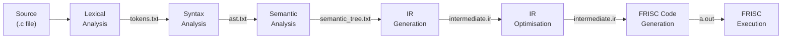
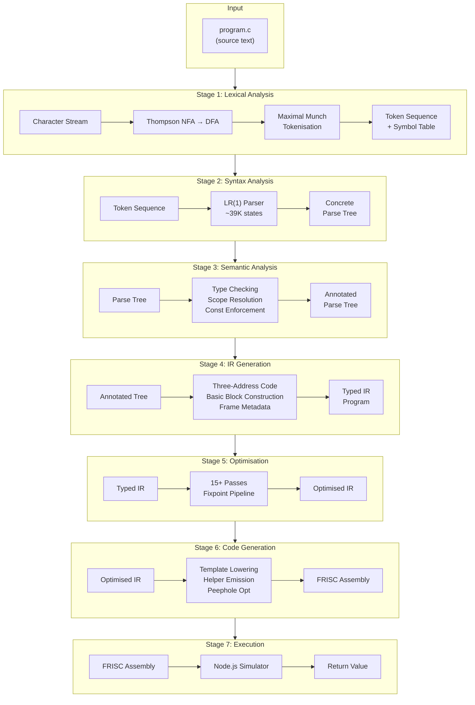
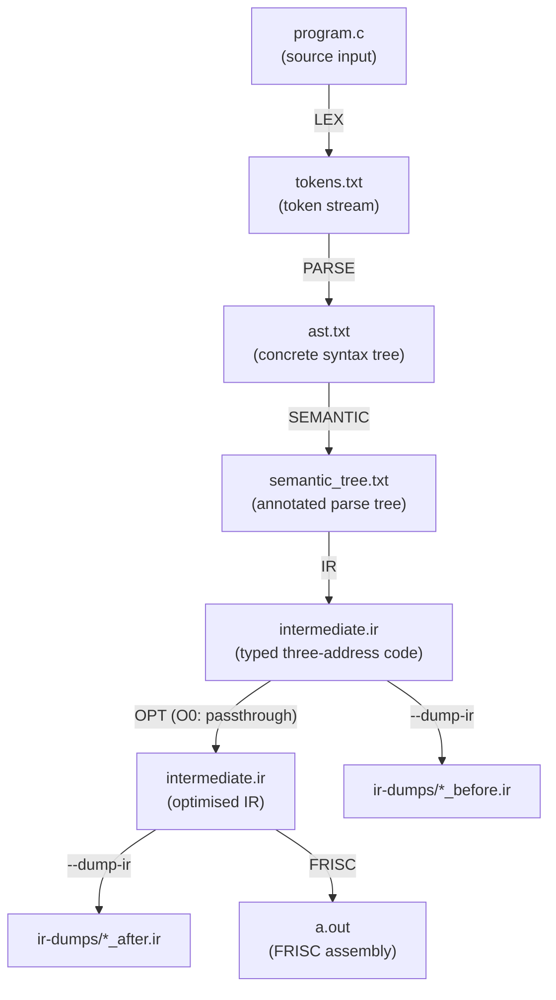
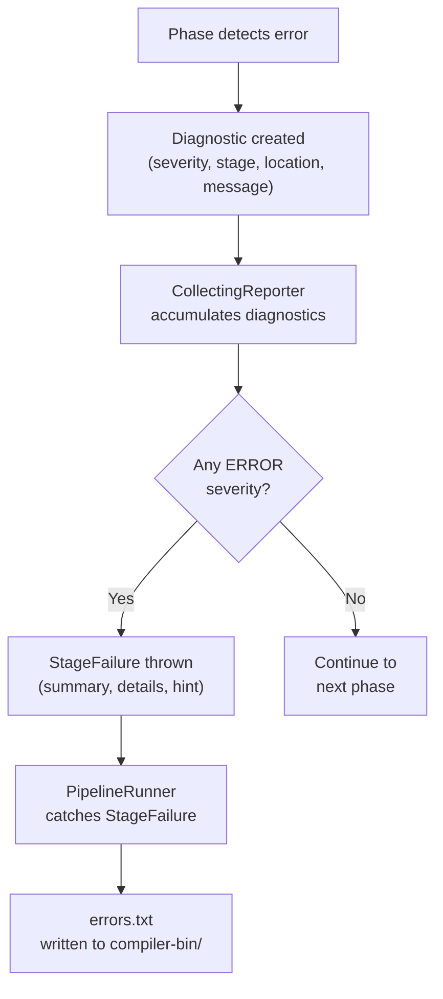
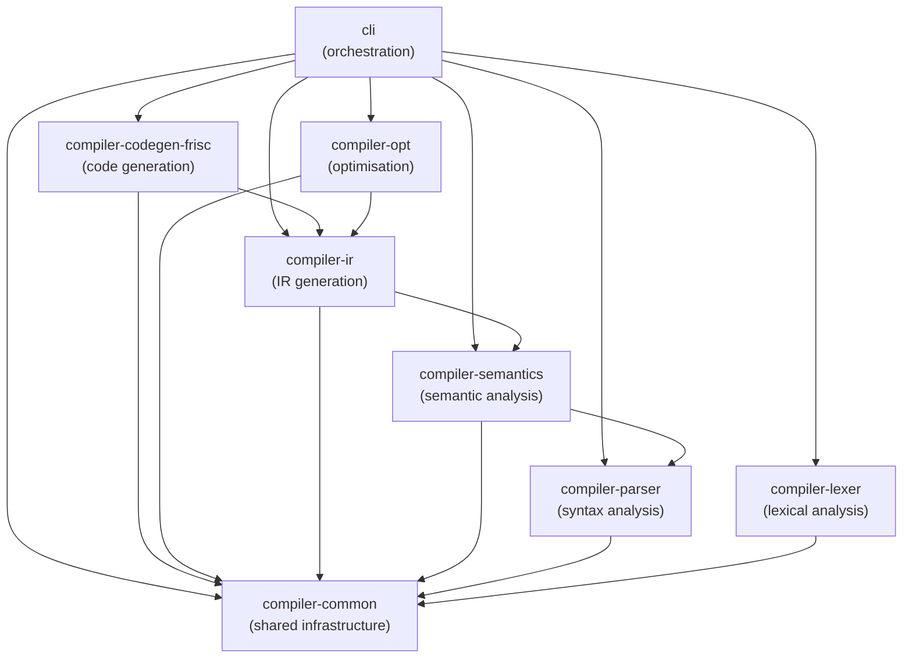
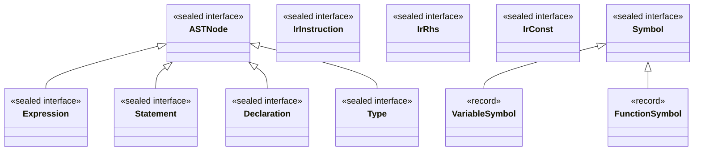

## 1.1 Purpose and Scope

FRISCcc is a self-contained compiler that translates a deterministic subset of the C programming language into assembly code for the FRISC processor, a 32-bit RISC architecture designed at the Faculty of Electrical Engineering and Computing (FER), University of Zagreb. The compiler is implemented in Java 21 as a Maven multi-module project under the package hierarchy `hr.fer.ppj`, and it encompasses every phase of a classical compilation pipeline: lexical analysis, syntax analysis, semantic analysis, intermediate representation generation, optimisation, and target code generation. \index{FRISCcc} \index{FRISC} \index{compilation pipeline}

The project serves two interlocking purposes. The first is educational: it provides a concrete, end-to-end implementation of the theoretical concepts that underpin courses in formal languages, automata theory, and compiler construction. Each compilation phase is isolated in its own module, with explicit input contracts and inspectable output artifacts, so that students and researchers can observe the transformation from source text to executable assembly at every stage. The second purpose is engineering: the compiler is designed with sufficient rigour to compile non-trivial programs -- sorting algorithms, graph traversals, numerical methods, signal processing routines -- and execute them on a FRISC simulator, producing correct, deterministic results.

FRISCcc is not a production-grade C compiler. It does not implement the full ISO C standard, it does not target a commercially deployed processor, and it does not include a preprocessor or linker. What it does provide is a complete, transparent, and verifiable chain from source code to machine code, in which every intermediate form is explicit, every type annotation is preserved, and every transformation can be audited. This transparency is the compiler's defining characteristic and the principal motivation for its design. \index{transparency}

The source language accepted by FRISCcc is a carefully chosen subset of C that is rich enough to express interesting algorithms yet constrained enough to permit clean, unambiguous semantics. The target language is FRISC assembly, a load-store instruction set with eight general-purpose registers, a flat memory model, and a two-stage pipeline. The compiler bridges these two worlds through a fully typed intermediate representation that serves as the contract between the front end (analysis) and the back end (synthesis). \index{intermediate representation}

This book documents the complete compiler in the order of its pipeline stages. It is intended to be read both as a technical reference for the implementation and as a companion text to a university course on compiler construction. The presentation is formal where precision demands it and practical where understanding demands an example. Every chapter contains references to the relevant source files, configuration artifacts, and test programs, so that the reader can move fluidly between the prose and the code.

### 1.1.1 Project Scale

To orient the reader regarding the scope of the implementation, the following statistics summarise the FRISCcc codebase:

| Metric                          | Value              |
|---------------------------------|--------------------|
| Total Java source lines         | ~40,000            |
| Total Java classes and records  | 300+               |
| Maven modules                   | 8                  |
| Configuration files             | 4                  |
| Test programs                   | 521                |
| Real-world algorithm examples   | 30                 |
| LR(1) parser states             | ~39,000            |
| Optimisation passes             | 15+                |
| IR instruction types            | 20+                |

These numbers reflect a compiler that, while educational in intent, is substantial in scope. The 521 test programs exercise every language feature and every pipeline stage, and the 30 real-world algorithms demonstrate that the compiler can handle programs of genuine algorithmic complexity.


## 1.2 The Source Language

### 1.2.1 Overview

The source language accepted by FRISCcc is a strict, deterministic subset of C. It is not defined by an independent language specification; rather, it is defined implicitly by the lexer token definitions in `config/lexer_definition.txt`, the context-free grammar in `config/parser_definition.txt`, and the semantic rules encoded in the `compiler-semantics` module. Together, these three artifacts constitute the complete formal specification of the language. \index{source language} \index{lexer definition} \index{parser definition}

Programs in this subset are self-contained: they do not depend on the C standard library, they do not use a preprocessor, and they do not link against external object files. Every program must contain a function named `main` that returns an `int`. The return value of `main` is the observable output of the program when executed on the FRISC simulator.

### 1.2.2 Primitive Types

The language supports three primitive scalar types: \index{primitive types}

| Type    | Semantics                   | IR Representation | Size    |
|---------|-----------------------------|-------------------|---------|
| `int`   | 32-bit signed integer       | `int32`           | 4 bytes |
| `char`  | 8-bit character / small int | `char`            | 1 byte  |
| `float` | Q16.16 fixed-point          | `float`           | 4 bytes |

The `int` type is a 32-bit two's complement signed integer. It is the default type for integer arithmetic and the return type of `main`. The `char` type is an 8-bit value that can represent ASCII characters and small integers; it participates in integer arithmetic through implicit promotion to `int`. The `float` type is represented internally as a Q16.16 fixed-point number -- 16 bits of integer part and 16 bits of fractional part, packed into a 32-bit word -- rather than as an IEEE 754 floating-point value. This representation permits floating-point-like arithmetic on an integer-only target architecture without hardware floating-point support. \index{Q16.16} \index{fixed-point}

The `void` type exists as a return type for functions that produce no value. It cannot be used as a variable type, and it cannot appear in expressions. \index{void}

The following example demonstrates each primitive type in use:

```c
int main(void) {
    int count = 42;
    char letter = 'A';
    float ratio = 3.14;
    int result;

    result = count + (int)letter;   /* char promoted to int */
    result = result + (int)ratio;   /* float truncated to int */
    return result;
}
```

### 1.2.3 Derived Types

Three categories of derived types extend the primitive type system: \index{derived types}

**Pointers.** A pointer type `T*` holds the address of a value of type `T`. Pointer arithmetic is not directly supported in the source language as a general facility, but array indexing (which is semantically equivalent to pointer arithmetic plus dereference) is fully supported. The address-of operator `&` produces a pointer to a named variable, and the dereference operator `*` recovers the value at a pointer address. Pointers may be qualified with `const`, yielding types such as `const int*` (pointer to constant integer) and `int * const` (constant pointer to integer). \index{pointers}

The following program demonstrates pointer operations:

```c
int main(void) {
    int x = 10;
    int y = 20;
    int *p = &x;
    int *q = &y;
    int sum;

    *p = *p + *q;    /* x becomes 30 via pointer dereference */
    sum = x + y;     /* sum = 30 + 20 = 50 */
    p = q;           /* p now points to y */
    *p = 100;        /* y becomes 100 */
    return x + y;    /* returns 30 + 100 = 130 */
}
```

**Arrays.** An array type `T[N]` represents a contiguous sequence of `N` values of type `T`, where `N` is a compile-time constant. Arrays may be declared at global scope or as local variables within functions. In most expression contexts, an array decays to a pointer to its first element, following standard C semantics. Array elements are accessed via the subscript operator `[]`. Multi-dimensional arrays are not directly supported, but equivalent functionality can be achieved through arrays of pointers or manual index calculation. \index{arrays}

The following program demonstrates array operations including initialisation, indexing, and passing arrays to functions:

```c
int data[5] = {10, 20, 30, 40, 50};

int sum(int *arr, int n) {
    int total = 0;
    int i;
    for (i = 0; i < n; i++) {
        total = total + arr[i];
    }
    return total;
}

int main(void) {
    return sum(data, 5);    /* returns 150 */
}
```

**Structs.** A struct type groups a fixed set of named fields into a single aggregate value. Structs may be declared with a tag name (`struct Point { int x; int y; }`) or anonymously. Fields are accessed using the dot operator (`.`). Struct variables may be declared at any scope, and structs may contain fields of any supported type, including pointers to the struct type itself (enabling recursive data structures such as linked lists and trees). The semantic analyser computes field offsets and total struct size, and the IR encodes these offsets explicitly. \index{structs}

The following program demonstrates struct definition, field access, nested structs, and passing structs to functions:

```c
struct Inner {
    int arr[2];
    int value;
};

struct Outer {
    struct Inner inner;
    int base;
};

int compute(struct Outer o) {
    return o.inner.arr[0] + o.inner.arr[1] + o.inner.value + o.base;
}

int main(void) {
    struct Outer o1;
    struct Outer o2;
    o1.inner.arr[0] = 1;
    o1.inner.arr[1] = 2;
    o1.inner.value = 3;
    o1.base = 4;
    o2 = o1;              /* struct copy */
    return compute(o2);   /* returns 1 + 2 + 3 + 4 = 10 */
}
```

Recursive data structures are supported through struct self-references via pointers:

```c
struct Node {
    int value;
    struct Node *next;
};
```

### 1.2.4 Type Qualifiers

The `const` qualifier may be applied to any type to indicate that the qualified value is immutable after initialisation. The semantic analyser enforces const-correctness: an assignment to a `const`-qualified variable is a compile-time error. Const qualification interacts with pointers in the standard C manner: \index{const qualifier}

- `const int x = 5;` declares an immutable integer.
- `const int *p` declares a pointer to a constant integer (the pointed-to value cannot be modified through `p`).
- `int * const p` declares a constant pointer (the pointer itself cannot be reassigned).

### 1.2.5 Operators

The language supports the following operator categories, listed in order of decreasing precedence as encoded in the grammar: \index{operators} \index{precedence}

| Category         | Operators                                  | Associativity |
|------------------|--------------------------------------------|---------------|
| Postfix          | `[]`, `()`, `.`, `++`, `--`                | Left-to-right |
| Unary prefix     | `++`, `--`, `&`, `*`, `+`, `-`, `~`, `!`  | Right-to-left |
| Cast             | `(type)`                                   | Right-to-left |
| Multiplicative   | `*`, `/`, `%`                              | Left-to-right |
| Additive         | `+`, `-`                                   | Left-to-right |
| Relational       | `<`, `>`, `<=`, `>=`                       | Left-to-right |
| Equality         | `==`, `!=`                                 | Left-to-right |
| Bitwise AND      | `&`                                        | Left-to-right |
| Bitwise XOR      | `^`                                        | Left-to-right |
| Bitwise OR       | `\|`                                       | Left-to-right |
| Logical AND      | `&&`                                       | Left-to-right |
| Logical OR       | `\|\|`                                     | Left-to-right |
| Assignment       | `=`                                        | Right-to-left |
| Comma            | `,`                                        | Left-to-right |

The arithmetic operators `+`, `-`, `*`, `/`, `%` operate on integer and float operands with appropriate type promotion. The bitwise operators `&`, `^`, `|`, `~` operate on integer operands only. The logical operators `&&` and `||` implement short-circuit evaluation: the right operand is evaluated only if the left operand does not determine the result. The increment and decrement operators `++` and `--` exist in both prefix and postfix forms and require an lvalue operand. The assignment operator `=` is the sole assignment operator; compound assignment operators (`+=`, `-=`, etc.) are not supported. \index{short-circuit evaluation}

### 1.2.6 Control Flow

The language provides the standard structured control-flow constructs of C: \index{control flow}

**Conditional execution.** The `if` statement supports both the single-branch form (`if (expr) stmt`) and the two-branch form (`if (expr) stmt else stmt`). The `else` clause associates with the nearest unmatched `if`, following the standard dangling-else resolution encoded in the grammar. \index{if statement}

**Iteration.** Two loop forms are supported. The `while` loop (`while (expr) stmt`) evaluates its condition before each iteration. The `for` loop (`for (init; cond; update) stmt`) provides initialisation, condition, and update expressions; the initialisation and update expressions are optional. \index{while loop} \index{for loop}

**Transfer of control.** The `break` statement exits the innermost enclosing loop. The `continue` statement skips to the next iteration of the innermost enclosing loop. The `return` statement exits the current function, optionally providing a return value. The semantic analyser verifies that `break` and `continue` appear only within loops, and that `return` values are type-compatible with the function's declared return type. \index{break} \index{continue} \index{return}

The following program demonstrates nested control flow with `for`, `while`, `if/else`, `break`, and `continue`:

```c
int main(void) {
    int total = 0;
    int i;
    int j;

    for (i = 1; i <= 10; i++) {
        if (i % 2 == 0)
            continue;           /* skip even numbers */

        j = i;
        while (j > 0) {
            if (j == 3)
                break;          /* stop inner loop early */
            total = total + j;
            j--;
        }
    }
    return total;
}
```

### 1.2.7 Functions

Functions are declared and defined at the top level of a translation unit. A function declaration specifies the function's name, parameter types, and return type. A function definition additionally provides the function body as a compound statement. The language requires that a function named `main` exist and return `int`; this function is the program entry point. \index{functions}

Function parameters are passed by value. Arrays passed as parameters decay to pointers. Functions may be recursive, and mutual recursion is supported provided appropriate forward declarations exist. Variadic functions are not supported.

The following program demonstrates forward declarations, recursion, and multiple functions:

```c
int isEven(int n);
int isOdd(int n);

int isEven(int n) {
    if (n == 0) return 1;
    return isOdd(n - 1);
}

int isOdd(int n) {
    if (n == 0) return 0;
    return isEven(n - 1);
}

int main(void) {
    return isEven(10);   /* returns 1 (true) */
}
```

### 1.2.8 Struct Definitions

Structs are defined using the `struct` keyword followed by an optional tag name and a brace-enclosed list of field declarations: \index{struct definition}

```c
struct Point {
    int x;
    int y;
};
```

Fields may be of any supported type, including pointers to struct types. Struct variables are declared using the struct type specifier:

```c
struct Point p;
p.x = 10;
p.y = 20;
```

Tagged structs may be referenced by tag name throughout the translation unit, enabling forward references and recursive data structures:

```c
struct Node {
    int value;
    struct Node *next;
};
```

### 1.2.9 Complete Example Programs

The following programs illustrate the full breadth of the source language.

**Sieve of Eratosthenes.** This program exercises global arrays, loops, conditionals, increment operators, and nested control flow. It counts the prime numbers up to 200:

```c
char isPrime[201];

int main(void) {
    int i;
    int p;
    int count = 0;

    for (i = 0; i <= 200; i++) {
        isPrime[i] = 1;
    }
    isPrime[0] = 0;
    isPrime[1] = 0;

    p = 2;
    while (p * p <= 200) {
        if (isPrime[p]) {
            int j = p * p;
            while (j <= 200) {
                isPrime[j] = 0;
                j = j + p;
            }
        }
        p++;
    }

    for (i = 2; i <= 200; i++) {
        if (isPrime[i]) {
            count++;
        }
    }

    return count;
}
```

When compiled and executed, this program returns 46, the number of primes less than or equal to 200.

**PID Controller.** This program implements a discrete PID controller, demonstrating arrays, arithmetic, and loop-based simulation. It exercises integer multiplication and accumulation:

```c
int errors[6] = {5, 4, 3, 2, 1, 0};

int main(void) {
    int kp = 2;
    int ki = 1;
    int kd = 1;
    int prev = 0;
    int sum = 0;
    int total = 0;
    int i;

    for (i = 0; i < 6; i++) {
        int e = errors[i];
        int u;
        sum = sum + e;
        u = kp * e + ki * sum + kd * (e - prev);
        total = total + u;
        prev = e;
    }

    return total;
}
```

When compiled and executed, this program returns 100.

**BFS Shortest Path.** This program implements breadth-first search on an 8-by-8 grid, demonstrating global array initialisation, nested loops, multiple conditionals, and short-circuit evaluation with `&&`:

```c
int grid[64] = {
    0, 0, 0, 0, 0, 1, 0, 0,
    1, 1, 0, 1, 0, 1, 0, 1,
    0, 0, 0, 1, 0, 0, 0, 0,
    0, 1, 1, 1, 1, 1, 0, 1,
    0, 0, 0, 0, 0, 0, 0, 0,
    1, 1, 0, 1, 1, 0, 1, 0,
    0, 0, 0, 0, 1, 0, 0, 0,
    0, 1, 1, 0, 0, 0, 1, 0
};

int dist[64];
int qx[64];
int qy[64];

int main(void) {
    int i;
    int head = 0;
    int tail = 0;

    for (i = 0; i < 64; i++) {
        dist[i] = -1;
    }

    if (grid[0] == 0) {
        dist[0] = 0;
        qx[tail] = 0;
        qy[tail] = 0;
        tail++;
    }

    while (head < tail) {
        int x;
        int y;
        int d;
        int nx;
        int ny;
        int idx;

        x = qx[head];
        y = qy[head];
        d = dist[x * 8 + y];
        head++;

        if (x > 0) {
            nx = x - 1;
            ny = y;
            idx = nx * 8 + ny;
            if (grid[idx] == 0 && dist[idx] == -1) {
                dist[idx] = d + 1;
                qx[tail] = nx;
                qy[tail] = ny;
                tail++;
            }
        }
        if (x < 7) {
            nx = x + 1;
            ny = y;
            idx = nx * 8 + ny;
            if (grid[idx] == 0 && dist[idx] == -1) {
                dist[idx] = d + 1;
                qx[tail] = nx;
                qy[tail] = ny;
                tail++;
            }
        }
        if (y > 0) {
            nx = x;
            ny = y - 1;
            idx = nx * 8 + ny;
            if (grid[idx] == 0 && dist[idx] == -1) {
                dist[idx] = d + 1;
                qx[tail] = nx;
                qy[tail] = ny;
                tail++;
            }
        }
        if (y < 7) {
            nx = x;
            ny = y + 1;
            idx = nx * 8 + ny;
            if (grid[idx] == 0 && dist[idx] == -1) {
                dist[idx] = d + 1;
                qx[tail] = nx;
                qy[tail] = ny;
                tail++;
            }
        }
    }

    return dist[7 * 8 + 7];
}
```

This program exercises global array initialisation with 64 elements, queue-based iteration, four-directional neighbour traversal, and manual 2D-to-1D index calculation. It returns the shortest path length from cell (0,0) to cell (7,7) on the grid.

### 1.2.10 Feature Summary

The following table summarises the supported and unsupported features relative to ISO C: \index{feature summary}

| Feature                        | Supported | Notes                                    |
|--------------------------------|-----------|------------------------------------------|
| `int`, `char`, `float` types   | Yes       | float is Q16.16 fixed-point              |
| `void` return type             | Yes       |                                          |
| Pointers                       | Yes       | Including pointer-to-pointer             |
| Arrays                         | Yes       | Fixed-size, single-dimension             |
| Structs                        | Yes       | Including recursive via pointers         |
| `const` qualifier              | Yes       |                                          |
| Arithmetic operators           | Yes       | `+`, `-`, `*`, `/`, `%`                  |
| Comparison operators           | Yes       | `<`, `>`, `<=`, `>=`, `==`, `!=`         |
| Logical operators              | Yes       | `&&`, `\|\|`, `!` with short-circuit     |
| Bitwise operators              | Yes       | `&`, `\|`, `^`, `~`                      |
| Increment / decrement          | Yes       | Prefix and postfix                       |
| Explicit casts                 | Yes       | Between numeric types and pointers       |
| `if` / `else`                  | Yes       |                                          |
| `while` loop                   | Yes       |                                          |
| `for` loop                     | Yes       |                                          |
| `break`, `continue`            | Yes       |                                          |
| `return`                       | Yes       |                                          |
| Functions with parameters      | Yes       | Pass by value; arrays decay to pointers  |
| Recursion                      | Yes       | Including mutual recursion               |
| Global variables               | Yes       |                                          |
| String literals                | Yes       | As `char` array initialisers             |
| Character literals             | Yes       | Including escape sequences               |
| Hexadecimal integer literals   | Yes       | `0x` prefix                              |
| Float literals                 | Yes       | Decimal with optional exponent           |
| Comments                       | Yes       | `//` and `/* ... */`                     |
| Preprocessor (`#include`, etc.)| No        | Programs are self-contained              |
| `unsigned`, `long`, `short`    | No        |                                          |
| `double`                       | No        |                                          |
| `enum`, `union`, `typedef`     | No        |                                          |
| Compound assignment (`+=` etc.)| No        |                                          |
| Ternary operator `?:`          | No        |                                          |
| `switch` / `case`              | No        |                                          |
| `do` / `while`                 | No        |                                          |
| `goto`                         | No        |                                          |
| Variadic functions             | No        |                                          |
| Multi-dimensional arrays       | No        |                                          |
| Function pointers              | No        |                                          |
| Dynamic memory allocation      | No        | No `malloc` / `free`                     |
| Standard library               | No        | No `stdio.h`, `stdlib.h`, etc.           |


## 1.3 The Compilation Pipeline

### 1.3.1 Phase Architecture

FRISCcc implements a classical multi-phase compilation pipeline in which each phase reads a well-defined input, applies a specific class of transformations or analyses, and produces a well-defined output artifact. The phases execute in strict sequential order, and each phase's output is the sole input to the next phase. This sequential discipline ensures that concerns are cleanly separated: lexical concerns do not leak into parsing, parsing does not anticipate semantic constraints, and the back end operates exclusively on the intermediate representation without reference to the source text. \index{phase architecture} \index{pipeline}

The pipeline consists of seven stages, orchestrated by the `PipelineRunner` class in the `cli` module:



The following diagram provides a more detailed view of each phase, showing the specific inputs and outputs, the module responsible, and the key transformations applied:



### 1.3.2 Mapping Pipeline Stages to Maven Modules

Each pipeline stage is implemented by a dedicated Maven module. The following table establishes the correspondence between the logical stages of the compilation pipeline and the physical modules in the repository: \index{Maven modules}

| Pipeline Stage     | Maven Module              | Entry Class                     | Configuration File             |
|--------------------|---------------------------|---------------------------------|--------------------------------|
| Lexical Analysis   | `compiler-lexer`          | `LexerGenerator`, `Lexer`      | `config/lexer_definition.txt`  |
| Syntax Analysis    | `compiler-parser`         | `Parser`                        | `config/parser_definition.txt` |
| Semantic Analysis  | `compiler-semantics`      | `SemanticAnalyzer`              | `config/semantics_definition.txt` |
| IR Generation      | `compiler-ir`             | `IrPipeline`                    | `config/ir_definition.txt`     |
| IR Optimisation    | `compiler-opt`            | `IrOptimizer`                   | (programmatic)                 |
| FRISC Code Gen     | `compiler-codegen-frisc`  | `FriscCodeGenerator`            | (programmatic)                 |
| Orchestration      | `cli`                     | `PipelineRunner`                | (CLI flags)                    |
| Shared Types       | `compiler-common`         | `Diagnostic`, `Stage`, `Severity` | --                          |

The `compiler-common` module does not implement a pipeline stage; it provides the shared infrastructure (diagnostic types, source location records, severity enumerations) that all other modules depend upon. The `cli` module does not perform any compilation logic itself; it instantiates the stage implementations, computes the pipeline plan, and sequences their execution.

### 1.3.3 Stage Descriptions

**Stage 1: Lexical Analysis (LEX).** \index{lexical analysis} The lexer reads the source file as a stream of characters and partitions it into a sequence of tokens. Each token carries a type (e.g., `IDN`, `BROJ`, `KR_IF`), a lexeme (the matched character sequence), and a line number. The lexer is driven by a deterministic finite automaton (DFA) constructed from regular expression specifications in `config/lexer_definition.txt`. It implements the maximal munch strategy to resolve ambiguities between overlapping patterns, and it supports multiple lexer states (e.g., `S_pocetno`, `S_komentar`, `S_jednolinijskiKomentar`, `S_string`) to handle context-dependent tokenisation of comments and string literals. The lexer also maintains a symbol table that records all identifiers and literals encountered during tokenisation. The output artifact is `compiler-bin/tokens.txt`.

**Stage 2: Syntax Analysis (PARSE).** \index{syntax analysis} \index{LR(1) parser} The parser consumes the token sequence produced by the lexer and constructs a parse tree according to the context-free grammar specified in `config/parser_definition.txt`. The parser is a canonical LR(1) parser with approximately 39,000 states, generated from the grammar at compile time. The grammar defines 47 nonterminal symbols and 46 terminal symbols, covering expressions, declarations, statements, and function definitions. The parse tree is a concrete syntax tree that preserves every token and every grammar production; it is subsequently converted to a more abstract representation for semantic analysis. The output artifact is `compiler-bin/ast.txt`.

**Stage 3: Semantic Analysis (SEMANTIC).** \index{semantic analysis} The semantic analyser traverses the parse tree and performs type checking, scope resolution, and constraint verification. It constructs a hierarchical symbol table in which each scope (global, function, block) maintains a mapping from identifiers to their types and properties. The analyser verifies type compatibility for assignments, function calls, and expressions; it checks that variables are declared before use; it ensures that `break` and `continue` appear only within loops; and it validates that every function's return statements are type-compatible with its declared return type. The type system supports primitive types (`int`, `char`, `float`), derived types (pointers, arrays, structs), and `const` qualification. Implicit type promotions follow the chain `char` to `int` to `float`. The output artifact is `compiler-bin/semantic_tree.txt`, which is the parse tree annotated with type and scope information.

**Stage 4: IR Generation (IR).** \index{IR generation} The IR generator lowers the semantically annotated parse tree into a typed intermediate representation. The IR is a three-address code organised into basic blocks within functions. Every value in the IR carries an explicit type annotation; every control-flow transfer is represented by an explicit terminator instruction (`br`, `jmp`, `ret`); and every local variable, parameter, and spill slot is described by an explicit slot declaration with a byte offset within the function's stack frame. The IR is defined by a formal grammar in `config/ir_definition.txt` and is verified by the `IrVerifier` after generation. The textual form of the IR is written to `compiler-bin/intermediate.ir`.

**Stage 5: IR Optimisation (OPT).** \index{optimisation} The optimiser applies a sequence of IR-to-IR transformation passes that preserve the program's observable behaviour while reducing instruction count, eliminating redundant computation, and simplifying control flow. At optimisation level `O0`, the optimiser is bypassed entirely (the IR passes through unchanged). At level `O1`, the optimiser executes a pipeline of approximately 18 passes including constant folding, algebraic simplification, common subexpression elimination, copy propagation, dead code elimination, loop-invariant code motion, strength reduction, and function inlining. The optimised IR replaces the original IR in `compiler-bin/intermediate.ir`; if the `--dump-ir` flag is specified, the pre-optimisation and post-optimisation IR are written to separate files for comparison.

**Stage 6: FRISC Code Generation (FRISC).** \index{code generation} The code generator lowers the typed IR into FRISC assembly. It applies a template-based lowering strategy in which each IR instruction is expanded into a fixed sequence of FRISC instructions. The code generator uses a fixed register convention: `R7` is the stack pointer, `R5` is the frame pointer, `R6` holds function return values, and `R0` is the primary expression result register. Integer multiplication, division, and modulo are implemented as software helper routines (`F_MUL`, `F_DIV`, `F_MOD`) because FRISC lacks hardware multiply and divide instructions. Q16.16 floating-point arithmetic is similarly implemented through helper routines. A peephole optimiser (`FriscPeepholeOptimizer`) makes a final pass over the generated assembly to eliminate redundant load-store sequences and simplify instruction patterns. The output artifact is `compiler-bin/a.out`.

**Stage 7: FRISC Execution (RUN).** When the `--run` flag is specified, the CLI invokes a FRISC simulator (implemented in JavaScript via Node.js) to execute the generated assembly program. The simulator loads the assembly file, executes it instruction by instruction, and reports the program's output and return value. This stage is optional and is not part of the compilation pipeline proper; it is a convenience for end-to-end testing and demonstration.

### 1.3.4 Compilation Artifact Flow

The following diagram traces the concrete file artifacts produced at each stage. Each artifact is a plain-text file written to the `compiler-bin/` output directory:



When the `--dump-ir` flag is active and optimisation is enabled (`--O1`), the pipeline additionally writes snapshot files into `compiler-bin/ir-dumps/`, enabling side-by-side comparison of the IR before and after optimisation. These dump files include the source file name and timestamps in their filenames for traceability.

In addition to the stage artifacts, a failure at any stage produces `compiler-bin/errors.txt`, a structured error report that replaces all other artifacts. This ensures that stale artifacts from a previous successful run are never confused with the output of a failed compilation.

### 1.3.5 Phase Contracts

Each pipeline stage operates under a strict input-output contract. If the contract's precondition is violated -- because the input from the preceding stage is malformed or absent -- the stage reports a structured diagnostic and halts the pipeline. If the contract's postcondition is satisfied, the stage produces its output artifact and control passes to the next stage. \index{phase contracts}

| Stage    | Input                     | Output                        | Failure Mode           |
|----------|---------------------------|-------------------------------|------------------------|
| LEX      | Source file (`.c`)        | `tokens.txt`                  | Lexical error          |
| PARSE    | Token sequence            | `ast.txt`                     | Syntax error           |
| SEMANTIC | Parse tree                | `semantic_tree.txt`           | Semantic error         |
| IR       | Annotated parse tree      | `intermediate.ir`             | IR generation error    |
| OPT      | IR program                | `intermediate.ir` (optimised) | Optimisation error     |
| FRISC    | IR program (text)         | `a.out`                       | Code generation error  |
| RUN      | FRISC assembly (`a.out`)  | Simulator output              | Runtime error          |

If any stage fails, the pipeline halts immediately and writes a structured error report to `compiler-bin/errors.txt`. The report includes the failing stage, the timestamp, the source file path, the diagnostic messages, and a hint describing the expected input for the failing stage. Later stages are never executed, and no partial artifacts from the failing stage are left in the output directory. This fail-fast design ensures that error diagnosis is never complicated by cascading failures across phase boundaries.

### 1.3.6 Contract Composition and Formal Guarantees

The pipeline's correctness rests on a compositional argument. Let each stage $S_i$ be characterised by a precondition $P_i$ on its input and a postcondition $Q_i$ on its output. The pipeline satisfies the following properties:

1. **Precondition chain.** For every adjacent pair of stages $S_i$ and $S_{i+1}$, the postcondition of $S_i$ implies the precondition of $S_{i+1}$: $Q_i \Rightarrow P_{i+1}$. This is enforced by the fact that stage $S_{i+1}$ reads only the artifact produced by $S_i$, and that artifact is the sole medium of communication between stages.

2. **Monotonic failure.** If stage $S_i$ fails (i.e., its precondition $P_i$ is not satisfied or an internal error occurs), then no stage $S_j$ with $j > i$ is executed. This is implemented by the `PipelineRunner`'s sequential execution loop, which catches `StageFailure` exceptions and halts.

3. **Artifact isolation.** Each stage writes to its designated output file. No stage reads the output of a non-adjacent predecessor. In particular, the code generator reads only `intermediate.ir`; it never inspects `tokens.txt`, `ast.txt`, or `semantic_tree.txt`.

4. **Deterministic reproduction.** Given identical inputs and compiler version, each stage produces byte-identical outputs. This permits golden-file testing where the expected output of each stage is stored as a reference file and compared against the actual output.

These four properties together ensure that the pipeline behaves as a pure function from source file to assembly file (or to a structured error report), with no hidden state and no order-dependent side effects.

### 1.3.7 Stage Implication

The CLI supports running individual stages or subsets of the pipeline. When a later stage is requested, all prerequisite stages are automatically included. For instance, requesting `--frisc` implies `--lex`, `--parse`, `--sem`, `--ir`, and `--opt` (if optimisation is enabled). The `--all` flag requests all compilation stages. The `--run` flag additionally requests execution after compilation.

Formally, let the stages be ordered as $\texttt{LEX} < \texttt{PARSE} < \texttt{SEMANTIC} < \texttt{IR} < \texttt{OPT} < \texttt{FRISC} < \texttt{RUN}$. If the user requests stage $S_k$, the pipeline executes all stages $S_i$ such that $S_i \leq S_k$. This transitive closure is computed by the `PipelinePlan` record before execution begins. The `PipelinePlan.from(CliOptions)` factory method resolves the requested stages into a canonical ordered list using an `EnumSet` and the `PipelineStage.orderedCompileStages()` ordering.


## 1.4 The Target Architecture

### 1.4.1 FRISC Overview

FRISC (FER RISC) is a 32-bit RISC processor architecture designed as a teaching tool at the University of Zagreb. It is not a commercially manufactured processor; rather, it exists as a software simulator that faithfully models a simple load-store architecture with a two-stage instruction pipeline. FRISC provides a minimal yet complete execution environment in which the consequences of architectural decisions -- register allocation, stack frame layout, calling conventions, branch penalties -- can be studied without the complexity of a modern superscalar processor. \index{FRISC}

### 1.4.2 Register File

FRISC provides eight 32-bit general-purpose registers, designated `R0` through `R7`. There is no architectural distinction between these registers; any register can hold data or addresses, and any register can serve as an operand to any instruction. However, the FRISCcc compiler imposes a conventional assignment: \index{register file} \index{register convention}

| Register | Convention       | Description                                         |
|----------|------------------|-----------------------------------------------------|
| `R0`     | Expression result| Primary result register for expression evaluation   |
| `R1`-`R4`| Scratch          | Temporary registers; caller-saved                   |
| `R5`     | Frame pointer    | Points to the base of the current stack frame       |
| `R6`     | Return value     | Holds the return value of a function call            |
| `R7`     | Stack pointer    | Points to the top of the stack; grows downward       |

In addition to the general-purpose registers, FRISC maintains a status register (SR) that records the results of comparison and arithmetic operations through condition flags (zero, carry, overflow, negative). Branch instructions test these flags to implement conditional execution.

### 1.4.3 Instruction Set

The FRISC instruction set is divided into four categories: \index{instruction set}

**Data transfer.** `LOAD` reads a 32-bit word from memory into a register. `STORE` writes a register to memory. `MOVE` copies a value between registers or loads an immediate constant into a register. `PUSH` decrements the stack pointer and stores a register on the stack. `POP` loads a register from the stack and increments the stack pointer.

**Arithmetic and logic.** `ADD`, `SUB`, `AND`, `OR`, `XOR` perform two-operand operations. `SHL` and `SHR` perform logical shifts. `CMP` subtracts two operands and sets condition flags without storing the result. Notably, FRISC does not provide hardware multiply or divide instructions; the compiler synthesises these operations through software helper routines.

**Control flow.** `JP` (unconditional jump) and its conditional variants (`JP_EQ`, `JP_NE`, `JP_SLT`, `JP_SGE`, `JP_NC`, etc.) transfer control based on condition flags. `CALL` pushes the return address onto the stack and jumps to a subroutine. `RET` pops the return address and resumes execution at the calling site. `HALT` terminates program execution.

**Special.** `HALT` stops the processor. This instruction is emitted at the end of the program, after the call to `main` returns.

### 1.4.4 Memory Model

FRISC uses a flat, byte-addressed memory space. The stack begins at a high address (conventionally `40000` hexadecimal, i.e., 262144 decimal) and grows downward. Global variables are allocated in a data section at the end of the generated assembly. The memory is unified: there is no distinction between instruction memory and data memory in the addressing model, although the simulator may enforce execution only from the text section. \index{memory model}

### 1.4.5 Entry Sequence

Every FRISCcc-generated program begins with a fixed entry sequence:

```asm
        MOVE 40000, R7    ; Initialise stack pointer
        CALL F_MAIN       ; Call main function
        HALT              ; Terminate program
```

This three-instruction prologue initialises the stack pointer to the top of the available memory, calls the compiler-generated label for the `main` function, and halts the processor when `main` returns. The return value of `main` is left in `R6`.


## 1.5 Error Taxonomy

FRISCcc classifies compilation errors into four categories corresponding to the pipeline stage at which they are detected. Each error is reported as a structured `Diagnostic` object carrying a severity, stage, source location, and descriptive message. This section catalogues the error categories with representative examples. \index{error taxonomy} \index{diagnostics}

### 1.5.1 Lexical Errors

Lexical errors occur when the lexer encounters input that does not match any token pattern. These errors are detected during Stage 1 (lexical analysis) and prevent the token stream from being produced. \index{lexical errors}

| Error Class              | Description                                              | Example Input                |
|--------------------------|----------------------------------------------------------|------------------------------|
| Unterminated string      | A string literal that reaches end-of-line or end-of-file without a closing quote | `"hello`                     |
| Invalid character        | A character that is not part of any token pattern        | A stray `@` or `#` outside a string |
| Unterminated comment     | A block comment `/* ... */` that reaches end-of-file without closing | `/* comment without end`     |
| Invalid escape sequence  | An unrecognised escape character within a string or char literal | `'\q'`                       |
| Malformed numeric literal| A numeric literal with invalid format                    | `0xGG`                       |

Example diagnostic messages:

```
[LEXER] ERROR at line 5: Unterminated string literal starting at column 12
[LEXER] ERROR at line 3: Invalid character '@' (0x40) -- not part of any token pattern
[LEXER] ERROR at line 1: Unterminated block comment starting at line 1
```

Lexical errors halt the pipeline before parsing begins. Because the lexer has no notion of program structure, recovery from lexical errors is limited: the lexer reports the first error and terminates.

### 1.5.2 Syntax Errors

Syntax errors occur when the token sequence does not conform to the context-free grammar. These errors are detected during Stage 2 (syntax analysis) by the LR(1) parser when no valid action exists for the current state and lookahead token. \index{syntax errors}

| Error Class              | Description                                              | Example                      |
|--------------------------|----------------------------------------------------------|------------------------------|
| Unexpected token         | The parser encounters a token not predicted by the grammar | `int = 5;` (missing identifier) |
| Missing semicolon        | A statement is not terminated by a semicolon             | `int x = 5` (no trailing `;`)  |
| Unbalanced braces        | Mismatched `{` and `}` in compound statements            | `{ int x = 5;` (no closing `}`) |
| Missing parenthesis      | Mismatched `(` and `)` in expressions or conditions      | `if x > 0)` (missing `(`)   |
| Invalid declaration      | A declaration that does not match any grammar production  | `int int x;`                 |
| Unexpected end of input  | The token stream ends before a complete program is formed | `int main(void) {`           |

Example diagnostic messages:

```
[PARSER] ERROR at line 7: Unexpected token 'TOCKAZAREZ' (;), expected expression
[PARSER] ERROR at line 12: Syntax error near token 'D_VIT_ZAGRADA' (})
[PARSER] ERROR at line 3: Unexpected end of input while parsing function body
```

The parser uses synchronisation-based error recovery: upon encountering a syntax error, it discards tokens until reaching a synchronisation token (semicolon `;` or closing brace `}`), then attempts to resume parsing. This strategy can produce multiple diagnostics for a single compilation, though the first is typically the most informative.

### 1.5.3 Semantic Errors

Semantic errors occur when a syntactically valid program violates the language's type, scope, or constraint rules. These errors are detected during Stage 3 (semantic analysis). Semantic errors represent the richest error category, as they encompass all context-sensitive constraints that the context-free grammar cannot express. \index{semantic errors}

| Error Class                 | Description                                                          | Example                            |
|-----------------------------|----------------------------------------------------------------------|------------------------------------|
| Type mismatch               | Operands or assignment targets have incompatible types               | `int x = "hello";`                |
| Undeclared identifier       | Use of a variable or function that has not been declared             | `x = 5;` (no prior `int x;`)      |
| Duplicate declaration       | Redeclaration of an identifier in the same scope                     | `int x; int x;` in same block     |
| Const violation             | Assignment to a `const`-qualified variable                           | `const int x = 5; x = 10;`        |
| Break outside loop          | `break` or `continue` statement not within a loop body               | `break;` at function top level     |
| Return type mismatch        | A `return` expression whose type is incompatible with the function   | `int f(void) { return 3.14; }` (if no implicit conversion) |
| Void function returns value | A `void` function attempts to return a value                         | `void f(void) { return 1; }`      |
| Non-void lacks return       | A non-void function has a code path without `return`                 | `int f(void) { int x = 5; }` (no return) |
| Argument count mismatch     | Function called with wrong number of arguments                       | `f(1, 2)` when `f` takes one parameter |
| Argument type mismatch      | Function argument type incompatible with parameter type              | `f(3.14)` when `f` takes `int*`   |
| Incomplete struct type      | Use of a struct type that has not been defined                       | `struct Foo x;` without defining `struct Foo` |
| Invalid cast                | Cast between incompatible types (e.g., struct to int)                | `(int)myStruct`                    |
| Invalid dereference         | Applying `*` to a non-pointer expression                             | `int x = 5; *x;`                  |

Example diagnostic messages:

```
[SEMANTICS] ERROR at line 8: Cannot assign value of type 'float' to variable of type 'const int'
[SEMANTICS] ERROR at line 15: Undeclared identifier 'count' in current scope
[SEMANTICS] ERROR at line 3: Duplicate declaration of 'x' in the same scope
[SEMANTICS] ERROR at line 20: 'break' statement not within a loop
[SEMANTICS] ERROR at line 12: Function 'compute' called with 3 arguments, expected 2
[SEMANTICS] ERROR at line 6: Incomplete struct type 'Foo' -- no definition found
```

### 1.5.4 Code Generation Errors

Code generation errors are rare under normal operation because the semantic analyser should reject all malformed programs before they reach the code generator. When they do occur, they indicate either an internal compiler bug or an unsupported construct that was not caught by earlier phases. \index{code generation errors}

| Error Class                 | Description                                                          |
|-----------------------------|----------------------------------------------------------------------|
| Unsupported IR construct    | The code generator encounters an IR instruction type it cannot lower |
| Invalid frame layout        | Frame metadata is inconsistent with the IR instructions              |
| Large immediate overflow    | An immediate value exceeds addressable range even with data section  |
| Internal assertion failure  | A code generator invariant is violated                               |

Example diagnostic messages:

```
[CODEGEN] ERROR: Unsupported IR instruction type 'phi' in function 'main'
[CODEGEN] ERROR: Frame layout inconsistency -- slot offset -8 conflicts with frame size 4
[CODEGEN] ERROR: Internal error during code generation for function 'compute'
```

Code generation errors always indicate a problem that should be investigated in the compiler itself rather than in the user's source program.

### 1.5.5 Error Reporting Flow

The following diagram illustrates how errors flow from detection to the final error report:



Each `Diagnostic` carries a `Severity` (`ERROR`, `WARNING`, `INFO`), a `Stage` (`LEXER`, `PARSER`, `SEMANTICS`, `IR`, `CODEGEN`), a `SourceLocation` (line and column), and a textual message. Only `ERROR`-severity diagnostics cause stage failure; warnings and informational messages are accumulated but do not halt the pipeline.


## 1.6 Compile-Time Guarantees

When FRISCcc successfully compiles a program (i.e., all stages complete without error), the resulting FRISC assembly is guaranteed to satisfy a set of properties that were verified during compilation. These guarantees form the compiler's contract with the programmer: any program that passes compilation is free of the classes of errors listed below. \index{compile-time guarantees}

### 1.6.1 Type Safety

Every operation in the compiled program operates on values of the correct type. All arithmetic operations have operands of compatible types (after implicit promotion). All assignments store values of types assignable to the target variable. All function calls pass arguments of types compatible with the corresponding parameters. All pointer dereferences operate on pointer-typed values. Where implicit type conversions are needed (e.g., `char` to `int`), explicit cast instructions are emitted in the IR, ensuring that the code generator never encounters a type ambiguity. \index{type safety}

### 1.6.2 Name Resolution

Every identifier in the program resolves to a unique declaration. No variable is used before it is declared. No function is called without a prior declaration or definition. Identifiers in inner scopes correctly shadow identically named identifiers in outer scopes. The global scope contains all function and global variable declarations and persists for the entire translation unit. \index{name resolution}

### 1.6.3 Const Correctness

No `const`-qualified variable is the target of an assignment after its initialisation. No `const`-qualified pointer target is written to through a pointer-to-const. The semantic analyser tracks const qualification through the entire type system, including pointer types, ensuring that the programmer's immutability intent is enforced at compile time. \index{const correctness}

### 1.6.4 Control Flow Validity

The `break` and `continue` statements appear only within loop bodies. Every non-void function has a `return` statement on every control-flow path (the semantic analyser verifies this statically). Every `return` statement provides a value type-compatible with the function's declared return type. Void functions do not return values. These guarantees ensure that control flow at runtime follows the structured patterns defined by the source language, with no undefined behaviour from missing returns or misplaced loop-control statements. \index{control flow validity}

### 1.6.5 Memory Layout Correctness

All struct field offsets and sizes are computed during semantic analysis and encoded in the IR. All local variable offsets within stack frames are determined during IR generation and recorded in the `.frame` and `.slots` metadata. All global variable addresses are assigned during code generation. These computations are verified by the `IrVerifier`, which checks that no slot offsets overlap, that all offsets are consistent with their types' sizes, and that the total frame size accounts for all declared slots. The code generator uses these precomputed offsets directly, ensuring that memory access instructions address the correct locations. \index{memory layout}

### 1.6.6 IR Well-Formedness

After IR generation and after each optimisation pass (when validation is enabled), the `IrVerifier` checks that the IR satisfies a comprehensive set of structural and semantic invariants: no duplicate function definitions, every basic block ends with exactly one terminator, all branch targets reference valid labels within the same function, every temporary is defined before use, and every instruction's operand types are consistent with the operation. These checks provide confidence that the IR handed to the code generator is internally consistent. \index{IR verification}

### 1.6.7 Summary of Guarantees

| Property                    | Verified By            | Consequence                                       |
|-----------------------------|------------------------|----------------------------------------------------|
| Type safety                 | Semantic analyser      | No type errors at runtime                          |
| Name resolution             | Semantic analyser      | No undefined identifiers at runtime                |
| Const correctness           | Semantic analyser      | No writes to immutable values                      |
| Control flow validity       | Semantic analyser      | No missing returns, no misplaced break/continue    |
| Memory layout correctness   | IR generator + verifier| No overlapping or miscalculated memory offsets     |
| IR well-formedness          | IR verifier            | Consistent, type-safe IR for the code generator   |

These guarantees do not include runtime properties such as array bounds checking or null pointer detection. The compiled program may still exhibit undefined behaviour if it accesses an array out of bounds or dereferences a null pointer, because FRISCcc does not insert runtime checks for these conditions (except optionally via `F_BOUNDS_CHECK`).


## 1.7 Design Principles

The architecture of FRISCcc is governed by five design principles that were established at the project's inception and maintained throughout its development.

### 1.7.1 Phase Separation

Each compilation phase is implemented in its own Maven module with explicitly declared dependencies. The lexer depends only on `compiler-common`. The parser depends on `compiler-common` and `compiler-lexer` (for token types). The semantic analyser depends on `compiler-common` and `compiler-parser` (for the parse tree). The IR generator depends on `compiler-common` and `compiler-semantics` (for the annotated parse tree and symbol table). The optimiser depends on `compiler-ir` (for the IR model). The code generator depends on `compiler-ir` (for IR types). The CLI module depends on all other modules and orchestrates the pipeline. \index{phase separation}

This strict dependency structure ensures that phases cannot bypass their interfaces. The parser cannot query the symbol table (which does not exist until semantic analysis). The code generator cannot inspect the source text (which was consumed by the lexer). Each phase operates exclusively on the output of the preceding phase, and the output of each phase is a complete, self-contained representation of the program at that level of abstraction.

### 1.7.2 Explicit Intermediate Forms

Every intermediate form in the pipeline has a defined textual representation that can be inspected, diffed, and version-controlled. The token stream is written to `tokens.txt`. The parse tree is written to `ast.txt`. The annotated parse tree is written to `semantic_tree.txt`. The intermediate representation is written to `intermediate.ir`. The generated assembly is written to `a.out`. These artifacts are deterministic: the same source program always produces the same artifacts, byte for byte, given the same compiler version and optimisation level. \index{intermediate forms}

This commitment to explicit, textual intermediate forms supports several engineering practices. It enables golden-file testing, in which the compiler's output is compared against a known-good reference. It enables differential debugging, in which the artifacts from a failing program are compared against those from a working program. And it enables pipeline bisection, in which an error can be localised to a specific phase by inspecting the artifacts at each boundary.

### 1.7.3 Strict Typing

The IR is fully typed: every temporary value, every constant, every instruction operand, and every memory access carries an explicit type annotation. There are no untyped operations and no implicit type conversions in the IR; all conversions that were implicit in the source language (such as `char`-to-`int` promotion) are represented as explicit cast instructions in the IR. This design decision increases the verbosity of the IR but dramatically simplifies verification, optimisation, and code generation, because every consumer of the IR can determine the exact type of every value without context-dependent inference. \index{strict typing}

The `IrVerifier` validates the type consistency of the IR after generation and after each optimisation pass (when validation is enabled). Violations -- such as an `add` instruction whose operands have different types, or a `store` instruction whose address operand is not a pointer -- are reported as diagnostics and halt the pipeline.

### 1.7.4 Deterministic Output

Given the same source program and the same compilation options, FRISCcc produces identical output artifacts on every invocation. There is no dependence on the system clock, the process ID, random number generators, or the order of iteration over hash-based collections (except where those collections are subsequently sorted or the order is semantically irrelevant). This determinism is essential for testing: golden-file tests can rely on exact byte-for-byte comparison, and regression testing can detect any unintended change in compiler behaviour. \index{deterministic output}

### 1.7.5 Fail-Fast Diagnostics

When the compiler encounters an error, it reports a structured diagnostic that includes the stage, the source location (where available), and a descriptive message. The pipeline halts at the first error, and no subsequent stages are executed. This fail-fast strategy prevents cascading errors that would obscure the root cause, and it ensures that the developer can focus on the first and most informative error message. \index{fail-fast}

Each diagnostic is a structured object (see `hr.fer.ppj.common.diagnostic.Diagnostic`) carrying a `Severity` (ERROR, WARNING, INFO), a `Stage` (LEXER, PARSER, SEMANTICS, IR, CODEGEN), and a `SourceLocation` (line and column). The CLI formats these diagnostics into human-readable error reports and writes a comprehensive failure report to `compiler-bin/errors.txt`.


## 1.8 Project Structure

### 1.8.1 Module Overview

The compiler is organised as a Maven multi-module project rooted at the `pom.xml` in the project directory. The root POM declares eight modules, each with its own `pom.xml`, source tree, and test tree: \index{project structure}

| Module                    | Package                          | Responsibility                                                        |
|---------------------------|----------------------------------|-----------------------------------------------------------------------|
| `compiler-common`         | `hr.fer.ppj.common`             | Shared infrastructure: diagnostics, source locations, severity levels |
| `compiler-lexer`          | `hr.fer.ppj.lexer`              | Lexical analysis: DFA construction, tokenisation, symbol table        |
| `compiler-parser`         | `hr.fer.ppj.parser`             | Syntax analysis: LR(1) parser, parse tree construction                |
| `compiler-semantics`      | `hr.fer.ppj.semantics`          | Semantic analysis: type checking, scope resolution, constraint verification |
| `compiler-ir`             | `hr.fer.ppj.ir`                 | IR generation: typed three-address code, basic blocks, frame metadata |
| `compiler-opt`            | `hr.fer.ppj.opt`                | Optimisation: IR-to-IR transformation passes                          |
| `compiler-codegen-frisc`  | `hr.fer.ppj.codegen.frisc`      | Code generation: IR-to-FRISC lowering, helper routines, peephole opt  |
| `cli`                     | `hr.fer.ppj.cli`                | Pipeline orchestration: argument parsing, stage execution, output management |

### 1.8.2 Module Dependency Graph

The module dependency graph is strictly layered. No circular dependencies exist, and the graph forms a directed acyclic structure:



Each arrow represents a compile-time Maven dependency. The `cli` module sits at the top of the dependency hierarchy and is the only module that depends on all others. The `compiler-common` module sits at the bottom and has no internal dependencies. The graph encodes the front-end-to-back-end information flow: `compiler-ir` depends on `compiler-semantics`, which depends on `compiler-parser`, which depends on `compiler-common`. The `compiler-codegen-frisc` module depends on `compiler-ir` but not on any front-end module, enforcing the IR contract boundary.

### 1.8.3 Type Hierarchy

The compiler uses Java 21 sealed interfaces and records extensively to model the type system, the AST, and the IR. The following diagram shows the key type hierarchies:



The sealed interface pattern ensures exhaustive pattern matching in Java 21 switch expressions. Every consumer of an `IrInstruction`, `IrRhs`, `Symbol`, or `ASTNode` must handle all permitted subtypes, eliminating the possibility of unhandled cases at compile time.

### 1.8.4 Configuration Files

The `config/` directory at the project root contains four specification files that drive the compiler's behaviour: \index{configuration files}

| File                        | Purpose                                                          |
|-----------------------------|------------------------------------------------------------------|
| `lexer_definition.txt`      | Regular expression specifications for token types and lexer states|
| `parser_definition.txt`     | Context-free grammar for the LR(1) parser                       |
| `semantics_definition.txt`  | Semantic rules for the parse tree checker                        |
| `ir_definition.txt`         | BNF grammar for the typed intermediate representation            |

These files are not mere documentation; they are read by the compiler at startup (or at compile time, in the case of the parser tables) and drive the construction of automata, parsing tables, and semantic rule dispatchers. Modifying these files changes the language accepted by the compiler.

### 1.8.5 Output Directory

The `compiler-bin/` directory is the standard output location for all pipeline artifacts. Its contents after a full compilation are:

| File                 | Stage    | Description                                              |
|----------------------|----------|----------------------------------------------------------|
| `tokens.txt`         | LEX      | Token stream with types, lexemes, and line numbers       |
| `ast.txt`            | PARSE    | Concrete syntax tree in indented textual form            |
| `semantic_tree.txt`  | SEMANTIC | Annotated parse tree with type and scope information     |
| `intermediate.ir`    | IR / OPT | Typed intermediate representation (post-optimisation)    |
| `a.out`              | FRISC    | FRISC assembly program ready for simulation              |
| `errors.txt`         | (any)    | Structured error report (present only on failure)        |

Artifacts from a previous run are overwritten on each new compilation to prevent stale data from contaminating results. When compilation fails, all previously generated artifacts for the current run are cleared and replaced with `errors.txt` alone, ensuring that no outdated artifact is mistaken for a current result.

### 1.8.6 Example Programs

The `examples/` directory contains a curated collection of 521 test programs organised by category:

- `examples/valid/` -- Programs that compile and execute correctly, subdivided into `basics` (44 programs), `arithmetic_int`, `arithmetic_float`, `arrays`, `comparisons`, `control_flow`, `pointers`, and `structs`.
- `examples/invalid/` -- Programs that are expected to trigger compile-time errors at various pipeline stages, subdivided into `sema_types` (type-related errors) and `sema_other` (other semantic errors).
- `examples/real_world/` -- 30 non-trivial programs implementing algorithms from diverse domains: graph algorithms (BFS shortest path, Dijkstra), numerical methods (gradient descent, polynomial evaluation via Horner's method, integer square root, GCD/LCM), data structures (quicksort, knapsack DP), physics simulations (projectile motion, damped oscillator, rocket thrust, energy balance, kinematics), machine learning primitives (linear regression, perceptron, k-means, logistic regression, moving average anomaly detection, confusion matrix), and engineering applications (PID control, CRC checksum, queue simulation, activity selection, grid min-cost path, matrix-vector multiplication).

Each example directory contains a `program.c` source file and, where applicable, an `expected.txt` file describing the expected return value. Many directories also contain pre-generated `program.ir` and `a.frisc` files for reference.


## 1.9 Testing and Validation

### 1.9.1 Testing Strategy

The FRISCcc testing strategy is structured around four complementary approaches that, together, provide comprehensive coverage of the compiler's correctness. \index{testing strategy}

**Phase-level unit tests.** Each Maven module contains JUnit 5 tests that exercise the module's classes in isolation. The lexer module tests DFA construction, individual token pattern matching, and multi-state transitions. The parser module tests parse tree construction for specific grammar productions and error recovery behaviour. The semantic analyser tests type checking rules, scope resolution, and const enforcement. The IR module tests instruction generation, frame layout computation, and the `IrVerifier`. The optimisation module tests individual pass transformations with before-and-after IR comparisons. The code generator tests instruction selection templates and calling convention implementations.

**Integration tests across stages.** The pipeline is exercised by compiling test programs through multiple stages and verifying the artifacts at each boundary. For example, a test might compile a program through the lexer and parser, then inspect the parse tree structure to verify that operator precedence is encoded correctly. These tests catch inter-module contract violations that unit tests within a single module would miss.

**Golden-file regression tests.** For each test program, the expected output of each stage is stored as a reference file. The test runner compiles the program and compares each artifact byte-for-byte against the reference. Any difference indicates a regression. This approach is enabled by the compiler's deterministic output guarantee and catches any unintended change in compiler behaviour, no matter how minor.

**End-to-end execution tests.** The most comprehensive tests compile a program, execute it on the FRISC simulator, and compare the return value against the expected result stored in `expected.txt`. These tests exercise the entire pipeline from source text to executing machine code. The 521 test programs span all supported language features and include both valid programs (which must produce the correct return value) and invalid programs (which must trigger the expected compilation error).

### 1.9.2 Test Organisation

The 521 test programs are distributed across categories that systematically cover the language:

| Category              | Directory                          | Count  | Purpose                                              |
|-----------------------|------------------------------------|--------|------------------------------------------------------|
| Basic programs        | `examples/valid/basics/`           | 44     | Minimal programs testing fundamental features        |
| Integer arithmetic    | `examples/valid/arithmetic_int/`   | ~25    | Arithmetic operators on `int` values                 |
| Float arithmetic      | `examples/valid/arithmetic_float/` | ~30    | Q16.16 fixed-point operations                        |
| Arrays                | `examples/valid/arrays/`           | ~20    | Array declaration, indexing, and decay                |
| Comparisons           | `examples/valid/comparisons/`      | ~15    | Relational and equality operators                    |
| Control flow          | `examples/valid/control_flow/`     | ~20    | `if`/`else`, `while`, `for`, `break`, `continue`    |
| Pointers              | `examples/valid/pointers/`         | ~15    | Address-of, dereference, pointer parameters          |
| Structs               | `examples/valid/structs/`          | ~25    | Struct definition, field access, recursive structs   |
| Semantic type errors  | `examples/invalid/sema_types/`     | ~15    | Expected type-checking errors                        |
| Other semantic errors | `examples/invalid/sema_other/`     | ~85    | Expected scope, const, control-flow errors           |
| Real-world algorithms | `examples/real_world/`             | 30     | Non-trivial programs across multiple domains         |

### 1.9.3 The IR Interpreter as a Testing Tool

The built-in IR interpreter (`IrInterpreter`) provides a second execution path for validating program correctness independently of the code generator. By executing the IR directly (without generating FRISC assembly), the interpreter can pinpoint whether a miscompilation originates in the front end (IR generation) or the back end (code generation). If a program produces the correct result when interpreted but the wrong result when executed on FRISC, the bug is in the code generator. If it produces the wrong result under interpretation, the bug is in the front end or the optimiser. \index{IR interpreter}

The `--run-ir-all-real-world` flag exercises the interpreter on all 30 real-world example programs, providing a comprehensive regression test for the front end and middle end independently of the back end.

### 1.9.4 Phase Isolation in Testing

A key benefit of the modular architecture is that each phase can be tested in isolation by providing it with carefully crafted inputs:

- The **lexer** is tested by feeding it character strings and verifying the produced token sequences. Tests cover edge cases such as maximal munch behaviour (e.g., `ifx` is an identifier, not the keyword `if` followed by `x`), multi-state transitions (entering and exiting comment states), and handling of escape sequences in string and character literals.

- The **parser** is tested by feeding it token sequences (bypassing the lexer) and verifying the parse tree structure. Tests cover ambiguous constructs (dangling else), deep nesting, and error recovery behaviour.

- The **semantic analyser** is tested by providing it with parse trees (bypassing both lexer and parser) and verifying the diagnostics produced. Each semantic rule module has dedicated tests that exercise its specific constraints.

- The **IR generator** is tested by providing annotated parse trees and verifying the generated IR against expected output. The `IrVerifier` runs automatically after generation, catching any structural violations.

- The **optimiser** is tested by providing IR programs and verifying that each pass produces the expected transformation. The `IrOptimizationValidator` runs the verifier after every pass to catch optimisation bugs.

- The **code generator** is tested by providing IR text and verifying the generated FRISC assembly. End-to-end execution tests verify that the assembly produces correct results on the simulator.

### 1.9.5 Determinism as a Testing Enabler

The deterministic output guarantee is not a passive property; it actively enables the testing strategy. Because the compiler produces byte-identical output for byte-identical input, the test infrastructure can use exact comparison rather than semantic equivalence checking. This simplifies test assertions, eliminates false positives from non-deterministic formatting, and makes test failures immediately actionable: any diff between actual and expected output is a genuine change in compiler behaviour.


## 1.10 Build and Execution

### 1.10.1 Prerequisites

Building FRISCcc requires:

- **Java 21** or later (OpenJDK or any compatible distribution).
- **Apache Maven 3.8** or later.
- **Node.js** (for executing FRISC assembly via the simulator, required only for the `--run` stage).

### 1.10.2 Building

The `build.sh` script at the project root automates the Maven build:

```bash
./build.sh
```

This executes `mvn clean package` (with tests skipped by default), producing an executable JAR at `cli/target/ccompiler.jar`. The JAR bundles all compiler modules and their dependencies into a single artifact.

Build options:

| Flag             | Effect                                   |
|------------------|------------------------------------------|
| `-t`, `--tests`  | Run unit tests during build              |
| `-v`, `--verbose`| Enable verbose Maven output              |
| `-c`, `--clean`  | Clean build artifacts before building    |

Alternatively, the project can be built directly with Maven:

```bash
mvn clean package -DskipTests -Dspotbugs.skip=true
```

### 1.10.3 Running the Compiler

The `run.sh` script provides a convenient wrapper that automatically rebuilds the JAR if sources have changed since the last build:

```bash
./run.sh [flags] <source_file.c>
```

Alternatively, the JAR can be invoked directly:

```bash
java -jar cli/target/ccompiler.jar [flags] <source_file.c>
```

### 1.10.4 CLI Flags

The following flags control which pipeline stages are executed:

| Flag          | Stages Executed                              |
|---------------|----------------------------------------------|
| `--lex`       | Lexical analysis only                        |
| `--parse`     | Lexical analysis + syntax analysis           |
| `--sem`       | Lexical + syntax + semantic analysis         |
| `--ir`        | All analysis stages + IR generation          |
| `--frisc`     | Full compilation to FRISC assembly           |
| `--run`       | Full compilation + FRISC execution           |
| `--all`       | All compilation stages (equivalent to `--frisc`) |

Optimisation control:

| Flag          | Effect                                       |
|---------------|----------------------------------------------|
| `--O0`        | Disable optimisation (default)               |
| `--O1`        | Enable the standard optimisation pipeline    |

Additional flags:

| Flag             | Effect                                                   |
|------------------|----------------------------------------------------------|
| `--dump-ir`      | Write pre-/post-optimisation IR to `compiler-bin/ir-dumps/` |
| `--bin <dir>`    | Override the output directory (default: `compiler-bin`)   |
| `-h`, `--help`   | Display usage information                                |

### 1.10.5 IR Interpreter

FRISCcc includes a built-in IR interpreter that can execute the typed IR directly, without generating FRISC assembly. This facility is valuable for validating IR semantics independently of the code generator and for diagnosing whether a miscompilation originates in the front end or the back end:

```bash
./run.sh run-ir path/to/program.ir
```

The interpreter supports additional flags:

| Flag                    | Effect                                          |
|-------------------------|-------------------------------------------------|
| `--trace-ir`            | Print execution trace (each instruction)        |
| `--ir-step-limit <n>`   | Override the step watchdog (default: 100000)     |

### 1.10.6 Example Workflows

**Compile and inspect tokens:**

```bash
./run.sh --lex examples/valid/basics/0001_basics_program40/program.c
cat compiler-bin/tokens.txt
```

**Full compilation with optimisation and execution:**

```bash
./run.sh --O1 --all --run examples/real_world/real_prime_sieve/program.c
```

**Compare IR before and after optimisation:**

```bash
./run.sh --O1 --frisc --dump-ir examples/real_world/real_quicksort_max/program.c
diff compiler-bin/ir-dumps/*_before.ir compiler-bin/ir-dumps/*_after.ir
```

**Validate IR semantics with the interpreter:**

```bash
./run.sh run-ir examples/real_world/real_bfs_shortest_path/program.ir
```

**Run the interpreter across all real-world examples:**

```bash
./run.sh --run-ir-all-real-world --ir-step-limit 500000
```

### 1.10.7 Artifact Inspection

After compilation, the `compiler-bin/` directory contains all intermediate artifacts. These are plain-text files that can be inspected with any text editor or command-line tool. The token file lists one token per entry with its type, lexeme, and source line. The parse tree and semantic tree use indented text formats that mirror the grammar's nonterminal structure. The IR file uses the grammar defined in `config/ir_definition.txt` and is readable as structured text with function boundaries, basic block labels, and typed instructions. The assembly file is standard FRISC assembly with section headers and descriptive comments generated by the compiler.


## 1.11 Reading Strategy

### 1.11.1 Book Organisation

This book is organised to follow the flow of the compilation pipeline. Each chapter corresponds to one or two pipeline stages, and the chapters are ordered so that each chapter builds on the concepts and artifacts introduced in the preceding chapters:

| Chapter | Title                                   | Pipeline Stage(s)        |
|---------|-----------------------------------------|--------------------------|
| 1       | Introduction                            | Overview                 |
| 2       | Compiler Architecture and Theory        | Theoretical foundations  |
| 3       | Lexical Analysis                        | LEX                      |
| 4       | Syntax Analysis                         | PARSE                    |
| 5       | Semantic Analysis                       | SEMANTIC                 |
| 6       | Intermediate Representation             | IR                       |
| 7       | Optimisation                            | OPT                      |
| 8       | FRISC Code Generation                   | FRISC                    |
| 9       | Runtime Support                         | Helper routines          |
| 10      | The FRISC Simulator                     | RUN                      |
| 11      | Real-World Programs                     | End-to-end examples      |
| 12      | Performance Analysis                    | Measurements             |
| 13      | Future Work                             | Extensions               |
| --      | Appendices                              | Glossary, bibliography   |

### 1.11.2 Suggested Reading Paths

Different readers will approach this book with different goals. The following reading paths are recommended:

**The course student** who is studying formal languages and compiler construction for the first time should read the chapters sequentially, from Chapter 1 through Chapter 8. The theoretical foundations in Chapter 2 provide the prerequisite knowledge for the implementation chapters that follow. Chapters 3 through 5 cover the front end (analysis), and Chapters 6 through 8 cover the middle end and back end (synthesis). The student should work through the examples in each chapter and inspect the corresponding artifacts in `compiler-bin/`.

**The practitioner** who is already familiar with compiler theory and wishes to understand the FRISCcc implementation specifically may skip Chapter 2 and begin with Chapter 3 (lexer), proceeding through the pipeline chapters as needed. The module overview in Section 1.8 and the dependency graph provide a map of the codebase that supports non-linear exploration.

**The optimisation researcher** who is interested in the IR and optimisation passes should read Chapter 6 (IR) and Chapter 7 (optimisation) in depth, using Chapter 2 (Section 2.10) as theoretical background. The `--dump-ir` flag and the IR interpreter (Section 1.10.5) are essential tools for this reading path.

**The architecture student** who is interested in the FRISC target and code generation should focus on Section 1.4 (target architecture), Chapter 8 (code generation), and Chapter 9 (runtime support). The helper routines for multiplication, division, and floating-point arithmetic are of particular interest, as they illustrate how a compiler compensates for missing hardware features through software emulation.

### 1.11.3 Conventions

Throughout this book, the following conventions are used:

- **Source code** is set in monospaced font: `int main(void)`.
- **File paths** are relative to the project root unless otherwise noted: `config/parser_definition.txt`.
- **Java class names** are given in their simple form when unambiguous (`PipelineRunner`) and in their fully qualified form when disambiguation is needed (`hr.fer.ppj.cli.pipeline.PipelineRunner`).
- **IR notation** follows the grammar in `config/ir_definition.txt`. Temporaries are written as `t0`, `t1`, etc. Types are written in their IR form: `int32`, `char`, `float`, `ptr<int32>`, `array<char,100>`.
- **FRISC instructions** are written in uppercase: `MOVE`, `LOAD`, `CALL`, `HALT`.
- **Mathematical notation** uses standard conventions for formal languages and automata: a grammar is $G = (V, T, P, S)$, a language is $L(G)$, and a derivation is $\alpha \Rightarrow \beta$.
- **Mermaid diagrams** are used for architectural diagrams and flowcharts. These render natively in Markdown viewers that support Mermaid syntax.

### 1.11.4 Source Code References

Every chapter includes references to the specific source files, configuration files, and test programs that implement the concepts under discussion. The reader is strongly encouraged to read the source code alongside the prose. The code is the ground truth; the prose is the explanation.
