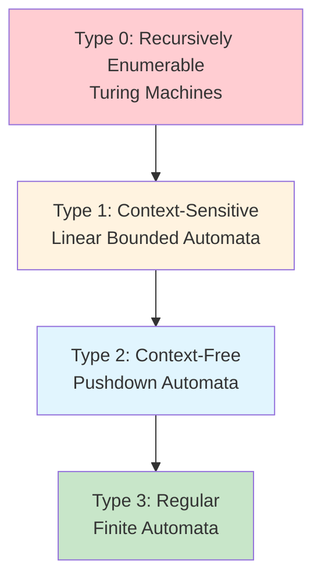

# Formal Languages and Grammars

## Overview

This chapter provides the theoretical foundations underlying the PPJ compiler's design. Understanding formal language theory is essential for comprehending how the compiler transforms source code through lexical analysis, parsing, and semantic analysis phases.

## Formal Languages

A **formal language** is a set of strings over a finite alphabet. In the context of programming languages:

- **Alphabet**: The set of characters (e.g., ASCII characters)
- **Strings**: Sequences of characters (e.g., `"int main(void)"`)
- **Language**: The set of all valid programs (e.g., all syntactically correct C programs)

### Language Hierarchy

Formal languages can be classified according to the Chomsky hierarchy:



**Programming languages** typically require:
- **Regular languages** (Type 3) for lexical structure (tokens)
- **Context-free languages** (Type 2) for syntactic structure (expressions, statements)
- **Context-sensitive constraints** (Type 1) for semantic rules (type checking, scope resolution)

## Regular Languages and Finite Automata

### Regular Expressions

A **regular expression** is a notation for describing regular languages. The basic operations are:

- **Concatenation**: `ab` matches "a" followed by "b"
- **Union**: `a|b` matches either "a" or "b"
- **Kleene Star**: `a*` matches zero or more occurrences of "a"

**Extended operations**:
- **Plus**: `a+` = `aa*` (one or more)
- **Question Mark**: `a?` = `a|ε` (zero or one)
- **Character Classes**: `[a-z]` (any character in range)

### Finite Automata

A **finite automaton** (FA) is a computational model for recognizing regular languages. There are two types:

#### Deterministic Finite Automaton (DFA)

A DFA is a 5-tuple `(Q, Σ, δ, q₀, F)` where:
- `Q`: Finite set of states
- `Σ`: Input alphabet
- `δ: Q × Σ → Q`: Transition function
- `q₀ ∈ Q`: Initial state
- `F ⊆ Q`: Set of accepting states

**Properties**:
- Exactly one transition per state-symbol pair
- Deterministic behavior (no ambiguity)
- Efficient recognition (O(n) time for input of length n)

#### Nondeterministic Finite Automaton (NFA)

An NFA allows:
- Multiple transitions for the same state-symbol pair
- ε-transitions (transitions on empty string)

**Properties**:
- More expressive notation (easier to construct)
- Can be converted to equivalent DFA (subset construction)
- Same expressive power as DFAs (recognize same languages)

### Conversion Algorithms

#### Thompson's Construction: Regex → ε-NFA

**Algorithm**: Recursively construct ε-NFA for each regex operator:

1. **Single Character**: Create two states with transition labeled by character
2. **Concatenation**: Connect NFAs in sequence with ε-transitions
3. **Union**: Create new start/accept states with ε-transitions to both NFAs
4. **Kleene Star**: Add ε-transitions for zero or more repetitions

**Time Complexity**: O(m) where m is regex length

#### Subset Construction: NFA → DFA

**Algorithm**: Build DFA states as sets of NFA states:

1. **Initial State**: ε-closure of NFA start state
2. **Transitions**: For each DFA state S and symbol a:
   - Compute `move(S, a)` = all NFA states reachable from S on a
   - Compute `ε-closure(move(S, a))` = new DFA state
3. **Accepting States**: DFA states containing NFA accepting states

**Time Complexity**: O(2^n × |Σ|) worst case, but typically much better

**See Also**: [Lexer Implementation](../03-lexical-analysis/implementation-notes.md)

## Context-Free Grammars

### Grammar Definition

A **context-free grammar** (CFG) is a 4-tuple `(N, T, P, S)` where:
- `N`: Set of non-terminal symbols
- `T`: Set of terminal symbols (tokens)
- `P`: Set of productions (rules) of form `A → α` where `A ∈ N` and `α ∈ (N ∪ T)*`
- `S ∈ N`: Start symbol

**Example Grammar**:
```
E → E + T | T
T → T * F | F
F → ( E ) | id
```

### Derivations

A **derivation** is a sequence of production applications:

```
E ⇒ E + T ⇒ T + T ⇒ F + T ⇒ id + T ⇒ id + F ⇒ id + id
```

**Leftmost Derivation**: Always expand leftmost non-terminal
**Rightmost Derivation**: Always expand rightmost non-terminal

### Parse Trees

A **parse tree** (derivation tree) represents a derivation graphically:

```
        E
       /|\
      E + T
      |   |
      T   F
      |   |
      F   id
      |
     id
```

**Properties**:
- Root labeled with start symbol
- Leaves are terminals (in order = input string)
- Internal nodes are non-terminals
- Subtrees represent subderivations

### Ambiguity

A grammar is **ambiguous** if some string has **multiple parse trees** (or equivalently, multiple leftmost or rightmost derivations). Ambiguity is problematic for parsing because it means the parser cannot uniquely determine the structure of the input.

**Example Ambiguous Grammar**:
```
E → E + E | E * E | id
```

This grammar is ambiguous because the string `id + id * id` has two parse trees:

**Parse Tree 1** (left-associative, incorrect precedence):
```
        E
       /|\
      E * E
     /|\   |
    E + E  id
    |   |
   id  id
```
This tree represents `(id + id) * id`, which evaluates addition before multiplication—incorrect according to standard operator precedence.

**Parse Tree 2** (right-associative, correct precedence):
```
        E
       /|\
      E + E
      | /|\
     id E * E
        |   |
       id  id
```
This tree represents `id + (id * id)`, which evaluates multiplication before addition—correct according to standard operator precedence.

**Why Ambiguity Matters**: An ambiguous grammar makes it impossible for a parser to deterministically choose the correct parse tree. Different parse trees may have different meanings (semantics), leading to incorrect program interpretation.

**Resolution**: Ambiguous grammars must be transformed to remove ambiguity. Common techniques include:
- **Precedence Rules**: Restructure the grammar to encode operator precedence. For example, separate expression levels (additive expressions, multiplicative expressions) so that higher-precedence operators are parsed deeper in the tree.
- **Associativity Rules**: Encode associativity in the grammar structure. Left-associative operators are parsed using left-recursive productions; right-associative operators use right-recursive productions.
- **Disambiguation Rules**: Add rules that specify which parse tree to prefer when ambiguity exists (though this is less common in practice).

The PPJ compiler's grammar is designed to be unambiguous, with operator precedence and associativity encoded in the grammar structure through multiple expression levels (multiplicative expressions, additive expressions, relational expressions, etc.).

## LR Parsing

### LR Parsing Overview

**LR parsing** (Left-to-right, Rightmost derivation) is a bottom-up parsing technique that:
- Reads input left-to-right
- Constructs rightmost derivation in reverse
- Uses a stack to track parse state

**Advantages**:
- Handles large class of grammars
- Efficient (O(n) time)
- Good error detection
- Automatic parser generation possible

### LR Items

An **LR item** is a production with a **dot** (·) indicating parsing progress. The dot separates the part of the production that has been recognized from the part that is still expected.

**Item Notation**: `[A → α · β]` where:
- `A` is a non-terminal
- `α` is a sequence of grammar symbols (terminals and non-terminals) that have been recognized
- `·` (dot) marks the current position in the production
- `β` is a sequence of grammar symbols that are still expected

**Item States**:
- **Initial Item**: `[A → · α]` — The dot is at the beginning, meaning we haven't recognized any part of this production yet
- **Progress Item**: `[A → α · β]` — We've recognized `α` and are expecting `β`
- **Complete Item**: `[A → α ·]` — The dot is at the end, meaning we've recognized the entire right-hand side `α`; this is a **reduce item** that indicates we can reduce `α` to `A`

**Example**: Consider the production `<izraz> → <izraz> ZAREZ <izraz_pridruzivanja>`. The items for this production are:
- `[<izraz> → · <izraz> ZAREZ <izraz_pridruzivanja>]` — Initial item, expecting `<izraz>`
- `[<izraz> → <izraz> · ZAREZ <izraz_pridruzivanja>]` — Recognized `<izraz>`, expecting `ZAREZ`
- `[<izraz> → <izraz> ZAREZ · <izraz_pridruzivanja>]` — Recognized `<izraz> ZAREZ`, expecting `<izraz_pridruzivanja>`
- `[<izraz> → <izraz> ZAREZ <izraz_pridruzivanja> ·]` — Complete item, can reduce

**Item Sets**: LR parsing uses **item sets**—collections of items that represent parser states. Each item set represents all the productions that the parser might be in the process of recognizing at a given point in the parse.

### LR(1) Items

An **LR(1) item** includes a lookahead symbol:

```
[A → α · β, a]
```

- We've seen α
- Expecting β
- Lookahead symbol `a` helps resolve conflicts

### LR Parsing Algorithm

**Algorithm**:
1. **Shift**: Push current token onto stack, advance input
2. **Reduce**: Pop handle from stack, push non-terminal
3. **Accept**: Successfully parsed input
4. **Error**: No valid action

**Parsing Table**:
- **ACTION[state, token]**: Shift, reduce, accept, or error
- **GOTO[state, non-terminal]**: State transition after reduce

### Canonical LR(1) Construction

**CLOSURE Algorithm**:
```
CLOSURE(I):
    repeat
        for each [A → α · Bβ, a] in I:
            for each production B → γ:
                for each b in FIRST(βa):
                    add [B → · γ, b] to I
    until no more items added
    return I
```

**GOTO Algorithm**:
```
GOTO(I, X):
    J = {}
    for each [A → α · Xβ, a] in I:
        add [A → αX · β, a] to J
    return CLOSURE(J)
```

**Table Construction**:
1. Build initial item set: `CLOSURE({[S' → · S, #]})`
2. For each item set I:
   - For each symbol X: compute `GOTO(I, X)`
   - Add transitions to ACTION/GOTO tables
3. Resolve conflicts (if any)

**See Also**: [LR Parser Technical Documentation](../04-syntax-analysis/parsing-tables-and-algorithms.md)

## FIRST and FOLLOW Sets

### FIRST Sets

**FIRST(α)** = set of terminals that can begin strings derived from α

**Computation**:
1. If `X → a...`, then `a ∈ FIRST(X)`
2. If `X → ε`, then `ε ∈ FIRST(X)`
3. If `X → Y₁Y₂...Yₖ`:
   - Add `FIRST(Y₁) - {ε}` to `FIRST(X)`
   - If `ε ∈ FIRST(Y₁)`, add `FIRST(Y₂) - {ε}`
   - Continue until no ε or end of sequence

### FOLLOW Sets

**FOLLOW(A)** = set of terminals that can appear immediately after A in some derivation

**Computation**:
1. `# ∈ FOLLOW(S)` (start symbol)
2. If `A → αBβ`:
   - Add `FIRST(β) - {ε}` to `FOLLOW(B)`
   - If `ε ∈ FIRST(β)`, add `FOLLOW(A)` to `FOLLOW(B)`

**Uses**:
- Computing lookahead sets for LR(1) items
- Resolving reduce-reduce conflicts
- Error recovery

## Attribute Grammars

### Synthesized Attributes

**Synthesized attributes** flow from children to parent:

```
E → E₁ + E₂
E.val = E₁.val + E₂.val
```

**Evaluation**: Bottom-up (post-order traversal)

### Inherited Attributes

**Inherited attributes** flow from parent to children:

```
D → T L
L.type = T.type
```

**Evaluation**: Top-down (pre-order traversal)

### Semantic Analysis

The PPJ compiler uses attribute grammars for:
- **Type checking**: Synthesize types bottom-up
- **Scope resolution**: Inherit scope information top-down
- **Code generation**: Synthesize code fragments

**See Also**: [Semantic Analysis Documentation](../05-semantic-analysis/semantic-passes.md)

## Further Reading

- **[Automata and Parsing Theory](automata-and-parsing-theory.md)**: Detailed automata algorithms
- **[Lexical Analysis](../03-lexical-analysis/lexer-design.md)**: Application to lexer design
- **[Syntax Analysis](../04-syntax-analysis/grammar-specification.md)**: Application to parser construction

---

*This theoretical foundation provides the mathematical basis for understanding compiler construction. The PPJ compiler implements these concepts directly, making it an ideal vehicle for learning formal language theory.*
