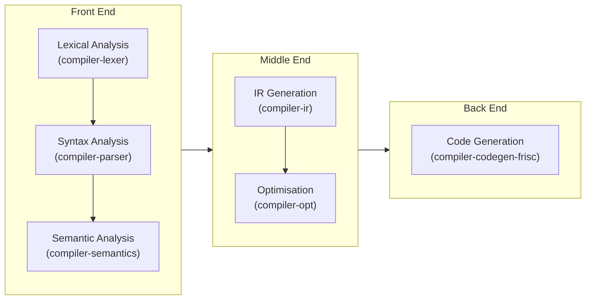
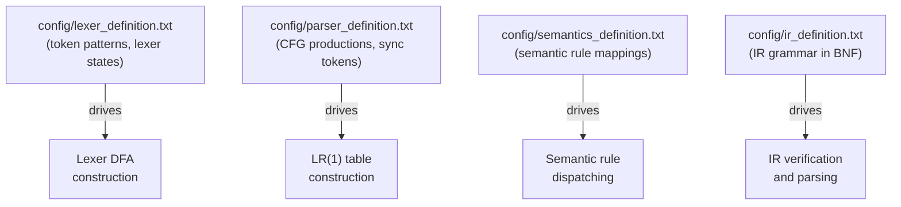
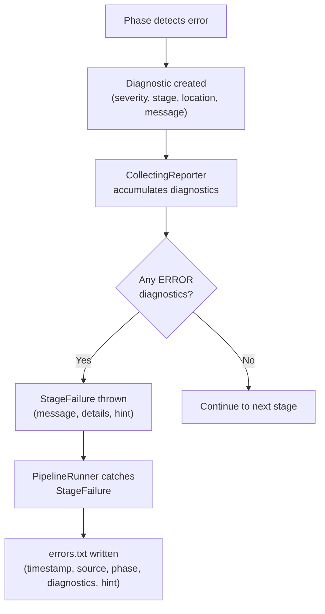
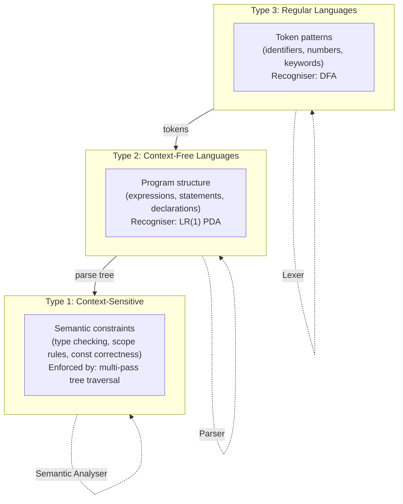
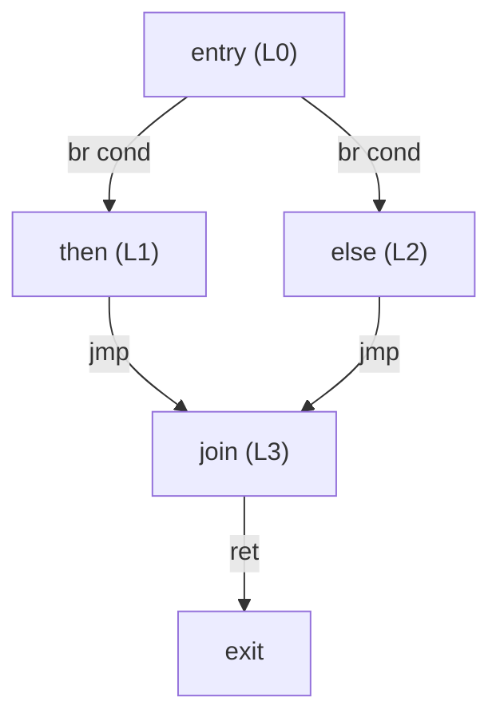
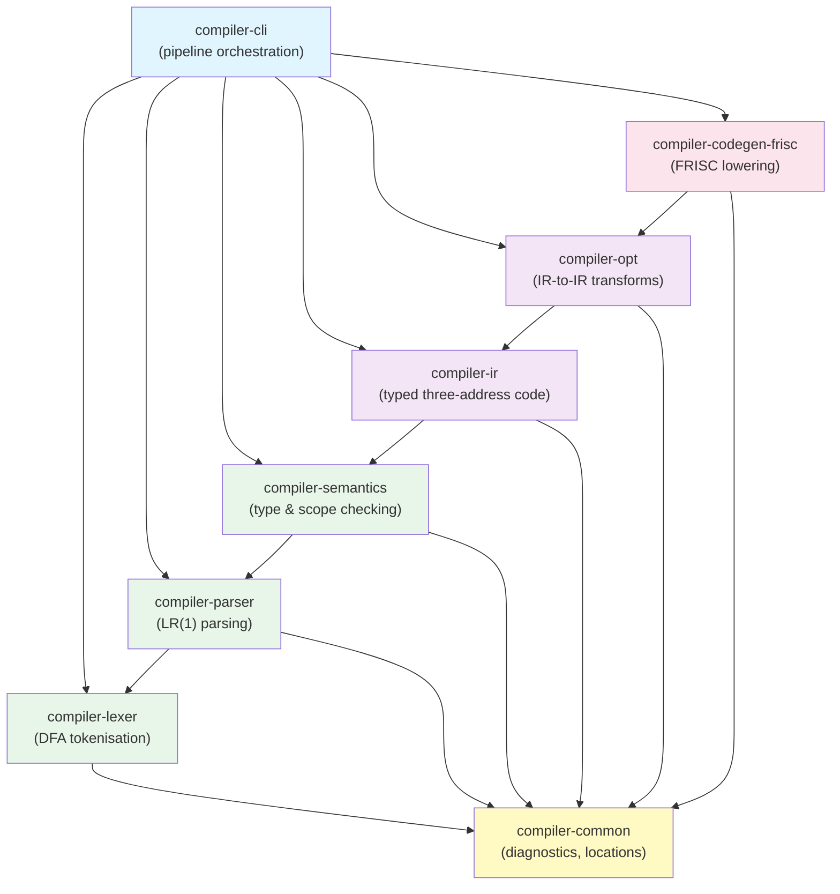

> **📖 From the book.** This chapter accompanies *Building a C-Subset Compiler for the FRISC Architecture: From Formal Languages to Executable Code* by Dr. Karlo Knežević (Zenodo, 2026). For the complete treatment — formal development, proofs, and figures — read the book: [📄 PDF](../book/Building-a-C-Subset-Compiler-for-the-FRISC-Architecture.pdf) · DOI [10.5281/zenodo.20511073](https://doi.org/10.5281/zenodo.20511073) · ISBN 978-953-47198-0-0.

## 2.1 Compiler Structure as a Mathematical Framework

### 2.1.1 The Compiler as a Meaning-Preserving Transformation

A compiler is a program that translates a source program written in one language into a target program written in another language, while preserving the meaning of the source program. This informal definition can be made precise. Let $\mathcal{S}$ denote the set of all well-formed source programs, let $\mathcal{T}$ denote the set of all well-formed target programs, and let $\llbracket \cdot \rrbracket_S : \mathcal{S} \to \mathcal{D}$ and $\llbracket \cdot \rrbracket_T : \mathcal{T} \to \mathcal{D}$ denote the semantic functions that map source and target programs, respectively, to their denotations in some common semantic domain $\mathcal{D}$ (for instance, the set of all partial functions from input states to output states). A compiler is then a function $\mathcal{C} : \mathcal{S} \to \mathcal{T}$ satisfying the fundamental correctness property: \index{compiler correctness} \index{meaning preservation}

$$\forall\, P \in \mathcal{S} : \llbracket P \rrbracket_S = \llbracket \mathcal{C}(P) \rrbracket_T$$

In the case of FRISCcc, $\mathcal{S}$ is the set of valid programs in the supported C subset (as defined by the lexer specification, parser grammar, and semantic rules), $\mathcal{T}$ is the set of valid FRISC assembly programs, and $\mathcal{D}$ is the domain of integer-valued functions (since the observable output of every program is the return value of `main`). The correctness property states that for every valid source program, the FRISC assembly produced by the compiler, when executed on the FRISC simulator, yields the same return value as the source program would yield under the standard semantics of the supported C subset.

### 2.1.2 Decomposition into Phases

Rather than constructing the compiler as a single monolithic function, we decompose it into a sequence of phases $\mathcal{C}_1, \mathcal{C}_2, \ldots, \mathcal{C}_n$, where each phase transforms one intermediate representation into another: \index{phase decomposition}

$$\mathcal{C} = \mathcal{C}_n \circ \mathcal{C}_{n-1} \circ \cdots \circ \mathcal{C}_1$$

Each phase $\mathcal{C}_i$ operates on a representation $R_i$ and produces a representation $R_{i+1}$, with $R_1$ being the source program and $R_{n+1}$ being the target program. The correctness of the whole compiler follows from the correctness of each phase: if each $\mathcal{C}_i$ preserves meaning (relative to the semantic functions defined on adjacent representations), then the composition preserves meaning.

In FRISCcc, the phases and their representations are:

| Phase $i$ | Transformation $\mathcal{C}_i$   | Input $R_i$              | Output $R_{i+1}$           |
|-----------|----------------------------------|--------------------------|----------------------------|
| 1         | Lexical analysis                 | Character stream         | Token sequence             |
| 2         | Syntax analysis                  | Token sequence           | Parse tree                 |
| 3         | Semantic analysis                | Parse tree               | Annotated parse tree       |
| 4         | IR generation                    | Annotated parse tree     | Typed IR                   |
| 5         | Optimisation                     | Typed IR                 | Optimised typed IR         |
| 6         | Code generation                  | Optimised typed IR       | FRISC assembly             |

This decomposition is the defining architectural decision of the compiler. It determines the module structure, the testing strategy, and the extension points available for future development.

### 2.1.3 The N-by-M Problem and IR Decoupling

A classical motivation for introducing an intermediate representation is the *N-by-M problem*. If a compiler ecosystem must support $N$ source languages and $M$ target architectures, a naive approach requires $N \times M$ translators. By introducing a common intermediate representation, the problem is reduced to $N$ front ends (source to IR) and $M$ back ends (IR to target), for a total of $N + M$ components. \index{N-by-M problem} \index{IR decoupling}

FRISCcc instantiates this architecture with $N = 1$ (the supported C subset) and $M = 1$ (FRISC), so the asymptotic savings are not directly realised. Nevertheless, the IR decoupling provides substantial engineering benefits. The front end and back end can be developed, tested, and reasoned about independently. The optimiser operates on the IR without knowledge of either the source language or the target architecture. And the IR serves as a precise, inspectable contract between the analysis phases and the synthesis phases.

The IR grammar, defined in `config/ir_definition.txt`, is the formal specification of this contract. Both the IR generator (`compiler-ir`) and the code generator (`compiler-codegen-frisc`) must conform to this grammar; the `IrVerifier` enforces conformance programmatically.


## 2.2 Front-End, Middle-End, Back-End

### 2.2.1 Definitions

The three-part decomposition of a compiler into front end, middle end, and back end is a standard architectural pattern: \index{front end} \index{middle end} \index{back end}



**The front end** is responsible for analysing the source program: determining whether it is lexically, syntactically, and semantically well-formed, and constructing an internal representation that captures its meaning. The front end is source-language-dependent and target-architecture-independent. In FRISCcc, the front end comprises the `compiler-lexer`, `compiler-parser`, and `compiler-semantics` modules.

**The middle end** is responsible for constructing the intermediate representation and transforming it to improve the quality of the eventual target code. The middle end is (ideally) both source-language-independent and target-architecture-independent, operating purely on the IR. In FRISCcc, the middle end comprises the `compiler-ir` and `compiler-opt` modules. The IR generation phase is technically the bridge between the front end and the middle end, since it consumes the annotated parse tree (a front-end data structure) and produces the IR (a middle-end data structure).

**The back end** is responsible for translating the IR into the target language. The back end is target-architecture-dependent and source-language-independent. In FRISCcc, the back end is the `compiler-codegen-frisc` module, which lowers the typed IR into FRISC assembly instructions, emits helper routines for operations not supported by the hardware, and applies peephole optimisations to the generated code.

### 2.2.2 Detailed Module Inventory

The following table provides a comprehensive inventory of all eight Maven modules, including their root packages, key classes, and specific responsibilities:

| Module                    | Root Package                     | Key Classes                                                                | Responsibility                                                                      |
|---------------------------|----------------------------------|----------------------------------------------------------------------------|--------------------------------------------------------------------------------------|
| `compiler-common`         | `hr.fer.ppj.common`             | `Diagnostic`, `DiagnosticReporter`, `SourceLocation`, `Severity`, `Stage`  | Shared infrastructure: diagnostic types, source location records, severity enumerations, stage identifiers. No compilation logic. |
| `compiler-lexer`          | `hr.fer.ppj.lexer`              | `LexerGenerator`, `Lexer`, `Token`, `SymbolTableEntry`                     | DFA construction from regex specs, character-stream tokenisation, maximal munch, multi-state scanning, symbol table population. |
| `compiler-parser`         | `hr.fer.ppj.parser`             | `Parser`, `ParseTree`, `TokenReader`                                       | LR(1) table construction, shift-reduce parsing, parse tree construction, synchronisation-based error recovery. |
| `compiler-semantics`      | `hr.fer.ppj.semantics`          | `SemanticAnalyzer`, `SemanticChecker`, `SymbolTable`, `TypeCompatibility`  | Attribute-grammar-style tree traversal, type checking, scope resolution, const enforcement, struct layout computation. |
| `compiler-ir`             | `hr.fer.ppj.ir`                 | `IrPipeline`, `ProgramGenerator`, `IrVerifier`, `IrProgram`, `IrBlock`    | Lowering annotated parse tree to typed three-address code, basic block construction, frame/slot metadata generation, IR verification. |
| `compiler-opt`            | `hr.fer.ppj.opt`                | `IrOptimizer`, `PassPipeline`, `IrPass`, `PassContext`, `PassResult`       | IR-to-IR transformation passes: constant folding, CSE, LICM, copy propagation, dead code elimination, strength reduction, inlining. |
| `compiler-codegen-frisc`  | `hr.fer.ppj.codegen.frisc`      | `FriscCodeGenerator`, `FunctionEmitter`, `ExpressionLowerer`, `HelperEmitter`, `FriscPeepholeOptimizer` | IR text parsing, template-based instruction selection, register mapping, calling convention implementation, helper routine emission, peephole optimisation. |
| `cli`                     | `hr.fer.ppj.cli`                | `PipelineRunner`, `PipelinePlan`, `PipelineStage`, `PipelineContext`, `StageFailure`, `ArgumentParser` | CLI argument parsing, transitive stage planning, sequential stage execution, artifact output management, structured error reporting, FRISC simulator invocation. |

### 2.2.3 Information Flow Across Boundaries

A critical property of the three-part architecture is that information flows in one direction: from front end to middle end to back end. The back end never queries the front end. The optimiser never consults the source text. This unidirectional flow is enforced by the Maven dependency graph: `compiler-codegen-frisc` depends on `compiler-ir` but not on `compiler-semantics`, `compiler-parser`, or `compiler-lexer`. \index{information flow}

The sole exception is that the code generator receives the IR as a textual string (not as a Java object graph from the front end), parsed by its own `IrTextParser`. This design reinforces the contract boundary: the code generator relies only on the IR grammar, not on any Java class from the IR module's internal model.

### 2.2.4 Concrete Phase Outputs

To make the abstract architectural description concrete, this section shows what each phase produces for a small example program. Consider the following source:

```c
int main(void) {
    int x = 3;
    int y = 4;
    return x + y;
}
```

**Lexer output (excerpt).** The lexer produces a token sequence such as:

```
KR_INT int 1
IDN main 1
L_ZAGRADA ( 1
KR_VOID void 1
D_ZAGRADA ) 1
L_VIT_ZAGRADA { 1
KR_INT int 2
IDN x 2
OP_PRIDRUZI = 2
BROJ 3 2
TOCKAZAREZ ; 2
...
```

Each line records the token type, lexeme, and line number. The lexer has transformed a character stream into a structured token sequence, discarding whitespace and comments.

**Parser output (excerpt).** The parser constructs a concrete syntax tree. The tree preserves the grammar's production structure:

```
<prijevodna_jedinica>
  <vanjska_deklaracija>
    <definicija_funkcije>
      <ime_tipa>
        KR_INT int 1
      </ime_tipa>
      IDN main 1
      L_ZAGRADA ( 1
      KR_VOID void 1
      D_ZAGRADA ) 1
      <slozena_naredba>
        ...
```

**Semantic analyser output.** The annotated parse tree adds type and scope information to each node. An expression node such as `x + y` is annotated with `type=int`, and each identifier is resolved to its declaration in the symbol table.

**IR output.** The typed IR for this program is:

```
function @main() -> int32 {
.frame locals = 8 bytes align = 4
.slots
  local x@-4 : int32
  local y@-8 : int32

L0:
  t0 = #3:int32
  store t0 -> addr_of_symbol local:x : ptr<int32>
  t1 = #4:int32
  store t1 -> addr_of_symbol local:y : ptr<int32>
  t2 = load addr_of_symbol local:x : int32
  t3 = load addr_of_symbol local:y : int32
  t4 = add t2, t3 : int32
  ret t4
}
```

**FRISC assembly output (excerpt).** The code generator lowers the IR to FRISC instructions:

```asm
F_MAIN  PUSH R5
        MOVE R7, R5
        SUB R7, 8, R7        ; allocate locals
        MOVE 3, R0
        STORE R0, (R5-4)     ; store x
        MOVE 4, R0
        STORE R0, (R5-8)     ; store y
        LOAD R0, (R5-4)      ; load x
        PUSH R0
        LOAD R0, (R5-8)      ; load y
        POP R1
        ADD R1, R0, R0       ; x + y
        MOVE R0, R6           ; return value
        MOVE R5, R7
        POP R5
        RET
```

This concrete trace illustrates how information is progressively lowered from high-level source text to machine-level instructions, with each phase adding structure, types, or target-specific details.

### 2.2.5 Phase Interaction and Error Propagation

While the phases are conceptually independent, their interaction through the pipeline creates important properties for error handling. Each phase acts as a filter: it either passes a well-formed artifact to the next phase or produces a diagnostic and halts the pipeline. This creates a cascade of increasingly refined validation: \index{error propagation}

1. The **lexer** rejects programs with invalid characters or unterminated literals. A program that passes the lexer is guaranteed to consist of valid tokens.

2. The **parser** rejects token sequences that do not conform to the grammar. A program that passes the parser is guaranteed to have a valid syntactic structure.

3. The **semantic analyser** rejects programs with type errors, scope violations, or constraint failures. A program that passes semantic analysis is guaranteed to be type-correct and scope-correct.

4. The **IR generator** rejects programs whose annotated parse trees cannot be lowered to the IR. In practice, if semantic analysis succeeds, IR generation rarely fails. When it does, the error typically indicates an internal compiler limitation.

5. The **IR verifier** rejects IR programs that violate structural or type invariants. Failures at this stage indicate bugs in the IR generator or optimiser.

6. The **code generator** rejects IR programs that contain constructs it cannot lower. Again, failures at this stage are rare and indicate internal issues.

This layered validation means that each phase can assume its input has been validated by all preceding phases. The parser need not check for invalid characters (the lexer already did). The semantic analyser need not check for syntactic correctness (the parser already did). The code generator need not check for type errors (the semantic analyser already did). This separation of concerns simplifies each phase and concentrates error handling where it belongs.

The role of diagnostics at each phase is summarised in the following table:

| Phase              | Diagnostic Role                                                   | User Visibility |
|--------------------|-------------------------------------------------------------------|-----------------|
| Lexer              | Reports character-level errors (invalid input)                    | High            |
| Parser             | Reports token-level errors (grammar violations)                   | High            |
| Semantic analyser  | Reports type, scope, and constraint errors                        | High            |
| IR generator       | Reports lowering failures (usually internal)                      | Low             |
| IR verifier        | Reports structural/type invariant violations (internal)           | Low             |
| Optimiser          | Reports transformation failures (internal, via validator)         | Very Low        |
| Code generator     | Reports lowering failures (internal)                              | Very Low        |

The "user visibility" column indicates how likely a typical programmer is to encounter errors from that phase. Most compilation errors are lexical, syntactic, or semantic -- errors that the programmer introduced and can fix. Errors in later phases typically indicate compiler bugs rather than user errors.


## 2.3 Orchestration and Pipeline Execution

### 2.3.1 The PipelineRunner Algorithm

The `PipelineRunner` class in the `cli` module implements the sequential execution of compilation stages. The runner accepts a `PipelinePlan` (the resolved set of stages to execute), a source file path, and an output directory path. It iterates over the plan's stages in canonical order, executing each stage through a dedicated method, and halts at the first failure. \index{PipelineRunner}

The execution algorithm, expressed in pseudocode that maps directly to the Java implementation, is:

```text
function run(plan, sourceFile, outputDir):
    layout := CompilerBinLayout(outputDir)
    context := PipelineContext(sourceFile, layout)
    prepare outputDir (clear stale artifacts)

    for each stage in plan.stages():
        report stage start
        start := now()
        try:
            artifacts := executeStage(stage, context, plan)
            report stage success with elapsed time
        catch StageFailure as failure:
            report stage failure
            write errors.txt with structured report
            return false
    return true
```

The `executeStage` method dispatches to one of seven stage-specific methods using a Java 21 pattern-matching switch:

| `PipelineStage` Enum Value | Dispatch Method       | Module Entry Point           |
|-----------------------------|-----------------------|------------------------------|
| `LEX`                       | `runLex()`            | `LexerGenerator.generate()`, `Lexer.tokenize()` |
| `PARSE`                     | `runParse()`          | `Parser.parseTokens()`       |
| `SEMANTIC`                  | `runSemantic()`       | `SemanticAnalyzer.analyzeWithResults()` |
| `IR`                        | `runIr()`             | `IrPipeline.generate()`      |
| `OPT`                       | `runOptimization()`   | `IrOptimizer.optimize()`     |
| `FRISC`                     | `runFrisc()`          | `FriscCodeGenerator.generate()` |
| `RUN`                       | `runFriscExecution()` | `FriscRunner.run()`          |

### 2.3.2 The PipelinePlan Record

The `PipelinePlan` is a Java `record` that encapsulates the resolved compilation plan: the ordered list of stages to execute, the optimisation level (`O0` or `O1`), and whether IR dumps are requested. The `PipelinePlan.from(CliOptions)` factory method computes the transitive closure of requested stages. \index{PipelinePlan}

The resolution algorithm operates on an `EnumSet<PipelineStage>`:

1. Copy the user's explicitly requested stages into the set.
2. If `--all` was specified, add all stages from `PipelineStage.orderedCompileStages()` (LEX through FRISC).
3. Find the maximum index among requested compile stages in the canonical ordering.
4. If `RUN` is requested, ensure the maximum index covers all compile stages (since execution requires full compilation).
5. Include all stages from index 0 through the maximum index, ensuring transitive closure.
6. Append `RUN` at the end if requested.

This design ensures the invariant that the plan always contains a contiguous prefix of the canonical stage ordering, with an optional `RUN` appended.

### 2.3.3 The PipelineContext

The `PipelineContext` class serves as a mutable carrier of inter-stage data. As each stage completes, it deposits its output into the context for the next stage to consume. The context holds: \index{PipelineContext}

- The source file path and the output layout.
- The token list and symbol table (produced by LEX, consumed by PARSE).
- The parse tree (produced by PARSE, consumed by SEMANTIC).
- The semantic analysis result, including the global scope and annotated parse tree (produced by SEMANTIC, consumed by IR).
- The IR program object and its textual representation (produced by IR, consumed by OPT; updated by OPT, consumed by FRISC).
- The path to the generated FRISC assembly file (produced by FRISC, consumed by RUN).

This explicit context object replaces what might otherwise be implicit shared state or file-based communication between stages. It ensures that each stage receives exactly the data it needs, with clear ownership semantics.


## 2.4 Configuration-Driven Design

### 2.4.1 The Configuration Files as Language Contracts

A distinguishing feature of the FRISCcc architecture is that three of the four front-end stages are driven by external configuration files rather than being hardcoded in Java source. These files collectively define the source language: \index{configuration-driven design}



| Configuration File          | Read By                       | Format                          | Approximate Size          |
|-----------------------------|-------------------------------|---------------------------------|---------------------------|
| `lexer_definition.txt`      | `LexerGenerator`              | Regex patterns with state transitions, priorities | Token types, lexer states, actions |
| `parser_definition.txt`     | `Parser` (table construction) | BNF-style productions with `%Syn` directives | 47 nonterminals, 46 terminals, ~100+ productions |
| `semantics_definition.txt`  | `SemanticChecker`             | Production-to-rule mappings     | Rule class names per grammar production |
| `ir_definition.txt`         | `IrVerifier`, `IrTextParser`  | BNF grammar for IR text format  | IR instruction types, type syntax, metadata |

### 2.4.2 Implications of Configuration-Driven Architecture

The configuration-driven approach has several consequences for the compiler's design and maintenance:

**Language extensibility.** Adding a new keyword requires adding a token pattern in `lexer_definition.txt`, adding grammar productions in `parser_definition.txt`, and writing semantic rules for the new construct. The Java code for the lexer and parser generators does not change; only the configuration files and the semantic rule modules need updating.

**Separation of specification from implementation.** The configuration files serve as the language specification. A reader who wishes to understand what the compiler accepts need not read any Java code; the four configuration files, together with the semantic rule modules, constitute the complete specification.

**Reproducibility.** Because the lexer and parser are generated from these files at startup, the compiler's behaviour is fully determined by the combination of the configuration files and the Java code. Two compilers with identical configuration files and identical Java code will accept exactly the same language.

**Testability.** The configuration files can be validated independently. The lexer specification can be tested by tokenising sample inputs. The parser specification can be tested by parsing token sequences. The IR grammar can be tested by verifying IR text files.

### 2.4.3 The IR Grammar as a Cross-Module Contract

The IR grammar in `config/ir_definition.txt` deserves special emphasis because it serves as the contract between three independent consumers: \index{IR grammar}

1. **The IR generator** (`compiler-ir`) produces IR text that must conform to this grammar.
2. **The IR verifier** (`compiler-ir` / `IrVerifier`) validates that the IR text is well-formed according to this grammar.
3. **The code generator** (`compiler-codegen-frisc` / `IrTextParser`) parses the IR text according to this grammar.

Any change to the IR grammar requires coordinated updates across all three consumers. The grammar is authoritative: if the generator produces text that does not conform to the grammar, the verifier will reject it; if the code generator cannot parse a valid IR construct, the code generator is at fault.


## 2.5 Error Propagation and Diagnostics

### 2.5.1 The Structured Error Model

Errors in FRISCcc are phase-scoped and reported with structured context. The error model is built on two complementary mechanisms: the `Diagnostic` type from `compiler-common` (used within individual phases) and the `StageFailure` exception (used by the `PipelineRunner` to halt the pipeline). \index{error model} \index{Diagnostic} \index{StageFailure}

A `Diagnostic` carries:
- A `Severity`: one of `INFO`, `WARNING`, or `ERROR`.
- A `Stage`: one of `LEXER`, `PARSER`, `SEMANTICS`, `IR`, `CODEGEN`.
- A `SourceLocation`: the line and column in the source file where the diagnostic applies.
- A textual message describing the issue.

A `StageFailure` carries:
- A summary message (e.g., "Lexical analysis failed").
- A list of detail strings (typically the formatted `Diagnostic` objects from the phase).
- A hint string describing the expected input for the failing stage.
- An optional root cause `Throwable`.



### 2.5.2 Concrete Error Examples

The following examples illustrate how errors at different stages are captured and reported.

**Lexical error.** An unterminated string literal produces a diagnostic with stage `LEXER`, severity `ERROR`, and a source location pointing to the line where the string began. The `StageFailure` message is "Lexical analysis failed" with the hint "Expected a source file that conforms to lexer token definitions."

**Syntax error.** A missing semicolon after a statement produces a diagnostic with stage `PARSER` and a source location pointing to the token where the parser detected the mismatch. The parser's synchronisation mechanism attempts to recover by discarding tokens until a semicolon or closing brace is found. If recovery succeeds, parsing continues and may produce additional diagnostics; if recovery fails, the `StageFailure` is thrown with the hint "Expected token sequence that matches parser grammar."

**Semantic error.** An assignment of a `float` value to a `const int` variable produces a diagnostic with stage `SEMANTICS`. The message identifies the incompatible types and the location of the assignment. The hint is "Expected type-correct program according to semantic rules."

**IR generation error.** An `IrCompilationException` is thrown when the IR generator encounters a construct it cannot lower (for example, a struct type that was not properly resolved during semantic analysis). The `StageFailure` wraps the exception's diagnostics with the hint "Expected semantically valid program to lower into typed IR."

### 2.5.3 The Structured Error Report

When a stage fails, the `PipelineRunner` writes a structured error report to `compiler-bin/errors.txt`. The report format is:

```
COMPILATION FAILURE REPORT
==========================

Timestamp
- 2026-03-14 14:23:17
Source File
- /path/to/program.c
Failure Phase
- Semantic Analysis
What Broke
- Semantic analysis failed

Diagnostics
- Line 12, Column 5: Cannot assign float to const int
- Line 15, Column 9: Undeclared identifier 'x'

Expected
- Expected type-correct program according to semantic rules.
```

The `BinDirectoryManager.replaceWithSingleFile()` method ensures that when an error report is written, all previously generated artifacts for the current run are removed. This prevents a scenario where `tokens.txt` and `ast.txt` exist from a successful lex and parse, but the semantic analysis failed -- a developer inspecting `compiler-bin/` would see only `errors.txt`, making it unambiguous that compilation did not succeed.

### 2.5.4 Fail-Fast Monotonicity

The error propagation model guarantees *fail-fast monotonicity*: once any stage's contract fails, no later stage runs. This property is critical for two reasons. First, it prevents cascading errors: a semantic error should never be reported as a code generation error. Second, it ensures that the error report always identifies the root cause, not a downstream consequence. \index{fail-fast monotonicity}

The monotonicity is enforced by the `PipelineRunner`'s sequential execution loop. Each stage is wrapped in a try-catch block that catches `StageFailure`. If the catch block fires, the runner writes the error report, prints the error artifact path, and returns `false` without executing any subsequent stages.


## 2.6 Formal Language Theory

### 2.6.1 The Chomsky Hierarchy

The theoretical foundation of compiler front ends rests on the Chomsky hierarchy of formal languages, which classifies languages by the generative power of the grammars that produce them. The hierarchy defines four levels: \index{Chomsky hierarchy}

| Type | Grammar Class          | Recogniser                 | Relevant Compiler Phase |
|------|------------------------|----------------------------|-------------------------|
| 3    | Regular grammars       | Finite automata (DFA/NFA)  | Lexical analysis        |
| 2    | Context-free grammars  | Pushdown automata (PDA)    | Syntax analysis         |
| 1    | Context-sensitive      | Linear-bounded automata    | Semantic analysis (partially) |
| 0    | Unrestricted           | Turing machines            | --                      |

Compilers exploit the first three levels of this hierarchy. Lexical analysis uses regular languages (Type 3) to define token patterns. Syntax analysis uses context-free languages (Type 2) to define the grammatical structure of programs. Semantic analysis enforces context-sensitive constraints (such as "a variable must be declared before use" or "the operands of an addition must have compatible types") that cannot be expressed by context-free grammars alone.

### 2.6.2 Formal Definition of a Grammar

A grammar is a four-tuple $G = (V, T, P, S)$ where: \index{formal grammar}

- $V$ is a finite set of *nonterminal symbols* (also called *variables* or *syntactic categories*).
- $T$ is a finite set of *terminal symbols* (the alphabet of the language), with $V \cap T = \emptyset$.
- $P$ is a finite set of *production rules*, each of the form $\alpha \to \beta$ where $\alpha \in (V \cup T)^+$ and $\beta \in (V \cup T)^*$.
- $S \in V$ is the *start symbol*.

The form of the production rules determines the grammar's type in the Chomsky hierarchy. In a regular grammar (Type 3), every production has the form $A \to aB$ or $A \to a$ (right-linear) or $A \to Ba$ or $A \to a$ (left-linear), where $A, B \in V$ and $a \in T$. In a context-free grammar (Type 2), every production has the form $A \to \gamma$ where $A \in V$ and $\gamma \in (V \cup T)^*$.

### 2.6.3 Regular Languages and Their Properties

Regular languages are the simplest class in the Chomsky hierarchy, yet they are expressive enough to define the lexical structure of most programming languages. A language $L$ is regular if and only if it satisfies any (and therefore all) of the following equivalent characterisations: \index{regular languages}

1. $L$ is generated by a regular grammar (Type 3).
2. $L$ is recognised by a deterministic finite automaton (DFA).
3. $L$ is recognised by a nondeterministic finite automaton (NFA).
4. $L$ is described by a regular expression.

These equivalences are constructive: algorithms exist to convert between any two of these representations. The FRISCcc lexer exploits this by starting with regular expressions (the most human-readable form), converting them to NFAs (via Thompson's construction), and then converting the NFAs to DFAs (via the subset construction) for efficient runtime tokenisation.

Regular languages are closed under union, concatenation, Kleene closure, intersection, complementation, and difference. These closure properties are useful in lexer design because they allow complex token patterns to be built compositionally from simpler patterns.

The **Pumping Lemma for Regular Languages** provides a necessary condition for regularity: if $L$ is regular, then there exists a pumping length $p$ such that every string $w \in L$ with $|w| \geq p$ can be decomposed as $w = xyz$ where $|y| > 0$, $|xy| \leq p$, and $xy^iz \in L$ for all $i \geq 0$. This lemma is used to prove that certain languages are *not* regular -- for instance, the language $\{a^n b^n : n \geq 0\}$ of matched parentheses is not regular, which is why parenthesis matching is handled by the parser (using a context-free grammar) rather than by the lexer.

### 2.6.4 Context-Free Languages and Their Properties

Context-free languages (CFLs) are strictly more powerful than regular languages. A language $L$ is context-free if it is generated by a context-free grammar (CFG) or, equivalently, recognised by a nondeterministic pushdown automaton. \index{context-free languages}

Context-free languages are closed under union, concatenation, and Kleene closure, but they are *not* closed under intersection or complementation. This means that the class of context-free languages is strictly weaker than the class of context-sensitive languages.

The **Pumping Lemma for Context-Free Languages** states: if $L$ is context-free, then there exists a pumping length $p$ such that every string $w \in L$ with $|w| \geq p$ can be decomposed as $w = uvxyz$ where $|vy| > 0$, $|vxy| \leq p$, and $uv^ixy^iz \in L$ for all $i \geq 0$. This lemma proves that certain constraints cannot be expressed by CFGs alone -- for instance, the language $\{a^n b^n c^n : n \geq 0\}$ is not context-free. This is analogous to the compiler's need for semantic analysis: the requirement that a variable be declared before use (a kind of "matching" constraint across arbitrary distances) cannot be expressed by the parser's CFG.

### 2.6.5 Decidability of Parsing

An important theoretical property is that membership in a context-free language is decidable: given a CFG $G$ and a string $w$, there exists an algorithm that determines in finite time whether $w \in L(G)$. The CYK algorithm solves this problem in $O(n^3 \cdot |G|)$ time for general CFGs. LR(1) parsing solves it in $O(n)$ time for the subclass of deterministic context-free languages, which includes essentially all practical programming language grammars. \index{decidability}

The FRISCcc parser exploits this efficiency: every input token is processed exactly once, and the parser's decision at each step (shift, reduce, or error) takes constant time via table lookup. The ~39,000-state LR(1) parsing table is precomputed, so the runtime cost is proportional to the number of tokens in the input program.

### 2.6.6 Regular Languages for Lexical Analysis

The token types of the FRISCcc source language are defined by regular expressions in `config/lexer_definition.txt`. Each regular expression specifies a pattern that matches the lexemes of one token type. For example, the pattern for identifiers is: \index{lexical analysis}

$$\texttt{IDN} : (\texttt{\_} \mid \textit{letter})(\texttt{\_} \mid \textit{letter} \mid \textit{digit})^*$$

The pattern for integer literals is:

$$\texttt{BROJ} : \textit{digit}\,\textit{digit}^*$$

with an additional pattern for hexadecimal literals:

$$\texttt{BROJ} : \texttt{0}(\texttt{X} \mid \texttt{x})\,\textit{hexDigit}\,\textit{hexDigit}^*$$

Regular expressions are closed under union, concatenation, and Kleene closure, and they generate exactly the class of regular languages. For every regular expression, there exists an equivalent deterministic finite automaton (DFA) that recognises the same language. The FRISCcc lexer constructs this DFA from the specification and uses it to tokenise the input stream.

The lexer specification also defines *lexer states* (e.g., `S_pocetno`, `S_komentar`, `S_jednolinijskiKomentar`, `S_string`) that modify which token patterns are active. This state mechanism extends the power of the lexer beyond pure regular languages, enabling it to handle context-dependent constructs such as comments and string literals without complicating the parser grammar.

### 2.6.7 Context-Free Grammars for Syntax Analysis

The syntactic structure of programs is defined by a context-free grammar (CFG) in `config/parser_definition.txt`. The grammar of the FRISCcc source language is:

$$G_{\text{parse}} = (V_{\text{parse}}, T_{\text{parse}}, P_{\text{parse}}, \langle\textit{prijevodna\_jedinica}\rangle)$$

where $V_{\text{parse}}$ contains 47 nonterminal symbols (such as $\langle\textit{izraz}\rangle$, $\langle\textit{naredba}\rangle$, $\langle\textit{deklaracija}\rangle$), $T_{\text{parse}}$ contains 46 terminal symbols (the token types produced by the lexer, such as `IDN`, `BROJ`, `KR_IF`, `PLUS`), and $P_{\text{parse}}$ contains the production rules that define how nonterminals expand into sequences of terminals and nonterminals.

The grammar encodes operator precedence and associativity through the layered structure of its expression nonterminals. The hierarchy of expression nonterminals is:

$$\langle\textit{primarni\_izraz}\rangle \subset \langle\textit{postfiks\_izraz}\rangle \subset \langle\textit{unarni\_izraz}\rangle \subset \langle\textit{cast\_izraz}\rangle \subset \langle\textit{multiplikativni\_izraz}\rangle \subset \cdots \subset \langle\textit{izraz\_pridruzivanja}\rangle \subset \langle\textit{izraz}\rangle$$

Each layer introduces one level of operator precedence. Lower layers bind more tightly; higher layers bind more loosely. Left-recursive productions encode left-to-right associativity; right-recursive productions (such as the assignment expression) encode right-to-left associativity.

### 2.6.8 Attribute Grammars and Semantic Analysis

Context-free grammars can describe the syntactic structure of a language but cannot express semantic constraints such as type compatibility or scope rules. *Attribute grammars*, introduced by Donald Knuth, extend context-free grammars by associating attributes with grammar symbols and defining attribute evaluation rules alongside production rules. \index{attribute grammars}

In FRISCcc, the semantic analyser (`compiler-semantics`) implements an attribute-grammar-like strategy. Each nonterminal node in the parse tree is annotated with *synthesised attributes* (computed from the node's children, such as the type of an expression) and *inherited attributes* (propagated from the node's parent, such as the expected return type of a function). The `SemanticChecker` class dispatches to rule modules (`ExpressionRules`, `DeclarationRules`, `ControlFlowRules`, `StructRules`, etc.) based on the production used at each parse tree node, and each rule module computes the attributes for that production.

The distinction between synthesised and inherited attributes corresponds, in the implementation, to the direction of information flow during the parse tree traversal. Type information flows upward (synthesised): the type of a binary expression is computed from the types of its operands. Scope information flows downward (inherited): the symbol table available to a nested block includes the declarations from its enclosing block.

### 2.6.9 The Language Hierarchy in FRISCcc

It is instructive to map the Chomsky hierarchy explicitly onto the FRISCcc pipeline. The lexer operates at Level 3 (regular languages): each token type is defined by a regular expression, and the lexer is implemented as a DFA. The parser operates at Level 2 (context-free languages): the grammar is context-free, and the parser is an LR(1) pushdown automaton. The semantic analyser operates at Level 1 (context-sensitive): it enforces constraints that depend on the context in which a construct appears (e.g., "the variable `x` must be declared in an enclosing scope before it can be used in an expression").



This clean separation of language-theoretic levels into distinct pipeline stages is not merely an aesthetic choice. It has practical consequences for error reporting (lexical errors are reported before syntactic errors, which are reported before semantic errors), for modularity (the lexer specification can be changed without affecting the parser grammar), and for testing (each level can be tested independently using its own class of test inputs).


## 2.7 Automata Theory Foundations

### 2.7.1 Finite Automata for Lexical Analysis

A *deterministic finite automaton* (DFA) is a five-tuple $M = (Q, \Sigma, \delta, q_0, F)$ where: \index{DFA} \index{finite automata}

- $Q$ is a finite set of states.
- $\Sigma$ is a finite input alphabet.
- $\delta : Q \times \Sigma \to Q$ is the transition function.
- $q_0 \in Q$ is the start state.
- $F \subseteq Q$ is the set of accepting states.

The DFA processes an input string one character at a time, transitioning between states according to $\delta$. The string is accepted if the DFA reaches an accepting state after processing the entire input.

In the FRISCcc lexer, each token type is defined by a regular expression, which is first converted to a *nondeterministic finite automaton* (NFA) using Thompson's construction, and then converted to a DFA using the subset construction algorithm. The resulting DFA is used at runtime to tokenise the input stream.

The lexer implements the *maximal munch* strategy: at each position in the input, the lexer advances the DFA as far as possible while the input can still match some token pattern. When no further advance is possible, the lexer outputs the token corresponding to the longest match and resets the DFA. If multiple token types match the same longest lexeme, the lexer selects the token type with the highest priority (keywords take priority over identifiers, for instance, because their patterns are tested first in the specification). \index{maximal munch}

### 2.7.2 Nondeterministic Finite Automata

A *nondeterministic finite automaton* (NFA) is a five-tuple $M = (Q, \Sigma, \delta, q_0, F)$ with the same components as a DFA, except that the transition function is $\delta : Q \times (\Sigma \cup \{\varepsilon\}) \to \mathcal{P}(Q)$, mapping a state and an input symbol (or the empty string $\varepsilon$) to a *set* of possible next states. NFAs are conceptually simpler to construct from regular expressions (via Thompson's construction) but less efficient to simulate directly. The subset construction converts an NFA with $n$ states into an equivalent DFA with at most $2^n$ states (though in practice the DFA is typically much smaller). \index{NFA}

### 2.7.3 Thompson's Construction and Subset Construction

The path from regular expressions to DFAs proceeds through two well-known algorithms. *Thompson's construction* converts a regular expression into an NFA with at most $2n$ states (where $n$ is the length of the regular expression). The construction is compositional: the NFA for a union $r_1 | r_2$ is built from the NFAs for $r_1$ and $r_2$ by adding a new start state with $\varepsilon$-transitions to both sub-NFAs and a new accepting state with $\varepsilon$-transitions from both sub-NFAs. Concatenation and Kleene closure are handled analogously. \index{Thompson's construction} \index{subset construction}

The *subset construction* (also known as the powerset construction) converts the NFA into an equivalent DFA. Each state of the DFA corresponds to a set of NFA states (specifically, the set of NFA states reachable from the current DFA state via $\varepsilon$-transitions and input transitions). The resulting DFA may have up to $2^n$ states in the worst case, but for typical token patterns the DFA is much smaller than this bound.

In the FRISCcc lexer generator (`LexerGenerator`), these two algorithms are executed at lexer initialisation time. The specification file `config/lexer_definition.txt` is read, the regular expressions for each token type are parsed, Thompson's construction builds the NFA, the subset construction produces the DFA, and the DFA is used for all subsequent tokenisation operations.

### 2.7.4 Pushdown Automata for Syntax Analysis

A *pushdown automaton* (PDA) extends a finite automaton with an auxiliary stack, enabling it to recognise context-free languages that are beyond the power of finite automata. A PDA is a seven-tuple $M = (Q, \Sigma, \Gamma, \delta, q_0, Z_0, F)$ where: \index{pushdown automaton} \index{PDA}

- $Q$ is a finite set of states.
- $\Sigma$ is the input alphabet.
- $\Gamma$ is the stack alphabet.
- $\delta : Q \times (\Sigma \cup \{\varepsilon\}) \times \Gamma \to \mathcal{P}(Q \times \Gamma^*)$ is the transition function.
- $q_0 \in Q$ is the start state.
- $Z_0 \in \Gamma$ is the initial stack symbol.
- $F \subseteq Q$ is the set of accepting states.

The LR(1) parser used in FRISCcc can be understood as a deterministic pushdown automaton. The parser's stack holds a sequence of states and grammar symbols that encode the current parsing context. The transition function is determined by the parsing tables (ACTION and GOTO), which are constructed from the grammar using the canonical LR(1) algorithm. At each step, the parser consults the ACTION table to decide whether to *shift* (push a terminal and a state onto the stack), *reduce* (pop symbols corresponding to a production's right-hand side and push the left-hand side nonterminal), *accept* (recognise the input as a valid program), or *reject* (report a syntax error).

The FRISCcc parser constructs approximately 39,000 LR(1) states from the grammar, reflecting the grammar's complexity (47 nonterminals, 46 terminals, and over 100 productions). The large state count is characteristic of canonical LR(1) parsing; it is the price paid for maximum parsing power within the LR framework.

### 2.7.5 LR(1) Items and Parsing Table Construction

The construction of the LR(1) parsing tables proceeds as follows. An *LR(1) item* is a triple $[A \to \alpha \cdot \beta, a]$ where $A \to \alpha\beta$ is a production, the dot ($\cdot$) indicates how much of the right-hand side has been seen, and $a$ is a *lookahead symbol* (a terminal or the end-of-input marker). Two items are in the same state if they have the same core ($A \to \alpha \cdot \beta$) and the same lookahead. \index{LR(1) items}

The canonical LR(1) algorithm computes the *closure* and *goto* operations on sets of LR(1) items to build the states and transitions of the parsing automaton. The closure of a set of items adds items for all productions whose left-hand side nonterminal appears immediately after the dot. The goto operation computes the set of items reachable from a given set by advancing the dot past a specific grammar symbol.

The ACTION table is populated as follows: if the dot is before a terminal $a$ in some item, the action is *shift* to the state reached by goto on $a$. If the dot is at the end of a production $A \to \alpha \cdot$ with lookahead $a$, the action is *reduce* by that production. If the dot is at the end of the start production with end-of-input lookahead, the action is *accept*. Conflicts (shift-reduce or reduce-reduce) indicate that the grammar is not LR(1); the FRISCcc grammar is constructed to avoid such conflicts.

### 2.7.6 Error Recovery in Parsing

When the parser encounters a syntax error (an input token for which the ACTION table has no entry), it must report the error and attempt to continue parsing. The FRISCcc parser uses a synchronisation-based error recovery strategy. The grammar specifies synchronisation tokens (defined by the `%Syn` directive in `config/parser_definition.txt` -- specifically, `TOCKAZAREZ` (semicolon) and `D_VIT_ZAGRADA` (closing brace)). When an error is detected, the parser discards input tokens until it reaches a synchronisation token, then attempts to resume parsing from a consistent state. This strategy does not recover from all errors gracefully, but it is simple, predictable, and sufficient for producing useful error messages for common mistakes. \index{error recovery}


## 2.8 Type Systems

### 2.8.1 Purpose of Type Systems

A *type system* is a set of rules that assigns a type to every expression in a program and ensures that operations are applied only to operands of appropriate types. Type systems serve three purposes in compiler construction: they detect programmer errors at compile time (type errors), they guide code generation (determining the size and representation of values), and they enable optimisation (by establishing invariants that the optimiser can exploit). \index{type system}

FRISCcc implements a *static type system*: every expression's type is determined at compile time, and type errors are reported before any code is generated. This is in contrast to dynamic type systems, which defer type checking to runtime.

### 2.8.2 The FRISCcc Type Lattice

The type system of the FRISCcc source language can be described as a lattice of types with an implicit conversion (promotion) relation. The base types are `void`, `char`, `int`, and `float`. The implicit promotion chain is: \index{type lattice} \index{type promotion}

$$\texttt{char} \to \texttt{int} \to \texttt{float}$$

This chain means that a `char` value can be implicitly promoted to `int` (by zero-extension or sign-extension), and an `int` value can be implicitly promoted to `float` (by conversion to Q16.16 fixed-point representation). These promotions occur automatically in mixed-type expressions: if one operand of an addition is `int` and the other is `float`, the `int` operand is promoted to `float` before the addition is performed.

The derived types (pointers, arrays, structs) do not participate in implicit promotion. Pointer types are compatible only with pointers of the same base type (modulo `const` qualification) and with the integer value `0` (representing the null pointer). Array types decay to pointer types in expression contexts but cannot be assigned to directly. Struct types require exact structural match (or tag-name match for tagged structs).

### 2.8.3 Type Compatibility and Assignment

The `TypeCompatibility` class in the `compiler-semantics` module implements the type compatibility rules. The key operation is `canAssign(source, target)`, which determines whether a value of type `source` can be assigned to a variable of type `target`. The rules, in order of precedence, are: \index{type compatibility}

1. If the target is an array or function type, exact equality is required.
2. If the target is a pointer type, the source must be a pointer with a compatible base type, an array that decays to a compatible pointer, or the integer `0`.
3. If the target is a struct type, exact structural equality is required.
4. If the target is a numeric type (`int`, `char`, or `float`), any numeric source type is accepted (with implicit conversion).
5. The `void` type cannot be the target of an assignment.

Explicit casts, validated by `canCast(source, target)`, are more permissive: they allow conversions between any numeric types, between pointers and integers, and between pointers with different base types.

### 2.8.4 Type Safety and the IR

A language implementation is *type-safe* if it guarantees that well-typed programs cannot cause type errors at runtime. The FRISCcc source language achieves a degree of type safety through its static type checking, but it does not enforce complete type safety because pointer casts and array accesses are not bounds-checked at runtime. \index{type safety}

The typed IR preserves type information from the source language and makes it explicit on every operation. Where the source language has implicit conversions, the IR has explicit cast instructions (`sext`, `zext`, `trunc`, `itof`, `ftoi`). This explicitness ensures that the code generator can determine the exact machine-level operation (32-bit integer add, Q16.16 fixed-point add, byte load, word load) for each IR instruction without ambiguity.

### 2.8.5 Type Promotion Rules

When binary operators are applied to operands of different types, the FRISCcc type system applies implicit promotion to bring both operands to a common type. The promotion rules are implemented in the `TypePromotion` class:

1. If either operand is `float`, the other operand is promoted to `float`.
2. If either operand is `int`, and the other is `char`, the `char` is promoted to `int`.
3. If both operands are `char`, they are both promoted to `int` (C's "integer promotions").

These promotions are enforced at the semantic analysis stage and are lowered into explicit cast instructions in the IR. For example, an addition of a `char` and an `int` produces the following IR sequence:

```
t0 = load addr_of_symbol local:c : char
t1 = sext t0 : int32                     ; char -> int promotion
t2 = load addr_of_symbol local:i : int32
t3 = add t1, t2 : int32
```

The sign extension (`sext`) instruction makes the implicit promotion explicit and observable in the IR.

### 2.8.6 The Symbol Table

The symbol table is a hierarchical data structure that maps identifiers to their types, storage classes, and other properties within each lexical scope. The FRISCcc symbol table (`SymbolTable` class) maintains a stack of scopes, each scope being a map from identifier names to `Symbol` objects. Each `Symbol` records the identifier's name, its type, and whether it is a variable or a function. \index{symbol table}

When a new scope is entered (at a function boundary or a compound statement), a new scope is pushed onto the stack. When the scope is exited, the scope is popped. Identifier lookup traverses the stack from top to bottom, implementing the standard C scoping rules: an identifier declared in an inner scope shadows any identically named identifier in an outer scope.

The global scope is never popped; it persists for the entire translation unit and contains all function declarations, global variable declarations, and struct type definitions.


## 2.9 Design Pattern Catalog

The FRISCcc codebase employs several well-known software design patterns, chosen deliberately to address the specific architectural requirements of a multi-phase compiler. This section catalogs the major patterns, identifies where each is used, and explains why it was chosen over alternatives. \index{design patterns}

### 2.9.1 Sealed Interfaces and Records (Algebraic Data Types)

**Pattern.** Java 21 sealed interfaces combined with records provide type-safe algebraic data types with exhaustive pattern matching. A sealed interface declares a fixed set of permitted implementations, and each implementation is a record (an immutable data carrier). \index{sealed interfaces} \index{records} \index{algebraic data types}

**Where used.** This pattern is the dominant modelling strategy throughout the compiler:

- **AST nodes.** `ASTNode` is a sealed interface with permitted subtypes `Expression`, `Statement`, `Declaration`, and `Type`. Each of these is itself a sealed interface with further subtypes. For example, `Expression` permits `BinaryExpression`, `UnaryExpression`, `LiteralExpression`, `IdentifierExpression`, and others.
- **IR instructions.** `IrInstruction` is a sealed interface permitting `Assign`, `Store`, and `VoidCall`. `IrRhs` is a sealed interface permitting `AddrOfSymbol`, `AddrIndex`, `AddrField`, `Load`, `BinOp`, `CmpOp`, `Call`, `UnaryOp`, `CastOp`, and `ConstRhs`.
- **IR values.** `IrValue` and its subtypes `IrConst` (sealed, with `IntConst`, `CharConst`, `FloatConst`, `BoolConst`, `StringConst`) and `IrTemp`.
- **IR terminators.** `IrTerminator` is a sealed interface with `Br` (conditional branch), `Jmp` (unconditional jump), and `Ret` (return).
- **Symbols.** `Symbol` is a sealed interface permitting `VariableSymbol` and `FunctionSymbol`, both records.
- **Code generator model.** `IrProgramModel.Instruction`, `IrProgramModel.Rhs`, `IrProgramModel.Value`, and `IrProgramModel.Terminator` are all sealed interfaces with record implementations.

**Why chosen.** The sealed interface + record pattern provides three critical guarantees:

1. **Exhaustive matching.** Java 21 switch expressions over sealed types produce a compile-time error if any permitted subtype is unhandled. This eliminates an entire class of bugs where a new AST or IR node type is added but some consumer forgets to handle it.
2. **Immutability.** Records are immutable by default. Once an IR instruction or AST node is created, it cannot be accidentally modified by a downstream phase. This is essential for the pipeline's determinism guarantee.
3. **Structural equality.** Records provide automatic `equals()` and `hashCode()` based on their components, which simplifies comparison, hashing, and testing.

```java
// Example: exhaustive pattern matching on IR terminators
public sealed interface IrTerminator {
    record Br(IrValue cond, String trueLabel, String falseLabel)
        implements IrTerminator {}
    record Jmp(String label) implements IrTerminator {}
    record Ret(IrValue value) implements IrTerminator {}
}

// Consumer code -- compiler error if a case is missing
switch (terminator) {
    case Br br   -> emitConditionalBranch(br);
    case Jmp jmp -> emitUnconditionalJump(jmp);
    case Ret ret -> emitReturn(ret);
}
```

### 2.9.2 The Builder Pattern

**Pattern.** The Builder pattern separates the construction of a complex object from its representation, allowing the same construction process to create different representations. In FRISCcc, builders accumulate instructions, blocks, slots, and functions incrementally and produce immutable model objects upon completion. \index{Builder pattern}

**Where used.**

- `IrProgram.Builder` accumulates function definitions, struct definitions, global declarations, and string literals, producing an immutable `IrProgram`.
- `IrFunction.Builder` accumulates basic blocks, frame metadata, and slot declarations, producing an immutable `IrFunction`.
- `IrBlock.Builder` accumulates instructions and sets the terminator, producing an immutable `IrBlock`.
- `IrStructDef.Builder` accumulates field definitions, producing an immutable `IrStructDef`.
- `IrFunctionBuilder` (in the `build` package) provides a higher-level API for constructing functions during IR generation, managing temporary numbering and block labels.

**Why chosen.** IR generation is an inherently incremental process. As the IR generator walks the parse tree, it emits instructions one at a time, creates basic blocks as control-flow boundaries are encountered, and accumulates slots as local variables are discovered. The builder pattern provides a clean API for this incremental construction while ensuring that the final product is immutable. Without builders, the generator would need to construct mutable lists and then defensively copy them into the final model, which is error-prone and verbose.

```java
// Example: building an IR function
IrFunction.Builder fnBuilder = IrFunction.builder("@main", returnType);
fnBuilder.setFrame(localsSize, alignment);
fnBuilder.addSlot(new IrSlot("x", -4, IrType.INT32, SlotKind.LOCAL));

IrBlock.Builder blockBuilder = IrBlock.builder("L0");
blockBuilder.addInstruction(assign);
blockBuilder.setTerminator(new Ret(retValue));
fnBuilder.addBlock(blockBuilder.build());

IrFunction function = fnBuilder.build();  // immutable
```

### 2.9.3 The Strategy Pattern (Optimisation Passes)

**Pattern.** The Strategy pattern defines a family of algorithms, encapsulates each one, and makes them interchangeable. The pattern lets the algorithm vary independently from the clients that use it. \index{Strategy pattern}

**Where used.** The `IrPass` interface is the strategy interface for optimisation passes. Each concrete pass (`TypedConstantFoldingPass`, `CommonSubexpressionEliminationPass`, `LoopInvariantCodeMotionPass`, `CopyPropagationPass`, `DeadTempEliminationPass`, etc.) implements `IrPass` and provides its own `run(IrProgram, PassContext)` method. The `PassPipeline` class is the context that iterates over a list of `IrPass` strategies and executes them in order.

```java
public interface IrPass {
    String name();
    PassResult run(IrProgram program, PassContext context);
}
```

**Why chosen.** The strategy pattern makes the optimisation pipeline extensible and configurable:

- **Adding a new pass** requires only implementing the `IrPass` interface and adding the new pass to the pipeline's pass list. No existing code needs modification.
- **Reordering passes** requires only changing the list order in the pipeline constructor.
- **Disabling a pass** requires only removing it from the list.
- **Testing a pass** requires only constructing the pass in isolation and calling `run()` with a test IR program.

The `PassResult` return type carries a boolean indicating whether the pass modified the program, enabling the pipeline to implement fixpoint iteration: if any pass reports a modification, the entire pipeline is re-executed to allow passes to benefit from each other's transformations.

### 2.9.4 The Factory Pattern

**Pattern.** The Factory pattern provides an interface for creating objects without specifying the exact class of object that will be created. In FRISCcc, factories generate unique identifiers for IR temporaries and labels. \index{Factory pattern}

**Where used.**

- `TempFactory` generates unique temporary names (`t0`, `t1`, `t2`, ...) within a function. Each call to `next()` returns a fresh temporary name that is guaranteed not to conflict with any previously generated temporary. The factory maintains a monotonically increasing counter.
- `LabelFactory` generates unique basic block labels (`L0`, `L1`, `L2`, ...) within a function. Like `TempFactory`, it uses a monotonic counter to ensure uniqueness.

**Why chosen.** Unique name generation is a cross-cutting concern during IR generation. Many different parts of the IR generator need to create new temporaries (for subexpression results, cast results, loaded values, etc.) and new labels (for if-then-else branches, loop headers, loop exits, etc.). Without centralised factories, each generator method would need to maintain its own counter, leading to naming conflicts and non-deterministic output. The factory pattern centralises name generation, ensures uniqueness, and supports the deterministic output guarantee.

### 2.9.5 The Visitor Pattern (Implicit)

**Pattern.** The Visitor pattern represents an operation to be performed on the elements of an object structure, separating the operation from the structure itself. In FRISCcc, the visitor pattern is used implicitly rather than through a formal `accept()/visit()` protocol. \index{Visitor pattern}

**Where used.**

- **Semantic analysis.** The `SemanticChecker` traverses the parse tree and dispatches to rule modules based on the production at each node. Each rule module (`ExpressionRules`, `DeclarationRules`, `ControlFlowRules`, `StructRules`) handles a subset of parse tree node types, functioning as a set of "visitors" for specific node categories.
- **IR generation.** The `ProgramGenerator` and its subordinate generators (`ExpressionGenerator`, `StatementGenerator`, `DeclarationGenerator`) walk the annotated parse tree and emit IR instructions. Each generator handles a specific category of AST nodes.
- **Code generation.** The `ExpressionLowerer` pattern-matches on IR instruction types (using Java 21 switch expressions on sealed interfaces) and emits FRISC instructions for each type.

**Why chosen.** The implicit visitor pattern (using sealed interface pattern matching rather than the classical double-dispatch visitor) is preferred in modern Java because it provides exhaustive checking at compile time without the boilerplate of formal visitor interfaces. When a new node type is added to a sealed interface, every switch expression over that interface must be updated, achieving the same safety guarantee as the visitor pattern's type system enforcement.

### 2.9.6 The Pipeline Pattern

**Pattern.** The Pipeline pattern chains a sequence of processing stages, where each stage's output becomes the next stage's input. \index{Pipeline pattern}

**Where used.** The pipeline pattern is the overarching architectural pattern of the entire compiler:

- **The compilation pipeline** (`PipelineRunner`) chains LEX, PARSE, SEMANTIC, IR, OPT, FRISC, and RUN stages.
- **The optimisation pipeline** (`PassPipeline`) chains 15+ optimisation passes, with optional fixpoint iteration.
- **The code generation substages** chain IR parsing, struct layout registration, parameter layout computation, function emission, helper emission, global data emission, and peephole optimisation.

**Why chosen.** The pipeline pattern is the natural fit for a compiler because:

- Each stage has a clear input type and output type.
- Stages are independent and can be developed, tested, and replaced individually.
- The sequential ordering reflects the logical dependencies between compilation phases.
- The pipeline supports incremental execution (running only a prefix of stages) and diagnostic dumping (inspecting intermediate artifacts).

### 2.9.7 Pattern Summary

The following table summarises all major design patterns and their locations in the codebase:

| Pattern                        | Interface / Class                         | Implementations / Users                              | Module(s)                    |
|--------------------------------|-------------------------------------------|------------------------------------------------------|------------------------------|
| Sealed Interfaces + Records    | `ASTNode`, `IrInstruction`, `IrRhs`, `Symbol`, `IrTerminator`, `IrConst` | 50+ record types across AST, IR, and codegen models  | parser, ir, semantics, codegen |
| Builder                        | `IrProgram.Builder`, `IrFunction.Builder`, `IrBlock.Builder`, `IrStructDef.Builder` | IR generation, optimisation pass rewrites             | ir                           |
| Strategy                       | `IrPass`                                  | 15+ concrete pass classes                            | opt                          |
| Factory                        | `TempFactory`, `LabelFactory`             | IR generation temporaries and labels                 | ir                           |
| Visitor (Implicit)             | Sealed interface pattern matching         | `SemanticChecker`, `ExpressionLowerer`, generators   | semantics, ir, codegen       |
| Pipeline                       | `PipelineRunner`, `PassPipeline`          | Compilation stages, optimisation passes              | cli, opt                     |


## 2.10 Intermediate Representations

### 2.10.1 Three-Address Code

The FRISCcc IR is a *three-address code*: each instruction has at most one operator, at most two operands, and at most one result. The result is always a *temporary* (`t0`, `t1`, ...), and the operands are either temporaries or constants. This format directly mirrors the structure of machine instructions, in which each instruction typically performs a single operation on one or two source registers and writes the result to a destination register. \index{three-address code}

For example, the C expression `a + b * c` is lowered into the following three-address code:

```
t0 = load addr_of_symbol local:b : int32
t1 = load addr_of_symbol local:c : int32
t2 = mul t0, t1 : int32
t3 = load addr_of_symbol local:a : int32
t4 = add t3, t2 : int32
```

Each instruction performs exactly one operation. The intermediate results `t0` through `t4` are temporaries that the code generator will later map to registers or stack locations.

### 2.10.2 Basic Blocks and Control-Flow Graphs

A *basic block* is a maximal sequence of instructions with the following properties: the first instruction is the only entry point (it is either the program entry or the target of a branch), and the last instruction is the only exit point (it is a branch, jump, or return). Within a basic block, control flows sequentially from one instruction to the next. \index{basic blocks} \index{control-flow graph}

In the FRISCcc IR, each function is decomposed into a set of basic blocks, identified by labels (e.g., `L0`, `L1`, `loop_body`). Every basic block ends with exactly one *terminator* instruction:

- `br cond, trueLabel, falseLabel` -- conditional branch.
- `jmp label` -- unconditional jump.
- `ret` or `ret value` -- function return.

The set of basic blocks within a function, together with the edges defined by branch and jump targets, forms a *control-flow graph* (CFG). The CFG is the fundamental data structure for program analysis and optimisation. Each node in the CFG is a basic block, and each directed edge represents a possible transfer of control from one block to another.



To make this concrete, consider the following C function:

```c
int abs(int x) {
    if (x < 0)
        return -x;
    return x;
}
```

The IR for this function contains three basic blocks:

```
function @abs(x:int32) -> int32 {
.frame locals = 4 bytes align = 4
.slots
  param x@0 : int32

L0:
  t0 = load addr_of_symbol param:x : int32
  t1 = cmp_lt t0, #0:int32 : bool
  br t1, L1, L2

L1:
  t2 = load addr_of_symbol param:x : int32
  t3 = neg t2 : int32
  ret t3

L2:
  t4 = load addr_of_symbol param:x : int32
  ret t4
}
```

Block `L0` is the entry block, which loads `x`, compares it to zero, and branches. Block `L1` handles the negative case. Block `L2` handles the non-negative case. Both `L1` and `L2` terminate with `ret`.

### 2.10.3 Frame and Slot Metadata

The FRISCcc IR includes explicit metadata for each function's stack frame. The `.frame` directive declares the total size of the local variable area and the alignment requirement. The `.slots` section lists every parameter, local variable, and spill slot, together with its byte offset within the frame and its type: \index{frame metadata} \index{slot metadata}

```
.frame locals = 12 bytes align = 4
.slots
  param x@0 : int32
  param y@4 : int32
  local result@-4 : int32
```

This explicit metadata serves two purposes. First, it enables the code generator to compute frame pointer offsets deterministically, without re-analysing the IR. Second, it provides the `IrVerifier` with enough information to check that slot accesses are consistent with their declared types and offsets.

### 2.10.4 The IR Type System

The IR has its own type system, distinct from (but derived from) the source language's type system. The IR types are: \index{IR types}

| IR Type              | Notation                    | Source Equivalent           |
|----------------------|-----------------------------|-----------------------------|
| 32-bit integer       | `int32`                     | `int`                       |
| Character            | `char`                      | `char`                      |
| Unsigned character   | `uchar`                     | (internal)                  |
| Fixed-point float    | `float`                     | `float`                     |
| Boolean              | `bool`                      | (result of comparisons)     |
| Void                 | `void`                      | `void`                      |
| Pointer              | `ptr<T>`                    | `T*`                        |
| Array                | `array<T, N>`               | `T[N]`                      |
| Struct               | `struct Name`               | `struct Name`               |

The `bool` type is an IR-only type that does not exist in the source language. It is the result type of all comparison instructions (`cmp_eq`, `cmp_ne`, `cmp_lt`, etc.) and the condition type expected by the `br` terminator instruction. The source language uses `int` as its boolean type (where zero is false and nonzero is true); the IR makes the boolean nature of comparison results explicit.

### 2.10.5 Relationship to SSA Form

The FRISCcc IR uses numbered temporaries (`t0`, `t1`, ...) that are each defined exactly once within a function. This single-assignment discipline is reminiscent of *Static Single Assignment* (SSA) form, in which every variable is assigned exactly once, and $\phi$-functions are inserted at control-flow join points to merge values from different predecessors. \index{SSA form}

However, the FRISCcc IR does not use $\phi$-functions. Instead, values that must persist across basic block boundaries are stored to memory (via `store` instructions) and loaded back (via `load` instructions) in the successor block. This approach trades some optimisation potential for simplicity: the IR does not require SSA construction or deconstruction, and the memory-based communication is straightforward to lower to stack operations in the FRISC back end. The optimiser's `CopyPropagationPass` and `LoadForwardingPass` recover some of the efficiency that would be provided by SSA $\phi$-functions.

### 2.10.6 IR Verification

The `IrVerifier` class validates the structural and semantic integrity of an IR program. Verification checks include: \index{IR verification}

1. **Program structure**: No duplicate function definitions or struct definitions.
2. **Function structure**: Valid frame declaration, valid slots, at least one basic block.
3. **Block structure**: Unique labels within a function, every block ends with exactly one terminator, all branch targets reference valid labels.
4. **Instruction correctness**: Type correctness for all operations, def-before-use for temporaries, store addresses must be pointer types.
5. **Slot correctness**: No duplicate slot names, no overlapping offsets within the same kind (param, local, spill), valid slot types.

Verification is performed after IR generation and (optionally) after each optimisation pass. When validation is enabled in the `PassContext`, the `IrOptimizationValidator` runs the verifier after every pass, catching any optimisation bugs immediately rather than allowing them to propagate to the code generator.


## 2.11 Optimisation Theory

### 2.11.1 Semantics-Preserving Transformations

An *optimisation* is a transformation of a program's intermediate representation that preserves the program's observable behaviour while improving some quality metric (typically execution time or code size). The correctness criterion for an optimisation pass $T$ is: \index{optimisation} \index{semantics preservation}

$$\forall\, P : \llbracket P \rrbracket = \llbracket T(P) \rrbracket$$

where $\llbracket \cdot \rrbracket$ denotes the semantic function on the IR. In FRISCcc, the `IrOptimizationValidator` checks structural invariants of the IR before and after each pass, and the IR interpreter (`IrInterpreter`) can be used to validate semantic equivalence on specific inputs.

### 2.11.2 Dataflow Analysis

Many optimisation passes require information about how data flows through the program. *Dataflow analysis* computes, for each point in the program, a set of facts about the values that reach that point. The analysis is defined by: \index{dataflow analysis}

1. A *lattice* $(L, \sqsubseteq)$ of dataflow facts, with a join (or meet) operation $\sqcup$ and a bottom element $\bot$.
2. A *transfer function* $f_B : L \to L$ for each basic block $B$, describing how the facts are transformed by executing $B$.
3. A *meet operator* that combines facts at control-flow join points.
4. An iteration strategy that computes the least (or greatest) fixed point of the system of dataflow equations.

For example, in *reaching definitions analysis* (used by copy propagation), the lattice is the power set of definitions ordered by inclusion, the transfer function for a block $B$ is $f_B(X) = \text{gen}(B) \cup (X \setminus \text{kill}(B))$, and the meet operator is set union.

### 2.11.3 Fixed-Point Computation

Dataflow analysis proceeds by iterating the transfer functions until a fixed point is reached. The *monotone framework theorem* guarantees convergence: if the lattice has finite height and the transfer functions are monotone (i.e., $x \sqsubseteq y$ implies $f(x) \sqsubseteq f(y)$), then the iterative algorithm converges to the least fixed point in at most $h \times |V|$ iterations, where $h$ is the height of the lattice and $|V|$ is the number of basic blocks. \index{fixed-point computation}

In practice, the FRISCcc optimiser does not implement a general dataflow analysis framework. Instead, each pass implements its own analysis tailored to its specific needs. The `PassPipeline` class runs the sequence of passes in a fixed order, iterating the entire pipeline up to `maxIterations` times (default: 5) to allow passes to benefit from the results of other passes.

### 2.11.4 The FRISCcc Optimisation Pipeline

The FRISCcc optimiser at level `O1` executes the following passes in order: \index{optimisation pipeline}

| Pass                              | Category            | Effect                                                        |
|-----------------------------------|---------------------|---------------------------------------------------------------|
| `Int32ArithmeticPass`             | Algebraic           | Simplify integer arithmetic identities ($x + 0 = x$, etc.)   |
| `TypedConstantFoldingPass`        | Constant folding    | Evaluate constant expressions at compile time                 |
| `CastSimplificationPass`         | Simplification      | Remove redundant or identity casts                            |
| `Int32ShiftPass`                 | Strength reduction  | Replace multiply/divide by powers of 2 with shifts            |
| `CommonSubexpressionEliminationPass` | CSE             | Eliminate redundant computations                              |
| `LoopInvariantCodeMotionPass`    | LICM                | Move loop-invariant computations out of loops                 |
| `GlobalValuePropagationPass`     | Value propagation   | Propagate known values across basic blocks                    |
| `TinyFunctionInliningPass`       | Inlining            | Inline small functions at call sites                          |
| `LoadForwardingPass`             | Memory              | Replace loads with previously stored values                   |
| `DeadSlotStoreEliminationPass`   | Memory              | Remove stores to slots that are never read                    |
| `ValueRangeSimplificationPass`   | Range analysis       | Simplify comparisons with known value ranges                  |
| `CopyPropagationPass`           | Propagation         | Replace copies with their source values                       |
| `DeadTempEliminationPass`       | Dead code           | Remove temporaries that are never used                        |
| `ControlFlowSimplificationPass`  | CFG                 | Simplify branches with constant conditions                    |
| `UnreachableBlockEliminationPass`| CFG                 | Remove basic blocks with no predecessors                      |
| `InductionStrengthReductionPass` | Loop                | Replace induction variable multiplications with additions     |
| `DeadTempEliminationPass`       | Dead code           | Second pass to clean up after strength reduction              |
| `ControlFlowSimplificationPass`  | CFG                 | Final control-flow cleanup                                    |
| `UnreachableBlockEliminationPass`| CFG                 | Final unreachable block removal                               |

The pipeline begins with local simplifications (arithmetic, constant folding, casts), proceeds to global analyses (CSE, LICM, value propagation, inlining), addresses memory operations (load forwarding, dead store elimination), and concludes with cleanup passes (dead code elimination, control-flow simplification, unreachable block removal). The final three passes are repeated to clean up artifacts introduced by strength reduction.

### 2.11.5 Selected Optimisation Techniques

**Constant folding** evaluates expressions whose operands are all compile-time constants. The `TypedConstantFoldingPass` recognises patterns such as `t0 = add #3:int32, #4:int32 : int32` and replaces them with `t0 = #7:int32`. The pass handles all arithmetic, comparison, and bitwise operations for both `int32` and `float` types, using the `Int32Semantics` and `Q16FloatSemantics` classes for correct overflow and fixed-point behaviour. \index{constant folding}

**Common subexpression elimination (CSE)** identifies instructions that compute the same value from the same operands and replaces subsequent computations with references to the first. For example, if `t0 = add t1, t2 : int32` and later `t5 = add t1, t2 : int32` appear in the same basic block with no intervening redefinition of `t1` or `t2`, the CSE pass replaces all uses of `t5` with `t0` and eliminates the redundant instruction. \index{common subexpression elimination}

**Loop-invariant code motion (LICM)** identifies computations within a loop whose operands do not change across loop iterations and moves them to the loop's preheader block. This reduces the number of times the computation is executed from once per iteration to once per loop. The `LoopInvariantCodeMotionPass` first identifies natural loops in the CFG, then analyses each instruction in the loop body to determine whether its operands are defined outside the loop. \index{loop-invariant code motion}

**Induction variable strength reduction** recognises variables that are incremented by a constant on each loop iteration and are multiplied by a loop-invariant value. The multiplication can be replaced by an addition performed on each iteration, reducing the cost of the operation from $O(n)$ multiplications to $O(n)$ additions plus one initial multiplication. The `InductionStrengthReductionPass` implements this transformation. \index{strength reduction}

### 2.11.6 The Pass Pipeline Architecture

Each optimisation pass in FRISCcc implements the `IrPass` interface, which defines a single method:

```java
PassResult run(IrProgram program, PassContext context);
```

The `PassResult` returned by each pass indicates whether the pass modified the program. The `PassPipeline` class iterates over the list of passes, executing each in order. If any pass reports a modification, the pipeline may iterate again (up to `maxIterations` times) to allow passes to benefit from each other's transformations. For example, constant folding may create new opportunities for dead code elimination, and dead code elimination may expose new opportunities for control-flow simplification.

The pipeline terminates either when no pass reports a modification (indicating convergence) or when the maximum iteration count is reached. In practice, convergence typically occurs within two or three iterations for the programs in the test suite.


## 2.12 Code Generation Fundamentals

### 2.12.1 Instruction Selection

*Instruction selection* is the process of mapping IR instructions to target machine instructions. In a general-purpose compiler, instruction selection is a complex optimisation problem, often modelled as tree pattern matching on expression trees. In FRISCcc, instruction selection is simplified by the template-based approach: each IR instruction type has a fixed expansion into one or more FRISC instructions. \index{instruction selection}

For example, an IR addition `t2 = add t0, t1 : int32` is lowered by loading `t0` into a register, loading `t1` into another register, executing an `ADD` instruction, and storing the result. The `ExpressionLowerer` class in the `compiler-codegen-frisc` module implements these templates for all IR instruction types.

Operations that have no direct FRISC hardware support (multiplication, division, modulo, floating-point arithmetic) are lowered to `CALL` instructions that invoke helper subroutines (`F_MUL`, `F_DIV`, `F_MOD`, and the Q16.16 float helpers). This is a standard compiler technique for targets with limited instruction sets.

### 2.12.2 Register Allocation

*Register allocation* is the process of mapping the unbounded set of IR temporaries to the finite set of machine registers. When the number of simultaneously live temporaries exceeds the number of available registers, some temporaries must be *spilled* to memory. \index{register allocation}

FRISCcc uses a simplified register allocation strategy. Rather than implementing a full graph-colouring register allocator, the code generator uses a fixed mapping: `R0` is the primary result register, `R1` through `R4` are scratch registers, `R5` and `R7` are reserved for the frame pointer and stack pointer, and `R6` is reserved for return values. Temporaries that cannot be held in registers are spilled to the stack frame. The `TempAnalyzer` class analyses temporary lifetimes to guide spilling decisions.

This approach does not produce optimal register usage, but it produces correct code and is sufficient for the compiler's educational purposes. A more sophisticated register allocator (such as linear scan or graph colouring) would be a natural extension.

### 2.12.3 Calling Conventions

A *calling convention* defines the protocol by which functions pass arguments, return values, and manage the stack. The FRISCcc calling convention is: \index{calling convention}

1. **Arguments** are pushed onto the stack in left-to-right order by the caller.
2. **The return address** is pushed by the `CALL` instruction.
3. **The old frame pointer** is pushed by the callee's prologue.
4. **The frame pointer** (`R5`) is set to the current stack pointer.
5. **Local variables** are allocated by decrementing the stack pointer.
6. **The return value** is placed in `R6` by the callee.
7. **Cleanup**: the callee restores the frame pointer and returns via `RET`; the caller removes the arguments from the stack.

The stack frame layout for a function call is:

```
High addresses
+---------------------------+
| Argument n                |  [FP + 4 + 4*n]
| ...                       |
| Argument 1                |  [FP + 8]
| Return address            |  [FP + 4]     (pushed by CALL)
| Saved FP                  |  [FP]         (pushed by prologue)
| Local variable 1          |  [FP - 4]
| Local variable 2          |  [FP - 8]
| ...                       |
+---------------------------+
Low addresses (SP)
```

The `FrameAccess` class in the code generator encapsulates the offset calculations for parameter and local variable access. The `ParamLayoutBuilder` computes parameter layouts for functions that accept struct arguments (which occupy multiple stack words).

### 2.12.4 Peephole Optimisation

After the main code generation pass, the `FriscPeepholeOptimizer` makes a final pass over the generated FRISC instructions to apply local transformations. Peephole optimisation examines small windows of consecutive instructions and replaces inefficient patterns with more efficient equivalents. Examples include: \index{peephole optimisation}

- Eliminating a `STORE` immediately followed by a `LOAD` of the same register and address.
- Replacing `MOVE R0, R0` (a no-op) with nothing.
- Combining an `ADD R0, 0, R0` (adding zero) into nothing.

These transformations are purely local and do not require global analysis. They clean up the redundancies introduced by the template-based instruction selection, where each IR instruction is expanded independently without regard to the surrounding context.

### 2.12.5 Helper Routine Emission

The `HelperLibrary` and `HelperEmitter` classes are responsible for appending the software helper routines to the generated assembly. These routines are emitted once, at the end of the code section, and are called from multiple points in the generated code. The helper routines include: \index{helper routines}

| Routine           | Purpose                                                      |
|-------------------|--------------------------------------------------------------|
| `F_MUL`           | 32-bit signed integer multiplication (shift-and-add)         |
| `F_DIV`           | 32-bit signed integer division (restoring long division)     |
| `F_MOD`           | 32-bit signed integer modulo (restoring algorithm)           |
| Float helpers     | Q16.16 fixed-point add, subtract, multiply, divide, compare  |
| `F_BOUNDS_CHECK`  | Optional array bounds checking                               |

The multiplication helper, for instance, implements the classic shift-and-add algorithm: it iterates over the bits of one operand, adding the other operand (shifted appropriately) to an accumulator whenever the current bit is 1. The division helper implements restoring long division, iterating over the 32 bits of the dividend. Both helpers handle sign correctly by negating negative operands, performing unsigned arithmetic, and adjusting the sign of the result.

### 2.12.6 The Code Generation Pipeline

The code generation process in FRISCcc proceeds in several substages, all within the `compiler-codegen-frisc` module:

1. **IR parsing.** The `IrTextParser` reads the IR text and constructs an `IrProgramModel` -- an internal representation of the IR program tailored to the code generator's needs. This parser is independent of the `compiler-ir` module's model classes; it uses its own lightweight model to avoid coupling the back end to the middle end's internal data structures.

2. **Struct layout registration.** The `StructLayoutRegistry` records the layout (field offsets and sizes) of each struct type defined in the IR, so that the code generator can compute field addresses efficiently.

3. **Parameter layout computation.** The `ParamLayoutBuilder` determines the stack layout for each function's parameters, accounting for the size of each parameter type (including structs, which may span multiple stack words).

4. **Pointer scratch collection.** The `PointerScratchCollector` identifies IR patterns that require temporary memory locations (scratch space) for pointer values that cannot be held in registers during complex address computations.

5. **Function emission.** The `FunctionEmitter` generates FRISC code for each function, including the prologue (push frame pointer, set frame pointer, allocate locals), the body (instruction-by-instruction lowering of each basic block), and the epilogue (restore frame pointer, return).

6. **Helper emission.** The `HelperEmitter` appends the software helper routines for integer arithmetic, floating-point arithmetic, and optional bounds checking.

7. **Global data emission.** The `GlobalsEmitter` writes the data section containing global variable initialisers, string literals, and scratch space.

8. **Peephole optimisation.** The `FriscPeepholeOptimizer` makes a final pass to clean up redundant instruction sequences.

### 2.12.7 Large Immediate Values

FRISC instructions can encode immediate values of up to 20 bits. Values larger than 20 bits cannot be loaded in a single `MOVE` instruction. The `ImmediateEmitter` class in the code generator handles this limitation by checking whether an immediate value fits in 20 bits. If it does, a single `MOVE` instruction is emitted. If it does not, the value is loaded from a data section label using a `LOAD` instruction, and the data section is augmented with a `DW` (define word) directive for the constant. \index{immediate values}

This mechanism is critical for Q16.16 floating-point constants, which are always 32-bit values and frequently exceed the 20-bit immediate limit. It is also relevant for large integer constants and global variable addresses.


## 2.13 Module Architecture

The complete module dependency graph, including both direct and transitive dependencies, is shown below. This diagram serves as the architectural blueprint for the entire compiler: \index{module architecture}



The colour coding reflects the front-end/middle-end/back-end decomposition: green modules form the front end, purple modules form the middle end, and the pink module is the back end. The yellow module (`compiler-common`) is the shared foundation, and the blue module (`cli`) is the orchestration layer.

Each dependency arrow in this graph represents a compile-time Maven dependency. The key architectural invariant is that no back-end module depends on any front-end module. The `compiler-codegen-frisc` module depends on `compiler-opt` (which depends on `compiler-ir` for the IR model), but it has no dependency on `compiler-semantics`, `compiler-parser`, or `compiler-lexer`. This enforces the IR contract boundary: the code generator receives the IR text and parses it independently, ensuring that any change to the front end's internal representation does not affect the back end as long as the IR text format remains stable.


## 2.14 Testing Architecture

### 2.14.1 Testing Strategy

The FRISCcc testing strategy is structured around three complementary approaches: unit tests within individual modules, golden-file integration tests across the pipeline, and end-to-end execution tests using the FRISC simulator. \index{testing architecture}

**Unit tests** exercise individual classes and methods within each module. The lexer module tests DFA construction and tokenisation. The parser module tests parse tree construction for specific grammar productions. The semantic analyser tests type checking and scope resolution. The IR module tests instruction generation and verification. The optimisation module tests individual pass transformations. The code generator tests instruction selection templates. These tests use JUnit 5 and are run via `mvn test`.

**Golden-file tests** compare the compiler's output at each stage against known-good reference files. For each test program, the expected `tokens.txt`, `ast.txt`, `semantic_tree.txt`, `intermediate.ir`, and `a.out` are stored alongside the source file. The test runner compiles the program and compares each artifact byte-for-byte against the reference. Any difference indicates a regression. This approach is enabled by the compiler's deterministic output guarantee (Section 1.7.4).

**End-to-end execution tests** compile a program, execute it on the FRISC simulator, and compare the return value against an expected result stored in `expected.txt`. These tests exercise the entire pipeline and verify that the compiler produces correct, executable code. The `examples/` directory contains 521 such test programs spanning all supported language features.

### 2.14.2 Test Organisation

The test programs are organised into a hierarchy that mirrors the language features:

| Category              | Directory                          | Purpose                                              |
|-----------------------|------------------------------------|------------------------------------------------------|
| Basic programs        | `examples/valid/basics/`           | Minimal programs testing fundamental features        |
| Integer arithmetic    | `examples/valid/arithmetic_int/`   | Arithmetic operators on `int` values                 |
| Float arithmetic      | `examples/valid/arithmetic_float/` | Q16.16 fixed-point operations                        |
| Arrays                | `examples/valid/arrays/`           | Array declaration, indexing, and decay                |
| Comparisons           | `examples/valid/comparisons/`      | Relational and equality operators                    |
| Control flow          | `examples/valid/control_flow/`     | `if`/`else`, `while`, `for`, `break`, `continue`    |
| Pointers              | `examples/valid/pointers/`         | Address-of, dereference, pointer parameters          |
| Structs               | `examples/valid/structs/`          | Struct definition, field access, recursive structs   |
| Invalid programs      | `examples/invalid/`                | Expected compile-time errors at various stages       |
| Real-world algorithms | `examples/real_world/`             | Non-trivial programs: sorting, graph, numerical, ML  |

### 2.14.3 The IR Interpreter as a Testing Tool

The built-in IR interpreter (`IrInterpreter`) provides a second execution path for validating program correctness. By executing the IR directly (without generating FRISC assembly), the interpreter can detect whether a miscompilation originates in the front end (IR generation) or the back end (code generation). If a program produces the correct result when interpreted but the wrong result when executed on FRISC, the bug is in the code generator. If it produces the wrong result under interpretation, the bug is in the front end or the optimiser.

The `--run-ir-all-real-world` flag exercises the interpreter on all real-world example programs, providing a comprehensive regression test for the front end and middle end independently of the back end.

### 2.14.4 Determinism as a Testing Enabler

The deterministic output guarantee is not a passive property; it actively enables the testing strategy. Because the compiler produces byte-identical output for byte-identical input, the test infrastructure can use exact comparison rather than semantic equivalence checking. This simplifies test assertions, eliminates false positives from non-deterministic formatting, and makes test failures immediately actionable: any diff between actual and expected output is a genuine change in compiler behaviour.


## 2.15 Connecting Theory to Practice

### 2.15.1 Theory-Implementation Mapping

The following table provides a concise reference linking theoretical concepts discussed in this chapter to their concrete implementations in the FRISCcc codebase: \index{theory-practice mapping}

| Theoretical Concept              | Implementation                                    | Location                                            |
|----------------------------------|---------------------------------------------------|-----------------------------------------------------|
| Regular expressions              | Token pattern specifications                      | `config/lexer_definition.txt`                       |
| DFA construction                 | NFA-to-DFA conversion                             | `compiler-lexer` / `LexerGenerator`                 |
| Maximal munch                    | Longest-match tokenisation                        | `compiler-lexer` / `Lexer`                          |
| Context-free grammar             | Production rules                                  | `config/parser_definition.txt`                      |
| LR(1) parsing                    | Shift-reduce parser with ~39K states              | `compiler-parser` / `Parser`                        |
| Attribute evaluation             | Rule-based semantic checking                      | `compiler-semantics` / `SemanticChecker`            |
| Symbol table (hierarchical)      | Scope stack with variable/function lookup         | `compiler-semantics` / `SymbolTable`                |
| Type compatibility               | Assignment and cast legality checking             | `compiler-semantics` / `TypeCompatibility`          |
| Three-address code               | Typed IR instructions                             | `compiler-ir` / `IrInstruction`, `IrRhs`            |
| Basic blocks and CFG             | Blocks with terminators                           | `compiler-ir` / `IrBlock`, `IrTerminator`           |
| Sealed algebraic data types      | `sealed interface` + `record` for AST, IR, types  | `compiler-parser`, `compiler-ir`, `compiler-semantics` |
| Builder pattern                  | Incremental IR construction                       | `compiler-ir` / `IrProgram.Builder`, `IrBlock.Builder` |
| Strategy pattern                 | Optimisation pass interface                       | `compiler-opt` / `IrPass`                           |
| Factory pattern                  | Unique name generation                            | `compiler-ir` / `TempFactory`, `LabelFactory`       |
| Dataflow analysis                | Pass-specific analysis in each optimisation pass  | `compiler-opt` / `rules/*`                          |
| Constant folding                 | Compile-time expression evaluation                | `compiler-opt` / `TypedConstantFoldingPass`         |
| Common subexpression elimination | Redundant computation removal                     | `compiler-opt` / `CommonSubexpressionEliminationPass`|
| Instruction selection            | Template-based IR-to-FRISC lowering               | `compiler-codegen-frisc` / `ExpressionLowerer`      |
| Register allocation              | Fixed register assignment with spilling           | `compiler-codegen-frisc` / `TempAnalyzer`           |
| Calling convention               | Stack frame layout and parameter passing          | `compiler-codegen-frisc` / `FrameAccess`            |
| Peephole optimisation            | Post-generation instruction cleanup               | `compiler-codegen-frisc` / `FriscPeepholeOptimizer` |

### 2.15.2 Verification as an Engineering Discipline

A recurring theme throughout the FRISCcc architecture is the use of verification at phase boundaries. The lexer verifies that the input stream can be partitioned into valid tokens. The parser verifies that the token sequence conforms to the grammar. The semantic analyser verifies that the program satisfies all type and scope constraints. The IR verifier checks that the generated IR conforms to the IR grammar and type rules. The optimisation validator checks that each pass preserves IR well-formedness. The FRISC simulator verifies (at runtime) that the generated assembly executes without illegal instructions or infinite loops. \index{verification}

This multi-layered verification strategy reflects a fundamental principle of compiler engineering: errors should be detected as close to their origin as possible. A type error in the source program should be caught by the semantic analyser, not discovered as a mysterious crash in the code generator. A malformed IR instruction should be caught by the IR verifier, not manifested as incorrect assembly output. Each verification layer narrows the space of possible errors for the downstream phases, making the system as a whole more reliable and easier to debug.

### 2.15.3 The Role of Determinism in Compiler Testing

The deterministic output guarantee (discussed in Section 1.7.4) is not merely a convenience; it is architecturally significant because it transforms compiler testing from a probabilistic activity into a deterministic one. When the compiler produces identical output for identical input, regression testing reduces to byte-for-byte comparison of artifacts. Any change in output, no matter how small, signals a change in compiler behaviour that must be understood and validated.

This property is preserved across all phases by careful attention to ordering: the lexer processes characters in input order, the parser processes tokens in sequence, the semantic analyser traverses the tree in a fixed order, the IR generator produces temporaries and labels using monotonic counters, the optimiser applies passes in a fixed sequence, and the code generator emits instructions in the order dictated by the IR's basic block sequence.


## 2.16 Summary

This chapter has established the theoretical framework and system architecture that underpin the FRISCcc compiler. The compiler is a composition of meaning-preserving transformations, each operating on a well-defined intermediate representation. The front end uses regular languages (DFA-based lexing) and context-free grammars (LR(1) parsing) to analyse the source program, enriched by attribute-grammar-like semantic checks. The middle end constructs a typed three-address code organised into basic blocks and applies a sequence of semantics-preserving optimisation passes. The back end lowers the IR to FRISC assembly through template-based instruction selection, simplified register allocation, and a fixed calling convention, compensating for missing hardware operations through software helper routines.

The formal language theory underlying the compiler spans three levels of the Chomsky hierarchy: regular languages for lexical analysis, context-free languages for syntax analysis, and context-sensitive constraints for semantic analysis. Each level is handled by the appropriate class of automaton, and the clean separation into pipeline stages reflects this language-theoretic stratification.

The architecture employs a deliberate catalog of design patterns -- sealed interfaces and records for type-safe algebraic data types, builders for incremental IR construction, the strategy pattern for extensible optimisation passes, factories for unique name generation, implicit visitors for tree traversal, and the pipeline pattern for phase composition -- each chosen to address a specific architectural requirement of the compiler.

The architecture is driven by four configuration files that serve as the formal language contracts, orchestrated by a pipeline runner that guarantees fail-fast monotonicity, and validated by a multi-layered testing strategy that exploits the compiler's deterministic output guarantee. The 521 test programs provide comprehensive coverage across all language features and pipeline stages. The subsequent chapters will develop each of these themes in detail, moving from the theoretical overview presented here to the concrete implementations in the FRISCcc codebase. Chapter 3 begins with lexical analysis, where the regular-language theory introduced in Section 2.6 and the automata theory from Section 2.7 find their first practical application.
