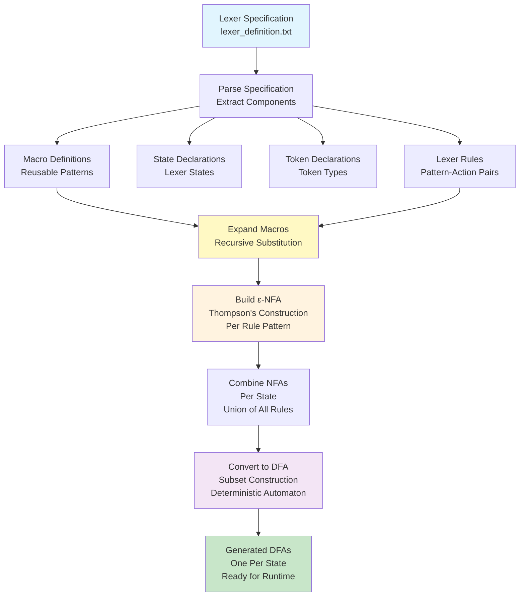

# Lexical Analyzer Design

## Overview

This document provides a comprehensive overview of the lexical analyzer (lexer) implementation in the PPJ compiler. The lexical analyzer is the first phase of compilation, responsible for transforming raw source code—a stream of characters—into a stream of **tokens**, which are meaningful units such as keywords, identifiers, operators, and literals.

**Lexical analysis**, also called **tokenization** or **scanning**, is a fundamental phase of compilation. While it may seem simple at first glance (after all, it's "just" breaking text into words), lexical analysis involves sophisticated algorithms from formal language theory. The PPJ compiler's lexer is implemented using deterministic finite automata (DFA), which are state machines that recognize patterns in the input stream.

The lexer serves several critical functions:
- **Pattern Recognition**: Identifies tokens by matching character sequences against predefined patterns
- **Whitespace Handling**: Discards whitespace and comments, which don't affect program meaning
- **Error Detection**: Identifies invalid character sequences and handles them appropriately
- **Context Management**: Handles context-sensitive lexical constructs like string literals and comments using multiple states

This document explains the design principles, architecture, and operation of the lexical analyzer. For detailed algorithmic information, see [Implementation Notes](implementation-notes.md). For information on writing lexer specifications, see [Token Specification](token-specification.md). For theoretical background, see [Theoretical Foundations](../02-theoretical-foundations/formal-languages-and-grammars.md).

## Lexical Analysis: Purpose and Role

Lexical analysis is the process of breaking a source program into **tokens**—the smallest meaningful units of the programming language. A token represents a single logical entity, such as a keyword, identifier, operator, or literal. The lexer reads the source code character by character and groups characters into tokens according to language rules.

Consider the C statement `int x = 42;`. The lexer recognizes this as six tokens:
1. `int` — keyword (KR_INT)
2. `x` — identifier (IDN)
3. `=` — assignment operator (OP_PRIDRUZI)
4. `42` — integer literal (BROJ)
5. `;` — semicolon delimiter (TOCKAZAREZ)

The lexer discards whitespace (spaces, tabs, newlines) between tokens, as whitespace is only significant for separating tokens, not for program meaning. Comments are also discarded during lexical analysis, as they don't affect program semantics.

### Why Lexical Analysis is Separate

Lexical analysis is separated from syntax analysis for several important reasons:

**Efficiency**: Regular expressions (used for token recognition) can be recognized by finite automata, which are simpler and faster than the pushdown automata needed for parsing context-free grammars. Separating lexical analysis allows efficient token recognition.

**Simplicity**: Token patterns are typically regular (can be described by regular expressions), while syntax is context-free (requires more complex grammars). Separating these concerns simplifies both phases.

**Error Handling**: Lexical errors (invalid characters, unterminated strings) can be detected and handled independently of syntax errors, providing better error messages.

**Portability**: Lexical analysis handles platform-specific issues like line endings (CR, LF, CRLF) and character encoding, isolating these concerns from the rest of the compiler.

### Token Categories

The PPJ compiler's lexer recognizes several categories of tokens:

#### Keywords

Keywords are reserved words that have special meaning in the language. They cannot be used as identifiers. The compiler recognizes the following keywords:

- **Control Flow**: `break`, `continue`, `else`, `for`, `if`, `return`, `while`
- **Type Specifiers**: `char`, `const`, `float`, `int`, `struct`, `void`

Keywords are recognized using exact string matching. For example, the lexer recognizes `int` as the keyword KR_INT, but `integer` (which contains `int` as a substring) would be recognized as an identifier, not a keyword. This is handled by the lexer's pattern matching rules, which prioritize keyword recognition over identifier recognition.

#### Identifiers

Identifiers are names chosen by the programmer for variables, functions, and other program entities. An identifier must start with a letter or underscore, followed by zero or more letters, digits, or underscores. Examples: `x`, `factorial`, `my_variable`, `counter123`.

The lexer recognizes identifiers using a regular expression pattern: `(_|[a-zA-Z])(_|[a-zA-Z0-9])*`. This pattern ensures that identifiers follow C's naming rules while allowing underscores for readability.

#### Literals

Literals are constant values written directly in the source code:

- **Integer Literals**: Sequences of digits, optionally prefixed with `0x` or `0X` for hexadecimal. Examples: `42`, `0xFF`, `12345`.
- **Character Literals**: Single characters enclosed in single quotes. Examples: `'a'`, `'\n'`, `'0'`. Escape sequences are supported.
- **String Literals**: Sequences of characters enclosed in double quotes. Examples: `"hello"`, `"world\n"`. String literals require special handling because they can span multiple lines (with escape sequences) and contain escaped quotes.

#### Operators

Operators are symbols that represent operations:

- **Arithmetic**: `+`, `-`, `*`, `/`, `%`
- **Increment/Decrement**: `++`, `--`
- **Relational**: `<`, `>`, `<=`, `>=`, `==`, `!=`
- **Logical**: `&&`, `||`, `!`
- **Bitwise**: `&`, `|`, `^`, `~`
- **Assignment**: `=`

Some operators consist of multiple characters (like `++`, `<=`, `==`). The lexer uses **maximal munch** (longest match) to ensure that `++` is recognized as a single increment operator, not two addition operators. This requires careful ordering of lexer rules.

#### Delimiters

Delimiters are punctuation marks that structure the program:

- **Brackets**: `[`, `]` (array indexing)
- **Parentheses**: `(`, `)` (function calls, expressions)
- **Braces**: `{`, `}` (blocks, initializers)
- **Punctuation**: `;` (statement terminator), `,` (separator), `.` (member access)

Delimiters are typically single characters, making them straightforward to recognize.

## Lexer Architecture

The PPJ compiler's lexer uses a **two-phase approach**: a **generation phase** that builds finite automata from a specification, and a **runtime phase** that uses those automata to tokenize input.

### Generation Phase: From Specification to Automata

The lexer generation process transforms a textual specification (written in `config/lexer_definition.txt`) into executable finite automata. This process involves several steps, each implementing algorithms from formal language theory:



#### Step 1: Parse Specification

The lexer specification file (`config/lexer_definition.txt`) is parsed to extract four types of components:

1. **Macro Definitions**: Named regular expression patterns that can be reused. For example, `{znak} a|b|c|...|Z` defines a macro for letters.
2. **State Declarations**: The lexer states (e.g., `S_pocetno`, `S_string`, `S_komentar`).
3. **Token Declarations**: All token types that the lexer can produce (e.g., `IDN`, `BROJ`, `KR_INT`).
4. **Lexer Rules**: Pattern-action pairs that specify what tokens to recognize in each state.

The specification parser reads the file line by line, identifying each component type and building internal data structures representing the lexer specification.

#### Step 2: Expand Macros

Macros are expanded recursively—if a macro references another macro, both are expanded. For example, if we have:
```
{znak} a|b|c|...|Z
{znamenka} 0|1|2|...|9
{hexZnamenka} {znamenka}|a|b|c|d|e|f|A|B|C|D|E|F
```

The expansion of `{hexZnamenka}` would substitute `{znamenka}`, producing: `0|1|2|...|9|a|b|c|d|e|f|A|B|C|D|E|F`.

Macro expansion continues until no macro references remain. This allows complex patterns to be built from simpler components, improving readability and maintainability of the lexer specification.

#### Step 3: Build ε-NFA (Thompson's Construction)

For each lexer rule, the regular expression pattern is converted to an **epsilon-NFA** (nondeterministic finite automaton with epsilon transitions) using **Thompson's construction algorithm**.

Thompson's construction works recursively:
- **Single Character**: Creates two states connected by a transition labeled with that character
- **Concatenation** (`ab`): Connects two NFAs in sequence
- **Union** (`a|b`): Creates a new start state with epsilon transitions to both operand NFAs, and a new accepting state reached by epsilon transitions from both operand NFAs
- **Kleene Star** (`a*`): Adds epsilon transitions for zero or more repetitions

The result is an ε-NFA that recognizes the same language as the regular expression. This NFA may have multiple transitions for the same state-symbol pair (nondeterminism) and epsilon transitions (transitions that don't consume input).

#### Step 4: Combine NFAs Per State

All lexer rules for the same state are combined into a single ε-NFA by taking the union of their languages. This creates one ε-NFA per lexer state, where each NFA recognizes any token that can be recognized in that state.

For example, if state `S_pocetno` has rules for recognizing `int` (keyword), identifiers, and numbers, the combined NFA recognizes any of these patterns. The combination is done by creating a new start state with epsilon transitions to each rule's start state, and merging accepting states.

#### Step 5: Convert to DFA (Subset Construction)

Each ε-NFA is converted to an equivalent **deterministic finite automaton (DFA)** using the **subset construction algorithm**. This algorithm builds DFA states as sets of NFA states:

1. **Initial State**: The ε-closure of the NFA's start state (all states reachable via epsilon transitions)
2. **Transitions**: For each DFA state S and input symbol a:
   - Compute `move(S, a)` = all NFA states reachable from S on symbol a
   - Compute `ε-closure(move(S, a))` = all states reachable via epsilon transitions from those states
   - This becomes a new DFA state (or an existing one if already created)
3. **Accepting States**: DFA states containing NFA accepting states are marked as accepting

The result is a DFA—a deterministic automaton with exactly one transition per state-symbol pair. DFAs are more efficient for runtime tokenization because there's no ambiguity about which transition to take.

#### Step 6: Runtime Lexer

The generated DFAs are used at runtime to tokenize input. The runtime lexer:
1. Starts in the initial state (`S_pocetno`)
2. Reads input characters one at a time
3. Follows transitions in the current state's DFA based on the current character
4. When an accepting state is reached, recognizes a token
5. Handles state transitions (e.g., entering string state when `"` is encountered)
6. Applies actions associated with accepting states (return token, change state, etc.)

The runtime lexer implements **maximal munch** (always select the longest matching token) and **rule priority** (earlier rules win in case of ties) to resolve ambiguities.

## Key Algorithms and Principles

The lexer implementation relies on several important algorithms and principles from formal language theory:

### Thompson's Construction: Regular Expression to ε-NFA

**Thompson's construction** is an algorithm that converts a regular expression into an equivalent epsilon-NFA. The algorithm works recursively, building NFAs for subexpressions and combining them:

**Algorithm Overview**:
1. **Base Case (Single Character)**: For a character `a`, create an NFA with two states: a start state and an accepting state, connected by a transition labeled `a`.
2. **Concatenation (`ab`)**: Connect the accepting state of the NFA for `a` to the start state of the NFA for `b` using an epsilon transition.
3. **Union (`a|b`)**: Create a new start state with epsilon transitions to both operand NFAs' start states, and a new accepting state reached by epsilon transitions from both operand NFAs' accepting states.
4. **Kleene Star (`a*`)**: Add epsilon transitions from the start state to the accepting state (for zero repetitions) and from the accepting state back to the start state (for one or more repetitions).

**Example**: The regular expression `(a|b)*c` would be converted to an ε-NFA that:
- Has a start state with an epsilon transition to the union of `a` and `b`
- Has a loop (via epsilon transitions) allowing zero or more repetitions of `a` or `b`
- Transitions to a state recognizing `c`
- Ends at an accepting state

This algorithm ensures that every regular expression can be converted to an equivalent ε-NFA, providing a foundation for token recognition.

### Subset Construction: ε-NFA to DFA

**Subset construction** converts an ε-NFA to an equivalent DFA. The key insight is that DFA states represent **sets** of NFA states—all the NFA states that could be active after reading a given input prefix.

**Algorithm Overview**:
1. **Initial State**: The ε-closure of the NFA's start state (all states reachable via epsilon transitions from the start state).
2. **For Each DFA State S and Input Symbol a**:
   - Compute `move(S, a)` = all NFA states reachable from any state in S on symbol a
   - Compute `ε-closure(move(S, a))` = all states reachable via epsilon transitions from those states
   - This set becomes a new DFA state (or references an existing one)
3. **Accepting States**: DFA states containing any NFA accepting state are marked as accepting

**Example**: Consider an NFA that recognizes `a*`. The DFA would have:
- State 0: {start, accepting} (ε-closure of start state)
- Transition from state 0 on 'a': {start, accepting} (back to state 0)
- State 0 is accepting (contains NFA accepting state)

The resulting DFA is deterministic—for each state and input symbol, there's exactly one transition. This makes runtime tokenization efficient and unambiguous.

### Maximal Munch (Longest Match)

**Maximal munch** is a principle that states: when multiple tokens could match at a given position, always select the **longest** matching token. This principle resolves ambiguities in token recognition.

**Example**: Consider the input `++x`. The lexer could recognize:
- Option 1: `+` followed by `+` followed by `x` (three tokens)
- Option 2: `++` followed by `x` (two tokens)

Maximal munch selects Option 2 because `++` (two characters) is longer than `+` (one character). This ensures that `++` is recognized as the increment operator, not two addition operators.

**Implementation**: The lexer reads characters and follows DFA transitions until no further transitions are possible. At that point, if the current state is accepting, it recognizes the longest token that could be formed. This is achieved by the DFA structure itself—the DFA for `++` will have a longer path than the DFA for `+`, naturally implementing maximal munch.

### Rule Priority

**Rule priority** resolves cases where multiple rules match the same length. The principle states: when multiple tokens match with the same length, select the token from the **earliest** rule in the specification.

**Example**: If the lexer specification has rules:
1. Rule for keyword `int` (returns KR_INT)
2. Rule for identifier pattern (returns IDN)

And the input is `int`, both rules could match. Rule priority ensures that `int` is recognized as a keyword (KR_INT) because the keyword rule appears earlier in the specification.

**Implementation**: When building the combined NFA for a state, rules are processed in order. If multiple rules can accept at the same position, the action from the first matching rule is used. This ensures deterministic token recognition even when patterns overlap.

### Error Recovery

The lexer implements **error recovery** to handle invalid input gracefully. When the lexer encounters a character that doesn't match any pattern, it doesn't immediately fail—instead, it attempts to recover and continue tokenization.

**Algorithm C (Character Discard)**: When an unrecognized character is encountered:
1. Report an error (with line number and character)
2. Discard the unrecognized character
3. Continue tokenization from the next character

This approach allows the lexer to continue processing even after errors, potentially finding additional errors in the same compilation run. However, it can lead to cascading errors if the discarded character was important.

**Special Cases**:
- **Unterminated Strings**: If a string literal is not closed (no closing quote before end of line), the lexer reports an error, discards to the newline, and exits the string state.
- **Unterminated Comments**: If a multi-line comment is not closed, the lexer reports an error and attempts to recover.

Error recovery ensures that the compiler provides useful feedback even when the source code contains errors, helping programmers identify and fix issues.

## Lexer Output Format

The lexer produces output in a structured format that includes both a **symbol table** (mapping token indices to token information) and a **token stream** (the sequence of tokens recognized):

### Symbol Table Format

```
tablica znakova:
indeks   uniformni znak   izvorni tekst
     0   KR_INT            int
     1   IDN               x
     2   OP_PRIDRUZI       =
     3   BROJ              42
     4   TOCKAZAREZ        ;
```

The symbol table provides:
- **Index**: A unique number identifying each token occurrence
- **Uniformni znak** (Uniform Symbol): The token type (KR_INT, IDN, etc.)
- **Izvorni tekst** (Source Text): The actual characters that formed this token

The symbol table allows efficient representation of the token stream—instead of repeating token text, the stream references indices in the symbol table.

### Token Stream Format

```
niz uniformnih znakova:
uniformni znak    redak    indeks u tablicu znakova
KR_INT               1       0
IDN                  1       1
OP_PRIDRUZI          1       2
BROJ                 1       3
TOCKAZAREZ           1       4
```

The token stream provides:
- **Uniformni znak**: The token type
- **Redak** (Line): The line number in the source file where this token appeared
- **Indeks u tablicu znakova**: The index in the symbol table for this token's text

This format allows the parser to efficiently process tokens while maintaining information about source locations for error reporting.

### Example: Complete Tokenization

Consider the C source code:
```c
int x = 42;
```

The lexer would produce:

**Symbol Table**:
```
tablica znakova:
indeks   uniformni znak   izvorni tekst
     0   KR_INT            int
     1   IDN               x
     2   OP_PRIDRUZI       =
     3   BROJ              42
     4   TOCKAZAREZ        ;
```

**Token Stream**:
```
niz uniformnih znakova:
uniformni znak    redak    indeks u tablicu znakova
KR_INT               1       0
IDN                  1       1
OP_PRIDRUZI          1       2
BROJ                 1       3
TOCKAZAREZ           1       4
```

This token stream is then passed to the parser, which uses it to build a parse tree according to the grammar rules.

## Multi-State Lexer Operation

The PPJ compiler's lexer supports **multiple states**, allowing it to handle context-sensitive lexical constructs. Different states apply different token recognition rules, enabling the lexer to correctly handle constructs like string literals and comments.

### Lexer States

The lexer operates in one of several states:

- **S_pocetno** (Initial State): The default state for recognizing most tokens (keywords, identifiers, operators, etc.)
- **S_string** (String State): Active when inside a string literal. In this state, the lexer looks for the closing quote rather than trying to match other patterns.
- **S_komentar** (Comment State): Active when inside a multi-line comment (`/* ... */`). The lexer looks for the comment terminator.
- **S_jednolinijskiKomentar** (Single-line Comment State): Active when inside a single-line comment (`// ...`). The lexer consumes characters until a newline.

### State Transitions

State transitions occur when specific patterns are matched:

**Entering String State**: When the lexer (in initial state) encounters a double quote (`"`), it:
1. Transitions to `S_string` state
2. Does not return a token yet (the string hasn't been completed)
3. Continues reading characters

**Exiting String State**: When the lexer (in string state) encounters a closing double quote, it:
1. Recognizes the complete string literal token
2. Transitions back to `S_pocetno` state
3. Returns the string token

**Example**: Consider the input `"hello"`. The lexer:
1. Starts in `S_pocetno`
2. Encounters `"`, transitions to `S_string`, doesn't return a token
3. Reads `h`, `e`, `l`, `l`, `o` (stays in `S_string`)
4. Encounters `"`, recognizes string token `"hello"`, transitions back to `S_pocetno`, returns token

This multi-state approach allows the lexer to correctly handle constructs that have special syntax requiring context-aware processing.

## Further Reading

For detailed information about specific aspects of lexical analysis:

- **[Implementation Notes](implementation-notes.md)**: Complete technical documentation covering regex parsing, NFA/DFA conversion algorithms, and runtime tokenization
- **[Token Specification](token-specification.md)**: User guide for writing lexer specifications, including macro definitions, state declarations, and lexer rules
- **[Theoretical Foundations](../02-theoretical-foundations/formal-languages-and-grammars.md)**: Formal language theory underlying lexical analysis, including regular languages and finite automata
- **[Configuration Reference](../10-configuration/config-file-reference.md)**: Complete reference for lexer definition file format

---

*The lexical analyzer provides the foundation for compilation, transforming raw source code into structured tokens that can be processed by subsequent phases. Its implementation demonstrates how formal language theory translates into practical pattern recognition algorithms.*
