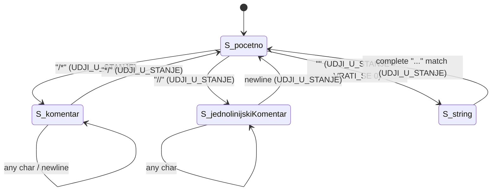
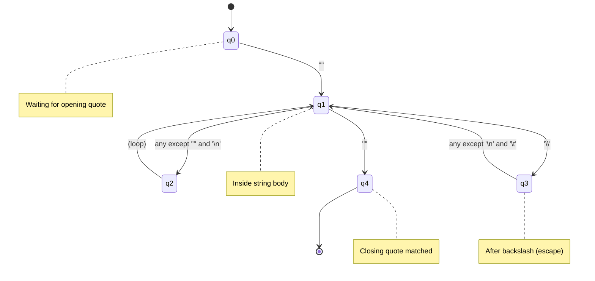
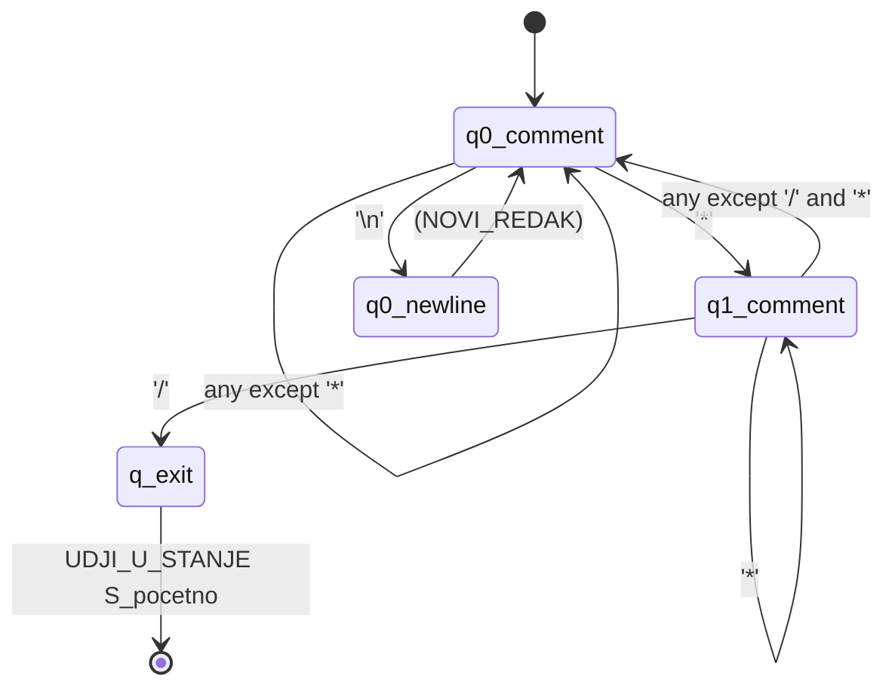
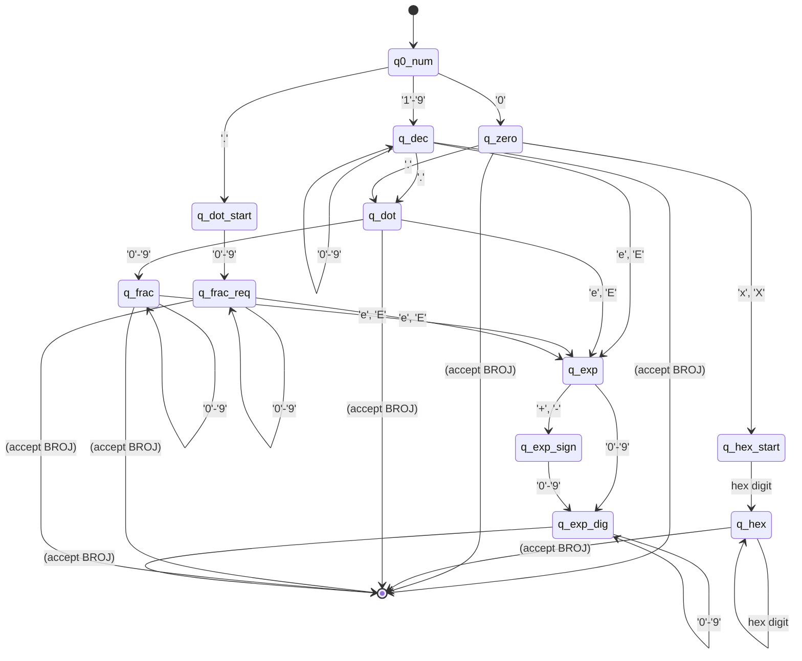
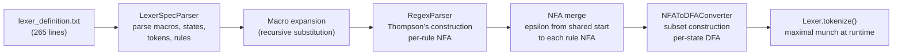
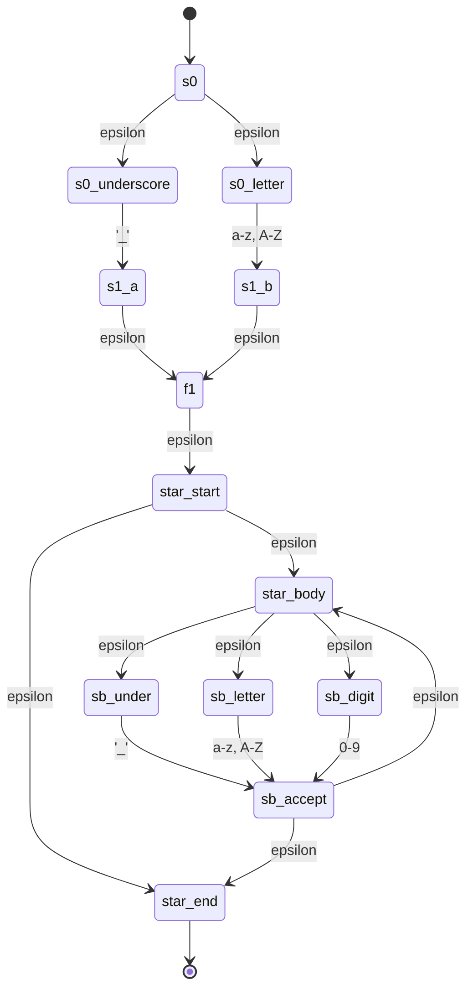
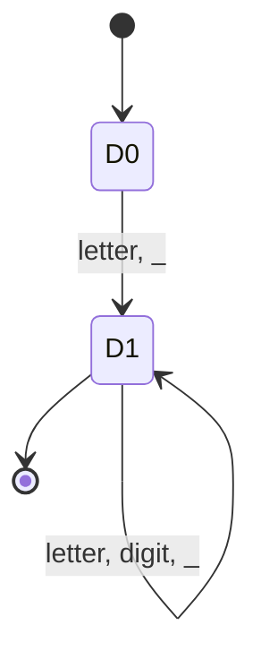
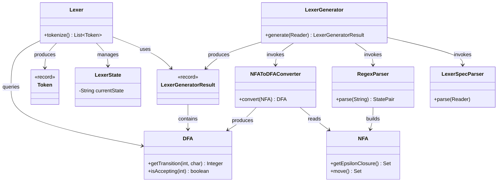

## The Role of Lexical Analysis

Lexical analysis \index{lexical analysis} is the first phase of compilation. It transforms an unstructured stream of characters -- the raw source text as typed by the programmer -- into a structured stream of *tokens* \index{token}. Each token is a meaningful unit of the language: a keyword, an identifier, a numeric literal, an operator, or a punctuation mark. Formally, the lexer implements a function:

$$\text{lex} : \Sigma^* \rightarrow (T \times \text{Lexeme} \times \text{Position})^*$$

where $\Sigma$ is the source character alphabet (printable ASCII plus whitespace), $T$ is the finite set of token types recognized by the parser, and Position records line and column information for diagnostics.

The purpose of this separation is both conceptual and practical. Conceptually, the parser need not concern itself with whitespace handling, comment recognition, or the fact that the keyword `int` is three characters rather than one symbol. Practically, lexical analysis can be implemented with finite automata \index{finite automaton} -- a simpler and more efficient computational model than the pushdown automata required for syntax analysis. The division follows the principle that regular languages should be handled by regular-language machinery, reserving context-free machinery for context-free structure.

The lexer for FRISCcc \index{FRISCcc} is not hand-written. It is generated from a declarative specification file (`config/lexer_definition.txt`) through a pipeline of classical automata constructions: regular expressions are converted to NFAs via Thompson's construction \index{Thompson's construction}, NFAs are merged per lexer state, and subset construction \index{subset construction} produces the DFAs that execute at tokenization time. This approach separates the language specification from the recognition machinery, making the token set modifiable without altering Java code.

This chapter provides a complete treatment of the lexical analysis phase: the formal theory of regular languages and finite automata that underpins it, the concrete algorithms that implement it, and the engineering decisions that shape the FRISCcc lexer.

## Formal Foundations: Regular Languages and Finite Automata

Before examining the FRISCcc lexer in detail, we establish the formal theory on which it rests. The connection between regular expressions, finite automata, and the lexical structure of programming languages is one of the most elegant results in theoretical computer science.

### Regular Expressions

\index{regular expression}

A *regular expression* over an alphabet $\Sigma$ is defined inductively:

1. $\varepsilon$ is a regular expression denoting the language $\{\varepsilon\}$ (the set containing only the empty string).
2. For each $a \in \Sigma$, the symbol $a$ is a regular expression denoting the language $\{a\}$.
3. If $r$ and $s$ are regular expressions denoting languages $L(r)$ and $L(s)$, then:
   - $(r \mid s)$ is a regular expression denoting $L(r) \cup L(s)$ (union).
   - $(rs)$ is a regular expression denoting $L(r) \cdot L(s) = \{xy \mid x \in L(r), y \in L(s)\}$ (concatenation).
   - $(r^*)$ is a regular expression denoting $L(r)^* = \bigcup_{i=0}^{\infty} L(r)^i$ (Kleene closure \index{Kleene closure}).

Operator precedence, from highest to lowest, is: Kleene star, concatenation, union. Parentheses override precedence as usual.

The FRISCcc specification file uses a slightly extended regex notation. The symbol `$` represents $\varepsilon$ (the empty string), the backslash `\` provides character escaping (`\n` for newline, `\t` for tab, `\_` for space), and curly braces reference macro definitions (`{znamenka}` expands to the digit character class). These extensions are purely syntactic sugar; they do not increase the expressive power beyond regular languages.

### Regular Languages

\index{regular language}

A language $L \subseteq \Sigma^*$ is called a *regular language* if there exists a regular expression $r$ such that $L = L(r)$. Equivalently (by Kleene's theorem, stated below), $L$ is regular if and only if it is recognized by some finite automaton.

The token types of a programming language are always regular languages. Each token type -- identifiers, integer literals, string literals, keywords, operators -- can be described by a regular expression. This is not a coincidence but a deliberate design choice: programming languages are designed so that lexical structure is regular, enabling efficient recognition.

### Deterministic Finite Automata (DFA)

\index{DFA} \index{deterministic finite automaton}

A *deterministic finite automaton* is a 5-tuple $D = (Q, \Sigma, \delta, q_0, F)$ where:

- $Q$ is a finite set of *states*.
- $\Sigma$ is a finite *input alphabet*.
- $\delta : Q \times \Sigma \rightarrow Q$ is the *transition function* (a total or partial function).
- $q_0 \in Q$ is the *start state*.
- $F \subseteq Q$ is the set of *accepting* (or *final*) states.

A DFA processes a string $w = a_1 a_2 \cdots a_n$ by starting in $q_0$ and following transitions: $q_i = \delta(q_{i-1}, a_i)$ for $i = 1, 2, \ldots, n$. The string $w$ is *accepted* if $q_n \in F$.

The key property of determinism is that for each state and input symbol, there is at most one successor state. This means DFA execution requires no backtracking and runs in time linear in the length of the input -- exactly the performance characteristic needed for a lexer.

In the FRISCcc implementation, the DFA class encapsulates this 5-tuple:

```java
public final class DFA {
    private final Map<Integer, Map<Character, Integer>> transitions;
    private final Set<Integer> acceptingStates;
    private final Map<Integer, String> acceptingStateTokens;
    private final Map<Integer, List<String>> acceptingStateActions;
    private int startState;
    // ...
}
```

The transition function $\delta$ is implemented as a nested hash map: `transitions.get(state).get(symbol)` returns the successor state, or `null` if no transition exists (partial function). Accepting states carry both a token type and an action list, extending the classical DFA model with the output information needed for tokenization.

### Nondeterministic Finite Automata (NFA)

\index{NFA} \index{nondeterministic finite automaton}

A *nondeterministic finite automaton* is a 5-tuple $N = (Q, \Sigma, \delta, q_0, F)$ where:

- $Q$, $\Sigma$, $q_0$, and $F$ are defined as for DFAs.
- $\delta : Q \times (\Sigma \cup \{\varepsilon\}) \rightarrow \mathcal{P}(Q)$ is the transition function, mapping a state and a symbol (or $\varepsilon$) to a *set* of states.

An NFA differs from a DFA in two critical ways. First, for a given state and symbol, there may be *multiple* successor states -- nondeterminism. Second, the NFA may have *$\varepsilon$-transitions* \index{epsilon-transition}: transitions that consume no input, allowing the automaton to change state spontaneously.

A string $w$ is accepted by an NFA if there exists *some* sequence of transitions (choosing nondeterministically at each step) that leads from $q_0$ to a state in $F$ after consuming all of $w$.

The NFA class in FRISCcc stores transitions and epsilon-transitions separately:

```java
public final class NFA {
    private final Map<Integer, Map<Character, Set<Integer>>> transitions;
    private final Map<Integer, Set<Integer>> epsilonTransitions;
    private final Set<Integer> acceptingStates;
    private int startState;
    // ...
}
```

The separation of epsilon-transitions into their own map simplifies the epsilon-closure computation, which is the fundamental operation needed for both NFA simulation and subset construction.

### Epsilon-Closure

\index{epsilon-closure}

The *epsilon-closure* of a set of states $S$, written $\varepsilon\text{-closure}(S)$, is the set of all NFA states reachable from any state in $S$ by following zero or more $\varepsilon$-transitions. Formally:

$$\varepsilon\text{-closure}(S) = S \cup \bigcup_{q \in S} \varepsilon\text{-closure}(\delta(q, \varepsilon))$$

The FRISCcc NFA class implements this as a fixed-point iteration:

```java
public Set<Integer> getEpsilonClosure(Set<Integer> states) {
    Set<Integer> closure = new HashSet<>(states);
    boolean changed = true;
    while (changed) {
        changed = false;
        Set<Integer> newStates = new HashSet<>();
        for (int state : closure) {
            Set<Integer> eps = epsilonTransitions
                .getOrDefault(state, Set.of());
            for (int next : eps) {
                if (!closure.contains(next)) {
                    newStates.add(next);
                    changed = true;
                }
            }
        }
        closure.addAll(newStates);
    }
    return closure;
}
```

The algorithm iterates until no new states are added (the fixed point is reached). Because the set of NFA states is finite, this always terminates.

### Kleene's Theorem

\index{Kleene's theorem}

**Theorem (Kleene, 1956).** A language $L$ is regular if and only if it is accepted by some DFA. Equivalently, a language is describable by a regular expression if and only if it is recognizable by a finite automaton.

The proof is constructive and yields the algorithms that FRISCcc uses:

- **Regular expression $\to$ NFA**: Thompson's construction (Section 3.5).
- **NFA $\to$ DFA**: Subset construction (Section 3.6).
- **DFA $\to$ Regular expression**: State elimination (not needed for lexer generation, but completes the theoretical cycle).

This equivalence is the theoretical foundation of all lexer generators. It guarantees that any set of token patterns expressible as regular expressions can be compiled into a DFA that recognizes them in linear time.

### The Move Operation

\index{move operation}

Given a set of NFA states $S$ and an input symbol $a$, the *move* operation computes:

$$\text{move}(S, a) = \varepsilon\text{-closure}\left(\bigcup_{q \in S} \delta(q, a)\right)$$

That is, from every state in $S$, follow all transitions on $a$, then take the epsilon-closure of the resulting states. The FRISCcc NFA class implements this directly:

```java
public Set<Integer> move(Set<Integer> states, char symbol) {
    Set<Integer> result = new HashSet<>();
    for (int state : states) {
        Map<Character, Set<Integer>> stateTrans =
            transitions.getOrDefault(state, Map.of());
        Set<Integer> nextStates =
            stateTrans.getOrDefault(symbol, Set.of());
        result.addAll(nextStates);
    }
    return getEpsilonClosure(result);
}
```

The move operation is the core building block of subset construction: each DFA transition is computed as one move operation on the NFA.


## Token Types

The FRISCcc specification defines 47 terminal symbols partitioned into six categories. These are the exact token names used in both the lexer output and the parser input; no renaming occurs between phases.

### Keywords (13 tokens)

\index{keyword}

| Token | Lexeme | Description |
|-------|--------|-------------|
| `KR_BREAK` | `break` | Loop exit |
| `KR_CHAR` | `char` | Character type specifier |
| `KR_CONST` | `const` | Const qualifier |
| `KR_CONTINUE` | `continue` | Loop continuation |
| `KR_ELSE` | `else` | Else branch |
| `KR_FLOAT` | `float` | Floating-point type specifier |
| `KR_FOR` | `for` | For-loop |
| `KR_IF` | `if` | Conditional branch |
| `KR_INT` | `int` | Integer type specifier |
| `KR_RETURN` | `return` | Function return |
| `KR_STRUCT` | `struct` | Structure type |
| `KR_VOID` | `void` | Void type specifier |
| `KR_WHILE` | `while` | While-loop |

Keywords are recognized by exact-match rules listed before the identifier rule in the specification. Because the maximal-munch algorithm \index{maximal munch} selects the longest match and rule order breaks ties on equal-length matches, the keyword `int` is never misclassified as an identifier: the keyword rule appears earlier in the specification. Conversely, `integer` is correctly tokenized as `IDN` because the identifier rule matches a longer prefix than the keyword rule for `int`.

The `KR_` prefix in token names stands for "kljucna rijec" (keyword). This naming convention clearly distinguishes keywords from other token categories.

### Literals (4 tokens)

\index{literal}

| Token | Pattern | Description |
|-------|---------|-------------|
| `IDN` | `(_\|letter)(_\|letter\|digit)*` | Identifiers |
| `BROJ` | Decimal, hex (`0x`/`0X`), or floating-point | Numeric literals |
| `ZNAK` | `'c'` or `'\c'` | Character literals |
| `NIZ_ZNAKOVA` | `"..."` with escape support | String literals |

**Identifiers** (`IDN`) \index{identifier} must begin with a letter or underscore, followed by zero or more letters, digits, or underscores. The regex is `(_|{znak})(_|{znak}|{znamenka})*`. This matches standard C identifier rules.

**Numeric literals** (`BROJ`) \index{numeric literal} are matched by four separate rules in the specification:

1. Decimal integers: `{znamenka}{znamenka}*` -- one or more digits.
2. Hexadecimal integers: `0(X|x){hexZnamenka}{hexZnamenka}*` -- prefix `0x` or `0X` followed by one or more hex digits.
3. Floating-point (digits before dot): `{znamenka}{znamenka}*.{znamenka}*($|{eksponent})` -- e.g., `3.14`, `3.`, `3.14e10`.
4. Floating-point (digits after dot): `{znamenka}*.{znamenka}{znamenka}*($|{eksponent})` -- e.g., `.5`, `.5e-3`.

All four rules emit the same `BROJ` token type; semantic analysis is responsible for distinguishing integer from floating-point values and for range checking.

**Character literals** (`ZNAK`) \index{character literal} are single characters enclosed in single quotes. Two patterns handle the cases:
- `'{sveOsimJednostrukogNavodnikaNovogRedaITaba}'` -- a plain character (no single-quote, newline, or tab).
- `'\\{sveOsimNovogRedaITaba}'` -- an escape sequence (backslash followed by any character except newline and tab).

**String literals** (`NIZ_ZNAKOVA`) \index{string literal} are character sequences enclosed in double quotes, with support for escaped double quotes (`\"`). The recognition mechanism involves a two-phase state transition detailed in Section 3.4.

### Arithmetic and Assignment Operators (9 tokens)

\index{operator}

| Token | Lexeme | Description |
|-------|--------|-------------|
| `PLUS` | `+` | Addition / unary plus |
| `OP_INC` | `++` | Increment |
| `MINUS` | `-` | Subtraction / unary minus |
| `OP_DEC` | `--` | Decrement |
| `ASTERISK` | `*` | Multiplication / pointer dereference |
| `OP_DIJELI` | `/` | Division |
| `OP_MOD` | `%` | Modulo |
| `OP_PRIDRUZI` | `=` | Assignment |
| `OP_TILDA` | `~` | Bitwise complement |

Note that `++` and `--` are listed before `+` and `-` in the specification. The maximal-munch algorithm naturally prefers the two-character match, but rule order provides a second guarantee: even if both rules matched the same prefix (which cannot happen here since `++` is strictly longer), the earlier rule would win.

### Relational and Equality Operators (6 tokens)

| Token | Lexeme | Description |
|-------|--------|-------------|
| `OP_LT` | `<` | Less than |
| `OP_LTE` | `<=` | Less than or equal |
| `OP_GT` | `>` | Greater than |
| `OP_GTE` | `>=` | Greater than or equal |
| `OP_EQ` | `==` | Equality |
| `OP_NEQ` | `!=` | Inequality |

These operators illustrate a common lexical ambiguity: `<=` begins with the same character as `<`. The maximal-munch algorithm resolves this by always trying to match the longest prefix. When the lexer sees `<` followed by `=`, the two-character match `<=` (token `OP_LTE`) wins over the one-character match `<` (token `OP_LT`).

### Logical and Bitwise Operators (7 tokens)

| Token | Lexeme | Description |
|-------|--------|-------------|
| `OP_NEG` | `!` | Logical negation |
| `OP_I` | `&&` | Logical AND |
| `OP_ILI` | `\|\|` | Logical OR |
| `AMPERSAND` | `&` | Bitwise AND / address-of |
| `OP_BIN_ILI` | `\|` | Bitwise OR |
| `OP_BIN_XILI` | `^` | Bitwise XOR |

The single `&` and `|` characters must be distinguished from their doubled counterparts `&&` and `||`. Maximal munch handles this: when the input contains `&&`, the two-character match is longer than the one-character match for `&`, so `OP_I` is emitted. When the input contains `& ` (ampersand followed by a space), only the one-character match succeeds, emitting `AMPERSAND`.

### Punctuation and Delimiters (8 tokens)

\index{delimiter} \index{punctuation}

| Token | Lexeme | Description |
|-------|--------|-------------|
| `ZAREZ` | `,` | Comma separator |
| `TOCKAZAREZ` | `;` | Semicolon (statement terminator, sync token) |
| `TOCKA` | `.` | Dot (struct member access) |
| `L_ZAGRADA` | `(` | Left parenthesis |
| `D_ZAGRADA` | `)` | Right parenthesis |
| `L_UGL_ZAGRADA` | `[` | Left bracket |
| `D_UGL_ZAGRADA` | `]` | Right bracket |
| `L_VIT_ZAGRADA` | `{` | Left brace |
| `D_VIT_ZAGRADA` | `}` | Right brace (sync token) |

The tokens `TOCKAZAREZ` and `D_VIT_ZAGRADA` serve as synchronization tokens \index{synchronization token} in the parser's error recovery mechanism. Their frequent and predictable occurrence in well-formed C code makes them reliable resynchronization points.

### Token Type Taxonomy Summary

\index{token taxonomy}

The complete set of 47 token types can be organized by category and role:

| Category | Count | Token Names | Role |
|----------|-------|-------------|------|
| Keywords | 13 | `KR_BREAK`, `KR_CHAR`, `KR_CONST`, `KR_CONTINUE`, `KR_ELSE`, `KR_FLOAT`, `KR_FOR`, `KR_IF`, `KR_INT`, `KR_RETURN`, `KR_STRUCT`, `KR_VOID`, `KR_WHILE` | Reserved words of the language |
| Identifiers | 1 | `IDN` | User-defined names |
| Numeric literals | 1 | `BROJ` | Integer, hex, and float constants |
| Character literals | 1 | `ZNAK` | Single character constants |
| String literals | 1 | `NIZ_ZNAKOVA` | Character string constants |
| Arithmetic ops | 7 | `PLUS`, `MINUS`, `ASTERISK`, `OP_DIJELI`, `OP_MOD`, `OP_INC`, `OP_DEC` | Arithmetic computation |
| Assignment | 1 | `OP_PRIDRUZI` | Value assignment |
| Relational ops | 4 | `OP_LT`, `OP_LTE`, `OP_GT`, `OP_GTE` | Ordered comparison |
| Equality ops | 2 | `OP_EQ`, `OP_NEQ` | Equality comparison |
| Logical ops | 2 | `OP_I`, `OP_ILI` | Boolean logic |
| Bitwise ops | 4 | `AMPERSAND`, `OP_BIN_ILI`, `OP_BIN_XILI`, `OP_TILDA` | Bit manipulation |
| Negation | 1 | `OP_NEG` | Logical NOT |
| Punctuation | 9 | `ZAREZ`, `TOCKAZAREZ`, `TOCKA`, `L_ZAGRADA`, `D_ZAGRADA`, `L_UGL_ZAGRADA`, `D_UGL_ZAGRADA`, `L_VIT_ZAGRADA`, `D_VIT_ZAGRADA` | Structure and grouping |
| **Total** | **47** | | |

Additionally, the lexer recognizes whitespace (spaces, tabs, newlines) and comments (line and block), but these are consumed silently without producing tokens. They serve only to delimit other tokens and provide human readability.


## Character Class Macros

\index{character class} \index{macro}

The specification defines character class macros using a brace-enclosed name syntax. Each macro expands to a union of individual characters. During generation, macros are recursively expanded with precedence-preserving parentheses before regex-to-NFA conversion.

| Macro | Expansion | Description |
|-------|-----------|-------------|
| `{znak}` | `a\|b\|...\|z\|A\|B\|...\|Z` | All ASCII letters (52 characters) |
| `{znamenka}` | `0\|1\|...\|9` | Decimal digits (10 characters) |
| `{hexZnamenka}` | `{znamenka}\|a\|b\|c\|d\|e\|f\|A\|...\|F` | Hexadecimal digits (22 characters) |
| `{bjelina}` | `\t\|\n\|\_` | Whitespace (tab, newline, space) |
| `{eksponent}` | `(e\|E)($\|+\|-){znamenka}{znamenka}*` | Floating-point exponent |
| `{sviZnakovi}` | All printable ASCII + whitespace | Universal character class |
| `{sveOsimDvostrukogNavodnikaINovogReda}` | All except `"` and `\n` | String body characters |
| `{sveOsimJednostrukogNavodnikaNovogRedaITaba}` | All except `'`, `\n`, `\t` | Char literal body |
| `{sveOsimNovogRedaITaba}` | All except `\n` and `\t` | Escape sequence body |

The macro `{eksponent}` uses `$` as the epsilon symbol in the specification's regex dialect, making the exponent's sign optional: `e+3`, `e-3`, and `e3` are all valid. Macro expansion is recursive -- `{hexZnamenka}` references `{znamenka}`, which is expanded first.

The `{sviZnakovi}` macro is particularly large: it enumerates every printable ASCII character plus whitespace characters, with special characters escaped using backslash notation. The implementation in the specification file lists each character explicitly, separated by `|`, making it approximately 80 characters of individual alternatives. This verbose enumeration is necessary because the specification's regex dialect does not support character class range notation like `[a-z]`.


## Lexer States and Context Sensitivity

\index{lexer state} \index{context sensitivity}

Although each individual DFA is deterministic, the lexer as a whole implements context-sensitive behavior through four explicit lexer states. Each state has its own DFA built from the rules applicable to that state. The active DFA switches when a rule's action executes `UDJI_U_STANJE` (enter state). This design pattern is equivalent to the *start conditions* \index{start condition} in lex/flex tools.

### State Descriptions

**`S_pocetno`** (initial state) \index{S\_pocetno}: The primary scanning state. All keyword, identifier, literal, operator, and punctuation rules are active. Whitespace and newlines are consumed silently. Entry into comment or string states is triggered from here. This state has the largest DFA because it merges the most rules (approximately 50 patterns).

**`S_komentar`** (block comment state) \index{S\_komentar}: Active during `/* ... */` block comments. Only three rules apply: `*/` exits back to `S_pocetno`, `\n` increments the line counter, and `{sviZnakovi}` silently consumes all other characters. No tokens are emitted. The simplicity of this DFA reflects the fact that inside a block comment, no lexical analysis is needed -- we are merely searching for the closing `*/` delimiter.

**`S_jednolinijskiKomentar`** (line comment state) \index{S\_jednolinijskiKomentar}: Active during `// ...` line comments. Two rules: `\n` increments the line counter and returns to `S_pocetno`, and `{sviZnakovi}` consumes all other characters. This state is even simpler than the block comment state: it terminates at the first newline.

**`S_string`** (string literal state) \index{S\_string}: Active during string literal scanning. Contains a single rule that matches the complete string pattern `"(content)*"` and emits `NIZ_ZNAKOVA`, then returns to `S_pocetno`. The entry mechanism uses `VRATI_SE 0` to put the opening quote back into the input buffer so the string rule can match the complete `"..."` pattern.

### State Transition Diagram

The following diagram shows all four lexer states and the transitions between them. Each transition is labeled with the input pattern that triggers it and the action that executes:



### The String Literal State Machine

\index{string literal state machine}

String literal scanning is the most intricate state interaction in the lexer. The mechanism works in two phases:

**Phase 1 -- State Entry.** When `S_pocetno` encounters an opening double-quote `"`, the rule fires with two actions: `UDJI_U_STANJE S_string` switches to the string state, and `VRATI_SE 0` returns all consumed characters (the quote itself) back to the input buffer. No token is emitted. The effect is that the lexer is now in `S_string` with the opening quote still at the head of the buffer.

**Phase 2 -- Full Match.** In `S_string`, the single rule matches the complete pattern `"({sveOsimDvostrukogNavodnikaINovogReda}|\\")*"`. This regex accepts an opening quote, followed by zero or more characters that are either (a) any character except `"` and `\n`, or (b) the escape sequence `\"`, terminated by a closing quote. The entire matched span (including both quotes) is emitted as `NIZ_ZNAKOVA`, and `UDJI_U_STANJE S_pocetno` returns to the initial state.

This two-phase design avoids the complexity of tracking string state character-by-character. The DFA for `S_string` handles the entire string in a single maximal-munch pass. The following diagram illustrates the DFA for string recognition:



Unterminated strings (reaching `\n` or end-of-input without a closing quote) are detected by the runtime as a failure to match in the string state and reported as lexical errors. The error recovery logic in the `Lexer` class handles this case specially: it deletes characters up to the next newline, switches back to `S_pocetno`, and increments the line counter.

### Comment Recognition

\index{comment recognition}

Comments are recognized through state transitions rather than regex patterns in the initial state. This design simplifies the main-state DFA considerably.

**Block comments** (`/* ... */`) are entered when the initial state DFA matches the two-character sequence `/*`. The `S_komentar` DFA then consumes characters until it matches `*/`. The DFA for block comments has the following structure:



Block comments can span multiple lines. The `\n` rule within `S_komentar` ensures that line counting remains accurate even inside comments. This is important for accurate error reporting in later compiler phases.

**Line comments** (`// ...`) are entered when the initial state DFA matches `//`. The `S_jednolinijskiKomentar` DFA is trivial: it consumes all characters except newline, and newline returns to `S_pocetno`.

A subtle point: the `/` character is ambiguous at the lexical level. When the lexer sees `/`, it could be the beginning of `//` (line comment), `/*` (block comment), or the division operator. Maximal munch resolves this: `//` and `/*` are two-character matches that beat the one-character `/` match. If the character after `/` is neither `/` nor `*`, the single-character match emits `OP_DIJELI`.

### Number Literal Recognition

\index{number literal}

Number literals exhibit the most complex pattern matching in the initial state. The lexer must distinguish between decimal integers, hexadecimal integers, and floating-point numbers. The conceptual DFA for number recognition is:



In practice, the actual DFA is much larger because each "range" like `'0'-'9'` is represented as ten individual character transitions (one per digit), since the specification uses explicit character enumeration rather than range notation. The exponent part uses `$` (epsilon) to make the sign optional, so `3.14e10`, `3.14e+10`, and `3.14e-10` are all recognized.


## Specification Pipeline

\index{lexer generation pipeline}

Lexer construction proceeds through four stages, each implemented by a distinct class. The pipeline transforms a declarative specification into the runtime DFA tables:



**Stage 1: Specification Parsing** (`LexerSpecParser`). The configuration file is parsed into structured data: macro definitions, state declarations, token declarations, and lexer rules. Each rule records its applicable state, regex pattern, token type (or `-` for no-emit rules), and action list. The parser handles four line types identified by prefix: `{name}` for macros, `%X` for state declarations, `%L` for token declarations, and `<state>pattern` for rules.

**Stage 2: Macro Expansion.** Macro references in regex patterns are replaced with their expansions, wrapped in parentheses to preserve alternation precedence. Expansion is recursive: `{hexZnamenka}` expands to `({znamenka}|a|b|c|d|e|f|A|B|C|D|E|F)`, and the inner `{znamenka}` is further expanded to `(0|1|2|3|4|5|6|7|8|9)`. A safety limit of 100 iterations prevents infinite loops from circular macro definitions.

**Stage 3: NFA Construction** (`RegexParser`). Each expanded regex is converted to an epsilon-NFA using Thompson's construction. All rule NFAs for a given state are merged into a single NFA by connecting a new start state to each rule's start state via epsilon transitions. Accepting states carry the token type and rule order index. The shared state counter ensures that NFA state numbers are globally unique across all rule NFAs.

**Stage 4: Subset Construction** (`NFAToDFAConverter`). The merged NFA for each state is converted to a DFA. The resulting DFA maps are stored as the lexer runtime's state-to-DFA dictionary. Accepting state conflicts (when a DFA state contains NFA accepting states from multiple rules) are resolved by rule order priority.

The generator orchestration is concise:

```java
public LexerGeneratorResult generate(Reader specReader) throws Exception {
    LexerSpecParser parser = new LexerSpecParser();
    parser.parse(specReader);
    expandMacros(parser.getMacros());

    for (String state : parser.getStates()) {
        DFA dfa = buildDFAForState(state, parser.getRules());
        stateDFAs.put(state, dfa);
    }

    return new LexerGeneratorResult(
        parser.getStates(), parser.getTokens(),
        stateDFAs, parser.getRules());
}
```


## Thompson's Construction

\index{Thompson's construction}

Thompson's construction converts a regular expression into an epsilon-NFA with exactly one start state and one accepting state. The `RegexParser` class implements this recursively, building NFA fragments for each regex operator and composing them. Each fragment is represented as a `StatePair(start, end)`.

### Base Cases

**Single character `a`.** Create two new states $s_0$ and $s_1$ with a transition on character `a` from $s_0$ to $s_1$. The fragment has start $s_0$ and accept $s_1$.

```pseudocode
function char_nfa(a):
    s0 := new_state()
    s1 := new_state()
    add_transition(s0, a, s1)
    return (s0, s1)
```

**Epsilon (`$` in the specification dialect).** Create two new states with an epsilon transition between them. This represents the empty string.

```pseudocode
function epsilon_nfa():
    s0 := new_state()
    s1 := new_state()
    add_epsilon_transition(s0, s1)
    return (s0, s1)
```

### Composition Operators

**Concatenation (`AB`).** \index{concatenation} Given NFA fragments for $A$ (start $s_A$, accept $f_A$) and $B$ (start $s_B$, accept $f_B$), add an epsilon transition from $f_A$ to $s_B$. The resulting fragment has start $s_A$ and accept $f_B$.

```pseudocode
function concat_nfa(A, B):
    add_epsilon_transition(A.end, B.start)
    return (A.start, B.end)
```

**Union (`A|B`).** \index{union} Create new states $s_0$ and $f_0$. Add epsilon transitions from $s_0$ to both $s_A$ and $s_B$, and from both $f_A$ and $f_B$ to $f_0$. The `splitByUnion` method in `RegexParser` correctly handles nested parentheses when splitting on `|`.

```pseudocode
function union_nfa(A, B):
    s0 := new_state()
    f0 := new_state()
    add_epsilon_transition(s0, A.start)
    add_epsilon_transition(s0, B.start)
    add_epsilon_transition(A.end, f0)
    add_epsilon_transition(B.end, f0)
    return (s0, f0)
```

**Kleene star (`A*`).** \index{Kleene star} Create new states $s_0$ and $f_0$. Add four epsilon transitions: $s_0 \to s_A$ (enter loop), $f_A \to f_0$ (exit loop), $s_0 \to f_0$ (skip entirely), and $f_A \to s_A$ (repeat). This produces the standard Thompson star construction.

```pseudocode
function star_nfa(A):
    s0 := new_state()
    f0 := new_state()
    add_epsilon_transition(s0, A.start)   // enter loop
    add_epsilon_transition(A.end, f0)      // exit loop
    add_epsilon_transition(s0, f0)         // skip (zero iterations)
    add_epsilon_transition(A.end, A.start) // repeat
    return (s0, f0)
```

### Detailed Example: NFA for the Identifier Pattern

\index{identifier pattern}

Consider the identifier pattern `(_|{znak})(_|{znak}|{znamenka})*`. We trace Thompson's construction step by step.

**Step 1: Macro expansion.** Replace `{znak}` with the 52-letter union and `{znamenka}` with the 10-digit union:

```
(_|a|b|...|z|A|...|Z)(_|a|b|...|z|A|...|Z|0|1|...|9)*
```

**Step 2: Build the first group** `(_|a|b|...|z|A|...|Z)`. This is a 53-way union. Thompson's construction creates:
- One new start state $s_0$ and one new accept state $f_0$.
- For each of the 53 alternatives, a two-state NFA fragment (character transition).
- Epsilon transitions from $s_0$ to each fragment's start, and from each fragment's accept to $f_0$.
- Total states for this group: $2 + 53 \times 2 = 108$ states, with 53 character transitions and $2 \times 53 = 106$ epsilon transitions.

**Step 3: Build the second group** `(_|a|b|...|z|A|...|Z|0|1|...|9)`. This is a 63-way union (53 letters + 10 digits). Similarly: $2 + 63 \times 2 = 128$ states.

**Step 4: Apply Kleene star** to the second group. Add 2 new states and 4 epsilon transitions, yielding 130 states for the starred group.

**Step 5: Concatenation.** Connect the first group's accept state to the starred group's start state via an epsilon transition.

The total NFA for the identifier pattern has approximately $108 + 130 = 238$ states. After subset construction, this collapses to a DFA with only 3 states (start, "matched one character", "matched one or more characters"), demonstrating the dramatic compression that subset construction can achieve.

The following diagram illustrates the simplified NFA structure (with character classes abstracted):




## Subset Construction

\index{subset construction} \index{powerset construction}

The `NFAToDFAConverter` implements the standard subset construction (also called powerset construction) algorithm to convert the merged epsilon-NFA into a DFA. This is the algorithm that bridges the gap between the NFA (convenient for construction) and the DFA (efficient for execution).

### Algorithm

The subset construction algorithm builds a DFA where each DFA state corresponds to a *set* of NFA states. The intuition is that the DFA simulates the NFA by tracking all possible NFA states simultaneously.

```pseudocode
function subset_construction(NFA N):
    Input: NFA N = (Q_N, Sigma, delta_N, q_0, F_N)
    Output: DFA D = (Q_D, Sigma, delta_D, d_0, F_D)

    d_0 := epsilon_closure({q_0})
    Q_D := {d_0}
    worklist := [d_0]

    while worklist is not empty:
        S := worklist.remove_first()
        for each character c in alphabet(S):
            T := epsilon_closure(move(S, c))
            if T is not empty:
                if T not in Q_D:
                    Q_D := Q_D union {T}
                    worklist.add(T)
                delta_D(S, c) := T

    F_D := { S in Q_D | S intersect F_N != empty }
    return D
```

Each DFA state is a set of NFA states. The epsilon closure operation computes all NFA states reachable from a given set via zero or more epsilon transitions. The `move` operation computes all NFA states reachable from a given set via a single transition on character `c`, followed by epsilon closure.

### Step-by-Step Walkthrough: Subset Construction for Identifiers

To make the algorithm concrete, we trace it on a simplified identifier regex `[a-c_][a-c_0-1]*` (using a small alphabet for clarity). After Thompson's construction, suppose our NFA has:

- Start state: $q_0$
- First group (union of `_`, `a`, `b`, `c`): States $q_1$ through $q_{10}$
- Kleene star group: States $q_{11}$ through $q_{24}$
- Accept state: $q_{25}$

**Iteration 0 -- Initialize.** Compute the start DFA state:

$D_0 = \varepsilon\text{-closure}(\{q_0\}) = \{q_0, q_1, q_3, q_5, q_7\}$

(reaching the start states of each alternative in the first group via epsilon transitions)

**Iteration 1 -- Process $D_0$.** Compute transitions:

- $\text{move}(D_0, \texttt{\_}) = \varepsilon\text{-closure}(\{q_2\}) = \{q_2, q_{10}, q_{11}, q_{13}, q_{15}, q_{17}, q_{19}, q_{25}\}$ -- call this $D_1$
- $\text{move}(D_0, \texttt{a}) = \varepsilon\text{-closure}(\{q_4\})$ -- yields same reachable structure as $D_1$, so $D_1$
- $\text{move}(D_0, \texttt{b})$ -- same: $D_1$
- $\text{move}(D_0, \texttt{c})$ -- same: $D_1$

Since all four transitions lead to essentially the same set of reachable NFA states, we get a single DFA state $D_1$.

**Iteration 2 -- Process $D_1$.** $D_1$ contains $q_{25}$ (accepting), so $D_1 \in F_D$. Compute transitions:

- $\text{move}(D_1, \texttt{\_})$ -- follows Kleene star loop, returns to $D_1$
- $\text{move}(D_1, \texttt{a})$ -- returns to $D_1$
- $\text{move}(D_1, \texttt{b})$ -- returns to $D_1$
- $\text{move}(D_1, \texttt{c})$ -- returns to $D_1$
- $\text{move}(D_1, \texttt{0})$ -- returns to $D_1$ (digits allowed in Kleene star)
- $\text{move}(D_1, \texttt{1})$ -- returns to $D_1$

All transitions from $D_1$ loop back to $D_1$. The worklist is now empty.

**Result:** The DFA has exactly two states:
- $D_0$ (start, non-accepting): transitions on `_`, `a`, `b`, `c` to $D_1$.
- $D_1$ (accepting): transitions on `_`, `a`, `b`, `c`, `0`, `1` to $D_1$.

| DFA State | `_` | `a` | `b` | `c` | `0` | `1` | Accepting? |
|-----------|-----|-----|-----|-----|-----|-----|-----------|
| $D_0$ | $D_1$ | $D_1$ | $D_1$ | $D_1$ | -- | -- | No |
| $D_1$ | $D_1$ | $D_1$ | $D_1$ | $D_1$ | $D_1$ | $D_1$ | Yes (IDN) |

This two-state DFA recognizes identifiers in linear time with zero backtracking. The 238-state NFA for the full identifier pattern (with the complete alphabet) similarly collapses to a DFA of comparable simplicity.



### Accepting State Resolution

\index{accepting state resolution}

When a DFA state (which is a set of NFA states) contains multiple NFA accepting states from different rules, a conflict exists: which token type should the DFA state report? The converter resolves this by rule order -- the accepting state from the earliest rule in the specification file wins. This is implemented by sorting accepting NFA states by their recorded rule-order index and selecting the first:

```java
if (!nfaStateRuleOrder.isEmpty()) {
    acceptingStates.sort((a, b) -> {
        int orderA = nfaStateRuleOrder
            .getOrDefault(a, Integer.MAX_VALUE);
        int orderB = nfaStateRuleOrder
            .getOrDefault(b, Integer.MAX_VALUE);
        if (orderA != orderB) {
            return Integer.compare(orderA, orderB);
        }
        return Integer.compare(a, b);
    });
}
int bestState = acceptingStates.get(0);
```

This rule-order priority \index{rule-order priority} is critical for keyword-versus-identifier disambiguation. The keyword rules (e.g., `int` emitting `KR_INT`) appear before the general identifier rule in the specification. When both rules' NFA accepting states appear in the same DFA state, the keyword rule's lower order index causes it to win. Consider the input `int`: after reading the three characters, the DFA is in a state that merges:

- The accepting state from the `int` keyword rule (rule order index, say, 12).
- The accepting state from the identifier rule (rule order index, say, 25).

The converter selects rule 12 (the keyword), so the DFA state is tagged with `KR_INT`.

### Per-State DFA Construction

Subset construction runs independently for each lexer state. The sizes of the resulting DFAs vary significantly:

| Lexer State | Approximate Rules | DFA Characteristics |
|-------------|------------------|---------------------|
| `S_pocetno` | ~50 | Largest DFA; merges keyword, identifier, operator, literal, and whitespace patterns |
| `S_komentar` | 3 | Small DFA; only detects `*/`, `\n`, and catch-all |
| `S_jednolinijskiKomentar` | 2 | Minimal DFA; detects `\n` and catch-all |
| `S_string` | 1 | Moderate DFA; string pattern has large character class but single rule |

The `S_pocetno` DFA is the performance-critical automaton since it processes the vast majority of input characters. The comment and string DFAs are tiny by comparison.


## The Maximal Munch Algorithm

\index{maximal munch}

At runtime, `Lexer.tokenize(...)` uses a maximal-munch algorithm with explicit panic-mode recovery. This is the algorithm that transforms the input character stream into the token stream consumed by the parser.

### Formal Definition

**Definition (Maximal Munch).** Given an input string $w$ and a DFA $D$, the *maximal munch* of $w$ under $D$ is the longest prefix $u$ of $w$ such that $D$ accepts $u$. If no prefix is accepted, the maximal munch is undefined.

The maximal munch principle ensures that the lexer is greedy: it always consumes as many characters as possible for each token. This is the standard behavior for virtually all programming language lexers.

### Algorithm Detail

The implementation in `scanToken` maintains tracking variables as the DFA processes characters: `lastAcceptingState` records the most recent DFA state that was an accepting state, and `lastAcceptingMatch` records how many characters had been consumed at that point. When the DFA reaches a state with no transition for the next input character (a "dead end"), the method returns the token associated with `lastAcceptingState` and rewinds the input to consume exactly `lastAcceptingMatch` characters.

```pseudocode
function scanToken(buffer, lexerState):
    dfa := getDFA(lexerState.currentState)
    currentState := dfa.startState
    matchLength := 0
    lastAcceptingState := NONE
    lastAcceptingMatch := 0
    lastAcceptingToken := null
    lastAcceptingActions := null

    for i := 0 to buffer.length - 1:
        c := buffer[i]
        nextState := dfa.transition(currentState, c)

        if nextState is null:
            // Dead end -- stop scanning
            break

        currentState := nextState
        matchLength := matchLength + 1

        if dfa.isAccepting(currentState):
            lastAcceptingState := currentState
            lastAcceptingMatch := matchLength
            lastAcceptingToken := dfa.getToken(currentState)
            lastAcceptingActions := dfa.getActions(currentState)

    if lastAcceptingMatch == 0:
        return null  // No match found

    matchedText := buffer[0..lastAcceptingMatch]
    process actions (VRATI_SE, UDJI_U_STANJE, NOVI_REDAK)
    consume lastAcceptingMatch characters from buffer
    return Token(lastAcceptingToken, matchedText, line, column)
```

### The Outer Tokenization Loop

The `tokenize` method wraps `scanToken` in a loop that processes the entire input:

```pseudocode
function tokenize(input):
    state := new LexerState("S_pocetno")
    buffer := read_all(input)
    tokens := []

    while buffer is not empty:
        beforeLength := buffer.length
        beforeState := state.currentState

        token := scanToken(buffer, state)

        if token is not null:
            if token.type is not null and not empty:
                tokens.append(token)

        else if buffer.length < beforeLength
                or state.currentState != beforeState:
            continue  // State changed or characters consumed; retry

        else:
            // Panic-mode recovery (Algorithm C)
            report error: unrecognized character buffer[0]
            discard buffer[0]

    return tokens
```

### Concrete Example: Tokenizing `int++x`

\index{tokenization example}

To illustrate the maximal munch algorithm in action, consider the input string `int++x`. We trace the algorithm step by step.

**Pass 1: Position 0, buffer = `int++x`**

The DFA for `S_pocetno` starts at state $D_0$. The lexer feeds characters one by one:

| Step | Character | DFA State | Accepting? | Token | Match Length |
|------|-----------|-----------|------------|-------|-------------|
| 1 | `i` | $D_1$ | Yes | `IDN` | 1 |
| 2 | `n` | $D_2$ | Yes | `IDN` | 2 |
| 3 | `t` | $D_3$ | Yes | `KR_INT` | 3 |
| 4 | `+` | dead end | -- | -- | -- |

At step 3, the DFA is in a state where both the `int` keyword rule and the identifier rule accept. Rule-order priority selects `KR_INT`. At step 4, the `+` character has no transition from $D_3$, so scanning stops. The maximal munch is `int` (3 characters), emitting `KR_INT`.

Buffer after: `++x`.

**Pass 2: Position 0, buffer = `++x`**

| Step | Character | DFA State | Accepting? | Token | Match Length |
|------|-----------|-----------|------------|-------|-------------|
| 1 | `+` | $D_4$ | Yes | `PLUS` | 1 |
| 2 | `+` | $D_5$ | Yes | `OP_INC` | 2 |
| 3 | `x` | dead end | -- | -- | -- |

At step 1, `+` matches `PLUS`. At step 2, `++` matches `OP_INC` (longer match). The maximal munch is `++` (2 characters), emitting `OP_INC`.

Buffer after: `x`.

**Pass 3: Position 0, buffer = `x`**

| Step | Character | DFA State | Accepting? | Token | Match Length |
|------|-----------|-----------|------------|-------|-------------|
| 1 | `x` | $D_1$ | Yes | `IDN` | 1 |

End of buffer reached in accepting state. The maximal munch is `x` (1 character), emitting `IDN`.

**Final token stream:** `KR_INT("int")`, `OP_INC("++")`, `IDN("x")`.

### Another Example: The Ambiguous `<<=`

Consider the input `<<=`. This is ambiguous: is it `<<` followed by `=`, or `<` followed by `<=`? The FRISCcc lexer does not have a `<<` (left shift) token, so the actual tokenization is:

| Pass | Buffer | Maximal Match | Token |
|------|--------|---------------|-------|
| 1 | `<<=` | `<` (1 char) -- `<=` would also start with `<`, but the DFA checks: `<` at step 1 accepts as `OP_LT`, `<=` at step 2 accepts as `OP_LTE`, then `=` at step 3 has no transition. Maximal munch selects `<=` (2 chars). | `OP_LTE` |
| 2 | `=` | `=` (1 char) | `OP_PRIDRUZI` |

Wait -- let us retrace more carefully. Starting from `<<=`:

| Step | Char | State | Accepting? | Match |
|------|------|-------|------------|-------|
| 1 | `<` | Transitions to state for `<` | Yes (`OP_LT`, 1 char) | `<` |
| 2 | `<` | No transition from `<`-accept state on `<` | Dead end | -- |

The DFA for `<` and `<=` has: start $\to$ `<`-state (accepting as `OP_LT`) $\to$ on `=` goes to `<=`-state (accepting as `OP_LTE`). There is no transition from the `<`-state on another `<`. So the maximal munch is `<` (1 char), emitting `OP_LT`. Then `<=` is next, matching `OP_LTE`, then the buffer is empty. Result: `OP_LT("<")`, `OP_LTE("<=")`.

### Tie-Breaking by Rule Order

\index{rule order}

When two rules match prefixes of the same length, the rule appearing earlier in the specification wins. This guarantee is preserved through the entire pipeline: NFA accepting states carry rule-order indices, subset construction propagates these indices into DFA accepting states, and the runtime simply reads the pre-resolved token type from the DFA.

For example, the keyword `for` matches both the `for` keyword rule (early in the spec) and the identifier rule (later). Both match exactly 3 characters. Rule order selects the keyword.

### The VRATI_SE (Backtrack) Action

\index{VRATI\_SE} \index{backtrack action}

The `VRATI_SE n` action (equivalent to `yyless(n)` in lex/flex) modifies the standard maximal-munch behavior. After matching $k$ characters, only the first $n$ characters are consumed; the remaining $k - n$ characters are returned to the input buffer for re-scanning.

The implementation processes this action after the match:

```java
Integer backtrack = null;
if (longestActions != null) {
    for (String action : longestActions) {
        if (action.startsWith("VRATI_SE")) {
            String[] parts = action.split("\\s+");
            if (parts.length > 1) {
                backtrack = Integer.parseInt(parts[1]);
            }
        }
    }
}

int actualMatch;
if (backtrack != null && backtrack >= 0
        && backtrack <= longestMatch) {
    actualMatch = backtrack;
} else {
    actualMatch = longestMatch;
}
input.delete(0, actualMatch);
```

This action is used in exactly one place in the specification: the string entry rule `VRATI_SE 0`, which matches the opening quote, switches to `S_string`, and puts the quote back so the string rule can match the entire `"..."` pattern. The `VRATI_SE 0` is a particularly dramatic use: zero characters are consumed, so the entire match is "returned." This effectively peeks at the input without consuming it, using the match only to trigger the state transition.


## Complete Tokenization Example

\index{tokenization example}

Consider the following C program that computes the factorial function:

```c
int factorial(int n) {
    if (n <= 1) return 1;
    return n * factorial(n - 1);
}
```

The FRISCcc lexer processes this input and produces the following complete token stream. Each token records its type, lexeme, line number, column number, and symbol table index.

### Line 1: `int factorial(int n) {`

| # | Line | Col | Token | Lexeme | Symbol Table Index | Notes |
|---|------|-----|-------|--------|--------------------|-------|
| 1 | 1 | 1 | `KR_INT` | `int` | 0 | Keyword rule wins over IDN |
| 2 | 1 | 5 | `IDN` | `factorial` | 1 | Identifier |
| 3 | 1 | 14 | `L_ZAGRADA` | `(` | 2 | Left parenthesis |
| 4 | 1 | 15 | `KR_INT` | `int` | 0 | Same symbol table entry as #1 |
| 5 | 1 | 19 | `IDN` | `n` | 3 | Parameter name |
| 6 | 1 | 20 | `D_ZAGRADA` | `)` | 4 | Right parenthesis |
| 7 | 1 | 22 | `L_VIT_ZAGRADA` | `{` | 5 | Left brace |

Between `int` and `factorial` (position 4), there is a space character. The whitespace rule matches it and emits no token. The column counter advances past it.

### Line 2: `    if (n <= 1) return 1;`

| # | Line | Col | Token | Lexeme | Symbol Table Index | Notes |
|---|------|-----|-------|--------|--------------------|-------|
| 8 | 2 | 5 | `KR_IF` | `if` | 6 | Keyword |
| 9 | 2 | 8 | `L_ZAGRADA` | `(` | 2 | Reuses symbol table entry |
| 10 | 2 | 9 | `IDN` | `n` | 3 | Same `n` as parameter |
| 11 | 2 | 11 | `OP_LTE` | `<=` | 7 | Maximal munch: `<=` (2 chars) beats `<` (1 char) |
| 12 | 2 | 14 | `BROJ` | `1` | 8 | Decimal integer literal |
| 13 | 2 | 15 | `D_ZAGRADA` | `)` | 4 | Reuses symbol table entry |
| 14 | 2 | 17 | `KR_RETURN` | `return` | 9 | Keyword |
| 15 | 2 | 24 | `BROJ` | `1` | 8 | Same entry as #12 (same type+text) |
| 16 | 2 | 25 | `TOCKAZAREZ` | `;` | 10 | Statement terminator |

Note that both occurrences of `1` share symbol table index 8, since they have the same token type (`BROJ`) and the same lexeme text (`1`).

### Line 3: `    return n * factorial(n - 1);`

| # | Line | Col | Token | Lexeme | Symbol Table Index | Notes |
|---|------|-----|-------|--------|--------------------|-------|
| 17 | 3 | 5 | `KR_RETURN` | `return` | 9 | Same entry as #14 |
| 18 | 3 | 12 | `IDN` | `n` | 3 | Same entry as #5, #10 |
| 19 | 3 | 14 | `ASTERISK` | `*` | 11 | Multiplication operator |
| 20 | 3 | 16 | `IDN` | `factorial` | 1 | Same entry as #2 |
| 21 | 3 | 25 | `L_ZAGRADA` | `(` | 2 | |
| 22 | 3 | 26 | `IDN` | `n` | 3 | |
| 23 | 3 | 28 | `MINUS` | `-` | 12 | Subtraction (not `--` because next char is space) |
| 24 | 3 | 30 | `BROJ` | `1` | 8 | Same entry |
| 25 | 3 | 31 | `D_ZAGRADA` | `)` | 4 | |
| 26 | 3 | 32 | `TOCKAZAREZ` | `;` | 10 | |

### Line 4: `}`

| # | Line | Col | Token | Lexeme | Symbol Table Index | Notes |
|---|------|-----|-------|--------|--------------------|-------|
| 27 | 4 | 1 | `D_VIT_ZAGRADA` | `}` | 13 | Right brace |

### Token Stream Summary

The complete program of 4 lines produces 27 tokens. The symbol table contains 14 unique entries (indices 0 through 13). Multiple tokens share symbol table entries: for instance, all three occurrences of `n` share index 3, and both `return` keywords share index 9.

Whitespace tokens (6 spaces on lines 2-3, plus the tab indentation) are consumed silently and do not appear in the output. Newline characters trigger `NOVI_REDAK` actions that increment the line counter but emit no tokens.

### Extended Example with Comments and Strings

Consider this more complex input:

```c
/* Greet the user */
int main() {
    char *msg = "Hello, World!\n";
    // Print message
    return 0;
}
```

The tokenization trace for the comment and string handling:

1. `/*` at line 1, column 1: Matches in `S_pocetno`, triggers `UDJI_U_STANJE S_komentar`. No token emitted.
2. ` Greet the user `: Characters consumed one by one in `S_komentar` by the catch-all rule. No tokens.
3. `*/` at line 1: Matches in `S_komentar`, triggers `UDJI_U_STANJE S_pocetno`. No token emitted.
4. Line 2: `int` -> `KR_INT`, `main` -> `IDN`, `(` -> `L_ZAGRADA`, `)` -> `D_ZAGRADA`, `{` -> `L_VIT_ZAGRADA`.
5. Line 3: `char` -> `KR_CHAR`, `*` -> `ASTERISK`, `msg` -> `IDN`, `=` -> `OP_PRIDRUZI`.
6. `"` at line 3: Matches in `S_pocetno`, triggers `UDJI_U_STANJE S_string` + `VRATI_SE 0`. Quote returned to buffer.
7. `"Hello, World!\n"`: In `S_string`, the complete string pattern matches. Emits `NIZ_ZNAKOVA` with lexeme `"Hello, World!\n"`. Returns to `S_pocetno`.
8. `;` -> `TOCKAZAREZ`.
9. `//` at line 4: Matches in `S_pocetno`, triggers `UDJI_U_STANJE S_jednolinijskiKomentar`.
10. ` Print message`: Consumed in `S_jednolinijskiKomentar`.
11. `\n` at end of line 4: Triggers `NOVI_REDAK` and `UDJI_U_STANJE S_pocetno`.
12. Line 5: `return` -> `KR_RETURN`, `0` -> `BROJ`, `;` -> `TOCKAZAREZ`.
13. `}` -> `D_VIT_ZAGRADA`.


## Symbol Table Construction

\index{symbol table}

The lexer maintains a symbol table as a list of unique `(token_type, lexeme)` pairs. Each emitted token stores an integer index into this table rather than carrying its own copy of the lexeme string. The `getOrAddSymbol` method performs a linear scan to check for existing entries:

```java
private int getOrAddSymbol(String token, String text) {
    for (int i = 0; i < symbolTableList.size(); i++) {
        SymbolTableEntry entry = symbolTableList.get(i);
        if (entry.token().equals(token)
                && entry.text().equals(text)) {
            return i;
        }
    }
    int index = symbolTableList.size();
    symbolTableList.add(new SymbolTableEntry(token, text));
    return index;
}
```

The linear scan is adequate for the typical program sizes that FRISCcc targets. For the factorial example above, the symbol table has only 14 entries. Even for larger programs, the number of unique (type, lexeme) pairs is bounded by the number of distinct identifiers, literals, keywords, and operators -- typically well under a thousand.

This design serves two purposes. First, it reduces duplication in serialized output: when the lexer's output is written to an artifact file, recurring identifiers and keywords are represented by compact indices rather than repeated strings. Second, it provides a foundation for semantic analysis: the symbol table indices give downstream phases a stable reference for each unique lexical entity.

The `SymbolTableEntry` is a Java record:

```java
public record SymbolTableEntry(String token, String text) {}
```

The immutability of records ensures that symbol table entries cannot be accidentally modified after creation.


## Error Recovery and Diagnostics

\index{error recovery} \index{panic mode}

The lexer implements panic-mode error recovery. When the current-state DFA cannot match any prefix starting at the current buffer position, the lexer performs a controlled recovery to continue processing.

### The Panic-Mode Algorithm

The recovery procedure is:

1. Report a diagnostic with the unrecognized character, its line, and its column.
2. Discard exactly one character from the input buffer.
3. Continue scanning from the next character.

This guarantees forward progress: each error recovery step consumes at least one character, preventing infinite loops. The single-character discard is deliberately minimal; discarding more could skip valid tokens.

The implementation:

```java
if (buffer.length() > 0) {
    char c = buffer.charAt(0);
    int errorLine = state.getLineNumber();
    int errorCol = state.getColumnNumber();

    reportError(reporter, errorLine, errorCol,
        String.format("neprepoznat znak '%c' (0x%02x)",
            c, (int) c));

    buffer.deleteCharAt(0);

    if (c == '\n') {
        state.newLine();
    } else {
        state.advanceColumn();
    }
}
```

The error message includes both the character itself and its hexadecimal code point. This is particularly helpful for non-printable characters that might appear in the source file due to encoding issues.

### Unterminated String Recovery

\index{unterminated string}

Unterminated string literals require special handling. When the lexer is in `S_string` and encounters a newline (which the string pattern does not allow), or reaches end-of-input, it detects an unterminated string:

```java
if (state.getCurrentState().equals("S_string")
        && buffer.length() > 0) {
    char firstChar = buffer.charAt(0);
    if (firstChar == '\n') {
        reportError(reporter, errorLine, errorCol,
            "nezatvoren string literal");
        // Delete up to and including the newline
        int newlineIndex = buffer.indexOf("\n");
        buffer.delete(0, newlineIndex + 1);
        state.enterState("S_pocetno");
        state.newLine();
    }
}
```

The recovery strategy for unterminated strings is more aggressive than the single-character discard: it deletes everything up to the next newline and returns to the initial state. This is appropriate because partial string content would produce meaningless tokens.

### Error Examples

**Example 1: Unrecognized character.** Input: `int x = 42@;`

The `@` character is not part of the FRISCcc alphabet. The lexer processes:
- `int` -> `KR_INT`
- `x` -> `IDN`
- `=` -> `OP_PRIDRUZI`
- `42` -> `BROJ`
- `@` -> **Error: "neprepoznat znak '@' (0x40)" at line 1, column 13.** Character discarded.
- `;` -> `TOCKAZAREZ`

The lexer recovers and continues, producing 5 valid tokens plus 1 diagnostic.

**Example 2: Unterminated string.** Input:

```c
char *s = "hello
int x = 5;
```

The lexer processes:
- `char`, `*`, `s`, `=` -> normal tokens
- `"` -> enters `S_string`, `VRATI_SE 0`
- `"hello` -> attempts to match string pattern in `S_string`. Reaches `\n` without closing quote.
- **Error: "nezatvoren string literal" at line 1.** Characters deleted up to newline.
- Returns to `S_pocetno`, increments line counter.
- `int`, `x`, `=`, `5`, `;` -> normal tokens on line 2.

**Example 3: Unterminated block comment.** Input:

```c
int x = 5; /* this comment never ends
int y = 10;
```

The lexer processes:
- `int`, `x`, `=`, `5`, `;` -> normal tokens
- `/*` -> enters `S_komentar`
- All remaining characters are consumed by the catch-all rule in `S_komentar`.
- End-of-input reached while still in `S_komentar`. No error is explicitly reported for unterminated block comments (the comment simply consumes everything), but the tokens on line 2 are never produced.

### Diagnostic Infrastructure

All diagnostics flow through the `DiagnosticReporter` interface, producing structured `Diagnostic` objects tagged with `Stage.LEXER`, source location, and a human-readable message. This enables uniform error presentation across all compiler phases:

```java
private void reportError(DiagnosticReporter reporter,
        int line, int col, String msg) {
    if (reporter != null) {
        reporter.report(Diagnostic.error(
            Stage.LEXER,
            new SourceLocation(line, col),
            msg));
    }
}
```

The diagnostic system supports three severity levels (error, warning, info) and records the compiler stage that produced the diagnostic. This allows the compiler driver to filter, sort, and present diagnostics in a user-friendly manner.

### Safety Mechanisms

The tokenization loop includes a safety limit to prevent infinite loops:

```java
int iterations = 0;
int maxIterations = 100000;

while (buffer.length() > 0 && iterations < maxIterations) {
    iterations++;
    // ... tokenization logic ...
}

if (iterations >= maxIterations) {
    reporter.error(Stage.LEXER, location,
        "Lexer loop exceeded maximum iterations");
}
```

This is a defensive measure against implementation bugs. In correct operation, the loop always makes forward progress (either consuming characters, changing state, or discarding a character in error recovery). The 100,000-iteration limit is generous enough to handle any realistic input.


## Determinism and Rule Priority

\index{determinism}

The lexer is fully deterministic at runtime. Every input character in every state has at most one DFA transition. The two sources of apparent nondeterminism in the specification -- overlapping regex patterns and multiple applicable rules -- are resolved at generation time:

1. **Maximal munch** selects the longest matching prefix, eliminating ambiguity between prefixes (e.g., `<` vs `<=`).
2. **Rule order** breaks ties on equal-length matches, eliminating ambiguity between rules (e.g., `int` as keyword vs. identifier).

These two policies together guarantee that tokenization is a pure function of the input text: the same input always produces the same token sequence, regardless of implementation-internal ordering of hash maps or sets.

### Interaction Between Maximal Munch and Rule Order

The two disambiguation mechanisms interact in a precise hierarchy:

1. **Length wins first.** If one rule matches a longer prefix than another, the longer match always wins, regardless of rule order.
2. **Rule order wins second.** Only when two rules match prefixes of *exactly the same length* does rule order come into play.

This means that even though `int` appears before the identifier rule, the identifier `integer` is never broken into `int` + `eger`. The identifier rule matches all 7 characters, while the keyword rule matches only 3. Length wins.

Conversely, the bare input `int` (followed by a non-identifier character like space or parenthesis) matches both the keyword rule (3 characters, `KR_INT`) and the identifier rule (3 characters, `IDN`). Here, rule order breaks the tie in favor of `KR_INT`.


## Complexity Analysis

### Generation Time

\index{complexity analysis}

Subset construction has worst-case exponential blowup: an NFA with $n$ states can produce a DFA with up to $2^n$ states. In practice, the character-class-heavy patterns in the FRISCcc specification produce moderately large but manageable DFAs. The `S_pocetno` DFA is the largest because it merges approximately 50 rule NFAs, each of which may expand character class macros into large unions.

The theoretical worst case is rarely realized in practice because:
1. Most NFA states are reachable only through specific character sequences, so the number of *reachable* DFA states is far less than $2^n$.
2. Character class expansions produce many NFA states that transition to the same target, which subset construction merges efficiently.

### Runtime

DFA execution is $O(n)$ in input length for a fixed automaton. Each input character requires exactly one hash-map lookup in the DFA transition table. The maximal-munch outer loop processes the entire input with at most one DFA traversal per token plus at most one character discard per error, yielding overall $O(n)$ time where $n$ is the input length.

More precisely, let $n$ be the input length, $t$ be the number of tokens produced, and $e$ be the number of error recoveries. The total number of DFA transitions executed is at most $n + t$ (each character is read at most once per successful match, plus each match may read one character past the end to detect the dead end). The error recovery cost is $O(e)$. Thus the total cost is $O(n + t + e) = O(n)$ since $t + e \leq n$.

### Space

The DFA transition table dominates space usage. For a DFA with $s$ states and an alphabet of size $|\Sigma|$, the hash-map-based representation uses $O(s \cdot k)$ space where $k$ is the average number of transitions per state (typically much less than $|\Sigma|$ due to sparsity). The token list and symbol table use $O(t)$ and $O(u)$ space respectively, where $u$ is the number of unique (type, lexeme) pairs.


## Design Patterns in the Lexer Architecture

\index{design pattern}

The FRISCcc lexer employs several well-known design patterns, whether by deliberate choice or by convergent evolution toward clean architecture.

### The State Pattern

\index{State pattern}

The `LexerState` class implements a variant of the State pattern. The lexer's behavior changes based on the current state (`S_pocetno`, `S_komentar`, etc.), with each state selecting a different DFA. Rather than using polymorphism (subclassing a `State` interface), the implementation uses a simpler data-driven approach: the current state is a string, and the DFA lookup is a hash-map access. This is appropriate because the states differ only in their DFA, not in their scanning algorithm.

```java
public final class LexerState {
    private String currentState;
    private final Stack<String> stateStack;
    private int lineNumber;
    private int columnNumber;
    // ...
}
```

The `stateStack` provides a history mechanism via `enterState` and `returnToPreviousState`, though the FRISCcc specification only uses direct state transitions (no stack-based returns).

### The Strategy Pattern

\index{Strategy pattern}

Each lexer state has its own DFA, and the runtime selects which DFA to use based on the current state. This is the Strategy pattern: the DFA is the "strategy" that defines the scanning behavior, and the state selects the strategy. The `LexerGeneratorResult` stores the state-to-DFA mapping:

```java
public record LexerGeneratorResult(
    List<String> states,
    List<String> tokens,
    Map<String, DFA> stateDFAs,
    List<LexerSpecParser.LexerRule> rules
) {}
```

At runtime, strategy selection is a single hash-map lookup:

```java
DFA dfa = generatorResult.stateDFAs()
    .get(lexerState.getCurrentState());
```

### The Builder / Pipeline Pattern

\index{pipeline pattern}

The lexer generation pipeline (`LexerSpecParser` -> macro expansion -> `RegexParser` -> `NFAToDFAConverter`) follows the pipeline pattern, where each stage transforms data for the next. The `LexerGenerator` class acts as the orchestrator, invoking each stage in sequence. Each stage has a single responsibility and a clear interface.

### Encapsulation of Automata

The `DFA` class encapsulates the automaton data structure, providing a clean interface (`getTransition`, `isAccepting`, `getToken`, `getActions`) that hides the internal hash-map representation. The `NFA` class similarly encapsulates epsilon-transitions and provides `getEpsilonClosure` and `move` operations. This encapsulation allows the internal representation to change (e.g., switching from hash maps to arrays for performance) without affecting clients.


## Implementation Class Structure

\index{class structure}

The following class diagram shows the relationships between the major lexer classes:



The implementation spans these classes:

| Class | Responsibility |
|-------|---------------|
| `LexerSpecParser` | Parses `lexer_definition.txt` into macros, states, tokens, and rules |
| `RegexParser` | Converts regex patterns to epsilon-NFAs via Thompson's construction |
| `NFA` | Epsilon-NFA data structure with epsilon-closure and move operations |
| `NFAToDFAConverter` | Subset construction with rule-order-based accepting state resolution |
| `DFA` | DFA data structure with transition lookup, accepting states, and actions |
| `LexerGenerator` | Orchestrates the pipeline: parse, expand, build NFAs, convert to DFAs |
| `LexerGeneratorResult` | Immutable result record holding per-state DFA maps |
| `Lexer` | Runtime tokenizer: maximal munch, state management, symbol table |
| `LexerState` | Mutable state tracker: current state name, line number, column number |
| `Token` | Immutable token record: type, text, line, column, symbol table index |


## Edge Cases and Special Handling

\index{edge cases}

Several aspects of lexical analysis require careful handling that goes beyond the basic DFA-based scanning algorithm.

### The Division/Comment Ambiguity

The character `/` can begin three different token sequences: the division operator `/`, a line comment `//`, or a block comment `/*`. This is resolved entirely by maximal munch:

| Input | Match 1 | Match 2 | Maximal | Token |
|-------|---------|---------|---------|-------|
| `/ x` | `/` (1 char, `OP_DIJELI`) | -- | `/` | `OP_DIJELI` |
| `// x` | `/` (1 char, `OP_DIJELI`) | `//` (2 chars, state transition) | `//` | (state change) |
| `/* x */` | `/` (1 char, `OP_DIJELI`) | `/*` (2 chars, state transition) | `/*` | (state change) |

### Dot Ambiguity

The `.` character can be the struct member access operator (`TOCKA`) or the start of a floating-point literal (`.5` is a valid float). The specification handles this with rule ordering and overlapping patterns:

- The floating-point pattern `{znamenka}*.{znamenka}{znamenka}*($|{eksponent})` matches `.5`, `.5e10`, etc.
- The dot operator pattern `.` matches a single dot.

When the input is `.5`, maximal munch matches `.5` (2 characters) as `BROJ`, beating `.` (1 character) as `TOCKA`. When the input is `.x` (dot followed by a letter), only the single-dot pattern matches, producing `TOCKA`.

### Escaped Characters in Regex

The specification's regex dialect uses backslash for escaping special characters. The `RegexParser` handles these escape sequences:

| Escape | Meaning | Usage |
|--------|---------|-------|
| `\t` | Tab character | Whitespace rules |
| `\n` | Newline character | Line-counting rules |
| `\_` | Space character | Whitespace rules |
| `\(`, `\)` | Literal parentheses | Character classes |
| `\{`, `\}` | Literal braces | Character classes |
| `\|` | Literal pipe | Logical OR operator token |
| `\*` | Literal asterisk | Multiplication operator, block comment delimiters |
| `\\` | Literal backslash | String escape sequences |
| `\$` | Literal dollar sign | Character classes |

The `isOperator` method in `RegexParser` correctly determines whether a character is an operator or an escaped literal by counting preceding backslashes:

```java
private boolean isOperator(String expression, int i, char op) {
    if (expression.charAt(i) != op) return false;
    int backslashCount = 0;
    for (int j = i - 1; j >= 0
            && expression.charAt(j) == '\\'; j--) {
        backslashCount++;
    }
    return backslashCount % 2 == 0;
}
```

An even number of preceding backslashes means the character is an operator; an odd number means it is escaped.

### Buffer Management

The lexer reads input line by line into a `StringBuilder` buffer and processes it incrementally. This design allows the lexer to handle input of arbitrary size without loading the entire file into memory at once. However, the current implementation does buffer all of each line, which is sufficient for typical source files.

The buffer management interacts with the state machine in a critical way: when `VRATI_SE 0` puts characters back into the buffer, those characters are re-scanned in the new state. The `StringBuilder.delete(0, actualMatch)` operation efficiently removes consumed characters from the front of the buffer.

### Maximum Token Length

There is no explicit maximum token length in the FRISCcc lexer. The `StringBuilder` buffer grows as needed, and the DFA processes characters without any length limit. In practice, token length is bounded by the input size, and the most common long tokens are string literals and identifiers. The safety limit of 100,000 iterations in the tokenization loop provides an implicit bound on total processing, but not on individual token length.

### Character Encoding

The FRISCcc lexer operates on Java `char` values, which are UTF-16 code units. In practice, the specification's character classes enumerate only ASCII characters (codes 0-127), so the lexer effectively processes ASCII text. Characters outside the ASCII range will not match any pattern and will trigger error recovery. This is a deliberate simplification appropriate for a compiler targeting the FRISC architecture, which operates on ASCII-based instruction sets.


## Comparison with Traditional Lex/Flex

\index{lex} \index{flex}

The FRISCcc lexer generator follows the same theoretical framework as classical tools like lex and flex, but with several differences in implementation:

| Aspect | lex/flex | FRISCcc |
|--------|----------|---------|
| DFA representation | Packed arrays (table-driven) | Hash maps (Java) |
| Character classes | `[a-z]` range notation | Explicit enumeration |
| Lookahead | `/` lookahead operator | `VRATI_SE n` action |
| State transitions | `BEGIN(state)` | `UDJI_U_STANJE state` |
| Line counting | `yylineno` option | `NOVI_REDAK` action |
| Backtracking | `yyless(n)` | `VRATI_SE n` |
| Spec format | `.l` file with `%%` sections | Custom format with `{`, `%X`, `%L`, `<state>` |
| Output format | Generated C code | Runtime Java DFA objects |

The most significant difference is the DFA representation. Lex/flex generate table-driven lexers with packed transition arrays, which provide excellent cache performance. FRISCcc uses Java `HashMap` objects, which add the overhead of boxing, hashing, and pointer chasing but provide cleaner code and easier debugging.

Another difference is that lex/flex generate source code (typically C), while FRISCcc generates DFA data structures that are interpreted at runtime. This makes FRISCcc's approach more flexible (the DFA tables could be serialized and loaded without recompilation) but slightly slower due to the interpretation overhead.


## Summary

The lexical analysis phase of FRISCcc transforms source text into a stream of typed, positioned tokens using a generated DFA-based scanner. The key principles are:

1. **Declarative specification**: Token patterns are defined in `lexer_definition.txt`, separate from the recognition machinery.
2. **Classical automata pipeline**: Regular expressions are compiled to NFAs (Thompson's construction), then to DFAs (subset construction).
3. **Maximal munch**: The lexer always matches the longest possible prefix.
4. **Rule-order priority**: Equal-length matches are disambiguated by specification order.
5. **Context sensitivity via states**: Four lexer states handle comments, strings, and normal code with separate DFAs.
6. **Panic-mode recovery**: Unrecognized characters are discarded one at a time, ensuring forward progress.
7. **Linear-time execution**: DFA scanning is $O(n)$ in input length.

The result is a robust, efficient lexer that correctly handles the full range of C-like lexical constructs including keywords, identifiers, numeric literals (decimal, hex, float), character and string literals with escape sequences, operators of varying length, comments (line and block), and whitespace -- while providing precise error diagnostics for malformed input.
