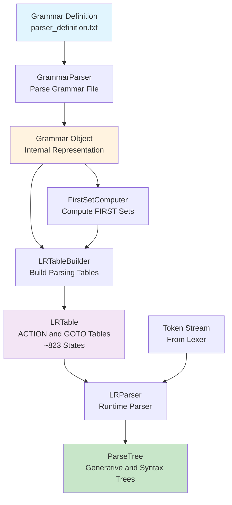

# Grammar Specification

## Overview

The parser module implements a **canonical LR(1) syntax analyzer** for the PPJ language. **Syntax analysis**, also called **parsing**, is the second phase of compilation. It takes the stream of tokens produced by the lexical analyzer and determines whether they form a syntactically valid program according to the language's grammar rules.

A **grammar** is a formal specification of the syntax of a programming language. It defines which sequences of tokens are valid programs and how those sequences are structured. The PPJ compiler uses a **context-free grammar** written in Backus-Naur Form (BNF) notation to specify the syntax of the C subset it supports.

The parser performs several critical functions:
- **Syntax Validation**: Verifies that the token stream forms a valid program according to the grammar
- **Parse Tree Construction**: Builds tree structures representing how the program was derived from the grammar
- **Error Detection**: Identifies syntax errors and provides meaningful error messages
- **Tree Generation**: Produces both complete parse trees and simplified abstract syntax trees

The parser generates two types of output trees:
- **Generative trees**: Complete parse trees showing every grammar production used in the derivation
- **Syntax trees**: Simplified abstract syntax trees (AST) with non-semantic nodes removed, suitable for semantic analysis and code generation

The parser implementation demonstrates canonical LR(1) parsing algorithms, including automatic parsing table generation, item set construction, and efficient runtime parsing. The grammar produces approximately 823 parser states, demonstrating the complexity of parsing even a subset of C.

**See Also**:
- **[Parser Construction](parser-construction.md)**: Detailed parser implementation, grammar parsing, and FIRST set computation
- **[Parsing Tables and Algorithms](parsing-tables-and-algorithms.md)**: Complete LR(1) algorithm details, CLOSURE and GOTO algorithms, and table construction
- **[Configuration Reference](../10-configuration/config-file-reference.md)**: Complete grammar file format specification
- **[Theoretical Foundations](../02-theoretical-foundations/formal-languages-and-grammars.md)**: Context-free grammar theory, derivations, and parsing algorithms

## Grammar Architecture

The parser module consists of several interconnected components that work together to perform syntax analysis. Understanding these components and their interactions is essential for understanding how the parser works.

### Component Overview

The parser architecture follows a clear separation of concerns, with each component responsible for a specific aspect of parsing:



### Component Details

#### 1. Grammar Parser (`GrammarParser`)

The `GrammarParser` class is responsible for reading and parsing the grammar definition file (`config/parser_definition.txt`). This file contains the grammar specification in a custom format that defines:

- **Non-terminals**: Grammar symbols that can be rewritten using productions (e.g., `<izraz>`, `<naredba>`)
- **Terminals**: Token types from the lexer (e.g., `IDN`, `BROJ`, `KR_INT`)
- **Synchronization tokens**: Tokens used for error recovery (e.g., `TOCKAZAREZ`, `D_VIT_ZAGRADA`)
- **Productions**: Grammar rules specifying how non-terminals can be rewritten (e.g., `<izraz> ::= <izraz_pridruzivanja>`)

The grammar parser reads the file line by line, identifying each component type and building an internal representation. It handles both multi-line production format (where alternatives are on separate indented lines) and single-line format (where alternatives are separated by `|`).

**Example**: The grammar parser reads:
```
<izraz>
 <izraz_pridruzivanja>
 <izraz> ZAREZ <izraz_pridruzivanja>
```

And creates production objects representing:
- `<izraz> → <izraz_pridruzivanja>`
- `<izraz> → <izraz> ZAREZ <izraz_pridruzivanja>`

#### 2. Grammar Object (`Grammar`)

The `Grammar` class represents the parsed grammar as an internal data structure. It provides:
- **Access to productions**: Look up productions by left-hand side non-terminal
- **Symbol information**: Lists of terminals and non-terminals
- **Grammar augmentation**: Adds a new start symbol and production for LR parsing
- **Production indexing**: Fast lookup of productions by index

The grammar object is **augmented** for LR parsing by adding a new start symbol `S'` and production `S' → S`, where `S` is the original start symbol. This augmentation ensures that the parser can recognize when the entire input has been parsed successfully.

#### 3. FIRST Set Computer (`FirstSetComputer`)

The `FirstSetComputer` computes **FIRST sets** for grammar symbols and sequences. The FIRST set of a symbol (or sequence of symbols) is the set of terminals that can begin strings derived from that symbol.

**Why FIRST Sets are Needed**: LR(1) parsing uses **lookahead**—examining the next token to resolve parsing decisions. FIRST sets are used to compute which tokens can appear after a given sequence, enabling correct lookahead computation.

**Algorithm**: The FIRST set computation uses a fixed-point algorithm:
1. Initialize FIRST sets for terminals (each terminal's FIRST set contains only itself)
2. For each production `A → X₁X₂...Xₖ`:
   - Add FIRST(X₁) to FIRST(A)
   - If X₁ can derive epsilon, add FIRST(X₂)
   - Continue until a symbol that cannot derive epsilon is found
   - If all symbols can derive epsilon, add epsilon to FIRST(A)
3. Repeat until no more changes occur (fixed point)

**Example**: For the grammar:
```
<izraz> → <izraz_pridruzivanja>
<izraz_pridruzivanja> → IDN
```

FIRST(`<izraz_pridruzivanja>`) = {IDN}
FIRST(`<izraz>`) = FIRST(`<izraz_pridruzivanja>`) = {IDN}

#### 4. LR(1) Parser Generator

The parser generator builds the **parsing tables** used by the runtime parser. It consists of several components:

**`LRClosure`**: Implements the **CLOSURE algorithm**, which computes the closure of a set of LR(1) items. An LR(1) item is a production with a dot (indicating parsing progress) and a lookahead set. The closure adds all items that can be reached via epsilon productions.

**`LRGoto`**: Implements the **GOTO algorithm**, which computes the transition from one item set to another on a given symbol. GOTO moves the dot past a symbol and computes the closure of the resulting items.

**`LRTableBuilder`**: Orchestrates the table construction process:
1. Builds the initial item set (containing the augmented start production with end-of-input lookahead)
2. Computes GOTO transitions for all symbols
3. Builds new item sets as needed
4. Constructs ACTION table (shift, reduce, accept, error actions)
5. Constructs GOTO table (transitions on non-terminals)

The table builder generates approximately **823 states** for the PPJ grammar. Each state represents a set of LR(1) items—productions with dot positions and lookahead sets that indicate what the parser is expecting at that point in the parse.

#### 5. Runtime Parser (`LRParser`)

The `LRParser` class uses the generated parsing tables to parse token streams. It implements the standard LR parsing algorithm:

**Algorithm**:
1. Initialize with start state on the stack
2. For each input token:
   - Look up ACTION[current_state, token]
   - If ACTION is **shift**: Push token and new state onto stack, advance input
   - If ACTION is **reduce**: Pop handle from stack, push non-terminal, look up GOTO[state, non-terminal]
   - If ACTION is **accept**: Successfully parsed input
   - If ACTION is **error**: Report syntax error, attempt recovery
3. Build parse tree during reduce actions

The parser builds the parse tree incrementally: each reduce action creates a new tree node with the popped symbols as children. When parsing completes, the root of the parse tree represents the entire program.

#### 6. Tree Generation

The parser generates two types of trees:

**Generative Tree** (`generativno_stablo.txt`): A complete parse tree showing every grammar production used in the derivation. This tree includes all intermediate nodes, making it useful for understanding the parsing process and debugging grammar issues.

**Syntax Tree** (`sintaksno_stablo.txt`): A simplified abstract syntax tree (AST) with non-semantic nodes removed. For example, chain productions like `E → T → F → id` are simplified to `E → id`. This simplified tree is more suitable for semantic analysis and code generation, as it focuses on semantic structure rather than grammar structure.

The tree generation process involves traversing the parse tree built during parsing and applying simplification rules to produce the syntax tree.

## Output Files

The parser generates two output files:

### `generativno_stablo.txt`
Complete parse tree showing the derivation process. Every grammar production is represented as a node.

**Format:**
```
0:<symbol>
    1:<child1>
        2:<child2>
    ...
```

### `sintaksno_stablo.txt`
Abstract syntax tree (AST) optimized for semantic analysis and code generation. Intermediate grammar nodes that don't add semantic value are removed.

**Format:**
Same as generative tree, but with simplified structure.

## Usage

### Via CLI

```bash
# Run lexical and syntax analysis
./ccompiler syntax program.c

# Output files are generated in compiler-bin/:
# - leksicke_jedinke.txt
# - generativno_stablo.txt
# - sintaksno_stablo.txt
```

### Programmatic Usage

```java
ParserConfig.Config config = ParserConfig.Config.createDefault(
    inputTokensPath,
    outputDirectory
);

Parser parser = new Parser();
parser.parse(config);
```

## LR(1) Table Caching

The parser uses table caching to avoid regenerating LR(1) parsing tables on every run. Tables are serialized to `target/parser-cache/lr_table.ser` and reused across test runs.

To clear the cache:
```java
LRTableCache.clearCache();
```

## Error Handling

The parser implements basic error recovery using synchronization tokens defined in the grammar (`%Syn` section). When a parse error occurs:

1. Error is logged with line number and token information
2. Parser attempts to recover by skipping to synchronization tokens
3. If recovery fails, a `ParserException` is thrown

## Tree Structure

### Generative Tree
- Complete representation of the parse
- Every grammar production is a node
- Useful for debugging and understanding the parse process

### Syntax Tree (AST)
- Simplified structure
- Removes intermediate nodes that don't add semantic value
- Optimized for:
  - Semantic analysis
  - Type checking
  - Code generation

**Nodes skipped in syntax tree:**
- Intermediate list nodes that are just wrappers
- Redundant expression nodes
- Single-child wrapper nodes

## Performance

- **State generation**: ~823 states generated in ~7 seconds
- **Table caching**: First run builds table, subsequent runs load from cache
- **Parsing speed**: Linear time complexity O(n) where n is number of tokens

## Testing

The parser includes comprehensive tests:

- **Unit tests**: Test individual components (Grammar, FIRST sets, etc.)
- **Integration tests**: Test full parsing pipeline
- **Golden file tests**: Verify output file generation (no comparison with expected)

## Future Enhancements

1. **AST Builder**: Convert ParseTree to typed AST nodes
2. **Better error recovery**: Implement panic mode with more sophisticated recovery
3. **Incremental parsing**: Support for parsing partial programs
4. **Error messages**: More detailed and helpful error messages

## References

1. Srbljić, Siniša (2007). *Prevođenje programskih jezika*. Element, Zagreb. ISBN 978-953-197-625-1.

2. Aho, A. V., Lam, M. S., Sethi, R., & Ullman, J. D. (2006). *Compilers: Principles, Techniques, and Tools* (2nd ed.). Pearson Education.

## Additional Documentation

For detailed technical documentation on the LR parser implementation, see:
- [LR_PARSER_TECHNICAL.md](LR_PARSER_TECHNICAL.md) - Detailed technical documentation on algorithms and implementation

