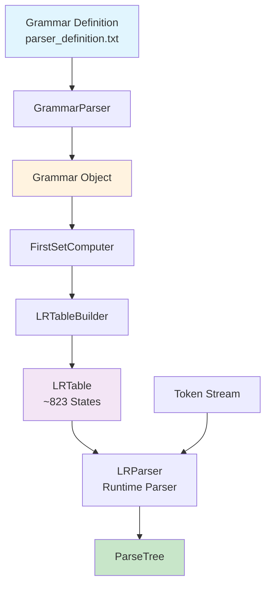
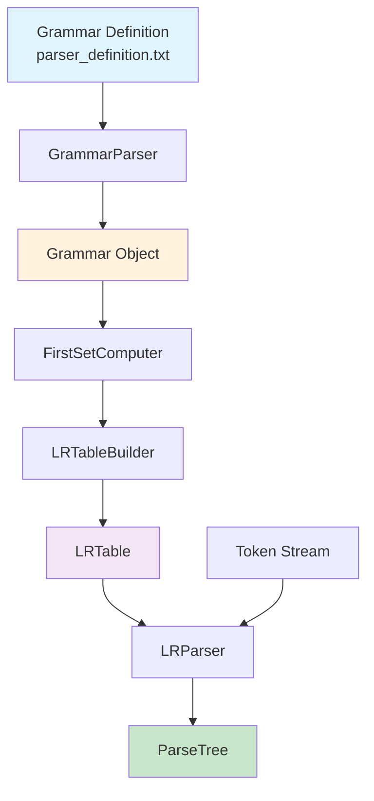

# Parser Construction

## Overview

This document describes the construction and implementation of the LR(1) parser used in the PPJ compiler. The parser transforms token streams into parse trees using canonical LR(1) parsing tables generated automatically from the grammar specification.

## Parser Architecture

The parser module consists of several key components:





### Components

1. **GrammarParser**: Parses grammar definition file into internal representation
2. **Grammar**: Represents grammar with productions, terminals, and non-terminals
3. **FirstSetComputer**: Computes FIRST sets for grammar symbols
4. **LRTableBuilder**: Builds canonical LR(1) parsing tables
5. **LRParser**: Runtime parser using generated tables
6. **ParseTree**: Represents both generative and syntax trees

## Grammar Parsing

### Grammar Definition Format

The grammar is defined in `config/parser_definition.txt` with the following structure:

- **Non-terminals**: `%V <nonterm1> <nonterm2> ...`
- **Terminals**: `%T TOKEN1 TOKEN2 ...`
- **Synchronization tokens**: `%Syn TOKEN1 TOKEN2 ...`
- **Productions**: `<nonterm> ::= alternative1 | alternative2 ...`

### Grammar Parser Implementation

The `GrammarParser` class reads the grammar definition:

```java
public class GrammarParser {
    public void parse(Reader reader) throws IOException {
        // Read %V line (non-terminals)
        // Read %T line (terminals)
        // Read %Syn line (synchronization tokens)
        // Read productions (LHS and alternatives)
    }
}
```

**Key Features**:
- Handles both multi-line and single-line production formats
- Supports epsilon productions (`$`)
- Validates grammar syntax
- Builds production index for fast lookup

## FIRST Set Computation

### Algorithm

The `FirstSetComputer` computes FIRST sets for all grammar symbols:

```text
function compute-FIRST(grammar):
    FIRST = {}
    
    // Initialize terminals
    for each terminal t:
        FIRST[t] = {t}
    
    // Initialize non-terminals
    for each non-terminal A:
        FIRST[A] = {}
    
    // Iterate until fixed point
    changed = true
    while changed:
        changed = false
        for each production A → X₁X₂...Xₖ:
            for i = 1 to k:
                old_size = |FIRST[A]|
                FIRST[A] ∪= FIRST[Xᵢ] - {ε}
                if ε not in FIRST[Xᵢ]:
                    break
                if i == k:
                    FIRST[A] ∪= {ε}
                if |FIRST[A]| > old_size:
                    changed = true
    
    return FIRST
```

### FIRST Set Usage

FIRST sets are used for:
- Computing lookahead sets in LR(1) items
- Resolving reduce-reduce conflicts
- Error recovery

**See Also**: [Parsing Tables and Algorithms](parsing-tables-and-algorithms.md)

## LR(1) Table Construction

### Item Set Construction

The `LRTableBuilder` constructs canonical LR(1) item sets:

1. **Initial Item Set**: `CLOSURE({[S' → · S, #]})`
2. **GOTO Transitions**: For each item set I and symbol X, compute `GOTO(I, X)`
3. **Table Generation**: Build ACTION and GOTO tables from item sets

### CLOSURE Algorithm

```text
function CLOSURE(I):
    repeat
        for each [A → α · Bβ, a] in I:
            for each production B → γ:
                for each b in FIRST(βa):
                    add [B → · γ, b] to I
    until no changes
    return I
```

### GOTO Algorithm

```text
function GOTO(I, X):
    J = {}
    for each [A → α · Xβ, a] in I:
        add [A → αX · β, a] to J
    return CLOSURE(J)
```

### Table Size

For the PPJ grammar:
- **Approximately 823 states** (item sets)
- **ACTION table**: state × terminal → action
- **GOTO table**: state × non-terminal → state

**See Also**: [LR Parser Technical Documentation](parsing-tables-and-algorithms.md)

## Runtime Parsing

### LR Parser Algorithm

The `LRParser` uses the generated tables to parse token streams:

```text
function LR-parse(tokens, ACTION, GOTO):
    stack = [0]  // Initial state
    tokens.append(EOF)
    ip = 0
    
    while true:
        state = top(stack)
        token = tokens[ip]
        action = ACTION[state, token]
        
        if action is shift(s):
            push(token, stack)
            push(s, stack)
            ip++
        
        else if action is reduce(A → β):
            pop(2*|β|) from stack
            state = top(stack)
            push(A, stack)
            push(GOTO[state, A], stack)
            // Build parse tree node
        
        else if action is accept:
            return success
        
        else:
            error("Syntax error")
```

### Parse Tree Construction

Parse trees are built during reduce actions:

- **Reduce Action**: Pop handle from stack, create parent node
- **Children**: Nodes popped from stack become children
- **Root**: Final node on stack is root of parse tree

### Tree Types

The parser generates two tree types:

1. **Generative Tree**: Complete parse tree with all grammar nodes
2. **Syntax Tree**: Simplified AST with non-semantic nodes removed

## Error Recovery

### Panic Mode Recovery

When a parse error occurs:

1. **Error Detection**: No valid ACTION for current state and token
2. **Synchronization**: Skip tokens until synchronization token found
3. **Recovery**: Pop stack until state with valid GOTO found
4. **Continue**: Resume parsing from recovery point

### Synchronization Tokens

Synchronization tokens are declared in grammar:
```
%Syn TOCKAZAREZ D_VIT_ZAGRADA
```

These tokens typically include:
- Statement terminators (`TOCKAZAREZ`)
- Block delimiters (`D_VIT_ZAGRADA`)

## Table Caching

### Cache Strategy

Parsing tables are cached to avoid regeneration:

- **Cache Location**: `target/parser-cache/lr_table.ser`
- **Cache Key**: Grammar hash (content-based)
- **Cache Invalidation**: Regenerate if grammar changes

### Cache Implementation

```java
public class LRTableCache {
    public static LRTable getOrBuild(Grammar grammar, FirstSetComputer firstComputer) {
        // Check cache
        // If cache hit and grammar matches, return cached table
        // Otherwise, build new table and cache it
    }
}
```

**Benefits**:
- Faster compilation (skip table generation)
- Consistent tables across runs
- Reduced memory usage

## Output Files

The parser generates two output files:

### generativno_stablo.txt

Complete parse tree showing derivation:

```
0:<prijevodna_jedinica>
    1:<vanjska_deklaracija>
        2:<definicija_funkcije>
            ...
```

### sintaksno_stablo.txt

Simplified syntax tree (AST):

```
0:<prijevodna_jedinica>
    1:<definicija_funkcije>
        ...
```

## Implementation Classes

### Core Classes

- `hr.fer.ppj.parser.Parser`: Main parser interface
- `hr.fer.ppj.parser.grammar.GrammarParser`: Grammar file parser
- `hr.fer.ppj.parser.grammar.Grammar`: Grammar representation
- `hr.fer.ppj.parser.grammar.FirstSetComputer`: FIRST set computation
- `hr.fer.ppj.parser.lr.LRTableBuilder`: Table construction
- `hr.fer.ppj.parser.lr.LRParser`: Runtime parser
- `hr.fer.ppj.parser.table.LRTable`: Parsing tables
- `hr.fer.ppj.parser.tree.ParseTree`: Tree representation

## Further Reading

- **[Grammar Specification](grammar-specification.md)**: Grammar format and structure
- **[Parsing Tables and Algorithms](parsing-tables-and-algorithms.md)**: Detailed LR(1) algorithms
- **[Theoretical Foundations](../02-theoretical-foundations/formal-languages-and-grammars.md)**: Formal language theory

---

*The parser implementation demonstrates canonical LR(1) parsing with automatic table generation, providing efficient and correct syntax analysis for the PPJ language.*
