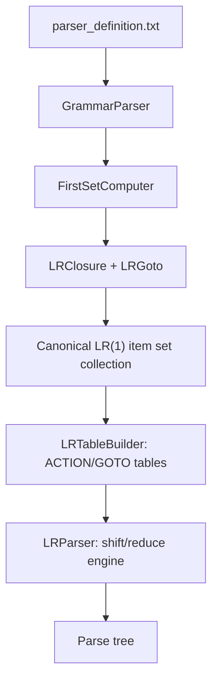
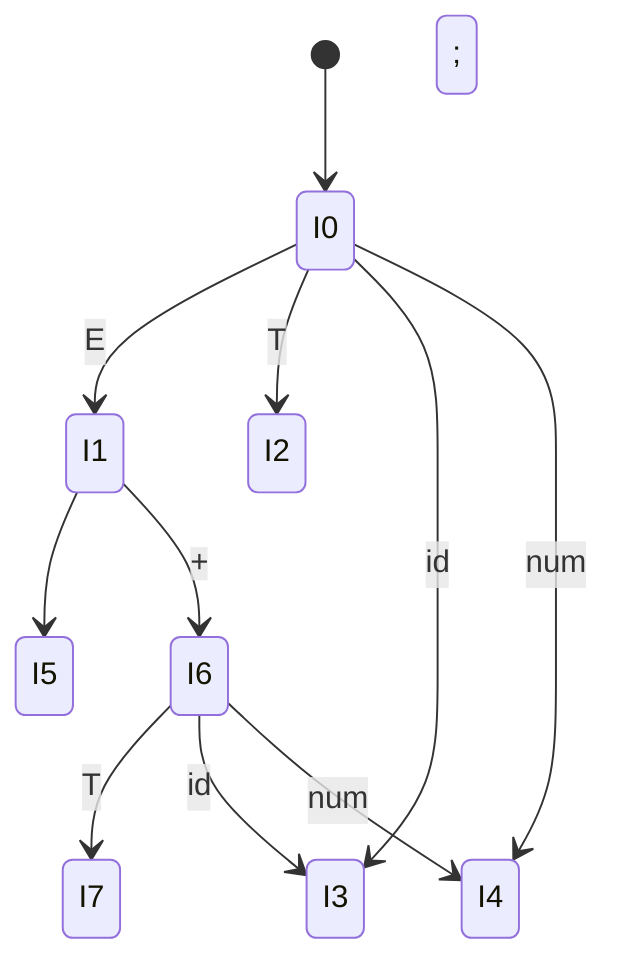
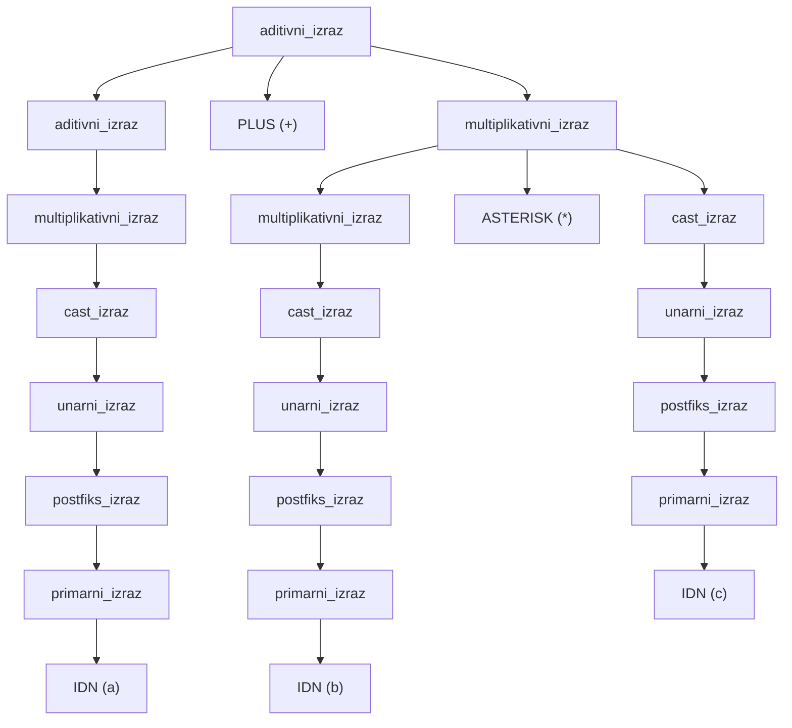
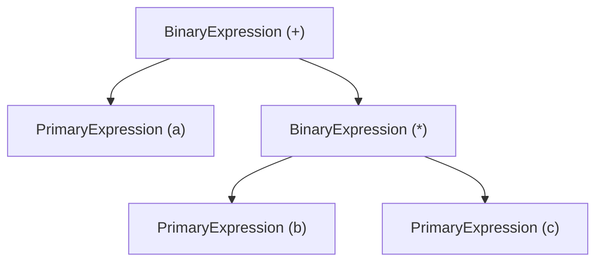
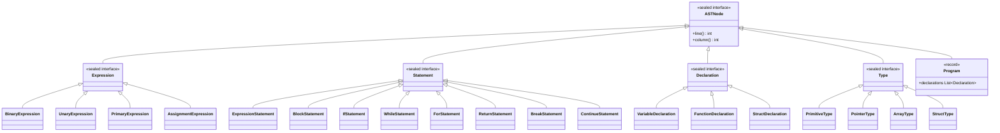
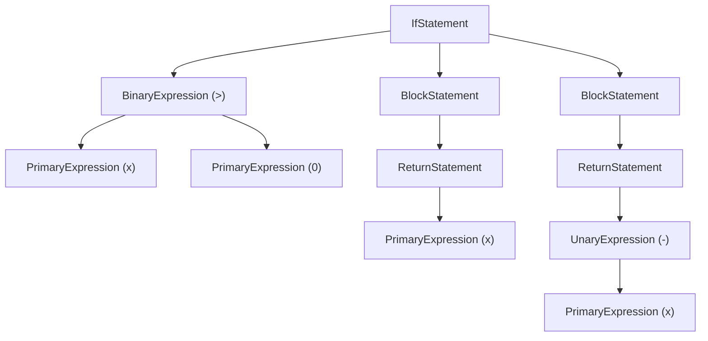

## Parsing Objective

\index{syntax analysis}\index{parsing}
The parser transforms the flat token stream produced by the lexer into a hierarchical structure that encodes the grammatical organization of the source program. Where the lexer answers the question "what are the words?", the parser answers "what are the sentences, and how are the words grouped within them?" It determines whether the token sequence is a valid sentence of the language defined by the grammar and, if so, produces a concrete parse tree that preserves operator precedence, associativity, and nesting structure.

This compiler uses a canonical LR(1) parser, table-driven from a grammar specification in `config/parser_definition.txt`. The grammar defines 47 nonterminals, 46 terminals, and 184 productions. The canonical LR(1) construction produces a large automaton whose tables are cached to disk after the first build. The resulting parser is deterministic, handles the full C-subset grammar without ambiguity (modulo the dangling-else conflict resolved by policy), and provides clear error reporting based on ACTION table entries.

This chapter develops the theoretical foundations of parsing, presents the complete grammar specification for the FRISCcc language, walks through the LR(1) construction algorithm in detail, and explains how the parser implementation maps these concepts to Java code.


## Formal Parsing Theory

\index{context-free grammar}\index{formal language theory}

### Context-Free Grammars

A **context-free grammar** (CFG) is the formal mechanism used to specify the syntax of programming languages. A CFG is a four-tuple $G = (V, T, P, S)$ where:

- $V$ is a finite set of **nonterminal symbols** (also called syntactic variables). In the FRISCcc grammar, these are the angle-bracketed names such as `<izraz>`, `<naredba>`, `<deklaracija>`.
- $T$ is a finite set of **terminal symbols** (the tokens produced by the lexer). In FRISCcc, these include `IDN`, `BROJ`, `KR_INT`, `PLUS`, `TOCKAZAREZ`, and so on. The sets $V$ and $T$ are disjoint: $V \cap T = \emptyset$.
- $P$ is a finite set of **productions** (also called production rules or rewriting rules). Each production has the form $A \to \alpha$ where $A \in V$ is a nonterminal (the left-hand side) and $\alpha \in (V \cup T)^*$ is a string of terminals and nonterminals (the right-hand side). The right-hand side may be the empty string $\varepsilon$.
- $S \in V$ is the **start symbol**, the nonterminal from which all valid programs are derived. In FRISCcc, the start symbol is `<prijevodna_jedinica>` (translation unit).

The FRISCcc grammar has $|V| = 47$, $|T| = 46$, and $|P| = 184$.

### Derivations

\index{derivation}
A **derivation** is a sequence of rewriting steps that transforms the start symbol into a string of terminals. If $A \to \gamma$ is a production and $\alpha A \beta$ is a sentential form (a string of terminals and nonterminals derivable from $S$), then:

$$\alpha A \beta \Rightarrow \alpha \gamma \beta$$

This single rewriting step is called a **derivation step**. A sequence of zero or more derivation steps is denoted $\Rightarrow^*$. A string $w \in T^*$ is a **sentence** of the grammar if $S \Rightarrow^* w$.

Two canonical orderings of derivation steps are particularly important:

- **Leftmost derivation** ($\Rightarrow_{lm}$): At each step, the leftmost nonterminal in the sentential form is replaced. Top-down parsers (such as LL parsers) construct leftmost derivations.
- **Rightmost derivation** ($\Rightarrow_{rm}$): At each step, the rightmost nonterminal is replaced. Bottom-up parsers (such as LR parsers) construct rightmost derivations in reverse -- each reduce action corresponds to one step of the rightmost derivation, traced backwards from the sentence to the start symbol.

For example, consider a simplified grammar fragment:

```
S  ->  E ;
E  ->  E + T | T
T  ->  id | num
```

A rightmost derivation of `id + num ;` proceeds as follows:

$$S \Rightarrow_{rm} E \; ; \Rightarrow_{rm} E + T \; ; \Rightarrow_{rm} E + \text{num} \; ; \Rightarrow_{rm} T + \text{num} \; ; \Rightarrow_{rm} \text{id} + \text{num} \; ;$$

An LR parser discovers this derivation in reverse: it shifts `id`, reduces to $T$, reduces to $E$, shifts `+`, shifts `num`, reduces to $T$, reduces $E + T$ to $E$, shifts `;`, and finally reduces $E \; ;$ to $S$.

### Parse Trees

\index{parse tree}
A **parse tree** (also called a derivation tree or concrete syntax tree) is a graphical representation of a derivation. Each interior node is labeled with a nonterminal, each leaf is labeled with a terminal, and the children of an interior node labeled $A$ correspond to the symbols on the right-hand side of some production $A \to X_1 X_2 \ldots X_k$. The yield of the parse tree (the leaves read left to right) is the derived sentence.

A key property: every leftmost derivation, rightmost derivation, and any other derivation order for the same sentence produces the same parse tree (assuming the grammar is unambiguous). The parse tree abstracts over the order in which rewriting steps are applied.

### Ambiguity

\index{ambiguity}
A grammar is **ambiguous** if there exists a string $w \in T^*$ that has two or more distinct parse trees (equivalently, two or more distinct leftmost derivations). Ambiguity is a property of the grammar, not the language: it is sometimes possible to find an unambiguous grammar for the same language.

The classic example of ambiguity in programming language grammars is the **dangling-else** problem. Given:

```
stmt  ->  if ( expr ) stmt
       |  if ( expr ) stmt else stmt
       |  other
```

The input `if (a) if (b) s1 else s2` has two parse trees: one where `else` associates with the inner `if`, and one where it associates with the outer `if`. The FRISCcc grammar contains exactly this ambiguity, which is resolved by the parser's conflict resolution policy (Section 4.11).

### The Chomsky Hierarchy

\index{Chomsky hierarchy}
Context-free grammars occupy **Type 2** in the Chomsky hierarchy of formal languages:

| Type | Grammar Class | Recognizer | Example |
|------|--------------|------------|---------|
| 0 | Unrestricted | Turing machine | Any recursively enumerable language |
| 1 | Context-sensitive | Linear-bounded automaton | $\{a^n b^n c^n \mid n \geq 1\}$ |
| **2** | **Context-free** | **Pushdown automaton** | **Programming language syntax** |
| 3 | Regular | Finite automaton | Token patterns (lexer) |

The lexer operates at Type 3 (regular languages); the parser operates at Type 2 (context-free languages). This clean separation is why compilers traditionally split lexical analysis from syntactic analysis. Some aspects of programming languages (such as "a variable must be declared before use") are context-sensitive and cannot be captured by a CFG -- these are handled by semantic analysis in a later phase.

### Parsing Strategies: LL vs. LR vs. Earley

\index{LL parsing}\index{LR parsing}\index{Earley parsing}
Three major families of parsing algorithms exist for context-free grammars:

**LL (Left-to-right, Leftmost derivation).** LL parsers are top-down, predictive parsers. They read input left-to-right and construct a leftmost derivation. LL(1) parsers use one token of lookahead to decide which production to apply. They are simple to implement (especially as recursive descent parsers) but cannot handle left-recursive grammars and have difficulty with grammars that require more than one token of lookahead. The 13-level expression precedence hierarchy in FRISCcc uses left recursion extensively, which would require grammar transformation for LL parsing.

**LR (Left-to-right, Rightmost derivation in reverse).** LR parsers are bottom-up, shift-reduce parsers. They read input left-to-right and construct a rightmost derivation in reverse. LR parsers are strictly more powerful than LL parsers: every LL($k$) grammar is also LR($k$), but not vice versa. LR parsers handle left recursion naturally, which makes them ideal for operator precedence encoded through left-recursive productions. The main variants are:

- **SLR(1):** Uses FOLLOW sets for reduce decisions. Simple but too weak for many practical grammars.
- **LALR(1):** Merges LR(1) states with identical cores. Used by Yacc/Bison. Powerful enough for most grammars but can introduce spurious reduce/reduce conflicts.
- **Canonical LR(1):** The full construction with no state merging. Most powerful deterministic method with one token of lookahead.

**Earley.** The Earley algorithm parses any context-free grammar (including ambiguous ones) in $O(n^3)$ time in the worst case, $O(n^2)$ for unambiguous grammars, and $O(n)$ for many practical grammars. It is rarely used in production compilers because the constant factors are higher than LR parsing for deterministic grammars.

### Why LR(1) for FRISCcc

\index{LR(1)}
The FRISCcc compiler uses canonical LR(1) parsing for several reasons:

1. **Left recursion.** The expression precedence hierarchy uses left recursion at every level (e.g., `aditivni_izraz -> aditivni_izraz PLUS multiplikativni_izraz`). LR parsing handles left recursion directly; LL parsing would require converting to right recursion, which changes associativity semantics.

2. **Deterministic power.** Canonical LR(1) is the most powerful deterministic parsing method with a single token of lookahead. It can distinguish contexts that SLR(1) and LALR(1) conflate.

3. **Grammar-driven.** The parser is generated from a declarative grammar specification. Changes to the language syntax require only editing the grammar file, not modifying parser code.

4. **Pedagogical clarity.** The LR(1) construction algorithm has a clean mathematical foundation that connects formal language theory to practical implementation. Each concept -- items, closure, goto, ACTION/GOTO tables -- has both a theoretical definition and a direct Java class in the implementation.

5. **LALR(1) insufficiency.** For this particular grammar, LALR(1) state merging risks introducing reduce/reduce conflicts that do not exist in the canonical construction, because certain declaration and expression contexts differ only in their lookahead sets, not in their item cores.


## Complete Grammar Specification

\index{grammar specification}\index{BNF}
The grammar is specified in the file `config/parser_definition.txt` using a custom declarative format. This section presents the complete set of 184 productions organized by grammatical category, using a readable notation.

### Specification Format

The grammar file uses three header directives followed by production rules:

- **`%V`** declares nonterminal symbols (47 symbols enclosed in angle brackets).
- **`%T`** declares terminal symbols (46 token names matching the lexer's output).
- **`%Syn`** declares synchronization tokens for error recovery (`TOCKAZAREZ`, `D_VIT_ZAGRADA`).

Productions are written with the nonterminal on its own line followed by indented right-hand sides, one per line. Each right-hand side is a sequence of terminal and nonterminal symbols separated by spaces.

### Nonterminal Naming Convention

All nonterminal names use Croatian, reflecting the project's academic origin at FER (Faculty of Electrical Engineering and Computing, University of Zagreb). The following table maps each nonterminal to its English description and grammatical role.

| Croatian Nonterminal | English Description | Role |
|---------------------|---------------------|------|
| `prijevodna_jedinica` | translation unit | Top-level program structure |
| `vanjska_deklaracija` | external declaration | Top-level declaration or function |
| `definicija_funkcije` | function definition | Function with body |
| `deklaracija` | declaration | Variable/type declaration |
| `specifikatori_deklaracije` | declaration specifiers | Type and qualifier list |
| `specifikator_tipa` | type specifier | Base type (`int`, `char`, `void`, `float`, struct) |
| `lista_init_deklaratora` | init declarator list | Comma-separated declarators |
| `init_deklarator` | init declarator | Declarator with optional initializer |
| `deklarator` | declarator | Variable/function name with modifiers |
| `izravni_deklarator` | direct declarator | Name, array, or function declarator |
| `pokazivac` | pointer | Pointer modifier (`*`, `* const`) |
| `inicijalizator` | initializer | Initialization expression or brace list |
| `primarni_izraz` | primary expression | Identifiers, literals, parenthesized expr |
| `postfiks_izraz` | postfix expression | Array subscript, call, member access, `++`/`--` |
| `lista_argumenata` | argument list | Function call arguments |
| `unarni_izraz` | unary expression | Prefix `++`/`--`, unary operators |
| `unarni_operator` | unary operator | `&`, `*`, `+`, `-`, `~`, `!` |
| `cast_izraz` | cast expression | Type cast or unary expression |
| `ime_tipa` | type name | Type in cast expressions |
| `multiplikativni_izraz` | multiplicative expression | `*`, `/`, `%` |
| `aditivni_izraz` | additive expression | `+`, `-` |
| `odnosni_izraz` | relational expression | `<`, `>`, `<=`, `>=` |
| `jednakosni_izraz` | equality expression | `==`, `!=` |
| `bin_i_izraz` | bitwise AND expression | `&` |
| `bin_xili_izraz` | bitwise XOR expression | `^` |
| `bin_ili_izraz` | bitwise OR expression | `\|` |
| `log_i_izraz` | logical AND expression | `&&` |
| `log_ili_izraz` | logical OR expression | `\|\|` |
| `izraz_pridruzivanja` | assignment expression | `=` assignment |
| `izraz` | expression | Comma expression |
| `naredba` | statement | Any statement |
| `slozena_naredba` | compound statement | Block `{ ... }` |
| `izraz_naredba` | expression statement | Expression followed by `;` |
| `naredba_grananja` | branching statement | `if`/`if-else` |
| `naredba_petlje` | loop statement | `while`, `for` |
| `naredba_skoka` | jump statement | `break`, `continue`, `return` |
| `lista_naredbi` | statement list | Sequence of statements |
| `lista_deklaracija` | declaration list | Sequence of declarations |
| `struct_specifikator` | struct specifier | Struct definition or reference |
| `struct_lista_deklaracija` | struct declaration list | Struct member declarations |
| `struct_deklaracija` | struct declaration | Single struct member declaration |
| `lista_specifikatora_kvalifikatora` | specifier-qualifier list | Type/qualifier for struct members |
| `struct_lista_deklaratora` | struct declarator list | Struct member declarators |
| `struct_deklarator` | struct declarator | Single struct member declarator |
| `lista_parametara` | parameter list | Function parameter declarations |
| `deklaracija_parametra` | parameter declaration | Single function parameter |
| `lista_izraza_pridruzivanja` | assignment expression list | Initializer list elements |

### Program Structure Productions

The top-level structure of a FRISCcc program is a **translation unit**, which is a sequence of external declarations. Each external declaration is either a function definition or a declaration.

```bnf
prijevodna_jedinica  ::=  vanjska_deklaracija
                       |  prijevodna_jedinica  vanjska_deklaracija

vanjska_deklaracija  ::=  definicija_funkcije
                       |  deklaracija

definicija_funkcije  ::=  specifikatori_deklaracije  deklarator  lista_deklaracija  slozena_naredba
                       |  specifikatori_deklaracije  deklarator  slozena_naredba
                       |  deklarator  lista_deklaracija  slozena_naredba
                       |  deklarator  slozena_naredba
```

The `prijevodna_jedinica` nonterminal uses left recursion to build a list of external declarations. The four forms of `definicija_funkcije` cover the cases with and without explicit type specifiers, and with and without an old-style parameter declaration list.

### Declaration Productions

\index{declaration}
Declarations introduce variables, types, and function prototypes.

```bnf
deklaracija  ::=  specifikatori_deklaracije  TOCKAZAREZ
              |  specifikatori_deklaracije  lista_init_deklaratora  TOCKAZAREZ

specifikatori_deklaracije  ::=  specifikator_tipa
                             |  specifikator_tipa  specifikatori_deklaracije
                             |  KR_CONST
                             |  KR_CONST  specifikatori_deklaracije

specifikator_tipa  ::=  KR_VOID  |  KR_CHAR  |  KR_INT  |  KR_FLOAT
                     |  struct_specifikator

lista_init_deklaratora  ::=  init_deklarator
                          |  lista_init_deklaratora  ZAREZ  init_deklarator

init_deklarator  ::=  deklarator
                   |  deklarator  OP_PRIDRUZI  inicijalizator
```

The `specifikatori_deklaracije` nonterminal is right-recursive, allowing a sequence of type specifiers and `const` qualifiers such as `const int` or `int const`. The `lista_init_deklaratora` is left-recursive, supporting comma-separated declarations like `int a = 1, b = 2, c;`.

### Declarator Productions

Declarators define the shape of a declared name -- whether it is a simple variable, a pointer, an array, or a function.

```bnf
deklarator  ::=  pokazivac  izravni_deklarator
             |  izravni_deklarator

izravni_deklarator  ::=  IDN
                      |  izravni_deklarator  L_UGL_ZAGRADA  log_ili_izraz  D_UGL_ZAGRADA
                      |  izravni_deklarator  L_UGL_ZAGRADA  D_UGL_ZAGRADA
                      |  izravni_deklarator  L_ZAGRADA  lista_parametara  D_ZAGRADA

pokazivac  ::=  ASTERISK
            |  ASTERISK  KR_CONST
```

The `izravni_deklarator` uses left recursion to allow multi-dimensional arrays (`a[10][20]`) and functions returning arrays (though semantically restricted). The pointer modifier supports both `*` and `* const` (pointer to constant).

### Parameter and Initializer Productions

```bnf
lista_parametara  ::=  deklaracija_parametra
                    |  lista_parametara  ZAREZ  deklaracija_parametra

deklaracija_parametra  ::=  specifikatori_deklaracije  deklarator
                         |  specifikatori_deklaracije

ime_tipa  ::=  lista_specifikatora_kvalifikatora
            |  lista_specifikatora_kvalifikatora  pokazivac

inicijalizator  ::=  izraz_pridruzivanja
                  |  L_VIT_ZAGRADA  lista_izraza_pridruzivanja  D_VIT_ZAGRADA
                  |  L_VIT_ZAGRADA  lista_izraza_pridruzivanja  ZAREZ  D_VIT_ZAGRADA

lista_izraza_pridruzivanja  ::=  izraz_pridruzivanja
                              |  lista_izraza_pridruzivanja  ZAREZ  izraz_pridruzivanja
```

The initializer supports both single-expression initialization (`int x = 5`) and brace-enclosed initializer lists (`int arr[] = {1, 2, 3}`), with an optional trailing comma in the list form.

### Struct Productions

\index{struct}
Struct support adds six nonterminals and their associated productions.

```bnf
struct_specifikator  ::=  KR_STRUCT  IDN  L_VIT_ZAGRADA  struct_lista_deklaracija  D_VIT_ZAGRADA
                       |  KR_STRUCT  L_VIT_ZAGRADA  struct_lista_deklaracija  D_VIT_ZAGRADA
                       |  KR_STRUCT  IDN

struct_lista_deklaracija  ::=  struct_deklaracija
                            |  struct_lista_deklaracija  struct_deklaracija

struct_deklaracija  ::=  lista_specifikatora_kvalifikatora  struct_lista_deklaratora  TOCKAZAREZ

lista_specifikatora_kvalifikatora  ::=  specifikator_tipa  lista_specifikatora_kvalifikatora
                                     |  specifikator_tipa
                                     |  KR_CONST  lista_specifikatora_kvalifikatora
                                     |  KR_CONST

struct_lista_deklaratora  ::=  struct_deklarator
                            |  struct_lista_deklaratora  ZAREZ  struct_deklarator

struct_deklarator  ::=  deklarator
```

The three forms of `struct_specifikator` cover: (1) a named struct definition with members, (2) an anonymous struct definition, and (3) a reference to a previously defined struct type by name. The `struct_deklarator` reduces directly to `deklarator`, sharing the declaration machinery so that struct members can be pointers and arrays.

### Statement Productions

\index{statement}
Statements define control flow and structure within function bodies.

```bnf
naredba  ::=  slozena_naredba
           |  izraz_naredba
           |  naredba_grananja
           |  naredba_petlje
           |  naredba_skoka

slozena_naredba  ::=  L_VIT_ZAGRADA  D_VIT_ZAGRADA
                   |  L_VIT_ZAGRADA  lista_naredbi  D_VIT_ZAGRADA
                   |  L_VIT_ZAGRADA  lista_deklaracija  D_VIT_ZAGRADA
                   |  L_VIT_ZAGRADA  lista_deklaracija  lista_naredbi  D_VIT_ZAGRADA

lista_deklaracija  ::=  deklaracija
                     |  lista_deklaracija  deklaracija

lista_naredbi  ::=  naredba
                 |  lista_naredbi  naredba

izraz_naredba  ::=  TOCKAZAREZ
                 |  izraz  TOCKAZAREZ

naredba_grananja  ::=  KR_IF  L_ZAGRADA  izraz  D_ZAGRADA  naredba
                    |  KR_IF  L_ZAGRADA  izraz  D_ZAGRADA  naredba  KR_ELSE  naredba

naredba_petlje  ::=  KR_WHILE  L_ZAGRADA  izraz  D_ZAGRADA  naredba
                  |  KR_FOR  L_ZAGRADA  izraz_naredba  izraz_naredba  D_ZAGRADA  naredba
                  |  KR_FOR  L_ZAGRADA  izraz_naredba  izraz_naredba  izraz  D_ZAGRADA  naredba

naredba_skoka  ::=  KR_CONTINUE  TOCKAZAREZ
                 |  KR_BREAK  TOCKAZAREZ
                 |  KR_RETURN  TOCKAZAREZ
                 |  KR_RETURN  izraz  TOCKAZAREZ
```

The `slozena_naredba` (compound statement) follows the C89 rule: declarations must precede statements within a block. This structural separation eliminates the need to disambiguate declarations from expression statements mid-block. The `naredba_grananja` has two productions for `if` -- one with `else` and one without -- creating the classic dangling-else ambiguity resolved by shift preference.

### Expression Productions

\index{expression}\index{operator precedence}
The expression grammar encodes operator precedence through a chain of nonterminals, where each level delegates to the next higher-precedence level as its base case. This is the standard technique for encoding precedence in LR grammars.

```bnf
primarni_izraz  ::=  IDN  |  BROJ  |  ZNAK  |  NIZ_ZNAKOVA
                  |  L_ZAGRADA  izraz  D_ZAGRADA

postfiks_izraz  ::=  primarni_izraz
                  |  postfiks_izraz  L_UGL_ZAGRADA  izraz  D_UGL_ZAGRADA
                  |  postfiks_izraz  L_ZAGRADA  D_ZAGRADA
                  |  postfiks_izraz  L_ZAGRADA  lista_argumenata  D_ZAGRADA
                  |  postfiks_izraz  TOCKA  IDN
                  |  postfiks_izraz  OP_INC
                  |  postfiks_izraz  OP_DEC

lista_argumenata  ::=  izraz_pridruzivanja
                    |  lista_argumenata  ZAREZ  izraz_pridruzivanja

unarni_izraz  ::=  postfiks_izraz
               |  OP_INC  unarni_izraz
               |  OP_DEC  unarni_izraz
               |  unarni_operator  cast_izraz

unarni_operator  ::=  AMPERSAND  |  ASTERISK  |  PLUS  |  MINUS  |  OP_TILDA  |  OP_NEG

cast_izraz  ::=  unarni_izraz
             |  L_ZAGRADA  ime_tipa  D_ZAGRADA  cast_izraz

multiplikativni_izraz  ::=  cast_izraz
                         |  multiplikativni_izraz  ASTERISK  cast_izraz
                         |  multiplikativni_izraz  OP_DIJELI  cast_izraz
                         |  multiplikativni_izraz  OP_MOD  cast_izraz

aditivni_izraz  ::=  multiplikativni_izraz
                  |  aditivni_izraz  PLUS  multiplikativni_izraz
                  |  aditivni_izraz  MINUS  multiplikativni_izraz

odnosni_izraz  ::=  aditivni_izraz
                 |  odnosni_izraz  OP_LT  aditivni_izraz
                 |  odnosni_izraz  OP_GT  aditivni_izraz
                 |  odnosni_izraz  OP_LTE  aditivni_izraz
                 |  odnosni_izraz  OP_GTE  aditivni_izraz

jednakosni_izraz  ::=  odnosni_izraz
                    |  jednakosni_izraz  OP_EQ  odnosni_izraz
                    |  jednakosni_izraz  OP_NEQ  odnosni_izraz

bin_i_izraz  ::=  jednakosni_izraz
              |  bin_i_izraz  AMPERSAND  jednakosni_izraz

bin_xili_izraz  ::=  bin_i_izraz
                  |  bin_xili_izraz  OP_BIN_XILI  bin_i_izraz

bin_ili_izraz  ::=  bin_xili_izraz
                 |  bin_ili_izraz  OP_BIN_ILI  bin_xili_izraz

log_i_izraz  ::=  bin_ili_izraz
              |  log_i_izraz  OP_I  bin_ili_izraz

log_ili_izraz  ::=  log_i_izraz
                 |  log_ili_izraz  OP_ILI  log_i_izraz

izraz_pridruzivanja  ::=  log_oli_izraz
                       |  unarni_izraz  OP_PRIDRUZI  izraz_pridruzivanja

izraz  ::=  izraz_pridruzivanja
         |  izraz  ZAREZ  izraz_pridruzivanja
```

### Expression Precedence Hierarchy

The expression grammar defines 13 explicit precedence levels plus postfix and primary expressions:

| Level | Nonterminal | Operators | Associativity | Recursion |
|-------|-------------|-----------|---------------|-----------|
| 1 (lowest) | `izraz` | `,` | Left | Left-recursive |
| 2 | `izraz_pridruzivanja` | `=` | Right | Right-recursive |
| 3 | `log_ili_izraz` | `\|\|` | Left | Left-recursive |
| 4 | `log_i_izraz` | `&&` | Left | Left-recursive |
| 5 | `bin_ili_izraz` | `\|` | Left | Left-recursive |
| 6 | `bin_xili_izraz` | `^` | Left | Left-recursive |
| 7 | `bin_i_izraz` | `&` | Left | Left-recursive |
| 8 | `jednakosni_izraz` | `==`, `!=` | Left | Left-recursive |
| 9 | `odnosni_izraz` | `<`, `>`, `<=`, `>=` | Left | Left-recursive |
| 10 | `aditivni_izraz` | `+`, `-` | Left | Left-recursive |
| 11 | `multiplikativni_izraz` | `*`, `/`, `%` | Left | Left-recursive |
| 12 | `cast_izraz` | `(type)` | Right (prefix) | Right-recursive |
| 13 (highest) | `unarni_izraz` | `++`, `--`, `&`, `*`, `+`, `-`, `~`, `!` | Right (prefix) | Right-recursive |
| -- | `postfiks_izraz` | `[]`, `()`, `.`, `++`, `--` | Left (postfix) | Left-recursive |
| -- | `primarni_izraz` | Atoms | -- | Terminal |

Left associativity is encoded by left recursion: `aditivni_izraz -> aditivni_izraz PLUS multiplikativni_izraz` recurses on the left, meaning the parser will group `a + b + c` as `(a + b) + c`. Right associativity for assignment is encoded by right recursion: `izraz_pridruzivanja -> unarni_izraz OP_PRIDRUZI izraz_pridruzivanja` recurses on the right, grouping `a = b = c` as `a = (b = c)`.


## LR(1) Parsing Algorithm

\index{LR(1) parsing}\index{shift-reduce}
This section develops the LR(1) parsing algorithm from its theoretical foundations, then walks through concrete examples using the FRISCcc grammar.

### LR(1) Items

\index{LR(1) item}
An **LR(1) item** is the fundamental unit of information in the LR(1) parsing algorithm. It has the form:

$$[A \to \alpha \cdot \beta, \; L]$$

where:
- $A \to \alpha\beta$ is a grammar production.
- The **dot** ($\cdot$) marks the current parsing position within the production. The portion $\alpha$ to the left of the dot has already been recognized (its symbols are on the parser's stack). The portion $\beta$ to the right is what remains to be seen in the input.
- $L$ is a set of **lookahead terminals**. The lookahead indicates which terminals may legally follow a reduction by this production. When the dot reaches the end ($\beta = \varepsilon$), the parser reduces only if the current input token is in $L$.

An item is a **reduce item** when $\beta = \varepsilon$ (the dot is at the rightmost position), meaning the entire right-hand side has been recognized and the parser may perform a reduction. An item is a **shift item** when $\beta$ begins with a terminal, indicating the parser should shift that terminal.

In the FRISCcc implementation, the `LRItem` class represents this with three fields:

```java
public final class LRItem {
    private final Production production;   // A -> alpha beta
    private final int dotPosition;          // index of the dot within RHS
    private final Set<String> lookahead;    // L
}
```

The use of lookahead *sets* (rather than individual lookahead symbols) is an optimization: items $[A \to \alpha \cdot \beta, \{a\}]$ and $[A \to \alpha \cdot \beta, \{b\}]$ are merged into $[A \to \alpha \cdot \beta, \{a, b\}]$. This reduces the number of items per set without affecting parsing power.

### The Closure Operation

\index{closure operation}
The **closure** of an item set $I$ expands it to include all items that are implicitly present. Formally:

**Definition.** $\text{CLOSURE}(I)$ is the smallest set of items satisfying:
1. Every item in $I$ is in $\text{CLOSURE}(I)$.
2. If $[A \to \alpha \cdot B \beta, L]$ is in $\text{CLOSURE}(I)$, $B$ is a nonterminal, and $B \to \gamma$ is a production, then $[B \to \cdot \gamma, T]$ is in $\text{CLOSURE}(I)$, where:
   - $T = \text{FIRST}(\beta)$ if $\beta$ cannot derive $\varepsilon$.
   - $T = \text{FIRST}(\beta) \cup L$ if $\beta$ can derive $\varepsilon$.
   - If $\beta = \varepsilon$, then $T = L$.

The intuition: if the parser is in a state where it expects to see a nonterminal $B$ next, it must also be ready to see the first terminal of any production for $B$. The lookahead $T$ is computed from what follows $B$ in the current context ($\beta$) and, if $\beta$ can vanish, from the original lookahead $L$.

The FRISCcc implementation in `LRClosure.java` uses a fixed-point algorithm:

```pseudocode
function CLOSURE(I):
    result := copy of I
    repeat
        changed := false
        for each item [A -> alpha . B beta, L] in result:
            if B is a nonterminal:
                T := FIRST(beta)
                if beta can derive epsilon:
                    T := T union L
                for each production B -> gamma:
                    if [B -> . gamma, T] not in result:
                        add [B -> . gamma, T] to result
                        changed := true
                    else if existing item has smaller lookahead:
                        merge lookahead sets
                        changed := true
    until not changed
    return result
```

**Example.** Consider computing the closure of the initial item for parsing. The augmented grammar adds $S' \to \text{prijevodna\_jedinica}$, so we start with:

$$I_0 = \text{CLOSURE}(\{[S' \to \cdot \; \text{prijevodna\_jedinica}, \; \{\#\}]\})$$

Since `prijevodna_jedinica` is a nonterminal, we add items for its productions:

$$[S' \to \cdot \; \text{prijevodna\_jedinica}, \; \{\#\}]$$
$$[\text{prijevodna\_jedinica} \to \cdot \; \text{vanjska\_deklaracija}, \; \{\#, \text{KR\_INT}, \text{KR\_CHAR}, \ldots\}]$$
$$[\text{prijevodna\_jedinica} \to \cdot \; \text{prijevodna\_jedinica} \; \text{vanjska\_deklaracija}, \; \{\#, \text{KR\_INT}, \ldots\}]$$

Then `vanjska_deklaracija` expands to `definicija_funkcije` and `deklaracija`, each of which expands further. The closure process continues until a fixed point is reached, potentially producing dozens of items in $I_0$ alone.

### The GOTO Operation

\index{GOTO operation}
The **GOTO** operation computes the transition from one item set to another upon reading a grammar symbol.

**Definition.** For an item set $I$ and a grammar symbol $X$ (terminal or nonterminal):

$$\text{GOTO}(I, X) = \text{CLOSURE}(\{[A \to \alpha X \cdot \beta, L] \mid [A \to \alpha \cdot X \beta, L] \in I\})$$

That is: collect all items in $I$ where the dot precedes $X$, advance the dot past $X$, and compute the closure of the resulting set.

The FRISCcc implementation in `LRGoto.java` is straightforward:

```java
public LRItemSet gotoSet(LRItemSet itemSet, String symbol) {
    LRItemSet result = new LRItemSet();
    for (LRItem item : itemSet.getItems()) {
        if (!item.isReduceItem() && symbol.equals(item.getNextSymbol())) {
            result.addItem(item.advance());
        }
    }
    if (result.getItems().isEmpty()) return null;
    return closure.closure(result);
}
```

### FIRST Set Computation

\index{FIRST set}
The closure operation relies on FIRST sets. The `FirstSetComputer` computes FIRST sets using a recursive algorithm with memoization.

For a terminal symbol $a$, $\text{FIRST}(a) = \{a\}$. For a nonterminal $A$, $\text{FIRST}(A)$ is the union of $\text{FIRST}(\alpha)$ for each production $A \to \alpha$. For a sequence $X_1 X_2 \ldots X_k$, FIRST includes all terminals from $\text{FIRST}(X_1)$; if $X_1$ can derive epsilon, it also includes terminals from $\text{FIRST}(X_2)$, and so on.

**Example FIRST sets for key nonterminals:**

$\text{FIRST}(\texttt{primarni\_izraz}) = \{ \text{IDN}, \text{BROJ}, \text{ZNAK}, \text{NIZ\_ZNAKOVA}, \text{L\_ZAGRADA} \}$

$\text{FIRST}(\texttt{specifikator\_tipa}) = \{ \text{KR\_VOID}, \text{KR\_CHAR}, \text{KR\_INT}, \text{KR\_FLOAT}, \text{KR\_STRUCT} \}$

$\text{FIRST}(\texttt{unarni\_operator}) = \{ \text{AMPERSAND}, \text{ASTERISK}, \text{PLUS}, \text{MINUS}, \text{OP\_TILDA}, \text{OP\_NEG} \}$

$\text{FIRST}(\texttt{naredba}) = \{ \text{L\_VIT\_ZAGRADA}, \text{TOCKAZAREZ}, \text{KR\_IF}, \text{KR\_WHILE}, \text{KR\_FOR}, \text{KR\_CONTINUE}, \text{KR\_BREAK}, \text{KR\_RETURN} \} \cup \text{FIRST}(\texttt{izraz})$

FIRST sets are computed once and cached for the duration of the LR construction, since they are queried thousands of times during closure computation.

### Step-by-Step Parse: `int x = 5;`

\index{parsing trace}
To make the algorithm concrete, let us trace the complete LR(1) parse of the simple variable declaration `int x = 5;`. The lexer produces the following token stream:

```
KR_INT("int")  IDN("x")  OP_PRIDRUZI("=")  BROJ("5")  TOCKAZAREZ(";")  #
```

We use abstract state names ($s_0, s_1, \ldots$) since the actual state numbers depend on the full automaton. The symbol stack is shown alongside the state stack for clarity.

| Step | State Stack | Symbol Stack | Input | Action |
|------|-------------|-------------|-------|--------|
| 1 | $[s_0]$ | | `KR_INT IDN = 5 ; #` | SHIFT $s_1$ |
| 2 | $[s_0, s_1]$ | `KR_INT` | `IDN = 5 ; #` | REDUCE `specifikator_tipa -> KR_INT` |
| 3 | $[s_0, s_2]$ | `specifikator_tipa` | `IDN = 5 ; #` | REDUCE `specifikatori_deklaracije -> specifikator_tipa` |
| 4 | $[s_0, s_3]$ | `specifikatori_dekl` | `IDN = 5 ; #` | SHIFT $s_4$ |
| 5 | $[s_0, s_3, s_4]$ | `specifikatori_dekl IDN` | `= 5 ; #` | REDUCE `izravni_deklarator -> IDN` |
| 6 | $[s_0, s_3, s_5]$ | `specifikatori_dekl izravni_dekl` | `= 5 ; #` | REDUCE `deklarator -> izravni_deklarator` |
| 7 | $[s_0, s_3, s_6]$ | `specifikatori_dekl deklarator` | `= 5 ; #` | SHIFT $s_7$ (shift `=`) |
| 8 | $[s_0, s_3, s_6, s_7]$ | `... deklarator =` | `5 ; #` | SHIFT $s_8$ |
| 9 | $[s_0, s_3, s_6, s_7, s_8]$ | `... = BROJ` | `; #` | REDUCE `primarni_izraz -> BROJ` |
| 10 | $[\ldots, s_9]$ | `... = primarni_izraz` | `; #` | REDUCE chain: postfiks -> unarni -> cast -> mult -> add -> rel -> eq -> bin_i -> bin_xili -> bin_ili -> log_i -> log_ili -> izraz_pridruzivanja |
| 11 | $[\ldots, s_{10}]$ | `... = izraz_pridruzivanja` | `; #` | REDUCE `inicijalizator -> izraz_pridruzivanja` |
| 12 | $[s_0, s_3, s_{11}]$ | `specifikatori_dekl init_dekl` | `; #` | REDUCE `init_deklarator -> deklarator = inicijalizator` |
| 13 | $[s_0, s_3, s_{12}]$ | `specifikatori_dekl lista_init_dekl` | `; #` | REDUCE `lista_init_deklaratora -> init_deklarator` |
| 14 | $[s_0, s_3, s_{12}]$ | `specifikatori_dekl lista_init_dekl` | `; #` | SHIFT $s_{13}$ |
| 15 | $[\ldots, s_{13}]$ | `... lista_init_dekl ;` | `#` | REDUCE `deklaracija -> specifikatori_dekl lista_init_dekl TOCKAZAREZ` |
| 16 | $[s_0, s_{14}]$ | `vanjska_deklaracija` | `#` | REDUCE `prijevodna_jedinica -> vanjska_deklaracija` (via vanjska_dekl -> deklaracija) |
| 17 | $[s_0, s_{15}]$ | `prijevodna_jedinica` | `#` | ACCEPT |

Step 10 is the **reduction chain**: the literal `5` must propagate through all 13 precedence levels. The value `BROJ("5")` reduces through `primarni_izraz -> postfiks_izraz -> unarni_izraz -> cast_izraz -> multiplikativni_izraz -> aditivni_izraz -> odnosni_izraz -> jednakosni_izraz -> bin_i_izraz -> bin_xili_izraz -> bin_ili_izraz -> log_i_izraz -> log_ili_izraz -> izraz_pridruzivanja`. Each of these reductions pops one state and pushes one state, with no input consumed. This is a characteristic cost of encoding precedence through grammar stratification: a simple literal requires 13 reductions to reach the expression level where it can participate in further parsing.

### The Shift-Reduce Engine

The runtime parser (`LRParser`) is a table-driven shift-reduce engine operating on two conceptually synchronized stacks: a state stack and a parse-node stack.

```pseudocode
function PARSE(tokens):
    stateStack := [0]              // start state
    nodeStack  := []               // parse tree nodes
    lookahead  := next_token()

    loop:
        s := top(stateStack)
        action := ACTION[s, lookahead.type]

        if action == SHIFT j:
            push j onto stateStack
            push leaf_node(lookahead) onto nodeStack
            lookahead := next_token()

        else if action == REDUCE (A -> beta):
            pop |beta| entries from stateStack
            children := pop |beta| entries from nodeStack
            node := interior_node(A, children)
            s' := top(stateStack)
            push GOTO[s', A] onto stateStack
            push node onto nodeStack

        else if action == ACCEPT:
            return top(nodeStack)    // root of parse tree

        else:
            report_error(s, lookahead)
            attempt_recovery()
```

The implementation in `LRParser.java` follows this algorithm exactly. On SHIFT, a leaf `ParseTree` node is created for the shifted token (recording its type, line number, and lexeme text). On REDUCE, the children nodes are popped from the tree stack, wrapped in an interior `ParseTree` node labeled with the production's left-hand side nonterminal, and pushed back. The GOTO transition determines the new state after the reduction.


## LR(1) Table Construction

\index{LR(1) table construction}\index{canonical collection}

### Construction Pipeline

The table construction proceeds through a well-defined pipeline:



### Grammar Augmentation

Before construction begins, the grammar is augmented with a new start symbol $S'$ and a production $S' \to \text{prijevodna\_jedinica}$. This ensures a unique accept configuration: the parser accepts when it reduces this augmented production with the end-marker `#` as lookahead.

### Canonical Collection Construction

\index{canonical collection}
The algorithm builds the complete collection of LR(1) item sets (states) using breadth-first search:

```pseudocode
function BUILD_CANONICAL_COLLECTION(grammar):
    I_0 := CLOSURE({ [S' -> . prijevodna_jedinica, {#}] })
    C := { I_0 }
    worklist := [I_0]
    stateMap := { I_0 -> 0 }

    while worklist is not empty:
        I := worklist.remove_first()
        for each grammar symbol X in (terminals union nonterminals):
            J := GOTO(I, X)
            if J is not empty:
                if J not in C:
                    C := C union {J}
                    stateMap[J] := |C| - 1
                    worklist.add(J)
                record transition: stateMap[I] --X--> stateMap[J]

    return C, transitions
```

States are identified by their item sets. The `LRTableBuilder` uses a `HashMap<LRItemSet, Integer>` for $O(1)$ lookup of existing states, which is essential given the large number of states and the need to check for duplicates on every GOTO computation.

### Small Example: Item Sets for a Simplified Grammar

To illustrate the construction concretely, consider a minimal subset of the FRISCcc grammar with just enough structure to show the key phenomena:

```
(0) S'  ->  E ;
(1) E   ->  E + T
(2) E   ->  T
(3) T   ->  id
(4) T   ->  num
```

**State $I_0$** (initial state):

```
[S' -> . E ;,       {#}]
[E  -> . E + T,     {;, +}]
[E  -> . T,         {;, +}]
[T  -> . id,        {;, +}]
[T  -> . num,       {;, +}]
```

**State $I_1$** = GOTO($I_0$, $E$):

```
[S' -> E . ;,       {#}]
[E  -> E . + T,     {;, +}]
```

**State $I_2$** = GOTO($I_0$, $T$):

```
[E  -> T .,         {;, +}]
```

**State $I_3$** = GOTO($I_0$, `id`):

```
[T  -> id .,        {;, +}]
```

**State $I_4$** = GOTO($I_0$, `num`):

```
[T  -> num .,       {;, +}]
```

**State $I_5$** = GOTO($I_1$, `;`):

```
[S' -> E ; .,       {#}]
```

**State $I_6$** = GOTO($I_1$, `+`):

```
[E  -> E + . T,     {;, +}]
[T  -> . id,        {;, +}]
[T  -> . num,       {;, +}]
```

**State $I_7$** = GOTO($I_6$, $T$):

```
[E  -> E + T .,     {;, +}]
```

**State $I_8$** = GOTO($I_6$, `id`):

```
[T  -> id .,        {;, +}]
```

**State $I_9$** = GOTO($I_6$, `num`):

```
[T  -> num .,       {;, +}]
```

Note that $I_8$ and $I_3$ have identical items (and so do $I_9$ and $I_4$). In canonical LR(1), item sets are compared *including* their lookahead sets, so identical items with identical lookaheads are recognized as the same state. In this example, the lookaheads happen to match, so $I_8 = I_3$ and $I_9 = I_4$, yielding 8 distinct states.

The resulting ACTION and GOTO tables:

| State | `id` | `num` | `+` | `;` | `#` | $E$ | $T$ |
|-------|-------|-------|-----|-----|-----|-----|-----|
| 0 | s3 | s4 | | | | 1 | 2 |
| 1 | | | s6 | s5 | | | |
| 2 | | | r2 | r2 | | | |
| 3 | | | r3 | r3 | | | |
| 4 | | | r4 | r4 | | | |
| 5 | | | | | acc | | |
| 6 | s3 | s4 | | | | | 7 |
| 7 | | | r1 | r1 | | | |



### ACTION Table Construction

For each state $s$ and each item in the item set for $s$:

- **Shift:** If $[A \to \alpha \cdot a \beta, L]$ is in $I_s$ and $\text{GOTO}(I_s, a) = I_j$, set $\text{ACTION}[s, a] = \text{shift } j$.
- **Reduce:** If $[A \to \alpha \cdot, L]$ is in $I_s$ and $A$ is not $S'$, set $\text{ACTION}[s, a] = \text{reduce } A \to \alpha$ for each $a \in L$.
- **Accept:** If $[S' \to \text{prijevodna\_jedinica} \cdot, \{\#\}]$ is in $I_s$, set $\text{ACTION}[s, \#] = \text{accept}$.

### GOTO Table Construction

For each state $s$ and each nonterminal $A$: if $\text{GOTO}(I_s, A) = I_j$, set $\text{GOTO}[s, A] = j$.

### Why the FRISCcc Automaton Is Large

The FRISCcc grammar generates a large number of LR(1) states. The state count is driven by three factors:

**Expression precedence chain.** The 13-level expression hierarchy means that many nonterminals are reachable from any expression context. Each level creates distinct item sets because the lookahead sets differ depending on whether the expression appears in a statement, a function argument, an array subscript, a `for` loop header, or an initializer. For instance, an expression in a function call argument has `ZAREZ` (comma) and `D_ZAGRADA` (right parenthesis) in its lookahead set, while an expression in a `for` header has `TOCKAZAREZ` (semicolon) and `D_ZAGRADA`. These different lookahead contexts prevent the states from being merged.

**Declaration-expression overlap.** Several tokens (notably `ASTERISK` and `L_ZAGRADA`) appear in both declaration and expression contexts. The parser must track which interpretation is active, creating additional states to distinguish `int *x` (pointer declaration) from `a * b` (multiplication).

**Struct grammar.** The struct-related nonterminals (`struct_specifikator`, `struct_lista_deklaracija`, `struct_deklaracija`, etc.) add their own subgraph of states that partially overlaps with the declaration machinery but requires distinct lookahead tracking for the member declaration context.

The `LRTableBuilder` sets a safety limit of 50,000 states:

```java
final int MAX_STATES = 50000; // Safety limit
```

This provides headroom for grammar changes while preventing runaway construction from consuming all available memory.

### Canonical LR(1) vs. LALR(1) Tradeoffs

\index{LALR(1)}
The two most practically important LR variants are canonical LR(1) and LALR(1). The key distinction is state merging:

**LALR(1)** identifies states with identical **cores** -- that is, states whose items differ only in their lookahead sets. For example, if state $I_a$ contains $[A \to \alpha \cdot, \{a, b\}]$ and state $I_b$ contains $[A \to \alpha \cdot, \{c, d\}]$, LALR(1) merges them into a single state with $[A \to \alpha \cdot, \{a, b, c, d\}]$. This reduces the number of states (often by a factor of 5-10x), at the cost of potentially introducing **spurious reduce/reduce conflicts**: two reduce items that were in separate states (and thus never conflicted) may end up in the same merged state with overlapping lookaheads.

**Canonical LR(1)** keeps states separate if their lookaheads differ, even if their cores are identical. This never introduces spurious conflicts but produces more states.

The tradeoff for FRISCcc:

| Property | Canonical LR(1) | LALR(1) |
|----------|----------------|---------|
| States | Large | Smaller (5-10x fewer) |
| Conflicts | None spurious | May introduce reduce/reduce |
| Parse power | Maximum for deterministic parsing | Slightly less |
| Table memory | Higher | Lower |
| Construction time | Higher | Lower |

For the FRISCcc grammar, canonical LR(1) was chosen because certain declaration and expression contexts produce states with identical cores but different lookaheads. Merging these states would introduce reduce/reduce conflicts between declaration and expression reductions. Since the tables are computed once and cached to disk, the higher construction cost is paid only on the first compilation after a grammar change.

### Table Caching

The `LRTableCache` class serializes computed ACTION/GOTO tables to disk and loads them on subsequent runs. Since the grammar is static for a given compiler version, table construction (which is the most expensive phase of parser initialization) is performed once and reused. The cache is keyed by a hash of the grammar file, so any grammar modification invalidates the cache and triggers a fresh construction.


## Parse Tree vs. Abstract Syntax Tree

\index{parse tree}\index{abstract syntax tree}\index{AST}
The parser produces two distinct tree representations at different stages: the **parse tree** (concrete syntax tree) produced directly by the shift-reduce engine, and the **abstract syntax tree** (AST) produced by a subsequent transformation. Understanding the distinction is essential.

### The Parse Tree (Concrete Syntax Tree)

The parse tree is a direct, faithful representation of the grammar derivation. Every grammar production corresponds to an interior node, and every shifted token corresponds to a leaf node. The parse tree preserves *all* syntactic detail, including parentheses, semicolons, braces, and keyword tokens.

For the expression `a + b * c`, the parser produces this concrete parse tree (showing only expression nonterminals, abbreviated for readability):



Note the deep nesting: even a simple identifier like `a` passes through `primarni_izraz -> postfiks_izraz -> unarni_izraz -> cast_izraz -> multiplikativni_izraz` before reaching the additive level. Each of these intermediate nonterminals corresponds to a unit production (a production with exactly one symbol on the right-hand side). The tree has 21 nodes for a 5-token expression.

### The Abstract Syntax Tree

The AST strips away all syntactic sugar and intermediate nonterminals, retaining only the essential structure:



The AST has 5 nodes for the same expression. The operator precedence is captured by the tree structure itself: `*` is deeper (evaluated first), and `+` is the root (evaluated last). Parentheses, semicolons, and braces are absent because they served only to guide parsing and are no longer needed.

### Why the AST Is Preferred for Later Phases

The parse tree preserves full syntactic detail, which serves two purposes:

1. **Diagnostic precision.** Semantic error messages can reference the exact syntactic context, including surrounding delimiters and operators, without reconstructing information lost during AST abstraction.

2. **Phase separation.** The parse tree is a faithful representation of the grammar. Later phases (semantic analysis, IR lowering) are not burdened with decisions that belong to the parser.

However, for semantic analysis, optimization, and code generation, the AST is strongly preferred because:

- **Compact representation.** Fewer nodes means less memory and faster traversal.
- **Semantic clarity.** Each AST node type has a clear semantic meaning (e.g., `BinaryExpression` represents an operation, not a grammar rule).
- **Pattern matching.** Java's sealed interfaces and records enable exhaustive pattern matching on AST node types, which would be impractical on the dozens of parse tree nonterminals.
- **No unit productions.** The chain of `primarni_izraz -> postfiks_izraz -> unarni_izraz -> ...` collapses into a single `PrimaryExpression` node.

### How Operator Precedence Is Encoded

\index{operator precedence}
In the parse tree, precedence is encoded *structurally* by the grammar's nonterminal hierarchy. A higher-precedence operator appears deeper in the tree because its nonterminal is further from the start symbol in the chain. For `a + b * c`:

- The `*` operator is at the `multiplikativni_izraz` level (level 11).
- The `+` operator is at the `aditivni_izraz` level (level 10).
- Since `multiplikativni_izraz` is nested inside `aditivni_izraz`, the `*` binds tighter.

In the AST, precedence is encoded by the same tree structure but without the grammar nonterminal scaffolding. The `BinaryExpression(*)` node is a child of `BinaryExpression(+)`, directly expressing that `*` is evaluated first.

This encoding approach is fundamentally different from using a flat expression node with explicit precedence attributes. The grammar-based approach guarantees correct precedence by construction: the parser *cannot* produce a tree where `+` binds tighter than `*`, because the grammar does not permit it.


## AST Construction

\index{AST construction}
The FRISCcc compiler uses a two-phase approach: the LR(1) parser produces a concrete parse tree, and a subsequent AST construction phase transforms it into the abstract syntax tree. This section describes the AST node hierarchy and illustrates the transformation process.

### AST Node Hierarchy

The AST is built around a sealed interface hierarchy that leverages Java's sealed types and records for type safety and exhaustive pattern matching. The root interface `ASTNode` requires source location information from all nodes:

```java
public sealed interface ASTNode
    permits Expression, Statement, Declaration, Type, Program {
    int line();
    int column();
}
```

The five permitted subtypes partition the AST into distinct syntactic categories:



Each concrete AST node is implemented as a Java record, providing immutability and automatic implementations of `equals`, `hashCode`, and `toString`:

```java
public record BinaryExpression(
    Expression left,
    String operator,
    Expression right,
    int line, int column
) implements Expression {}

public record IfStatement(
    Expression condition,
    Statement thenBranch,
    Statement elseBranch,   // null if no else
    int line, int column
) implements Statement {}

public record VariableDeclaration(
    Type type,
    String name,
    Expression initializer, // null if no initializer
    int line, int column
) implements Declaration {}

public record FunctionDeclaration(
    Type returnType,
    String name,
    List<VariableDeclaration> parameters,
    BlockStatement body,    // null if just declaration
    int line, int column
) implements Declaration {}
```

### How Reduce Actions Build AST Nodes

During parsing, each REDUCE action creates an interior `ParseTree` node. The subsequent AST construction phase walks the parse tree and creates typed AST nodes by pattern-matching on the production that generated each interior node.

The general strategy:

1. **Unit productions** (e.g., `postfiks_izraz -> primarni_izraz`) are collapsed: the child's AST node is returned directly without creating a wrapper.

2. **Binary operator productions** (e.g., `aditivni_izraz -> aditivni_izraz PLUS multiplikativni_izraz`) create a `BinaryExpression` with the left operand, operator token, and right operand.

3. **Statement productions** create the corresponding statement node, extracting subcomponents from the parse tree children.

4. **Declaration productions** create declaration nodes, assembling type information from specifiers and declarators.

### AST Construction Walkthrough: `if (x > 0) { return x; } else { return -x; }`

Consider the input:

```c
if (x > 0) { return x; } else { return -x; }
```

The parse tree for this statement is deep and wide, involving nonterminals for `naredba_grananja`, `naredba`, `slozena_naredba`, `lista_naredbi`, `naredba_skoka`, and the full expression hierarchy for `x > 0`, `x`, and `-x`. The resulting AST is far more compact:



The transformation proceeds bottom-up:

1. The identifier `x` in the condition traverses the parse tree chain `primarni_izraz -> postfiks_izraz -> unarni_izraz -> ... -> odnosni_izraz` and is eventually extracted as a `PrimaryExpression("IDN", "x")`.

2. The literal `0` follows the same chain and becomes `PrimaryExpression("BROJ", "0")`.

3. The relational expression `x > 0` matches the production `odnosni_izraz -> odnosni_izraz OP_GT aditivni_izraz`. The AST builder creates `BinaryExpression(left=PrimaryExpression(x), operator=">", right=PrimaryExpression(0))`.

4. Each `return` statement is recognized from the `naredba_skoka -> KR_RETURN izraz TOCKAZAREZ` production. The semicolons and keywords are discarded; the expression is kept.

5. The unary expression `-x` matches `unarni_izraz -> unarni_operator cast_izraz` where the operator is `MINUS`. This creates `UnaryExpression("-", PrimaryExpression(x))`.

6. The compound statements `{ return x; }` and `{ return -x; }` each become a `BlockStatement` containing a single `ReturnStatement`.

7. Finally, the `if` statement matches `naredba_grananja -> KR_IF L_ZAGRADA izraz D_ZAGRADA naredba KR_ELSE naredba`. The keywords, parentheses, and `else` keyword are discarded. The three semantic components -- condition, then-branch, else-branch -- are assembled into an `IfStatement`.

The parse tree for this statement contains approximately 60+ nodes. The AST contains 10 nodes. This 6:1 reduction ratio is typical and illustrates why the AST is the preferred representation for all post-parsing phases.


## Conflict Resolution

\index{shift-reduce conflict}\index{reduce-reduce conflict}\index{conflict resolution}
When the LR(1) table construction attempts to assign multiple actions to the same (state, terminal) pair, a **parsing conflict** exists. The FRISCcc parser handles two types of conflicts through deterministic resolution policies implemented in `LRTableBuilder.resolveConflicts`.

### Shift/Reduce Conflicts

A **shift/reduce conflict** occurs when a state contains both a shift item $[A \to \alpha \cdot a \beta, L]$ and a reduce item $[B \to \gamma \cdot, L']$ where the lookahead terminal $a$ is in both the shift context and the reduce lookahead set $L'$. The parser must choose between:

- **Shift:** consuming the terminal and moving to a new state.
- **Reduce:** completing the current production and returning to a previous state.

**FRISCcc policy: always choose SHIFT.** This is implemented directly in the conflict resolution method:

```java
if (shiftAction != null && !reduceActions.isEmpty()) {
    if ("KR_ELSE".equals(terminal)) {
        LOG.info(message);   // Expected: dangling-else
    } else {
        LOG.warning(message); // Unexpected: investigate
    }
    return shiftAction;
}
```

### The Dangling-Else Problem

\index{dangling else}
The classic example of a shift/reduce conflict in programming language grammars is the **dangling else**. The FRISCcc grammar has two productions for `naredba_grananja`:

```
naredba_grananja  ->  KR_IF  L_ZAGRADA  izraz  D_ZAGRADA  naredba
naredba_grananja  ->  KR_IF  L_ZAGRADA  izraz  D_ZAGRADA  naredba  KR_ELSE  naredba
```

When the parser has recognized `if (expr) stmt` and sees `KR_ELSE` as the next token, the following situation arises:

- A **reduce** item says: "I have matched the complete production `naredba_grananja -> KR_IF L_ZAGRADA izraz D_ZAGRADA naredba`, and `KR_ELSE` is in the lookahead set (because `KR_ELSE` can follow a statement). Reduce now."
- A **shift** item says: "I am in the middle of matching `naredba_grananja -> KR_IF L_ZAGRADA izraz D_ZAGRADA naredba . KR_ELSE naredba`, and the next expected terminal is `KR_ELSE`. Shift it."

Choosing SHIFT associates the `else` with the nearest unmatched `if`, which is the standard C behavior. For the nested statement:

```c
if (a) if (b) s1; else s2;
```

Shift preference produces:

```c
if (a) { if (b) s1; else s2; }   // else binds to inner if
```

Rather than the alternative:

```c
if (a) { if (b) s1; } else s2;   // else binds to outer if
```

The builder logs the dangling-else conflict at INFO level rather than WARNING, since it is expected and correctly resolved.

### Reduce/Reduce Conflicts

A **reduce/reduce conflict** occurs when two different reduce items are both applicable for the same state and lookahead terminal. For example, if a state contains:

$$[A \to \alpha \cdot, \{a\}] \quad \text{and} \quad [B \to \beta \cdot, \{a\}]$$

the parser must choose which production to reduce.

**FRISCcc policy: choose the production that appears earlier in the grammar file.** This is analogous to the lexer's rule-order priority and provides a deterministic, reproducible resolution:

```java
if (reduceActions.size() > 1) {
    Action chosen = reduceActions.get(0);
    for (Action action : reduceActions) {
        if (action.productionIndex() < chosen.productionIndex()) {
            chosen = action;
        }
    }
    LOG.warning("REDUCE/REDUCE conflict in state " + state + " ...");
    return chosen;
}
```

Reduce/reduce conflicts are always logged at WARNING level because they may indicate a grammar design issue. Unlike shift/reduce conflicts (where shift preference is usually correct), reduce/reduce conflicts require the grammar author to verify that the earlier-production policy produces the desired behavior.

### Concrete Examples

**Shift/reduce example (non-dangling-else).** Consider the tokens `a * b` where `a` might be either a type name or a variable. If the grammar permitted both interpretations to reach the same state, there would be a shift/reduce conflict between reducing `a` as a type (for a pointer declaration `a *b`) and shifting `*` as the multiplication operator. The FRISCcc grammar avoids this by structurally separating declaration and expression contexts, but if such a conflict arose, the shift preference would favor the expression interpretation.

**Reduce/reduce example.** If two distinct nonterminals could derive the same sequence of tokens with the same lookahead, a reduce/reduce conflict would arise. In the FRISCcc grammar, this is largely prevented by the clean separation between declaration specifiers and expression tokens. However, should a grammar modification introduce such a conflict, the earlier-production rule ensures deterministic behavior.


## Error Recovery

\index{error recovery}\index{panic mode}
When the ACTION table has no entry for the current state and lookahead token, the parser has detected a **syntax error**. The FRISCcc parser implements error detection with diagnostic reporting and basic panic-mode recovery.

### Error Detection

When `ACTION[s, a]` is null (no valid action for state $s$ and terminal $a$), the parser collects diagnostic information:

1. **Source location:** The line number from the offending token.
2. **Actual token:** The token type and lexeme that caused the error.
3. **Expected tokens:** The set of terminals for which the current state *does* have valid actions, derived from the non-null entries in `ACTION[s, *]`.

This information is formatted into a diagnostic message in Croatian (reflecting the project's academic context):

```
Sintaksna greška na retku 15.
Pročitan uniformni znak: PLUS (+).
Očekivani uniformni znakovi: D_ZAGRADA, IDN, BROJ, ZNAK, L_ZAGRADA.
```

The English translation: "Syntax error on line 15. Read uniform symbol: PLUS (+). Expected uniform symbols: D_ZAGRADA, IDN, BROJ, ZNAK, L_ZAGRADA."

### Panic Mode Recovery

\index{synchronization token}
The FRISCcc parser defines **synchronization tokens** in the grammar file:

```
%Syn TOCKAZAREZ D_VIT_ZAGRADA
```

These are `TOCKAZAREZ` (semicolon `;`) and `D_VIT_ZAGRADA` (closing brace `}`). The panic mode recovery strategy is:

1. **Skip tokens** until a synchronization token is found, or until the end of input.
2. **Pop states** from the state stack until a state is found that has a valid action for the synchronization token.
3. **Resume parsing** from the recovered state and synchronization token.

The intuition: semicolons mark statement boundaries, and closing braces mark block boundaries. By skipping to these tokens and unwinding the parser stack to a compatible state, the parser can often resynchronize and continue finding additional errors in the remaining input. This is more useful than halting at the first error, especially during development.

### Common Syntax Errors and Recovery

| Error | Token Stream Fragment | Expected | Recovery |
|-------|----------------------|----------|----------|
| Missing semicolon | `int x = 5 int y` | `TOCKAZAREZ` after `5` | Skip to next `;` or `}` |
| Missing closing paren | `if (x > 0 {` | `D_ZAGRADA` after `0` | Skip to `{`, attempt to resume |
| Extra operator | `a + * b` | Expression token after `+` | Skip `*`, parse `b` as operand |
| Missing opening brace | `if (x) return 0; }` | `L_VIT_ZAGRADA` or `naredba` | Parse `return 0;` as body |
| Undeclared keyword | `int switch = 5;` | Valid declarator after `int` | Error on `switch` (not a valid token in FRISCcc) |

### Error Recovery Walkthrough

Consider the erroneous input:

```c
int main() {
    int x = 5
    int y = 10;
    return x + y;
}
```

The semicolon is missing after `int x = 5`. The parser proceeds as follows:

1. The parser successfully shifts and reduces through `int x = 5`, building up to the point where it expects `TOCKAZAREZ` (`;`), `ZAREZ` (`,`), or `D_VIT_ZAGRADA` (`}`) to complete the declaration.

2. Instead, it encounters `KR_INT` (the keyword `int` beginning the next declaration). The ACTION table has no entry for `KR_INT` in the current state.

3. The parser reports the error: "Syntax error on line 2. Read token: KR_INT. Expected: TOCKAZAREZ, ZAREZ."

4. The parser enters panic mode: it skips `KR_INT`, `IDN("y")`, `OP_PRIDRUZI("=")`, `BROJ("10")` until it reaches `TOCKAZAREZ` (`;`).

5. The parser pops states from the state stack until it finds a state that can accept `TOCKAZAREZ`. This typically restores the parser to a state corresponding to the declaration list or statement list context.

6. Parsing resumes. The `return x + y;` statement is parsed correctly.

The net effect: one declaration (`int y = 10;`) is lost due to error recovery, but the parser successfully processes the remainder of the function. This is a significant improvement over halting at the first error, particularly for programs with multiple independent errors.

### Diagnostic Reporting

Error messages are emitted through the `DiagnosticReporter` interface, tagged with `Stage.PARSER`. This is the same reporting infrastructure used by the lexer, enabling unified error output. Diagnostics are:

- Written to standard error during compilation.
- Persisted to `errors.txt` when the compilation pipeline terminates with errors.
- Sortable by source location, allowing the user to address errors in order.

The parser reports the **context** of the error through the expected token set. Listing what was expected is often more informative than describing what was wrong: "expected `;`" is clearer than "unexpected `int`".


## Declaration vs. Expression Ambiguity

\index{ambiguity!declaration-expression}
The C language is notorious for syntactic ambiguity between declarations and expressions. The fragment `(int)x` could be either a cast expression or an erroneous declaration. Similarly, `a * b` could be a multiplication or a pointer declaration depending on whether `a` is a type name.

This grammar sidesteps the worst ambiguities through structural separation:

**Compound statement structure.** The `slozena_naredba` productions require declarations to precede statements: `L_VIT_ZAGRADA lista_deklaracija lista_naredbi D_VIT_ZAGRADA`. This is the C89 rule (declarations at the top of a block), which eliminates the need to disambiguate declarations from expression statements mid-block.

**Cast expression grammar.** The cast production `L_ZAGRADA ime_tipa D_ZAGRADA cast_izraz` uses `ime_tipa` (type name), which reduces from `lista_specifikatora_kvalifikatora` -- a nonterminal that can only start with type keywords (`KR_INT`, `KR_CHAR`, `KR_VOID`, `KR_FLOAT`, `KR_STRUCT`) or `KR_CONST`. Identifiers cannot begin a type name, so `(x)` is never parsed as a cast. This avoids the typedef ambiguity that plagues full C parsers.

**Separate declaration context.** Declaration specifiers (`specifikatori_deklaracije`) always begin with a type specifier keyword or `KR_CONST`, while expression statements begin with expression tokens. Since these FIRST sets are disjoint at the start of a statement, the LR parser can determine the correct production without ambiguity.


## Implementation Structure

\index{implementation}
The parser module is organized as a set of focused Java classes, each responsible for one aspect of the parsing pipeline.

| Class | Responsibility |
|-------|---------------|
| `Parser` | Top-level orchestration: grammar loading, table building/caching, parse execution |
| `GrammarParser` | Parses `parser_definition.txt` into `Grammar` object with productions |
| `Grammar` | Grammar data structure: nonterminals, terminals, productions, indices |
| `FirstSetComputer` | Computes and caches FIRST sets for symbols and sequences |
| `LRItem` | LR(1) item: production, dot position, lookahead set |
| `LRItemSet` | Set of LR(1) items with equality based on item content |
| `LRClosure` | Computes closure of item sets using FIRST sets |
| `LRGoto` | Computes GOTO($I$, $X$) for item sets |
| `LRTableBuilder` | Builds canonical collection, ACTION/GOTO tables, resolves conflicts |
| `LRTable` | ACTION and GOTO table data structure with serialization |
| `LRTableCache` | Disk caching of computed tables for fast startup |
| `LRParser` | Table-driven shift/reduce engine producing parse trees |
| `ParseTree` | Tree node: interior (nonterminal + children) or leaf (token) |
| `TokenReader` | Reads lexer output into the token stream consumed by the parser |

### Parser Initialization Sequence

The parser initialization follows a strict sequence, with early exits when cached tables are available:

1. `GrammarParser` reads `parser_definition.txt` and constructs a `Grammar` object containing all nonterminals, terminals, productions, and synchronization tokens.
2. `LRTableCache` checks for a cached table on disk. If found and valid (matching the grammar file's hash), the cached tables are loaded directly, skipping steps 3-4.
3. If no cache exists, `FirstSetComputer` computes FIRST sets for all grammar symbols.
4. `LRTableBuilder` constructs the canonical LR(1) item set collection using BFS, then builds the ACTION and GOTO tables, resolving any conflicts.
5. The tables are serialized to disk by `LRTableCache` for subsequent runs.
6. `LRParser` receives the tables and a token stream, and executes the shift-reduce algorithm.

### Key Implementation Details

**LRItem equality.** Two `LRItem` objects are equal if they have the same production, the same dot position, *and* the same lookahead set. This is essential for canonical LR(1): states with identical cores but different lookaheads must remain distinct.

```java
@Override
public boolean equals(Object obj) {
    LRItem other = (LRItem) obj;
    return dotPosition == other.dotPosition
        && Objects.equals(production, other.production)
        && Objects.equals(lookahead, other.lookahead);
}
```

**Lookahead merging.** When closure adds an item that already exists with a subset of the lookahead, the existing item's lookahead is expanded via `merge()`. This is *not* LALR(1) state merging (which merges entire states); it is merging items within a single state's closure computation, which is a standard optimization.

```java
public LRItem merge(LRItem other) {
    Set<String> mergedLookahead = new HashSet<>(this.lookahead);
    mergedLookahead.addAll(other.lookahead);
    return new LRItem(production, dotPosition, mergedLookahead);
}
```

**GOTO computation.** The `LRGoto` class is stateless -- it delegates closure computation to `LRClosure`. The GOTO of an item set and a symbol is computed by advancing the dot past the symbol in all applicable items and computing the closure of the result:

```java
public LRItemSet gotoSet(LRItemSet itemSet, String symbol) {
    LRItemSet result = new LRItemSet();
    for (LRItem item : itemSet.getItems()) {
        if (!item.isReduceItem() && symbol.equals(item.getNextSymbol())) {
            result.addItem(item.advance());
        }
    }
    if (result.getItems().isEmpty()) return null;
    return closure.closure(result);
}
```

**Conflict resolution in practice.** The `resolveConflicts` method handles all conflicts in a single pass per (state, terminal) pair. It first partitions actions by type (SHIFT, REDUCE, ACCEPT), then applies the policy: SHIFT wins over REDUCE, and earlier productions win among multiple REDUCEs. The method distinguishes the expected dangling-else conflict (logged at INFO level) from unexpected conflicts (logged at WARNING level).


## Why Canonical LR(1)

\index{parsing strategy}
Three parsing strategies were evaluated during the design of the FRISCcc parser. Understanding the tradeoffs illuminates why canonical LR(1) was selected.

### Recursive Descent

Recursive descent parsing is straightforward to implement for small grammars and provides excellent error messages because the parser's call stack directly reflects the grammar structure. However, it has significant drawbacks for the FRISCcc grammar:

- **Left recursion.** The 13-level expression precedence hierarchy uses left recursion at every binary operator level. Recursive descent cannot handle left recursion without either transforming the grammar (which changes associativity semantics) or using Pratt parsing techniques (which abandon the direct grammar correspondence).

- **Declaration-expression overlap.** When a recursive descent parser sees `(`, it cannot immediately determine whether this begins a cast expression `(int)x`, a parenthesized expression `(a + b)`, or a function parameter list. Resolving this would require significant lookahead or backtracking.

- **Maintenance burden.** Adding a new operator to the grammar requires restructuring the recursive descent call chain, inserting the new function at the correct precedence level and updating all callers. With an LR parser, adding a new operator requires only adding productions to the grammar file.

### LALR(1)

LALR(1) (Look-Ahead LR(1)) merges canonical LR(1) states that share the same core items but differ in lookaheads. This typically reduces the state count by a factor of 5-10x. LALR(1) is used by the widely-deployed parser generators Yacc and Bison.

For the FRISCcc grammar, LALR(1) merging risks introducing spurious reduce/reduce conflicts. The grammar has contexts where the same production core appears with different lookahead sets -- particularly in the overlap between declaration and expression parsing, and in the different contexts where expressions appear (statement, argument, subscript, initializer, `for` header). Merging these states would combine their lookaheads, potentially creating situations where two reductions are both valid for a merged lookahead set that no single original state would have permitted.

### Canonical LR(1)

Canonical LR(1) provides the full power of deterministic context-free parsing with one token of lookahead. Its advantages for FRISCcc:

- **No spurious conflicts.** States are never merged, so every conflict reflects a genuine grammar ambiguity.
- **Mathematical clarity.** The automata-theoretic foundation makes the parser's behavior fully predictable from the grammar specification.
- **Pedagogical value.** The clean correspondence between theory and implementation serves the educational goals of this project.
- **Acceptable cost.** The state count is large but manageable for a modern JVM. Table construction takes a few seconds on first run and is cached thereafter. The table memory (several megabytes) is negligible on modern hardware.

The table summarizes the evaluation:

| Criterion | Recursive Descent | LALR(1) | Canonical LR(1) |
|-----------|------------------|---------|-----------------|
| Left recursion | Requires transformation | Native | Native |
| Grammar separation | Code *is* grammar | Declarative file | Declarative file |
| State count | N/A (no automaton) | Moderate | Large |
| Spurious conflicts | N/A | Possible | None |
| Error messages | Excellent | Good | Good |
| Maintenance | Manual updates | Edit grammar | Edit grammar |
| Chosen | No | No | **Yes** |


## Struct Grammar Rules

\index{struct}
Struct support adds six nonterminals and nine productions to the grammar. The three forms of `struct_specifikator` cover the three ways a struct type can appear:

1. **Definition with tag:** `KR_STRUCT IDN L_VIT_ZAGRADA struct_lista_deklaracija D_VIT_ZAGRADA` -- defines a named struct type with members.
2. **Anonymous definition:** `KR_STRUCT L_VIT_ZAGRADA struct_lista_deklaracija D_VIT_ZAGRADA` -- defines a struct type without a tag name.
3. **Reference:** `KR_STRUCT IDN` -- references a previously defined struct type by name.

Inside a struct body, `struct_lista_deklaracija` is a left-recursive list of `struct_deklaracija` items. Each `struct_deklaracija` consists of a `lista_specifikatora_kvalifikatora` (type specifiers, potentially with `const`) followed by a `struct_lista_deklaratora` (comma-separated member names) and a semicolon.

The `struct_deklarator` nonterminal currently reduces directly to `deklarator`, sharing the declaration machinery with variable and function declarations. This means struct members can be pointers (`*member`) and arrays (`member[N]`), using the same `izravni_deklarator` rules. Member access in expressions uses the `postfiks_izraz -> postfiks_izraz TOCKA IDN` production.

An example struct definition and its parse structure:

```c
struct Point {
    int x;
    int y;
};
```

This parses as:
- `struct_specifikator` (form 1: definition with tag "Point")
  - `struct_lista_deklaracija`
    - `struct_deklaracija`: `int x;`
      - `lista_specifikatora_kvalifikatora`: `KR_INT`
      - `struct_lista_deklaratora`: `x`
    - `struct_deklaracija`: `int y;`
      - `lista_specifikatora_kvalifikatora`: `KR_INT`
      - `struct_lista_deklaratora`: `y`


## For-Loop Grammar: A Case Study

\index{for loop}
The `for` loop grammar illustrates several interesting parsing phenomena in a single construct. The FRISCcc grammar has three productions for loops:

```bnf
naredba_petlje  ::=  KR_WHILE  L_ZAGRADA  izraz  D_ZAGRADA  naredba
                  |  KR_FOR  L_ZAGRADA  izraz_naredba  izraz_naredba  D_ZAGRADA  naredba
                  |  KR_FOR  L_ZAGRADA  izraz_naredba  izraz_naredba  izraz  D_ZAGRADA  naredba
```

The `for` loop is notable because its header contains semicolons *within parentheses*. The two `for` productions handle the cases with and without an update expression:

```c
for (i = 0; i < n; i++)     // three-part: init; cond; update
for (i = 0; i < n; )        // two-part: init; cond; (no update)
```

The first and second positions use `izraz_naredba` (expression statement), which already includes the terminating semicolon:

```bnf
izraz_naredba  ::=  TOCKAZAREZ
                 |  izraz  TOCKAZAREZ
```

This is an elegant reuse of the existing grammar machinery. The first two slots of the `for` header are syntactically identical to expression statements -- an optional expression followed by a semicolon. The third slot (the update expression) does *not* end with a semicolon because it is followed directly by the closing parenthesis.

**Lookahead impact.** The `for` loop header creates a distinct parsing context for expressions. An expression inside a `for` header has `TOCKAZAREZ` and `D_ZAGRADA` in its lookahead set, while an expression in a regular expression statement has only `TOCKAZAREZ`. This difference in lookahead sets means the canonical LR(1) automaton must maintain separate states for expressions in these two contexts -- contributing to the overall state count.

**Distinguishing two-part from three-part.** After parsing the second `izraz_naredba`, the parser sees either `D_ZAGRADA` (no update expression) or the beginning of an expression (update expression present). Since expression tokens and `D_ZAGRADA` are disjoint, this is a deterministic choice -- no conflict arises.

### Parsing Trace: `for (i = 0; i < n; i++) { ... }`

The token stream for the `for` header (abbreviated, omitting the body):

```
KR_FOR  L_ZAGRADA  IDN("i")  OP_PRIDRUZI("=")  BROJ("0")  TOCKAZAREZ
IDN("i")  OP_LT  IDN("n")  TOCKAZAREZ
IDN("i")  OP_INC  D_ZAGRADA  ...
```

The parser:

1. Shifts `KR_FOR` and `L_ZAGRADA`.
2. Parses `i = 0` as an assignment expression, which reduces through the expression chain.
3. Shifts `TOCKAZAREZ`, reducing `izraz TOCKAZAREZ` to `izraz_naredba` (the init clause).
4. Parses `i < n` as a relational expression.
5. Shifts `TOCKAZAREZ`, reducing to the second `izraz_naredba` (the condition clause).
6. Parses `i++` as a postfix expression (the update clause).
7. Shifts `D_ZAGRADA`, completing the `for` header.
8. Parses the body (the compound statement).
9. Reduces the entire construct to `naredba_petlje` using the three-part `for` production.


## Parse Tree Structure

The parser produces a concrete parse tree (not an abstract syntax tree at the parsing stage). Every grammar production corresponds to an interior node, and every shifted token corresponds to a leaf node. The `ParseTree` class represents both interior and leaf nodes:

- **Interior nodes** store the nonterminal name and an ordered list of children.
- **Leaf nodes** store the token type, lexeme text, and source position (line number).

This design preserves full syntactic detail including parentheses, semicolons, and braces. Interior nodes are created during REDUCE actions (wrapping the popped children under a new nonterminal node), and leaf nodes are created during SHIFT actions (wrapping the shifted token).

The parse tree is the boundary between the parser and all subsequent compiler phases. Semantic analysis walks the parse tree to build the symbol table and check types. The AST construction phase transforms the parse tree into the more compact abstract syntax tree for IR lowering and code generation.


## Parser Diagnostics

When the ACTION table has no entry for the current state and lookahead token, parsing fails. The parser reports:

- The current lookahead token with its source position (line and column from lexer metadata).
- The set of expected tokens, derived from the nonempty entries in `ACTION[current_state, *]`.
- The nonterminals being parsed, derived from the reduce items in the current state's item set.

These diagnostics are emitted through the same `DiagnosticReporter` interface used by the lexer, tagged with `Stage.PARSER`, and persisted to `errors.txt` when the compilation pipeline terminates with errors.

The quality of parser error messages depends heavily on the grammar's structure. Because FRISCcc uses many small nonterminals with focused purposes (each expression precedence level, each statement type, each declaration component), the expected token sets are typically small and meaningful. A state deep in the expression hierarchy might expect `{+, -, *, /, ), ;, ,}` -- each of which makes sense as the continuation of an expression. A state inside a `for` loop header might expect `{TOCKAZAREZ}` -- immediately pointing to the need for a semicolon.


## Performance Characteristics

\index{parser performance}
The parser's performance profile has two distinct phases: table construction (offline, one-time) and parsing execution (online, per-compilation).

### Table Construction Performance

Table construction is the most computationally expensive operation in the parser module. The canonical LR(1) algorithm must:

1. Compute FIRST sets for all grammar symbols (fast: milliseconds).
2. Build the canonical collection of item sets by BFS, computing CLOSURE and GOTO for each state and each grammar symbol.
3. For each state, check whether the resulting GOTO set already exists in the collection (using HashMap lookup).
4. Build ACTION and GOTO tables from the final collection.

The BFS loop (step 2) is the bottleneck. Each CLOSURE computation is a fixed-point iteration that may add dozens of items. The total number of CLOSURE computations is proportional to $|C| \times |V \cup T|$ where $|C|$ is the number of states. With a large state count and $|V \cup T| \approx 93$ grammar symbols, this results in millions of closure and goto computations.

The `LRTableBuilder` logs progress every 100 states and enforces a safety limit of 50,000 states to prevent runaway construction:

```java
if (processedCount % 100 == 0) {
    LOG.info("Processed " + processedCount + " states, "
           + toProcess.size() + " remaining, total: " + itemSets.size());
}
```

On a typical modern machine, table construction takes several seconds. This cost is fully amortized by the `LRTableCache`, which serializes the tables to disk and reloads them on subsequent runs.

### Parsing Execution Performance

Once the tables are loaded, parsing is **linear** in the input length. For each input token, the parser performs:

- One ACTION table lookup: $O(1)$ (hash map or array index).
- Either a SHIFT (push one state, create one leaf node: $O(1)$) or a REDUCE (pop $k$ states, create one interior node: $O(k)$ where $k$ is the production length, typically 1-7).

The total work is $O(n \cdot r)$ where $n$ is the number of tokens and $r$ is the average number of reductions per token. Due to the precedence chain, a single literal token may trigger up to 13 unit reductions before participating in a meaningful production. However, each reduction is a constant-time stack operation, so the effective cost per token remains small.

For typical source files of a few hundred to a few thousand lines, parsing completes in milliseconds -- far faster than the subsequent semantic analysis and code generation phases.


## Summary

The FRISCcc parser implements the canonical LR(1) parsing algorithm, driven by a declarative grammar of 184 productions. The grammar encodes the full C-subset language supported by the compiler, including expressions with 13 precedence levels, control flow statements, function definitions, struct types, and pointer declarations.

The key design decisions -- canonical LR(1) over LALR(1), grammar-based precedence over explicit precedence declarations, concrete parse tree over direct AST construction, and declarative grammar over hand-coded parsing -- all prioritize correctness, predictability, and maintainability. The parser's behavior is fully determined by the grammar specification: given the same grammar and the same token stream, the parser will always produce the same parse tree.

The major computational cost is the one-time LR(1) table construction, which is amortized by disk caching. At runtime, parsing is a linear-time scan of the token stream with constant-time table lookups per token, making it one of the fastest phases of the compilation pipeline.

The architecture cleanly separates concerns: the grammar file specifies *what* the language looks like; the LR(1) construction algorithm translates that specification into parsing tables; and the shift-reduce engine uses those tables to transform token streams into parse trees. This separation means that modifying the language requires editing only the grammar file -- the parser machinery remains unchanged.
