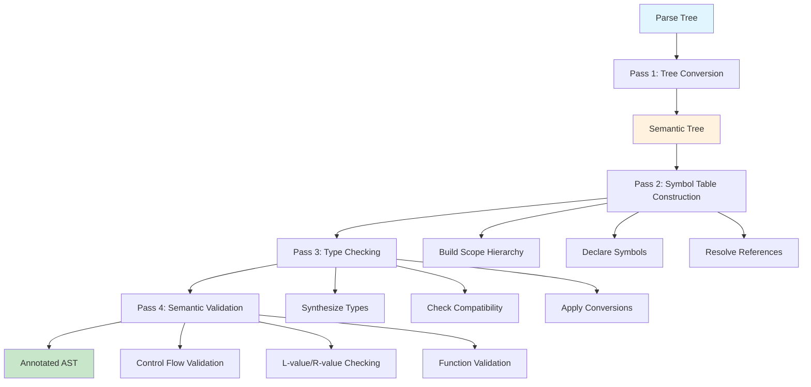
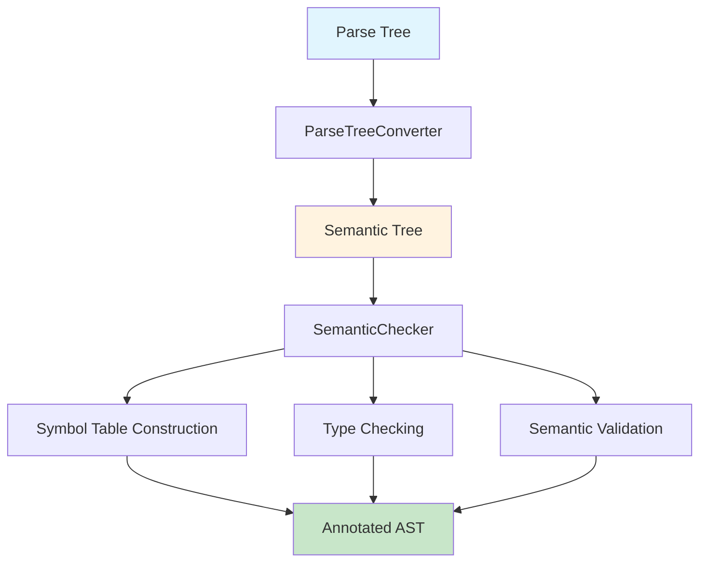
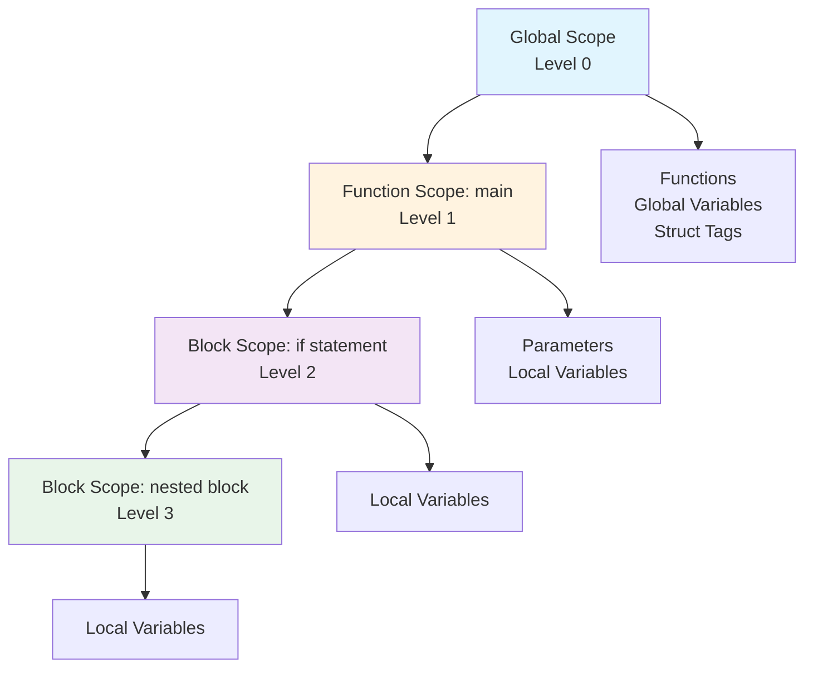

# Semantic Passes

## Overview

This document describes the semantic analysis passes performed by the PPJ compiler. **Semantic analysis** is the third major phase of compilation, following lexical analysis and syntax analysis. While syntax analysis ensures that a program is grammatically correct according to the language's context-free grammar, semantic analysis ensures that the program is **meaningfully correct**—that it follows language-specific rules that cannot be expressed using context-free grammars alone.

Semantic analysis validates several critical aspects of programs:

- **Type Correctness**: Ensures that operations are performed on compatible types, that function calls match function signatures, and that assignments are type-safe
- **Scope Resolution**: Determines which declaration each identifier refers to, following lexical scoping rules
- **Semantic Constraints**: Enforces language-specific rules such as "functions must return values", "break statements must appear in loops", and "variables must be declared before use"

These constraints are **context-sensitive**—they depend on information from different parts of the program. For example, determining whether `x + y` is valid requires knowing the types of `x` and `y`, which may be declared elsewhere in the program. Context-free grammars cannot express such constraints, which is why semantic analysis is a separate phase.

The PPJ compiler's semantic analyzer performs multiple passes over the parse tree, each pass handling a specific aspect of semantic analysis. This multi-pass approach allows the analyzer to build up semantic information incrementally, using information from earlier passes to inform later passes.

## Semantic Analysis Pipeline

The semantic analyzer performs multiple passes over the parse tree:





## Pass 1: Tree Conversion

### ParseTree to Semantic Tree

The first pass of semantic analysis converts the parser's **immutable parse tree** into a **mutable semantic tree** that can be annotated with semantic information during analysis.

#### Why Tree Conversion is Necessary

The parser produces an immutable parse tree—a tree structure that cannot be modified after construction. This immutability ensures that the parse tree accurately represents the parsing process and prevents accidental modifications. However, semantic analysis requires **annotating** the tree with semantic information:
- Type information for expressions
- Symbol references for identifiers
- L-value/R-value classifications
- Other semantic attributes

These annotations cannot be added to an immutable tree. Therefore, the semantic analyzer creates a new, mutable tree structure that mirrors the parse tree but allows modifications.

#### Conversion Process

The `ParseTreeConverter` class performs this conversion:

**Step 1: Traverse Parse Tree**: The converter performs a depth-first traversal of the parse tree, visiting every node.

**Step 2: Create Corresponding Nodes**: For each parse tree node, the converter creates a corresponding semantic tree node:
- **Terminal nodes** (tokens) become `TerminalNode` objects containing the token type, lexeme, and line number
- **Non-terminal nodes** (grammar productions) become `NonTerminalNode` objects containing the production name and child nodes

**Step 3: Preserve Structure**: The converter preserves the exact tree structure—parent-child relationships, node ordering, and hierarchy—ensuring that the semantic tree represents the same program structure as the parse tree.

**Step 4: Preserve Metadata**: Important metadata is preserved:
- **Line numbers**: Each node retains its source line number for error reporting
- **Lexemes**: Terminal nodes retain the actual text from the source (e.g., identifier names, literal values)

**Step 5: Initialize Attributes**: Each semantic tree node is initialized with an empty **semantic attributes container**. This container will be populated during semantic analysis with type information, symbol references, and other semantic attributes.

#### Result

The conversion produces a **semantic tree**—a mutable tree structure ready for semantic analysis. The semantic tree has the same structure as the parse tree but allows nodes to be annotated with semantic information as analysis proceeds.

**Example**: Consider the parse tree for `int x = 42;`:
```
<deklaracija>
  <ime_tipa>
    KR_INT
  <lista_init_deklaratora>
    <init_deklarator>
      IDN(x)
      OP_PRIDRUZI
      BROJ(42)
  TOCKAZAREZ
```

After conversion, this becomes a semantic tree with the same structure, but each node now has an attributes container that will be filled during semantic analysis:
- The `IDN(x)` node will be linked to a symbol table entry
- The `BROJ(42)` node will be annotated with type `int`
- The entire declaration will be processed to add `x` to the symbol table

## Pass 2: Symbol Table Construction

### Scope Management

The semantic analyzer builds a **hierarchical symbol table** that mirrors the lexical scoping structure of the program. A **scope** is a region of the program where a set of identifiers is visible. C uses **lexical scoping** (also called static scoping), meaning that the scope of an identifier is determined by its position in the source code, not by the execution flow.

#### Scope Hierarchy

The symbol table implements a tree structure representing nested scopes:



**Global Scope** (Level 0): The outermost scope, containing:
- Function declarations and definitions (e.g., `main`, `factorial`)
- Global variable declarations (variables declared outside any function)
- Struct tag definitions (names of structure types)

The global scope exists for the entire program and is always accessible.

**Function Scopes** (Level 1+): Each function definition creates a new scope containing:
- Function parameters (e.g., `int n` in `factorial(int n)`)
- Local variable declarations (variables declared inside the function body)

Function scopes are nested within the global scope. Parameters are visible throughout the entire function body.

**Block Scopes** (Level 2+): Block statements (`{ }`) and certain control flow statements create nested scopes:
- Variables declared inside blocks are only visible within that block
- Inner blocks can declare variables that shadow (hide) variables from outer scopes
- Loop statements may create scopes for loop variables

Block scopes can be nested arbitrarily deep, creating a hierarchy of scopes.

#### Symbol Declaration Process

The semantic analyzer declares symbols as it traverses the semantic tree:

**Step 1: Enter New Scope**: When encountering scope-creating constructs:
- **Function definitions**: Create a new function scope, add function parameters to this scope
- **Block statements** (`{ }`): Create a new block scope nested within the current scope
- **Loop statements**: Some loops may create scopes for loop variables

Entering a scope involves creating a new symbol table linked to the current scope as its parent, establishing the scope hierarchy.

**Step 2: Declare Symbols**: As declarations are encountered, symbols are added to the current scope:
- **Variable declarations**: Create `VariableSymbol` objects containing:
  - Name (identifier)
  - Type (int, char, array, pointer, etc.)
  - Const qualification (whether the variable is immutable)
  - Declaration location (line number)
- **Function declarations**: Create `FunctionSymbol` objects containing:
  - Name (identifier)
  - Function signature (parameter types and return type)
  - Definition status (whether the function is defined or only declared)
  - Declaration location

**Step 3: Check for Duplicates**: Before adding a symbol, the analyzer checks if an identifier with the same name is already declared in the **current scope**. If so, it reports a "duplicate declaration" error. Note that symbols in outer scopes don't cause duplicates—they are shadowed by inner declarations, which is allowed in C.

**Step 4: Exit Scope**: When leaving a scope (end of function, end of block), the analyzer returns to the parent scope. The symbol table structure maintains parent links, allowing easy scope exit.

#### Example: Symbol Table Construction

Consider the following program:
```c
int global_var = 10;

int factorial(int n) {
    if (n <= 1) {
        int result = 1;
        return result;
    }
    return n * factorial(n - 1);
}

int main(void) {
    int x = 5;
    return factorial(x);
}
```

The symbol table construction process would proceed as follows:

**Global Scope** (created first):
- `global_var`: VariableSymbol(name="global_var", type=int, const=false)
- `factorial`: FunctionSymbol(name="factorial", signature=int(int), defined=true)
- `main`: FunctionSymbol(name="main", signature=int(void), defined=true)

**Function Scope: factorial** (entered when processing `factorial`):
- `n`: VariableSymbol(name="n", type=int, const=false) [parameter]

**Block Scope: if statement** (entered when processing `if`):
- `result`: VariableSymbol(name="result", type=int, const=false)

**Function Scope: main** (entered when processing `main`):
- `x`: VariableSymbol(name="x", type=int, const=false)

When the analyzer processes `return result;` inside the `if` statement, it looks up `result`:
1. Check current scope (if block) → found `result`
2. Return reference to `result` symbol

When the analyzer processes `return factorial(x);` in `main`, it looks up `factorial`:
1. Check current scope (main function) → not found
2. Check parent scope (global) → found `factorial`
3. Return reference to `factorial` symbol

This hierarchical lookup implements lexical scoping correctly.

**See Also**: [Symbol Tables and Scopes](symbol-tables-and-scopes.md) for detailed information about symbol table implementation and scope resolution algorithms.

## Pass 3: Type Checking

### Type Synthesis

Types are synthesized bottom-up during tree traversal:

**Expression Types**:
- Literals: `BROJ` → `int`, `ZNAK` → `char`, `NIZ_ZNAKOVA` → `char[]`
- Identifiers: Lookup symbol table for declared type
- Binary expressions: Apply operator type rules
- Unary expressions: Apply unary operator rules
- Function calls: Return type of called function

**Declaration Types**:
- Variable declarations: Type from specifier
- Function declarations: Type from return type specifier
- Parameter declarations: Type from parameter specifier

### Type Compatibility

**Assignment Compatibility**:
- Same types: Always compatible
- Numeric types: `char` → `int` → `float` (implicit conversion)
- Const qualification: Non-const can be assigned to const, not vice versa
- Array decay: Arrays decay to pointers in function parameters

**Function Call Compatibility**:
- Parameter count must match
- Parameter types must be compatible
- Return type must match expected type

**See Also**: [Type System and Checking](type-system-and-checking.md)

## Pass 4: Semantic Validation

### Control Flow Validation

**Return Statements**:
- Functions with non-void return type must have return statement
- Return expression type must match function return type
- Void functions cannot return values

**Break/Continue Statements**:
- Must appear within loop or switch statement
- Validated during statement processing

**Function Definitions**:
- Functions must be defined exactly once
- Function signatures must match declarations

### L-value and R-value Checking

**L-values** (can appear on left side of assignment):
- Variables (non-const)
- Array elements
- Pointer dereferences

**R-values** (can appear on right side of assignment):
- Literals
- Function call results
- Arithmetic expressions
- Const-qualified variables

**Assignment Validation**:
- Left side must be L-value
- Types must be assignment-compatible

## Semantic Rules

### Rule Categories

Semantic rules are organized by construct type:

1. **Declaration Rules**: Variable/function declarations, scope management
2. **Expression Rules**: Type checking, operator semantics, conversions
3. **Statement Rules**: Control flow validation, block scoping

### Rule Implementation

Rules are implemented in `SemanticChecker` using visitor pattern:

```java
public class SemanticChecker {
    public void check(NonTerminalNode node) {
        // Dispatch to appropriate rule handler
        if (node.matches("<deklaracija>", ...)) {
            checkDeclaration(node);
        } else if (node.matches("<izraz>", ...)) {
            checkExpression(node);
        }
        // ...
    }
}
```

### Rule Examples

**Variable Declaration Rule**:
1. Extract type specifier
2. Extract identifier
3. Check for duplicate declaration in current scope
4. Create `VariableSymbol` and add to symbol table
5. If initialized, check initialization expression type

**Function Call Rule**:
1. Lookup function symbol
2. Check function is declared (not just defined)
3. Extract argument expressions
4. Check argument count matches parameter count
5. Check argument types match parameter types
6. Synthesize return type

## Attribute Synthesis

### Synthesized Attributes

Attributes flow from children to parent:

**Type Attribute**:
- Synthesized from expression children
- Propagated up parse tree
- Used for type checking

**L-value Attribute**:
- Synthesized for identifiers, array access, pointer dereference
- Used for assignment validation

### Inherited Attributes

Attributes flow from parent to children:

**Scope Attribute**:
- Inherited scope information
- Used for symbol lookup

**Expected Type Attribute**:
- Inherited expected type in context
- Used for type conversion checking

## Error Reporting

### Error Detection

Semantic errors are detected during analysis:

- **Type Errors**: Incompatible types in operations
- **Scope Errors**: Undefined identifiers, duplicate declarations
- **Control Flow Errors**: Invalid break/continue, missing return
- **Function Errors**: Mismatched signatures, undefined functions

### Error Format

Errors are reported with:
- Line number (from source)
- Error message (descriptive)
- Context information (identifier, type, etc.)

**Example**:
```
Error at line 5: Undefined identifier 'x'
Error at line 10: Type mismatch: expected int, got char
Error at line 15: Function 'foo' called with wrong number of arguments
```

## Output Files

The semantic analyzer generates debug output files:

### tablica_simbola.txt

Symbol table dump showing:
- Scope hierarchy
- Symbol names and types
- Declaration locations

### semanticko_stablo.txt

Annotated semantic tree showing:
- Type annotations
- L-value/R-value markings
- Symbol references

## Further Reading

- **[Symbol Tables and Scopes](symbol-tables-and-scopes.md)**: Symbol table implementation
- **[Type System and Checking](type-system-and-checking.md)**: Type system details
- **[Syntax Analysis](../04-syntax-analysis/grammar-specification.md)**: Parser output format

---

*Semantic analysis ensures that syntactically valid programs also satisfy language-specific semantic constraints, providing type safety and correct program behavior.*
