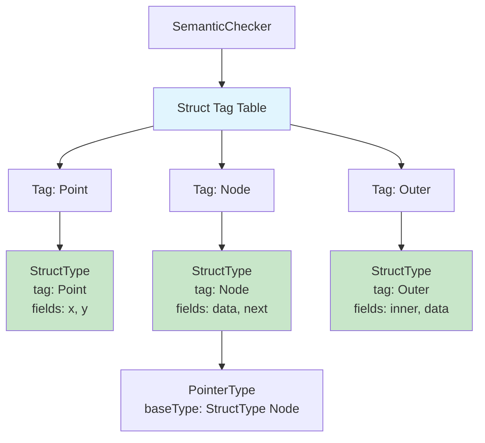
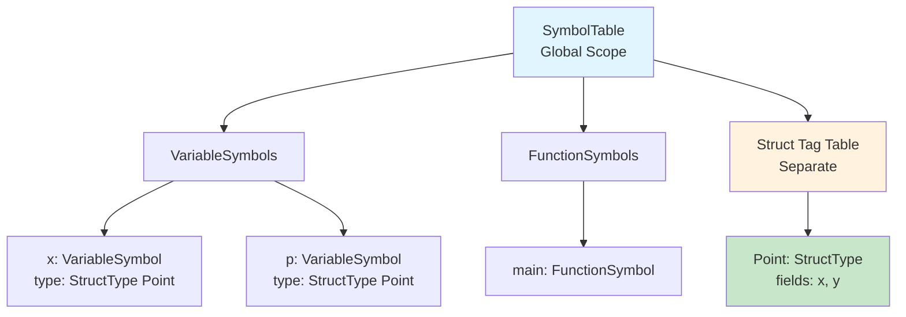

# Struct Type System and Semantic Checking

## Overview

The semantic analyzer performs comprehensive type checking and symbol management for struct types, ensuring that struct declarations are well-formed, member accesses are valid, and type compatibility rules are correctly enforced. This chapter describes how struct types are represented in the type system, how the semantic analyzer validates struct-related constructs, and how struct information is integrated into the symbol table.

## Struct Type Representation

Struct types are represented using the `StructType` record, which captures both the structural information (fields) and the tag information (for tagged structs) necessary for type checking and code generation.

### StructType Record Structure

```java
public record StructType(
    String tag,                    // struct tag name, or null for anonymous structs
    Map<String, Type> fields       // immutable map from field name to field type
) implements Type {}
```

**Key Properties:**

- **Tag Field**: For tagged structs, `tag` contains the identifier used to reference the struct type. For anonymous structs, `tag` is `null`. The tag enables forward declarations and self-referential structures.

- **Fields Map**: The `fields` map preserves declaration order (using `LinkedHashMap`) and maps each field name to its type. Field types can be any valid PPJ-C type: primitives, arrays, pointers, other structs, or const-qualified types.

- **Immutability**: The fields map is defensively copied during construction to ensure immutability. This prevents accidental modification of struct type definitions after they are created.

### Type System Integration

Struct types integrate with the broader type system through the `Type` sealed interface hierarchy:

```java
public sealed interface Type permits 
    PrimitiveType, ArrayType, FunctionType, ConstType, PointerType, StructType {
    boolean isVoid();
    boolean isScalar();
    boolean isArray();
    boolean isFunction();
    boolean isConst();
}
```

**Struct Type Characteristics:**

- **Not Scalar**: `StructType.isScalar()` returns `false`, meaning structs cannot be used in arithmetic operations, boolean contexts, or pointer arithmetic.

- **Not Array**: `StructType.isArray()` returns `false`, though structs can contain array fields.

- **Not Function**: `StructType.isFunction()` returns `false`, though structs can contain function pointer fields.

- **Const Qualification**: Struct types can be wrapped with `ConstType` to create const-qualified struct types: `const struct Point p;`

## Struct Tag Management

The semantic analyzer maintains a separate **struct tag table** that maps struct tag names to their type definitions. This table enables forward declarations and self-referential structures.

### Tag Table Structure



### Forward Declaration Mechanism

Tagged structs support forward declarations to enable self-referential structures. The semantic analyzer implements a two-phase registration process:

**Phase 1: Forward Declaration**
When a tagged struct definition begins (`struct Tag { ... }`), the analyzer first registers a forward declaration with an empty field list:

```java
StructType forwardDecl = new StructType(tag, new LinkedHashMap<>());
checker.registerStructTagForward(tag, forwardDecl, node);
```

This forward declaration allows fields within the struct to reference the struct type itself (e.g., `struct Node *next;`).

**Phase 2: Full Definition**
After processing all field declarations, the analyzer registers the complete definition, replacing the forward declaration:

```java
StructType structType = new StructType(tag, fields);
checker.registerStructTag(tag, structType, node);
```

**Example: Self-Referential Structure**
```c
struct Node {
    int data;
    struct Node *next;  // References Node before definition is complete
};
```

The forward declaration mechanism allows `struct Node` to be referenced within its own field list, enabling recursive data structures like linked lists and trees.

## Struct Declaration Semantic Rules

The semantic analyzer enforces several well-formedness rules for struct declarations through the `StructRules` class.

### Rule 1: Field Type Validity

Struct fields must have valid, non-void types. The following are prohibited:
- `void` type fields: `struct S { void x; }` ❌
- Function type fields: `struct S { int f(void); }` ❌

**Implementation:**
```java
Type fieldType = specList.attributes().type();
if (fieldType == null || fieldType.isVoid()) {
    checker.fail(node);
    return;
}
if (fieldType instanceof FunctionType) {
    checker.fail(node);
    return;
}
```

### Rule 2: Field Name Uniqueness

Field names must be unique within a struct. Duplicate field names cause a semantic error.

**Example:**
```c
struct Point {
    int x;
    int x;  // Error: duplicate field name
};
```

**Implementation:**
```java
for (Map.Entry<String, Type> entry : declFields.entrySet()) {
    if (fields.containsKey(entry.getKey())) {
        checker.fail(node);  // Duplicate field name
        return;
    }
    fields.put(entry.getKey(), entry.getValue());
}
```

### Rule 3: Declaration Order Preservation

Fields are stored in declaration order using `LinkedHashMap`. This order is preserved throughout compilation and is critical for calculating field offsets during code generation.

### Rule 4: Tag Resolution

When referencing a struct by tag (`struct Tag`), the tag must have been previously defined. Undefined tags cause a semantic error.

**Example:**
```c
struct Point p;  // Error: Point not yet defined

struct Point {
    int x;
    int y;
};
```

**Implementation:**
```java
String tag = tagToken.lexeme();
StructType structType = checker.lookupStructTag(tag);
if (structType == null) {
    checker.fail(node);  // Tag not found
    return;
}
```

## Struct Member Access Semantic Rules

Member access expressions (`struct.field`) are validated during semantic analysis to ensure type safety.

### Rule 5: Base Expression Type

The base expression in a member access must be a struct type. Accessing members of non-struct types causes a semantic error.

**Example:**
```c
int x;
x.field;  // Error: x is not a struct type
```

**Implementation:**
```java
Type baseType = base.attributes().type();
Type stripped = TypeSystem.stripConst(baseType);
if (!(stripped instanceof StructType structType)) {
    checker.fail(node);
    return;
}
```

### Rule 6: Field Existence

The field name must exist in the struct type. Accessing non-existent fields causes a semantic error.

**Example:**
```c
struct Point { int x; int y; };
struct Point p;
p.z;  // Error: field 'z' does not exist
```

**Implementation:**
```java
String fieldName = fieldToken.lexeme();
if (!structType.hasField(fieldName)) {
    checker.fail(node);  // Field not found
    return;
}
```

### Rule 7: Result Type

The result type of a member access expression is the type of the accessed field. The result preserves const qualification from both the base expression and the field type.

**Example:**
```c
const struct Point p;
p.x;  // Result type: int (not const, since x is not const)

struct Point {
    const int x;
    int y;
};
struct Point p;
p.x;  // Result type: const int
```

**Implementation:**
```java
Type fieldType = structType.getFieldType(fieldName);
node.attributes().type(fieldType);
```

### Rule 8: L-Value Property

A member access expression is an l-value (can appear on the left side of assignment) if:
1. The base expression is an l-value
2. The field type is not const-qualified

**Example:**
```c
struct Point {
    int x;
    const int y;
};
struct Point p;
p.x = 5;    // OK: p is l-value, x is not const
p.y = 5;    // Error: y is const
```

**Implementation:**
```java
boolean isLValue = base.attributes().isLValue() && !TypeSystem.isConst(fieldType);
node.attributes().lValue(isLValue);
```

## Type Compatibility and Equality

Struct types use specific equality rules that differ from structural equality used for other types.

### Tagged Struct Equality

Tagged structs are compared by tag name, not by field structure. This enables forward declarations and ensures that two struct definitions with the same tag are considered the same type, even if their field lists differ (which would be an error in a complete program).

**Example:**
```c
struct Point { int x; int y; };
struct Point p1;

struct Point { int x; int y; };  // Same tag, same type
struct Point p2;

p1 = p2;  // OK: same type (same tag)
```

**Implementation:**
```java
public boolean equals(Object obj) {
    if (this == obj) return true;
    if (!(obj instanceof StructType other)) return false;
    
    // Tagged structs: compare by tag
    if (this.tag != null && other.tag != null) {
        return this.tag.equals(other.tag);
    }
    
    // Anonymous structs: compare by structure
    if (this.tag == null && other.tag == null) {
        return this.fields.equals(other.fields);
    }
    
    return false;
}
```

### Anonymous Struct Equality

Anonymous structs are compared by structural equality: field names and types must match exactly.

**Example:**
```c
struct { int x; } p1;
struct { int x; } p2;

p1 = p2;  // Error: different types (anonymous structs compared by structure)
```

### Assignment Compatibility

Struct assignment is allowed only when:
1. Both operands have struct types
2. The struct types are equal (by tag for tagged structs, by structure for anonymous structs)
3. The left operand is an l-value
4. The left operand's fields are not const-qualified (if assigning to individual fields)

**Example:**
```c
struct Point { int x; int y; };
struct Point p, q;
p = q;  // OK: same type

struct { int x; } r;
p = r;  // Error: different types
```

## Symbol Table Integration

Struct types are integrated into the symbol table system, but struct tags are managed separately from variable and function symbols.

### Symbol Table Structure



### Variable Symbols with Struct Types

Variables declared with struct types are stored in the symbol table with `VariableSymbol` records:

```java
VariableSymbol p = new VariableSymbol(
    "p",                           // name
    new StructType("Point", ...),  // type
    false                          // isConst
);
```

The struct type information is embedded in the variable symbol's type field, allowing the semantic analyzer to:
- Validate member accesses: `p.x` is valid if `Point` has field `x`
- Check assignment compatibility: `p = q` requires `p` and `q` to have compatible struct types
- Generate correct code: field offsets can be calculated from the struct type

### Scope Rules for Struct Tags

Struct tags follow different scoping rules than variables:

- **Global Scope**: Struct tags are always in global scope, regardless of where they are defined
- **No Shadowing**: Struct tags cannot be shadowed by variables or other symbols
- **Forward References**: Struct tags can be referenced before they are defined (forward declarations)

**Example:**
```c
void f(void) {
    struct Point p;  // OK: Point is in global scope
}

struct Point {
    int x;
    int y;
};
```

## Semantic Analysis Algorithm

The semantic analyzer processes struct-related constructs through a visitor pattern that traverses the AST and applies semantic rules.

### Struct Specifier Analysis

**Algorithm:**
1. Determine struct form (tagged definition, anonymous definition, or tag reference)
2. For tagged definitions:
   - Register forward declaration
   - Process field list
   - Register full definition
3. For anonymous definitions:
   - Process field list
   - Create anonymous struct type
4. For tag references:
   - Look up struct tag
   - Verify tag exists
5. Attach struct type to AST node

### Field List Analysis

**Algorithm:**
1. Initialize empty fields map
2. For each field declaration:
   - Validate field type (non-void, non-function)
   - Process declarator list
   - Extract field names and types
   - Check for duplicate field names
   - Add fields to map (preserving order)
3. Attach fields map to AST node

### Member Access Analysis

**Algorithm:**
1. Evaluate base expression type
2. Strip const qualification
3. Verify base is struct type
4. Extract field name from AST
5. Verify field exists in struct
6. Get field type
7. Determine l-value property
8. Attach result type and l-value to AST node

## Error Reporting

The semantic analyzer reports detailed errors for struct-related violations:

**Error: Undefined Struct Tag**
```
Error: struct tag 'Point' not defined
```

**Error: Duplicate Field Name**
```
Error: duplicate field name 'x' in struct
```

**Error: Invalid Field Type**
```
Error: struct field cannot have void type
```

**Error: Member Access on Non-Struct**
```
Error: member access on non-struct type 'int'
```

**Error: Field Not Found**
```
Error: struct 'Point' has no field 'z'
```

## Summary

The semantic analyzer provides comprehensive type checking for struct types:

- **Type Representation**: Struct types are represented as `StructType` records with tag and field information
- **Tag Management**: Separate tag table enables forward declarations and self-referential structures
- **Well-Formedness Rules**: Field type validity, name uniqueness, and declaration order are enforced
- **Member Access Validation**: Base type checking, field existence, and l-value determination
- **Type Compatibility**: Tagged structs compared by tag, anonymous structs by structure
- **Symbol Integration**: Struct types integrated into variable symbols while tags managed separately

This semantic analysis ensures that struct-related constructs are type-safe and well-formed before code generation begins.
