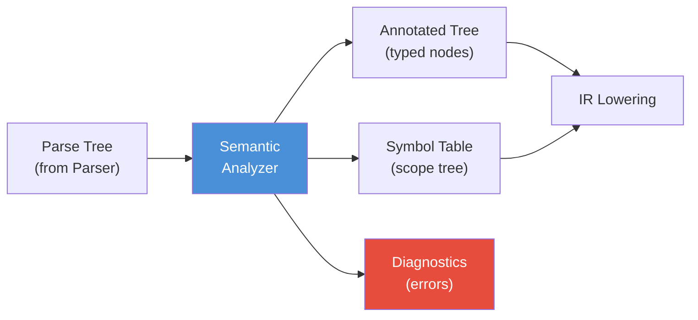
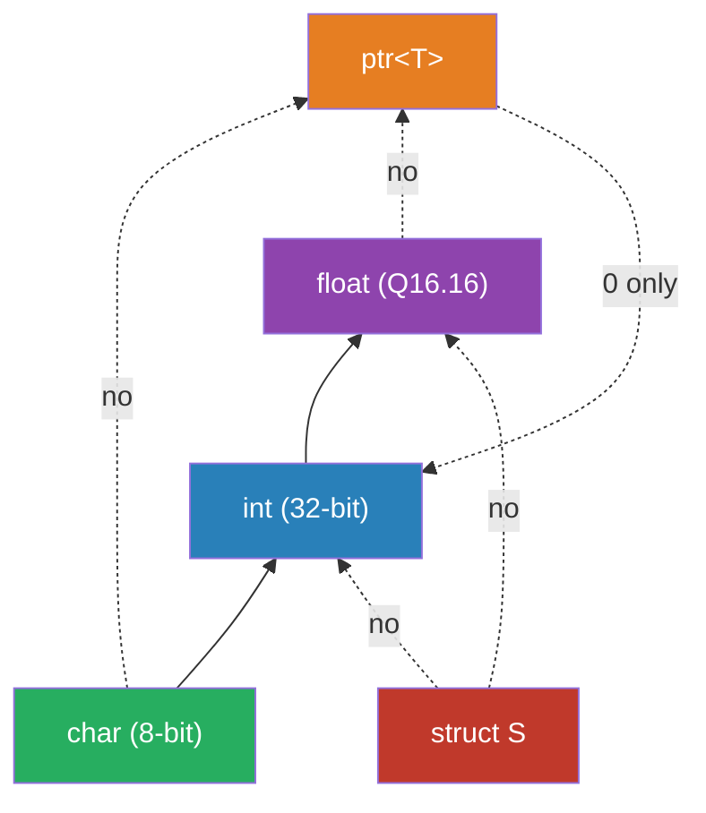
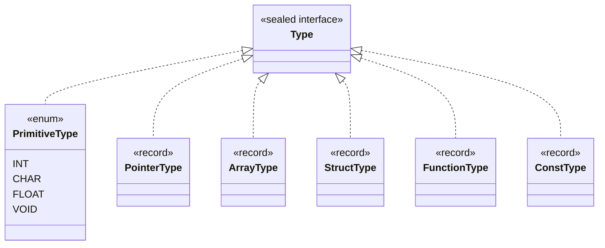
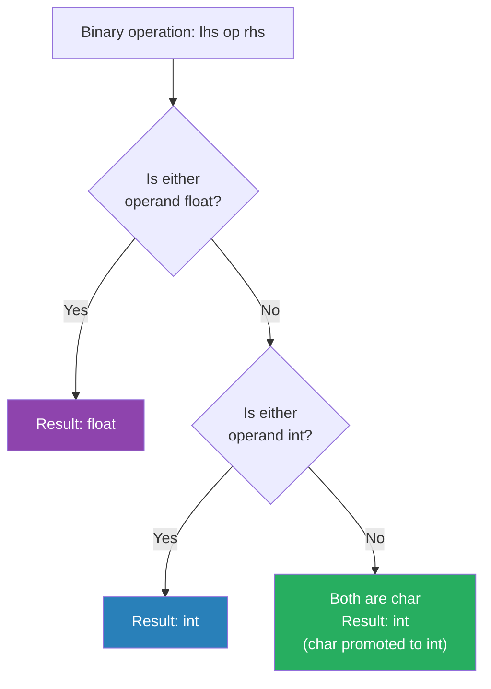
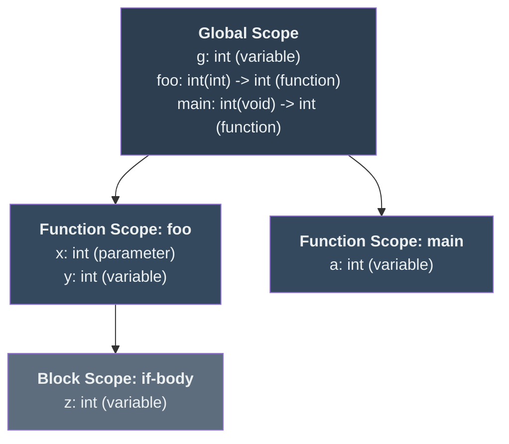
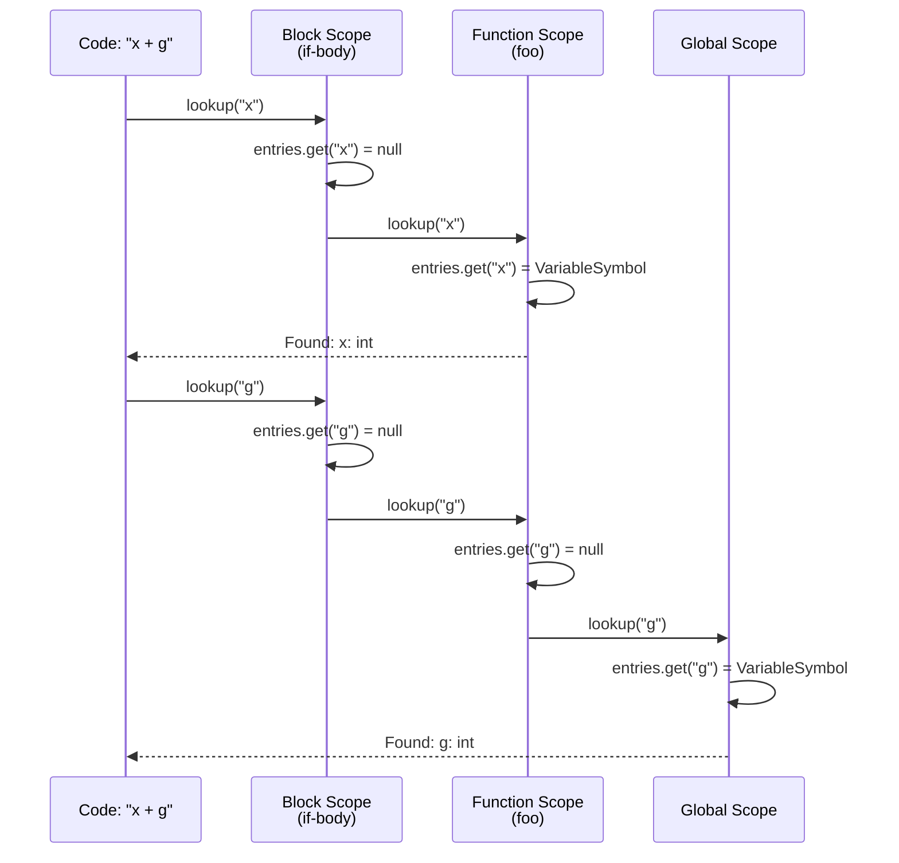
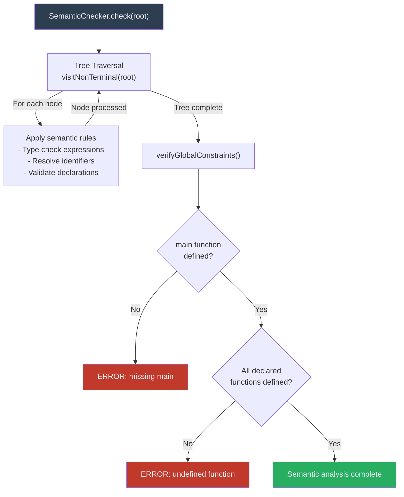
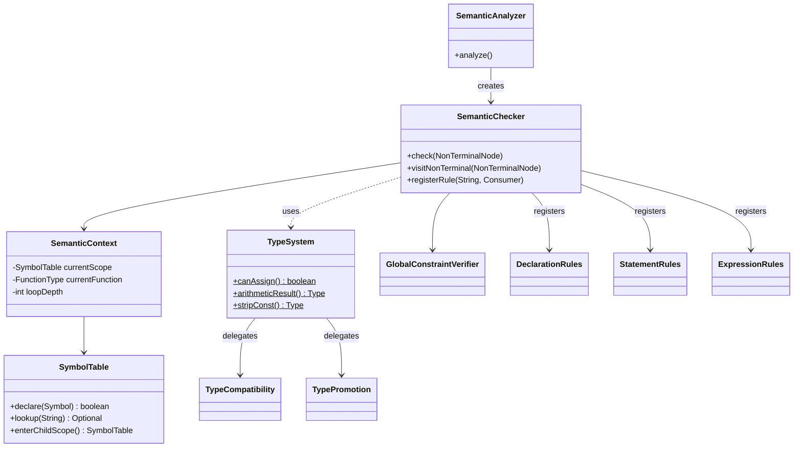
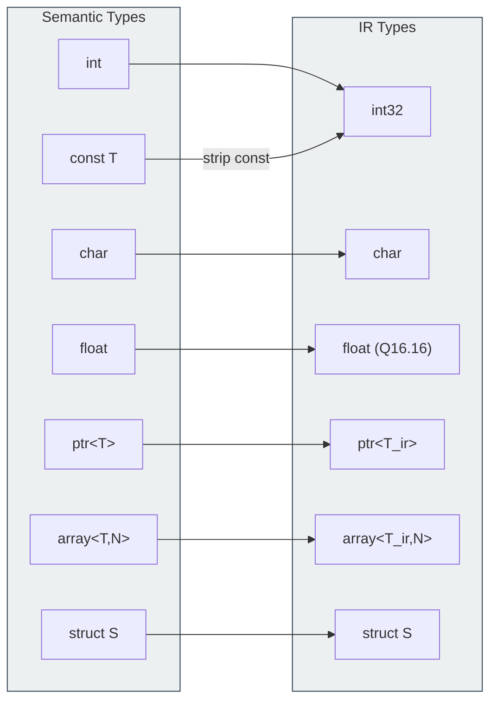

> **📖 From the book.** This chapter accompanies *Building a C-Subset Compiler for the FRISC Architecture: From Formal Languages to Executable Code* by Dr. Karlo Knežević (Zenodo, 2026). For the complete treatment — formal development, proofs, and figures — read the book: [📄 PDF](../book/Building-a-C-Subset-Compiler-for-the-FRISC-Architecture.pdf) · DOI [10.5281/zenodo.20511073](https://doi.org/10.5281/zenodo.20511073) · ISBN 978-953-47198-0-0.

## 5.1 Role of the Semantic Phase

Parsing determines whether a token sequence conforms to the grammar. Semantic analysis determines whether a grammatically correct program is *meaningful* under the language's typing and scoping rules. In the FRISCcc compiler, the semantic phase acts as the gatekeeper for IR generation: only programs that pass all semantic checks are lowered into typed IR. \index{semantic analysis}

The semantic phase enforces invariants that every subsequent phase assumes as axioms. IR lowering assumes that all identifiers have been resolved, that operator operands are type-compatible, and that function calls satisfy their parameter contracts. If any of these assumptions were violated, the generated IR would be ill-formed, and the backend would produce incorrect machine code or crash. By concentrating all meaning-related validation in a single phase, the compiler achieves a clean separation between syntactic structure (parser output) and semantic validity (analyzer output).

This chapter presents a comprehensive treatment of FRISCcc's semantic analysis. We begin with the formal foundations of the type system, develop the symbol table data structure and its scoping semantics, trace detailed type-checking walkthroughs, catalog every semantic error the compiler can produce, and conclude with the architectural design patterns that make the implementation modular and maintainable.



*Figure 5.1: The semantic analyzer sits between the parser and IR lowering. It consumes the untyped parse tree and produces an annotated tree with resolved types, a hierarchical symbol table, and any diagnostic messages.*

## 5.2 Input and Output Contracts

### 5.2.1 Input

The semantic analyzer receives a parse tree produced by `compiler-parser`. This tree is a concrete syntax tree where each node corresponds to a grammar production. Terminal nodes carry lexeme text and token type; non-terminal nodes carry the production name and a list of children. \index{parse tree}

### 5.2.2 Output

The semantic analyzer produces three artifacts:

1. An annotated semantic tree (`NonTerminalNode` graph with semantic attributes attached to each node, including computed types, lvalue/rvalue flags, cast categories, and identifier resolution information).
2. A hierarchical symbol table (`SymbolTable`) rooted at global scope, with the complete scope tree reflecting all block nesting encountered during analysis.
3. Diagnostics for any semantic violation, routed through a `DiagnosticReporter`.

### 5.2.3 Entry Point

The entry point is the `SemanticAnalyzer` facade class:

```java
public SemanticAnalysisResult analyzeWithResults(ParseTree parseTree,
    DiagnosticReporter reporter,
    SemanticReport semanticReport) {
  NonTerminalNode root = new ParseTreeConverter().convert(parseTree);
  SymbolTable globalScope = new SymbolTable();
  SemanticChecker checker = new SemanticChecker(globalScope, reporter);
  checker.check(root);
  return new SemanticAnalysisResult(globalScope, root);
}
```

The returned `SemanticAnalysisResult` bundles the annotated tree and the completed symbol table, which `compiler-ir` consumes directly. The `SemanticAnalyzer` class is deliberately thin -- it wires together the parser result, the semantic tree representation, the hierarchical `SymbolTable`, and the `SemanticChecker`, keeping orchestration logic separate from the checking logic. This makes the checker easier to test in isolation while providing a small and stable API surface.

## 5.3 The Type System

### 5.3.1 Type System Theory

A type system is a tractable syntactic method for proving the absence of certain program behaviors by classifying phrases according to the kinds of values they compute. In compiler construction, the type system serves as a static approximation of runtime behavior: it rejects programs that would perform meaningless operations (adding an integer to a struct, calling a non-function) without requiring execution. \index{type system}

Formally, a type system defines a set of *types* $\mathcal{T}$ and a *typing relation* $\Gamma \vdash e : \tau$ which reads "under typing context $\Gamma$, expression $e$ has type $\tau$." The typing context $\Gamma$ maps identifiers to their declared types -- this is precisely the information stored in the symbol table.

#### Type Rules in Inference Notation

The FRISCcc type system can be expressed using standard inference rule notation. Each rule has premises above the line and a conclusion below.

**Integer literal:**

$$\frac{}{\Gamma \vdash n : \text{int}} \quad (\text{T-IntLit})$$

**Character literal:**

$$\frac{}{\Gamma \vdash \text{'c'} : \text{char}} \quad (\text{T-CharLit})$$

**Float literal:**

$$\frac{}{\Gamma \vdash f : \text{float}} \quad (\text{T-FloatLit})$$

**Variable reference:**

$$\frac{\Gamma(x) = \tau}{\Gamma \vdash x : \tau} \quad (\text{T-Var})$$

**Assignment:**

$$\frac{\Gamma \vdash e_1 : \tau_1 \quad \Gamma \vdash e_2 : \tau_2 \quad \text{lvalue}(e_1) \quad \neg\text{const}(\tau_1) \quad \text{canAssign}(\tau_2, \tau_1)}{\Gamma \vdash e_1 = e_2 : \tau_1} \quad (\text{T-Assign})$$

**Binary arithmetic operation:**

$$\frac{\Gamma \vdash e_1 : \tau_1 \quad \Gamma \vdash e_2 : \tau_2 \quad \text{scalar}(\tau_1) \quad \text{scalar}(\tau_2)}{\Gamma \vdash e_1 \oplus e_2 : \text{arithmeticResult}(\tau_1, \tau_2)} \quad (\text{T-BinArith})$$

**Function call:**

$$\frac{\Gamma \vdash f : (\tau_1, \ldots, \tau_n) \rightarrow \tau_r \quad \Gamma \vdash a_i : \sigma_i \quad \text{canAssign}(\sigma_i, \tau_i) \;\forall\, 1 \le i \le n}{\Gamma \vdash f(a_1, \ldots, a_n) : \tau_r} \quad (\text{T-Call})$$

**Struct field access:**

$$\frac{\Gamma \vdash e : \text{struct}\;S \quad f \in \text{fields}(S) \quad \text{fields}(S)(f) = \tau_f}{\Gamma \vdash e.f : \tau_f} \quad (\text{T-Field})$$

**Pointer dereference:**

$$\frac{\Gamma \vdash e : \text{ptr}\langle\tau\rangle}{\Gamma \vdash *e : \tau} \quad (\text{T-Deref})$$

**Address-of:**

$$\frac{\Gamma \vdash e : \tau \quad \text{lvalue}(e)}{\Gamma \vdash \&e : \text{ptr}\langle\tau\rangle} \quad (\text{T-AddrOf})$$

These rules encode the key insight of type-theoretic compiler design: each syntactic construct has a unique typing rule, and the semantic analyzer simply *instantiates* these rules for each node in the parse tree.

#### Type Compatibility as a Partial Order

The implicit conversion rules define a partial order on types. We write $\tau_1 \preceq \tau_2$ when a value of type $\tau_1$ can be implicitly assigned to a variable of type $\tau_2$. In FRISCcc:

$$\text{char} \preceq \text{int} \preceq \text{float}$$

This forms a chain (total order) among the numeric types. However, the full relation is only a partial order because pointer types, struct types, and void are not comparable with numeric types:



*Figure 5.2: The implicit conversion hierarchy of FRISCcc types. Solid arrows indicate implicit promotion. The dashed arrow from ptr to int represents the special case of integer zero as a null pointer constant. All other cross-category conversions are prohibited or require explicit casts.*

### 5.3.2 Type Hierarchy

The type system is implemented as a sealed interface hierarchy rooted at `Type`. The sealed pattern ensures exhaustive matching in checking code -- no unknown type implementation can appear at runtime. \index{sealed interface}

```text
Type (sealed interface)
  |-- PrimitiveType (enum: INT, CHAR, FLOAT, VOID)
  |-- PointerType   (record: baseType: Type, isConst: boolean)
  |-- ArrayType     (record: elementType: Type, size: int)
  |-- StructType    (record: tag: String?, fields: Map<String, Type>)
  |-- FunctionType  (record: returnType: Type, parameterTypes: List<Type>)
  |-- ConstType     (record: baseType: Type)
```

The `sealed` keyword in Java constrains which classes may implement the `Type` interface. This is critical for correctness: if a new type variant were added, every `switch` expression or `instanceof` chain in the semantic analyzer would be flagged as non-exhaustive by the compiler. The full declaration is:

```java
public sealed interface Type
    permits PrimitiveType, ArrayType, FunctionType,
            ConstType, PointerType, StructType {

  default boolean isVoid() {
    return this == PrimitiveType.VOID;
  }

  default boolean isScalar() {
    return this == PrimitiveType.INT
        || this == PrimitiveType.CHAR
        || this == PrimitiveType.FLOAT
        || this instanceof PointerType;
  }
}
```

The `isScalar()` method is central to many semantic checks: scalar types can appear as operands to arithmetic, relational, and logical operators, and as conditions in control-flow statements (`if`, `while`, `for`). Non-scalar types (`void`, `ArrayType`, `StructType`, `FunctionType`) cannot.



*Figure 5.3: The sealed type hierarchy. Every permitted implementation is a value type (record or enum), making types immutable and freely shareable between parse tree nodes.*

### 5.3.3 Complete Type Property Table

| Type | Scalar? | Const-eligible? | Size (bytes) | Lvalue-capable? | Notes |
|------|---------|-----------------|--------------|-----------------|-------|
| `int` | Yes | Yes | 4 | Yes | 32-bit signed two's complement |
| `char` | Yes | Yes | 1 | Yes | 8-bit signed integer |
| `float` | Yes | Yes | 4 | Yes | Semantic float; Q16.16 fixed-point in backend |
| `void` | No | No | 0 | No | Return type and parameter list only |
| `ptr<T>` | Yes | Yes | 4 | Yes | Pointer to any type T |
| `array<T,N>` | No | No | N * sizeof(T) | No (decays) | Decays to `ptr<T>` in most contexts |
| `struct Tag` | No | Yes | Sum of fields | Yes | Non-scalar aggregate |
| `const T` | Same as T | N/A (already const) | Same as T | No (not assignable) | Wrapper; delegates queries to T |
| `function(T...):R` | No | No | N/A | No | Exists only in symbol table |

Note that `float` in FRISCcc is semantically a floating-point type but is represented as Q16.16 fixed-point in the backend. The Q16.16 format uses 16 bits for the integer part and 16 bits for the fractional part, stored in a 32-bit word. This representation decision is invisible at the semantic level -- the type system treats `float` as a standard floating-point type with the usual promotion rules.

### 5.3.4 Implicit Type Conversions (Assignment Compatibility)

The `TypeCompatibility.canAssign(source, target)` method encodes all legal implicit conversions in this C subset. The rules, in evaluation order: \index{implicit conversion}

1. **Array and function targets**: If the target is `ArrayType` or `FunctionType`, the source must be exactly equal (no implicit conversion).

2. **Pointer targets**: If the target is `ptr<T>`:
   - Source `ptr<S>` is compatible if `T` equals `S` ignoring const qualification.
   - Source `array<S,N>` is compatible if `T` equals `S` ignoring const (array-to-pointer decay).
   - Source `int` is compatible (integer zero as null pointer constant).
   - All other sources are rejected.

3. **Struct targets**: Source must be exactly equal (same tag for tagged structs, structural equality for anonymous structs).

4. **Numeric targets**:

| Target | Accepted sources |
|--------|-----------------|
| `int` | `int`, `char`, `float` |
| `char` | `char`, `int` |
| `float` | `int`, `char`, `float` |

5. **Void target**: No assignment is permitted.

Const qualification is stripped from both source and target before these checks execute.

The actual implementation in `TypeCompatibility.canAssign()` follows this exact decision chain:

```java
public static boolean canAssign(Type source, Type target) {
  if (target instanceof ArrayType || target instanceof FunctionType) {
    return source.equals(target);
  }
  Type unqualifiedTarget = TypeSystem.stripConst(target);
  Type unqualifiedSource = TypeSystem.stripConst(source);

  if (unqualifiedTarget instanceof PointerType targetPtr) {
    if (unqualifiedSource instanceof PointerType sourcePtr) {
      return equalsIgnoringConst(targetPtr.baseType(), sourcePtr.baseType());
    }
    if (unqualifiedSource instanceof ArrayType arrayType) {
      return equalsIgnoringConst(targetPtr.baseType(), arrayType.elementType());
    }
    if (unqualifiedSource == PrimitiveType.INT) {
      return true; // int 0 -> pointer (NULL)
    }
    return false;
  }
  // ... numeric and struct checks follow
}
```

### 5.3.5 Type Compatibility Matrix

The following matrix summarizes assignment compatibility across all type categories. Each cell indicates whether a value of the *source* type (row) can be assigned to a variable of the *target* type (column): \index{type compatibility}

| Source \ Target | `int` | `char` | `float` | `ptr<T>` | `struct S` | `void` |
|:---|:---:|:---:|:---:|:---:|:---:|:---:|
| `int` | implicit | implicit | implicit | 0 only | -- | -- |
| `char` | implicit | implicit | implicit | -- | -- | -- |
| `float` | implicit | -- | implicit | -- | -- | -- |
| `ptr<T>` | -- | -- | -- | same base | -- | -- |
| `array<T,N>` | -- | -- | -- | decay | -- | -- |
| `struct S` | -- | -- | -- | -- | exact type | -- |

Legend:
- **implicit**: Conversion happens automatically; no cast required.
- **0 only**: Only the integer constant zero (null pointer) is accepted.
- **same base**: Base types must match ignoring `const`.
- **decay**: Array decays to pointer; element type must match target base type.
- **exact type**: Tagged structs match by tag; anonymous structs by structural equality.
- **--**: Conversion is prohibited.

### 5.3.6 Usual Arithmetic Conversions

When a binary arithmetic operator (`+`, `-`, `*`, `/`, `%`) is applied to two scalar operands, the `TypePromotion.arithmeticResult(lhs, rhs)` method determines the result type: \index{arithmetic conversions}

1. If either operand (after stripping const) is `float`, the result is `float`.
2. Otherwise, the result is `int`. This includes the case where both operands are `char` -- `char` is always promoted to `int`.

This follows the standard C "usual arithmetic conversions" restricted to the types supported by this subset. The implementation is concise:

```java
public static Type arithmeticResult(Type lhs, Type rhs) {
  if (!lhs.isScalar() || !rhs.isScalar()) {
    throw new IllegalArgumentException("Operands must be scalar types");
  }
  Type lhsStripped = TypeSystem.stripConst(lhs);
  Type rhsStripped = TypeSystem.stripConst(rhs);
  if (lhsStripped == PrimitiveType.FLOAT || rhsStripped == PrimitiveType.FLOAT) {
    return PrimitiveType.FLOAT;
  }
  return PrimitiveType.INT;
}
```

The promotion hierarchy can be visualized as a decision tree:



*Figure 5.4: The usual arithmetic conversion decision tree. The key insight is that `char` operands are always promoted to `int` -- there is no `char`-width arithmetic in this compiler.*

### 5.3.7 Explicit Casts

The `TypeCompatibility.canCast(source, target)` method validates explicit cast expressions. The supported conversions are: \index{explicit cast}

- **Numeric-to-numeric**: Any combination of `int`, `char`, `float` can be cast to any other.
- **Pointer-to-integer**: A pointer can be cast to `int`.
- **Integer-to-pointer**: An `int` can be cast to any pointer type.
- **Pointer-to-pointer**: Allowed if base types are equal ignoring const.
- **Cast to void**: Always allowed (discards the value).
- **Struct-to-struct**: Only if the struct types are identical.
- **Prohibited**: Casts to `ArrayType` or `FunctionType` are always rejected.

### 5.3.8 Cast Categories for IR Generation

When an explicit or implicit cast is semantically valid, the `CastCategoryUtil` determines the specific IR operation required. The cast categories directly map to IR instructions: \index{cast category}

| Category | Conversion | IR Instruction | Bit-level Operation |
|----------|-----------|----------------|---------------------|
| `TRUNC` | int32 -> char | `trunc` | Keep low 8 bits |
| `SEXT` | char -> int32 | `sext` | Sign-extend bit 7 to bits 8--31 |
| `ITOF` | int32 -> float | `itof` | Convert integer to Q16.16 (shift left 16) |
| `FTOI` | float -> int32 | `ftoi` | Convert Q16.16 to integer (arithmetic shift right 16) |
| `PTRCAST` | ptr\<T\> -> ptr\<U\> | `ptrcast` | No-op at machine level (reinterpret) |

Note that `char` is signed 8-bit in FRISCcc, so widening from `char` to `int` uses sign extension (`SEXT`), not zero extension (`ZEXT`). This matches C's specification for signed character types.

## 5.4 Const Semantics

### 5.4.1 Const Qualification Model

`ConstType` wraps any non-void base type and delegates `isScalar()` and `isVoid()` to the wrapped type. The constructor rejects `void` as a base type: \index{const}

```java
public record ConstType(Type baseType) implements Type {
  public ConstType {
    Objects.requireNonNull(baseType, "baseType must not be null");
    if (baseType.isVoid()) {
      throw new IllegalArgumentException("Cannot apply const to void");
    }
  }

  @Override
  public boolean isScalar() { return baseType.isScalar(); }

  @Override
  public boolean isVoid() { return baseType.isVoid(); }
}
```

### 5.4.2 Const Checking Rules

Const semantics affect the following checks:

- **Assignment**: An expression of const-qualified type cannot appear on the left-hand side of an assignment. The semantic checker treats const-qualified lvalues as non-assignable. The check in `BinaryExpressionRules` is:

```java
if (!lhs.attributes().isLValue() || TypeSystem.isConst(lhs.attributes().type())) {
  checker.fail(node);
}
```

- **Initialization requirement**: Variables declared with const qualification must be initialized at the point of declaration. The `TypeChecker.requiresInitialization()` method returns `true` for `ConstType` and for arrays whose element type is const.

- **Type comparison**: Most compatibility checks strip const before comparing. `TypeSystem.stripConst()` unwraps one layer of `ConstType`; if the type is not const-qualified, it returns the type unchanged.

- **Pointer-to-const**: In `const int *p`, the `ConstType` wraps `int` inside the pointer's base type. The pointer itself is assignable, but dereferencing yields a const value.

### 5.4.3 Const Through Pointers

The interaction between `const` and pointers creates subtle distinctions that the semantic analyzer must handle correctly:

```c
const int x = 10;      // x is const int -- cannot assign to x
int y = 20;
const int *p = &x;     // p points to const int -- cannot assign through *p
int *q = &y;           // q points to int -- can assign through *q

*p = 5;                // ERROR: assignment to const-qualified lvalue
p = &y;                // OK: p itself is not const, only the pointed-to value

int * const r = &y;    // r is a const pointer to int -- cannot reassign r
*r = 30;               // OK: the pointed-to value is not const
r = &x;                // ERROR: r itself is const
```

The `TypeSystem` API provides three operations that work together to support these checks:

| Operation | Method | Purpose |
|-----------|--------|---------|
| Check const | `TypeSystem.isConst(type)` | Returns `true` if type is `ConstType` |
| Strip const | `TypeSystem.stripConst(type)` | Unwraps one layer of `ConstType` |
| Add const | `TypeSystem.withConst(type)` | Wraps type with `ConstType` if not already const |

### 5.4.4 Const Correctness Examples

Consider the following program and its semantic checks:

```c
const int MAX = 100;
int counter = 0;

void update(const int *limit) {
    counter = *limit;     // OK: reading through const pointer
    *limit = 50;          // ERROR: writing through const pointer
}

int main(void) {
    MAX = 200;            // ERROR: assigning to const variable
    update(&MAX);         // OK: int* -> const int* is valid
    update(&counter);     // OK: int* -> const int* is valid
    return 0;
}
```

The semantic analyzer processes `const int *limit` as: the parameter `limit` has type `ptr<const int>`. When `*limit` is encountered, the dereference produces type `const int`, which is an lvalue but is const-qualified. The assignment `*limit = 50` fails because the lvalue check rejects const-qualified types.

## 5.5 Symbol Table and Scope Model

### 5.5.1 Structure

The symbol table is a tree of `SymbolTable` objects. Each node represents one lexical scope and contains: \index{symbol table}

- A `LinkedHashMap<String, Symbol>` preserving declaration order within the scope.
- A reference to the parent scope (`null` for the global scope).
- A list of child scopes (created as block and function scopes are entered).

```java
public final class SymbolTable {
  private final SymbolTable parent;
  private final Map<String, Symbol> entries = new LinkedHashMap<>();
  private final List<SymbolTable> children = new ArrayList<>();

  public SymbolTable() { this(null); }
  private SymbolTable(SymbolTable parent) { this.parent = parent; }
  // ...
}
```

The use of `LinkedHashMap` (rather than `HashMap`) is deliberate: it preserves the insertion order of declarations, which is significant for struct field layout and function parameter ordering. When IR lowering iterates over a scope's entries, the fields appear in declaration order, matching the C standard's requirement that struct members are laid out in the order they are declared.

### 5.5.2 Internal Data Structure

The tree structure mirrors the lexical nesting of the program. Each scope node maintains three data elements:

```text
SymbolTable
  +-- parent: SymbolTable (null for global)
  +-- entries: LinkedHashMap<String, Symbol>
  |     Key: identifier name (String)
  |     Value: Symbol (VariableSymbol or FunctionSymbol)
  +-- children: List<SymbolTable>
        Each child represents a nested scope
```

The `Symbol` interface is a sealed interface with exactly two permitted implementations:

```java
public sealed interface Symbol permits VariableSymbol, FunctionSymbol {
  String name();
}

public record VariableSymbol(String name, Type type, boolean isConst)
    implements Symbol { }

public record FunctionSymbol(String name, FunctionType type, boolean defined)
    implements Symbol { }
```

Using records makes symbols immutable value objects. When a function declaration needs to be updated to a definition, a new `FunctionSymbol` is created via `markDefined()` and the entry is replaced using `SymbolTable.update()`.

### 5.5.3 Scope Nesting Visualization

Consider the following program:

```c
int g = 10;

int foo(int x) {
    int y = x + g;
    if (y > 0) {
        int z = y * 2;
        return z;
    }
    return y;
}

int main(void) {
    int a = foo(5);
    return a;
}
```

The symbol table tree constructed during semantic analysis has the following structure:



*Figure 5.5: The scope tree for the example program. The global scope contains the global variable `g` and function declarations for `foo` and `main`. Each function body creates a child scope. The if-block within `foo` creates a further nested scope.*

### 5.5.4 Symbol Table State Walkthrough

Let us trace the symbol table state at each point during semantic analysis of the program above.

**Point 1: After processing global declaration `int g = 10;`**

```text
Global Scope:
  entries: { g -> VariableSymbol("g", INT, isConst=false) }
  children: []
```

**Point 2: After processing `foo` function header**

```text
Global Scope:
  entries: { g -> VariableSymbol("g", INT, false),
             foo -> FunctionSymbol("foo", INT(INT)->INT, defined=true) }
  children: [Function Scope: foo]

Function Scope: foo (parent: Global):
  entries: { x -> VariableSymbol("x", INT, false) }
  children: []
```

**Point 3: After processing `int y = x + g;` inside `foo`**

```text
Function Scope: foo (parent: Global):
  entries: { x -> VariableSymbol("x", INT, false),
             y -> VariableSymbol("y", INT, false) }
  children: []
```

At this point, when the expression `x + g` is type-checked, the lookup of `x` finds it in the current (function) scope. The lookup of `g` does not find it in the function scope, so it walks up to the global scope and finds it there.

**Point 4: Inside the if-block, after processing `int z = y * 2;`**

```text
Block Scope: if-body (parent: Function Scope: foo):
  entries: { z -> VariableSymbol("z", INT, false) }
  children: []
```

When `return z;` is processed, `z` is found in the current block scope. If the code referenced `y`, lookup would walk up to the function scope. If it referenced `g`, lookup would walk up through the function scope to the global scope.

**Point 5: Final state after all analysis**

```text
Global Scope:
  entries: { g, foo, main }
  children: [Function Scope: foo, Function Scope: main]

Function Scope: foo:
  entries: { x, y }
  children: [Block Scope: if-body]

Block Scope: if-body:
  entries: { z }
  children: []

Function Scope: main:
  entries: { a }
  children: []
```

### 5.5.5 Lookup Semantics

Identifier resolution uses lexical parent traversal. `SymbolTable.lookup(name)` walks up the parent chain from the current scope until a matching symbol is found or the global scope is exhausted: \index{name resolution}

```java
public Optional<Symbol> lookup(String name) {
  SymbolTable current = this;
  while (current != null) {
    Symbol symbol = current.entries.get(name);
    if (symbol != null) {
      return Optional.of(symbol);
    }
    current = current.parent;
  }
  return Optional.empty();
}
```

This gives the standard C shadowing behavior: the innermost declaration of a name wins. A separate `lookupLocal(name)` searches only the current scope, which is used for redeclaration checks (declaring a name that already exists in the same scope is an error, while shadowing a name from an outer scope is legal).



*Figure 5.6: Sequence diagram showing the lookup algorithm for identifiers `x` and `g` from within the if-block scope. Lookup walks upward through parent scopes until the symbol is found.*

### 5.5.6 Shadowing

Shadowing occurs when an inner scope declares a variable with the same name as one in an outer scope. The inner declaration hides the outer one within its scope:

```c
int x = 10;              // global x

int main(void) {
    int x = 20;           // local x shadows global x
    if (x > 0) {
        int x = 30;       // block x shadows local x
        // here, x refers to 30
    }
    // here, x refers to 20
    return x;
}
```

The symbol table handles this naturally: `lookup("x")` from the if-block finds the block-local `x` first. From the function body (outside the if-block), it finds the function-local `x`. The global `x` is accessible from any scope that does not shadow it. Shadowing is legal in C and FRISCcc; only *redeclaration in the same scope* is an error.

### 5.5.7 Scope Lifecycle

Scope creation follows a strict enter/exit protocol managed by the `SemanticContext`:

```java
public void withNewScope(Runnable action) {
  SymbolTable previous = currentScope;
  currentScope = currentScope.enterChildScope();
  try {
    action.run();
  } finally {
    currentScope = previous;
  }
}
```

The `try/finally` ensures the scope is always restored, even if a semantic error throws an exception. The `enterChildScope()` method creates a new `SymbolTable` with the current table as parent, adds it to the children list, and returns it.

The `declare(symbol)` method inserts a symbol into the current scope, returning `false` if a symbol with the same name already exists (redeclaration error). The `update(symbol)` method replaces an existing entry, used when a function declaration is followed by its definition.

### 5.5.8 Symbol Categories

Two concrete symbol types exist:

- **VariableSymbol**: Represents variables, constants, and parameters. Carries name, type (including const qualification), and a boolean indicating const status.
- **FunctionSymbol**: Represents functions. Carries name, `FunctionType` (return type and parameter type list), and a flag distinguishing declarations from definitions.

## 5.6 Lvalue and Rvalue Rules

An *lvalue* is an expression that designates a storage location. An *rvalue* is a value without an associated modifiable location. The distinction governs where expressions may appear relative to assignment operators. \index{lvalue} \index{rvalue}

### 5.6.1 Lvalue Expressions

- A variable identifier (unless const-qualified or of array/function type).
- A pointer dereference (`*ptr`).
- An array subscript (`arr[i]`), which desugars to pointer arithmetic followed by dereference.
- A struct field access (`s.field`), provided the struct variable itself is an lvalue.

### 5.6.2 Non-lvalue (Rvalue) Expressions

- Numeric, character, and string literals.
- Results of arithmetic, relational, and logical operators.
- Function call return values.
- Const-qualified variables (they have a location but cannot be assigned).
- Array-typed variables (the array name decays to a pointer rvalue).
- Function-typed symbols.

### 5.6.3 Lvalue Propagation

The semantic checker propagates lvalue status through expression tree nodes via the `SemanticAttributes.lValue` flag. When an assignment is encountered, the left-hand side must be verified as a non-const lvalue. The propagation rules are:

| Expression | Lvalue? | Condition |
|-----------|---------|-----------|
| `identifier` | Yes | Not const, not array type, not function type |
| `*expr` | Yes | `expr` has pointer type |
| `arr[i]` | Yes | Equivalent to `*(arr + i)` |
| `s.field` | Yes | If `s` is an lvalue |
| `(expr)` | Same as `expr` | Parentheses preserve lvalue status |
| `f(args)` | No | Function calls yield rvalues |
| `a + b` | No | Arithmetic yields rvalues |
| `42` | No | Literals are rvalues |

## 5.7 Two-Pass Architecture

### 5.7.1 Why Two Passes?

The FRISCcc semantic analyzer operates in two conceptual phases. While the `SemanticChecker.check()` method performs a single tree traversal, the global constraint verification (`verifyGlobalConstraints()`) runs after the traversal completes. However, the more important two-pass consideration arises from *forward references*. \index{forward reference}

In C, functions can call functions that are declared later in the source file. Consider:

```c
int is_even(int n);   // forward declaration

int is_odd(int n) {
    if (n == 0) return 0;
    return is_even(n - 1);  // calls is_even before its definition
}

int is_even(int n) {
    if (n == 0) return 1;
    return is_odd(n - 1);   // calls is_odd, already defined
}
```

Without forward declarations, a single-pass analyzer would fail on the call to `is_even` inside `is_odd`, because `is_even` has not yet been defined at that point in the source. Forward declarations solve this by allowing the programmer to announce a function's signature before providing its body.

### 5.7.2 Global Declarations

The global scope is populated as the analyzer encounters declarations and definitions during its top-to-bottom traversal. Because C allows forward declarations, the following sequence is legal:

1. `is_even` is declared (prototype entered into global scope, `defined=false`)
2. `is_odd` is defined (entered into global scope, `defined=true`; its body references `is_even`, which is already in the global scope)
3. `is_even` is defined (the existing entry is updated to `defined=true`)

### 5.7.3 Post-Traversal Verification

After the main traversal completes, the `GlobalConstraintVerifier` checks program-wide constraints:

```java
void verify(Map<String, FunctionSymbol> functions) {
  verifyMainFunction(functions);
  verifyAllFunctionsDefined(functions);
}
```

The two constraints verified are:

1. **Main function**: The program must define a function `main` with a compatible signature (`int main(void)` or `float main(void)`).
2. **Function completeness**: Every function that was declared must also be defined. Unlike full C (which supports external linkage), this subset requires all declared functions to have a body in the translation unit.



*Figure 5.7: The two-phase structure of semantic analysis. The first phase walks the tree and applies per-node rules. The second phase verifies global program constraints.*

## 5.8 Type Checking Walkthroughs

This section traces the semantic analyzer through four representative programs, showing the type-checking decisions at each step.

### 5.8.1 Implicit Promotion: char to int

```c
char c = 'A';
int n = c + 1;
```

**Step 1**: `char c = 'A';` -- The character literal `'A'` has type `char`. The target type is `char`. `canAssign(char, char)` returns `true`. Symbol `c` is declared with type `char`.

**Step 2**: `c + 1` -- The subexpression `c` is looked up: type `char`. The literal `1` has type `int`. The `+` operator invokes `arithmeticResult(char, int)`:
- Neither operand is `float`.
- Result type is `int` (char is promoted to int).

**Step 3**: `int n = c + 1;` -- The expression `c + 1` has type `int`. The target type is `int`. `canAssign(int, int)` returns `true`. Symbol `n` is declared with type `int`.

The IR lowering phase will insert a `SEXT` (sign-extend) instruction to widen `c` from 8 bits to 32 bits before the addition.

### 5.8.2 Explicit Cast: float to int (Q16.16 Conversion)

```c
float f = 3.14;
int n = (int)f;
```

**Step 1**: `float f = 3.14;` -- The literal `3.14` has type `float`. `canAssign(float, float)` returns `true`. In the backend, `3.14` will be represented as the Q16.16 value `0x0003_2400` (approximately 3.140625).

**Step 2**: `(int)f` -- This is a cast expression. The source type is `float`, the target type is `int`. `canCast(float, int)` returns `true` (numeric-to-numeric is always allowed). The `CastCategoryUtil.determineCastCategory(float, int)` returns `FTOI`. The semantic attributes record the cast category for IR lowering.

**Step 3**: `int n = (int)f;` -- The cast expression has type `int`. `canAssign(int, int)` returns `true`.

In the backend, the `FTOI` cast will perform an arithmetic right shift by 16 on the Q16.16 representation, yielding the integer part (3).

### 5.8.3 Pointer Arithmetic

```c
int arr[5];
int *p = arr;
*(p + 2) = 42;
```

**Step 1**: `int arr[5];` -- Declares an array of 5 integers. Symbol `arr` has type `array<int, 5>`.

**Step 2**: `int *p = arr;` -- The variable `arr` has type `array<int, 5>`. The target type is `ptr<int>`. In the `canAssign` check, the source is `ArrayType` and the target is `PointerType`. The check verifies `equalsIgnoringConst(int, int)` returns `true` -- array-to-pointer decay is legal. Symbol `p` has type `ptr<int>`.

**Step 3**: `p + 2` -- The left operand `p` has type `ptr<int>`. The right operand `2` has type `int`. In `resolveAdditiveExpressionType`, the left is a pointer and the right is an integer (which passes `isPointerOffsetType`). The result type is `ptr<int>` (pointer arithmetic preserves the pointer type).

**Step 4**: `*(p + 2)` -- Dereference of `ptr<int>` yields type `int`. The result is an lvalue (dereference always produces lvalues).

**Step 5**: `*(p + 2) = 42` -- The left side is an lvalue of type `int`, not const. The right side `42` has type `int`. `canAssign(int, int)` returns `true`.

### 5.8.4 Struct Member Access

```c
struct Point {
    int x;
    int y;
};

struct Point p;
p.x = 10;
p.y = 20;
```

**Step 1**: The struct definition creates `StructType("Point", {x: INT, y: INT})` and registers the tag `Point` in the struct tag namespace.

**Step 2**: `struct Point p;` -- Looks up tag `Point`, finds the struct type. Declares symbol `p` with type `struct Point`. Since `struct Point` is a complete type (has fields), the declaration is legal.

**Step 3**: `p.x = 10` -- The left side `p.x` is checked:
- `p` is looked up: type `struct Point`, lvalue.
- The `.x` access checks `StructType.hasField("x")`: `true`.
- The field type is `StructType.getFieldType("x")`: `int`.
- Since `p` is an lvalue, `p.x` is also an lvalue.
- `p.x` is not const-qualified.
- `canAssign(int, int)` for `10` to `p.x`: `true`.

### 5.8.5 Complex Example with Multiple Features

```c
struct Node {
    int value;
    struct Node *next;
};

int sum_list(struct Node *head) {
    int total = 0;
    struct Node *current = head;
    while (current) {           // pointer used in boolean context
        total = total + current->value;  // desugars to (*current).value
        current = current->next;
    }
    return total;
}
```

**Key type-checking decisions:**

1. **Self-referential struct**: `struct Node *next` references `struct Node` via pointer. The tag `Node` is registered during forward processing, so the pointer type `ptr<struct Node>` is valid.

2. **`while (current)`**: The condition `current` has type `ptr<struct Node>`. `isIntConvertible(ptr<struct Node>)` returns `true` because pointers are scalar types.

3. **`current->value`**: This desugars to `(*current).value`. Dereference of `ptr<struct Node>` yields `struct Node`. Field access `.value` yields `int`.

4. **`current = current->next`**: The right side `current->next` has type `ptr<struct Node>`. The left side `current` has type `ptr<struct Node>`. `canAssign(ptr<struct Node>, ptr<struct Node>)` checks `equalsIgnoringConst(struct Node, struct Node)`: both have tag `"Node"`, so they match.

## 5.9 Function Semantics

### 5.9.1 Declaration vs. Definition

A function *declaration* introduces the function's name and type signature into the symbol table without providing a body. A function *definition* provides both the signature and the body. The semantic rules are: \index{function declaration}

- Multiple declarations of the same function are permitted, provided all signatures are identical (same return type, same parameter types in the same order).
- Exactly one definition is permitted per function name.
- A definition must be compatible with any preceding declaration.
- After a definition is processed, the symbol table entry is updated from a declaration to a definition via `FunctionSymbol.markDefined()`.

### 5.9.2 Parameter Handling

Function parameters are entered into the function's scope (not the global scope). Array-typed parameters decay to pointer types: a parameter declared as `int a[]` is stored as `ptr<int>` in the symbol table. Parameters are allocated slots in the IR frame starting at offset 0 (which maps to `FP+8` in the FRISC calling convention).

### 5.9.3 Return Path Validation

For non-void functions, the semantic analyzer checks that all control-flow paths through the function body reach a `return` statement with a value whose type is assignment-compatible with the declared return type. For void functions, bare `return;` statements are permitted, and any `return expr;` is an error. The `containsReturn` attribute is propagated through compound statements and control flow nodes.

### 5.9.4 The `main` Function

The `GlobalConstraintVerifier` enforces entrypoint semantics for `main`: it must be defined (not merely declared), its return type must be `int` (or `float`), and its parameter list must be empty (`void`). The check:

```java
private void verifyMainFunction(Map<String, FunctionSymbol> functions) {
  FunctionSymbol main = functions.get("main");
  if (main == null
      || !main.defined()
      || (TypeSystem.stripConst(main.type().returnType()) != PrimitiveType.INT
          && TypeSystem.stripConst(main.type().returnType()) != PrimitiveType.FLOAT)
      || !main.type().parameterTypes().isEmpty()) {
    errorReporter.reportGlobalError("main");
  }
}
```

## 5.10 Struct Semantic Rules

### 5.10.1 Declaration and Definition

Structs can be either *tagged* (`struct Point { int x; int y; }`) or *anonymous* (`struct { int x; int y; }`). Tagged structs support forward declaration: a tag can be introduced with an empty field list and later completed with its full definition. This enables self-referential structures: \index{struct}

```c
struct Node {
    int value;
    struct Node *next;  // pointer to own type, resolved via tag
};
```

During semantic analysis, the `StructType` record stores the tag (or `null` for anonymous structs) and an ordered `LinkedHashMap` from field name to field type. Field names must be unique within a struct. Fields can be of any type, including other struct types (by pointer for self-reference) and arrays.

### 5.10.2 Field Access

The expression `s.field` is valid when `s` has a struct type and `field` exists in that struct's field map. The result type is the field's declared type. The result is an lvalue if `s` is an lvalue.

### 5.10.3 Struct Assignment and Comparison

Struct assignment (`s1 = s2`) requires that both operands have the same struct type. For tagged structs, type equality is determined by tag name (this is what enables forward declarations to work -- a struct with tag `Node` declared with empty fields is the same type as a later-defined struct with tag `Node` and full fields). For anonymous structs, structural equality is required: the same field names with the same types in the same order.

Structs cannot be compared with relational operators, cannot participate in arithmetic, and cannot be used as conditions in control-flow statements. Their `isScalar()` method always returns `false`.

## 5.11 Rule-Dispatch Checker Architecture

### 5.11.1 Design Patterns

Rather than implementing semantic analysis as a monolithic visitor, the checker uses a registration-based dispatch pattern. Each group of related grammar productions is handled by a specialized rule class. This approach is a variant of the *Strategy pattern* combined with the *Registry pattern*. \index{visitor pattern} \index{dispatch}

The `SemanticChecker` maintains a `Map<String, Consumer<NonTerminalNode>>` that maps non-terminal symbol names to handler functions. During initialization, each rule class registers its handlers:

```java
public SemanticChecker(SymbolTable globalScope, DiagnosticReporter reporter) {
  // ... initialization ...
  new DeclarationRules(this);     // registers declaration handlers
  this.statementRules = new StatementRules(this);  // registers statement handlers
  new ExpressionRules(this);      // registers expression handlers
}
```

Each rule class calls `checker.registerRule(symbol, handler)` for each production it handles. For example, `BinaryExpressionRules` registers handlers for all binary expression non-terminals:

```java
BinaryExpressionRules(SemanticChecker checker) {
  this.checker = checker;
  checker.registerRule("<izraz>", this::visitIzraz);
  checker.registerRule("<izraz_pridruzivanja>", this::visitIzrazPridruzivanja);
  checker.registerRule("<log_ili_izraz>", this::visitBinaryExpression);
  checker.registerRule("<log_i_izraz>", this::visitBinaryExpression);
  checker.registerRule("<bin_ili_izraz>", this::visitBinaryExpression);
  // ... more registrations ...
}
```

### 5.11.2 Rule Families

The rule families implemented in `hr.fer.ppj.semantics.analysis.rules` are:

| Rule Class | Responsibility |
|-----------|---------------|
| `PrimaryExpressionRules` | Identifiers, literals, parenthesized expressions |
| `PostfixExpressionRules` | Array subscript, function call, struct field access, postfix `++`/`--` |
| `UnaryExpressionRules` | Unary `+`, `-`, `!`, `~`, `*`, `&`, prefix `++`/`--`, casts, `sizeof` |
| `BinaryExpressionRules` | Arithmetic, relational, logical, bitwise, assignment operators |
| `ExpressionRules` | Comma expressions, expression lists |
| `DeclarationRules` | Variable and type declarations |
| `DeclaratorRules` | Declarator processing (names, arrays, pointers) |
| `InitializerRules` | Initialization expressions and aggregate initializers |
| `StatementRules` | Expression statements, compound statements |
| `ControlFlowRules` | If/else, while, for statement structure |
| `JumpStatementRules` | Return, break, continue |
| `ParameterRules` | Function parameter declarations |
| `TypeSpecificationRules` | Type specifier resolution (int, char, float, void, struct, const) |
| `StructRules` | Struct declaration, definition, field specification |

### 5.11.3 Dispatch Mechanism

The core traversal identifies the grammar production for each non-terminal node and looks up the corresponding rule handler:

```java
public void visitNonTerminal(NonTerminalNode node) {
  Consumer<NonTerminalNode> handler = handlers.get(node.symbol());
  if (handler != null) {
    handler.accept(node);
    return;
  }
  // Default: recursively visit all non-terminal children
  for (ParseNode child : node.children()) {
    if (child instanceof NonTerminalNode nt) {
      visitNonTerminal(nt);
    }
  }
}
```

If a specific handler is registered for the node's symbol, it is invoked. Otherwise, the default behavior recursively visits all non-terminal children. This provides a clean fallback for grammar productions that do not require special semantic handling.

### 5.11.4 Semantic Context

The `SemanticContext` class manages the mutable state that is threaded through the analysis:

```java
public final class SemanticContext {
  private SymbolTable currentScope;      // Active lexical scope
  private FunctionType currentFunction;  // Enclosing function (for return validation)
  private int loopDepth;                 // Nesting depth (for break/continue)
}
```

| Context Field | Purpose | Modified By |
|--------------|---------|-------------|
| `currentScope` | Active scope for symbol lookup and declaration | `withNewScope()`, `setCurrentScope()` |
| `currentFunction` | Return type of enclosing function | `setCurrentFunction()` |
| `loopDepth` | 0 = not in loop; >0 = inside nested loops | `withinLoop()` |

The context is passed through the rule handlers via the `SemanticChecker` instance. Each handler reads and updates the context as needed. The `withNewScope()` and `withinLoop()` methods use the RAII pattern (via `try/finally`) to ensure the context is always restored after processing a nested scope or loop body.



*Figure 5.8: Class diagram of the semantic analysis module. The `SemanticAnalyzer` facade creates the `SemanticChecker`, which coordinates rule handlers, the symbol table, and the type system.*

## 5.12 Semantic Analysis Walkthrough

Consider the following function:

```c
int abs_diff(int a, int b) {
    int result;
    if (a > b) {
        result = a - b;
    } else {
        result = b - a;
    }
    return result;
}
```

The semantic checker processes this function as follows.

**Step 1: Function header.** The checker encounters the function definition. It verifies that if a prior declaration of `abs_diff` exists, the signatures match. It creates a `FunctionSymbol` with type `FunctionType(INT, [INT, INT])` and enters it into the global scope. A new function scope is created.

**Step 2: Parameters.** Parameters `a` and `b` are each declared as `VariableSymbol` with type `INT` in the function scope.

**Step 3: Local declaration.** `int result` declares a variable of type `INT` in the function scope. No initializer is provided, which is permitted because `int` is not const.

**Step 4: If condition.** The expression `a > b` is checked:
- `a` is looked up in the symbol table: found as `INT`. It is a non-const variable, so it is an lvalue.
- `b` is looked up: found as `INT`, also an lvalue.
- The `>` operator is relational. Both operands are scalar. The result type is `int` (0 or 1).

**Step 5: Then-branch assignment.** `result = a - b`:
- `a - b`: both operands are `INT`, so `arithmeticResult(INT, INT)` yields `INT`.
- `result` is an lvalue of type `INT`. `canAssign(INT, INT)` returns `true`.

**Step 6: Else-branch assignment.** `result = b - a`: symmetric to step 5.

**Step 7: Return statement.** `return result`: the variable `result` has type `INT`, which is assignment-compatible with the declared return type `INT`.

**Step 8: Return-path check.** Both branches of the if-else assign to `result`, and the function ends with a `return`. All paths reach a return statement with a compatible value.

## 5.13 Semantic Error Catalog

Semantic failures are fatal for compilation and prevent IR emission. The `SemanticErrorReporter` records each error with sufficient context to identify the offending production node. On the first error encountered, analysis terminates immediately by throwing a `SemanticException`. \index{semantic error}

### 5.13.1 Undeclared Variable

**Example:**

```c
int main(void) {
    int y = x + 1;  // ERROR: 'x' not declared in any enclosing scope
    return y;
}
```

**Checked by:** `PrimaryExpressionRules` -- when an identifier is encountered, `SymbolTable.lookup(name)` returns `Optional.empty()`, triggering the error.

**Why it matters:** An undeclared variable has no type, so no subsequent type checking can proceed. The IR cannot generate code for an expression whose type is unknown.

### 5.13.2 Type Mismatch in Assignment

**Example:**

```c
int *p = 3.14;  // ERROR: cannot assign float to int*
```

**Checked by:** `BinaryExpressionRules` via `TypeChecker.ensureAssignable()`. The call `canAssign(float, ptr<int>)` returns `false` because float is not a pointer type, not an array, and not an integer.

### 5.13.3 Incompatible Types in Binary Expression

**Example:**

```c
struct Point p;
int x = p + 1;  // ERROR: struct is not scalar, cannot use in arithmetic
```

**Checked by:** `BinaryExpressionRules.visitBinaryExpression()`. The check `leftValueType.isScalar()` returns `false` for `struct Point`, causing the error.

### 5.13.4 Wrong Number of Function Arguments

**Example:**

```c
int add(int a, int b) { return a + b; }

int main(void) {
    int r = add(1, 2, 3);  // ERROR: expected 2 arguments, got 3
    return r;
}
```

**Checked by:** `PostfixExpressionRules`. The call checks that the number of argument expressions matches `functionType.parameterTypes().size()`.

### 5.13.5 Argument Type Mismatch

**Example:**

```c
void print_ptr(int *p) { /* ... */ }

int main(void) {
    print_ptr(3.14);  // ERROR: cannot convert float to int*
    return 0;
}
```

**Checked by:** `PostfixExpressionRules`. For each argument position, `canAssign(argumentType, parameterType)` is checked.

### 5.13.6 Break/Continue Outside Loop

**Example:**

```c
int main(void) {
    break;  // ERROR: break statement not within loop
    return 0;
}
```

**Checked by:** `JumpStatementRules`. The check `context.loopDepth() > 0` fails when `loopDepth` is 0.

### 5.13.7 Missing Return Value

**Example:**

```c
int compute(int x) {
    if (x > 0) {
        return x;
    }
    // ERROR: control reaches end of non-void function without return
}
```

**Checked by:** `JumpStatementRules` and the `containsReturn` attribute propagation. If the function body's `containsReturn` is `false` and the return type is not `void`, an error is reported.

### 5.13.8 Const Modification Attempt

**Example:**

```c
int main(void) {
    const int x = 5;
    x = 10;  // ERROR: assignment to const-qualified variable
    return x;
}
```

**Checked by:** `BinaryExpressionRules.visitIzrazPridruzivanja()`. The check `TypeSystem.isConst(lhs.attributes().type())` returns `true`, triggering the error.

### 5.13.9 Duplicate Declaration in Same Scope

**Example:**

```c
int main(void) {
    int x = 5;
    int x = 10;  // ERROR: redeclaration of 'x' in the same scope
    return x;
}
```

**Checked by:** `DeclarationRules` via `SymbolManager.declareVariable()`. The call `SymbolTable.declare(symbol)` returns `false` because `x` already exists in the current scope's `entries` map.

### 5.13.10 Struct Member Not Found

**Example:**

```c
struct Point { int x; int y; };

int main(void) {
    struct Point p;
    int z = p.z;  // ERROR: 'z' is not a member of 'struct Point'
    return z;
}
```

**Checked by:** `PostfixExpressionRules` or `StructRules`. The call `StructType.hasField("z")` returns `false`.

### 5.13.11 Void Variable Declaration

**Example:**

```c
void x;  // ERROR: cannot declare variable of type void
```

**Checked by:** `TypeChecker.ensureNotVoid()`. The type `void` cannot be used for variable declarations.

### 5.13.12 Uninitialized Const Variable

**Example:**

```c
const int x;  // ERROR: const variable must be initialized
```

**Checked by:** `TypeChecker.requiresInitialization()` returns `true` for `ConstType`, and the declaration lacks an initializer.

### 5.13.13 Incompatible Function Signatures

**Example:**

```c
int f(int x);        // declaration: int f(int)
int f(float x) {     // ERROR: definition has incompatible signature
    return (int)x;
}
```

**Checked by:** `DeclarationRules`. When a function definition is encountered and a prior declaration exists, the types are compared. `FunctionType(INT, [INT])` does not equal `FunctionType(INT, [FLOAT])`.

### 5.13.14 Non-Scalar Condition

**Example:**

```c
struct Point { int x; int y; };

int main(void) {
    struct Point p;
    if (p) {  // ERROR: struct type cannot be used as condition
        return 1;
    }
    return 0;
}
```

**Checked by:** `ControlFlowRules`. The condition is checked with `ensureIntConvertible(type, node)`, which calls `TypePromotion.isIntConvertible()`. For `struct Point`, `isScalar()` returns `false`.

### 5.13.15 Assignment to Non-Lvalue

**Example:**

```c
int main(void) {
    int a = 1;
    int b = 2;
    (a + b) = 5;  // ERROR: expression is not an lvalue
    return 0;
}
```

**Checked by:** `BinaryExpressionRules`. The check `lhs.attributes().isLValue()` returns `false` for an arithmetic expression.

### 5.13.16 Complete Error Summary Table

| # | Error Category | Example Trigger | Checking Rule Class |
|---|---------------|-----------------|---------------------|
| 1 | Undeclared identifier | `x` with no declaration | `PrimaryExpressionRules` |
| 2 | Type mismatch in assignment | `int *p = 3.14;` | `BinaryExpressionRules` |
| 3 | Non-scalar operand | `struct_var + 1` | `BinaryExpressionRules` |
| 4 | Wrong argument count | `foo(1, 2)` for 3-param function | `PostfixExpressionRules` |
| 5 | Argument type mismatch | `bar(3.14)` for `int*` param | `PostfixExpressionRules` |
| 6 | Break outside loop | `break;` not in loop | `JumpStatementRules` |
| 7 | Missing return | Non-void function without return | `JumpStatementRules` |
| 8 | Const modification | `const_var = 10;` | `BinaryExpressionRules` |
| 9 | Duplicate declaration | Two `int x;` in same scope | `DeclarationRules` |
| 10 | Unknown struct field | `point.z` when no field `z` | `PostfixExpressionRules` |
| 11 | Void variable | `void x;` | `TypeChecker` |
| 12 | Uninitialized const | `const int c;` | `TypeChecker` |
| 13 | Signature mismatch | Decl/def type disagreement | `DeclarationRules` |
| 14 | Non-scalar condition | `if (struct_var)` | `ControlFlowRules` |
| 15 | Assignment to non-lvalue | `(a + b) = 5;` | `BinaryExpressionRules` |
| 16 | Invalid field access | `int_var.field` | `PostfixExpressionRules` |
| 17 | Missing main function | No `main` defined | `GlobalConstraintVerifier` |
| 18 | Undefined function | Declared but never defined | `GlobalConstraintVerifier` |

## 5.14 Semantic Attributes on Parse Tree Nodes

The `SemanticAttributes` class is a mutable container attached to each `NonTerminalNode`. It stores the results of semantic analysis for that node, which are consumed by IR lowering.

### 5.14.1 Attribute Fields

| Attribute | Type | Purpose |
|-----------|------|---------|
| `type` | `Type` | Computed type of the expression or declaration |
| `lValue` | `boolean` | Whether the expression designates a storage location |
| `constValue` | `boolean` | Whether the expression is a const-qualified value |
| `functionType` | `FunctionType` | For function declarations/definitions |
| `parameterTypes` | `List<Type>` | Parameter types collected during parsing |
| `parameterNames` | `List<String>` | Parameter names collected during parsing |
| `containsReturn` | `boolean` | Whether all paths through the node contain a return |
| `inheritedType` | `Type` | Type inherited from parent (e.g., declaration type) |
| `identifier` | `String` | Identifier name for variable/function references |
| `stringLiteral` | `boolean` | Whether the expression is a string literal |
| `stringLiteralLength` | `int` | Length of string literal including null terminator |
| `structFields` | `Map<String, Type>` | Fields of a struct being defined |
| `castSourceType` | `Type` | Original type before cast (for IR lowering) |
| `castCategory` | `CastCategory` | Cast operation type (TRUNC, SEXT, ITOF, FTOI, PTRCAST) |

### 5.14.2 Attribute Propagation

Attributes flow through the parse tree in two directions:

- **Synthesized attributes** (bottom-up): A parent node computes its attributes from its children's attributes. For example, the type of `a + b` is computed from the types of `a` and `b` using `arithmeticResult()`.

- **Inherited attributes** (top-down): A child node receives context from its parent. For example, in `int x = 5;`, the type `int` is inherited by the initializer expression, which uses it to validate the assignment.

The `copyExpressionAttributes()` method is used when a production has a single child and the parent inherits all attributes unchanged:

```java
public void copyExpressionAttributes(NonTerminalNode target, NonTerminalNode source) {
  target.attributes().type(source.attributes().type());
  target.attributes().lValue(source.attributes().isLValue());
  target.attributes().stringLiteral(source.attributes().isStringLiteral());
  target.attributes().stringLiteralLength(source.attributes().stringLiteralLength());
}
```

## 5.15 Pointer Arithmetic Semantics

### 5.15.1 Additive Operations on Pointers

Pointer arithmetic in FRISCcc follows C's rules with restrictions. The additive expression handler `resolveAdditiveExpressionType()` supports three forms:

1. **pointer + integer**: The result type is the pointer type. The integer specifies the offset in elements (not bytes).
2. **integer + pointer**: Same as above (commutative for addition only).
3. **pointer - pointer**: Both pointers must have the same base type. The result is `int`, representing the number of elements between the two addresses.

```java
private Type resolveAdditiveExpressionType(Type leftType, Type rightType,
                                            String operator) {
  Type leftStripped = TypeSystem.stripConst(leftType);
  Type rightStripped = TypeSystem.stripConst(rightType);

  // pointer - pointer = int (element distance)
  if (leftStripped instanceof PointerType leftPointer
      && rightStripped instanceof PointerType rightPointer) {
    if ("MINUS".equals(operator)
        && TypeSystem.equalsIgnoringConst(leftPointer.baseType(),
                                          rightPointer.baseType())) {
      return PrimitiveType.INT;
    }
    return null;  // pointer + pointer is invalid
  }

  // pointer +/- integer
  if (leftStripped instanceof PointerType) {
    return isPointerOffsetType(rightStripped) ? leftType : null;
  }

  // integer + pointer (not integer - pointer)
  if (rightStripped instanceof PointerType) {
    if (!"PLUS".equals(operator)) return null;
    return isPointerOffsetType(leftStripped) ? rightType : null;
  }

  // scalar + scalar
  if (!leftStripped.isScalar() || !rightStripped.isScalar()) return null;
  return TypeSystem.arithmeticResult(leftStripped, rightStripped);
}
```

### 5.15.2 Array-to-Pointer Decay

When an array-typed expression appears in a context that expects a value (not as the operand of `sizeof` or `&`), it decays to a pointer to its first element:

```java
private Type decayArrayToPointerType(Type type) {
  Type stripped = TypeSystem.stripConst(type);
  if (stripped instanceof ArrayType arrayType) {
    return new PointerType(arrayType.elementType(), false);
  }
  return type;
}
```

This decay is applied to both operands of binary expressions before type checking. It means that `int arr[10]` can be used anywhere a `int*` is expected, but the decay is one-way: you cannot assign a pointer to an array variable.

## 5.16 Global Post-Pass Constraints

Beyond per-node local checks, certain constraints require full-program context and are verified after the main tree traversal completes:

1. **Function definition completeness**: Every function that was declared must eventually be defined. This subset does not support external linkage, so all declared functions must be defined within the translation unit.

2. **`main` entrypoint**: The program must define a `main` function with return type `int` (or `float`) and an empty parameter list.

3. **Struct completeness**: Every struct type used in a variable declaration (not just as a pointer base type) must have a complete definition (non-empty field list).

This two-level strategy (local per-node checks followed by global verification) avoids false positives that require full-program context while keeping the per-node rules simple and self-contained.

## 5.17 Error Reporting and Recovery

### 5.17.1 Fail-Fast Strategy

FRISCcc uses a fail-fast error reporting strategy: the first semantic error terminates analysis immediately. The `SemanticErrorReporter` maintains an `errorReported` flag that prevents duplicate reports:

```java
public void reportError(NonTerminalNode node) {
  if (errorReported) {
    throw new SemanticException("error already reported");
  }
  errorReported = true;
  int line = findLine(node);
  String message = ProductionFormatter.formatProduction(node);
  reporter.report(new Diagnostic(Stage.SEMANTICS, Severity.ERROR,
      new SourceLocation(line, 0), message));
  throw new SemanticException("semantic error");
}
```

This approach has a trade-off: the user sees only one error per compilation attempt, which requires multiple compile-fix-compile cycles for programs with multiple errors. However, it greatly simplifies the analyzer implementation: there is no need for error recovery heuristics that might produce cascading false positives.

### 5.17.2 Error Location

The error reporter determines the source location by walking down to the leftmost terminal node of the offending production. This approximation works well in practice because the leftmost terminal is usually close to or at the point where the error occurs.

### 5.17.3 Diagnostic Format

Each diagnostic includes:
- **Stage**: Always `SEMANTICS`
- **Severity**: Always `ERROR` (semantic warnings are not implemented)
- **Source location**: Line number of the leftmost terminal in the failing production
- **Message**: The formatted production that failed, showing the non-terminal and its children

## 5.18 Relation to IR Typing

A central design decision is to perform strict semantic filtering before IR generation. The semantic phase guarantees that every expression has a determinate type, every identifier resolves to a declared symbol, and every operator is applied to compatible operands. As a result, the IR layer can be strictly typed without embedding ad-hoc recovery logic for malformed programs. This reduces backend complexity and increases correctness confidence. \index{IR}

Formally, semantic acceptance implies lowerability:

$$
\text{SemanticOK}(P) \Rightarrow \exists\; I\; \text{such that}\; \text{Lower}(P)=I\;\land\;\text{WellTypedIR}(I).
$$

The semantic type system maps directly to IR types:

| Semantic Type | IR Type | Notes |
|--------------|---------|-------|
| `int` | `int32` | Direct mapping |
| `char` | `char` | 8-bit in IR, widened to 32-bit in registers |
| `float` | `float` | Q16.16 fixed-point in code generation |
| `void` | `void` | Return type only |
| pointer to T | `ptr<T_ir>` | 32-bit address on FRISC |
| array of T, size N | `array<T_ir, N>` | Contiguous memory block |
| `struct Tag` | `struct Tag` | Field offsets computed by `StructLayout` |
| `const T` | `T_ir` | Const stripped; IR enforces immutability structurally |

Where implicit conversions were determined legal by the semantic phase, IR lowering inserts explicit cast instructions (`itof`, `ftoi`, `sext`, `zext`, `trunc`). No implicit conversion survives into IR -- every type change is represented by an explicit IR instruction.



*Figure 5.9: Mapping from semantic types to IR types. The `const` qualifier is stripped during lowering; immutability is enforced structurally in IR (no store instructions to const locations).*

## 5.19 Summary

The semantic analysis phase of FRISCcc transforms an untyped parse tree into a fully annotated, type-checked intermediate form ready for IR lowering. The key design decisions are:

1. **Sealed type hierarchy**: Using Java's sealed interfaces ensures exhaustive type handling and prevents invalid type implementations.

2. **Tree-structured symbol table**: The parent-pointer tree naturally models C's lexical scoping rules with O(depth) lookup time.

3. **Registration-based dispatch**: Instead of a monolithic visitor, rule handlers are registered by non-terminal symbol, keeping each rule class focused and testable.

4. **Fail-fast error reporting**: The first semantic error terminates analysis, simplifying the implementation at the cost of showing only one error per compilation.

5. **Strict semantic filtering**: The invariant that only semantically valid programs reach IR lowering eliminates an entire class of backend bugs.

6. **Two-phase verification**: Per-node rules handle local checks, while the `GlobalConstraintVerifier` handles program-wide constraints (main function existence, function definition completeness).

The result is a semantic analysis module of approximately 2,500 lines of Java across 14 rule classes, 6 type classes, and 3 symbol classes, forming a clean, modular foundation for the compiler's middle end.
