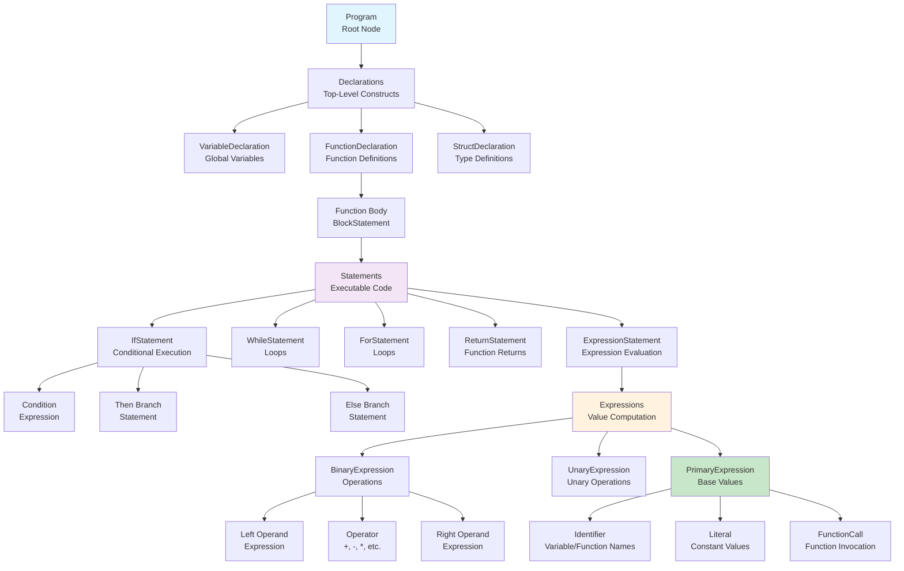

# Intermediate Representation Design

## Overview

The PPJ compiler uses an **Abstract Syntax Tree (AST)** as its primary intermediate representation. An **intermediate representation (IR)** is a data structure that represents a program in a form that is easier to analyze and transform than source code but more abstract than machine code. The AST serves as the bridge between syntax analysis and code generation, providing a structured representation of program semantics while abstracting away syntactic details.

### Why Intermediate Representation?

Intermediate representations serve several critical purposes in compiler design:

**Separation of Concerns**: The IR separates syntax analysis (which produces the IR) from semantic analysis and code generation (which consume the IR). This separation allows each phase to focus on its specific concerns without worrying about the details of other phases.

**Multiple Passes**: Semantic analysis and code generation often require multiple passes over the program. An IR makes these passes efficient by providing a structured representation that can be traversed and annotated.

**Abstraction**: The IR abstracts away syntactic details (like parentheses, semicolons, and keyword placement) while preserving semantic structure (like expression hierarchy, control flow, and data dependencies). This makes the IR easier to analyze and transform than raw source code.

**Optimization**: Many compiler optimizations are easier to perform on an IR than on source code or machine code. The IR provides a clean representation where optimizations can be applied systematically.

**Target Independence**: The same IR can be used to generate code for different target architectures. While the PPJ compiler currently targets only FRISC, the IR design allows for potential future support of other architectures.

### AST vs. Parse Tree

The AST differs from the **parse tree** (also called generative tree) produced by the parser:

**Parse Tree**: Includes every grammar production used in the derivation. For example, the expression `3 + 4` might produce a parse tree with nodes for `<izraz>`, `<izraz_pridruzivanja>`, `<log_ili_izraz>`, `<aditivni_izraz>`, `<multiplikativni_izraz>`, etc., even though many of these nodes don't add semantic value.

**AST**: Removes non-semantic nodes, keeping only nodes that represent meaningful program constructs. The expression `3 + 4` would be represented as a `BinaryExpression` node with `+` as the operator and `3` and `4` as operands, without intermediate grammar nodes.

The AST is **simpler** (fewer nodes), **more semantic** (each node represents a meaningful construct), and **easier to analyze** (no need to traverse through non-semantic intermediate nodes).

### AST Construction and Annotation

The AST is constructed during **parsing** (by the parser module) and **annotated** during **semantic analysis** (by the semantic analyzer module). This two-phase approach allows:

1. **Parsing Phase**: Build the tree structure representing program syntax
2. **Semantic Phase**: Add semantic information (types, symbol references, etc.) to the tree

The annotated AST is then used by the **code generator** to produce target code. This separation ensures that each phase can focus on its specific concerns while building on the work of previous phases.

## AST Structure

The AST is a **hierarchical tree structure** where each node represents a program construct. The tree structure mirrors the nested structure of programs: expressions contain subexpressions, statements contain expressions, functions contain statements, and programs contain functions and declarations.

### AST Hierarchy Overview

The AST follows a clear hierarchy that reflects program structure:



### AST Construction Process

The AST is constructed during parsing through a process called **syntax-directed translation**:

**Step 1: Parse Tree Construction**: The parser builds a complete parse tree showing how the input was derived from the grammar.

**Step 2: Tree Simplification**: Non-semantic nodes are removed, producing a simplified tree structure. For example, chain productions like `E → T → F → id` are simplified to just `E → id`.

**Step 3: Node Creation**: AST node objects are created for each remaining node, preserving the tree structure but using semantic node types (BinaryExpression, IfStatement, etc.) rather than grammar production names.

**Step 4: Annotation**: During semantic analysis, nodes are annotated with semantic information:
- Expression nodes are annotated with their result types
- Identifier nodes are linked to symbol table entries
- Function call nodes are linked to function symbols
- Nodes are marked as L-values or R-values where applicable

The result is an **annotated AST**—a tree structure that represents both the syntactic structure and semantic information of the program.

### Example: AST Construction

Consider the C statement:
```c
int result = x + y * 2;
```

**Parse Tree** (simplified):
```
<deklaracija>
  <ime_tipa> KR_INT
  <lista_init_deklaratora>
    <init_deklarator>
      IDN(result)
      OP_PRIDRUZI
      <izraz_pridruzivanja>
        <log_ili_izraz>
          <aditivni_izraz>
            IDN(x)
            PLUS
            <multiplikativni_izraz>
              IDN(y)
              ASTERISK
              BROJ(2)
```

**AST** (after simplification and node creation):
```
VariableDeclaration
  type: int
  name: "result"
  initializer: BinaryExpression
    operator: +
    left: Identifier("x")
    right: BinaryExpression
      operator: *
      left: Identifier("y")
      right: IntegerLiteral(2)
```

The AST is much simpler—it removes intermediate grammar nodes and focuses on semantic structure. The operator precedence is encoded in the tree structure: `y * 2` is nested inside the addition, correctly representing that multiplication has higher precedence than addition.

## AST Node Hierarchy

### Root Node: Program

The `Program` node represents the entire translation unit:

```java
public record Program(
    List<Declaration> declarations,
    int line
) implements ASTNode
```

**Contains**: All top-level declarations (functions, global variables, structs)

### Declaration Nodes

**VariableDeclaration**:
```java
public record VariableDeclaration(
    Type type,
    String name,
    Expression initializer,  // nullable
    boolean isConst,
    int line
) implements Declaration
```

**FunctionDeclaration**:
```java
public record FunctionDeclaration(
    Type returnType,
    String name,
    List<Parameter> parameters,
    BlockStatement body,
    int line
) implements Declaration
```

**StructDeclaration**:
```java
public record StructDeclaration(
    String tagName,  // nullable for anonymous structs
    List<StructField> fields,
    int line
) implements Declaration
```

### Statement Nodes

**IfStatement**:
```java
public record IfStatement(
    Expression condition,
    Statement thenBranch,
    Statement elseBranch,  // nullable
    int line
) implements Statement
```

**WhileStatement**:
```java
public record WhileStatement(
    Expression condition,
    Statement body,
    int line
) implements Statement
```

**ForStatement**:
```java
public record ForStatement(
    ExpressionStatement init,  // nullable
    Expression condition,      // nullable
    Expression increment,      // nullable
    Statement body,
    int line
) implements Statement
```

**ReturnStatement**:
```java
public record ReturnStatement(
    Expression value,  // nullable for void returns
    int line
) implements Statement
```

### Expression Nodes

**BinaryExpression**:
```java
public record BinaryExpression(
    Expression left,
    BinaryOperator operator,
    Expression right,
    int line
) implements Expression
```

**UnaryExpression**:
```java
public record UnaryExpression(
    UnaryOperator operator,
    Expression operand,
    int line
) implements Expression
```

**PrimaryExpression**:
```java
public sealed interface PrimaryExpression
    permits Identifier, Literal, FunctionCall, ArrayAccess
```

## Type System in AST

### Type Representation

Types are represented as sealed interface hierarchy:

```java
public sealed interface Type
    permits PrimitiveType, PointerType, ArrayType, StructType, FunctionType
```

**PrimitiveType**:
```java
public record PrimitiveType(
    PrimitiveKind kind  // VOID, CHAR, INT, FLOAT
) implements Type
```

**ArrayType**:
```java
public record ArrayType(
    Type elementType,
    int size  // -1 for unsized arrays
) implements Type
```

**PointerType**:
```java
public record PointerType(
    Type baseType
) implements Type
```

**StructType**:
```java
public record StructType(
    String tagName,
    List<StructField> fields
) implements Type
```

## AST Construction

### From Parse Tree

The AST is constructed during parsing:

1. **Reduce Actions**: Create AST nodes during reduce actions
2. **Node Assembly**: Combine child nodes into parent nodes
3. **Simplification**: Remove non-semantic nodes (e.g., parentheses)

### Simplification Rules

**Chain Productions**: Remove intermediate nodes:
- `E → T → F → id` becomes `E → id`

**Parentheses**: Remove parentheses nodes:
- `(E)` becomes `E`

**List Flattening**: Flatten list structures:
- `List → List Item` becomes `List → Item Item ...`

## AST Annotation

### Semantic Attributes

During semantic analysis, AST nodes are annotated with:

**Type Information**:
- Expression result types
- Variable declaration types
- Function return types

**L-value/R-value Classification**:
- Mark expressions as L-values or R-values
- Used for assignment validation

**Symbol References**:
- Link identifiers to symbol table entries
- Resolve function calls to function symbols

### Annotation Process

1. **Bottom-Up Traversal**: Synthesize types from leaves to root
2. **Top-Down Traversal**: Inherit scope information from root to leaves
3. **Symbol Resolution**: Resolve identifiers to symbol table entries

## AST Traversal

### Visitor Pattern

The AST uses visitor pattern for traversal:

```java
public interface ASTVisitor<T> {
    T visitProgram(Program node);
    T visitVariableDeclaration(VariableDeclaration node);
    T visitFunctionDeclaration(FunctionDeclaration node);
    T visitIfStatement(IfStatement node);
    T visitBinaryExpression(BinaryExpression node);
    // ...
}
```

### Traversal Strategies

**Pre-order**: Visit parent before children
- Used for symbol declaration

**Post-order**: Visit children before parent
- Used for type synthesis

**In-order**: Visit left child, parent, right child
- Used for expression evaluation

## AST to Code Generation

### Code Generation Traversal

The code generator traverses the AST:

1. **Program Node**: Generate entry point, process declarations
2. **Function Nodes**: Generate function prologue, process body, generate epilogue
3. **Statement Nodes**: Generate control flow code
4. **Expression Nodes**: Generate expression evaluation code

**See Also**: [Code Generation Documentation](../07-code-generation/instruction-selection.md)

## AST Optimization Opportunities

### Constant Folding

Fold constant expressions:
- `3 + 4` → `7`
- `true && false` → `false`

### Dead Code Elimination

Remove unreachable code:
- Code after `return` statements
- Unreachable branches in conditionals

### Common Subexpression Elimination

Reuse computed expressions:
- Store repeated subexpressions in temporaries

**See Also**: [Optimizations Documentation](../08-optimizations/basic-optimizations.md)

## Further Reading

- **[AST Structure and Walkers](ast-structure-and-walkers.md)**: Detailed AST node specifications
- **[Syntax Analysis](../04-syntax-analysis/grammar-specification.md)**: Parse tree to AST conversion
- **[Code Generation](../07-code-generation/instruction-selection.md)**: AST to assembly translation
- **[Struct Representation in IR](struct-representation-in-ir.md)**: How struct types and member access expressions are represented in the intermediate representation

---

*The AST serves as the central data structure connecting all compiler phases, providing a clean interface for semantic analysis and code generation.*
