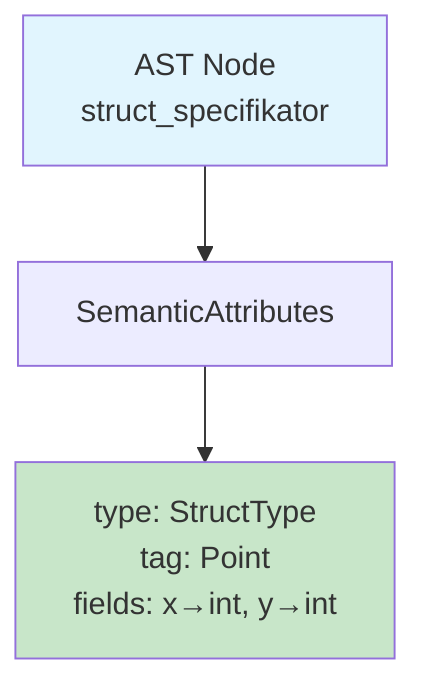
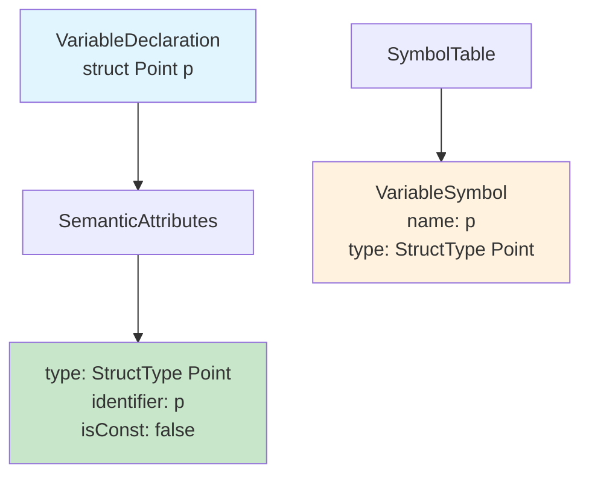
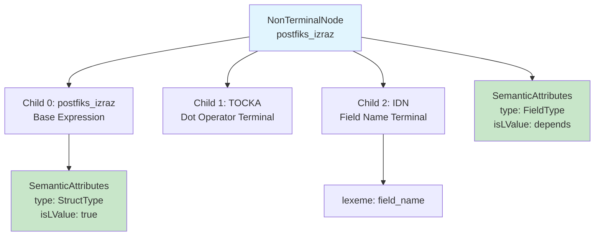
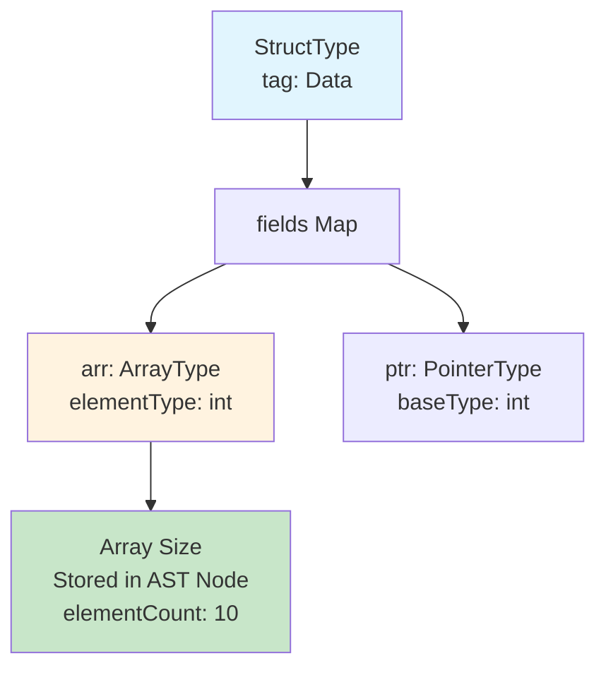
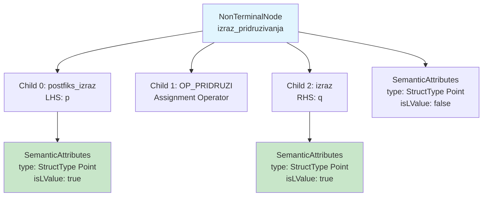

# Struct Representation in Intermediate Representation

## Overview

The PPJ compiler uses an **Abstract Syntax Tree (AST)** as its primary intermediate representation, augmented with semantic attributes from the semantic analysis phase. Struct types and struct operations are represented directly in this AST, with member access expressions decomposed into address computation operations that can be efficiently translated to FRISC assembly.

This chapter describes how struct types appear in the IR, how member access expressions are represented, and how the IR prepares struct operations for code generation.

## IR Structure for Struct Types

Struct types in the IR are represented using the same `StructType` record used during semantic analysis, preserving type information throughout the compilation pipeline.

### Type Information Preservation

The semantic analyzer annotates AST nodes with type information, including struct types:

```java
public class SemanticAttributes {
    private Type type;  // Can be StructType
    // ... other attributes
}
```

When a struct type specifier is processed, the resulting AST node is annotated with a `StructType`:



### Variable Declaration Nodes

Variables declared with struct types carry the struct type information:



## Member Access Expression Representation

Member access expressions (`struct.field`) are represented in the AST as postfix expression nodes with a specific structure that encodes both the base expression and the field name.

### AST Node Structure



### Base Expression Types

The base expression in a member access can be:

1. **Simple Variable**: `p.x` where `p` is a struct variable
2. **Nested Member Access**: `outer.inner.value` where `outer.inner` is itself a member access
3. **Array Element**: `arr[i].field` where `arr[i]` is an array element access
4. **Function Call Result**: `makePoint().x` where `makePoint()` returns a struct

Each of these base expression types is represented as a `postfiks_izraz` node, allowing recursive processing during code generation.

### Example: Nested Member Access AST

**Source Code:**
```c
struct Outer {
    struct Inner {
        int value;
    } inner;
    int data;
};

int main(void) {
    struct Outer o;
    o.inner.value = 42;
    return 0;
}
```

**AST Structure for `o.inner.value`:**
```
NonTerminalNode (postfiks_izraz)
├── attributes:
│   ├── type: PrimitiveType.INT
│   └── isLValue: true
├── children[0]: NonTerminalNode (postfiks_izraz)  // o.inner
│   ├── attributes:
│   │   ├── type: StructType("Inner", {value → int})
│   │   └── isLValue: true
│   ├── children[0]: NonTerminalNode (primarni_izraz)  // o
│   │   ├── attributes:
│   │   │   ├── type: StructType("Outer", {...})
│   │   │   └── isLValue: true
│   │   └── children[0]: TerminalNode (IDN, "o")
│   ├── children[1]: TerminalNode (TOCKA)
│   └── children[2]: TerminalNode (IDN, "inner")
├── children[1]: TerminalNode (TOCKA)
└── children[2]: TerminalNode (IDN, "value")
```

This nested structure allows the code generator to recursively process each level of member access, computing addresses incrementally.

## Address Computation Representation

While the AST preserves the syntactic structure of member access, the code generator conceptually decomposes member access into address computation operations. This decomposition is not explicitly represented in the IR but is implicit in how the code generator processes the AST.

### Conceptual Decomposition

A member access expression `base.field` is conceptually decomposed into:

1. **Base Address Computation**: Compute the address of `base`
2. **Field Offset Lookup**: Get the byte offset of `field` within the struct type
3. **Field Address Calculation**: Add field offset to base address
4. **Memory Access**: Load or store using the computed address

**Example: `p.x`**
```
1. Base address: address_of(p)
2. Field offset: offset_of(x) = 0
3. Field address: address_of(p) + 0
4. Memory access: LOAD (field_address)
```

### IR Representation of Address Computation

The IR does not explicitly represent address computation as separate nodes. Instead, the AST structure combined with semantic attributes provides all information needed:

- **Base Expression**: Provides the base address (through l-value address generation)
- **Struct Type**: Available from base expression's type attribute
- **Field Name**: Available from the IDN terminal node
- **Field Offset**: Computed during code generation using `StructFieldOffsetCalculator`

## Array Fields in Structs

Structs can contain array fields, which are represented in the IR as `ArrayType` within the struct's field map.

### Array Field Representation



**Source Code:**
```c
struct Data {
    int arr[10];
    int *ptr;
};
```

**IR Representation:**
```java
StructType dataType = new StructType("Data", Map.of(
    "arr", new ArrayType(PrimitiveType.INT),  // Size not in type
    "ptr", new PointerType(PrimitiveType.INT, false)
));
```

**Array Size Information**: The array size (10) is stored in the AST node's semantic attributes (`elementCount`), not in the `ArrayType` itself. This requires the code generator to extract array sizes from the parse tree when calculating field offsets.

### Array Element Access in Structs

Accessing array elements within structs (`p.arr[i]`) creates a nested expression structure:

```
postfiks_izraz (L_UGL_ZAGRADA)
├── postfiks_izraz (TOCKA IDN)  // p.arr
│   ├── attributes: type = ArrayType(int)
│   ├── primarni_izraz (IDN "p")
│   ├── TOCKA
│   └── IDN "arr"
├── L_UGL_ZAGRADA
├── izraz (BROJ "i")
└── D_UGL_ZAGRADA
```

The code generator processes this by:
1. Computing address of `p`
2. Adding offset of `arr` field → base address of array
3. Computing array element address: `base + i * element_size`
4. Loading/storing element value

## Struct Assignment Representation

Struct assignments (`p = q`) are represented as assignment expressions where both operands have struct types.

### Assignment Expression AST



### Assignment from Function Call

When assigning from a struct-returning function call (`p = makePoint()`), the IR represents this as:

```
izraz_pridruzivanja
├── postfiks_izraz (IDN "p")
├── OP_PRIDRUZI
└── postfiks_izraz (L_ZAGRADA ...)  // Function call
    ├── attributes: type = StructType Point
    └── children: function call structure
```

The code generator recognizes this pattern and uses an optimized calling convention with a hidden return pointer, avoiding an extra copy operation.

## Temporary Values and Address Registers

While the IR itself doesn't explicitly represent temporary values or register assignments, the code generator conceptually uses temporary values when processing struct operations:

**Conceptual IR for `o.inner.value = x + y`:**
```
1. Evaluate x + y → temp1 (register R0)
2. Compute address of o → temp2 (register R0)
3. Add offset(inner) → temp3 (register R0)
4. Add offset(value) → temp4 (register R0)
5. Store temp1 to address temp4
```

This conceptual decomposition guides the code generation process, though the actual IR preserves the original expression structure.

## IR Traversal for Struct Operations

The code generator traverses the AST using a visitor pattern, processing struct-related nodes:

### Member Access Traversal

**Algorithm:**
1. Visit base expression node recursively
2. Extract struct type from base expression attributes
3. Extract field name from IDN terminal
4. Compute field offset using struct type and field name
5. Generate address computation code
6. Generate load/store code based on context (l-value vs r-value)

### Nested Access Traversal

For nested member access (`o.inner.value`), the traversal is recursive:

1. **First Level (`o.inner`)**:
   - Visit `o` → compute address of `o`
   - Add offset of `inner` field
   - Result: address of `inner` struct

2. **Second Level (`.value`)**:
   - Base is result from first level
   - Add offset of `value` field
   - Result: address of `value` field

This recursive processing naturally handles arbitrary nesting depth.

## Summary

Struct types in the IR are represented through:

- **Type Information**: `StructType` records preserved in semantic attributes
- **Member Access AST**: Postfix expression nodes with base expression and field name
- **Nested Structures**: Recursive AST structure for nested member access
- **Array Fields**: `ArrayType` within struct fields, with sizes in AST attributes
- **Assignment Expressions**: Standard assignment nodes with struct-typed operands

The IR preserves the high-level structure while providing all information needed for code generation, including type information, field names, and structural relationships. The actual address computation and memory access operations are generated during the code generation phase, which interprets the IR structure and produces FRISC assembly code.
