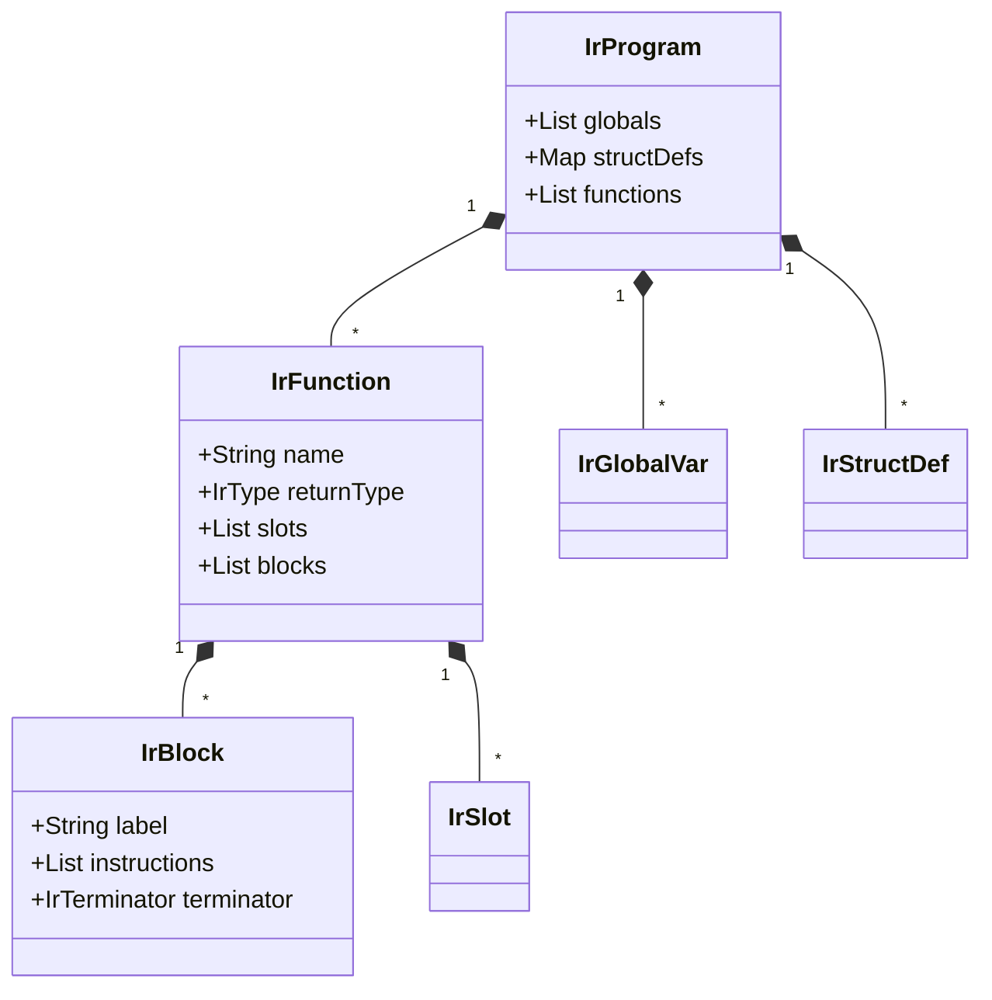
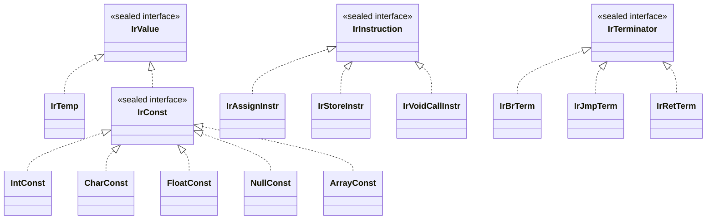
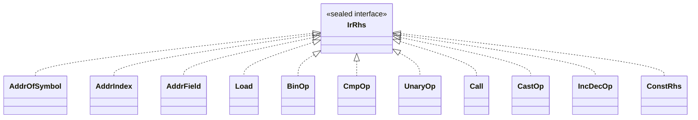
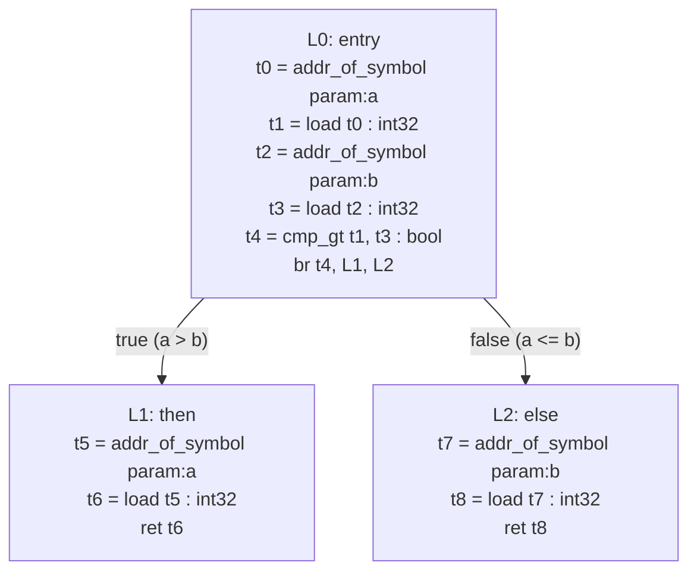
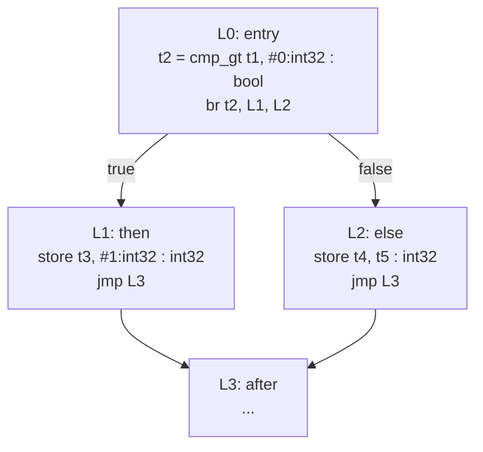
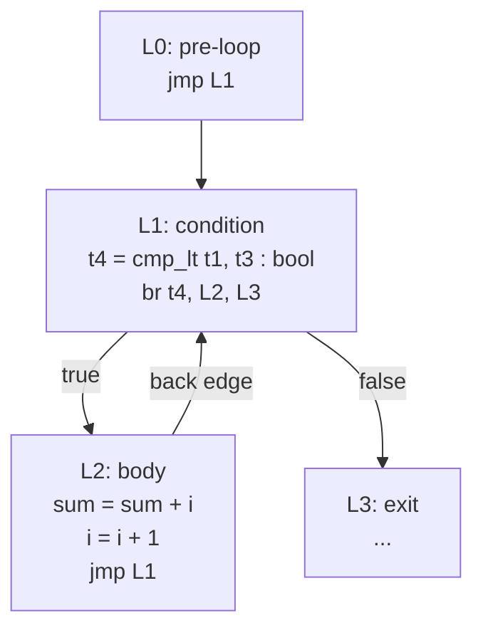
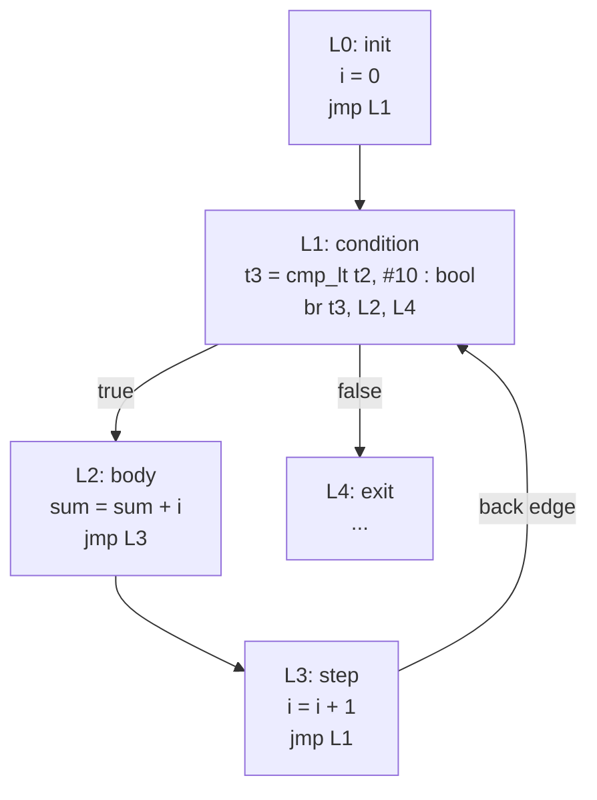

> **📖 From the book.** This chapter accompanies *Building a C-Subset Compiler for the FRISC Architecture: From Formal Languages to Executable Code* by Dr. Karlo Knežević (Zenodo, 2026). For the complete treatment — formal development, proofs, and figures — read the book: [📄 PDF](../book/Building-a-C-Subset-Compiler-for-the-FRISC-Architecture.pdf) · DOI [10.5281/zenodo.20511073](https://doi.org/10.5281/zenodo.20511073) · ISBN 978-953-47198-0-0.

## 6.1 IR Design Goals and Rationale

\index{intermediate representation}
\index{three-address code}

### 6.1.1 Why an Intermediate Representation?

A direct translation from parse tree to FRISC assembly is feasible for trivially small languages but becomes untenable once typing, structured control flow, composite data types, and optimization interact. This compiler introduces a typed IR layer that decouples four concerns:

1. **Front-end semantics** resolve meaning and type legality, producing an annotated parse tree.
2. **IR generation** encodes that meaning in a canonical, machine-oriented form where every operation carries explicit type information.
3. **Optimization** rewrites IR programs while preserving semantic equivalence.
4. **Code generation** lowers the normalized IR to FRISC assembly using a stable ABI and frame layout.

Without this layer, the backend would need to duplicate language semantics, perform ad-hoc type reasoning, and re-derive control flow structure from nested syntax -- a recipe for correctness and maintainability failures.

The IR is defined by a formal BNF grammar in `config/ir_definition.txt`. This grammar serves as the contract between the IR producer (`compiler-ir`), the optimizer (`compiler-opt`), and the backend (`compiler-codegen`). Any tool that reads or writes IR must conform to this grammar exactly.

### 6.1.2 Why Three-Address Code?

\index{three-address code!design rationale}

The FRISCcc IR uses three-address code (TAC) as its fundamental instruction format. In TAC, each instruction performs at most one operation and writes to at most one destination:

```text
t2 = add t0, t1 : int32
```

This format was chosen over several alternatives for specific engineering reasons:

**Simplicity of instruction selection.** Each TAC instruction maps to a small, predictable sequence of FRISC instructions. The backend does not need to decompose complex expression trees; the IR has already decomposed them.

**Optimization friendliness.** TAC instructions have explicit data flow: each temporary is defined once and consumed by subsequent instructions. Passes like constant folding, dead code elimination, and common subexpression elimination operate on individual instructions rather than tree patterns.

**Debuggability.** TAC is human-readable. A developer can print the IR, trace data flow through temporaries, and verify that each instruction is correct in isolation.

### 6.1.3 Why Basic Blocks?

\index{basic block}
\index{control flow graph}

Instructions are grouped into basic blocks, where each block is a maximal sequence of instructions with a single entry (the block label) and a single exit (the terminator). This structure provides two guarantees:

1. **Within a block**, instructions execute sequentially. There are no jumps into or out of the middle of a block. This makes local analysis trivial: to determine what values are available at any point in a block, one only needs to scan the preceding instructions.

2. **Between blocks**, control flow is explicit. Every block ends with a terminator (`br`, `jmp`, or `ret`) that names its successor blocks. The control-flow graph (CFG) can be constructed directly from the block terminator information, without analyzing instruction content.

### 6.1.4 Why No Phi Nodes?

\index{phi node}
\index{SSA form}

Many modern compilers use Static Single Assignment (SSA) form, where each variable is assigned exactly once and phi nodes merge values at control-flow join points. The FRISCcc IR deliberately avoids SSA form and phi nodes. The reasons are:

**Target simplicity.** FRISC is a simple, register-scarce architecture. The overhead of constructing and deconstructing SSA form (SSA construction, phi elimination, register allocation with interference graphs) exceeds the benefit for this target.

**Memory-based variable model.** The IR uses explicit `addr_of_symbol` + `load`/`store` sequences for all variable access. Variables live in memory (the stack frame), and the IR makes this explicit. This is closer to the eventual FRISC code, where all locals are stack-allocated.

**No cross-block temporaries.** Temporaries in the FRISCcc IR are defined and consumed within the same basic block. When a value must flow across a block boundary, it is stored to a named variable (a slot in the frame) and reloaded in the target block. This eliminates the need for phi nodes entirely.

**Optimization sufficiency.** The optimizations performed by this compiler (constant folding, constant propagation, dead code elimination, peephole optimizations) operate effectively on the memory-based model. More aggressive optimizations that benefit from SSA (global value numbering, partial redundancy elimination) are beyond the scope of this project.

### 6.1.5 Comparison with Alternative IR Designs

| IR Design | Example | Advantages | Disadvantages | FRISCcc Choice |
|-----------|---------|------------|---------------|----------------|
| Three-address code | `t2 = add t0, t1 : int32` | Simple, explicit data flow | More instructions than tree IR | **Selected** |
| SSA form | `x.2 = phi(x.0, x.1)` | Enables powerful optimizations | Complex construction/destruction | Not used |
| Stack-based IR | `push a; push b; add` | Compact representation | Difficult to optimize | Not used |
| Tree-based IR | `Add(Load(a), Load(b))` | Natural for instruction selection | Difficult for CFG analysis | Not used |

The three-address code with basic blocks and no phi nodes represents a pragmatic middle ground: it is expressive enough to represent all C language constructs, simple enough to implement correctly, and structured enough to enable meaningful optimizations.

### 6.1.6 Design Principle: Explicit Over Implicit

A recurring theme in the IR design is preferring explicit representation over implicit conventions:

- **Explicit types**: Every instruction carries a type annotation. The IR never infers types from context.
- **Explicit addresses**: Variable access requires explicit `addr_of_symbol` instructions. There are no implicit "register variables."
- **Explicit conversions**: All type conversions emit cast instructions (`sext`, `zext`, `trunc`, etc.). No implicit widening or narrowing.
- **Explicit control flow**: All branches name their target blocks. There is no fall-through between blocks.

This verbosity increases IR size but dramatically simplifies every consumer of the IR: the optimizer, the verifier, and the code generator each work with self-describing instructions.

## 6.2 IR Type System

### 6.2.1 Design Principle: No Implicit Conversions

\index{type system!IR}

Every value in the IR carries an explicit type. Where source-level semantics permit implicit conversion (e.g., `char` to `int`), the IR emits an explicit cast instruction. This prevents hidden value reinterpretation and makes the behavior of each instruction locally verifiable without consulting language-level rules.

### 6.2.2 Complete IR Type Table

| IR type | Syntax | Size (bytes) | Description |
|---------|--------|--------------|-------------|
| Void | `void` | 0 | Function return type only; no value |
| 32-bit integer | `int32` | 4 | Signed two's complement |
| Character | `char` | 1 | Signed 8-bit integer |
| Unsigned character | `uchar` | 1 | Unsigned 8-bit integer |
| Float | `float` | 4 | Semantic float; Q16.16 fixed-point in FRISC backend |
| Boolean | `bool` | 1 | Result of comparison operations |
| Pointer | `ptr<T>` | 4 | Typed pointer to any type T |
| Array | `array<T,N>` | N * sizeof(T) | Fixed-size array of N elements of type T |
| Struct | `struct Name` | Sum of fields | Named aggregate with explicit field offsets |

The type grammar is:

```bnf
Type ::= "void"
      |  "int32" | "char" | "uchar" | "float" | "bool"
      |  "ptr" "<" Type ">"
      |  "array" "<" Type "," Int ">"
      |  "struct" Ident ;
```

Types are parametric in two cases: `ptr<T>` is parameterized by its base type, and `array<T,N>` is parameterized by element type and count. Struct types are nominal, identified by name rather than structure.

### 6.2.3 Integer Semantics

\index{integer!semantics}

`int32` operations use 32-bit two's complement arithmetic. Overflow wraps silently (no trap). The `char` type is an 8-bit signed value; `uchar` is its unsigned counterpart. When `char` values participate in wider operations, explicit `sext` (sign-extend) or `zext` (zero-extend) casts widen them to `int32`.

### 6.2.4 Float Semantics

\index{float!Q16.16 fixed-point}

The IR uses `float` as a semantic type, meaning "this value represents a floating-point number." In the FRISC backend, `float` values are represented as Q16.16 fixed-point integers, with arithmetic implemented through helper function calls. This preserves deterministic arithmetic on an integer-only target architecture. The IR itself is agnostic to this representation choice; it treats `float` as an opaque numeric type with standard arithmetic operations.

### 6.2.5 Boolean Semantics

\index{boolean!type}

The `bool` type exists exclusively as the result type of comparison operations (`cmp_eq`, `cmp_ne`, `cmp_lt`, `cmp_le`, `cmp_gt`, `cmp_ge`). Boolean values are consumed by `br` (conditional branch) terminators. There are no boolean constants in the IR; comparisons are the sole producers of `bool` values.

## 6.3 IR Program Structure

The canonical structure of an IR program is:

```text
.program
  .globals
    global varName : type [= const]
    ...
  .type struct StructName {
    field1 : type @offset
    ...
  }
  .func funcName(param1:type, ...):returnType
    .frame locals=N bytes align=M
    .slots
      param p@offset : type
      local v@offset : type
      ...
    .blocks
      L0:
        instructions...
        terminator
      L1:
        instructions...
        terminator
  .endfunc
.endprogram
```

### 6.3.1 Program Envelope

`.program` and `.endprogram` delimit the compilation unit, making IR file parsing deterministic and enabling simple validation that the file is complete.

### 6.3.2 Global Declarations

The `.globals` section declares global variables with their types and optional initializers:

```text
.globals
  global counter : int32 = #0:int32
  global name : array<char,20>
  global root : ptr<struct Node> = null:ptr<struct Node>
```

Global variables are typed and eventually become labeled data regions in FRISC assembly. Array globals receive their full `array<T,N>` type, enabling the backend to allocate the correct number of bytes. Pointer globals can be initialized to `null` with a typed null constant.

### 6.3.3 Struct Type Definitions

\index{struct!IR representation}

The `.type struct` directive declares struct layout with explicit field byte offsets:

```text
.type struct Point {
  x : int32 @0
  y : int32 @4
}

.type struct Node {
  value : int32 @0
  next : ptr<struct Node> @4
}
```

Each field carries a name, a type, and a byte offset from the start of the struct. The offsets are computed during IR generation based on field sizes and alignment requirements. By embedding offsets directly in the IR, the backend does not need to recompute struct layout or guess about padding.

### 6.3.4 Function Definitions

Each function definition contains a signature, frame metadata, slot declarations, and a control-flow graph of basic blocks.

## 6.4 Frame and Slot Model

### 6.4.1 Frame Declaration

\index{stack frame!IR model}

The `.frame` directive specifies the total local frame size in bytes and the required alignment:

```text
.frame locals=16 bytes align=4
```

This metadata is consumed directly by the backend's prologue/epilogue generator. The `locals` value determines how much the stack pointer is decremented on function entry.

### 6.4.2 Slot Table

The `.slots` section declares all addressable storage locations within the function frame:

```text
.slots
  param a@0 : int32
  param b@4 : int32
  local result@0 : int32
  local tmp@4 : float
```

Each slot has a *kind* (`param`, `local`, or `spill`), a name, a byte offset within its zone, and a type. The offset is relative to the start of the respective zone, not absolute from the frame pointer.

### 6.4.3 FRISC Frame Layout

The ABI mapping used in this project places the frame pointer (FP) at the boundary between saved registers and local storage:

```text
Higher addresses
  +---------------------------+
  | param@0       (FP + 8)    |  First parameter
  | param@4       (FP + 12)   |  Second parameter
  | ...                       |
  +---------------------------+
  | return address (FP + 4)   |
  +---------------------------+
  | saved FP       (FP + 0)   |  Frame pointer points here
  +---------------------------+
  | local@0       (FP - 4)    |  First local variable
  | local@4       (FP - 8)    |  Second local variable
  | ...                       |
  +---------------------------+
Lower addresses
```

The addressing formulas are:

$$
\text{addr}(\text{param}@k) = \text{FP} + 8 + k
$$

$$
\text{addr}(\text{local}@k) = \text{FP} - 4 - k
$$

FP remains fixed throughout function execution, so these formulas hold regardless of stack pointer movement caused by pushing temporaries or calling other functions.

### 6.4.4 Temporaries

\index{temporary!IR}

Computed values are assigned to named temporaries `t0`, `t1`, `t2`, ... Temporaries are virtual -- they do not occupy `.slots` entries and have no stack addresses. They represent values consumed by subsequent instructions within the same basic block. Cross-block temporary usage is prohibited; when a value must survive a block boundary, it is stored to a named slot and reloaded in the target block. The backend maps temporaries to registers or temporary stack locations during code generation.

## 6.5 Instruction Reference

IR instructions fall into three categories: assignments (which bind a value to a temporary), stores (which write a value to memory), and void calls (which invoke a function without capturing a return value).

### 6.5.1 Assignment Instructions

Syntax: `Temp "=" Rhs`

The right-hand side (`Rhs`) can be any of the following:

#### Address Construction

| Instruction | Syntax | Semantics |
|------------|--------|-----------|
| `addr_of_symbol` | `addr_of_symbol (local:\|param:\|global:)name` | Computes the address of a named storage location |
| `addr_index` | `addr_index base, index, elemSize` | Computes `base + index * elemSize` for array element access |
| `addr_field` | `addr_field base, StructName.fieldName` | Computes `base + field_offset` for struct field access |

`addr_of_symbol` takes a symbol reference that specifies the storage kind (`local:`, `param:`, or `global:`) and the symbol name. The result is a pointer to the symbol's storage location.

`addr_index` takes a base address (the start of the array), an index value, and the element size in bytes. The explicit element size makes address scaling auditable -- the backend does not need to infer element sizes from types.

`addr_field` takes a base address (the start of the struct) and a qualified field reference (`StructName.fieldName`). The field's byte offset is looked up from the struct type definition and added to the base address.

#### Memory Access

| Instruction | Syntax | Semantics |
|------------|--------|-----------|
| `load` | `load addr : type` | Reads a typed value from the address |

Load reads a value from memory at the given address. The type annotation specifies both the width of the read (1 byte for `char`, 4 bytes for `int32`) and the type of the resulting value.

#### Arithmetic and Bitwise Operations

| Instruction | Syntax | Semantics |
|------------|--------|-----------|
| `add` | `add v1, v2 : type` | Addition |
| `sub` | `sub v1, v2 : type` | Subtraction |
| `mul` | `mul v1, v2 : type` | Multiplication |
| `div` | `div v1, v2 : type` | Division |
| `mod` | `mod v1, v2 : type` | Remainder |
| `and` | `and v1, v2 : type` | Bitwise AND |
| `or` | `or v1, v2 : type` | Bitwise OR |
| `xor` | `xor v1, v2 : type` | Bitwise XOR |
| `shl` | `shl v1, v2 : type` | Left shift |
| `shr` | `shr v1, v2 : type` | Arithmetic right shift |

All binary operations are typed. Both operands and the result share the same type. The type is explicit in the instruction, eliminating ambiguity about operation width and signedness.

#### Comparison Operations

| Instruction | Syntax | Semantics |
|------------|--------|-----------|
| `cmp_eq` | `cmp_eq v1, v2 : bool` | Equal |
| `cmp_ne` | `cmp_ne v1, v2 : bool` | Not equal |
| `cmp_lt` | `cmp_lt v1, v2 : bool` | Less than |
| `cmp_le` | `cmp_le v1, v2 : bool` | Less than or equal |
| `cmp_gt` | `cmp_gt v1, v2 : bool` | Greater than |
| `cmp_ge` | `cmp_ge v1, v2 : bool` | Greater than or equal |

Comparisons always produce a `bool` result. The operands are typed implicitly by the values they reference (both must be the same type). The result is consumed by `br` terminators.

#### Unary Operations

| Instruction | Syntax | Semantics |
|------------|--------|-----------|
| `neg` | `neg v : type` | Arithmetic negation |
| `not` | `not v : type` | Logical NOT |
| `bitnot` | `bitnot v : type` | Bitwise complement |

#### Increment and Decrement

| Instruction | Syntax | Semantics |
|------------|--------|-----------|
| `preinc` | `preinc v : type` | Pre-increment (returns new value) |
| `postinc` | `postinc v : type` | Post-increment (returns old value) |
| `predec` | `predec v : type` | Pre-decrement (returns new value) |
| `postdec` | `postdec v : type` | Post-decrement (returns old value) |

These are value-producing forms. In practice, the IR lowering for `i++` generates a load of the current value, a store of the incremented value back to the variable, and yields either the old or new value depending on pre/post semantics.

#### Cast Operations

| Instruction | Syntax | Semantics |
|------------|--------|-----------|
| `trunc` | `trunc v : type` | Truncate to narrower integer (e.g., int32 to char) |
| `sext` | `sext v : type` | Sign-extend to wider integer (e.g., char to int32) |
| `zext` | `zext v : type` | Zero-extend to wider integer (e.g., uchar to int32) |
| `ptrcast` | `ptrcast v : type` | Reinterpret pointer base type |
| `itof` | `itof v : type` | Integer to float conversion |
| `ftoi` | `ftoi v : type` | Float to integer conversion |

Cast instructions make every type conversion explicit and auditable. The result type is the target of the conversion.

#### Function Calls (Value-Returning)

```text
call func:name(arg1, arg2, ...) : returnType
```

Calls a function and produces a value of the declared return type. Arguments are `Value` references (temporaries or constants).

#### Constants

Constants appear as RHS values with explicit types:

```text
#42:int32          -- integer constant
#'A':char          -- character constant
#3.14:float        -- float constant
null:ptr<int32>    -- typed null pointer
{#1:int32, #2:int32, #3:int32} : array<int32,3>  -- array constant
```

### 6.5.2 Store Instructions

```text
store addr, value : valueType
```

Writes `value` to the memory location at `addr`. The type annotation specifies the width and type of the store.

### 6.5.3 Void Call Instructions

```text
call func:name(arg1, arg2, ...) : void
```

Invokes a function that returns void. No temporary is assigned.

## 6.6 Terminators

\index{terminator}

Every basic block ends with exactly one terminator. No instructions may follow a terminator within the same block.

| Terminator | Syntax | Semantics |
|-----------|--------|-----------|
| Conditional branch | `br cond, trueLabel, falseLabel` | Jump to `trueLabel` if `cond` is true, `falseLabel` otherwise |
| Unconditional jump | `jmp label` | Jump to `label` unconditionally |
| Return | `ret [value]` | Return from function, optionally with a value |

The `br` terminator consumes a `bool` value (produced by a comparison). The two-target form ensures that every branch has an explicit taken and not-taken path, which simplifies CFG construction.

## 6.7 Control-Flow Graph Model

\index{control flow graph!model}

Every function's `.blocks` section defines a directed graph where basic blocks are nodes and edges originate from terminators.

```text
L0: entry ------> L1: loop_cond
                    |         |
                (true)     (false)
                    |         |
                    v         v
              L2: loop_body  L3: after_loop
                    |
                    v
                L1: loop_cond  (back edge)
```

Properties guaranteed by the IR:

- Every block has exactly one terminator as its last instruction.
- Every label referenced by a `br` or `jmp` must be defined in the same function.
- The first block in the `.blocks` section is the entry point.
- Blocks not reachable from the entry point may be present but are candidates for dead code elimination.

## 6.8 IR Node Class Hierarchy

\index{IR!class hierarchy}

The IR is implemented in Java using sealed interfaces and records, providing exhaustive pattern matching and immutability guarantees. The following class diagram shows the complete hierarchy:







Key architectural properties of this hierarchy:

- **Sealed interfaces** (`IrValue`, `IrInstruction`, `IrTerminator`, `IrRhs`, `IrConst`) ensure exhaustive pattern matching. The compiler verifies that every `switch` on these types handles all cases.
- **Records** provide immutability, structural equality, and automatic `toString()`.
- **Builder pattern** on `IrProgram`, `IrFunction`, and `IrBlock` enables incremental construction during AST-to-IR lowering.
- **`IrValue`** is the sealed parent of `IrTemp` and `IrConst` only. Symbol references (`IrSymbolRef`) are not values; they appear exclusively inside `AddrOfSymbol`.

## 6.9 Source-to-AST-to-IR Walkthrough: `max` Function

\index{IR!walkthrough}

This section provides a complete, step-by-step walkthrough of how a C function is translated through the compiler pipeline: from source code, to the abstract syntax tree (AST), to the final IR output.

### 6.9.1 Source Code

Consider the following simple function that returns the larger of two integers:

```c
int max(int a, int b) {
    if (a > b) {
        return a;
    }
    return b;
}
```

This function exercises several IR generation features: function parameters, comparison, conditional branching, variable access, and return.

### 6.9.2 Abstract Syntax Tree

The parser produces an annotated parse tree. The relevant portion, simplified for presentation, has the following structure:

```text
<definicija_funkcije>
  int
  <izravni_deklarator>
    IDN "max"
    L_ZAGRADA
    <lista_parametara>
      <deklaracija_parametra>
        int
        IDN "a"
      <deklaracija_parametra>
        int
        IDN "b"
    D_ZAGRADA
  <slozena_naredba>
    L_VIT_ZAGRADA
    <lista_naredbi>
      <naredba>
        <naredba_grananja>            ; if statement
          KR_IF
          L_ZAGRADA
          <odnosni_izraz>             ; a > b
            <primarni_izraz> IDN "a"
            OP_GT
            <primarni_izraz> IDN "b"
          D_ZAGRADA
          <naredba>
            <slozena_naredba>
              <lista_naredbi>
                <naredba>
                  <naredba_skoka>     ; return a
                    KR_RETURN
                    <primarni_izraz> IDN "a"
      <naredba>
        <naredba_skoka>               ; return b
          KR_RETURN
          <primarni_izraz> IDN "b"
    D_VIT_ZAGRADA
```

Semantic analysis annotates each node with type information. The `<odnosni_izraz>` node is annotated with type `int` (the result of the comparison in C is `int`, but the IR will produce `bool`). The function return type is `int`.

### 6.9.3 IR Generation Steps

The `FunctionGenerator` processes this AST through the following steps:

1. **Extract function name**: `max`
2. **Look up symbol**: Finds `FunctionSymbol("max", (int, int) -> int)` in the global scope.
3. **Create IrFunctionBuilder**: `IrFunctionBuilder("max", int32)`
4. **Add parameters**: `a:int32`, `b:int32`
5. **Generate parameter slots**: `param a@0 : int32`, `param b@4 : int32` via `FrameLayoutGenerator`
6. **Generate body**: Delegates to `StatementGenerator` which processes the compound statement.
7. **If statement**: `IfStatementGenerator` creates labels `L1` (then), `L2` (else), and potentially `L3` (after).
8. **Condition**: `ComparisonExpressionGenerator` emits the `a > b` comparison.
9. **Return statements**: `JumpStatementGenerator` emits `ret` terminators.

### 6.9.4 Complete IR Output

```ir
.func max(a:int32, b:int32):int32
  .frame locals=0 bytes align=4
  .slots
    param a@0 : int32
    param b@4 : int32
  .blocks
  L0:
    ; Load a and b for comparison
    t0 = addr_of_symbol param:a
    t1 = load t0 : int32
    t2 = addr_of_symbol param:b
    t3 = load t2 : int32
    ; Compare a > b
    t4 = cmp_gt t1, t3 : bool
    ; Branch on result
    br t4, L1, L2
  L1:
    ; return a
    t5 = addr_of_symbol param:a
    t6 = load t5 : int32
    ret t6
  L2:
    ; return b
    t7 = addr_of_symbol param:b
    t8 = load t7 : int32
    ret t8
.endfunc
```

### 6.9.5 Control Flow Graph



### 6.9.6 Observations

1. **No local variables.** The function has no local declarations, so `.frame locals=0` and the slot table contains only parameters.
2. **Redundant loads.** Parameters `a` and `b` are loaded twice: once for the comparison in L0, and once for the return in L1/L2. The optimizer can eliminate these redundant loads.
3. **No fall-through.** Both L1 and L2 terminate with `ret`, so no `afterLabel` block is needed. The `IfStatementGenerator` detects this and omits the join block.
4. **Two-target branch.** The `br` in L0 explicitly names both targets. There is no implicit "else falls through" convention.

## 6.10 Complete C-to-IR Translation Walkthrough: `sum_array`

\index{IR!array walkthrough}

Consider a more complex function that exercises loops and array access:

```c
int sum_array(int *arr, int n) {
    int total = 0;
    int i = 0;
    while (i < n) {
        total = total + arr[i];
        i = i + 1;
    }
    return total;
}
```

The IR translation proceeds as follows:

```ir
.func sum_array(arr:ptr<int32>, n:int32):int32
  .frame locals=8 bytes align=4
  .slots
    param arr@0 : ptr<int32>
    param n@4 : int32
    local total@0 : int32
    local i@4 : int32
  .blocks
  L0:
    ; total = 0
    t0 = addr_of_symbol local:total
    store t0, #0:int32 : int32
    ; i = 0
    t1 = addr_of_symbol local:i
    store t1, #0:int32 : int32
    jmp L1
  L1:
    ; while (i < n)
    t2 = addr_of_symbol local:i
    t3 = load t2 : int32
    t4 = addr_of_symbol param:n
    t5 = load t4 : int32
    t6 = cmp_lt t3, t5 : bool
    br t6, L2, L3
  L2:
    ; total = total + arr[i]
    t7 = addr_of_symbol local:total
    t8 = load t7 : int32
    t9 = addr_of_symbol param:arr
    t10 = load t9 : ptr<int32>
    t11 = addr_of_symbol local:i
    t12 = load t11 : int32
    t13 = addr_index t10, t12, 4
    t14 = load t13 : int32
    t15 = add t8, t14 : int32
    t16 = addr_of_symbol local:total
    store t16, t15 : int32
    ; i = i + 1
    t17 = addr_of_symbol local:i
    t18 = load t17 : int32
    t19 = add t18, #1:int32 : int32
    t20 = addr_of_symbol local:i
    store t20, t19 : int32
    jmp L1
  L3:
    ; return total
    t21 = addr_of_symbol local:total
    t22 = load t21 : int32
    ret t22
.endfunc
```

Key observations about this translation:

1. **Variable access pattern**: Every variable access follows the sequence `addr_of_symbol` then `load` (for reading) or `addr_of_symbol` then `store` (for writing). This uniformity makes optimization passes straightforward.

2. **Array indexing**: `arr[i]` is translated to `addr_index t10, t12, 4` where `4` is the byte size of `int32`. The array base address is loaded from the pointer parameter, the index is loaded from the local variable, and `addr_index` computes the element address.

3. **Loop structure**: The `while` loop translates to three blocks: `L1` (condition check with `br`), `L2` (body ending with `jmp L1` for the back edge), and `L3` (exit point). The condition block is the single entry to both the body and the exit.

4. **Explicit typing everywhere**: Every `load`, `store`, arithmetic operation, and comparison carries a type annotation. Nothing is inferred; the IR is self-describing.

## 6.11 IR Generation Patterns for Each C Construct

\index{IR!generation patterns}

This section catalogs the IR generation pattern for every major C language construct. Each pattern shows the C source fragment, the generated IR, and a brief explanation of the translation logic.

### 6.11.1 Variable Declaration and Assignment

\index{variable!declaration}

**Source:**
```c
int x = 5;
```

**IR (within a function body):**
```ir
  ; x is allocated as local x@0 : int32 in the .slots section
  ; Initialization: x = 5
  t0 = addr_of_symbol local:x
  store t0, #5:int32 : int32
```

**Explanation:** The `LocalDeclarationGenerator` allocates a slot for `x` in the frame. The `LocalInitializerGenerator` emits an `addr_of_symbol` to compute the address of the slot, followed by a `store` of the constant value. If the initializer were a complex expression instead of a literal, the expression would be evaluated first, producing a temporary, and that temporary would be stored.

**Reading a variable:**
```c
y = x;
```

```ir
  ; Read x
  t0 = addr_of_symbol local:x
  t1 = load t0 : int32
  ; Write to y
  t2 = addr_of_symbol local:y
  store t2, t1 : int32
```

### 6.11.2 Binary Expressions

\index{binary expression!IR generation}

**Source:**
```c
a + b * c
```

**IR:**
```ir
  ; Load b
  t0 = addr_of_symbol local:b
  t1 = load t0 : int32
  ; Load c
  t2 = addr_of_symbol local:c
  t3 = load t2 : int32
  ; b * c  (multiplication has higher precedence, evaluated first)
  t4 = mul t1, t3 : int32
  ; Load a
  t5 = addr_of_symbol local:a
  t6 = load t5 : int32
  ; a + (b * c)
  t7 = add t6, t4 : int32
```

**Explanation:** The `BinaryExpressionGenerator` respects operator precedence as established by the parser. The parse tree encodes `a + (b * c)`, with multiplication as a child of addition. The IR generator evaluates children before parents, producing the multiplication first, then the addition.

### 6.11.3 If-Else Statement

\index{if-else!IR pattern}

**Source:**
```c
if (x > 0) {
    result = 1;
} else {
    result = -1;
}
```

**IR:**
```ir
  ; Evaluate condition: x > 0
  t0 = addr_of_symbol local:x
  t1 = load t0 : int32
  t2 = cmp_gt t1, #0:int32 : bool
  br t2, L1, L2
L1:
  ; then: result = 1
  t3 = addr_of_symbol local:result
  store t3, #1:int32 : int32
  jmp L3
L2:
  ; else: result = -1
  t4 = addr_of_symbol local:result
  t5 = neg #1:int32 : int32
  store t4, t5 : int32
  jmp L3
L3:
  ; continuation after if-else
```

**Control Flow Graph:**



**Explanation:** The `IfStatementGenerator` creates three labels: `L1` (then), `L2` (else), and `L3` (after/join). The condition is evaluated and a `br` selects the correct branch. Both branches end with `jmp L3` to rejoin control flow. If a branch terminates with `ret`, the `jmp` to `L3` is omitted, and if both branches terminate, the `L3` block may be omitted entirely.

### 6.11.4 While Loop

\index{while loop!IR pattern}

**Source:**
```c
while (i < n) {
    sum = sum + i;
    i = i + 1;
}
```

**IR:**
```ir
  jmp L1
L1:
  ; condition: i < n
  t0 = addr_of_symbol local:i
  t1 = load t0 : int32
  t2 = addr_of_symbol local:n
  t3 = load t2 : int32
  t4 = cmp_lt t1, t3 : bool
  br t4, L2, L3
L2:
  ; body: sum = sum + i
  t5 = addr_of_symbol local:sum
  t6 = load t5 : int32
  t7 = addr_of_symbol local:i
  t8 = load t7 : int32
  t9 = add t6, t8 : int32
  t10 = addr_of_symbol local:sum
  store t10, t9 : int32
  ; i = i + 1
  t11 = addr_of_symbol local:i
  t12 = load t11 : int32
  t13 = add t12, #1:int32 : int32
  t14 = addr_of_symbol local:i
  store t14, t13 : int32
  ; back edge
  jmp L1
L3:
  ; loop exit
```

**Control Flow Graph:**



**Explanation:** The `LoopStatementGenerator.generateWhileLoop()` creates three blocks:
- `L1` (condLabel): Evaluates the condition and branches.
- `L2` (bodyLabel): Executes the loop body and jumps back to the condition.
- `L3` (afterLabel): The loop exit point.

The entry block (`L0`) ends with `jmp L1` to transfer control to the condition check. The `LoopContext` records `afterLabel` and `condLabel` for `break` and `continue` statements.

### 6.11.5 For Loop

\index{for loop!IR pattern}

**Source:**
```c
for (i = 0; i < 10; i = i + 1) {
    sum = sum + i;
}
```

**IR:**
```ir
  ; init: i = 0
  t0 = addr_of_symbol local:i
  store t0, #0:int32 : int32
  jmp L1
L1:
  ; condition: i < 10
  t1 = addr_of_symbol local:i
  t2 = load t1 : int32
  t3 = cmp_lt t2, #10:int32 : bool
  br t3, L2, L4
L2:
  ; body: sum = sum + i
  t4 = addr_of_symbol local:sum
  t5 = load t4 : int32
  t6 = addr_of_symbol local:i
  t7 = load t6 : int32
  t8 = add t5, t7 : int32
  t9 = addr_of_symbol local:sum
  store t9, t8 : int32
  jmp L3
L3:
  ; step: i = i + 1
  t10 = addr_of_symbol local:i
  t11 = load t10 : int32
  t12 = add t11, #1:int32 : int32
  t13 = addr_of_symbol local:i
  store t13, t12 : int32
  jmp L1
L4:
  ; loop exit
```

**Control Flow Graph:**



**Explanation:** The `LoopStatementGenerator.generateForLoop()` creates four blocks:
- Init code in the current block, followed by `jmp L1`.
- `L1` (condLabel): Condition check.
- `L2` (bodyLabel): Loop body, jumps to the step block.
- `L3` (stepLabel): Executes the step expression, jumps back to condition.
- `L4` (afterLabel): Loop exit.

The step block is separated from the body so that `continue` statements can jump directly to `L3` (the step), not `L1` (the condition). The `LoopContext` records `afterLabel` for `break` and `stepLabel` for `continue`.

### 6.11.6 Function Call

\index{function call!IR pattern}

**Source:**
```c
result = foo(x, y);
```

**IR:**
```ir
  ; Load arguments
  t0 = addr_of_symbol local:x
  t1 = load t0 : int32
  t2 = addr_of_symbol local:y
  t3 = load t2 : int32
  ; Call the function
  t4 = call func:foo(t1, t3) : int32
  ; Store result
  t5 = addr_of_symbol local:result
  store t5, t4 : int32
```

**Void function call (no return value captured):**
```c
print_int(x);
```

```ir
  t0 = addr_of_symbol local:x
  t1 = load t0 : int32
  call func:print_int(t1) : void
```

**Explanation:** The `PostfixExpressionGenerator` handles function call syntax. Arguments are evaluated left-to-right, each producing a value (temporary or constant). The `Call` RHS (for value-returning calls) or `IrVoidCallInstr` (for void calls) is emitted. The `func:` prefix in the IR text disambiguates function names from variable names.

### 6.11.7 Struct Field Access

\index{struct!field access IR}

**Source:**
```c
point.x = 10;
int val = point.y;
```

**IR (assuming `struct Point { int x; int y; }` with `x` at offset 0, `y` at offset 4):**
```ir
  ; point.x = 10
  t0 = addr_of_symbol local:point
  t1 = addr_field t0, Point.x           ; base + 0
  store t1, #10:int32 : int32

  ; int val = point.y
  t2 = addr_of_symbol local:point
  t3 = addr_field t2, Point.y           ; base + 4
  t4 = load t3 : int32
  t5 = addr_of_symbol local:val
  store t5, t4 : int32
```

**Pointer-to-struct access (`->`):**
```c
node->next = NULL;
```

```ir
  ; Load pointer value
  t0 = addr_of_symbol local:node
  t1 = load t0 : ptr<struct Node>
  ; Compute field address within pointed-to struct
  t2 = addr_field t1, Node.next         ; pointer_value + 4
  ; Store null
  store t2, null:ptr<struct Node> : ptr<struct Node>
```

**Explanation:** For direct struct access (`point.x`), `addr_of_symbol` produces the struct's base address, and `addr_field` adds the field offset. For pointer-to-struct access (`node->next`), the pointer is first loaded from its variable, then `addr_field` computes the field address within the pointed-to struct. The `LValuePostfixHandler` in the IR generator handles both cases.

### 6.11.8 Array Element Access

\index{array!element access IR}

**Source:**
```c
arr[i] = val;
int x = arr[3];
```

**IR (assuming `arr` is `array<int32,10>`):**
```ir
  ; arr[i] = val
  t0 = addr_of_symbol local:arr         ; base address of array
  t1 = addr_of_symbol local:i
  t2 = load t1 : int32                  ; index value
  t3 = addr_index t0, t2, 4             ; element address = base + i * 4
  t4 = addr_of_symbol local:val
  t5 = load t4 : int32
  store t3, t5 : int32

  ; int x = arr[3]
  t6 = addr_of_symbol local:arr
  t7 = addr_index t6, #3:int32, 4       ; base + 3 * 4
  t8 = load t7 : int32
  t9 = addr_of_symbol local:x
  store t9, t8 : int32
```

The third argument to `addr_index` is the element size in bytes. This is always provided explicitly, not inferred from the type of the base pointer. For `char` arrays the element size is 1; for arrays of structs it is the struct size; for arrays of pointers it is 4.

### 6.11.9 Pointer Operations

\index{pointer!dereference IR}

**Pointer dereference write:**
```c
*p = 42;
```

```ir
  ; Load the pointer value
  t0 = addr_of_symbol local:p
  t1 = load t0 : ptr<int32>
  ; Write through the pointer
  store t1, #42:int32 : int32
```

**Pointer dereference read:**
```c
int x = *p;
```

```ir
  ; Load the pointer value
  t0 = addr_of_symbol local:p
  t1 = load t0 : ptr<int32>
  ; Read through the pointer
  t2 = load t1 : int32
  ; Store to x
  t3 = addr_of_symbol local:x
  store t3, t2 : int32
```

**Address-of operator:**
```c
int *p = &x;
```

```ir
  ; Compute address of x (this IS the pointer value)
  t0 = addr_of_symbol local:x
  ; Store the address into p
  t1 = addr_of_symbol local:p
  store t1, t0 : ptr<int32>
```

**Explanation:** Pointer dereference (`*p`) is handled by the `LValueGenerator.emitUnary()` method. For an l-value dereference (the left side of an assignment), the pointer value itself is the address. For an r-value dereference, the pointer is loaded and then a second `load` reads the pointed-to value. The address-of operator (`&x`) simply uses the result of `addr_of_symbol` as the value, without issuing a `load`.

### 6.11.10 Type Casts

\index{cast!IR pattern}

**Source:**
```c
char c = 'A';
int i = (int)c;         // char to int: sign-extend
char d = (char)i;       // int to char: truncate
float f = (float)i;     // int to float
int j = (int)f;         // float to int
```

**IR:**
```ir
  ; char c = 'A'
  t0 = addr_of_symbol local:c
  store t0, #'A':char : char

  ; int i = (int)c  -- sign-extend char to int32
  t1 = addr_of_symbol local:c
  t2 = load t1 : char
  t3 = sext t2 : int32
  t4 = addr_of_symbol local:i
  store t4, t3 : int32

  ; char d = (char)i  -- truncate int32 to char
  t5 = addr_of_symbol local:i
  t6 = load t5 : int32
  t7 = trunc t6 : char
  t8 = addr_of_symbol local:d
  store t8, t7 : char

  ; float f = (float)i  -- integer to float
  t9 = addr_of_symbol local:i
  t10 = load t9 : int32
  t11 = itof t10 : float
  t12 = addr_of_symbol local:f
  store t12, t11 : float

  ; int j = (int)f  -- float to integer
  t13 = addr_of_symbol local:f
  t14 = load t13 : float
  t15 = ftoi t14 : int32
  t16 = addr_of_symbol local:j
  store t16, t15 : int32
```

The `CastExpressionGenerator` and `CastOperationDeterminer` cooperate to select the correct cast instruction based on the source and target types. The six cast operations (`trunc`, `sext`, `zext`, `ptrcast`, `itof`, `ftoi`) cover all legal type conversions.

### 6.11.11 Logical Operators with Short-Circuit Evaluation

\index{short-circuit evaluation!IR pattern}

**Source:**
```c
if (a > 0 && b > 0) {
    result = 1;
}
```

**IR:**
```ir
  ; Evaluate a > 0
  t0 = addr_of_symbol local:a
  t1 = load t0 : int32
  t2 = cmp_gt t1, #0:int32 : bool
  ; Short-circuit: if a > 0 is false, skip b > 0
  br t2, L1, L2
L1:
  ; Evaluate b > 0 (only reached if a > 0 was true)
  t3 = addr_of_symbol local:b
  t4 = load t3 : int32
  t5 = cmp_gt t4, #0:int32 : bool
  br t5, L3, L2
L2:
  ; else: skip the body
  jmp L4
L3:
  ; then: result = 1
  t6 = addr_of_symbol local:result
  store t6, #1:int32 : int32
  jmp L4
L4:
  ; continuation
```

**Explanation:** The `LogicalExpressionGenerator` implements short-circuit evaluation by creating separate blocks for each operand. For `&&`, if the left operand is false, the right operand is never evaluated (control jumps to the false target). For `||`, if the left operand is true, the right operand is skipped. This is implemented by the `ConditionBranchEmitter` which routes directly to the appropriate labels.

### 6.11.12 Increment and Decrement

\index{increment!IR pattern}

**Source:**
```c
int y = x++;    // post-increment: y gets old value
int z = ++x;    // pre-increment: z gets new value
```

**IR:**
```ir
  ; y = x++ (post-increment)
  t0 = addr_of_symbol local:x
  t1 = postinc t0 : int32              ; returns old value of x, increments x
  t2 = addr_of_symbol local:y
  store t2, t1 : int32

  ; z = ++x (pre-increment)
  t3 = addr_of_symbol local:x
  t4 = preinc t3 : int32               ; increments x, returns new value
  t5 = addr_of_symbol local:z
  store t5, t4 : int32
```

## 6.12 L-Value vs. R-Value Emission

\index{l-value}
\index{r-value}

### 6.12.1 The Distinction

The `ExpressionGenerator` class implements two interfaces -- `ExpressionEmitter` (for r-values) and `LValueEmitter` (for l-values) -- reflecting the fundamental distinction between wanting a value and wanting an address:

- **R-value emission** (`emitRValue`): Produces the value of an expression. For a variable `x`, this means emitting `addr_of_symbol` followed by `load` to read the current value.
- **L-value emission** (`emitLValue`): Produces the address of an expression. For a variable `x`, this means emitting only `addr_of_symbol`, returning the address without loading.

### 6.12.2 When Each Mode is Used

| Context | Mode | Reason |
|---------|------|--------|
| Right side of assignment: `y = x` | R-value for `x` | Need the value of `x` |
| Left side of assignment: `x = 5` | L-value for `x` | Need the address to store into |
| Function argument: `foo(x)` | R-value for `x` | Need the value to pass |
| Array subscript base: `arr[i]` | L-value for `arr` | Need base address for `addr_index` |
| Struct field base: `pt.x` | L-value for `pt` | Need base address for `addr_field` |
| Pointer dereference: `*p` as l-value | R-value for `p` | The pointer's *value* is the address |
| Address-of: `&x` | L-value for `x` | The address is the result |
| Increment target: `x++` | L-value for `x` | Need address for read-modify-write |

### 6.12.3 The Routing Logic

The `ExpressionGenerator.emitRValue()` method dispatches based on the parse node symbol:

```java
return switch (symbol) {
    case "<primarni_izraz>" -> primaryGenerator.emitRValue(node, ctx);
    case "<postfiks_izraz>" -> postfixGenerator.emitRValue(node, ctx);
    case "<cast_izraz>"     -> castGenerator.emitRValue(node, ctx);
    case "<unarni_izraz>"   -> unaryGenerator.emitRValue(node, ctx);
    case "<multiplikativni_izraz>" -> binaryGenerator.emitMultiplicative(node, ctx);
    case "<aditivni_izraz>"        -> binaryGenerator.emitAdditive(node, ctx);
    // ... comparisons, bitwise, logical, assignment ...
};
```

The `emitLValue()` method in `LValueGenerator` handles a smaller set of cases, since not all expressions are addressable:

```java
return switch (node.symbol()) {
    case "<primarni_izraz>" -> emitLValuePrimary(node, ctx);
    case "<postfiks_izraz>" -> postfixHandler.emitLValuePostfix(node, ctx);
    case "<unarni_izraz>"   -> emitUnary(node, ctx);
    // Pass-through for wrapper nodes...
    default -> throw new IllegalArgumentException("Not addressable: " + node.symbol());
};
```

### 6.12.4 Example: Pointer Dereference as L-Value

\index{pointer!dereference as l-value}

Consider the assignment `*p = 42` where `p` is `ptr<int32>`:

1. The `AssignmentExpressionGenerator` recognizes this as an assignment.
2. It calls `emitLValue()` on the left side (`*p`).
3. `LValueGenerator.emitUnary()` detects the dereference operator (`*`).
4. It calls `emitRValue()` on `p` to get the pointer value.
5. The pointer value (a temporary holding the address) is returned as the l-value.
6. The assignment generator stores `#42:int32` to that address.

The result is:
```ir
  t0 = addr_of_symbol local:p
  t1 = load t0 : ptr<int32>     ; r-value of p = the pointer value
  store t1, #42:int32 : int32    ; store 42 at the address p points to
```

### 6.12.5 Example: Array Element as L-Value

Consider `arr[i] = val`:

1. `emitLValue()` is called on `arr[i]`.
2. `LValuePostfixHandler` emits `addr_of_symbol` for `arr` (l-value -- base address).
3. It emits `emitRValue()` for `i` (r-value -- the index value).
4. It emits `addr_index base, index, elemSize` to compute the element address.
5. The element address is returned as the l-value.
6. The value is stored to the computed address.

## 6.13 Temp and Label Management

\index{TempFactory}
\index{LabelFactory}

### 6.13.1 TempFactory

The `TempFactory` class generates deterministic temporary names within each function:

```java
public final class TempFactory {
    private int nextIndex = 0;

    public IrTemp newTemp(IrType type) {
        int index = nextIndex++;
        return new IrTemp(index, type);
    }
}
```

Temporaries are numbered sequentially: `t0`, `t1`, `t2`, and so on. The counter resets for each function (each function gets its own `TempFactory` via `IrFunctionBuilder`). This produces deterministic output that enables golden-file testing: given the same input, the same temporary numbers are always produced.

Each `IrTemp` carries a type, making the IR self-describing at every point. The type is determined by the instruction that creates the temporary (e.g., a `load : int32` produces an `IrTemp` with type `int32`).

### 6.13.2 LabelFactory

The `LabelFactory` class generates deterministic block labels:

```java
public final class LabelFactory {
    private int nextIndex = 0;

    public String newLabel() {
        int index = nextIndex++;
        return "L" + index;
    }
}
```

Labels are numbered sequentially: `L0`, `L1`, `L2`, and so on. Like `TempFactory`, the counter resets for each function. The first block in every function is `L0`, which is the entry point.

### 6.13.3 Scope and Lifetime

Temporaries are scoped to the basic block in which they are defined. The IR does not support cross-block temporary references. When a value must survive a block boundary (e.g., a loop induction variable), it is stored to a named slot and reloaded in the consuming block.

Labels are scoped to the function in which they are defined. A `br` or `jmp` instruction can only reference labels within the same function. Inter-function jumps do not exist; function calls use `call` instructions.

## 6.14 Struct Representation in IR

### 6.14.1 Type Definition

Struct types in IR carry explicit field offsets, computed during IR generation:

```text
.type struct Point {
  x : int32 @0
  y : int32 @4
}
```

### 6.14.2 Field Access Translation

The C expression `p.x` on a struct variable `p` of type `struct Point` translates to:

```ir
t0 = addr_of_symbol local:p        ; address of the struct
t1 = addr_field t0, Point.x        ; address of field x (base + 0)
t2 = load t1 : int32               ; read the field value
```

Assignment to a field `p.y = 42` translates to:

```ir
t0 = addr_of_symbol local:p
t1 = addr_field t0, Point.y        ; base + 4
store t1, #42:int32 : int32
```

### 6.14.3 Pointer-to-Struct Access

For `node->next` where `node` is `ptr<struct Node>`:

```ir
t0 = addr_of_symbol local:node
t1 = load t0 : ptr<struct Node>    ; load the pointer value
t2 = addr_field t1, Node.next      ; compute field address within pointed-to struct
t3 = load t2 : ptr<struct Node>    ; load the field value
```

### 6.14.4 Nested Struct Access

For nested structs, `addr_field` chains compose. Given:

```c
struct Rect { struct Point origin; int width; int height; };
struct Rect r;
int x = r.origin.x;
```

The IR:
```ir
  t0 = addr_of_symbol local:r
  t1 = addr_field t0, Rect.origin     ; address of the nested Point struct
  t2 = addr_field t1, Point.x         ; address of x within the nested Point
  t3 = load t2 : int32
```

## 6.15 Array Access Lowering

### 6.15.1 Element Access

For `arr[i]` where `arr` is `array<int32,10>`:

```ir
t0 = addr_of_symbol local:arr      ; base address of array
t1 = addr_of_symbol local:i
t2 = load t1 : int32               ; index value
t3 = addr_index t0, t2, 4          ; element address = base + i * 4
t4 = load t3 : int32               ; element value
```

The third argument to `addr_index` is the element size in bytes. This is always provided explicitly, not inferred from the type of the base pointer. For `char` arrays the element size is 1; for arrays of structs it is the struct size; for arrays of pointers it is 4.

### 6.15.2 Multi-Dimensional Arrays

Multi-dimensional arrays `arr[i][j]` are flattened: the outer array is `array<array<T,M>,N>`. Access requires two `addr_index` operations with appropriate element sizes (the inner array's total size for the outer index, the element size for the inner index).

## 6.16 Global Variable Handling

Global variables are declared in the `.globals` section and accessed via `addr_of_symbol global:name`:

```ir
.globals
  global counter : int32 = #0:int32
  global buffer : array<char,256>

; In a function:
  t0 = addr_of_symbol global:counter
  t1 = load t0 : int32
  t2 = add t1, #1:int32 : int32
  store t0, t2 : int32
```

Global variables live in static storage (FRISC data segment). Their addresses are compile-time constants resolved during code generation to absolute labels.

## 6.17 IR Verification

\index{IR!verification}

The compiler includes dedicated verification passes (`IrVerifier`, `IrOptimizationValidator`) that check the following properties:

**Type consistency**:
- Binary operation operands must have the same type as the declared result type.
- Store value type must match the declared store type.
- Load result type must match the declared load type.
- Function call argument types must be compatible with the callee's parameter types.
- Return value type must match the function's declared return type.

**Structural well-formedness**:
- Every basic block ends with exactly one terminator.
- No instructions appear after a terminator in a block.
- Every label referenced by `br` or `jmp` is defined in the same function.
- Every temporary is assigned before use (definition dominates use, in practice).

**Slot validity**:
- Slot offsets are non-negative and do not overlap.
- Slot types match the types used in corresponding `addr_of_symbol` + `load`/`store` sequences.
- Frame size is sufficient to contain all declared local slots.

**Symbol references**:
- Every `addr_of_symbol` references a slot declared in `.slots` (for locals and params) or a variable declared in `.globals`.
- Every `addr_field` references a field that exists in the named struct type.
- Every `call` references a function defined or declared in the program.

Verification is performed before optimization, optionally between optimization passes, and after the final optimization pass.

## 6.18 Relation to the BNF Grammar

The complete formal grammar of the IR is specified in `config/ir_definition.txt` and reproduced with commentary in the next section of this chapter. The grammar serves as the authoritative contract: any IR text that parses according to the grammar is structurally valid, and any IR text that does not parse is rejected. The grammar is context-free, with context-sensitive constraints (type consistency, symbol resolution) enforced by the verification passes described above.

The grammar has approximately 47 productions organized into these groups:

- **Program structure**: `Program`, `TopLevel`, `GlobalDecl`, `GlobalVar`, `TypeDef`
- **Struct fields**: `StructField`
- **Function internals**: `FuncDef`, `ParamList`, `Param`, `FrameDecl`, `SlotsDecl`, `SlotEntry`
- **Basic blocks**: `BlocksDecl`, `Block`, `Label`
- **Instructions**: `Instr`, `AssignInstr`, `StoreInstr`, `VoidCallInstr`
- **Terminators**: `Terminator`, `BrTerm`, `JmpTerm`, `RetTerm`
- **RHS expressions**: `Rhs`, `AddrOfSymbol`, `AddrIndex`, `AddrField`, `Load`, `BinOp`, `CmpOp`, `UnaryOp`, `IncDecOp`, `CastOp`, `Call`, `Const`
- **Types and values**: `Type`, `Value`, `Temp`, `Const`, `ScalarConst`, `AggregateConst`
- **Lexical rules**: `Ident`, `Int`, `FloatLit`, `CharLit`

## 6.19 Design Trade-Offs

\index{IR!design trade-offs}

The IR is intentionally verbose. Each variable access requires an explicit `addr_of_symbol` followed by `load` or `store`, even when a simpler "register-like" IR could fold these into a single operation. This verbosity has deliberate benefits:

1. **Uniformity**: All memory access follows the same pattern, making optimization passes simpler to write (they match one pattern, not several).
2. **Explicit addressing**: Address computations are first-class values, enabling the optimizer to reason about aliasing and perform address-level optimizations.
3. **Backend simplicity**: The backend translates each IR instruction to a small, predictable sequence of FRISC instructions without needing to infer memory access patterns.
4. **Verification**: Type annotations on every instruction enable mechanical correctness checking without global analysis.

The trade-off is increased IR size and temporary count. For a function with 5 local variable accesses, the IR may contain 10-15 instructions where a register-based IR would use 5. This is acceptable because the optimizer can eliminate redundant loads and address computations, and the target architecture (FRISC) is simple enough that the additional instructions do not cause register pressure problems.

A second trade-off concerns float representation. The IR treats `float` as a first-class numeric type with arithmetic operators, but the FRISC backend implements `float` as Q16.16 fixed-point through helper function calls. This means that each `float` addition in IR becomes a function call in assembly. The IR design is correct regardless -- the semantic meaning is preserved -- but the performance cost is significant. This is an accepted consequence of targeting an integer-only architecture.

### 6.19.1 Summary: IR Design Decisions Table

| Decision | Chosen | Alternative | Rationale |
|----------|--------|-------------|-----------|
| Instruction format | Three-address code | Stack-based, tree-based | Simple instruction selection, explicit data flow |
| Variable model | Memory-based (addr + load/store) | Register-based | Matches FRISC stack architecture, uniform access patterns |
| SSA form | Not used | Full SSA | Target simplicity, no phi nodes needed |
| Type annotations | Explicit on every instruction | Implicit from operands | Self-describing, enables local verification |
| Block terminators | Required, exactly one per block | Implicit fall-through | Explicit CFG, no ambiguity |
| Cross-block temps | Prohibited | Allowed with phi nodes | Simplifies analysis, forces spill-to-slot |
| Float representation | Semantic `float` type | Q16.16 in IR | Backend independence, cleaner optimization |
| Temporary naming | Sequential per function (t0, t1, ...) | SSA naming (x.1, x.2) | Deterministic, golden-testable output |
| Label naming | Sequential per function (L0, L1, ...) | Semantic names (if_then, loop_body) | Deterministic, compact |
