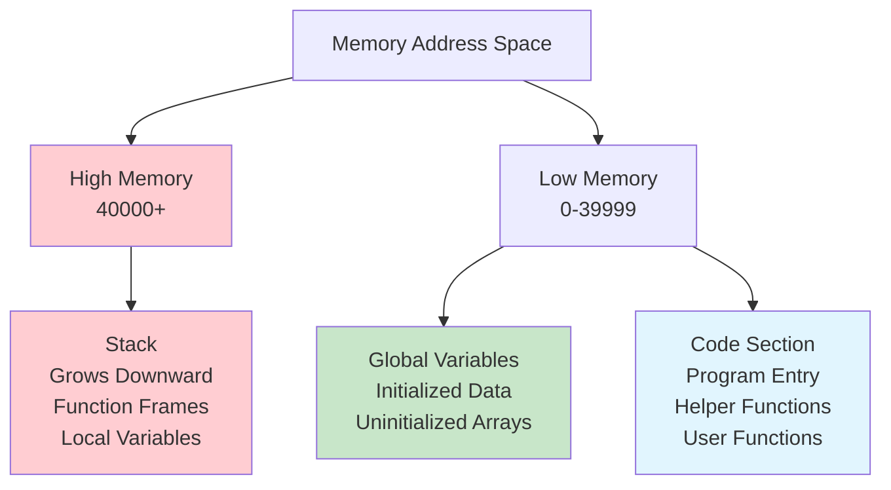
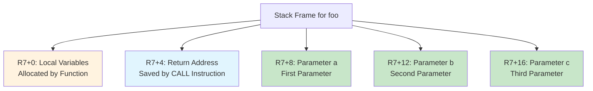

# Calling Conventions and Runtime

## Overview

This document describes the **function calling conventions** and **runtime model** used by the PPJ compiler for FRISC assembly code generation. A **calling convention** is a standardized protocol that defines how functions are called, how parameters are passed, how return values are handled, and how the stack and registers are managed during function calls.

Calling conventions are essential for ensuring that functions written by different parts of the compiler (or even different compilers) can interoperate correctly. They define:
- **Parameter Passing**: How function arguments are communicated from caller to callee
- **Return Value Handling**: How function return values are communicated from callee to caller
- **Stack Management**: How the stack is used for local variables, parameters, and return addresses
- **Register Usage**: Which registers can be modified by functions and which must be preserved
- **Frame Management**: How function activation records (stack frames) are structured and managed

The PPJ compiler implements a **standard FRISC calling convention** that is consistent with FRISC architecture documentation and ensures compatibility with the FRISC simulator. This convention uses the stack for parameter passing and local variable storage, follows a standard stack frame layout, and uses specific registers for special purposes (stack pointer, frame pointer, return value).

Understanding calling conventions is crucial for understanding how the compiler generates code, how programs execute, and how to debug generated assembly code. This document provides comprehensive coverage of the calling convention, stack layout, register usage, and runtime behavior.

## Runtime Model

The runtime model defines how programs execute on the FRISC architecture, including memory organization, stack management, and program initialization. Understanding the runtime model is essential for understanding how generated code executes and how to debug execution issues.

### Memory Layout

The FRISC runtime uses a **segmented memory organization** with distinct regions for different purposes:



**High Memory (40000+)**: The stack region, growing downward toward lower addresses:
- **Function Activation Records**: Stack frames for active function calls
- **Local Variables**: Function-local variables allocated on the stack
- **Temporary Values**: Intermediate values used during expression evaluation
- **Function Parameters**: Arguments passed to functions

The stack starts at address 40000 (or higher) and grows downward. Each function call allocates a new stack frame by decrementing the stack pointer. When a function returns, its stack frame is deallocated by incrementing the stack pointer.

**Low Memory (0-39999)**: Contains both data and code:
- **Global Variables**: Variables declared at global scope, with initialized values stored in the data section
- **Uninitialized Arrays**: Arrays declared without initializers, allocated with `.space` directives
- **Code Section**: Executable instructions, including:
  - Program entry point (stack initialization, main call, halt)
  - Helper functions (F_MUL, F_DIV, float helpers)
  - User-defined functions

This memory layout ensures that the stack (which grows) and the code/data sections (which are fixed) don't interfere with each other. By starting the stack at high memory and having it grow downward, we prevent stack overflow from overwriting code or data.

### Stack Pointer Initialization

The stack pointer (R7) must be initialized before any function calls can be made. The compiler generates initialization code at the program entry point:

```assembly
MOVE 40000, R7    ; Initialize stack pointer to high memory
```

**Why High Memory?**: The stack grows **downward** (toward lower addresses). By starting at a high address (40000), we ensure that:
1. The stack has room to grow without interfering with code/data sections
2. Stack overflow (if it occurs) will be detected by accessing invalid memory addresses
3. The memory layout is predictable and easy to reason about

**Initialization Timing**: Stack pointer initialization happens **before** any function calls. The program entry point code:
1. Initializes R7 to 40000
2. Calls the `main` function
3. Halts execution (with return value in R6)

This ensures that when `main` is called, the stack is properly initialized and ready for use.

### Stack Growth Direction

The stack grows **downward** (toward lower addresses), which is the opposite of how stacks are often visualized. This means:
- **Pushing** onto the stack **decrements** the stack pointer (R7)
- **Popping** from the stack **increments** the stack pointer (R7)
- **Allocating** local variables **decrements** the stack pointer
- **Deallocating** local variables **increments** the stack pointer

**Example**: If R7 = 40000 and we push a value:
```assembly
PUSH R0, R7    ; Push R0 onto stack
; R7 is now 39996 (decremented by 4, the word size)
; The value from R0 is stored at address 39996
```

This downward growth is standard for many architectures and allows efficient stack management using a single register (the stack pointer).

## Calling Convention

### Function Call Sequence

**Caller Side**:
1. Push parameters onto stack (right-to-left)
2. Call function using `CALL` instruction
3. Clean up parameters from stack
4. Retrieve return value from R6

**Callee Side**:
1. Save return address (automatically saved by CALL)
2. Allocate space for local variables
3. Execute function body
4. Place return value in R6
5. Deallocate local variables
6. Return using `RET` instruction

### Parameter Passing

**Convention**: Parameters are passed on the **stack**, in **right-to-left order** (matching C's standard calling convention).

#### Right-to-Left Parameter Order

Parameters are pushed onto the stack in **right-to-left order**, meaning the rightmost parameter is pushed first, and the leftmost parameter is pushed last. This order matches C's standard calling convention and ensures compatibility with C semantics.

**Why Right-to-Left?**: This order allows functions with variable numbers of arguments (like `printf`) to work correctly. The leftmost parameter (typically the format string) is at a known offset from the stack pointer, making it easy to access. However, the PPJ compiler doesn't support variadic functions, so this is primarily for consistency with C conventions.

#### Parameter Passing Example

Consider a function call `foo(a, b, c)` where `a`, `b`, and `c` are expressions that evaluate to values in R0:

```assembly
; Evaluate arguments (assuming they're already in R0)
; For this example, assume a=10, b=20, c=30

; Push parameters (right-to-left: c, then b, then a)
MOVE %D 30, R0    ; Evaluate c = 30
PUSH R0, R7       ; Push c (rightmost parameter first)
                  ; Stack: [30] at R7-4, R7 now = 39996

MOVE %D 20, R0    ; Evaluate b = 20
PUSH R0, R7       ; Push b
                  ; Stack: [20, 30] at R7-8 and R7-4, R7 now = 39992

MOVE %D 10, R0    ; Evaluate a = 10
PUSH R0, R7       ; Push a (leftmost parameter last)
                  ; Stack: [10, 20, 30] at R7-12, R7-8, R7-4, R7 now = 39988

; Call function
CALL F_FOO        ; CALL automatically:
                  ; 1. Pushes return address onto stack (R7-4)
                  ; 2. Sets PC to F_FOO
                  ; Stack: [ret_addr, 10, 20, 30], R7 now = 39984

; After function returns, clean up parameters
ADD R7, 12, R7    ; Remove 3 parameters × 4 bytes = 12 bytes
                  ; R7 now = 39996 (back to where it was before pushing parameters)
```

#### Stack Frame Layout Inside Function

When execution enters function `foo`, the stack frame has the following layout:



**Detailed Stack Layout**:
```
High Address (40000)
    ...
    R7+16: Parameter c (30)      ← Rightmost parameter (pushed first)
    R7+12: Parameter b (20)       ← Middle parameter
    R7+8:  Parameter a (10)       ← Leftmost parameter (pushed last)
    R7+4:  Return address          ← Saved automatically by CALL
    R7+0:  [Old R5, if saved]     ← Frame pointer (set by function prologue)
    R7-4:  Local variable 1        ← Allocated by function
    R7-8:  Local variable 2        ← Allocated by function
    ...
Low Address (growing downward)
```

**Accessing Parameters**: Inside the function, parameters are accessed using **positive offsets** from the frame pointer (R5):
- Parameter `a` is at `R5+8` (after saved R5 at R5+0 and return address at R5+4)
- Parameter `b` is at `R5+12`
- Parameter `c` is at `R5+16`

**Why Frame Pointer?**: The frame pointer (R5) provides a **stable reference point** for accessing parameters and local variables. Even as the stack pointer (R7) changes during expression evaluation (due to temporary pushes/pops), the frame pointer remains constant, making parameter and local variable access straightforward.

#### Parameter Cleanup

After the function call returns, the **caller** is responsible for cleaning up the parameters from the stack. This is done by incrementing the stack pointer by the total size of all parameters:

```assembly
ADD R7, 12, R7    ; Clean up 3 parameters × 4 bytes = 12 bytes
```

This cleanup restores the stack pointer to its value before the parameters were pushed, ensuring proper stack management. The callee doesn't clean up parameters because it doesn't know how many parameters were passed (in the general case), and because this allows for variable-argument functions (though not supported in PPJ).

### Return Values

**Convention**: Return values in R6 register

**Integer Returns**:
```assembly
; Function returns 42
MOVE 42, R6
RET
```

**Void Returns**:
```assembly
; No return value needed
RET
```

**Caller Retrieval**:
```assembly
CALL F_FOO
; R6 now contains return value
MOVE R6, R0  ; Use return value
```

## Activation Records

### Structure

An activation record (stack frame) contains:

```
┌─────────────────┐
│ Local Variables │ ← R7 points here
├─────────────────┤
│ Return Address  │ ← Saved by CALL instruction
├─────────────────┤
│ Parameter N     │
├─────────────────┤
│ Parameter N-1   │
├─────────────────┤
│ ...             │
├─────────────────┤
│ Parameter 1     │
└─────────────────┘
```

### Prologue

Function prologue sets up activation record:

```assembly
F_FOO:
    ; Save return address (already on stack from CALL)
    ; Allocate space for local variables
    SUB R7, local_size, R7
    
    ; Function body follows
    ...
```

### Epilogue

Function epilogue cleans up activation record:

```assembly
    ; Place return value in R6 (if non-void)
    MOVE return_value, R6
    
    ; Deallocate local variables
    ADD R7, local_size, R7
    
    ; Return (restores return address from stack)
    RET
```

## Register Usage

### Register Conventions

**R6**: Return value register
- Used for function return values
- Caller-saved (caller must save if needed)

**R7**: Stack pointer (SP)
- Points to top of stack
- Modified by function calls
- Must be preserved across calls

**R0-R5**: General-purpose registers
- Used for temporary values
- Caller-saved (can be modified by callee)
- No preservation required

### Register Allocation

**Strategy**: Simple register allocation
- Use R0-R5 for temporary values
- Spill to stack when registers exhausted
- No register spilling optimization (future enhancement)

## Helper Functions

### Integer Helpers

**F_MUL**: 32-bit integer multiplication
- Parameters: Two 32-bit integers on stack
- Returns: 32-bit product in R6

**F_DIV**: 32-bit integer division
- Parameters: Dividend and divisor on stack
- Returns: 32-bit quotient in R6

### Float Helpers

**F_FADD**: Q16.16 float addition
**F_FSUB**: Q16.16 float subtraction
**F_FMUL**: Q16.16 float multiplication
**F_FDIV**: Q16.16 float division
**F_FCMP**: Q16.16 float comparison
**F_I2F**: Integer to float conversion
**F_F2I**: Float to integer conversion

**See Also**: [Helper Functions on FRISC](../09-runtime-and-support/helper-functions-on-frisc.md)

## Global Variables

### Initialized Globals

Global variables with initializers are placed in data section:

```assembly
; Global variable: int x = 42;
G_x:
    .word 42
```

### Uninitialized Arrays

Uninitialized arrays are allocated with size directive:

```assembly
; Global array: int arr[10];
G_arr:
    .space 40    ; 10 elements × 4 bytes
```

### Accessing Globals

Global variables accessed via labels:

```assembly
; Load global variable
LOAD G_x, R0

; Store to global variable
STORE R0, G_x
```

## Program Entry Point

### Main Function

Every program must have a `main` function:

```assembly
; Program entry
MOVE 40000, R7    ; Initialize stack
CALL F_MAIN       ; Call main function
HALT              ; Terminate (R6 holds return value)
```

### Main Function Signature

**Standard**: `int main(void)`

**Return Value**: Program exit code (in R6 after HALT)

## Stack Management

### Stack Growth

Stack grows downward (toward lower addresses):

```
Before Call:
R7 → [top of stack]

After PUSH:
R7 → [new value]
      [old top]

After CALL:
R7 → [local vars]
      [return addr]
      [parameters]
```

### Stack Alignment

**Alignment**: 4-byte alignment (word-aligned)

**Rationale**: FRISC uses 32-bit words, so stack must be word-aligned for efficient access.

### Stack Overflow

**Detection**: Not currently implemented (future enhancement)

**Prevention**: Large stack allocations should be avoided; use heap allocation for large data structures.

## Exception Handling

**Current Status**: Not implemented

**Future Enhancement**: Exception handling would require:
- Exception table
- Unwind mechanism
- Exception propagation

## Further Reading

- **[Target Architecture Overview](target-architecture-overview.md)**: FRISC architecture details
- **[Instruction Selection](instruction-selection.md)**: Code generation algorithms
- **[Helper Functions](../09-runtime-and-support/helper-functions-on-frisc.md)**: Runtime helper functions

---

*Calling conventions ensure consistent function interfaces and proper stack management, enabling correct program execution on the FRISC architecture.*
