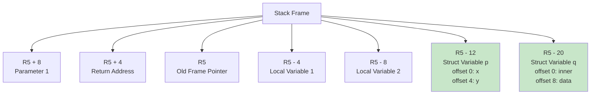

# Struct Code Generation

## Overview

The code generator translates struct-related C constructs into FRISC assembly code, handling struct variable declarations, member access, nested structures, arrays within structs, and struct assignments. This chapter provides a comprehensive description of the algorithms, memory layout conventions, and code generation patterns used to implement struct support in the PPJ compiler.

## Memory Model and Layout Conventions

### Type Sizes

The FRISC target architecture uses consistent type sizes:

- **char**: 4 bytes (same as int, for simplicity)
- **int**: 4 bytes (32-bit signed integer)
- **float**: 4 bytes (Q16.16 fixed-point format)
- **pointer**: 4 bytes (32-bit address)
- **struct**: Sum of all field sizes (no padding)

### Struct Layout Rules

Structs are laid out in memory following these rules:

1. **Declaration Order**: Fields are laid out in the order they are declared in the struct definition
2. **No Padding**: Fields are tightly packed with no alignment padding between them
3. **Nested Structs**: Nested struct fields are laid out inline, as if their fields were directly in the parent struct
4. **Arrays**: Array fields are laid out as contiguous sequences of elements

**Example:**
```c
struct Point {
    int x;      // offset 0, size 4
    int y;      // offset 4, size 4
};              // total size: 8 bytes

struct Outer {
    struct Point p;  // offset 0, size 8
    int arr[3];      // offset 8, size 12 (3 * 4)
    char c;          // offset 20, size 4
};                   // total size: 24 bytes
```

### Stack Layout for Struct Variables

Local struct variables are allocated on the stack using negative offsets from the frame pointer (R5):



**Example:**
```c
int f(int a) {
    struct Point p;  // allocated at R5 - 12
    int x;           // allocated at R5 - 4
    return 0;
}
```

Global struct variables are allocated in the data section with global labels (e.g., `G_P`).

## Field Offset Calculation

Field offsets are calculated using the `StructFieldOffsetCalculator` class, which implements the field offset calculation algorithm.

### Algorithm: Field Offset Calculation

**Input**: Struct type, field name, optional array sizes

**Algorithm**:
1. Initialize `currentOffset = 0`
2. Iterate through fields in declaration order:
   - Assign `offset[fieldName] = currentOffset`
   - Calculate field size:
     - **Array field**: `elementSize × arrayLength` (from arraySizes map)
     - **Nested struct**: Recursively calculate struct size
     - **Other types**: Use `TypeSizeCalculator`
   - Increment `currentOffset += fieldSize`
3. Return offset map

**Example:**
```c
struct Data {
    int x;      // offset = 0, size = 4, currentOffset = 4
    int arr[3]; // offset = 4, size = 12, currentOffset = 16
    char c;     // offset = 16, size = 4, currentOffset = 20
};              // total size: 20 bytes
```

### Handling Arrays in Structs

Array sizes are not stored in the `ArrayType` type representation. The code generator must extract array sizes from the parse tree using `StructArraySizeExtractor`:

```java
StructArraySizeExtractor extractor = new StructArraySizeExtractor(parseTree);
Map<String, Integer> arraySizes = extractor.extractArraySizes("Data");
// Result: {"arr": 3}
```

For nested structs with arrays, array sizes must be extracted recursively:

```java
Map<String, Map<String, Integer>> nestedSizes = new HashMap<>();
NestedStructArraySizeExtractor.extractNestedStructArraySizes(
    structType, extractor, nestedSizes);
// Result: {"Inner": {"arr": 2}, "Outer": {"data": 5}}
```

## Member Access Code Generation

Member access expressions (`struct.field`) are generated using the `FieldAccessGenerator` class, which implements the field access code generation algorithm.

### Algorithm: Field Access Code Generation

**Input**: Base expression AST node, field name

**Algorithm**:
1. **Base Address Resolution**: Compute address of base expression
   - Local variable: `MOVE R5, R0` then `ADD R0, -offset, R0`
   - Global variable: `MOVE G_VAR, R0`
   - Nested access: Recursively compute base address
   - Array element: Compute array element address first
2. **Field Offset Lookup**: Get byte offset of field using `StructFieldOffsetCalculator`
3. **Field Address Calculation**: Add field offset to base address
   - `ADD R0, %D fieldOffset, R0`
4. **Memory Access**: Load or store field value
   - int/float/pointer: `LOAD R0, (R0)` or `STORE R1, (R0)`
   - char: `LOADB R0, (R0)` or `STOREB R1, (R0)`

### Simple Member Access

**Source Code:**
```c
struct Point {
    int x;
    int y;
};

int main(void) {
    struct Point p;
    int sum;
    p.x = 10;
    sum = p.y;
    return 0;
}
```

**Generated FRISC Code:**
```frisc
; Function: main
MAIN:
    PUSH R5                    ; Save old frame pointer
    MOVE R7, R5                ; Set frame pointer
    SUB R7, %D 8, R7           ; Allocate locals (p: 8 bytes)

    ; p.x = 10
    MOVE %D 10, R0              ; Load constant 10
    MOVE R0, R1                 ; Save value
    MOVE R5, R0                 ; Base address (frame pointer)
    ADD R0, -8, R0              ; Add struct offset (p at R5 - 8)
    ADD R0, %D 0, R0            ; Add field offset (x at offset 0)
    STORE R1, (R0)              ; Store to p.x

    ; sum = p.y
    MOVE R5, R0                 ; Base address
    ADD R0, -8, R0              ; Struct offset
    ADD R0, %D 4, R0            ; Field offset (y at offset 4)
    LOAD R0, (R0)               ; Load p.y
    MOVE R0, R1                 ; Save sum (assuming sum is at R5 - 4)
    STORE R1, (R5-4)            ; Store sum

    ; Return
    MOVE %D 0, R6                ; Return value
    ADD R7, %D 8, R7             ; Deallocate locals
    POP R5                       ; Restore frame pointer
    RET                          ; Return
```

### Nested Member Access

**Source Code:**
```c
struct Inner {
    int value;
};

struct Outer {
    struct Inner inner;
    int data;
};

int main(void) {
    struct Outer o;
    o.inner.value = 42;
    return 0;
}
```

**Generated FRISC Code:**
```frisc
; o.inner.value = 42
MOVE %D 42, R0                  ; Load constant 42
MOVE R0, R1                     ; Save value

; Compute address of o
MOVE R5, R0                     ; Frame pointer
ADD R0, -8, R0                  ; Struct offset (o at R5 - 8)

; Add offset of inner field (offset 0)
ADD R0, %D 0, R0                ; Address of o.inner

; Add offset of value field within Inner (offset 0)
ADD R0, %D 0, R0                ; Address of o.inner.value

STORE R1, (R0)                  ; Store to o.inner.value
```

The nested access is handled recursively: first compute `o`'s address, then add `inner`'s offset, then add `value`'s offset within the `Inner` struct.

### Array Field Access

**Source Code:**
```c
struct Data {
    int arr[10];
    int count;
};

int main(void) {
    struct Data d;
    int i = 5;
    d.arr[i] = 100;
    return 0;
}
```

**Generated FRISC Code:**
```frisc
; d.arr[i] = 100
MOVE %D 100, R0                 ; Load constant 100
MOVE R0, R1                     ; Save value

; Compute address of d
MOVE R5, R0                     ; Frame pointer
ADD R0, -44, R0                 ; Struct offset (d at R5 - 44, size 44 bytes)

; Add offset of arr field (offset 0)
ADD R0, %D 0, R0                ; Base address of array

; Load index i
LOAD R0, (R5-4)                 ; Assuming i is at R5 - 4
MOVE R0, R2                     ; Index in R2

; Calculate element address: base + index * element_size
SHL R2, 2, R2                   ; Multiply index by 4 (int size)
ADD R0, R2, R0                  ; Element address

STORE R1, (R0)                  ; Store to d.arr[i]
```

### Array of Structs Access

**Source Code:**
```c
struct Point {
    int x;
    int y;
};

int main(void) {
    struct Point arr[5];
    int i = 2;
    arr[i].x = 10;
    return 0;
}
```

**Generated FRISC Code:**
```frisc
; arr[i].x = 10
MOVE %D 10, R0                  ; Load constant 10
MOVE R0, R1                     ; Save value

; Compute base address of arr
MOVE R5, R0                     ; Frame pointer
ADD R0, -40, R0                 ; Array offset (arr at R5 - 40, 5 * 8 bytes)

; Load index i
LOAD R0, (R5-4)                 ; Assuming i is at R5 - 4
MOVE R0, R2                     ; Index in R2

; Calculate element address: base + index * element_size
MOVE %D 8, R3                   ; Element size (Point is 8 bytes)
MUL R2, R3, R2                  ; index * element_size
ADD R0, R2, R0                  ; Address of arr[i]

; Add field offset (x at offset 0)
ADD R0, %D 0, R0                ; Address of arr[i].x

STORE R1, (R0)                  ; Store to arr[i].x
```

## Struct Assignment Code Generation

Struct assignments (`p = q`) are generated using the `StructAssignmentGenerator` class, which implements struct-to-struct memory copy.

### Algorithm: Struct Assignment

**Input**: LHS struct expression, RHS struct expression, struct type

**Algorithm**:
1. **Size Calculation**: Calculate struct size (may require array size extraction)
2. **Address Resolution**: Compute addresses of source and destination structs
3. **Memory Copy**: Copy struct word-by-word using a loop:
   - Initialize counter: `MOVE %D structSize, R4`
   - Loop: Load word from source, store to destination, increment pointers, decrement counter
   - Repeat until counter reaches zero

### Struct-to-Struct Assignment

**Source Code:**
```c
struct Point {
    int x;
    int y;
};

int main(void) {
    struct Point p, q;
    q.x = 10;
    q.y = 20;
    p = q;
    return 0;
}
```

**Generated FRISC Code:**
```frisc
; p = q
; Compute source address (q)
MOVE R5, R2                     ; Frame pointer
ADD R2, -16, R2                 ; Source struct offset (q at R5 - 16)

; Compute destination address (p)
MOVE R5, R3                     ; Frame pointer
ADD R3, -8, R3                  ; Dest struct offset (p at R5 - 8)

; Copy loop
MOVE %D 8, R4                   ; Struct size (8 bytes)
L_LOOP:
    CMP R4, %D 0                ; Check if counter is zero
    JP_EQ L_END                 ; Done if counter == 0
    
    LOAD R0, (R2)               ; Load word from source
    STORE R0, (R3)              ; Store word to destination
    
    ADD R2, %D 4, R2            ; Increment source pointer
    ADD R3, %D 4, R3            ; Increment dest pointer
    SUB R4, %D 4, R4            ; Decrement counter
    
    JP L_LOOP                   ; Continue loop
L_END:
```

### Assignment from Function Call

When assigning from a struct-returning function (`p = makePoint()`), the compiler uses an optimized calling convention with a hidden return pointer:

**Source Code:**
```c
struct Point makePoint(int x, int y) {
    struct Point p;
    p.x = x;
    p.y = y;
    return p;
}

int main(void) {
    struct Point p;
    p = makePoint(10, 20);
    return 0;
}
```

**Generated FRISC Code (Caller):**
```frisc
; p = makePoint(10, 20)
; Compute destination address (p)
MOVE R5, R0                     ; Frame pointer
ADD R0, -8, R0                  ; Struct offset

; Save return pointer in R1
MOVE R0, R1

; Evaluate and push arguments (right-to-left)
MOVE %D 20, R0                  ; y = 20
PUSH R0
MOVE %D 10, R0                  ; x = 10
PUSH R0

; Set return pointer in R2
MOVE R1, R2

; Call function
CALL F_MAKEPOINT

; Clean up arguments
ADD R7, %D 8, R7                ; Remove 2 arguments

; Struct already written to p by callee, no copy needed
```

**Generated FRISC Code (Callee):**
```frisc
; Function: makePoint
F_MAKEPOINT:
    PUSH R5                      ; Save old frame pointer
    MOVE R7, R5                  ; Set frame pointer
    
    ; Allocate local struct (if needed)
    SUB R7, %D 8, R7            ; Allocate local struct p
    
    ; Access parameters (R5 + 8 = first arg, R5 + 12 = second arg)
    LOAD R0, (R5+8)              ; Load x
    STORE R0, (R5-8)             ; Store to p.x (offset 0)
    
    LOAD R0, (R5+12)             ; Load y
    STORE R0, (R5-4)             ; Store to p.y (offset 4)
    
    ; Copy local struct to return pointer (R2)
    MOVE R5, R0                  ; Source: local struct
    ADD R0, -8, R0
    MOVE R2, R1                  ; Destination: return pointer
    
    ; Copy 8 bytes
    LOAD R0, (R0)                ; Load first word
    STORE R0, (R1)               ; Store to destination
    ADD R0, %D 4, R0             ; Increment source
    ADD R1, %D 4, R1             ; Increment destination
    LOAD R0, (R0)                ; Load second word
    STORE R0, (R1)               ; Store to destination
    
    ; Return
    MOVE %D 0, R6                ; Return value (void-like)
    ADD R7, %D 8, R7             ; Deallocate locals
    POP R5                       ; Restore frame pointer
    RET                          ; Return
```

The hidden return pointer convention avoids an extra copy: the callee writes directly to the caller's destination struct.

## Complex Examples

### Example 1: Deeply Nested Structs

**Source Code:**
```c
struct Inner {
    int value;
};

struct Middle {
    struct Inner inner;
    int data;
};

struct Outer {
    struct Middle middle;
    int count;
};

int main(void) {
    struct Outer o;
    o.middle.inner.value = 42;
    o.middle.data = 10;
    o.count = 5;
    return 0;
}
```

**Memory Layout:**
```
o (at R5 - 16):
  offset 0-3:   middle.inner.value (int)
  offset 4-7:   middle.data (int)
  offset 8-11:  count (int)
Total size: 12 bytes
```

**Generated FRISC Code (excerpt):**
```frisc
; o.middle.inner.value = 42
MOVE %D 42, R0
MOVE R0, R1
MOVE R5, R0                     ; Base: o
ADD R0, -16, R0                 ; Struct offset
ADD R0, %D 0, R0                ; middle.inner.value offset (0)
STORE R1, (R0)

; o.middle.data = 10
MOVE %D 10, R0
MOVE R0, R1
MOVE R5, R0
ADD R0, -16, R0
ADD R0, %D 4, R0                ; middle.data offset (4)
STORE R1, (R0)

; o.count = 5
MOVE %D 5, R0
MOVE R0, R1
MOVE R5, R0
ADD R0, -16, R0
ADD R0, %D 8, R0                ; count offset (8)
STORE R1, (R0)
```

### Example 2: Struct with Array Field

**Source Code:**
```c
struct Buffer {
    int data[10];
    int count;
};

int main(void) {
    struct Buffer buf;
    int i = 5;
    buf.data[i] = 100;
    buf.count = i;
    return 0;
}
```

**Memory Layout:**
```
buf (at R5 - 44):
  offset 0-39:  data[10] (10 * 4 = 40 bytes)
  offset 40-43: count (4 bytes)
Total size: 44 bytes
```

**Generated FRISC Code:**
```frisc
; buf.data[i] = 100
MOVE %D 100, R0
MOVE R0, R1
MOVE R5, R0                     ; Base: buf
ADD R0, -44, R0                 ; Struct offset
ADD R0, %D 0, R0                ; data field offset (0)
LOAD R2, (R5-4)                 ; Load index i
SHL R2, 2, R2                   ; Multiply by 4
ADD R0, R2, R0                  ; Element address
STORE R1, (R0)                  ; Store

; buf.count = i
LOAD R0, (R5-4)                 ; Load i
MOVE R0, R1
MOVE R5, R0
ADD R0, -44, R0
ADD R0, %D 40, R0               ; count offset (40)
STORE R1, (R0)
```

## Summary

Struct code generation in the PPJ compiler implements:

- **Memory Layout**: Tightly packed fields in declaration order, no padding
- **Field Offset Calculation**: Iterative algorithm computing offsets from field sizes
- **Member Access**: Base address + field offset computation, recursive for nested access
- **Array Handling**: Array size extraction from parse tree, element address calculation
- **Struct Assignment**: Word-by-word memory copy loop, optimized function call convention
- **Complex Patterns**: Support for nested structs, arrays in structs, arrays of structs

The implementation ensures correct memory layout, efficient address computation, and proper handling of all struct-related language features.
