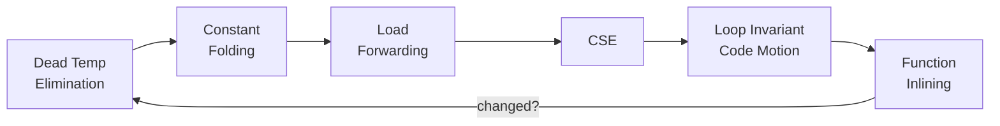
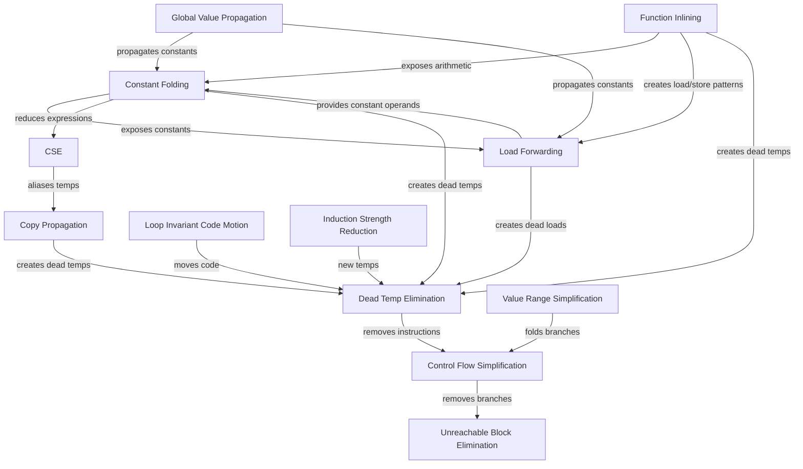
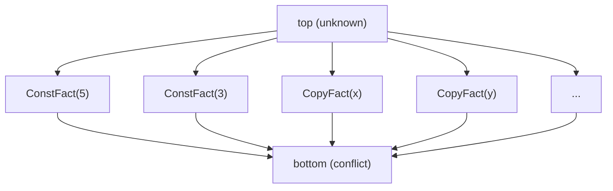
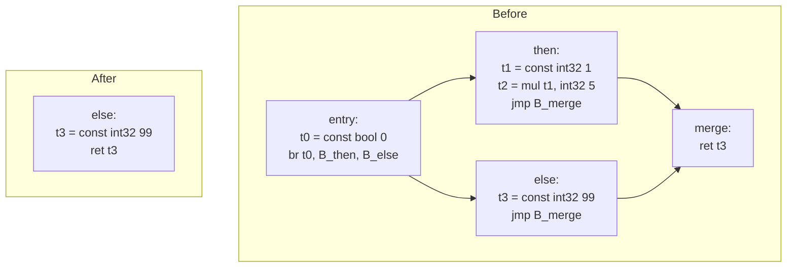

## 7.1 Optimization Philosophy

Optimization in this compiler is performed at the typed IR level, within the `compiler-opt` module. This architectural placement maximizes both semantic richness and machine-relevance simultaneously.

\index{optimization!philosophy}

Three alternative strategies exist for placing optimization passes in a compiler pipeline:

- **Source-tree level.** Information at this stage is syntactic. Reasoning about algebraic identities or data flow requires repeated semantic reinterpretation of parse-tree structures. Transformations are fragile because they must account for language-level ambiguities not yet resolved.

- **Assembly level.** Type information has been erased. Proving value equivalence or store liveness requires reconstructing information that was available in earlier representations. Register allocation decisions further complicate reasoning. While peephole optimizations are natural at this level, broader transformations are expensive and error-prone.

- **Typed IR level.** Control flow is explicit as a graph of basic blocks with typed terminators. Types annotate every value and operation. Side effects are structurally visible (stores are explicit instructions). This combination enables deterministic, verifiable rewrites with clear legality conditions.

The optimization objective is to reduce dynamic instruction cost -- the number of instructions actually executed at runtime -- while preserving semantic identity. On the FRISC target, where multiplication and division are implemented as multi-instruction software helper calls, even modest reductions in arithmetic operation count translate into significant runtime improvements.

### Semantic Equivalence as the Cardinal Rule

\index{semantic equivalence}

Every optimization pass must satisfy the invariant: for all inputs, the optimized program produces the same observable outputs as the unoptimized version. Observable outputs include return values, memory state visible to the caller, and calls to external functions (including I/O routines).

This invariant is enforced mechanically. The `IrOptimizationValidator` runs the IR verifier both before and after the pipeline, and optionally after every individual pass. The verifier checks structural well-formedness: every temp that is used must be defined, every branch target must name a block that exists within the same function, every function must have at least one block, and every block must end with exactly one terminator.


## 7.2 Optimization Infrastructure

\index{optimization!infrastructure}

The `compiler-opt` module (package `hr.fer.ppj.opt`) provides a carefully designed infrastructure for defining and composing optimization passes. The module is organized into sub-packages by pass category: `pipeline`, `validation`, `rules.arith`, `rules.shift`, `rules.cast`, `rules.temps`, `rules.controlflow`, `rules.flow`, `rules.loop`, `rules.range`, `rules.memory`, and `rules.inline`.

### The IrPass Interface and the Strategy Pattern

\index{IrPass interface} \index{strategy pattern}

Every pass implements the `IrPass` interface:

```java
public interface IrPass {
    String name();
    PassResult run(IrProgram program, PassContext context);
}
```

The `name()` method returns a deterministic string for diagnostics. The `run()` method receives the entire IR program and a shared context, and returns a `PassResult`.

This is an application of the **Strategy pattern** from object-oriented design. The pipeline does not know or care which specific transformation a pass implements. It interacts with each pass exclusively through the two-method `IrPass` contract. This decoupling yields several engineering benefits:

1. **New passes require no pipeline changes.** A developer adds a new pass by creating a class that implements `IrPass`, then inserts an instance into the pass list in `IrOptimizer.optimize()`. The pipeline, the context, and the validator are unmodified.

2. **Passes are independently testable.** Each pass can be instantiated in isolation, given a hand-crafted `IrProgram`, and its `PassResult` inspected. No pipeline infrastructure is needed for unit tests.

3. **Pass ordering is explicit.** The `List<IrPass>` passed to `PassPipeline` fully determines execution order. There is no implicit dependency resolution, no priority system, and no annotation-driven wiring. The order is visible in a single method.

4. **Passes are stateless across invocations.** Each pass receives an immutable `IrProgram` and returns a new immutable `IrProgram`. No pass retains state between calls to `run()`. This statelessness makes the fixpoint loop safe: calling a pass multiple times with evolving input is always legal.

### PassResult

\index{PassResult}

`PassResult` is a record containing two fields:

| Field     | Type        | Meaning                                |
|-----------|-------------|----------------------------------------|
| `program` | `IrProgram` | The (possibly rewritten) program       |
| `changed` | `boolean`   | Whether any transformation was applied |

The `changed` flag drives the fixed-point iteration. Two factory methods -- `PassResult.unchanged(program)` and `PassResult.changed(program)` -- make intent explicit at every return site.

The implementation uses a Java `record`:

```java
public record PassResult(IrProgram program, boolean changed) {
    public PassResult {
        Objects.requireNonNull(program, "program must not be null");
    }
    public static PassResult unchanged(IrProgram program) {
        return new PassResult(program, false);
    }
    public static PassResult changed(IrProgram program) {
        return new PassResult(program, true);
    }
}
```

The compact constructor enforces non-null programs. The factory methods prevent callers from accidentally returning `changed=true` when no change occurred, or vice versa.

### PassContext

`PassContext` bundles execution-time state shared among all passes:

```java
public record PassContext(
    OptimizationOptions options,
    IrOptimizationValidator validator) { }
```

The `options` field carries the optimization level (`O0` or `O1`), the maximum number of pipeline iterations (default 5), and a flag controlling per-pass validation.

### Adding a New Optimization Pass

The procedure for adding a new pass to FRISCcc is:

1. Create a new class implementing `IrPass` in the appropriate `rules.*` sub-package.
2. Implement `name()` to return a unique diagnostic string.
3. Implement `run()` to iterate over functions/blocks, perform the transformation, and return `PassResult.changed(newProgram)` or `PassResult.unchanged(program)`.
4. Insert a `new YourPass()` instance into the pass list in `IrOptimizer.optimize()` at the appropriate position.
5. Write unit tests that construct minimal `IrProgram` instances and verify the pass's `PassResult`.

No registration mechanism, annotation processing, or service-loader configuration is required. The pass list is an ordinary Java `List`.

### The Immutable IR Model

\index{immutable IR}

IR model classes (`IrProgram`, `IrFunction`, `IrBlock`, `IrInstruction`, `IrRhs`, `IrTerminator`) are Java records and therefore immutable. Each pass constructs new instances rather than mutating existing ones, eliminating aliasing bugs where one pass's output is inadvertently modified by a subsequent pass.

This immutability has a performance cost: every transformation allocates new objects. However, for the program sizes typical of FRISCcc targets (tens of functions, hundreds of blocks), this cost is negligible. The correctness guarantee is worth far more than the allocation overhead.


## 7.3 Pass Pipeline Architecture

\index{pass pipeline} \index{fixpoint iteration}

### PassPipeline and Fixed-Point Iteration

`PassPipeline` accepts an ordered list of `IrPass` instances and executes them in a deterministic fixed-point loop:

```java
for (int iteration = 0; iteration < context.options().maxIterations(); iteration++) {
    boolean changedInIteration = false;
    for (IrPass pass : passes) {
        PassResult result = pass.run(current, context);
        current = result.program();
        changedInIteration |= result.changed();
        if (context.options().validateAfterEachPass()) {
            context.validator().validate(current);
        }
    }
    if (!changedInIteration) {
        break;
    }
}
```

Let $I_0$ be the input IR and $P_1, P_2, \ldots, P_n$ the ordered pass sequence. Each iteration computes:

$$I_{k+1} = P_n(\cdots P_2(P_1(I_k)) \cdots)$$

The pipeline terminates when either (a) no pass reports a change during an entire iteration, or (b) the iteration count reaches `maxIterations`.

### Why Iterate? The Cascade Effect

\index{cascade effect}

A single pass through all optimization passes is insufficient because transformations interact. One pass may create opportunities that only another pass can exploit, and that second pass's output may in turn create opportunities for the first. This cascading effect requires repeated application.

Consider a concrete example involving three passes: constant folding, load forwarding, and dead temp elimination.

```ir
; Initial IR (before any optimization)
block entry:
  t0 = addr_of_symbol [local:x]
  t1 = const int32 3
  t2 = const int32 4
  t3 = add t1, t2 : int32          ; 3 + 4
  store int32 t0, t3                ; x = 7
  t4 = addr_of_symbol [local:x]
  t5 = load int32 t4                ; load x
  t6 = mul t5, int32 2 : int32     ; x * 2
  ret t6
```

**Iteration 1:**

- *Constant folding* folds `t3 = add t1, t2` into `t3 = const int32 7`.
- *Load forwarding* sees that `x` contains constant 7, replaces `t5 = load` with `t5 = const int32 7`.
- *Dead temp elimination* removes `t1` and `t2` (now unused).

```ir
; After iteration 1
block entry:
  t0 = addr_of_symbol [local:x]
  t3 = const int32 7
  store int32 t0, t3
  t4 = addr_of_symbol [local:x]
  t5 = const int32 7               ; forwarded
  t6 = mul t5, int32 2 : int32     ; 7 * 2
  ret t6
```

**Iteration 2:**

- *Constant folding* folds `t6 = mul t5, int32 2` (both operands now constant) into `t6 = const int32 14`.
- *Dead temp elimination* removes `t5`, `t3`, `t0`, `t4` (now unused after folding).
- *Dead slot store elimination* removes the store to `x` (never read after this point).

```ir
; After iteration 2
block entry:
  t6 = const int32 14
  ret t6
```

**Iteration 3:** No pass reports a change. The pipeline terminates.

This example illustrates why iteration is necessary: constant folding in iteration 1 enabled load forwarding, which enabled further constant folding in iteration 2, which enabled dead code elimination. No single pass could achieve the final result alone.

### Convergence Properties

\index{convergence}

Each pass is monotone with respect to program complexity: it either reduces the number of instructions, simplifies expressions to cheaper forms, or leaves the program unchanged. Since the IR program is finite and passes only reduce or simplify, the sequence $|I_0| \geq |I_1| \geq |I_2| \geq \cdots$ is non-increasing and bounded below. In practice, convergence occurs within 2-3 iterations for typical programs.

**Theoretical maximum iterations.** The worst case occurs when each iteration eliminates exactly one instruction. If the original program has $N$ instructions, at most $N$ iterations are needed. However, each pass typically eliminates multiple instructions per iteration, so in practice the bound is much tighter. The configured `maxIterations` (default 5) is generous for all programs encountered.

**Why the bound is safe.** Consider the potential pathology: could a pass increase program size, creating oscillation? In FRISCcc, only `TinyFunctionInliningPass` can increase instruction count (by expanding a call into its body). However, the inlined function is not re-inlinable (it no longer appears as a call), so this expansion occurs at most once per call site. All other passes are strictly non-expanding.

The bounded iteration count guarantees:

1. **Reproducible builds.** Identical input always produces identical output.
2. **Bounded compile time.** Worst-case compilation time is linear in `maxIterations` multiplied by the cost of one full pass sequence.
3. **Testable regression behavior.** Golden-file tests remain stable across compiler changes.

### Pipeline Flow Diagram

The following diagram shows the pass pipeline with its fixpoint loop structure:



The arrow from Function Inlining back to Dead Temp Elimination represents the fixpoint loop: if any pass reported a change during the full sequence, the entire sequence is re-executed from the beginning.

### Pass Dependency Graph

\index{pass dependencies}

Not all passes benefit from re-execution equally. The following diagram shows which passes create opportunities for which other passes:



The most important feedback cycle is **Constant Folding <-> Load Forwarding**: load forwarding reveals constant operands that enable further folding, and folding produces constants that load forwarding can propagate through stores.


## 7.4 Dataflow Analysis Foundations

\index{dataflow analysis}

Several passes rely on classical dataflow analysis techniques. This section provides the theoretical background grounded in the specific structures used by the actual passes.

### Basic Blocks and Control-Flow Graphs

\index{basic block} \index{control-flow graph}

In the IR, a basic block is a maximal sequence of instructions with a single entry point (the block label) and a single exit point (the terminator). The control-flow graph (CFG) of a function has one node per basic block and edges determined by terminators:

- `IrJmpTerm(label)` produces one outgoing edge.
- `IrBrTerm(condition, trueLabel, falseLabel)` produces two outgoing edges.
- `IrRetTerm` produces no outgoing edges (exits the function).

The first block of a function is the entry block. Blocks not reachable from the entry block are dead blocks, eliminated by `UnreachableBlockEliminationPass`.

### Lattice Theory for Compiler Analysis

\index{lattice theory}

A **lattice** is a partially ordered set $(L, \sqsubseteq)$ where every pair of elements has a least upper bound (join, $\sqcup$) and a greatest lower bound (meet, $\sqcap$). Compiler dataflow analyses operate over lattices because they provide a mathematical framework that guarantees convergence of iterative algorithms.

**Key lattice properties for compiler analysis:**

- **Finite height.** The lattice must have no infinitely ascending chains. This guarantees that iterative algorithms terminate, since each iteration must move at least one element upward in the lattice, and there are only finitely many upward steps.

- **Monotone transfer functions.** A function $f: L \to L$ is monotone if $x \sqsubseteq y$ implies $f(x) \sqsubseteq f(y)$. When transfer functions are monotone and the lattice has finite height, iterative application of these functions is guaranteed to reach a fixpoint.

- **Join and meet operations.** At CFG merge points (blocks with multiple predecessors), information from different paths must be combined. Forward analyses typically use join ($\sqcup$) to merge information from predecessors. Backward analyses use meet ($\sqcap$) to merge information from successors.

The standard lattice for a must-analysis (where facts must hold on all paths) uses intersection as its meet operation. The standard lattice for a may-analysis (where facts may hold on any path) uses union.

**Example: The Boolean Constant Lattice.**

The simplest lattice used in compiler optimization has three elements:

```
         top (overdefined / unknown)
        /                          \
  true (1)                      false (0)
        \                          /
        bottom (undefined / unreached)
```

The join operation:

```
join(true, true)   = true
join(false, false) = false
join(true, false)  = top
join(x, bottom)    = x
join(x, top)       = top
```

This lattice has height 2 (maximum chain length from bottom to top), so any iterative analysis over it converges in at most 2 iterations per variable.

### Formal Dataflow Framework

\index{dataflow framework}

A dataflow analysis is specified by a tuple $(L, \sqcup, F, \iota)$ where:

- $L$ is the lattice of dataflow facts.
- $\sqcup$ is the join (or meet) operator at merge points.
- $F = \{f_B : L \to L \mid B \in \text{Blocks}\}$ is the set of transfer functions, one per block.
- $\iota \in L$ is the initial value for the entry (or exit) block.

The **flow equations** for a forward analysis are:

$$\text{IN}(B) = \begin{cases} \iota & \text{if } B = \text{entry} \\ \bigsqcup_{P \in \text{pred}(B)} \text{OUT}(P) & \text{otherwise} \end{cases}$$

$$\text{OUT}(B) = f_B(\text{IN}(B))$$

For a backward analysis (such as liveness), the equations are reversed:

$$\text{OUT}(B) = \begin{cases} \iota & \text{if } B = \text{exit} \\ \bigsqcup_{S \in \text{succ}(B)} \text{IN}(S) & \text{otherwise} \end{cases}$$

$$\text{IN}(B) = f_B(\text{OUT}(B))$$

### The Worklist Algorithm

\index{worklist algorithm}

The standard algorithm for solving dataflow equations iteratively is the worklist algorithm:

```pseudocode
function SolveForwardDataflow(CFG, L, join, transfer, initial):
    // Initialize
    for each block B in CFG:
        OUT[B] = bottom
    OUT[entry] = transfer[entry](initial)
    worklist = {all blocks except entry}

    // Iterate
    while worklist is not empty:
        remove some block B from worklist
        IN[B] = join( OUT[P] for P in predecessors(B) )
        old_out = OUT[B]
        OUT[B] = transfer[B](IN[B])
        if OUT[B] != old_out:
            add all successors of B to worklist

    return (IN, OUT)
```

**Convergence guarantee.** If the lattice has finite height $h$ and there are $n$ blocks, the worklist algorithm terminates after at most $h \times n$ iterations. Each block is processed at most $h$ times because each processing can only move its output upward in the lattice, and there are at most $h$ upward steps.

**FRISCcc's approach.** The FRISCcc passes use a simplified variant of the worklist algorithm: they iterate over all blocks in order (rather than maintaining an explicit worklist) and repeat until no block's state changes. This is slightly less efficient than a true worklist for large CFGs, but simpler to implement and fully correct. For the small program sizes targeted by FRISCcc, the difference is negligible.

### Reaching Definitions and Liveness

\index{reaching definitions} \index{liveness analysis}

A definition of temporary `t_i` at instruction `I` reaches a use of `t_i` at instruction `J` if there exists a path from `I` to `J` along which `t_i` is not redefined. The IR uses SSA-like temporaries within blocks (each temp is assigned at most once within its block), which simplifies intra-block reaching-definition analysis. Cross-block dataflow is used by `GlobalValuePropagationPass` and `LoadForwardingPass`, which track slot values rather than temp values across block boundaries.

A temporary `t_i` is live at a program point if there exists some path from that point to a use of `t_i` that does not pass through a redefinition. `DeadTempEliminationPass` performs a backward pass over each block to compute liveness, removing assignments to temps that are dead immediately after definition. `DeadSlotStoreEliminationPass` extends this to memory slots using backward dataflow across the entire function CFG.

**Liveness as a formal dataflow problem:**

- **Lattice:** Power set of temporaries, ordered by set inclusion. Join is set union (may-analysis).
- **Direction:** Backward.
- **Transfer function:** $f_B(\text{OUT}) = \text{Use}(B) \cup (\text{OUT} - \text{Def}(B))$ where $\text{Use}(B)$ is the set of temps used before being defined in $B$, and $\text{Def}(B)$ is the set of temps defined in $B$.
- **Initial value:** Empty set at exit blocks.

**Available expressions as a formal dataflow problem:**

\index{available expressions}

- **Lattice:** Power set of expressions, ordered by reverse set inclusion. Join is set intersection (must-analysis).
- **Direction:** Forward.
- **Transfer function:** $f_B(\text{IN}) = \text{Gen}(B) \cup (\text{IN} - \text{Kill}(B))$ where $\text{Gen}(B)$ is the set of expressions computed in $B$, and $\text{Kill}(B)$ is the set of expressions invalidated by definitions in $B$.
- **Initial value:** Empty set (no expressions available at entry).

CSE uses available expressions within a single block, which is a degenerate case of this framework where the CFG has a single node.

### Lattices in FRISCcc Passes

\index{ValueFact lattice} \index{IntRange lattice}

Several global analyses -- `GlobalValuePropagationPass`, `LoadForwardingPass`, `ValueRangeSimplificationPass`, and `DeadSlotStoreEliminationPass` -- are formulated as fixed-point computations over lattices.

`GlobalValuePropagationPass` tracks slot values using a `ValueFact` lattice:

```
         top (absent -- value unknown)
        /                             \
  ConstFact(constant)            CopyFact(slotName)
        \                             /
       bottom (conflict -- removed by meet)
```

The meet operation at join points (blocks with multiple predecessors) retains a fact only if all predecessors agree on the same `ValueFact`. This is the standard intersection meet for a must-analysis.

**Lattice diagram for GlobalValuePropagation:**



The lattice height is 2 (top -> concrete fact -> bottom), meaning the analysis converges in at most 2 passes over the CFG per slot.

`ValueRangeSimplificationPass` uses an `IntRange(min, max)` lattice. The join is the convex hull: `hull([a,b], [c,d]) = [min(a,c), max(b,d)]`. This widening operator guarantees convergence: ranges can only grow, bounded by the 32-bit integer domain.

`DeadSlotStoreEliminationPass` uses a backward analysis with a lattice of live slot name sets. The meet at block boundaries (computed from successor `liveIn` sets) is set union: a slot is live at a block exit if it is live at the entry of any successor.


## 7.5 Local Optimizations

\index{local optimization}

Local optimizations operate within a single basic block without considering inter-block control flow. They are fast, safe, and form the first pipeline stage.

### 7.5.1 Int32ArithmeticPass

**Pass name:** `int32-arithmetic`

\index{Int32ArithmeticPass}

This pass applies algebraic identities and local constant folding to `int32` operations. It maintains a map from temp indices to their defining RHS expressions within each block, enabling recognition of patterns such as double negation.

**Algebraic Identities:**

| Pattern         | Replacement   | Rule                          |
|-----------------|---------------|-------------------------------|
| `x + 0`        | `x`           | Additive identity             |
| `0 + x`        | `x`           | Commutativity of addition     |
| `x - 0`        | `x`           | Subtractive identity          |
| `x - x`        | `0`           | Self-cancellation             |
| `x * 0`        | `0`           | Multiplicative annihilator    |
| `0 * x`        | `0`           | Commutativity                 |
| `x * 1`        | `x`           | Multiplicative identity       |
| `1 * x`        | `x`           | Commutativity                 |
| `x * (-1)`     | `neg x`       | Negation via multiplication   |
| `(-1) * x`     | `neg x`       | Commutativity                 |
| `x / 1`        | `x`           | Division by one               |
| `x / (-1)`     | `neg x`       | Division by negative one      |
| `x % 1`        | `0`           | Modulo by one                 |
| `x % (-1)`     | `0`           | Modulo by negative one        |
| `neg(neg(x))`  | `x`           | Double negation cancellation  |

When both operands of a binary operation are integer constants, the pass evaluates the expression at compile time using Java's 32-bit arithmetic (matching `int32` two's complement semantics). Division and modulo use `Int32Semantics.divide` and `Int32Semantics.modulo` to handle edge cases: division by zero returns 0, and `INT_MIN / -1` returns `INT_MIN`.

**Before/After IR Example:**

```ir
; Before                                ; After
t3 = mul t1, int32 1                   t3 = add t1, int32 0      ; identity
t4 = add int32 3, int32 5              t4 = const int32 8         ; folded
t5 = sub t2, int32 0                   t5 = add t2, int32 0      ; identity
t6 = mul int32 0, t2                   t6 = const int32 0         ; annihilator
```

The identity replacement `add x, int32 0` is used because the IR requires a well-typed RHS form; a bare value reference is not valid. Subsequent `CopyPropagationPass` propagates `x` through the trivial addition.

### 7.5.2 TypedConstantFoldingPass

**Pass name:** `typed-constant-folding`

\index{TypedConstantFoldingPass} \index{constant folding}

This pass provides comprehensive constant folding across all types: `int32`, `bool`, `char`, `uchar`, and `float` (Q16.16 fixed-point).

**Categories folded:**

- **Binary operations** (`BinOp`): All arithmetic and bitwise operations (`ADD`, `SUB`, `MUL`, `DIV`, `MOD`, `AND`, `OR`, `XOR`, `SHL`, `SHR`) when both operands are constants. For float operands, it uses `Q16FloatSemantics` to perform Q16.16 fixed-point arithmetic in Java, folding only when the result is round-trip stable -- the raw Q16.16 integer value, converted to `float` and back, yields the same raw value. This prevents rounding discrepancies between compile-time and run-time evaluation.

- **Comparison operations** (`CmpOp`): All six operators (`EQ`, `NE`, `LT`, `LE`, `GT`, `GE`) when both operands are constants. The result is a `bool` constant (`0` or `1`). Float comparisons operate on the raw Q16.16 integer representation, which preserves ordering.

- **Unary operations** (`UnaryOp`): `NEG`, `NOT`, and `BITNOT` when the operand is constant.

- **Cast operations** (`CastOp`): `TRUNC`, `ZEXT`, `SEXT`, `PTRCAST`, `ITOF`, and `FTOI` when the operand is constant. `ITOF` shifts left by 16 bits (integer to Q16.16); `FTOI` shifts right by 16 bits (extracting the integer part).

- **Terminator conditions**: The pass examines `IrBrTerm` conditions and `IrRetTerm` values for folding opportunities.

**Before/After IR Example:**

```ir
; Before                                         ; After
t1 = cmp_eq int32 5, int32 5                   t1 = const bool 1
t2 = cast itof int32 3                         t2 = const float 3.0
t3 = unary neg int32 7                         t3 = const int32 -7
t4 = binop and int32 0xFF, int32 0x0F          t4 = const int32 15
```

**Extended example -- cascading constant fold:**

```ir
; Before TypedConstantFoldingPass
block entry:
  t0 = const int32 10
  t1 = const int32 3
  t2 = sub t0, t1 : int32             ; 10 - 3
  t3 = const int32 2
  t4 = mul t2, t3 : int32             ; (10-3) * 2
  t5 = cmp_gt t4, int32 10 : bool     ; result > 10?
  br t5, then_block, else_block

; After TypedConstantFoldingPass (first iteration)
block entry:
  t0 = const int32 10
  t1 = const int32 3
  t2 = const int32 7                   ; folded: 10 - 3 = 7
  t3 = const int32 2
  t4 = const int32 14                  ; folded: 7 * 2 = 14
  t5 = const bool 1                    ; folded: 14 > 10 = true
  br t5, then_block, else_block        ; branch now foldable
```

The branch condition `t5` is now a constant `true`. `ControlFlowSimplificationPass` will convert the `br` into an unconditional `jmp then_block`, and `UnreachableBlockEliminationPass` will remove `else_block` if it becomes unreachable.

### 7.5.3 CastSimplificationPass

**Pass name:** `cast-simplification`

\index{CastSimplificationPass}

This pass removes redundant cast operations. A cast `t_i = cast op t_j -> T` is redundant when `t_j` already has type `T`. In such cases, `t_i` is recorded as an alias for `t_j` and all subsequent uses of `t_i` are replaced with `t_j` within the same block. The assignment instruction is elided.

Alias chains are resolved transitively: if `t_i` aliases `t_j` and `t_j` aliases `t_k`, then uses of `t_i` resolve to `t_k`. A visited-set prevents infinite loops.

### 7.5.4 Int32ShiftPass

**Pass name:** `int32-shift`

\index{Int32ShiftPass} \index{strength reduction}

This pass performs strength reduction by converting multiplication by a power of two into a left shift, and eliminates shifts by zero.

| Pattern               | Replacement      | Condition                   |
|-----------------------|------------------|-----------------------------|
| `mul x, 2^k` (k > 0) | `shl x, k`     | Right operand is power of 2 |
| `mul 2^k, x` (k > 0) | `shl x, k`     | Left operand is power of 2  |
| `shl x, 0`           | `x`              | Shift by zero is identity   |
| `shr x, 0`           | `x`              | Shift by zero is identity   |

Only positive powers of two strictly greater than 1 trigger the replacement; multiplication by 1 is handled by `Int32ArithmeticPass`.

**Before/After IR Example:**

```ir
; Before                                ; After
t2 = mul t1, int32 8                   t2 = shl t1, int32 3
t3 = mul int32 16, t1                  t3 = shl t1, int32 4
t4 = shl t1, int32 0                  t4 = add t1, int32 0      ; identity
```

This pass is critical for FRISC. Converting `x * 8` to `x << 3` replaces a software multiplication helper call (`F_MUL`, approximately 30+ instructions in the worst case) with a single `SHL` instruction.


## 7.6 Common Subexpression Elimination: A Deep Dive

\index{common subexpression elimination} \index{CSE}

### 7.6.1 CommonSubexpressionEliminationPass

**Pass name:** `local-cse`

This pass operates at the single-block level, identifying assignments whose right-hand sides are identical to previously computed pure expressions. When a match is found, the redundant computation is replaced by a reference to the temp that already holds the result.

### Expression Key Construction

\index{expression key}

The pass constructs an `ExpressionKey` for each pure RHS. The key captures the operation type, operands, and result type. The key types form a sealed hierarchy:

| RHS Type       | Key Record                                         | Fields                                    |
|----------------|---------------------------------------------------|-------------------------------------------|
| `AddrOfSymbol` | `AddrOfSymbolKey(kind, name)`                     | Symbol kind and name                      |
| `AddrIndex`    | `AddrIndexKey(base, index, elemSize, resultType)` | Base, index, element size, result type    |
| `AddrField`    | `AddrFieldKey(base, structName, fieldName, type)` | Base, struct name, field name, type       |
| `BinOp`        | `BinKey(op, left, right, resultType)`             | Operator, operands, result type           |
| `CmpOp`        | `CmpKey(op, left, right)`                         | Operator, operands                        |
| `UnaryOp`      | `UnaryKey(op, operand, resultType)`               | Operator, operand, result type            |
| `CastOp`       | `CastKey(op, operand, resultType)`                | Cast kind, operand, result type           |

All key records use Java's `record` equality, which compares fields structurally. This means two `BinKey` instances are equal if and only if they have the same operator, the same operand values, and the same result type.

### Commutativity Handling

For commutative operations (`ADD`, `MUL`, `AND`, `OR`, `XOR` for binary; `EQ`, `NE` for comparisons), operands are canonically ordered so that `add t1, t2` and `add t2, t1` produce the same key.

The canonical ordering uses a string-based sort key:

```
sort_key(IrTemp(i, type))   = "T" + i + ":" + type
sort_key(IrConst(value))    = "C" + value.toIrString()
```

Operands are placed in lexicographic order of their sort keys. This ensures deterministic, symmetric matching regardless of operand position.

### Expressions Excluded from CSE

Expressions that are not pure -- `Load`, `Call`, `IncDecOp`, and `ConstRhs` -- do not receive keys:

- **`Load`**: Loads may observe different values due to intervening stores. Even two adjacent loads from the same address cannot be safely unified without alias analysis proving no intervening write.
- **`Call`**: Calls may have side effects and may return different values on each invocation.
- **`IncDecOp`**: Increment/decrement operations modify memory.
- **`ConstRhs`**: Constant expressions are better handled by constant folding; CSE for constants would create unnecessary alias chains.

### Invalidation

When a temp is redefined, the pass removes its alias entry, any alias entries that point to it, and the expression-to-temp mapping for the old expression. This is implemented in the `killDest` method:

```java
private void killDest(int dest, Map<Integer, IrValue> aliases,
    Map<ExpressionKey, Integer> expressionToTemp,
    Map<Integer, ExpressionKey> tempToExpression) {
  aliases.remove(dest);
  aliases.entrySet().removeIf(
      entry -> entry.getValue() instanceof IrTemp alias && alias.index() == dest);
  ExpressionKey oldKey = tempToExpression.remove(dest);
  if (oldKey != null && Objects.equals(expressionToTemp.get(oldKey), dest)) {
    expressionToTemp.remove(oldKey);
  }
}
```

### CSE Walkthrough

\index{CSE walkthrough}

Consider the following block:

```ir
block loop_body:
  t0 = addr_of_symbol [local:arr]
  t1 = load int32 t0                  ; load arr base
  t2 = addr_of_symbol [local:i]
  t3 = load int32 t2                  ; load i
  t4 = add t1, t3 : int32             ; arr + i (first computation)
  t5 = load int32 t4                  ; load arr[i]
  t6 = add t1, t3 : int32             ; arr + i (redundant!)
  t7 = const int32 1
  t8 = add t3, t7 : int32             ; i + 1
  t9 = add t1, t8 : int32             ; arr + (i+1)
  t10 = load int32 t9                 ; load arr[i+1]
  store int32 t6, t10                 ; arr[i] = arr[i+1]
  jmp loop_body
```

**Step-by-step CSE processing:**

1. **t0**: `AddrOfSymbol [local:arr]` -> key `AddrOfSymbolKey(LOCAL, "arr")`. Map: `{AddrOfSymbolKey(LOCAL,"arr") -> 0}`.
2. **t1**: `Load` -> no key (impure). Passes through.
3. **t2**: `AddrOfSymbol [local:i]` -> key `AddrOfSymbolKey(LOCAL, "i")`. Map adds entry.
4. **t3**: `Load` -> no key. Passes through.
5. **t4**: `add t1, t3` -> key `BinKey(ADD, t1, t3, int32)`. Map: `{..., BinKey(ADD,t1,t3,int32) -> 4}`.
6. **t5**: `Load` -> no key. Passes through.
7. **t6**: `add t1, t3` -> key `BinKey(ADD, t1, t3, int32)`. **Match found!** Existing temp = 4. Alias: `t6 -> t4`. Instruction eliminated.
8. **t7**: `ConstRhs` -> no key. Passes through.
9. **t8**: `add t3, t7` -> key `BinKey(ADD, t3, t7, int32)`. New entry.
10. **t9**: `add t1, t8` -> key `BinKey(ADD, t1, t8, int32)`. New entry. (Different from t4's key because operands differ.)
11. **t10**: `Load` -> no key. Passes through.
12. **Store**: Rewrites `t6` references to `t4` via alias resolution.

**After CSE:**

```ir
block loop_body:
  t0 = addr_of_symbol [local:arr]
  t1 = load int32 t0
  t2 = addr_of_symbol [local:i]
  t3 = load int32 t2
  t4 = add t1, t3 : int32             ; arr + i (kept)
  t5 = load int32 t4
  ; t6 eliminated, aliased to t4
  t7 = const int32 1
  t8 = add t3, t7 : int32
  t9 = add t1, t8 : int32
  t10 = load int32 t9
  store int32 t4, t10                 ; t6 replaced by t4
  jmp loop_body
```

One redundant addition has been eliminated. On FRISC, this saves one `ADD` instruction per loop iteration.


## 7.7 Dead Code Elimination: A Deep Dive

\index{dead code elimination} \index{dead temp elimination}

### 7.7.1 DeadTempEliminationPass

**Pass name:** `dead-temp-elimination`

This pass removes assignments to temps that are never used. It performs a single backward pass over each block:

1. Initialize the live set with all temps used in the block's terminator.
2. Walk instructions from last to first:
   - If the instruction assigns to a temp not in the live set and the RHS is pure, remove the instruction.
   - Otherwise, remove the destination temp from the live set and add all temps used by the instruction.

### Purity and Side Effects

\index{purity}

`IrUsageAnalyzer.isPure(rhs)` returns `true` for all RHS forms except `Load`, `Call`, and `IncDecOp`. The definition of purity in this context:

| RHS Type       | Pure? | Reason                                         |
|----------------|-------|-------------------------------------------------|
| `ConstRhs`     | Yes   | No side effects, no memory access               |
| `AddrOfSymbol` | Yes   | Address computation, no memory access            |
| `AddrIndex`    | Yes   | Address computation, no memory access            |
| `AddrField`    | Yes   | Address computation, no memory access            |
| `BinOp`        | Yes   | Pure arithmetic on values                        |
| `CmpOp`        | Yes   | Pure comparison on values                        |
| `UnaryOp`      | Yes   | Pure unary operation on a value                  |
| `CastOp`       | Yes   | Pure type conversion                             |
| `Load`         | No    | Reads memory (may trigger side effects in theory)|
| `Call`         | No    | May have arbitrary side effects                  |
| `IncDecOp`     | No    | Modifies memory                                 |

Calls and loads must not be removed even if their results are unused, because calls may perform I/O or modify global state, and removing loads could change timing behavior or miss required memory accesses.

### Backward Liveness Walkthrough

\index{liveness walkthrough}

Consider the following block with 5 instructions:

```ir
block example:
  t0 = const int32 42                ; [1] constant
  t1 = const int32 10                ; [2] constant
  t2 = add t0, t1 : int32           ; [3] uses t0, t1
  t3 = mul t0, int32 2 : int32      ; [4] uses t0
  t4 = sub t2, int32 1 : int32      ; [5] uses t2
  ret t4                             ; terminator uses t4
```

**Backward walk, tracing the live set:**

| Step | Point           | Live Set     | Action                                |
|------|-----------------|--------------|---------------------------------------|
| 0    | After terminator| `{4}`        | Initialize from `ret t4`              |
| 1    | After [5]       | `{4}`        | t4 is live, so keep [5]. Remove t4 from live, add t2. Live = `{2}` |
| 2    | After [4]       | `{2}`        | t3 is NOT live and RHS is pure. **Eliminate [4].** |
| 3    | After [3]       | `{2}`        | t2 is live, so keep [3]. Remove t2 from live, add t0, t1. Live = `{0, 1}` |
| 4    | After [2]       | `{0, 1}`     | t1 is live, so keep [2]. Remove t1, add nothing new. Live = `{0}` |
| 5    | After [1]       | `{0}`        | t0 is live, so keep [1]. Remove t0. Live = `{}` |

**Result:** Instruction [4] (`t3 = mul t0, int32 2`) is eliminated because `t3` is never used.

```ir
; After dead temp elimination
block example:
  t0 = const int32 42
  t1 = const int32 10
  t2 = add t0, t1 : int32
  ; t3 = mul t0, int32 2  -- ELIMINATED
  t4 = sub t2, int32 1 : int32
  ret t4
```

### Before/After CFG for Dead Code Elimination

The following diagram shows a CFG before and after dead code elimination removes an entire dead branch:



In this case, `ControlFlowSimplificationPass` folds the constant branch `br false` into `jmp B_else`, `UnreachableBlockEliminationPass` removes `B_then`, and block merging collapses the remaining blocks into one. The instructions in `B_then` (including `t1` and `t2`) are dead code that disappears with the block.


## 7.8 Global Optimizations

\index{global optimization}

Global optimizations consider the control-flow structure of an entire function, requiring dataflow analysis across basic block boundaries.

### 7.8.1 CommonSubexpressionEliminationPass (scope note)

Although named `local-cse`, this pass is placed in the global optimizations section of the pipeline because its effects interact with global analyses. The CSE computation itself is local (within one block), but it creates alias relationships that propagate through copy propagation and benefit from cross-block value tracking.

### 7.8.2 LoopInvariantCodeMotionPass

**Pass name:** `loop-invariant-code-motion`

\index{loop invariant code motion} \index{LICM}

This pass identifies pure assignments within loop blocks whose operands are not modified within the loop, and reorders them to the beginning of the block. The implementation is conservative: it reorders instructions within a single block rather than hoisting to a preheader block, avoiding the creation of new blocks.

### Loop Detection via Back-Edge Identification

\index{back-edge detection} \index{loop detection}

The pass constructs the CFG and identifies back edges -- edges from a block at a higher position to a block at a lower position in the function's block list. For each back edge `(tail, header)`, it computes the natural loop by collecting all blocks reachable from `tail` by traversing predecessor edges without passing through `header`.

**Back-edge detection algorithm:**

```pseudocode
function DetectBackEdges(blocks):
    order = {}
    for i = 0 to |blocks| - 1:
        order[blocks[i].label] = i

    backEdges = []
    for each block in blocks:
        tailIndex = order[block.label]
        for each successor of block.terminator:
            headIndex = order[successor]
            if headIndex <= tailIndex:
                backEdges.add((block.label, successor))

    return backEdges
```

This algorithm relies on the observation that in a well-structured CFG, a back edge connects a later block (the loop tail) to an earlier block (the loop header). The block ordering in FRISCcc's IR preserves the topological order of the dominator tree for structured programs, making this heuristic correct for all loops generated by the compiler.

**Natural loop computation:**

```pseudocode
function NaturalLoop(header, tail, predecessors):
    loop = {header, tail}
    worklist = [tail]
    while worklist is not empty:
        current = worklist.pop()
        for each pred of current:
            if pred not in loop:
                loop.add(pred)
                worklist.push(pred)
    return loop
```

This backward traversal collects all blocks that can reach the tail without passing through the header. Together with the header, these blocks form the natural loop body.

### Invariant Identification

An assignment at position `i` is loop-invariant if:
1. Its RHS is pure (not a `Load`, `Call`, or `IncDecOp`).
2. Every temp it uses is either (a) not defined anywhere in the current block, or (b) defined by another assignment already identified as invariant.

The analysis iterates to a fixed point: newly identified invariant instructions may enable identification of further invariants that depend on them.

**Example of invariant detection with dependencies:**

```ir
block loop_body:
  t0 = addr_of_symbol [global:base]    ; invariant (no block-local deps)
  t1 = load int32 t0                   ; NOT invariant (Load is impure)
  t2 = const int32 4                   ; invariant (constant)
  t3 = mul t1, t2 : int32             ; NOT invariant (depends on t1, which is impure)
  t4 = const int32 100                 ; invariant (constant)
  t5 = add t2, t4 : int32             ; invariant (depends on t2 and t4, both invariant)
  ; ... loop body using t3 and t5 ...
  jmp loop_body
```

**Fixed-point iteration:**
- Pass 1: `t0`, `t2`, `t4` identified as invariant. `t5` depends on `t2` and `t4`, both now invariant.
- Pass 2: `t5` identified as invariant. No further changes.
- Pass 3: Stable. Invariant set = `{t0, t2, t4, t5}`.

**Reordering:** Once the invariant set is determined, invariant instructions are placed first, followed by non-invariant instructions, preserving relative order within each group. The block's terminator is unchanged.

```ir
; After LICM reordering
block loop_body:
  t0 = addr_of_symbol [global:base]    ; moved to top
  t2 = const int32 4                   ; moved to top
  t4 = const int32 100                 ; moved to top
  t5 = add t2, t4 : int32             ; moved to top
  t1 = load int32 t0                   ; stays in place
  t3 = mul t1, t2 : int32             ; stays in place
  ; ... loop body ...
  jmp loop_body
```

The invariant computations (`t0`, `t2`, `t4`, `t5`) are now at the top of the block. While they are still inside the loop (the conservative approach does not hoist to a preheader), subsequent passes may benefit from the improved instruction ordering. In particular, constant folding may fold `t5 = add t2, t4` into `t5 = const int32 104` in the next pipeline iteration.

### 7.8.3 GlobalValuePropagationPass

**Pass name:** `global-value-propagation`

\index{GlobalValuePropagationPass} \index{global value propagation}

This is the most complex pass in the optimizer. It performs function-level constant and copy propagation through local and parameter memory slots using forward dataflow analysis across all blocks.

**Tracked Slots:** The pass tracks all `LOCAL` and `PARAM` slots whose type is a primitive (`INT32`, `BOOL`, `CHAR`, `UCHAR`, `FLOAT`). Composite types (structs, arrays, pointers) are not tracked.

**Value Facts:**

For each tracked slot, the analysis maintains one of three states:

| Fact Type             | Meaning                                     |
|-----------------------|---------------------------------------------|
| `ConstFact(constant)` | The slot holds a specific constant value     |
| `CopyFact(slotName)`  | The slot holds the same value as another slot|
| absent                | The slot's value is unknown                  |

**Transfer Function:**

- `AddrOfSymbol` records which temp holds the address of which slot in a `tempAddresses` map.
- `Store` to a tracked slot updates the slot's `ValueFact`. If the stored value is a temp with a known constant fact, the slot receives a `ConstFact`. If storing from another tracked slot, it receives a `CopyFact`. If the store address cannot be resolved, all slot facts are conservatively cleared.
- `Load` from a tracked slot with a known constant fact is rewritten to use the constant directly.
- `Call`, `IncDecOp`, and `VoidCall` clear all slot facts (they may modify arbitrary memory).

**Join Operation:**

At blocks with multiple predecessors, the pass retains a `ValueFact` only if all predecessors agree on the identical fact (intersection meet):

```
meet({ConstFact(5), ConstFact(5)}) = ConstFact(5)
meet({ConstFact(5), ConstFact(3)}) = absent
meet({ConstFact(5), absent})       = absent
```

**Two-Phase Execution:** Phase 1 (analysis) iterates to a fixed point, computing `inState` and `outState` maps for each block. Phase 2 (rewriting) replays the transfer function, substituting constants into loads, binary operations, comparisons, and terminators wherever the analysis proves it safe.

**Before/After IR Example:**

```ir
; Before GlobalValuePropagationPass
block entry:
  t0 = addr_of_symbol [local:x]
  store int32 t0, int32 5              ; x = 5
  jmp block_use

block_use:
  t1 = addr_of_symbol [local:x]
  t2 = load int32 t1                   ; load x
  t3 = add t2, int32 3 : int32        ; x + 3
  ret t3

; After GlobalValuePropagationPass
block entry:
  t0 = addr_of_symbol [local:x]
  store int32 t0, int32 5
  jmp block_use

block_use:
  t1 = addr_of_symbol [local:x]
  t2 = const int32 5                   ; load replaced by constant
  t3 = add int32 5, int32 3 : int32   ; operand substituted
  ret t3
```

After this pass, constant folding will fold `t3 = add int32 5, int32 3` into `t3 = const int32 8` in the next iteration.


## 7.9 Interprocedural Optimization

\index{interprocedural optimization}

### 7.9.1 TinyFunctionInliningPass

**Pass name:** `tiny-function-inlining`

\index{TinyFunctionInliningPass} \index{function inlining}

This pass inlines small, pure leaf functions at their call sites, eliminating function call overhead.

### Why "Tiny" Functions Only?

\index{inlining criteria}

Function inlining involves a fundamental trade-off: eliminating call overhead versus increasing code size. The FRISCcc inliner takes a deliberately conservative approach, inlining only functions that satisfy strict criteria. The reasoning behind each criterion:

1. **Returns `int32` only.** This simplifies return value handling. The result is always a single 32-bit value that fits in one register. Supporting struct returns or multi-word returns would require complex stack manipulation at the inline site.

2. **Single basic block.** Multi-block functions contain control flow (branches, loops). Inlining them requires duplicating the CFG structure at the call site, inserting new blocks, and adjusting branch targets. This complexity is avoided entirely.

3. **No local variables or spill slots.** A function with no locals has no stack frame to manage. Its computation is entirely in temps and parameters, making it trivially translatable to the caller's context.

4. **At most 8 assignments.** The threshold `MAX_INLINE_ASSIGNMENTS = 8` prevents code bloat. If a "tiny" function is called from 10 sites, inlining adds up to 80 instructions to the caller. Larger functions would balloon the IR.

5. **Only supported RHS forms.** The inliner must rewrite every instruction in the callee's body with caller-context values. Only well-understood RHS forms (`BinOp`, `CmpOp`, `UnaryOp`, `CastOp`, `ConstRhs`, `AddrOfSymbol` for params, `Load` of `int32`) are supported. Any exotic form causes the inliner to bail out safely.

6. **No self-recursion.** Self-recursive calls are explicitly excluded to prevent infinite expansion. The check `!function.name().equals(call.funcName())` catches this case.

### Inlining Transformation Mechanics

When a call `t_dest = call f(arg0, arg1, ...)` matches a candidate:

1. **Parameter mapping:** Each formal parameter name is mapped to the corresponding actual argument value.
2. **Address resolution:** `AddrOfSymbol(PARAM, name)` instructions are resolved to mapped arguments. Subsequent `Load` instructions loading from these addresses are replaced by direct references to the argument value.
3. **Expression rewriting:** Pure RHS expressions (`BinOp`, `CmpOp`, `UnaryOp`, `CastOp`) are rewritten with resolved operands. New temps are allocated starting from `maxTemp + 1`.
4. **Return value propagation:** The candidate's return value is copied to `t_dest`.

If any step encounters an unsupported pattern, the call is left unchanged.

### Inlining Example: max(a, b)

Consider a `max` function:

```ir
; Callee: max
function max(a:int32, b:int32) -> int32:
  block entry:
    t0 = addr_of_symbol [param:a]
    t1 = load t0 : int32
    t2 = addr_of_symbol [param:b]
    t3 = load t2 : int32
    t4 = cmp_gt t1, t3 : bool       ; a > b?
    ; ... this function has control flow, so it is NOT inlinable
```

This function is **not** inlinable because it would require a conditional branch (selecting between `a` and `b`), meaning it needs more than one block. The "tiny" criterion is strict.

Now consider a simpler function:

```ir
; Callee: square
function square(x:int32) -> int32:
  block entry:
    t0 = addr_of_symbol [param:x]
    t1 = load t0 : int32
    t2 = mul t1, t1 : int32
    ret t2
```

This function qualifies: returns `int32`, single block, no locals, 3 assignments (well under 8), all supported RHS forms, returns via `IrRetTerm`.

**Caller before inlining:**

```ir
block caller:
  t5 = const int32 7
  t6 = call square(t5) : int32      ; square(7)
  t7 = add t6, int32 1 : int32
  ret t7
```

**Inlining process:**

1. Parameter mapping: `x -> t5`
2. `t0 = addr_of_symbol [param:x]`: resolved to know that x's address maps to `t5`.
3. `t1 = load t0`: the load from param `x` resolves to value `t5`. Record `valueTemps[1] = t5`.
4. `t2 = mul t1, t1`: rewrite operands. `t1` resolves to `t5`. New instruction: `t10 = mul t5, t5 : int32` (new temp `t10` allocated).
5. Return value `t2` resolves to `t10`. Copy: `t6 = add t10, int32 0 : int32` (canonical copy).

**Caller after inlining:**

```ir
block caller:
  t5 = const int32 7
  t10 = mul t5, t5 : int32          ; inlined: x * x
  t6 = add t10, int32 0 : int32     ; canonical copy (identity)
  t7 = add t6, int32 1 : int32
  ret t7
```

**After subsequent passes (next iteration):**
- `Int32ArithmeticPass` recognizes `add t10, int32 0` as identity.
- `CopyPropagationPass` aliases `t6 -> t10`.
- `TypedConstantFoldingPass` folds `mul int32 7, int32 7` into `const int32 49`.
- `DeadTempEliminationPass` removes dead temps.

Final result:

```ir
block caller:
  t7 = const int32 50              ; 49 + 1
  ret t7
```

The entire function call has been reduced to a single constant.

**Benefit:** On FRISC, function call overhead includes evaluating and pushing arguments, executing `CALL`, saving the frame pointer, allocating and deallocating the frame, and restoring state on return. For a function performing a single multiplication, inlining replaces approximately 10 instructions with 1 or 2.


## 7.10 Memory Optimizations

\index{memory optimization}

Memory optimizations target redundant load and store operations by tracking values held in named memory slots. These passes require address tracking to determine which IR temporary holds the address of which named slot.

### 7.10.1 LoadForwardingPass

**Pass name:** `load-forwarding`

\index{LoadForwardingPass} \index{load forwarding}

This pass eliminates redundant loads from memory slots when the slot's current value is already known, either as a constant (propagated across blocks) or as a temp (tracked within the current block).

**Two-Level Analysis:**

1. **Cross-block constant propagation**: A forward dataflow analysis computes, for each block entry, the set of slots known to hold specific `IrConst` values. The join retains only constants agreed upon by all predecessors (intersection meet). The analysis iterates to a fixed point.

2. **Intra-block value tracking**: Within each block, the pass maintains a `KnownValue` for each slot:
   - `ConstValue(IrConst)` -- the slot holds a known constant.
   - `TempValue(IrTemp)` -- the slot holds the value most recently stored from this temp.

When a load encounters a slot with a known value:
- `ConstValue` whose type matches: load replaced by `ConstRhs(constant)`.
- `TempValue` (restricted to `int32`): load replaced by `add temp, int32 0`.

**Invalidation:**
- Store to tracked slot with constant: updates known value.
- Store to tracked slot from temp: updates to `TempValue`.
- Store to unresolved address: clears all known values.
- `Call`, `IncDecOp`, `VoidCall`: clears all known values.
- Reassignment of a temp used in a `TempValue`: invalidates that entry.

**Before/After IR Example:**

```ir
; Before LoadForwardingPass
block entry:
  t0 = addr_of_symbol [local:x]
  store int32 t0, int32 42            ; x = 42
  t1 = addr_of_symbol [local:x]
  t2 = load int32 t1                  ; load x (redundant)
  t3 = add t2, int32 1 : int32       ; x + 1
  ret t3

; After LoadForwardingPass
block entry:
  t0 = addr_of_symbol [local:x]
  store int32 t0, int32 42
  t1 = addr_of_symbol [local:x]
  t2 = const int32 42                 ; forwarded: known constant
  t3 = add t2, int32 1 : int32
  ret t3
```

**Extended example with temp forwarding:**

```ir
; Before LoadForwardingPass
block entry:
  t0 = addr_of_symbol [local:y]
  t1 = call compute() : int32         ; unknown value
  store int32 t0, t1                  ; y = compute()
  t2 = addr_of_symbol [local:y]
  t3 = load int32 t2                  ; load y (same as t1)
  t4 = add t3, int32 5 : int32
  ret t4

; After LoadForwardingPass
block entry:
  t0 = addr_of_symbol [local:y]
  t1 = call compute() : int32
  store int32 t0, t1
  t2 = addr_of_symbol [local:y]
  t3 = add t1, int32 0 : int32       ; forwarded: temp t1
  t4 = add t3, int32 5 : int32
  ret t4
```

Here the load is replaced by a copy of `t1` (expressed as `add t1, int32 0`). Copy propagation will later alias `t3 -> t1`.

### 7.10.2 DeadSlotStoreEliminationPass

**Pass name:** `dead-slot-store-elimination`

\index{DeadSlotStoreEliminationPass} \index{dead store elimination}

This pass removes stores to memory slots when the stored value is never read before the slot is overwritten or the function exits.

**Backward Liveness Analysis:**

The dataflow equations:

$$\text{LiveIn}(B) = \text{Use}(B) \cup (\text{LiveOut}(B) - \text{Def}(B))$$

$$\text{LiveOut}(B) = \bigcup_{S \in \text{succ}(B)} \text{LiveIn}(S)$$

The transfer function processes instructions in reverse order:

- `Load` from tracked slot: slot becomes live.
- `Load` from unresolved address: all tracked slots become live.
- `Store` to tracked slot: if slot is not live, the store is dead and removable. The slot becomes dead.
- `Call`, `IncDecOp`, `VoidCall`: all tracked slots become live.

The analysis iterates in reverse block order until `liveIn` and `liveOut` sets stabilize.

**Before/After IR Example:**

```ir
; Before DeadSlotStoreEliminationPass
block entry:
  t0 = addr_of_symbol [local:x]
  store int32 t0, int32 42            ; x = 42 (dead: overwritten before read)
  store int32 t0, int32 99            ; x = 99 (live: read later)
  t1 = addr_of_symbol [local:x]
  t2 = load int32 t1                  ; reads x = 99
  ret t2

; After DeadSlotStoreEliminationPass
block entry:
  t0 = addr_of_symbol [local:x]
  ; store int32 t0, int32 42          -- ELIMINATED (dead store)
  store int32 t0, int32 99
  t1 = addr_of_symbol [local:x]
  t2 = load int32 t1
  ret t2
```


## 7.11 Cleanup Passes

\index{cleanup passes}

Cleanup passes remove redundant code exposed by earlier transformations. They are placed late in the pipeline so that aggressive transformations have already created the opportunities they exploit.

### 7.11.1 CopyPropagationPass

**Pass name:** `copy-propagation`

\index{CopyPropagationPass} \index{copy propagation}

This pass identifies temps assigned identity expressions and propagates the original value to all use sites.

**Identity Patterns Recognized:**

| RHS Pattern             | Propagated Value | Condition                |
|-------------------------|------------------|--------------------------|
| `add x, int32 0`       | `x`              | Result type is `int32`   |
| `add int32 0, x`       | `x`              | Result type is `int32`   |
| `sub x, int32 0`       | `x`              | Result type is `int32`   |
| `mul x, int32 1`       | `x`              | Result type is `int32`   |
| `div x, int32 1`       | `x`              | Result type is `int32`   |
| `shl x, int32 0`       | `x`              | Result type is `int32`   |
| `shr x, int32 0`       | `x`              | Result type is `int32`   |
| `cast ptrcast x`       | `x`              | Operand type equals result|

The pass uses `IrUsageAnalyzer.countUses` to count references within the block. If a temp defined by an identity expression has a use count of 1, it is aliased and the defining instruction is removed. Alias chains are resolved transitively with a guard counter (limit 64) to prevent infinite loops.

### 7.11.2 ControlFlowSimplificationPass

**Pass name:** `control-flow-simplification`

\index{ControlFlowSimplificationPass} \index{control flow simplification}

This pass performs three transformation categories, applied iteratively until stable:

**1. Constant branch folding:** If a `br` terminator's condition is a known boolean constant, the branch is replaced by an unconditional `jmp` to the appropriate target.

```ir
; Before
block check:
  t0 = const bool 1
  br t0, true_path, false_path

; After
block check:
  t0 = const bool 1
  jmp true_path
```

**2. Passthrough block elimination:** A block with no instructions and an unconditional `jmp` terminator is a passthrough. The pass retargets all references to the passthrough to its target (resolving chains), then removes passthrough blocks (except the entry block).

```ir
; Before
block a:
  jmp block_passthrough

block_passthrough:
  jmp block_real_target

; After
block a:
  jmp block_real_target

; block_passthrough removed
```

**3. Block merging:** If block A ends with `jmp B` and B has exactly one predecessor (A), the two blocks merge: A receives both instruction lists and takes B's terminator.

These transformations interact: folding a constant branch may create a passthrough, removing that may enable merging, and merging may expose new passthroughs.

### 7.11.3 UnreachableBlockEliminationPass

**Pass name:** `unreachable-block-elimination`

\index{UnreachableBlockEliminationPass}

This pass computes the set of blocks reachable from the entry block via breadth-first CFG traversal:

```pseudocode
function ComputeReachable(entryLabel, blockByLabel):
    visited = {}
    worklist = [entryLabel]
    while worklist is not empty:
        label = worklist.removeFirst()
        if label already in visited: continue
        visited.add(label)
        for each successor of blockByLabel[label].terminator:
            if successor not in visited:
                worklist.addLast(successor)
    return visited
```

All blocks not in the reachable set are removed. This cleanup is necessary after control-flow simplification, which may convert branches into jumps elsewhere.


## 7.12 Loop Optimization

\index{loop optimization}

### 7.12.1 ValueRangeSimplificationPass

**Pass name:** `value-range-simplification`

\index{ValueRangeSimplificationPass} \index{value range analysis}

This pass uses conservative integer range analysis to simplify comparisons and branches at compile time.

**Range Lattice:**

Each tracked `int32` slot is associated with an `IntRange(min, max)`:

- `exact(v)` = `[v, v]` -- the slot holds exactly value `v`.
- `hull(r1, r2)` = `[min(r1.min, r2.min), max(r1.max, r2.max)]` -- convex hull join at CFG merge points.
- `add(range, delta)` = `[range.min + delta, range.max + delta]` -- range shift with overflow detection. If either bound overflows, the result is `null` (unknown).

**Range Propagation:**

Constants produce exact ranges. Loads from tracked slots inherit the slot's range. Binary operations produce ranges: exact ranges support all operations; non-exact ranges support only addition and subtraction with known constant offsets.

**Comparison Simplification:**

Given ranges `[a, b]` for the left operand and `[c, d]` for the right:

| Comparison | Definitely True      | Definitely False     |
|------------|----------------------|----------------------|
| `LT`      | `b < c`              | `a >= d`             |
| `LE`      | `b <= c`             | `a > d`              |
| `GT`      | `a > d`              | `b <= c`             |
| `GE`      | `a >= d`             | `b < c`              |
| `EQ`      | `a = b = c = d`      | `b < c` or `d < a`  |
| `NE`      | `b < c` or `d < a`  | `a = b = c = d`      |

When a comparison is statically resolved, it is replaced by a boolean constant. When a branch condition is resolved, the `IrBrTerm` becomes an `IrJmpTerm`, which subsequent control-flow simplification exploits.

### 7.12.2 InductionStrengthReductionPass

**Pass name:** `induction-strength-reduction`

\index{InductionStrengthReductionPass} \index{induction variable}

This pass optimizes multiplications involving loop induction variables by replacing them with shift-and-add sequences.

**Induction Variable Detection:**

A local variable `x` is identified as an induction variable in a loop if some block in the natural loop set contains the pattern:

```ir
t_addr = addr_of_symbol local x
t_val  = load int32 t_addr
t_inc  = add t_val, constant         ; or: sub t_val, constant
store int32 t_addr, t_inc
```

The step value must be non-zero. Both addition and subtraction increments are detected.

Natural loops are detected using back-edge identification: for each block `T`, for each successor `H` of `T`'s terminator, if `order(H) <= order(T)`, there is a back edge. The natural loop body is computed by backward predecessor traversal from `T` to `H`.

**Strength Reduction:**

Within loop blocks, when the pass finds `t_result = mul t_i, k` where `t_i` was loaded from an induction variable and `k` is a supported constant, it replaces the multiplication:

| Multiplier `k` | Replacement                                        | Derivation   |
|-----------------|-----------------------------------------------------|-------------|
| 3               | `t_tmp = shl t_i, 1; t_result = add t_tmp, t_i`  | $2i + i = 3i$ |
| 5               | `t_tmp = shl t_i, 2; t_result = add t_tmp, t_i`  | $4i + i = 5i$ |
| 9               | `t_tmp = shl t_i, 3; t_result = add t_tmp, t_i`  | $8i + i = 9i$ |

Both `t_i * k` and `k * t_i` are recognized (commutativity). New temps are allocated starting from `maxTemp + 1`.

**Concrete Example:**

Consider a loop computing array offsets where element size is 12 bytes (three int32 fields). After prior shift reduction of `* 12` to `* 3` followed by `<< 2`:

```ir
; Before InductionStrengthReductionPass
  t10 = addr_of_symbol [local:i]
  t11 = load t10 : int32
  t12 = mul t11, #3:int32 : int32         ; i * 3 (CALL F_MUL: ~40 instructions)

; After InductionStrengthReductionPass
  t10 = addr_of_symbol [local:i]
  t11 = load t10 : int32
  t_new = shl t11, #1:int32 : int32       ; i << 1 = 2i (1 instruction)
  t12 = add t_new, t11 : int32            ; 2i + i = 3i (1 instruction)
```

This replaces a `CALL F_MUL` (32-iteration shift-add loop) with two native instructions.


## 7.13 Pass Ordering Analysis

\index{pass ordering} \index{phase ordering problem}

### The Phase Ordering Problem

The **phase ordering problem** is a fundamental challenge in compiler optimization: the optimal order in which to run optimization passes depends on the input program, and in general, no single fixed ordering is optimal for all programs. FRISCcc addresses this with a pragmatic approach: a carefully chosen fixed ordering combined with fixpoint iteration.

### Why Order Matters: A Concrete Example

\index{pass ordering!example}

Consider the following IR fragment:

```ir
block entry:
  t0 = const int32 6
  t1 = const int32 7
  t2 = mul t0, t1 : int32           ; 6 * 7
  t3 = add t2, int32 0 : int32      ; identity copy
  t4 = add t3, t3 : int32           ; t3 + t3
  ret t4
```

**Ordering A: Constant folding first, then dead temp elimination, then copy propagation.**

1. Constant folding: `t2 = const int32 42` (folded `6 * 7`).
2. Dead temp elimination: `t0` and `t1` are now unused, eliminated.
3. Copy propagation: `t3 = add t2, int32 0` is identity, alias `t3 -> t2`.
4. After alias substitution: `t4 = add t2, t2`.
5. Next iteration: constant folding folds `add int32 42, int32 42` into `t4 = const int32 84`.

Result: 2 iterations, final code `t4 = const int32 84; ret t4`.

**Ordering B: Copy propagation first, then dead temp elimination, then constant folding.**

1. Copy propagation: `t3 = add t2, int32 0` is identity, alias `t3 -> t2`.
2. Dead temp elimination: nothing to eliminate yet (t0, t1 are still used by t2).
3. Constant folding: `t2 = const int32 42`.
4. Now `t4 = add t2, t2` with `t2 = 42`: folded in next iteration.

Result: 2 iterations, same final code -- but the intermediate states differ.

**Ordering C: Dead temp elimination first (before anything else).**

1. Dead temp elimination: all temps are live (used transitively by `ret t4`). No change.
2. Constant folding: `t2 = const int32 42`.
3. Dead temp elimination (next iteration): `t0`, `t1` eliminated.

Result: Still converges, but takes an extra pass to clean up the dead temps that constant folding created.

The lesson: while all orderings eventually converge to the same result (due to fixpoint iteration), some orderings converge faster. FRISCcc's ordering places simplification passes (arithmetic, constant folding, shifts) before analysis passes (CSE, LICM, global propagation), and cleanup passes (copy propagation, dead temp elimination, control flow) last. This minimizes the number of iterations needed.

### Pass Ordering Dependencies in Detail

\index{pass ordering!dependencies}

Key ordering dependencies:

1. **Algebraic simplification before shift reduction** (passes 1, 4): `Int32ArithmeticPass` may fold constants or produce identities that `Int32ShiftPass` can then recognize as power-of-two multiplications.

2. **Constant folding before CSE** (passes 2, 5): Folding constants reduces distinct expressions, increasing CSE opportunities.

3. **Cast simplification before CSE** (passes 3, 5): Removing redundant casts exposes common subexpressions hidden by type-cast wrappers.

4. **Global value propagation before load forwarding** (passes 7, 9): Propagating constants into slots enables more forwarding opportunities.

5. **Inlining before load forwarding** (passes 8, 9): Inlined code may introduce load/store patterns amenable to forwarding.

6. **Memory optimizations before cleanup** (passes 9-10, 12-15): Dead store elimination and load forwarding create dead temps and unreachable branches that cleanup passes remove.

7. **Final cleanup after induction strength reduction** (passes 16, 17-19): Strength reduction introduces new temps and potentially dead code requiring a final cleanup sweep.


## 7.14 The Complete Pass Pipeline

\index{pass pipeline!complete}

All pass instances in pipeline order, as constructed in `IrOptimizer.optimize`:

| #  | Pass Class                           | Name                          | Category        |
|----|--------------------------------------|-------------------------------|-----------------|
| 1  | `Int32ArithmeticPass`                | `int32-arithmetic`            | Local           |
| 2  | `TypedConstantFoldingPass`           | `typed-constant-folding`      | Local           |
| 3  | `CastSimplificationPass`            | `cast-simplification`         | Local           |
| 4  | `Int32ShiftPass`                     | `int32-shift`                 | Local           |
| 5  | `CommonSubexpressionEliminationPass` | `local-cse`                   | Local           |
| 6  | `LoopInvariantCodeMotionPass`        | `loop-invariant-code-motion`  | Loop            |
| 7  | `GlobalValuePropagationPass`         | `global-value-propagation`    | Global          |
| 8  | `TinyFunctionInliningPass`           | `tiny-function-inlining`      | Interprocedural |
| 9  | `LoadForwardingPass`                 | `load-forwarding`             | Memory          |
| 10 | `DeadSlotStoreEliminationPass`       | `dead-slot-store-elimination` | Memory          |
| 11 | `ValueRangeSimplificationPass`       | `value-range-simplification`  | Loop/Global     |
| 12 | `CopyPropagationPass`                | `copy-propagation`            | Cleanup         |
| 13 | `DeadTempEliminationPass`            | `dead-temp-elimination`       | Cleanup         |
| 14 | `ControlFlowSimplificationPass`      | `control-flow-simplification` | Cleanup         |
| 15 | `UnreachableBlockEliminationPass`    | `unreachable-block-elimination`| Cleanup        |
| 16 | `InductionStrengthReductionPass`     | `induction-strength-reduction`| Loop            |
| 17 | `DeadTempEliminationPass`            | `dead-temp-elimination`       | Final cleanup   |
| 18 | `ControlFlowSimplificationPass`      | `control-flow-simplification` | Final cleanup   |
| 19 | `UnreachableBlockEliminationPass`    | `unreachable-block-elimination`| Final cleanup  |

**Summary table by category:**

| Category        | Passes | Scope              | Typical Impact                        |
|-----------------|--------|--------------------|---------------------------------------|
| Local           | 1-5    | Within one block   | Constant folding, algebraic simplification, strength reduction |
| Loop            | 6, 16  | Loop body blocks   | Code motion, induction variable optimization |
| Global          | 7      | Entire function    | Cross-block constant/copy propagation |
| Interprocedural | 8      | Entire program     | Function call elimination             |
| Memory          | 9-10   | Function slots     | Redundant load/store elimination      |
| Loop/Global     | 11     | Function ranges    | Branch simplification via range analysis |
| Cleanup         | 12-15  | Within blocks/CFG  | Copy propagation, dead code, CFG simplification |
| Final cleanup   | 17-19  | Within blocks/CFG  | Second pass for code introduced by pass 16 |

Note that passes 17-19 duplicate passes 13-15. This duplication exists because `InductionStrengthReductionPass` (pass 16) introduces new temps and potentially new dead code that the first cleanup round (passes 12-15) could not have anticipated. The second cleanup round ensures these artifacts are removed.


## 7.15 Validation After Passes

\index{validation} \index{IrOptimizationValidator}

### How the Validator Checks IR Invariants

The `IrOptimizationValidator` delegates to `IrPipeline.verify()`, which checks structural well-formedness of the IR after each pass (when `validateAfterEachPass` is enabled) and unconditionally at pipeline entry and exit.

**Invariants checked:**

| Invariant                          | Description                                                      |
|------------------------------------|-----------------------------------------------------------------|
| Non-empty function                 | Every function has at least one basic block                      |
| Non-null terminator                | Every block has a non-null terminator instruction                |
| Valid branch targets               | All `jmp` and `br` targets reference blocks within the same function |
| Type consistency                   | All temp references use consistent types throughout their scope  |
| Single terminator                  | Each block ends with exactly one terminator (no mid-block terminators) |

**When validation catches bugs:**

Validation is most valuable during pass development. A common bug pattern is:

1. A new pass rewrites an instruction but fails to update a branch target that references a block being modified.
2. The pass returns `PassResult.changed(newProgram)`.
3. The validator runs and detects that the branch target does not exist in the function.
4. An exception is thrown with the specific block label that failed validation.

Without per-pass validation, this bug would manifest much later -- potentially as incorrect code generation or a crash in an unrelated pass -- making diagnosis difficult.

**Performance consideration:** Validation after every pass is enabled during development and testing but typically disabled in production builds (where the IR is trusted to be well-formed by virtue of passing tests). The performance cost is proportional to program size multiplied by the number of passes.

**Validation code:**

```java
public final class IrOptimizationValidator {
    public void validate(IrProgram program) {
        Objects.requireNonNull(program, "program must not be null");
        IrPipeline.verify(program);
    }
}
```

The validator is intentionally thin: it delegates all actual checking to the existing `IrPipeline.verify()` infrastructure. This avoids duplicating verification logic between the optimizer and the IR pipeline.


## 7.16 Float-Specific Optimization in Q16.16 Context

\index{Q16.16} \index{fixed-point arithmetic}

Although the IR type system includes `float`, the backend maps float arithmetic to Q16.16 fixed-point helper operations. This representation enables deterministic floating-point-like behavior on the integer-only FRISC processor.

### Q16.16 Representation

A Q16.16 value stores 16 bits of integer part and 16 bits of fractional part:

$$\text{raw} = \lfloor x \cdot 2^{16} \rfloor, \quad x \approx \frac{\text{raw}}{2^{16}}$$

The representable range is approximately $[-32768.0, +32767.999985]$ with resolution $2^{-16} \approx 0.0000153$.

### Float Optimization Strategies

`TypedConstantFoldingPass` folds float constant expressions when round-trip Q16.16 stability is guaranteed. Additional safe optimizations (partially implemented):

- Identity simplifications: `x + 0.0 -> x`, `x * 1.0 -> x`, `x * 0.0 -> 0.0`
- Fast-path detection for multipliers/divisors that are exact powers of 2 (shift instead of helper call)
- Helper elimination when operands are known constants


## 7.17 SCCP: Sparse Conditional Constant Propagation (Roadmap)

\index{SCCP}

Sparse Conditional Constant Propagation is documented as an extension path. The current pipeline does not include a dedicated SCCP pass, but the existing range and propagation passes provide a compatible foundation.

### Lattice Structure

Each value maps to one of three lattice elements:

- $\bot$ (bottom): undefined or unreached.
- Constant $c$: all execution paths assign the same constant.
- $\top$ (top/overdefined): different paths assign different values.

Each CFG edge is annotated as executable or non-executable.

### Algorithm Sketch

```pseudocode
initialize all values = bottom
mark entry block executable
worklist = {entry}

while worklist not empty:
    n = pop(worklist)
    for each instruction i in n:
        evaluate under lattice rules:
            - all operands constant: compute result
            - any operand top: result is top
            - any operand bottom: defer
        if lattice value changed: add users to worklist
    for each successor edge:
        if edge becomes executable: add target to worklist
```

SCCP subsumes both constant propagation and dead branch elimination in a single pass, potentially discovering more opportunities than the separate `GlobalValuePropagationPass` and `ControlFlowSimplificationPass` combination.


## 7.18 Instruction Count Impact

\index{instruction count}

Empirical measurements from compiled programs demonstrate optimization impact:

| Program                   | Dynamic Instructions | Characteristic              |
|---------------------------|---------------------:|-----------------------------|
| `real_quicksort_max`      |             ~23,978 | Integer-only, moderate CFG   |
| `real_prime_sieve`        |             ~45,930 | Integer-heavy, loop-dominated|
| `real_perceptron_sigmoid`  |          ~1,027,534 | Float-heavy, helper-dominated|

The perceptron benchmark illustrates why helper reduction matters: execution is dominated by `F_FMUL` and `F_FDIV` calls for the sigmoid activation function. Each Q16.16 multiplication executes approximately 40 instructions internally. Optimizations that reduce float helper invocations produce disproportionate speedups.


## 7.19 Optimization Levels

\index{optimization levels}

- **O0:** Pass-through. No optimizer transformations. The IR is validated but not modified.
- **O1:** The deterministic pass pipeline (19 pass instances within a fixed-point loop of up to 5 iterations). This is the default.
- **O2:** Reserved for a future advanced profile (SCCP, stronger inter-block alias analysis, loop unrolling, register promotion). Treated as a roadmap target until explicitly exposed in the CLI and test suite.


## 7.20 Correctness Guarantees

\index{correctness guarantees}

### Determinism

Every pass is deterministic: same input produces same output. This is maintained by:

- Using `List` (ordered) rather than `Set` (unordered) for collections.
- Using `LinkedHashMap` where iteration order matters.
- Avoiding dependence on object identity, hash codes of mutable objects, or system state.
- Using `List.copyOf` and `Map.copyOf` for immutable snapshots.

### The Unchanged Shortcut

Every pass returns `PassResult.unchanged(program)` when no modification was performed, reusing the same `IrProgram` reference. When no pass in an entire iteration reports a change, the fixed-point loop terminates immediately.

### Complete Transformation Audit Trail

Because each pass returns a new `IrProgram` and the `changed` flag is explicit, it is straightforward to add logging that prints which pass changed what. During development, enabling `validateAfterEachPass` and adding diagnostic output after each `pass.run()` call creates a complete audit trail of every transformation applied to the program. This is invaluable for debugging optimization bugs.

### Summary of Design Patterns

\index{design patterns}

The optimization infrastructure employs several well-known patterns:

| Pattern              | Application                                      | Benefit                                 |
|----------------------|-------------------------------------------------|-----------------------------------------|
| **Strategy**         | `IrPass` interface with interchangeable passes   | Decouples pipeline from pass logic      |
| **Pipeline**         | `PassPipeline` executing passes in sequence      | Composable, ordered transformations     |
| **Value Object**     | `PassResult` record with immutable fields        | Safe, predictable return values         |
| **Immutable Model**  | All IR classes are Java records                  | Eliminates aliasing and mutation bugs   |
| **Visitor/Walker**   | Passes traverse IR structures with pattern matching | Systematic coverage of all node types  |
| **Fixed Point**      | Iterate until no change                          | Exploits inter-pass synergies           |
| **Factory Method**   | `PassResult.changed()`, `PassResult.unchanged()` | Makes intent explicit, prevents errors  |
| **Null Object**      | `PassResult.unchanged(program)` reuses input     | Avoids unnecessary object creation      |
