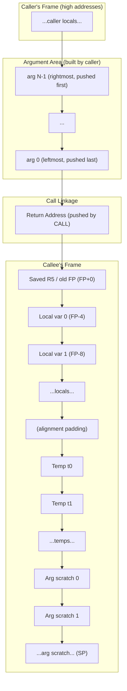
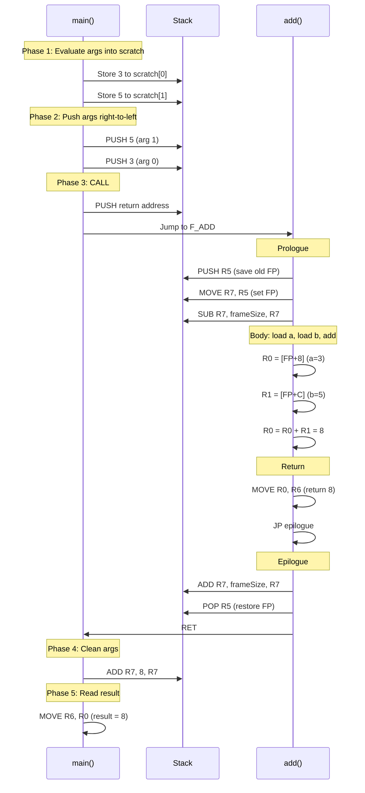
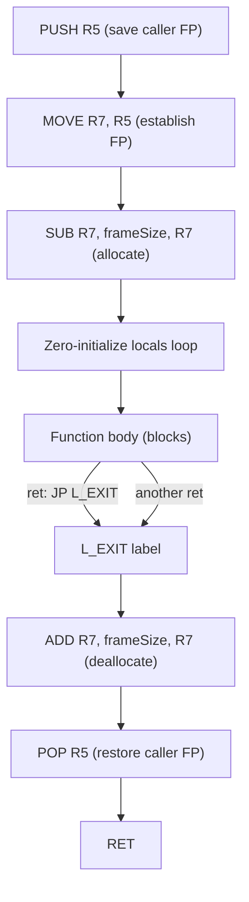
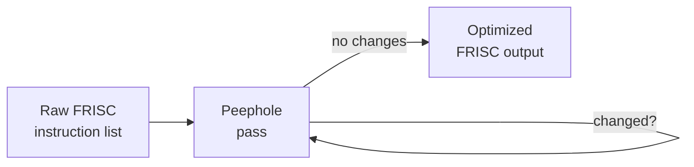
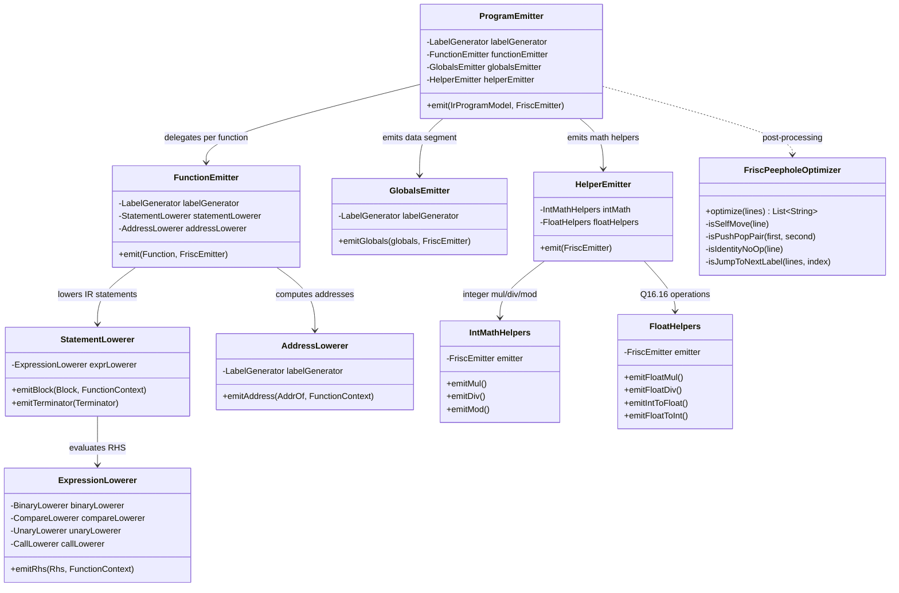

> **📖 From the book.** This chapter accompanies *Building a C-Subset Compiler for the FRISC Architecture: From Formal Languages to Executable Code* by Dr. Karlo Knežević (Zenodo, 2026). For the complete treatment — formal development, proofs, and figures — read the book: [📄 PDF](../book/Building-a-C-Subset-Compiler-for-the-FRISC-Architecture.pdf) · DOI [10.5281/zenodo.20511073](https://doi.org/10.5281/zenodo.20511073) · ISBN 978-953-47198-0-0.

## 8.1 FRISC Architecture Overview
\index{FRISC}\index{RISC}\index{instruction set architecture}

FRISC (FER RISC) is a 32-bit, word-addressed RISC processor designed for educational use at the Faculty of Electrical Engineering and Computing, University of Zagreb. It serves as the sole target architecture for FRISCcc. The code generator module (`compiler-codegen-frisc`, package `hr.fer.ppj.codegen.frisc`) translates typed IR into FRISC assembly text, which can then be executed on the FRISC simulator.

This section provides a complete ISA reference covering every instruction the code generator emits. Understanding FRISC at this level is essential for reading the assembly output and for reasoning about performance characteristics.

### Registers
\index{registers}\index{general-purpose registers}

FRISC provides eight 32-bit general-purpose registers, `R0` through `R7`, plus a 32-bit status register `SR` containing four condition flags. There are no floating-point registers; all floating-point operations use Q16.16 fixed-point representation stored in general-purpose registers.

| Register | Width  | Description                                           |
|----------|--------|-------------------------------------------------------|
| R0       | 32-bit | General purpose; primary expression result            |
| R1       | 32-bit | General purpose; secondary operand / scratch          |
| R2       | 32-bit | General purpose; scratch                              |
| R3       | 32-bit | General purpose; scratch                              |
| R4       | 32-bit | General purpose; scratch                              |
| R5       | 32-bit | Frame Pointer (FP)                                    |
| R6       | 32-bit | Return value register                                 |
| R7       | 32-bit | Stack Pointer (SP)                                    |
| SR       | 32-bit | Status register (flags: Z, V, C, N)                   |

All registers are 32 bits wide with no sub-register addressing. There is no instruction to read or write SR directly; the flags are set implicitly by ALU instructions and consumed by conditional jumps.

### Instruction Format and Encoding
\index{instruction encoding}\index{addressing modes}

Every FRISC instruction is encoded as a single 32-bit word. The encoding format is:

```
[31:27] opcode  [26:24] dest/src1  [23:21] src2  [20] immediate flag  [19:0] immediate/offset
```

When the immediate flag (bit 20) is set, the lower 20 bits encode a sign-extended immediate value. This means immediate operands in ALU instructions are limited to the range -524288 to +524287 (20-bit signed). The `LoweringSupport.fitsSigned20()` method checks this constraint; values outside the range must be loaded through a multi-instruction sequence.

FRISC supports three addressing modes:

| Mode           | Syntax Example     | Description                            |
|----------------|--------------------|----------------------------------------|
| Register       | `MOVE R0, R1`      | Operand is a register                  |
| Immediate      | `ADD R0, 5, R0`    | Operand is a 20-bit signed immediate   |
| Indirect       | `LOAD R0, (R1)`    | Address is taken from a register       |

Memory access instructions (`LOAD`, `STORE`, `LOADB`, `STOREB`) use indirect addressing with an optional offset encoded in the immediate field: `LOAD R0, (R5+8)` loads the word at address `R5 + 8` into `R0`.

### Status Flags
\index{status flags}\index{condition codes}

The status register contains four flags, updated by every ALU instruction (including `CMP`):

| Flag | Name     | Set when...                                            |
|------|----------|--------------------------------------------------------|
| Z    | Zero     | The result of the last ALU operation is zero           |
| V    | Overflow | Signed overflow occurred in the last ALU operation     |
| C    | Carry    | Unsigned carry/borrow occurred in the last operation   |
| N    | Negative | The most significant bit of the result is 1            |

The carry flag plays a dual role: it indicates unsigned overflow from ADD and unsigned borrow from SUB, and it captures the bit shifted out during SHL/SHR operations. The `F_DIV` helper routine relies on the carry flag from SHL to propagate high bits of the dividend into the remainder register, avoiding 64-bit arithmetic entirely.

### Instruction Set Reference
\index{instruction set}

The following tables list every instruction the FRISCcc code generator uses. Instructions not listed here exist in the FRISC specification but are not emitted by the compiler.

**Data Movement:**
\index{MOVE}\index{LOAD}\index{STORE}\index{PUSH}\index{POP}

| Instruction | Operands       | Description                              | Flags |
|-------------|----------------|------------------------------------------|-------|
| `MOVE`      | `src, Rd`      | Copy immediate or register to `Rd`       | None  |
| `LOAD`      | `Rd, (addr)`   | Load 32-bit word from memory to `Rd`     | None  |
| `STORE`     | `Rs, (addr)`   | Store 32-bit word from `Rs` to memory    | None  |
| `LOADB`     | `Rd, (addr)`   | Load byte from memory (zero-extended)    | None  |
| `STOREB`    | `Rs, (addr)`   | Store low byte of `Rs` to memory         | None  |
| `PUSH`      | `Rs`           | Decrement SP by 4, store `Rs` at (SP)    | None  |
| `POP`       | `Rd`           | Load `Rd` from (SP), increment SP by 4   | None  |

`PUSH` and `POP` are pseudo-instructions that combine a stack pointer adjustment with a memory access. `PUSH R0` is equivalent to `SUB R7, 4, R7` followed by `STORE R0, (R7)`. `POP R0` is equivalent to `LOAD R0, (R7)` followed by `ADD R7, 4, R7`.

**Arithmetic and Logic (ALU):**
\index{ALU instructions}\index{ADD}\index{SUB}\index{CMP}\index{SHL}\index{SHR}

| Instruction | Operands          | Description                              | Flags    |
|-------------|-------------------|------------------------------------------|----------|
| `ADD`       | `Rs1, Rs2/imm, Rd`| `Rd = Rs1 + Rs2` (or immediate)         | Z, V, C, N |
| `ADC`       | `Rs1, Rs2/imm, Rd`| `Rd = Rs1 + Rs2 + C` (add with carry)   | Z, V, C, N |
| `SUB`       | `Rs1, Rs2/imm, Rd`| `Rd = Rs1 - Rs2` (or immediate)         | Z, V, C, N |
| `SBC`       | `Rs1, Rs2/imm, Rd`| `Rd = Rs1 - Rs2 - C` (sub with borrow)  | Z, V, C, N |
| `AND`       | `Rs1, Rs2/imm, Rd`| `Rd = Rs1 & Rs2` (bitwise AND)          | Z, N      |
| `OR`        | `Rs1, Rs2/imm, Rd`| `Rd = Rs1 | Rs2` (bitwise OR)           | Z, N      |
| `XOR`       | `Rs1, Rs2/imm, Rd`| `Rd = Rs1 ^ Rs2` (bitwise XOR)          | Z, N      |
| `SHL`       | `Rs1, Rs2/imm, Rd`| `Rd = Rs1 << Rs2` (logical shift left)  | Z, C, N   |
| `SHR`       | `Rs1, Rs2/imm, Rd`| `Rd = Rs1 >> Rs2` (arithmetic shift right)| Z, C, N |
| `CMP`       | `Rs1, Rs2/imm`    | `Rs1 - Rs2`, set flags, discard result  | Z, V, C, N |

There is no hardware multiply or divide instruction. These operations are implemented as software helper routines (`F_MUL`, `F_DIV`, `F_MOD`) emitted on demand by the code generator.

The `ADC` (add with carry) and `SBC` (subtract with borrow) instructions are critical for implementing 64-bit arithmetic in the `F_FMUL` helper. By chaining `ADD` + `ADC` across two register pairs, the code generator accumulates a 64-bit product using only 32-bit registers.

Note that `SHR` performs an *arithmetic* shift right (sign-extending from the MSB). This is the behavior needed for signed integer division by powers of two and for the `F_F2I` conversion helper.

**Control Flow:**
\index{JP}\index{CALL}\index{RET}\index{HALT}

| Instruction | Operands | Description                              |
|-------------|----------|------------------------------------------|
| `JP`        | `addr`   | Unconditional jump                       |
| `JP_cond`   | `addr`   | Conditional jump (see condition table)   |
| `JR`        | `addr`   | Jump relative (PC-relative offset)       |
| `CALL`      | `addr`   | Push PC+4, jump to address               |
| `RET`       | (none)   | Pop PC (return from subroutine)          |
| `HALT`      | (none)   | Stop execution                           |

`CALL` pushes the address of the *next* instruction (PC + 4) onto the stack and jumps to the target address. `RET` pops the saved address from the stack into PC, resuming execution after the call site. The code generator uses `CALL` for all function invocations and `RET` exclusively in function epilogues.

**Branch Conditions:**
\index{branch conditions}\index{conditional execution}

| Condition | Flag Test       | Meaning (signed)          | Meaning (unsigned)    |
|-----------|-----------------|---------------------------|-----------------------|
| `_EQ`     | Z = 1           | Equal                     | Equal                 |
| `_NE`     | Z = 0           | Not equal                 | Not equal             |
| `_SLT`    | N != V          | Signed less than          | --                    |
| `_SLE`    | Z=1 or N!=V     | Signed less or equal      | --                    |
| `_SGT`    | Z=0 and N=V     | Signed greater than       | --                    |
| `_SGE`    | N = V           | Signed greater or equal   | --                    |
| `_ULT`    | C = 1           | --                        | Unsigned less than    |
| `_ULE`    | C=1 or Z=1      | --                        | Unsigned less or equal|
| `_UGT`    | C=0 and Z=0     | --                        | Unsigned greater than |
| `_UGE`    | C = 0           | --                        | Unsigned greater or eq|
| `_N`      | N = 1           | Negative                  | --                    |
| `_NN`     | N = 0           | Non-negative              | --                    |
| `_C`      | C = 1           | Carry set                 | --                    |
| `_NC`     | C = 0           | No carry                  | --                    |
| `_V`      | V = 1           | Overflow                  | --                    |
| `_NV`     | V = 0           | No overflow               | --                    |

The code generator uses the signed comparison conditions (`_SLT`, `_SLE`, `_SGT`, `_SGE`) for `int32` comparisons, `_EQ` / `_NE` for equality and boolean tests, and `_NC` / `_C` in the division and multiplication helpers to test the carry flag after shift operations.

### Memory Model
\index{memory model}\index{address space}

FRISC uses a flat, byte-addressable memory space. Words are 32 bits (4 bytes), and word-aligned loads/stores use `LOAD`/`STORE`. Byte-granularity access uses `LOADB`/`STOREB`, which are essential for `char` variables. There is no hardware-enforced alignment requirement, but unaligned word access may produce undefined results on some simulator implementations.

The address space is 256 KiB (addresses `0x00000` through `0x3FFFF`). Code is loaded starting at address 0. The stack is initialized at `0x40000` and grows downward. There is no memory protection, no virtual memory, and no cache hierarchy. This simplicity means the code generator need not concern itself with cache line alignment or TLB behavior.

**Data directives** for the global data section:

| Directive | Description                          | Example                  |
|-----------|--------------------------------------|--------------------------|
| `DW`      | Define one or more 32-bit words      | `DW 42` or `DW 1, 2, 3` |
| `DB`      | Define one or more bytes             | `DB 72, 101, 108`        |
| `DS`      | Reserve `n` bytes (uninitialized)    | `DS 16`                  |


## 8.2 Register Convention and ABI Summary
\index{ABI}\index{calling convention}\index{register convention}

The compiler assigns fixed roles to specific registers, forming an Application Binary Interface (ABI) that all generated code respects. This section documents the complete register allocation policy and the rationale behind each decision.

### Register Roles

| Register | Role              | Saved by | Rationale                                       |
|----------|-------------------|----------|-------------------------------------------------|
| R7       | Stack Pointer     | N/A      | Hardware convention for `PUSH`/`POP`            |
| R5       | Frame Pointer     | Callee   | Enables constant-offset slot access             |
| R6       | Return Value      | Caller   | Separate from R0 to avoid conflicts             |
| R0       | Expression Result | Caller   | Primary destination for RHS evaluation          |
| R1       | Secondary Operand | Caller   | Right-hand operand in binary ops                |
| R2-R4    | Scratch           | Caller   | Available for intermediate computations         |

### Caller-Saves vs. Callee-Saves
\index{caller-saves}\index{callee-saves}

In the FRISCcc ABI, almost all registers are caller-saves. The only callee-saved register is R5 (FP), which is explicitly pushed in the function prologue and popped in the epilogue. This design minimizes the prologue/epilogue cost (only one register is saved) at the expense of requiring callers to save any live values before making a call. In practice, the code generator avoids this problem entirely: all intermediate values are stored to stack-frame temporaries before any call instruction, so no register contains a live value across a `CALL`.

R7 (SP) is not classified as caller-saves or callee-saves because it is managed structurally. The caller adjusts SP to push arguments, and the callee adjusts it for its frame. Both sides restore SP before returning control.

### Design Rationale

**Why R5 for FP?** R6 is reserved for return values. Using a dedicated register for the frame pointer rather than computing offsets relative to SP simplifies slot addressing: FP remains constant throughout a function's execution regardless of intermediate pushes and pops, making all slot offsets deterministic at compile time. The `FrameAccess` class (in `hr.fer.ppj.codegen.frisc.lowering`) relies on this invariant to emit `LOAD R0, (R5-offset)` and `STORE R0, (R5-offset)` with statically known offsets.

**Why R6 for return values?** Returning in R6 rather than R0 avoids saving and restoring R0 around return-value setup, since R0 is continuously used as the primary expression accumulator during instruction lowering. If R0 were also the return register, every `ret` instruction would need to ensure R0 was not overwritten between the return-value computation and the actual return.

**Why R0 as primary accumulator?** The `ExpressionLowerer` class evaluates every RHS form into R0. This convention eliminates register-selection logic: every expression evaluation has a known destination, and the `BinaryLowerer` always finds the left operand in R0 and the right in R1 after the standard evaluation sequence.

### Stack Pointer Initialization
\index{stack pointer}

R7 is initialized to `0x40000` (256 KiB) at program startup. The stack grows downward (toward lower addresses). This is established by the program entry sequence emitted by `ProgramEmitter`:

```frisc
        MOVE 40000, R7      ; Initialize stack pointer to top of address space
        CALL F_MAIN          ; Call main()
        HALT                 ; Program end
```

The value `40000` is hexadecimal (262144 decimal), placing the initial stack pointer at the top of the 256 KiB address space.


## 8.3 Calling Convention Deep Dive
\index{calling convention}\index{cdecl}\index{argument passing}

The compiler uses a cdecl-style calling convention with caller-cleans-stack semantics. This section specifies the complete ABI for function calls, including argument layout, return values, and stack management.

### ABI Specification Summary

| Property                | Value                                              |
|-------------------------|----------------------------------------------------|
| Argument passing        | On the stack, right-to-left push order             |
| Return value            | In R6                                              |
| Stack cleanup           | Caller (after `CALL` returns)                      |
| Frame pointer           | R5, saved by callee                                |
| Stack alignment          | 4-byte (word-aligned)                              |
| Struct arguments        | Copied byte-by-byte into the parameter area        |
| Variadic functions      | Not supported                                      |

### Argument Passing: Right-to-Left Push
\index{argument passing}\index{right-to-left}

Arguments are evaluated left-to-right into temporary scratch slots within the caller's frame, then pushed onto the stack in right-to-left order. This means the first argument ends up at the lowest stack address (closest to SP), which corresponds to the lowest positive offset from the callee's FP.

The `CallLowerer` class implements two argument-passing strategies:

1. **Layout-based allocation** (when a `ParamLayout` is available): The caller allocates the entire parameter area with a single `SUB R7, totalBytes, R7` and stores each argument at its computed offset. This supports mixed-size parameters (e.g., a `char` parameter occupying 1 byte followed by alignment padding).

2. **Push-based allocation** (fallback): Each argument is pushed individually using `PUSH R0`, allocating 4 bytes per argument regardless of type. This is used when the callee's parameter layout is not available (e.g., for external functions).

```c
// C source
int result = add(3, 5);
```

The generated FRISC for the call site:

```frisc
; Phase 1: Evaluate arguments into scratch slots
        MOVE 3, R0               ; Evaluate arg 0 (value 3)
        STORE R0, (R5-scratch0)  ; Save to arg scratch slot 0
        MOVE 5, R0               ; Evaluate arg 1 (value 5)
        STORE R0, (R5-scratch1)  ; Save to arg scratch slot 1

; Phase 2: Push arguments right-to-left
        LOAD R0, (R5-scratch1)   ; Load arg 1 (rightmost first)
        PUSH R0                  ; Push 5
        LOAD R0, (R5-scratch0)   ; Load arg 0
        PUSH R0                  ; Push 3

; Phase 3: Call
        CALL F_ADD               ; Pushes return address, jumps to F_ADD

; Phase 4: Clean stack (2 args * 4 bytes = 8)
        ADD  R7, 8, R7           ; Caller removes arguments from stack

; Phase 5: Read return value
        MOVE R6, R0              ; Copy return value from R6 to R0
```

The two-phase approach (evaluate into scratch, then push) is necessary because argument expressions may themselves contain function calls. If arguments were pushed directly during evaluation, a nested call would corrupt the partially-built argument list on the stack. The scratch area isolates argument evaluation from argument passing.

### Return Value Convention
\index{return value}\index{R6}

The return value is placed in R6 by the callee. At each `ret` instruction, the `StatementLowerer` emits:

```frisc
        MOVE R0, R6              ; Copy result to return register
        JP   L_EXIT_F_name       ; Jump to shared epilogue
```

After `CALL` returns, the caller reads R6:

```frisc
        MOVE R6, R0              ; Move return value to working register
```

For void functions, R6 is set to 0 by convention, but the caller ignores it.

### Stack Frame Layout
\index{stack frame}\index{frame layout}

The complete stack frame, viewed from the callee's perspective:



The offset table from the frame pointer:

| Region          | Offset from FP              | Size                    |
|-----------------|-----------------------------|-------------------------|
| Return address  | FP + 4                      | 4 bytes                 |
| Saved FP        | FP + 0                      | 4 bytes                 |
| Parameters      | FP + 8 upward               | varies                  |
| Local variables | FP - 4 downward             | `localsAreaSize` bytes  |
| IR temporaries  | FP - localsArea - 4*(i+1)   | `tempAreaSize` bytes    |
| Arg scratch     | Bottom of frame             | `argScratchSize` bytes  |

### Complete Call Walkthrough: `add(3, 5)`

Consider calling `int result = add(3, 5)` where `add` computes `a + b`.

**C source:**
```c
int add(int a, int b) { return a + b; }
int main() { int result = add(3, 5); return result; }
```

**IR for the call site:**
```
  t5 = call add(#3:int32, #5:int32) : int32
  store [local:result], t5
```

The following diagram shows the stack state at each phase of the call:



**Stack snapshot at the moment the callee's body begins executing** (after prologue completes):

```
High addresses
+---------------------------+
| main's frame              |
| ...                       |
+---------------------------+
| arg 0 (value 3)           |  FP + 8   (parameter a)
+---------------------------+
| arg 1 (value 5)           |  FP + 12  (parameter b)
+---------------------------+
| Return address             |  FP + 4
+---------------------------+
| Saved R5 (old FP)         |  FP + 0   <-- R5 (FP) points here
+---------------------------+
| Temp t0                   |  FP - 4
+---------------------------+
| Temp t1                   |  FP - 8
+---------------------------+
| ...                       |  <-- R7 (SP)
+---------------------------+
Low addresses
```


## 8.4 Function Prologue and Epilogue
\index{prologue}\index{epilogue}\index{stack frame}

Every function body is bracketed by a prologue that establishes the stack frame and an epilogue that tears it down. The `FunctionEmitter` class generates both sequences, ensuring consistent frame management across all functions.

### Prologue
\index{function prologue}

The prologue performs four tasks: save the caller's frame pointer, establish the new frame pointer, allocate the stack frame, and zero-initialize local variables.

```frisc
F_func_name                      ; Function label
        PUSH R5                  ; 1. Save caller's frame pointer
        MOVE R7, R5              ; 2. Establish new frame pointer
        SUB  R7, frameSize, R7   ; 3. Allocate stack frame
        ; ... zero-initialize local variables (step 4) ...
```

**Step 1: Save the caller's FP.** `PUSH R5` decrements SP by 4 and stores R5 at the new SP. This preserves the caller's frame pointer so it can be restored in the epilogue. Since R5 is the only callee-saved register, this single `PUSH` constitutes the entire register save.

**Step 2: Establish the new FP.** `MOVE R7, R5` sets the frame pointer to the current stack pointer. From this point forward, all local variables and temporaries are accessed at fixed offsets from R5, regardless of any subsequent pushes or pops that modify R7.

**Step 3: Allocate the frame.** `SUB R7, frameSize, R7` moves SP downward by the frame size, reserving space for locals, temporaries, and argument scratch.

**Step 4: Zero-initialize locals.** The local variable area is zeroed using a counted loop. This ensures that all local variables start as zero (matching C's behavior for variables with no explicit initializer in FRISCcc):

```frisc
        MOVE wordCount, R1       ; Number of 4-byte words to zero
        MOVE R5, R0              ; Base: frame pointer
        SUB  R0, localZeroBytes, R0  ; Point to start of local area
        MOVE 0, R2               ; Value: zero
L_ZERO  STORE R2, (R0)           ; Clear one word
        ADD  R0, 4, R0           ; Advance pointer
        SUB  R1, 1, R1           ; Decrement counter
        JP_NE L_ZERO             ; Loop until all words zeroed
```

The `wordCount` is `alignTo(localsAreaSize, 4) / 4`, rounding up to cover any partial trailing word. The zero loop is skipped entirely when `wordCount` is zero (no local variables).

### Frame Size Computation
\index{frame size}\index{alignment}

The frame size is computed by `FunctionEmitter` as:

```
frameSize = alignTo(localsAreaSize + tempAreaSize + argScratchSize, 4)
```

where:

- **`localsAreaSize`**: The byte count declared by the IR's `locals_bytes` field, padded to 4-byte alignment if temporaries or argument scratch are needed. The padding (computed as `alignTo(locals_bytes + 3, 4)`) prevents byte stores into trailing `char` locals from clobbering the first byte of the word-aligned temp area.

- **`tempAreaSize`**: `(maxTempIndex + 1) * 4`. One 32-bit word per IR temporary, regardless of the temporary's type. Even `char`-typed temporaries occupy a full word slot; `FrameAccess.loadTemp` applies `AND R0, 0xFF, R0` to clamp the loaded value.

- **`argScratchSize`**: `maxCallArgs * 4`. Scratch space for pre-evaluating call arguments before pushing them. This area is at the bottom of the frame (lowest addresses).

The final `alignTo(..., 4)` ensures the total frame size is word-aligned, maintaining the invariant that SP is always word-aligned.

### Example: Frame Size for a Function with 2 Locals and 3 Temps

```c
int example(int a) {
    int x = a + 1;    // local: x (4 bytes)
    char c = 'A';     // local: c (1 byte)
    // ... body uses 3 temporaries and calls a 1-arg function ...
}
```

- `locals_bytes` = 5 (4 for `int x` + 1 for `char c`)
- With temps needed: `localsAreaSize = alignTo(5 + 3, 4) = 8`
- `tempAreaSize = 3 * 4 = 12`
- `argScratchSize = 1 * 4 = 4`
- `frameSize = alignTo(8 + 12 + 4, 4) = 24`

### Epilogue
\index{function epilogue}

The epilogue reverses the prologue's frame setup:

```frisc
L_EXIT_F_func_name               ; Epilogue label
        ADD  R7, frameSize, R7   ; Deallocate frame (restore SP)
        POP  R5                  ; Restore caller's FP
        RET                      ; Return to caller (pop return address into PC)
```

All return paths within a function jump to the shared epilogue label (`L_EXIT_F_func_name`) rather than emitting their own cleanup code. This single-exit-point design ensures consistent frame deallocation. The `StatementLowerer.emitTerminator` method emits `JP L_EXIT_F_name` for every `ret` instruction in the IR.

### Prologue/Epilogue Visualized



Note that there may be multiple `JP L_EXIT` instructions within the function body (one per `ret` in the IR), but there is only one copy of the deallocation/restore/return sequence.


## 8.5 Instruction Selection
\index{instruction selection}\index{lowering}

Instruction selection is the process of mapping each IR instruction to one or more FRISC assembly instructions. The `ExpressionLowerer` class is the central dispatcher, delegating to specialized lowerers (`BinaryLowerer`, `CompareLowerer`, `UnaryLowerer`, `CallLowerer`, `AddressLowerer`) based on the IR instruction form.

The fundamental contract is: **after evaluating any RHS expression, the result is in R0.** The `StatementLowerer` then stores R0 to the destination temporary via `FrameAccess.storeTemp`.

### Binary Operations
\index{binary operations}\index{ADD}\index{SUB}

For native ALU operations (ADD, SUB, AND, OR, XOR, SHL, SHR), the `BinaryLowerer` follows a standard three-step pattern:

1. Evaluate the left operand into R0.
2. Push R0 to the stack, evaluate the right operand into R0, move R0 to R1, pop R0 from the stack.
3. Execute the FRISC instruction with R0 and R1 as operands, result in R0.

```frisc
; IR: t3 = add t1, t2 : int32
        LOAD R0, (R5-offset_t1)  ; Evaluate left (load temp t1)
        PUSH R0                  ; Save left on stack
        LOAD R0, (R5-offset_t2)  ; Evaluate right (load temp t2)
        MOVE R0, R1              ; Move right to R1
        POP  R0                  ; Restore left to R0
        ADD  R0, R1, R0          ; R0 = left + right
```

The push/pop sequence is necessary because FRISC has no three-address instructions that can read two arbitrary frame slots simultaneously. Both operands must be in registers before the ALU instruction executes.

The complete mapping from IR binary operators to FRISC instructions:

| IR Operator | FRISC Instruction | Hardware? | Notes                      |
|-------------|-------------------|-----------|----------------------------|
| `add`       | `ADD`             | Yes       | Native                     |
| `sub`       | `SUB`             | Yes       | Native                     |
| `and`       | `AND`             | Yes       | Bitwise                    |
| `or`        | `OR`              | Yes       | Bitwise                    |
| `xor`       | `XOR`             | Yes       | Bitwise                    |
| `shl`       | `SHL`             | Yes       | Logical shift left         |
| `shr`       | `SHR`             | Yes       | Arithmetic shift right     |
| `mul`       | `CALL F_MUL`      | No        | Software helper            |
| `div`       | `CALL F_DIV`      | No        | Software helper            |
| `mod`       | `CALL F_MOD`      | No        | Software helper            |

For multiply, divide, and modulo, the `BinaryLowerer` pushes both operands and calls the appropriate helper routine:

```frisc
; IR: t3 = mul t1, t2 : int32
        ; ... evaluate left to R0, right to R1 ...
        MOVE R1, R2              ; Copy right operand
        PUSH R2                  ; Push right as second arg
        PUSH R0                  ; Push left as first arg
        CALL F_MUL               ; Software multiplication
        ADD  R7, 8, R7           ; Clean 2 arguments (8 bytes)
        MOVE R6, R0              ; Move result from R6 to R0
```

### Comparison Operations
\index{comparison}\index{CMP}

The `CompareLowerer` materializes boolean values (0 or 1) from comparisons using a branch-based pattern:

```frisc
; IR: t3 = cmp_lt t1, t2 : int32
        ; ... evaluate left to R0, right to R1 ...
        CMP  R0, R1              ; Compare left vs right
        JP_SLT L_CMP_TRUE_42    ; If less-than, jump to true
        MOVE 0, R0               ; False path: result = 0
        JP   L_CMP_END_42       ; Skip true path
L_CMP_TRUE_42
        MOVE 1, R0               ; True path: result = 1
L_CMP_END_42
```

The condition code mapping:

| IR Operator | FRISC Condition | Flag Test                   |
|-------------|-----------------|------------------------------|
| `EQ`        | `JP_EQ`         | Z = 1                       |
| `NE`        | `JP_NE`         | Z = 0                       |
| `LT`        | `JP_SLT`        | N != V (signed less)        |
| `LE`        | `JP_SLE`        | Z=1 or N!=V                 |
| `GT`        | `JP_SGT`        | Z=0 and N=V                 |
| `GE`        | `JP_SGE`        | N = V (signed greater/equal)|

Each comparison generates 5 instructions (CMP, conditional JP, MOVE 0, JP, MOVE 1) plus two labels. The peephole optimizer can remove the final `JP` if `L_CMP_END` immediately follows.

### Load and Store Patterns
\index{LOAD}\index{STORE}\index{memory access}

**Word load** (`load int32 / bool / float / ptr`):
```frisc
        LOAD R0, (R0)            ; Load 32-bit word from address in R0
```

**Byte load** (`load char / uchar`):
```frisc
        LOADB R0, (R0)           ; Load byte from address in R0 (zero-extended)
```

**Word store:** The address is evaluated first, pushed to the stack, then the value is evaluated into R0, and the address is popped into R1:
```frisc
        ; Address already in R0 from addr computation
        PUSH R0                  ; Save address
        ; ... evaluate value into R0 ...
        POP  R1                  ; Restore address into R1
        STORE R0, (R1)           ; Store 32-bit word
```

**Byte store:**
```frisc
        ; Same address/value setup as word store
        STOREB R0, (R1)          ; Store low byte of R0
```

This address-first-then-value ordering is mandated by the `StatementLowerer.emitStore` method: it evaluates the address into R0, pushes it, evaluates the value into R0, then pops the address into R1.

### Cast Operations
\index{cast}\index{type conversion}

Cast operations are handled by the `UnaryLowerer`:

| Cast       | Source     | Target     | FRISC Code                                 |
|------------|-----------|------------|---------------------------------------------|
| TRUNC/ZEXT | int32     | char       | `AND R0, 0FF, R0`                          |
| SEXT       | char      | int32      | `SHL R0, 18, R0` then `SHR R0, 18, R0`    |
| ITOF       | int32     | Q16.16     | `CALL F_I2F` (shift left 16)               |
| FTOI       | Q16.16    | int32      | `CALL F_F2I` (arith shift right 16)        |
| PTRCAST    | any ptr   | any ptr    | No-op (all pointers are 32-bit addresses)  |

The SEXT (sign-extend from char) sequence shifts the 8-bit value to the top of the 32-bit word, then arithmetic-shifts it back, propagating the sign bit. `0x18` hex = 24 decimal, so bits [7:0] are moved to [31:24] and then sign-extended back to [31:0].


## 8.6 Expression Evaluation Strategy
\index{expression evaluation}\index{register allocation}\index{temp spilling}

The FRISCcc code generator does not perform register allocation in the traditional sense. Instead, it uses a simple strategy: evaluate every subexpression into R0, spill intermediate results to stack-frame temporaries, and reload them when needed. This section describes the strategy in detail and walks through a concrete example.

### R0/R1 as the Work Register Pair

All expression evaluation funnels through two registers:

- **R0**: The primary accumulator. Every expression evaluation leaves its result in R0. Every `emitRhs` call in `ExpressionLowerer` produces a value in R0.
- **R1**: The secondary operand register. Binary operations move the right operand to R1 before executing the ALU instruction.

Registers R2-R4 are used only by helper routines (multiplication, division) and by specialized lowering patterns (the inline shift-and-add multiplication for small constants uses R2 and R3).

### Temporary Spilling
\index{spilling}\index{temporaries}

Every IR temporary (`t0`, `t1`, `t2`, ...) has a dedicated 4-byte slot in the stack frame's temp area. After evaluating an IR instruction like `t3 = add t1, t2`, the result in R0 is immediately stored to `t3`'s slot:

```frisc
        ; ... evaluate add into R0 ...
        STORE R0, (R5-offset_t3)  ; Spill result to frame
```

When `t3` is later used as an operand, it is loaded back:

```frisc
        LOAD R0, (R5-offset_t3)   ; Reload from frame
```

The `FrameAccess` class manages the mapping from temp indices to frame offsets. The `FunctionContext` pre-computes a `Map<Integer, Integer>` of temp offsets during function setup:

```
temp t_i offset = -(localsAreaSize + 4 * (i + 1))
```

This means temp `t0` is at `FP - (localsAreaSize + 4)`, `t1` at `FP - (localsAreaSize + 8)`, and so on.

### Walkthrough: `(a + b) * (c - d)`
\index{expression walkthrough}

Consider the expression `(a + b) * (c - d)` where `a`, `b`, `c`, `d` are local `int32` variables. The IR might be:

```
  t0 = addr_of_symbol local a
  t1 = load int32 t0
  t2 = addr_of_symbol local b
  t3 = load int32 t2
  t4 = add t1, t3 : int32
  t5 = addr_of_symbol local c
  t6 = load int32 t5
  t7 = addr_of_symbol local d
  t8 = load int32 t7
  t9 = sub t6, t8 : int32
  t10 = mul t4, t9 : int32
```

The generated FRISC (simplified, showing key operations):

```frisc
; t1 = load a
        MOVE R5, R0
        SUB  R0, 4, R0           ; Address of a (FP-4)
        LOAD R0, (R0)            ; R0 = a
        STORE R0, (R5-temp_t1)   ; Spill t1

; t3 = load b
        MOVE R5, R0
        SUB  R0, 8, R0           ; Address of b (FP-8)
        LOAD R0, (R0)            ; R0 = b
        STORE R0, (R5-temp_t3)   ; Spill t3

; t4 = add t1, t3
        LOAD R0, (R5-temp_t1)    ; Reload t1 (= a)
        PUSH R0                  ; Save left
        LOAD R0, (R5-temp_t3)    ; Reload t3 (= b)
        MOVE R0, R1              ; R1 = b
        POP  R0                  ; R0 = a
        ADD  R0, R1, R0          ; R0 = a + b
        STORE R0, (R5-temp_t4)   ; Spill t4

; t6 = load c, t8 = load d (similar pattern, stored to temp_t6, temp_t8)

; t9 = sub t6, t8
        LOAD R0, (R5-temp_t6)    ; Reload t6 (= c)
        PUSH R0                  ; Save left
        LOAD R0, (R5-temp_t8)    ; Reload t8 (= d)
        MOVE R0, R1              ; R1 = d
        POP  R0                  ; R0 = c
        SUB  R0, R1, R0          ; R0 = c - d
        STORE R0, (R5-temp_t9)   ; Spill t9

; t10 = mul t4, t9
        LOAD R0, (R5-temp_t4)    ; Reload t4 (= a + b)
        PUSH R0                  ; Save left
        LOAD R0, (R5-temp_t9)    ; Reload t9 (= c - d)
        MOVE R0, R1              ; R1 = c - d
        POP  R0                  ; R0 = a + b
        MOVE R1, R2              ; Copy right for helper
        PUSH R2                  ; Push right arg
        PUSH R0                  ; Push left arg
        CALL F_MUL               ; Software multiply
        ADD  R7, 8, R7           ; Clean args
        MOVE R6, R0              ; R0 = (a + b) * (c - d)
        STORE R0, (R5-temp_t10)  ; Spill t10
```

### Performance Cost of Spilling

The spill-everywhere strategy is simple and correct but generates significant memory traffic. Every intermediate value is written to memory and read back, even if it is used only once in the very next instruction. For the expression above, the `add` result (`t4`) is stored and then immediately reloaded as the left operand of `mul`.

This overhead is mitigated by two factors:

1. **Middle-end optimizations** (constant folding, copy propagation, dead code elimination) reduce the number of temporaries before code generation.
2. **The FRISC simulator has zero-latency memory**, so loads and stores do not incur cache miss penalties. On real hardware, this strategy would be unacceptable, but for the educational target it produces correct code with minimal compiler complexity.


## 8.7 Control Flow Generation
\index{control flow}\index{branch}\index{jump}

The IR represents control flow through basic blocks connected by terminator instructions. The `StatementLowerer.emitTerminator` method lowers three terminator forms into FRISC instructions.

### Block Labels
\index{labels}\index{basic blocks}

Each IR block receives a unique FRISC label generated by `LabelGenerator.blockLabel`. The label format is `L_funcName_blockName`, ensuring uniqueness across functions. The `FunctionEmitter` emits labels before each block's instructions:

```frisc
L_MAIN_ENTRY                     ; Block: entry
        ; ... instructions ...
L_MAIN_IF_TRUE                   ; Block: if_true
        ; ... instructions ...
L_MAIN_IF_END                    ; Block: if_end
        ; ... instructions ...
```

### Conditional Branch: `br cond, trueLabel, falseLabel`
\index{conditional branch}

The conditional branch evaluates the condition value, tests it against zero, and jumps accordingly:

```frisc
; IR: br t5, then_block, else_block
        LOAD R0, (R5-temp_t5)    ; Load condition value
        CMP  R0, 0               ; Test: is condition nonzero?
        JP_NE L_FUNC_THEN_BLOCK  ; If nonzero (true), jump to true target
        JP   L_FUNC_ELSE_BLOCK   ; Otherwise, fall through to false target
```

The condition is always treated as a boolean: any nonzero value is true, zero is false. This matches C semantics. The `CMP R0, 0` instruction sets the Z flag, and `JP_NE` branches when Z=0 (i.e., the value is nonzero).

Note that the false branch uses an unconditional `JP` rather than relying on fall-through. This simplifies code generation because blocks may be reordered. The peephole optimizer removes the `JP` if the false target is the immediately following label.

### Unconditional Jump: `jmp targetLabel`
\index{unconditional jump}

```frisc
; IR: jmp merge_block
        JP   L_FUNC_MERGE_BLOCK  ; Jump to target block
```

Unconditional jumps typically appear at the end of `then` or `else` blocks, jumping to the merge point after an if-else construct. They also appear as loop back-edges.

### Return: `ret value` / `ret`
\index{return instruction}

**Valued return:**
```frisc
; IR: ret t3
        LOAD R0, (R5-temp_t3)    ; Load return value
        MOVE R0, R6              ; Set return value in R6
        JP   L_EXIT_F_FUNC       ; Jump to shared epilogue
```

**Void return:**
```frisc
; IR: ret
        MOVE 0, R6               ; Return 0 (void convention)
        JP   L_EXIT_F_FUNC       ; Jump to shared epilogue
```

All return paths converge on the single epilogue label. This is critical for correctness: without a unified epilogue, each return would need its own frame deallocation code, creating opportunities for bugs if the frame size changes.

### Control Flow Example: If-Else

For the C code `if (x > 0) { y = 1; } else { y = -1; }`, the IR contains three blocks: the entry block (with the branch), the then block, and the else block, plus a merge block. The generated FRISC flow:

```frisc
; Entry block: evaluate condition and branch
        ; ... compute x > 0 into t5 ...
        LOAD R0, (R5-temp_t5)
        CMP  R0, 0
        JP_NE L_FUNC_THEN
        JP   L_FUNC_ELSE

; Then block
L_FUNC_THEN
        MOVE 1, R0               ; y = 1
        ; ... store to y ...
        JP   L_FUNC_MERGE

; Else block
L_FUNC_ELSE
        MOVE -1, R0              ; y = -1
        ; ... store to y ...
        JP   L_FUNC_MERGE        ; (may be optimized away if merge follows)

; Merge block
L_FUNC_MERGE
        ; ... continue ...
```


## 8.8 Side-by-Side Source to IR to FRISC Examples
\index{code generation examples}

This section presents four complete examples showing the transformation from C source through IR to FRISC assembly. Each example includes the source code, the optimized IR, and the generated FRISC with detailed commentary.

### Example 1: Simple Assignment
\index{assignment}

**C Source:**
```c
int main() {
    int x = 5;
    return x;
}
```

**Optimized IR:**
```
function main() -> int32
  locals_bytes: 4
  slots: [local x int32 offset=0]

block entry:
  t0 = const #5 : int32
  t1 = addr_of_symbol local x
  store int32 t1, t0
  t2 = addr_of_symbol local x
  t3 = load int32 t2
  ret t3
```

**Generated FRISC:**
```frisc
F_MAIN                           ; Function: main
        PUSH R5                  ; Save caller's FP
        MOVE R7, R5              ; Establish FP
        SUB  R7, %18, R7        ; Allocate 24 bytes (4 local + 16 temp)

        ; Zero-initialize locals
        MOVE 1, R1               ; 1 word to zero
        MOVE R5, R0
        SUB  R0, 4, R0           ; Point to local area
        MOVE 0, R2
L_ZERO_0
        STORE R2, (R0)           ; Clear word
        ADD  R0, 4, R0
        SUB  R1, 1, R1
        JP_NE L_ZERO_0

L_MAIN_ENTRY
; t0 = const #5 : int32
        MOVE 5, R0               ; Load constant 5
        STORE R0, (R5-8)         ; Store temp t0

; t1 = addr_of_symbol local x
        MOVE R5, R0
        SUB  R0, 4, R0           ; Address of x (FP-4)
        STORE R0, (R5-%C)        ; Store temp t1

; store int32 t1, t0
        LOAD R0, (R5-%C)         ; Load address (t1)
        PUSH R0                  ; Save address
        LOAD R0, (R5-8)          ; Load value (t0 = 5)
        POP  R1                  ; Restore address
        STORE R0, (R1)           ; *x = 5

; t2 = addr_of_symbol local x
        MOVE R5, R0
        SUB  R0, 4, R0           ; Address of x (FP-4)
        STORE R0, (R5-%10)       ; Store temp t2

; t3 = load int32 t2
        LOAD R0, (R5-%10)        ; Load address (t2)
        LOAD R0, (R0)            ; Load value: R0 = x = 5
        STORE R0, (R5-%14)       ; Store temp t3

; ret t3
        LOAD R0, (R5-%14)        ; Load t3
        MOVE R0, R6              ; Return value = 5
        JP   L_EXIT_F_MAIN

L_EXIT_F_MAIN                   ; Epilogue
        ADD  R7, %18, R7        ; Deallocate 24 bytes
        POP  R5                  ; Restore FP
        RET                      ; Return
```

**Key observations:** Even for this trivial program, the code generator produces 30+ instructions due to the spill-everywhere strategy. Every temporary is stored and reloaded. The middle-end optimizer reduces the number of temporaries, but the code generator does not elide redundant loads/stores. The peephole optimizer may clean up some patterns, but the fundamental overhead of temp spilling remains.

### Example 2: Arithmetic Expression
\index{arithmetic expression}

**C Source:**
```c
int compute(int a, int b, int c) {
    int y = a + b * c;
    return y;
}
```

**Optimized IR:**
```
function compute(a: int32, b: int32, c: int32) -> int32
  locals_bytes: 4
  slots: [param a int32 offset=0, param b int32 offset=4,
          param c int32 offset=8, local y int32 offset=0]

block entry:
  t0 = addr_of_symbol param b
  t1 = load int32 t0
  t2 = addr_of_symbol param c
  t3 = load int32 t2
  t4 = mul t1, t3 : int32
  t5 = addr_of_symbol param a
  t6 = load int32 t5
  t7 = add t6, t4 : int32
  t8 = addr_of_symbol local y
  store int32 t8, t7
  t9 = addr_of_symbol local y
  t10 = load int32 t9
  ret t10
```

**Generated FRISC (key excerpt -- multiplication and addition):**
```frisc
; t1 = load b (from parameter area)
        MOVE R5, R0
        ADD  R0, %C, R0          ; Address of b: FP + 12
        LOAD R0, (R0)            ; R0 = b
        STORE R0, (R5-temp_t1)

; t3 = load c
        MOVE R5, R0
        ADD  R0, %10, R0         ; Address of c: FP + 16
        LOAD R0, (R0)            ; R0 = c
        STORE R0, (R5-temp_t3)

; t4 = mul t1, t3 : int32  (b * c, requires software multiply)
        LOAD R0, (R5-temp_t1)    ; Load t1 (= b)
        PUSH R0                  ; Save left
        LOAD R0, (R5-temp_t3)    ; Load t3 (= c)
        MOVE R0, R1              ; R1 = c
        POP  R0                  ; R0 = b
        MOVE R1, R2              ; Copy right
        PUSH R2                  ; Push c (right arg)
        PUSH R0                  ; Push b (left arg)
        CALL F_MUL               ; Software multiply: b * c
        ADD  R7, 8, R7           ; Clean 2 args
        MOVE R6, R0              ; R0 = b * c
        STORE R0, (R5-temp_t4)

; t6 = load a
        MOVE R5, R0
        ADD  R0, 8, R0           ; Address of a: FP + 8
        LOAD R0, (R0)            ; R0 = a
        STORE R0, (R5-temp_t6)

; t7 = add t6, t4 : int32  (a + b*c, native ADD)
        LOAD R0, (R5-temp_t6)    ; Load t6 (= a)
        PUSH R0                  ; Save left
        LOAD R0, (R5-temp_t4)    ; Load t4 (= b*c)
        MOVE R0, R1              ; R1 = b*c
        POP  R0                  ; R0 = a
        ADD  R0, R1, R0          ; R0 = a + b*c
        STORE R0, (R5-temp_t7)

; ... store t7 to y, load y, return ...
```

**Key observations:** The multiplication `b * c` requires calling the `F_MUL` helper, which internally executes up to 32 loop iterations. If the middle-end optimizer determines that `b` or `c` is a small constant or power of two, the `BinaryLowerer`'s fast-path will emit an inline shift or shift-and-add sequence instead, avoiding the helper call entirely. The addition `a + b*c` uses a single native `ADD` instruction.

### Example 3: If-Else Statement
\index{if-else}\index{conditional}

**C Source:**
```c
int sign(int x) {
    int y;
    if (x > 0) {
        y = 1;
    } else {
        y = -1;
    }
    return y;
}
```

**Optimized IR:**
```
function sign(x: int32) -> int32
  locals_bytes: 4
  slots: [param x int32 offset=0, local y int32 offset=0]

block entry:
  t0 = addr_of_symbol param x
  t1 = load int32 t0
  t2 = cmp_gt t1, #0 : int32
  br t2, if_true, if_false

block if_true:
  t3 = const #1 : int32
  t4 = addr_of_symbol local y
  store int32 t4, t3
  jmp if_end

block if_false:
  t5 = const #-1 : int32
  t6 = addr_of_symbol local y
  store int32 t6, t5
  jmp if_end

block if_end:
  t7 = addr_of_symbol local y
  t8 = load int32 t7
  ret t8
```

**Generated FRISC:**
```frisc
F_SIGN
        PUSH R5
        MOVE R7, R5
        SUB  R7, %28, R7        ; Allocate frame (locals + 9 temps)
        ; ... zero-init locals ...

L_SIGN_ENTRY
; t1 = load x
        MOVE R5, R0
        ADD  R0, 8, R0           ; Address of x (FP+8)
        LOAD R0, (R0)            ; R0 = x
        STORE R0, (R5-temp_t1)

; t2 = cmp_gt t1, #0  (x > 0?)
        LOAD R0, (R5-temp_t1)    ; R0 = x
        PUSH R0                  ; Save left
        MOVE 0, R0               ; Right = 0
        MOVE R0, R1              ; R1 = 0
        POP  R0                  ; R0 = x
        CMP  R0, R1              ; Compare x vs 0
        JP_SGT L_CMP_TRUE_1     ; If x > 0, jump to true
        MOVE 0, R0               ; False: t2 = 0
        JP   L_CMP_END_1
L_CMP_TRUE_1
        MOVE 1, R0               ; True: t2 = 1
L_CMP_END_1
        STORE R0, (R5-temp_t2)

; br t2, if_true, if_false
        LOAD R0, (R5-temp_t2)    ; Load condition
        CMP  R0, 0               ; Nonzero?
        JP_NE L_SIGN_IF_TRUE     ; Yes -> then
        JP   L_SIGN_IF_FALSE     ; No -> else

L_SIGN_IF_TRUE
; t3 = const #1
        MOVE 1, R0
        STORE R0, (R5-temp_t3)
; store y = t3
        MOVE R5, R0
        SUB  R0, 4, R0           ; Address of y
        PUSH R0
        LOAD R0, (R5-temp_t3)    ; Value = 1
        POP  R1
        STORE R0, (R1)           ; y = 1
; jmp if_end
        JP   L_SIGN_IF_END

L_SIGN_IF_FALSE
; t5 = const #-1
        MOVE -1, R0              ; Load -1 (0xFFFFFFFF)
        STORE R0, (R5-temp_t5)
; store y = t5
        MOVE R5, R0
        SUB  R0, 4, R0           ; Address of y
        PUSH R0
        LOAD R0, (R5-temp_t5)    ; Value = -1
        POP  R1
        STORE R0, (R1)           ; y = -1
; jmp if_end
        JP   L_SIGN_IF_END

L_SIGN_IF_END
; t8 = load y
        MOVE R5, R0
        SUB  R0, 4, R0
        LOAD R0, (R0)            ; R0 = y
        STORE R0, (R5-temp_t8)
; ret t8
        LOAD R0, (R5-temp_t8)
        MOVE R0, R6              ; Return y
        JP   L_EXIT_F_SIGN

L_EXIT_F_SIGN
        ADD  R7, %28, R7
        POP  R5
        RET
```

**Key observations:** The comparison `x > 0` is first materialized as a boolean (0 or 1) in temp `t2`, then tested by the branch. This two-step process (materialize, then branch on the materialized value) is inherent to the IR design where comparisons are expressions that produce values, not control flow primitives. A more aggressive backend could fuse the comparison and branch into a single `CMP` + `JP_SGT` sequence, eliminating the intermediate boolean materialization.

### Example 4: While Loop
\index{while loop}\index{loop}

**C Source:**
```c
int sum_to(int n) {
    int sum = 0;
    int i = 0;
    while (i < n) {
        sum = sum + i;
        i = i + 1;
    }
    return sum;
}
```

**Optimized IR:**
```
function sum_to(n: int32) -> int32
  locals_bytes: 8
  slots: [param n int32 offset=0, local sum int32 offset=0,
          local i int32 offset=4]

block entry:
  t0 = addr_of_symbol local sum
  store int32 t0, #0
  t1 = addr_of_symbol local i
  store int32 t1, #0
  jmp loop_cond

block loop_cond:
  t2 = addr_of_symbol local i
  t3 = load int32 t2
  t4 = addr_of_symbol param n
  t5 = load int32 t4
  t6 = cmp_lt t3, t5 : int32
  br t6, loop_body, loop_end

block loop_body:
  t7 = addr_of_symbol local sum
  t8 = load int32 t7
  t9 = addr_of_symbol local i
  t10 = load int32 t9
  t11 = add t8, t10 : int32
  t12 = addr_of_symbol local sum
  store int32 t12, t11
  t13 = addr_of_symbol local i
  t14 = load int32 t13
  t15 = add t14, #1 : int32
  t16 = addr_of_symbol local i
  store int32 t16, t15
  jmp loop_cond

block loop_end:
  t17 = addr_of_symbol local sum
  t18 = load int32 t17
  ret t18
```

**Generated FRISC (key excerpts):**
```frisc
F_SUM_TO
        PUSH R5
        MOVE R7, R5
        SUB  R7, %50, R7        ; Allocate frame (8 local + lots of temps)
        ; ... zero-init locals ...

L_SUM_TO_ENTRY
; Initialize sum = 0, i = 0 (locals already zeroed, but explicit stores)
        ; ... store 0 to sum, store 0 to i ...
        JP   L_SUM_TO_LOOP_COND ; Jump to loop condition

L_SUM_TO_LOOP_COND
; t3 = load i
        MOVE R5, R0
        SUB  R0, 8, R0           ; Address of i (FP-8)
        LOAD R0, (R0)            ; R0 = i
        STORE R0, (R5-temp_t3)

; t5 = load n
        MOVE R5, R0
        ADD  R0, 8, R0           ; Address of n (FP+8)
        LOAD R0, (R0)            ; R0 = n
        STORE R0, (R5-temp_t5)

; t6 = cmp_lt t3, t5  (i < n?)
        LOAD R0, (R5-temp_t3)    ; R0 = i
        PUSH R0
        LOAD R0, (R5-temp_t5)    ; R0 = n
        MOVE R0, R1              ; R1 = n
        POP  R0                  ; R0 = i
        CMP  R0, R1              ; Compare i vs n
        JP_SLT L_CMP_TRUE_2     ; If i < n, true
        MOVE 0, R0               ; False
        JP   L_CMP_END_2
L_CMP_TRUE_2
        MOVE 1, R0               ; True
L_CMP_END_2
        STORE R0, (R5-temp_t6)

; br t6, loop_body, loop_end
        LOAD R0, (R5-temp_t6)
        CMP  R0, 0
        JP_NE L_SUM_TO_LOOP_BODY
        JP   L_SUM_TO_LOOP_END

L_SUM_TO_LOOP_BODY
; t8 = load sum
        MOVE R5, R0
        SUB  R0, 4, R0           ; Address of sum
        LOAD R0, (R0)            ; R0 = sum
        STORE R0, (R5-temp_t8)

; t10 = load i
        MOVE R5, R0
        SUB  R0, 8, R0
        LOAD R0, (R0)            ; R0 = i
        STORE R0, (R5-temp_t10)

; t11 = add t8, t10 : int32  (sum + i)
        LOAD R0, (R5-temp_t8)    ; R0 = sum
        PUSH R0
        LOAD R0, (R5-temp_t10)   ; R0 = i
        MOVE R0, R1              ; R1 = i
        POP  R0                  ; R0 = sum
        ADD  R0, R1, R0          ; R0 = sum + i
        STORE R0, (R5-temp_t11)

; store sum = t11
        MOVE R5, R0
        SUB  R0, 4, R0           ; Address of sum
        PUSH R0
        LOAD R0, (R5-temp_t11)   ; Value = sum + i
        POP  R1
        STORE R0, (R1)           ; sum = sum + i

; t14 = load i
        MOVE R5, R0
        SUB  R0, 8, R0
        LOAD R0, (R0)            ; R0 = i
        STORE R0, (R5-temp_t14)

; t15 = add t14, #1 : int32  (i + 1)
        LOAD R0, (R5-temp_t14)   ; R0 = i
        PUSH R0
        MOVE 1, R0               ; R0 = 1
        MOVE R0, R1              ; R1 = 1
        POP  R0                  ; R0 = i
        ADD  R0, R1, R0          ; R0 = i + 1
        STORE R0, (R5-temp_t15)

; store i = t15
        MOVE R5, R0
        SUB  R0, 8, R0           ; Address of i
        PUSH R0
        LOAD R0, (R5-temp_t15)   ; Value = i + 1
        POP  R1
        STORE R0, (R1)           ; i = i + 1

; jmp loop_cond (back-edge)
        JP   L_SUM_TO_LOOP_COND  ; Repeat loop

L_SUM_TO_LOOP_END
; t18 = load sum
        MOVE R5, R0
        SUB  R0, 4, R0
        LOAD R0, (R0)            ; R0 = sum
        STORE R0, (R5-temp_t18)

; ret t18
        LOAD R0, (R5-temp_t18)
        MOVE R0, R6              ; Return sum
        JP   L_EXIT_F_SUM_TO

L_EXIT_F_SUM_TO
        ADD  R7, %50, R7
        POP  R5
        RET
```

**Key observations:** The loop back-edge (`JP L_SUM_TO_LOOP_COND`) causes execution to re-enter the condition block, which reloads `i` and `n` from local storage and re-evaluates the comparison. Each iteration of the loop body executes approximately 40 instructions, dominated by temporary spills/reloads and address computations. The `i + 1` increment uses a native `ADD` with immediate operand 1.

For a loop executing `n` iterations, the total instruction count is approximately `40n + overhead`, where `overhead` covers the prologue, epilogue, and initialization. If the loop body contained a multiplication (e.g., `sum += i * i`), each iteration would additionally invoke `F_MUL` with its 32-iteration inner loop, increasing the per-iteration cost to approximately 200+ instructions.

### Summary of Code Generation Patterns

| Pattern         | Instructions Generated | Dominant Cost                  |
|-----------------|----------------------|--------------------------------|
| Integer assign  | ~8                   | Address computation + store    |
| Integer add/sub | ~7                   | Load-push-load-pop-ALU-store  |
| Integer mul     | ~12 + F_MUL          | Helper call (~40 inner ops)   |
| Comparison      | ~9                   | Boolean materialization       |
| Branch (if)     | ~3                   | CMP + conditional JP + JP     |
| Function call   | ~6 + N*2             | Arg push + CALL + cleanup     |


## 8.9 Software Integer Multiplication
\index{multiplication}\index{F\_MUL}\index{shift-and-add}

FRISC provides no hardware multiply instruction. The code generator emits a software helper routine, `F_MUL`, that implements multiplication through the classical shift-and-add algorithm. This routine is emitted once per program (only when a multiplication is actually needed) and called via the standard ABI: two arguments on the stack, result in R6.

### Algorithm Overview

The shift-and-add algorithm reduces multiplication to a sequence of additions and bit shifts. To compute `a * b`:

1. **Handle signs.** Record whether the result should be negative (exactly one operand is negative). Negate any negative operands to work with positive magnitudes.
2. **Initialize.** Set the accumulator (R3) to zero.
3. **Loop** while the multiplier (R1) is nonzero:
   a. Test the least significant bit of R1. If it is 1, add the multiplicand (R0) to the accumulator (R3).
   b. Shift the multiplicand left by one position (doubling it).
   c. Shift the multiplier right by one position (halving it, and discarding the tested bit).
4. **Apply sign.** If the sign flag indicates the result should be negative, negate the accumulator.
5. **Return** the accumulator in R6.

This is equivalent to the pencil-and-paper algorithm for binary multiplication. Each iteration processes one bit of the multiplier; the loop executes at most as many times as there are set bits in the multiplier, terminating early when the multiplier reaches zero.

### Register Allocation within F_MUL

| Register | Role                                              |
|----------|---------------------------------------------------|
| R0       | Multiplicand (shifted left each iteration)        |
| R1       | Multiplier (shifted right each iteration)         |
| R2       | Sign flag (0 = positive, 1 = negative result)     |
| R3       | Accumulator (running product)                     |
| R4       | Scratch (zero constant for negation via SUB)      |

### FRISC Assembly Listing

The following is the exact assembly emitted by `IntMathHelpers.emitMul()`:

```frisc
F_MUL                            ; int32 multiplication
        PUSH R5                  ; Save caller's FP
        MOVE R7, R5              ; Establish helper's FP
        LOAD R0, (R5+8)         ; Load first argument (a = multiplicand)
        LOAD R1, (R5+%C)        ; Load second argument (b = multiplier)
        MOVE 0, R4               ; R4 = 0 (zero constant)
        MOVE 0, R2               ; R2 = sign flag (initially positive)

        ; --- Handle sign of a ---
        CMP  R0, 0
        JP_SGE L_MUL_A_POS      ; If a >= 0, skip negation
        SUB  R4, R0, R0         ; a = -a  (R4 is 0, so 0 - a = -a)
        XOR  R2, 1, R2          ; Toggle sign flag
L_MUL_A_POS

        ; --- Handle sign of b ---
        CMP  R1, 0
        JP_SGE L_MUL_B_POS      ; If b >= 0, skip negation
        SUB  R4, R1, R1         ; b = -b
        XOR  R2, 1, R2          ; Toggle sign flag
L_MUL_B_POS

        MOVE 0, R3               ; R3 = accumulator = 0

        ; --- Shift-and-add loop ---
L_MUL_LOOP
        CMP  R1, 0              ; Is multiplier exhausted?
        JP_EQ L_MUL_DONE        ; If b == 0, exit loop
        AND  R1, 1, R4          ; R4 = b & 1 (test LSB)
        CMP  R4, 0
        JP_EQ L_MUL_SKIP        ; If LSB is 0, skip addition
        ADD  R3, R0, R3         ; accumulator += multiplicand
L_MUL_SKIP
        SHL  R0, 1, R0          ; multiplicand <<= 1 (double it)
        SHR  R1, 1, R1          ; multiplier >>= 1 (halve it)
        JP   L_MUL_LOOP         ; Repeat
L_MUL_DONE

        ; --- Apply sign ---
        CMP  R2, 0              ; Was the result negative?
        JP_EQ L_MUL_SIGN_DONE   ; If sign flag is 0, skip
        MOVE 0, R4               ; R4 = 0 (for negation)
        SUB  R4, R3, R3         ; accumulator = -accumulator
L_MUL_SIGN_DONE

        MOVE R3, R6             ; Return result in R6
        POP  R5                  ; Restore caller's FP
        RET                      ; Return to caller
```

### Worked Example: 13 * 7 = 91

Both operands are positive, so the sign flag remains 0. The initial state is: R0 = 13 (multiplicand), R1 = 7 (multiplier), R3 = 0 (accumulator).

| Iteration | R1 (multiplier) | LSB | Action              | R3 (accumulator) | R0 (multiplicand) |
|-----------|-----------------|-----|---------------------|-------------------|--------------------|
| 1         | 7 (0b111)       | 1   | R3 += R0            | 0 + 13 = 13      | 13 << 1 = 26      |
| 2         | 3 (0b011)       | 1   | R3 += R0            | 13 + 26 = 39     | 26 << 1 = 52      |
| 3         | 1 (0b001)       | 1   | R3 += R0            | 39 + 52 = 91     | 52 << 1 = 104     |
| 4         | 0 (0b000)       | --  | R1 == 0, exit loop  | 91                | --                 |

After three iterations, R1 becomes 0 and the loop exits. The accumulator holds 91, which is returned in R6.

Note that only three iterations were needed because 7 = `0b111` has only three bits. In the worst case (multiplier = `0xFFFFFFFF`), the loop would execute 32 iterations, but the early termination on `R1 == 0` means that small multipliers execute far fewer iterations.

### Edge Cases

\index{multiplication!edge cases}

**Zero operand.** If either operand is zero, the loop body executes zero iterations (the `CMP R1, 0` / `JP_EQ` exits immediately for b=0; for a=0, the additions contribute nothing since R0 is zero). The result is correctly zero.

**Negative operands.** The sign-handling preamble converts both operands to positive magnitudes and tracks whether the result should be negated. For example, `(-3) * 5`:

1. a = -3 is negative: negate to 3, toggle sign flag (now 1).
2. b = 5 is positive: no change.
3. Multiply 3 * 5 = 15.
4. Sign flag is 1: negate to -15.

**Both negative.** For `(-3) * (-5)`:

1. a = -3: negate to 3, sign flag = 1.
2. b = -5: negate to 5, sign flag = 1 XOR 1 = 0.
3. Multiply 3 * 5 = 15.
4. Sign flag is 0: result is +15. Correct.

**Overflow.** If the product exceeds the 32-bit signed range, the result wraps silently (two's complement wraparound). There is no overflow detection. This matches C's undefined behavior for signed integer overflow, though in practice the FRISC simulator simply truncates to 32 bits.


## 8.10 Software Integer Division
\index{division}\index{F\_DIV}\index{long division}

Integer division is implemented by the `F_DIV` helper routine using a restoring long division algorithm. Like `F_MUL`, this routine is emitted on demand by `IntMathHelpers` and called through the standard ABI.

### Algorithm Overview

The long division algorithm processes the dividend one bit at a time, from the most significant bit to the least significant:

1. **Check for division by zero.** If the divisor is zero, return 0 immediately.
2. **Handle the INT_MIN / -1 edge case.** If dividing `INT_MIN` (`0x80000000`) by -1, the mathematically correct result (+2147483648) overflows `int32`. The helper returns `INT_MIN` in this case, matching the behavior of most C implementations. For any other dividend divided by -1, the result is simply the negated dividend.
3. **Handle signs.** As with multiplication, negate negative operands and track the result sign.
4. **Initialize.** Set the remainder (R2) to 0, the quotient (R3) to 0, and the bit counter (R4) to 32 (0x20 in hex).
5. **Loop** 32 times:
   a. Shift the dividend (R0) left by 1. The carry flag captures the MSB that was shifted out.
   b. Shift the remainder left by 1. If the carry flag was set, OR in a 1 to the remainder's LSB (this propagates the dividend's high bit into the remainder).
   c. Shift the quotient left by 1.
   d. Compare remainder to divisor. If remainder >= divisor, subtract divisor from remainder and set the quotient's LSB to 1.
   e. Decrement the bit counter.
6. **Apply sign** to the quotient and return.

### Register Allocation within F_DIV

| Register | Role                                              |
|----------|---------------------------------------------------|
| R0       | Dividend (shifted left to extract bits)            |
| R1       | Divisor (constant throughout loop)                 |
| R2       | Remainder (accumulated bit by bit)                 |
| R3       | Quotient (built bit by bit)                        |
| R4       | Bit counter (32 down to 0) / scratch               |
| R6       | Sign flag during setup, then return value          |

### FRISC Assembly Listing (Core Loop)

```frisc
        ; ... sign handling and edge cases above ...

        MOVE 0, R2               ; R2 = remainder = 0
        MOVE 0, R3               ; R3 = quotient = 0
        MOVE 20, R4              ; R4 = 32 (bit count, hex 0x20)

L_DIV_LOOP
        SHL  R0, 1, R0          ; Shift dividend left; MSB goes to carry
        JP_NC L_DIV_NO_CARRY    ; If no carry, just shift remainder
        SHL  R2, 1, R2          ; Shift remainder left
        OR   R2, 1, R2          ; Set remainder LSB (carry was 1)
        JP   L_DIV_AFTER_CARRY
L_DIV_NO_CARRY
        SHL  R2, 1, R2          ; Shift remainder left (carry was 0)
L_DIV_AFTER_CARRY
        SHL  R3, 1, R3          ; Shift quotient left (make room for new bit)
        CMP  R2, R1             ; Compare remainder to divisor
        JP_SLT L_DIV_SKIP_SUB  ; If remainder < divisor, skip
        SUB  R2, R1, R2         ; remainder -= divisor
        OR   R3, 1, R3          ; Set quotient LSB (this bit divides)
L_DIV_SKIP_SUB
        SUB  R4, 1, R4          ; Decrement bit counter
        JP_NE L_DIV_LOOP        ; Repeat for all 32 bits
```

The carry flag from the `SHL R0, 1, R0` instruction is the key mechanism. As the dividend is shifted left bit by bit, each ejected MSB is captured by the hardware carry flag and propagated into the remainder register through the conditional `OR R2, 1, R2`. This avoids the need for 64-bit registers or a separate register pair to hold the dividend.

### Worked Example: 29 / 4 = 7 remainder 1

Both operands are positive. The dividend is 29 = `0x0000001D`, divisor is 4. We show only the last few significant iterations (the first 26 iterations process leading zeros):

| Iteration | R0 (dividend)   | Carry | R2 (remainder) | R3 (quotient) | Action           |
|-----------|-----------------|-------|----------------|---------------|------------------|
| 27        | `...11101` << 1 | 0     | 0              | 0             | rem < 4, skip    |
| 28        | shift           | 0     | 1              | 0             | rem < 4, skip    |
| 29        | shift           | 1     | 3              | 0             | rem < 4, skip    |
| 30        | shift           | 1     | 7              | 0             | 7 >= 4: rem=3, q=1 |
| 31        | shift           | 0     | 6              | 2             | 6 >= 4: rem=2, q=5 |
| 32        | shift           | 1     | 5              | 10            | 5 >= 4: rem=1, q=**7** (0b111) |

After 32 iterations, R3 = 7 (quotient) and R2 = 1 (remainder). The quotient is returned in R6.

### Division Edge Cases

\index{division!edge cases}

**Division by zero.** The preamble checks `CMP R1, 0` and, if the divisor is zero, jumps to a handler that returns 0:

```frisc
        CMP  R1, 0
        JP_EQ L_DIV_ZERO        ; divisor == 0?
        ; ... main algorithm ...
L_DIV_ZERO
        MOVE 0, R6              ; Return 0 for division by zero
        POP  R5
        RET
```

This is a safe default that avoids infinite loops. C defines division by zero as undefined behavior, so returning 0 is a reasonable choice for a simulator target.

**INT_MIN / -1 overflow.** Dividing -2147483648 by -1 should yield +2147483648, which overflows `int32`. The helper explicitly detects this case:

```frisc
        CMP  R1, -1             ; Is divisor -1?
        JP_NE L_DIV_NOT_NEG_ONE
        MOVE 80000000, R3       ; R3 = INT_MIN (0x80000000)
        CMP  R0, R3             ; Is dividend INT_MIN?
        JP_NE L_DIV_NEG_ONE_NOT_MIN
        MOVE R3, R6             ; INT_MIN / -1 = INT_MIN (saturate)
        JP   L_DIV_NEG_ONE_DONE
L_DIV_NEG_ONE_NOT_MIN
        SUB  R4, R0, R6         ; x / -1 = -x (normal case)
L_DIV_NEG_ONE_DONE
        POP  R5
        RET
```

### F_MOD: Integer Modulo
\index{modulo}\index{F\_MOD}

The `F_MOD` helper implements the modulo operation using the same long division algorithm as `F_DIV`, but returns the remainder (R2) instead of the quotient. The key differences are:

1. The quotient register is not maintained (no `SHL R3` or `OR R3, 1` instructions).
2. The sign of the result follows the sign of the **dividend** (not the divisor), matching C's `%` semantics for negative operands.
3. The `-1` divisor case returns 0 directly (since `x % -1 = 0` for all x).

The remainder is returned in R6 after optional sign correction:

```frisc
        ; ... long division loop (same structure, but no quotient tracking) ...
        CMP  R6, 0              ; Was dividend negative?
        JP_EQ L_MOD_SIGN_DONE
        SUB  R4, R2, R2         ; Negate remainder
L_MOD_SIGN_DONE
        MOVE R2, R6             ; Return remainder in R6
        POP  R5
        RET
```


## 8.11 Q16.16 Fixed-Point Arithmetic
\index{Q16.16}\index{fixed-point arithmetic}\index{floating-point emulation}

FRISC has no floating-point unit. The FRISCcc compiler implements `float` variables using Q16.16 fixed-point representation, where every 32-bit value is interpreted as a signed number with 16 integer bits and 16 fractional bits.

### Bit Layout

\index{Q16.16!bit layout}

```
Bit:  31  30..16    15..0
      [S] [integer] [fraction]
```

| Field      | Bits   | Range / Resolution                        |
|------------|--------|-------------------------------------------|
| Sign       | 31     | 0 = positive, 1 = negative (two's comp.)  |
| Integer    | 30..16 | 15 bits => 0 to 32767                     |
| Fraction   | 15..0  | 16 bits => resolution of 1/65536          |

The value represented by a raw 32-bit word `w` is: `w / 65536.0`. Equivalently, to encode a real number `x`, the raw value is `round(x * 65536)`.

**Range:** approximately -32768.0 to +32767.9999847 (i.e., +32767 + 65535/65536).

**Precision:** the smallest representable positive value is 1/65536 = 0.0000152588. This provides roughly 4.8 decimal digits of fractional precision.

### Encoding Example: 3.14

\index{Q16.16!encoding example}

To encode 3.14 in Q16.16:

```
raw = round(3.14 * 65536) = round(205783.04) = 205783
```

In hexadecimal: 205783 = `0x000323D7`.

Decomposing:
- Integer part: `0x0003` = 3
- Fractional part: `0x23D7` = 9175

Verification: 3 + 9175/65536 = 3 + 0.139984... = 3.139984, which is within one LSB of 3.14.

The compiler's `LoweringSupport.floatToQ16_16()` method performs this conversion at compile time for float constants. At runtime, Q16.16 values are stored and manipulated as ordinary 32-bit integers; the fixed-point interpretation is a convention enforced by using the appropriate helper routines for arithmetic.

### F_FMUL: Q16.16 Multiplication
\index{F\_FMUL}\index{Q16.16!multiplication}

Multiplying two Q16.16 values requires computing the full 64-bit product, then extracting the middle 32 bits (shifting right by 16). This is because:

```
(a * 2^16) * (b * 2^16) = (a * b) * 2^32
```

To get the result in Q16.16 format (value * 2^16), we need to shift right by 16: `(a * b) * 2^32 / 2^16 = (a * b) * 2^16`.

The `F_FMUL` helper implements widening multiplication using a shift-and-add loop that accumulates a 64-bit product in a register pair (R3:R2), where R3 holds the high 32 bits and R2 holds the low 32 bits:

```frisc
F_FMUL                           ; Q16.16 float multiplication
        PUSH R5
        MOVE R7, R5
        LOAD R0, (R5+8)         ; a (Q16.16)
        LOAD R1, (R5+%C)        ; b (Q16.16)
        MOVE 0, R6               ; sign flag
        MOVE 0, R3               ; zero constant for negation

        ; --- Sign handling (same pattern as F_MUL) ---
        CMP  R0, 0
        JP_SGE L_FMUL_A_POS
        SUB  R3, R0, R0         ; a = |a|
        XOR  R6, 1, R6          ; toggle sign
L_FMUL_A_POS
        CMP  R1, 0
        JP_SGE L_FMUL_B_POS
        SUB  R3, R1, R1         ; b = |b|
        XOR  R6, 1, R6
L_FMUL_B_POS

        MOVE 0, R2               ; R2 = product low 32 bits
        MOVE 0, R3               ; R3 = product high 32 bits
        MOVE 0, R4               ; R4 = multiplicand high (for widening)

        ; --- Widening shift-and-add loop ---
L_FMUL_LOOP
        CMP  R1, 0              ; Multiplier exhausted?
        JP_EQ L_FMUL_DONE
        SHR  R1, 1, R1          ; Shift multiplier right; LSB to carry
        JP_NC L_FMUL_SKIP       ; If LSB was 0, skip addition
        ADD  R2, R0, R2         ; product_lo += multiplicand_lo
        ADC  R3, R4, R3         ; product_hi += multiplicand_hi + carry
L_FMUL_SKIP
        SHL  R0, 1, R0          ; multiplicand_lo <<= 1
        ADC  R4, R4, R4         ; multiplicand_hi = (multiplicand_hi << 1) + carry
        JP   L_FMUL_LOOP
L_FMUL_DONE

        ; --- Extract middle 32 bits (shift 64-bit product right by 16) ---
        SHR  R2, 10, R2         ; lo >> 16  (0x10 = 16 decimal)
        SHL  R3, 10, R3         ; hi << 16
        OR   R3, R2, R2         ; Combine: result = (hi << 16) | (lo >> 16)

        ; --- Apply sign ---
        CMP  R6, 0
        JP_EQ L_FMUL_SIGN_DONE
        MOVE 0, R1
        SUB  R1, R2, R2         ; Negate result
L_FMUL_SIGN_DONE
        MOVE R2, R6             ; Return in R6
        POP  R5
        RET
```

The critical insight is the `ADC` (add with carry) instruction. When `ADD R2, R0, R2` overflows 32 bits, the carry flag is set, and the subsequent `ADC R3, R4, R3` propagates that carry into the high word. Similarly, when shifting the multiplicand left, `ADC R4, R4, R4` captures the bit that was shifted out of R0's MSB. This gives a correct 64-bit product using only 32-bit registers.

### F_FDIV: Q16.16 Division
\index{F\_FDIV}\index{Q16.16!division}

Q16.16 division is more complex than multiplication. Given two Q16.16 values `a` and `b`, the result should be `(a / b)` in Q16.16 format. The `F_FDIV` helper splits this into two phases:

**Phase 1: Integer division.** Call `F_DIV` to compute `|a| / |b|` as an integer quotient. This gives the integer part of the result.

**Phase 2: Fractional extraction.** Take the remainder from the integer division and extract 16 fractional bits through a loop:

```frisc
        ; R2 = remainder from integer division
        ; R4 = |b| (divisor)
        MOVE 0, R1               ; R1 = fraction accumulator
        MOVE 10, R0              ; R0 = loop count (16 iterations)

L_FDIV_FRAC_LOOP
        CMP  R0, 0
        JP_EQ L_FDIV_FRAC_DONE
        SHL  R2, 1, R2          ; remainder <<= 1
        SHL  R1, 1, R1          ; fraction <<= 1 (make room for new bit)
        CMP  R2, R4             ; remainder >= divisor?
        JP_SLT L_FDIV_FRAC_SKIP
        SUB  R2, R4, R2         ; remainder -= divisor
        OR   R1, 1, R1          ; Set fraction LSB
L_FDIV_FRAC_SKIP
        SUB  R0, 1, R0          ; Decrement counter
        JP   L_FDIV_FRAC_LOOP
L_FDIV_FRAC_DONE

        ; Combine integer and fractional parts
        SHL  R3, 10, R3         ; integer_part << 16
        OR   R3, R1, R3         ; result = (integer << 16) | fraction
```

The fractional extraction loop is essentially the continuation of long division past the "decimal" (binary) point. Each iteration doubles the remainder, checks if the divisor fits, and appends a bit to the fraction accumulator. After 16 iterations, the fraction has 16 bits of precision.

### F_I2F and F_F2I: Conversion Helpers
\index{F\_I2F}\index{F\_F2I}\index{type conversion!fixed-point}

The conversion between `int32` and Q16.16 is a simple shift operation:

**Integer to float (F_I2F):** Shift left by 16 to place the integer value into the integer portion of the Q16.16 format.

```frisc
F_I2F                            ; int32 to Q16.16
        PUSH R5
        MOVE R7, R5
        LOAD R0, (R5+8)         ; Load integer argument
        SHL  R0, 10, R0         ; R0 <<= 16 (0x10 hex)
        MOVE R0, R6             ; Return Q16.16 value
        POP  R5
        RET
```

**Float to integer (F_F2I):** Arithmetic shift right by 16 to extract the integer portion, discarding the fractional bits. The arithmetic shift preserves the sign.

```frisc
F_F2I                            ; Q16.16 to int32
        PUSH R5
        MOVE R7, R5
        LOAD R0, (R5+8)         ; Load Q16.16 argument
        SHR  R0, 10, R0         ; R0 >>= 16 (arithmetic shift, sign-extending)
        MOVE R0, R6             ; Return integer value
        POP  R5
        RET
```

Note that `F_F2I` truncates toward negative infinity (floor), not toward zero, because FRISC's `SHR` is an arithmetic shift. For example, converting Q16.16 representation of -1.5 (raw value `0xFFFE8000`) yields -2, not -1. This is a known behavioral difference from C's `(int)` cast, which truncates toward zero.

### Precision and Range Discussion
\index{Q16.16!precision}\index{Q16.16!range}

| Property              | Value                                         |
|-----------------------|-----------------------------------------------|
| Representable range   | -32768.0 to +32767.99998 (approx.)            |
| Smallest positive     | 1/65536 = 0.0000152588                        |
| Decimal precision     | ~4.8 digits                                   |
| Integer overflow      | Values > 32767 or < -32768 wrap around        |
| Multiplication range  | Product must fit in 32-bit Q16.16 after shift |
| Division by zero      | Returns 0 (same as integer div-by-zero)       |

The Q16.16 format is adequate for many educational programs (physics simulations, simple signal processing, trigonometric approximations via Taylor series) but imposes significant limitations:

- **Accumulation error.** Repeated additions can drift from the true value. After 1000 additions of 0.001, the accumulated error may be several LSBs.
- **Multiplication range loss.** Multiplying two values near the range boundary (e.g., 30000.0 * 2.0) can overflow the intermediate 64-bit product's high word before the right-shift-by-16, producing incorrect results.
- **No denormals or infinity.** Unlike IEEE 754, there is no representation for infinity, NaN, or denormalized numbers. Overflow produces garbage; underflow produces zero.


## 8.12 Global Variables and Data Segment
\index{global variables}\index{data segment}\index{DW}\index{DB}

Global variables are placed in the data segment at the end of the generated FRISC output. The `GlobalsEmitter` class iterates over the IR's global variable list and emits the appropriate data directives for each variable.

### Data Segment Structure

The `ProgramEmitter` organizes the output in this order:

1. Program entry point (`MOVE 40000, R7` / `CALL F_MAIN` / `HALT`)
2. Function definitions (code)
3. Helper routines (`F_MUL`, `F_DIV`, etc., as needed)
4. **Data section** (global variables, string literals, scratch areas)

The data section is bracketed by the emitter's `beginDataSection()` and `endDataSection()` methods. Within the data section, each global receives a label (prefixed with `G_`) and a data directive.

### Scalar Globals

Scalar global variables are emitted using the directive matching their type:

| Type       | Directive | Size    | Example                          |
|------------|-----------|---------|----------------------------------|
| `int32`    | `DW`      | 4 bytes | `G_COUNT DW 0  ; int`           |
| `float`    | `DW`      | 4 bytes | `G_PI DW 3243F  ; float`        |
| `bool`     | `DW`      | 4 bytes | `G_FLAG DW 0  ; scalar`         |
| `char`     | `DB`      | 1 byte  | `G_C DB 61  ; char`             |
| `ptr`      | `DW`      | 4 bytes | `G_PTR DW 0  ; null`            |

Float globals store the Q16.16 encoded value. For example, a global `float pi = 3.14159` is encoded as `round(3.14159 * 65536) = 205887` = `0x3243F` and emitted as `G_PI DW 3243F`.

Uninitialized globals default to zero. The `GlobalsEmitter.emitGlobalScalar()` method checks the initializer: if null, it emits `DW 0` (or `DB 0` for `char`).

### Array Globals

Array globals emit multiple values in a single directive:

**Integer/float arrays:** Use `DW` with comma-separated values:
```frisc
G_A DW 3, -1, 4, 1, 5, -9, 2, 6  ; array
```

**Character arrays (strings):** Use `DB` with hex-encoded byte values:
```frisc
G_S DB 61, 62, 63, 64, 0          ; char array
```

The values `61, 62, 63, 64` are the hexadecimal ASCII codes for `'a'`, `'b'`, `'c'`, `'d'`, followed by a null terminator `0`. This is how the compiler represents string literals: the front end converts the string `"abcd"` into a global `char[]` with an explicit null terminator, and the code generator emits each character as a hex byte.

### Struct Globals

Global struct variables are allocated using the `DS` (define space) directive, which reserves uninitialized bytes:

```frisc
G_POINT `DS 8                     ; struct (8 bytes)
```

Struct initializers at global scope are not supported; the `GlobalsEmitter` throws a `CodeGenerationException` if a struct global has a non-null initializer. Structs must be initialized at runtime through field-by-field assignment.

### Pointer Scratch Areas

The code generator also emits scratch space in the data segment for pointer computations that require stable addresses (e.g., address-of-array-element where the base pointer is a complex expression). These appear as `DS` directives with internally generated labels:

```frisc
L_SCRATCH_0 `DS 4                 ; pointer scratch
```

### Data Segment Placement

Placing the data segment at the end of the output ensures that code addresses (referenced by `CALL` and `JP` instructions) are in the low address range, while data addresses are in the higher range. Since FRISC uses a flat address space with no memory protection, there is no hardware separation between code and data. However, placing data after all code reduces the chance of accidental execution of data as instructions.

The stack grows downward from `0x40000`, and data is placed after the code starting from address 0. As long as the total code + data size does not exceed the stack's reach, there is no overlap.


## 8.13 Peephole Optimization
\index{peephole optimization}\index{FriscPeepholeOptimizer}

After the code generator produces the complete FRISC assembly text, the `FriscPeepholeOptimizer` performs a post-emission cleanup pass. This optimizer scans the instruction stream for small, local patterns that can be removed without changing program semantics.

### Optimization Strategy

The optimizer operates on the list of emitted text lines. It makes repeated passes over the instruction stream until no more changes are found (a fixed-point iteration). Each pass examines individual instructions or pairs of adjacent instructions for redundant patterns.



### Pattern 1: Self-Move Elimination
\index{self-move}

A `MOVE Rx, Rx` instruction (where source and destination are the same register) has no effect and is removed:

```frisc
; Before:
        MOVE R0, R0              ; No-op: removed
; After:
        ; (line removed)
```

This pattern arises when the code generator emits `MOVE R0, R1` for the secondary operand setup, but a preceding optimization or constant propagation has already placed the value in R1. The generic emission template still emits the move, which the peephole optimizer cleans up.

### Pattern 2: Identity Arithmetic Elimination
\index{identity arithmetic}

Instructions that compute an identity operation (adding 0, shifting by 0, OR-ing with 0, XOR-ing with 0) are removed:

```frisc
; Before:
        ADD  R0, 0, R0           ; R0 = R0 + 0: no-op, removed
        SHL  R1, 0, R1           ; R1 = R1 << 0: no-op, removed
; After:
        ; (both lines removed)
```

The optimizer checks for `ADD`, `SUB`, `OR`, `XOR`, `SHL`, and `SHR` where the immediate operand is 0 and the source and destination registers are the same. These patterns are common when the frame size computation produces a zero local area size.

### Pattern 3: Push-Pop Pair Elimination
\index{push-pop elimination}

A `PUSH Rx` immediately followed by `POP Rx` (same register) is a no-op pair that is removed:

```frisc
; Before:
        PUSH R0                  ; Save R0
        POP  R0                  ; Immediately restore R0: no-op pair
; After:
        ; (both lines removed)
```

This pattern occurs when the code generator uses the standard left-operand-save sequence for a binary operation, but the operand evaluation turns out to be trivial (e.g., loading a constant) and does not actually clobber R0. The push/pop pair is dead weight.

Note that the optimizer only removes the pair when the pushed and popped registers are identical. `PUSH R0` / `POP R1` is a legitimate register-to-register move via the stack and is preserved.

### Pattern 4: Jump-to-Next-Label Elimination
\index{jump elimination}

An unconditional `JP label` instruction is removed if `label` is the very next label in the instruction stream (ignoring blank lines):

```frisc
; Before:
        JP   L_FUNC_MERGE       ; Jump to immediately following label
L_FUNC_MERGE
; After:
L_FUNC_MERGE                    ; Fall through naturally
```

This is the most impactful optimization for control flow. The code generator unconditionally emits `JP` at the end of every block (both for conditional false branches and for unconditional block transitions), even when the target block immediately follows in the linear layout. The peephole optimizer removes these redundant jumps, improving both code size and execution speed.

### Impact on Code Size

The peephole optimizer typically removes 5-15% of emitted instructions, with the exact reduction depending on program structure. Control-flow-heavy programs benefit most from jump-to-next-label elimination, while expression-heavy programs see gains from push-pop pair removal. The fixed-point iteration ensures that removing one pattern may expose another (e.g., removing a push-pop pair may cause a self-move to become adjacent to a jump-to-next-label).

| Pattern                    | Typical Frequency | Savings per Instance |
|----------------------------|-------------------|----------------------|
| Self-move                  | Low               | 1 instruction        |
| Identity arithmetic        | Low               | 1 instruction        |
| Push-pop pair              | Medium            | 2 instructions       |
| Jump-to-next-label         | High              | 1 instruction        |


## 8.14 Implementation Class Structure
\index{code generator!class structure}\index{FunctionEmitter}\index{ExpressionLowerer}\index{StatementLowerer}

The FRISC code generator is organized as a hierarchy of emitter and lowerer classes within the `hr.fer.ppj.codegen.frisc` package. The following diagram shows the key classes and their relationships:



### Responsibilities Summary

| Class                  | Responsibility                                          |
|------------------------|---------------------------------------------------------|
| `ProgramEmitter`       | Top-level orchestration: entry point, functions, data   |
| `FunctionEmitter`      | Prologue, epilogue, block iteration, frame setup        |
| `StatementLowerer`     | IR statement dispatch: store, branch, return            |
| `ExpressionLowerer`    | IR RHS evaluation: delegates to specialized lowerers    |
| `BinaryLowerer`        | Binary ops: ADD/SUB/MUL/DIV/MOD and shift operations   |
| `CompareLowerer`       | Comparison materialization: CMP + conditional branch    |
| `UnaryLowerer`         | Unary ops: negation, bitwise NOT, casts                 |
| `CallLowerer`          | Function call: arg evaluation, push, CALL, cleanup      |
| `AddressLowerer`       | Address computation: locals, params, globals, fields    |
| `GlobalsEmitter`       | Data segment: DW/DB/DS for globals and scratch areas    |
| `HelperEmitter`        | Demand-driven emission of helper routines               |
| `IntMathHelpers`       | F_MUL, F_DIV, F_MOD assembly generation                |
| `FloatHelpers`         | F_FMUL, F_FDIV, F_I2F, F_F2I assembly generation       |
| `FriscPeepholeOptimizer` | Post-emission redundancy removal                      |

The design follows a strict top-down decomposition: `ProgramEmitter` iterates over functions, `FunctionEmitter` iterates over blocks within a function, `StatementLowerer` iterates over instructions within a block, and `ExpressionLowerer` recursively evaluates expression trees within an instruction. At no point does a lower-level class need to know about program-level structure, and at no point does a higher-level class directly emit individual FRISC instructions (except for the program entry sequence).

This layered architecture makes the code generator both readable and extensible. Adding a new binary operator requires changes only in `BinaryLowerer`. Adding a new helper routine requires only `IntMathHelpers` or `FloatHelpers` and a registration in `HelperEmitter`. The `FriscPeepholeOptimizer` operates entirely independently, receiving the completed instruction list and returning an optimized version without any coupling to the emission classes.
