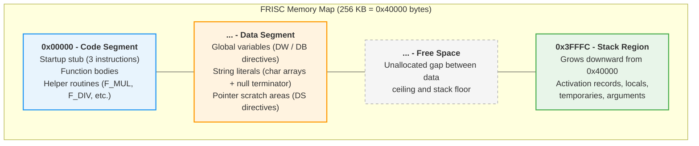
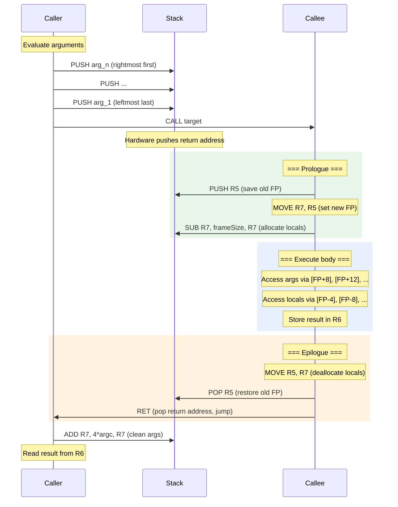
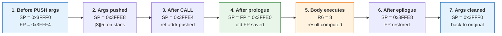
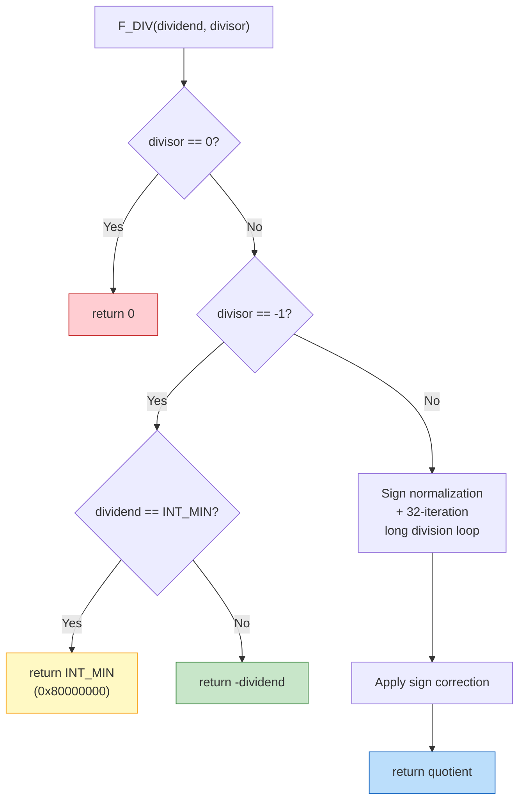

## Runtime Model and Helper Algorithms

### 9.1 Runtime Model Scope

\index{runtime model}
\index{ABI}

The project does not link against a standard C runtime library. Instead, runtime behavior is encoded directly in generated FRISC assembly and a set of software helper routines emitted on demand by the code generator. This design keeps execution fully transparent and under compiler control: every instruction executed on the simulator originates from code the compiler itself produced, making end-to-end tracing and debugging straightforward.

Runtime components include:

- **Startup stub**: initializes the stack pointer (`MOVE 40000, R7`), issues `CALL main`, and terminates with `HALT`. The constant `0x40000` (262144 decimal) places the initial stack at the top of the default 256 KB address space. Because the stack grows downward, this provides the maximum available stack depth when code and static data occupy low addresses.
- **Function call ABI and frame discipline**: a minimal, stable calling convention described in Section 9.2.
- **Integer arithmetic helpers**: software implementations of signed multiplication, division, and modulo, necessary because FRISC has no hardware multiply or divide instructions.
- **Q16.16 fixed-point helpers**: routines that implement fixed-point multiplication, division, and integer/float conversion for the `float` type, which is represented internally as Q16.16.
- **Bounds-check failure path**: an optional error handler emitted when array bounds checking is enabled.

The runtime requires no heap allocator. All data resides either in the static data segment (globals, string literals) or on the stack (locals, temporaries, function arguments). This stack-only memory model simplifies reasoning about memory safety but limits the language to programs whose total dynamic allocation fits within the stack region between the top of static data and the initial stack pointer.

\index{heap allocator!absence of}

### 9.2 FRISC Memory Map

\index{memory map}
\index{memory layout}

Understanding the runtime requires understanding how the 256 KB FRISC address space is organized. The compiler produces a flat binary image with three logical regions. There are no page tables, no virtual memory, and no memory protection hardware -- all addresses are physical.



\index{code segment}
\index{data segment}
\index{stack pointer!initialization}

The following table summarizes each region:

| Region | Start Address | Growth | Contents |
|--------|--------------|--------|----------|
| Code segment | `0x00000` | Upward (fixed at assembly time) | All executable instructions |
| Data segment | Immediately after code | Upward (fixed at assembly time) | Global variables, string constants, scratch areas |
| Free space | End of data | N/A | Unused gap; collision = stack overflow |
| Stack | `0x40000` (initial SP) | Downward toward `0x00000` | Activation records, locals, temps, arguments |

#### 9.2.1 Code Segment Layout

The code segment begins at address `0x00000` and contains instructions in the order they are emitted:

1. **Startup stub** (3 instructions, 12 bytes):
   ```
   MOVE 40000, R7    ; Initialize stack pointer to top of 256 KB
   CALL F_main       ; Call the user's main function
   HALT              ; Terminate execution
   ```
2. **Function bodies**: each user-defined function, emitted in declaration order. Functions are labeled with the `F_` prefix (e.g., `F_main`, `F_add`).
3. **Helper routines**: `F_MUL`, `F_DIV`, `F_MOD`, `F_FMUL`, `F_FDIV`, `F_I2F`, `F_F2I`, and `L_BOUNDS_ERROR`, emitted only if needed.

The startup stub is deliberately minimal. There is no `.bss` clearing pass, no environment setup, and no `argc`/`argv` parsing. The `MOVE 40000, R7` instruction uses the FRISC assembler's default hexadecimal base, so `40000` means `0x40000` = 262144 decimal.

#### 9.2.2 Data Segment Layout

\index{data segment!layout}
\index{global variables}
\index{DW directive}
\index{DB directive}

The data segment immediately follows the last instruction of the code segment. The FRISC assembler lays out data directives sequentially. The code generator emits globals in declaration order using three directive types:

| Directive | Meaning | Usage |
|-----------|---------|-------|
| `DW value` | Define Word (4 bytes) | `int`, `float` (Q16.16 raw), pointers |
| `DB value` | Define Byte (1 byte) | `char` scalars, character array elements |
| `` `DS size`` | Define Space (N bytes, zeroed) | Uninitialized arrays, structs, pointer scratch |

For example, a program declaring:

```c
int counter = 10;
char flag = 'A';
int buffer[8];
```

produces data directives equivalent to:

```
G_counter  DW %D 10         ; 4 bytes, initialized to 10
G_flag     DB %D 65          ; 1 byte, initialized to 'A' (ASCII 65)
G_buffer   `DS 32            ; 32 bytes (8 * 4), zero-initialized
```

The `G_` prefix distinguishes global labels from function labels (`F_`) and block labels.

#### 9.2.3 String Literal Storage

\index{string literals}
\index{null terminator}

String literals in the FRISCcc source language are represented as `char` arrays in the IR. When a global variable is initialized with a string literal, the code generator emits the characters as a sequence of `DB` directives forming a null-terminated byte array:

```c
char greeting[14] = "Hello, World!";
```

The IR lowers this to an `ArrayConst` of `CharConst` values. The code generator emits:

```
G_greeting  DB %D 72, %D 101, %D 108, %D 108, %D 111, %D 44,
               %D 32, %D 87, %D 111, %D 114, %D 108, %D 100,
               %D 33, %D 0
```

Each byte stores one ASCII code point. The null terminator (`0`) marks the end. Because FRISC is byte-addressable, each character occupies exactly one byte in memory, but when loaded into a register with `LOAD` (which reads 4 bytes), only the lowest byte is meaningful -- the upper 24 bits contain adjacent memory contents. The compiler uses `LOADB` (load byte) for character access.

**Current limitation.** String literals used as rvalue expressions (e.g., passing `"hello"` directly to a function) are not yet supported in the IR pipeline. Only string literals that initialize global `char` arrays are emitted. This is noted in `PrimaryExpressionGenerator.java`:

```java
// Check for string literal (NIZ_ZNAKOVA) - not supported in IR yet
if (termSymbol.equals("NIZ_ZNAKOVA")) {
    throw new UnsupportedOperationException("String literals not yet supported in IR");
}
```

Future work may add a string table in the data segment with auto-generated labels for anonymous string literals.

### 9.3 ABI Summary

\index{calling convention}
\index{register convention}

The ABI used by generated code is intentionally minimal and stable. It is designed for a register-poor target where most intermediate values pass through the stack.

#### 9.3.1 Register Assignment Table

| Register | Role | Saved by | Notes |
|----------|------|----------|-------|
| `R0` | Primary expression/scratch | Caller | General-purpose accumulator for expression evaluation |
| `R1` | Scratch | Caller | Used as second operand in binary operations |
| `R2` | Scratch | Caller | Used internally by helper routines |
| `R3` | Scratch | Caller | Used internally by helper routines (result accumulator) |
| `R4` | Scratch | Caller | Used internally by helper routines (loop counter, zero constant) |
| `R5` | Frame pointer (FP) | Callee | Points to the saved FP of the current activation record |
| `R6` | Return value | Caller | Every function places its return value here before `RET` |
| `R7` | Stack pointer (SP) | Callee (implicitly) | Grows downward; always 4-byte aligned |

\index{R0 register}
\index{R5 register}
\index{R6 register}
\index{R7 register}
\index{frame pointer}
\index{stack pointer}

The caller-saved vs. callee-saved distinction has practical consequences. Before a `CALL`, if the caller needs the current value of `R0`-`R4` afterward, it must `PUSH` those registers and `POP` them after the call returns. The code generator handles this by pushing intermediate values onto the stack before emitting nested calls. For example, in `BinaryLowerer.emitBinOp()`:

```java
valueEmitter.emit(binOp.left(), ctx, "R0");
ctx.emitter().emitInstruction("PUSH", List.of("R0"), "Save left");
valueEmitter.emit(binOp.right(), ctx, "R0");
ctx.emitter().emitInstruction("MOVE", List.of("R0", "R1"), "Right");
ctx.emitter().emitInstruction("POP", List.of("R0"), "Left");
```

The left operand is evaluated into `R0`, saved on the stack, then the right operand is evaluated (which may clobber `R0`), and finally the saved left value is restored.

#### 9.3.2 Calling Convention Details

\index{calling convention!argument passing}
\index{right-to-left argument order}

**Argument passing.** Arguments are pushed onto the stack in right-to-left order (C convention). For a call `f(a, b, c)`, the generated code pushes `c` first, then `b`, then `a`. This means that at the callee's frame pointer, `a` is at `[FP+8]`, `b` at `[FP+12]`, and `c` at `[FP+16]`.

**Caller responsibilities:**
1. Evaluate each argument and push it onto the stack (right-to-left).
2. Execute `CALL target`.
3. After return, clean up the argument space by adding `4 * argc` to `R7`.
4. Read the return value from `R6`.

**Callee responsibilities (function prologue):**
1. `PUSH R5` -- save the caller's frame pointer.
2. `MOVE R7, R5` -- establish the new frame pointer.
3. `SUB R7, frameSize, R7` -- allocate space for locals and temporaries.

**Callee responsibilities (function epilogue):**
1. `MOVE R5, R7` -- deallocate locals by restoring the stack pointer (alternative: `ADD R7, frameSize, R7`).
2. `POP R5` -- restore the caller's frame pointer.
3. `RET` -- return to caller.

The following sequence diagram shows the complete interaction between caller, stack, and callee during a function call:



#### 9.3.3 Stack Frame Layout

\index{stack frame}
\index{activation record}

```text
High addresses (toward 0x40000)
+------------------------+
| arg N                  |  [FP + 4 + 4*N]
| ...                    |
| arg 1                  |  [FP + 8]
| return address (CALL)  |  [FP + 4]
| saved FP (old R5)      |  [FP + 0]   <-- FP points here
| local 1                |  [FP - 4]
| local 2                |  [FP - 8]
| ...                    |
| temp slots             |
| arg scratch area       |  [FP - frameSize]
+------------------------+  <-- SP after prologue
Low addresses (toward 0x00000)
```

Each local variable and temporary occupies a 4-byte slot regardless of type. Even `char` values occupy a full word on the stack, with the upper 24 bits unused. Array locals occupy `4 * elementCount` bytes for `int`/`float` arrays, or `1 * elementCount` bytes (rounded up to 4-byte alignment) for `char` arrays.

The frame size computation in `FunctionEmitter.java` includes three regions:

```java
int localsAreaSize = function.localsBytes();
if (tempCount > 0 || argScratchCount > 0) {
    localsAreaSize = LoweringSupport.alignTo(function.localsBytes() + 3, 4);
}
int tempAreaSize = tempCount * 4;
int argScratchSize = argScratchCount * 4;
int frameSize = LoweringSupport.alignTo(localsAreaSize + tempAreaSize + argScratchSize, 4);
```

The alignment padding between `localsArea` and `tempArea` prevents byte stores into trailing `char` locals from clobbering adjacent temp word slots.

### 9.4 Stack Frame Detailed Walkthrough

\index{stack walkthrough}

To make the calling convention concrete, this section traces through a complete function call sequence using a simple program:

```c
int add(int a, int b) {
    return a + b;
}

int main() {
    int x = add(3, 5);
    return x;
}
```

Assume the code segment ends at address `0x00100` and the initial stack pointer is `0x40000`. We will trace exact addresses and register values at each step.

#### 9.4.1 Initial State (Before main's Body Executes)

After the startup stub calls `main` and `main`'s prologue runs:

```text
R5 (FP) = 0x3FFF4          (main's frame pointer)
R7 (SP) = 0x3FFF0          (after allocating 4 bytes for local 'x')

Stack contents:
  0x3FFFC: [old FP from startup]     <- saved by main's prologue
  0x3FFF8: [return address to HALT]  <- pushed by CALL F_main
  0x3FFF4: [saved FP = 0x3FFFC]     <- main's PUSH R5; FP points here
  0x3FFF0: [x = 0 (uninitialized)]  <- main's local variable 'x'
           ^-- SP
```

#### 9.4.2 Preparing to Call add(3, 5)

\index{argument pushing}

The caller (`main`) evaluates arguments right-to-left and pushes them:

```
; Push second argument (5) first (right-to-left order)
MOVE 5, R0
PUSH R0             ; R7 = 0x3FFEC, stack[0x3FFEC] = 5

; Push first argument (3) second
MOVE 3, R0
PUSH R0             ; R7 = 0x3FFE8, stack[0x3FFE8] = 3

; Call the function
CALL F_add          ; R7 = 0x3FFE4, stack[0x3FFE4] = return_addr
```

Stack state after `CALL`:

```text
  0x3FFF4: [saved FP for main]      <- main's FP
  0x3FFF0: [x = 0]                  <- main's local
  0x3FFEC: [5]                      <- arg 2 (b)
  0x3FFE8: [3]                      <- arg 1 (a)
  0x3FFE4: [return address]         <- pushed by CALL
           ^-- SP = 0x3FFE4
```

#### 9.4.3 Inside add(): Prologue

```
F_add:
    PUSH R5          ; R7 = 0x3FFE0, stack[0x3FFE0] = 0x3FFF4 (main's FP)
    MOVE R7, R5      ; R5 = 0x3FFE0 (add's new FP)
    ; frameSize = 0 (no locals, no temps needed for this simple function)
```

Stack state after prologue:

```text
  0x3FFF4: [saved FP for main]
  0x3FFF0: [x = 0]
  0x3FFEC: [5]                      <- [FP+12] = arg b
  0x3FFE8: [3]                      <- [FP+8]  = arg a
  0x3FFE4: [return address]         <- [FP+4]
  0x3FFE0: [saved FP = 0x3FFF4]    <- [FP+0], FP points here
           ^-- SP = FP = 0x3FFE0
```

Register state:
| Register | Value | Meaning |
|----------|-------|---------|
| R5 (FP) | `0x3FFE0` | Points to add's saved FP |
| R7 (SP) | `0x3FFE0` | No locals allocated, SP = FP |

#### 9.4.4 Inside add(): Body Execution

```
    LOAD R0, (R5+8)   ; R0 = 3 (load argument 'a')
    LOAD R1, (R5+C)   ; R1 = 5 (load argument 'b'; 0xC = 12 decimal)
    ADD  R0, R1, R0   ; R0 = 8
    MOVE R0, R6       ; R6 = 8 (place return value in R6)
```

#### 9.4.5 Inside add(): Epilogue

```
    MOVE R5, R7       ; R7 = 0x3FFE0 (restore SP, no-op here since frameSize=0)
    POP  R5           ; R5 = 0x3FFF4 (restore main's FP), R7 = 0x3FFE4
    RET               ; PC = stack[0x3FFE4] (return addr), R7 = 0x3FFE8
```

After `RET`, control returns to `main`. Register state:
| Register | Value | Meaning |
|----------|-------|---------|
| R5 (FP) | `0x3FFF4` | Restored to main's FP |
| R6 | `8` | Return value from add() |
| R7 (SP) | `0x3FFE8` | Points at where arg_1 was |

#### 9.4.6 Back in main(): Argument Cleanup and Result Use

```
    ADD  R7, 8, R7    ; R7 = 0x3FFF0 (clean up 2 args * 4 bytes = 8 bytes)
    MOVE R6, R0       ; R0 = 8 (grab return value)
    STORE R0, (R5-4)  ; Store to local 'x' at [FP-4] = 0x3FFF0
```

The stack is now clean and back to the state it was in before the `add()` call:

```text
  0x3FFF4: [saved FP for main]     <- main's FP
  0x3FFF0: [x = 8]                 <- main's local, now holds result
           ^-- SP = 0x3FFF0
```

#### 9.4.7 Stack Frame Lifecycle Summary

The following diagram summarizes the stack state transitions through the entire call:



\index{stack frame lifecycle}

### 9.5 Integer Helper Algorithms

\index{integer multiplication}
\index{integer division}
\index{shift-and-add algorithm}

FRISC provides `ADD`, `SUB`, `AND`, `OR`, `XOR`, `SHL`, and `SHR` as native ALU operations but lacks hardware multiplication and division. The compiler emits software helper routines to fill this gap. Each helper follows the same calling convention as user-defined functions: arguments on the stack, result in `R6`.

#### 9.5.1 Signed Multiplication (`F_MUL`) -- Algorithm

The multiplication helper implements the standard shift-and-add algorithm with sign normalization. The algorithm operates in three phases.

**Phase 1: Sign normalization.** Both operands are made non-negative. A sign tracker (initially 0) is XORed with 1 each time an operand is negated, so that after normalization, the tracker is 1 if and only if the result should be negative.

**Phase 2: Shift-and-add loop.** With both operands positive, the algorithm iterates over the bits of the multiplier `b`. For each bit position, if the current lowest bit of `b` is 1, the multiplicand `a` (shifted to the current position) is added to the accumulator. Then `a` is shifted left by one and `b` is shifted right by one. The loop terminates when `b` reaches zero.

**Phase 3: Sign correction.** If the sign tracker is non-zero, the accumulated result is negated.

```text
F_MUL(a, b):
    sign := 0
    if a < 0:
        a := -a
        sign := sign XOR 1
    if b < 0:
        b := -b
        sign := sign XOR 1
    result := 0
    while b != 0:
        if (b AND 1) != 0:
            result := result + a
        a := a << 1
        b := b >> 1          // logical shift (b is now non-negative)
    if sign != 0:
        result := -result
    return result
```

**Register allocation within F_MUL:**

| Register | Role | Initial value |
|----------|------|---------------|
| `R0` | Multiplicand `a` (shifted left each iteration) | Loaded from `[FP+8]` |
| `R1` | Multiplier `b` (shifted right each iteration) | Loaded from `[FP+12]` |
| `R2` | Sign tracker | `0` |
| `R3` | Result accumulator | `0` |
| `R4` | Scratch (zero constant, bit test) | `0` |

#### 9.5.2 Signed Multiplication -- FRISC Assembly

\index{F\_MUL}

The following is the actual FRISC assembly emitted by `IntMathHelpers.emitMul()`, annotated with explanatory comments:

```
F_MUL           ; int32 multiplication entry point
    PUSH R5                 ; Save caller's frame pointer
    MOVE R7, R5             ; Establish new frame pointer
    LOAD R0, (R5+8)         ; R0 = a (first argument)
    LOAD R1, (R5+C)         ; R1 = b (second argument; C hex = 12 dec)
    MOVE 0, R4              ; R4 = 0 (zero constant for negation)
    MOVE 0, R2              ; R2 = 0 (sign tracker)

    ; --- Phase 1: Sign normalization ---
    CMP  R0, 0              ; Is a negative?
    JP_SGE L_MUL_A_POS      ; Skip if a >= 0
    SUB  R4, R0, R0         ; a = 0 - a = -a (negate)
    XOR  R2, 1, R2          ; Flip sign tracker
L_MUL_A_POS
    CMP  R1, 0              ; Is b negative?
    JP_SGE L_MUL_B_POS      ; Skip if b >= 0
    SUB  R4, R1, R1         ; b = 0 - b = -b (negate)
    XOR  R2, 1, R2          ; Flip sign tracker
L_MUL_B_POS

    ; --- Phase 2: Shift-and-add loop ---
    MOVE 0, R3              ; R3 = 0 (result accumulator)
L_MUL_LOOP
    CMP  R1, 0              ; Is b == 0?
    JP_EQ L_MUL_DONE        ; If so, multiplication is complete
    AND  R1, 1, R4          ; R4 = b AND 1 (test lowest bit)
    CMP  R4, 0              ; Is lowest bit set?
    JP_EQ L_MUL_SKIP        ; Skip addition if bit is 0
    ADD  R3, R0, R3         ; result += a (shifted multiplicand)
L_MUL_SKIP
    SHL  R0, 1, R0          ; a <<= 1 (shift multiplicand left)
    SHR  R1, 1, R1          ; b >>= 1 (shift multiplier right, logical)
    JP   L_MUL_LOOP         ; Continue loop

    ; --- Phase 3: Sign correction ---
L_MUL_DONE
    CMP  R2, 0              ; Was the result supposed to be negative?
    JP_EQ L_MUL_SIGN_DONE   ; Skip if positive
    MOVE 0, R4              ; R4 = 0 (zero for negation)
    SUB  R4, R3, R3         ; result = 0 - result = -result
L_MUL_SIGN_DONE
    MOVE R3, R6             ; Place result in return register
    POP  R5                 ; Restore caller's frame pointer
    RET                     ; Return to caller
```

**Total instruction count:** The prologue/epilogue overhead is 9 instructions. The loop body is 7 instructions per iteration (CMP, JP_EQ, AND, CMP, JP_EQ, SHL, SHR plus conditional ADD and JP). Worst case for a 32-bit operand: 9 + 31 * 8 + 5 = approximately 262 instructions.

#### 9.5.3 Multiplication Worked Example: 13 x 7

\index{multiplication example}

To understand the shift-and-add algorithm concretely, let us trace `F_MUL(13, 7)` step by step.

**Initial state after sign normalization:**
- `R0` (a) = 13 = `0b00000000_00000000_00000000_00001101`
- `R1` (b) = 7 = `0b00000000_00000000_00000000_00000111`
- `R3` (result) = 0
- Both operands are positive, so sign tracker `R2` = 0.

**Iteration 1:** b = 7 = `0b...0111`
- `b AND 1` = 1 (bit is set)
- `result = 0 + 13 = 13`
- `a = 13 << 1 = 26`
- `b = 7 >> 1 = 3`

| After iter | a (R0) | b (R1) | result (R3) | Action |
|-----------|--------|--------|-------------|--------|
| 1 | 26 | 3 | 13 | Added a=13 (bit 0 of b was 1) |

**Iteration 2:** b = 3 = `0b...011`
- `b AND 1` = 1 (bit is set)
- `result = 13 + 26 = 39`
- `a = 26 << 1 = 52`
- `b = 3 >> 1 = 1`

| After iter | a (R0) | b (R1) | result (R3) | Action |
|-----------|--------|--------|-------------|--------|
| 2 | 52 | 1 | 39 | Added a=26 (bit 1 of b was 1) |

**Iteration 3:** b = 1 = `0b...001`
- `b AND 1` = 1 (bit is set)
- `result = 39 + 52 = 91`
- `a = 52 << 1 = 104`
- `b = 1 >> 1 = 0`

| After iter | a (R0) | b (R1) | result (R3) | Action |
|-----------|--------|--------|-------------|--------|
| 3 | 104 | 0 | 91 | Added a=52 (bit 2 of b was 1) |

**Loop termination:** b = 0, so the loop exits. Result = 91.

**Verification:** 13 x 7 = 91. Equivalently: 13 x (4 + 2 + 1) = 13 x 4 + 13 x 2 + 13 x 1 = 52 + 26 + 13 = 91.

The algorithm needed only 3 iterations because 7 has 3 bits set. For a multiplier like 128 = `0b10000000`, only 1 iteration would produce a nonzero addition (when the single set bit is reached), but the loop still runs for all bit positions until `b` shifts down to zero -- in this case, 8 iterations total (7 shifts before the bit reaches position 0, then one more shift to reach 0).

#### 9.5.4 Multiplication Complexity Analysis

| Multiplier pattern | Iterations | Additions | Total instructions |
|-------------------|------------|-----------|-------------------|
| b = 1 | 1 | 1 | ~17 |
| b = power of 2 | log2(b)+1 | 1 | ~30-75 |
| b = small (< 16) | up to 4 | popcount(b) | ~40-50 |
| b = 0xFFFF (16-bit) | 16 | 16 | ~140 |
| b = 0x7FFFFFFF (worst) | 31 | 31 | ~260 |

The code generator includes a **fast-path optimization** for known constant multipliers. In `BinaryLowerer`, if the multiplier is a compile-time constant that is a power of two, the multiplication is replaced by a single `SHL` instruction. For small constants like 3, 5, 6, 7, 9, 10, 12, or 15, an inline shift-and-add sequence is emitted instead of a helper call, avoiding the function call overhead entirely.

#### 9.5.5 Signed Division (`F_DIV`) -- Algorithm

\index{F\_DIV}
\index{binary long division}

The division helper implements binary long division with explicit handling of three edge cases before entering the main loop.

**Edge case 1: Division by zero.** If the divisor is zero, the helper returns 0 immediately. This is a project-specific policy choice; the C standard declares this undefined behavior. Returning 0 ensures deterministic simulator behavior and prevents infinite loops.

**Edge case 2: Division by -1 (general case).** If the divisor is -1 and the dividend is not `INT_MIN`, the result is simply the negation of the dividend. This fast path avoids the expense of the full long division loop.

**Edge case 3: `INT_MIN / -1`.** In two's complement, `-INT_MIN` overflows back to `INT_MIN`. The helper explicitly returns `INT_MIN` (0x80000000) for this case, matching the project's wrap-around semantics. This deviates from the C standard (which calls it undefined) but provides deterministic, testable behavior.



**Main algorithm.** After edge cases, both operands are made positive (with sign tracking as in `F_MUL`). The algorithm then performs binary long division over 32 bit positions:

```text
F_DIV(dividend, divisor):
    // Edge cases handled first (see above)
    sign := 0
    if dividend < 0: dividend := -dividend; sign ^= 1
    if divisor  < 0: divisor  := -divisor;  sign ^= 1
    remainder := 0
    quotient  := 0
    for bit_count = 32 downto 1:
        // Shift dividend's top bit into remainder
        carry := (dividend >> 31) AND 1
        dividend := dividend << 1
        remainder := (remainder << 1) OR carry
        quotient := quotient << 1
        if remainder >= divisor:
            remainder := remainder - divisor
            quotient := quotient OR 1
    if sign != 0:
        quotient := -quotient
    return quotient
```

**Implementation detail.** The carry detection uses the FRISC hardware carry flag (`JP_NC`/`JP_C`) after the `SHL` instruction on the dividend, which is more efficient than explicit bit extraction. The bit count is initialized to `0x20` (32 in hexadecimal, since FRISC assembler defaults to hex base).

**Register allocation within F_DIV:**

| Register | Role | Notes |
|----------|------|-------|
| `R0` | Dividend (consumed bit-by-bit) | Shifted left each iteration; carry flag captures top bit |
| `R1` | Divisor | Constant throughout the loop |
| `R2` | Running remainder | Accumulates shifted-in bits from dividend |
| `R3` | Quotient accumulator | Built up one bit per iteration |
| `R4` | Bit counter | Initialized to 32 (`0x20`), decremented each iteration |
| `R6` | Sign tracker | Reused for result at the end |

#### 9.5.6 Division Worked Example: 29 / 4

\index{division example}

Let us trace the first several iterations of `F_DIV(29, 4)` to illustrate the binary long division.

**Initial state:** dividend = 29 = `0b...00011101`, divisor = 4. Both positive, so sign = 0.

The algorithm processes the dividend from its most significant bit downward. For brevity, we show only the iterations where significant activity occurs (the first 27 iterations produce remainder < divisor since 29 fits in 5 bits):

| Iteration | Dividend (R0) before SHL | Carry | Remainder (R2) | >= divisor? | Quotient (R3) |
|-----------|--------------------------|-------|-----------------|-------------|---------------|
| 28 | `...00011101_00...0` | 0 | 0 | No | 0 |
| 29 | `...01110100_00...0` | 0 | 1 | No (1<4) | 0 |
| 30 | `...11101000_00...0` | 0 | 3 | No (3<4) | 0 |
| 31 | `...11010000_00...0` | 1 | 7 | Yes (7>=4) | 1 |
| (after sub) | | | 3 | | 1 |
| 32 | `...10100000_00...0` | 1 | 7 | Yes (7>=4) | 3 |
| (after sub) | | | 3 | | 3 |

Wait -- let us be more precise. After the full 32-iteration loop:

- **Quotient** = 7 (which is 29 / 4 = 7, truncated toward zero)
- **Remainder** = 1 (which is 29 mod 4 = 1)

The result `R6` = 7 is correct.

**Complexity.** The main loop always executes exactly 32 iterations regardless of operand values, with approximately 8-10 instructions per iteration. Total cost: approximately 280-340 instructions for the general case, plus prologue/epilogue overhead.

#### 9.5.7 Signed Modulo (`F_MOD`)

\index{F\_MOD}
\index{modulo operation}

The modulo helper uses the same binary long division structure as `F_DIV` but returns the remainder instead of the quotient.

**Edge cases:**
- Divisor is zero: returns 0 (same policy as division).
- Divisor is -1: returns 0 immediately, since `x % -1 = 0` for all `x`.

**Sign semantics.** The sign of the result follows the sign of the dividend (truncation toward zero), matching C99/C11 behavior. Only the dividend's sign is tracked; the divisor is made positive but its original sign does not affect the result sign.

```text
F_MOD(dividend, divisor):
    if divisor == 0: return 0
    if divisor == -1: return 0
    dividendNegative := (dividend < 0)
    if dividend < 0: dividend := -dividend
    if divisor  < 0: divisor  := -divisor
    remainder := 0
    for bit_count = 32 downto 1:
        carry := top bit of dividend
        dividend := dividend << 1
        remainder := (remainder << 1) OR carry
        if remainder >= divisor:
            remainder := remainder - divisor
    if dividendNegative:
        remainder := -remainder
    return remainder
```

Note the key structural differences from `F_DIV`: there is no quotient register (`R3` is not used for accumulation), the sign tracking only considers the dividend (not the divisor), and the return value comes from `R2` (remainder) rather than `R3` (quotient).

**Complexity.** Identical to `F_DIV`: 32 iterations, approximately 250-300 instructions total.

#### 9.5.8 Integer Helper Cost Comparison

\index{helper cost comparison}

| Helper | Loop iterations | Instructions (approx.) | Called via |
|--------|----------------|----------------------|-----------|
| `F_MUL` | 1 to 31 (depends on operand) | 17 to 262 | `CALL F_MUL` |
| `F_DIV` | Always 32 | 280 to 340 | `CALL F_DIV` |
| `F_MOD` | Always 32 | 250 to 300 | `CALL F_MOD` |
| `F_FMUL` | 1 to 32 | 300 to 400 | `CALL F_FMUL` |
| `F_FDIV` | 32 + 32 + 16 | 700 to 800 | `CALL F_FDIV` |
| `F_I2F` | N/A (no loop) | 7 | `CALL F_I2F` |
| `F_F2I` | N/A (no loop) | 7 | `CALL F_F2I` |

The table reveals why the code generator invests considerable effort in compile-time strength reduction: replacing a single `F_MUL` call (up to 262 instructions) with a `SHL` (1 instruction) when the multiplier is a power of two yields a 260x speedup for that operation.

### 9.6 Q16.16 Fixed-Point Helper Algorithms

\index{Q16.16}
\index{fixed-point arithmetic}

#### 9.6.1 Q16.16 Bit Layout

The compiler represents `float` values using Q16.16 signed fixed-point format. A value `x` is stored as the 32-bit signed integer `raw = (int)(x * 65536)`. The upper 16 bits hold the integer part (including sign), and the lower 16 bits hold the fractional part with a resolution of `1/65536 ~ 0.0000153`.

```text
Q16.16 Bit Layout (32 bits total)
+---+---+---+---+---+---+---+---+---+---+---+---+---+---+---+---+---+---+---+---+---+---+---+---+---+---+---+---+---+---+---+---+
|31 |30 |29 |28 |27 |26 |25 |24 |23 |22 |21 |20 |19 |18 |17 |16 |15 |14 |13 |12 |11 |10 | 9 | 8 | 7 | 6 | 5 | 4 | 3 | 2 | 1 | 0 |
+---+---+---+---+---+---+---+---+---+---+---+---+---+---+---+---+---+---+---+---+---+---+---+---+---+---+---+---+---+---+---+---+
| S |         15 integer bits (two's complement)        |              16 fractional bits                                        |
+---+-----------------------------------------------+---+-------------------------------------------------------------------+
 ^                                                       ^
 |                                                       |
 Sign bit                                            Binary point (implicit)
```

| Component | Bits | Range |
|-----------|------|-------|
| Sign + integer part | bits 31-16 | -32768 to +32767 |
| Fractional part | bits 15-0 | 0 to 65535 (representing 0.0 to ~0.99998) |
| Total representable range | all 32 bits | approximately -32768.0 to +32767.99998 |

This representation has the advantage that addition and subtraction of Q16.16 values use ordinary integer `ADD` and `SUB` instructions with no helper calls. Only multiplication, division, and conversions require helper routines.

#### 9.6.2 How Values Are Encoded

\index{Q16.16!encoding}

**Encoding formula:** `raw = (int)(value * 65536)`

**Example: encoding 3.14.**

```
raw = (int)(3.14 * 65536)
    = (int)(205783.04)
    = 205783

In hexadecimal: 205783 = 0x000323D7

Breakdown:
  Integer part: 0x0003 = 3
  Fractional part: 0x23D7 = 9175

  Fractional value = 9175 / 65536 = 0.13999938...
  Reconstructed value = 3 + 0.13999938 = 3.13999938...
  Error from true 3.14: approximately 0.0000006
```

**Example: encoding -1.5.**

```
raw = (int)(-1.5 * 65536)
    = (int)(-98304)
    = -98304

In two's complement hex: 0xFFFE8000

Breakdown (as negative number):
  |raw| = 98304 = 0x00018000
  Integer part: 0x0001 = 1
  Fractional part: 0x8000 = 32768 = 32768/65536 = 0.5
  Reconstructed: -(1 + 0.5) = -1.5 (exact!)
```

\index{Q16.16!precision}

**Precision and range summary:**

| Property | Value |
|----------|-------|
| Smallest positive value | 1/65536 = 0.0000153 |
| Largest positive value | 32767 + 65535/65536 ~ 32767.99998 |
| Most negative value | -32768.0 |
| Resolution | ~15 millionths (~4.8 decimal digits) |
| Values where encoding is exact | All multiples of 1/65536 |
| Common exact values | 0.5, 0.25, 0.125, 0.0625, integers |
| Common inexact values | 0.1 (error ~0.0000015), 0.3, 1/3 |

#### 9.6.3 Fixed-Point Multiplication (`F_FMUL`)

\index{F\_FMUL}
\index{widening multiply}

Multiplying two Q16.16 values `a` and `b` requires computing `(a * b) >> 16` to compensate for the double scaling. Because `a * b` can be up to 64 bits wide, the helper must perform a widening multiply.

**Why the right shift?** If `a` represents value `A` (so `a = A * 65536`) and `b` represents value `B` (so `b = B * 65536`), then `a * b = A * B * 65536^2`. To get the Q16.16 representation of `A * B`, we need `A * B * 65536`, so we must divide by 65536, which is a right shift by 16.

**Algorithm.** The helper uses the same shift-and-add approach as `F_MUL` but tracks a 64-bit product using two 32-bit registers (`R2` for the low word, `R3` for the high word). After the multiply loop, the 64-bit result is right-shifted by 16 bits to extract the correctly scaled Q16.16 result:

```text
F_FMUL(a, b):
    sign := 0
    if a < 0: a := -a; sign ^= 1
    if b < 0: b := -b; sign ^= 1
    prod_lo := 0    // R2
    prod_hi := 0    // R3
    a_hi    := 0    // R4 (overflow from shifting a)
    while b != 0:
        b := b >> 1     // logical shift; carry flag = shifted-out bit
        if carry:
            prod_lo := prod_lo + a
            prod_hi := prod_hi + a_hi + carry_from_add
        a_hi := (a_hi << 1) | carry_from(a << 1)
        a := a << 1
    result := (prod_lo >> 16) | (prod_hi << 16)
    if sign != 0:
        result := -result
    return result
```

**Key implementation detail.** The FRISC `ADC` (add with carry) instruction is used to propagate the carry from the low-word addition into the high word, and from the left-shift of `a` into `a_hi`. The shift amounts `0x10` in the final combination step correspond to 16 in decimal (hex default in FRISC assembler).

**Register allocation within F_FMUL:**

| Register | Role |
|----------|------|
| `R0` | Multiplicand `a` (low 32 bits, shifted left each iteration) |
| `R1` | Multiplier `b` (shifted right each iteration) |
| `R2` | Product low word |
| `R3` | Product high word |
| `R4` | Multiplicand high word (`a_hi`, overflow from shifting `R0`) |
| `R6` | Sign tracker |

#### 9.6.4 Fixed-Point Multiplication Example: 2.5 x 1.5

\index{fixed-point multiplication!example}

Let us trace `F_FMUL(2.5, 1.5)` to see how the widening multiply and right-shift produce the correct Q16.16 result.

**Step 1: Encode operands.**

```
a = 2.5 * 65536 = 163840 = 0x00028000
b = 1.5 * 65536 = 98304  = 0x00018000
```

**Step 2: Sign normalization.** Both operands are positive, so sign = 0. No negation needed.

**Step 3: Widening multiply.**

The shift-and-add loop computes the 64-bit product `a * b`:
```
163840 * 98304 = 16,106,127,360
In hex: 0x00000003_C0000000
  prod_hi = 0x00000003
  prod_lo = 0xC0000000
```

**Step 4: Extract Q16.16 result.**

```
result = (prod_lo >> 16) | (prod_hi << 16)
       = (0xC0000000 >> 16) | (0x00000003 << 16)
       = 0x0000C000 | 0x00030000
       = 0x0003C000
```

**Step 5: Decode result.**

```
0x0003C000 = 245760

Decoded: 245760 / 65536 = 3.75
```

**Verification:** 2.5 x 1.5 = 3.75. The result is exact because both operands and the result are representable without rounding error in Q16.16.

**When precision is lost.** Consider 1.1 x 1.1:
```
a = (int)(1.1 * 65536) = 72090 = 0x000119A0 (encodes 1.09999084...)
b = 72090

Expected: 1.21
Actual Q16.16: (72090 * 72090) >> 16 = 5196963210 >> 16 = 79299
Decoded: 79299 / 65536 = 1.20997619...
Error: ~0.000024
```

The error accumulates because both the input encoding and the multiplication introduce rounding.

#### 9.6.5 Fixed-Point Division (`F_FDIV`)

\index{F\_FDIV}

Fixed-point division is the most expensive helper in the runtime library. Computing `a / b` in Q16.16 requires producing both the integer quotient and 16 bits of fractional precision. The helper achieves this by composing calls to the integer `F_DIV` and `F_MOD` helpers, then extracting fractional bits iteratively.

**Algorithm overview:**

```text
F_FDIV(a, b):
    if b == 0: return 0
    sign := 0
    if a < 0: a := -a; sign ^= 1
    if b < 0: b := -b; sign ^= 1
    // Phase 1: integer part via integer division
    int_part := F_DIV(a, b)
    remainder := F_MOD(a, b)
    // Phase 2: fractional bits via iterative extraction
    frac := 0
    for i = 16 downto 1:
        remainder := remainder << 1
        frac := frac << 1
        if remainder >= b:
            remainder := remainder - b
            frac := frac | 1
    // Phase 3: combine and apply sign
    result := (int_part << 16) | frac
    if sign != 0:
        result := -result
    return result
```

**Cost analysis.** The `F_FDIV` helper makes one call to `F_DIV` (~300 instructions) and one call to `F_MOD` (~300 instructions), then runs a 16-iteration fractional extraction loop (~100 instructions). The total cost is approximately 700-800 instructions per fixed-point division. In programs that perform many float divisions inside loops (such as gradient descent or physics simulations), this helper dominates execution time.

**Register usage across phases:**

| Phase | Registers | Notes |
|-------|-----------|-------|
| Integer division | `R0`, `R1` saved to stack | Operands preserved across `CALL F_DIV` |
| After `F_DIV` | `R3` = integer quotient | Moved from `R6` |
| After `F_MOD` | `R2` = remainder | Moved from `R6` |
| Fractional loop | `R0` = counter (16), `R1` = frac accumulator | `R4` = divisor (restored from stack) |
| Final combine | `R3` = `(int_part << 16) | frac` | Sign applied from saved `R6` |

**Dependency chain.** Because `F_FDIV` calls `F_DIV` and `F_MOD` internally, the code generator must emit all three helpers whenever fixed-point division is used:

```java
if (binOp.op() == IrProgramModel.BinOpName.DIV) {
    emitBinaryHelper("F_FDIV", ctx);
    ctx.emitter().markFdivNeeded();
    ctx.emitter().markDivNeeded();   // F_FDIV calls F_DIV
    ctx.emitter().markModNeeded();   // F_FDIV calls F_MOD
    return;
}
```

#### 9.6.6 Conversion Helpers

\index{F\_I2F}
\index{F\_F2I}
\index{type conversion}

**`F_I2F` (integer to Q16.16).** Left-shifts the input by 16 bits. This is a single `SHL R0, 10, R0` instruction (where `0x10` = 16 in the hex-default assembler). The entire helper, including prologue and epilogue, is approximately 7 instructions.

```
F_I2F:                      ; int32 to Q16.16 conversion
    PUSH R5
    MOVE R7, R5
    LOAD R0, (R5+8)         ; Load integer argument
    SHL  R0, 10, R0         ; Shift left by 16 (0x10 hex)
    MOVE R0, R6             ; Return the Q16.16 value
    POP  R5
    RET
```

**`F_F2I` (Q16.16 to integer).** Right-shifts the input by 16 bits using logical (unsigned) right shift via `SHR R0, 10, R0`. For negative Q16.16 values, this produces an unsigned result, which truncates toward zero. The IR semantics account for this by treating the conversion as truncation. The entire helper is approximately 7 instructions.

```
F_F2I:                      ; Q16.16 to int32 conversion
    PUSH R5
    MOVE R7, R5
    LOAD R0, (R5+8)         ; Load Q16.16 argument
    SHR  R0, 10, R0         ; Shift right by 16 (0x10 hex), logical
    MOVE R0, R6             ; Return the integer value
    POP  R5
    RET
```

**Truncation behavior.** `F_F2I` truncates toward zero for positive values. For negative Q16.16 values, the logical right shift (`SHR`) does not preserve the sign bit, so `F_F2I(-1.5)` = `SHR(0xFFFE8000, 16)` = `0x0000FFFE` = 65534, which is not -1. The compiler's IR semantics handle this by inserting sign-extension when needed, or by ensuring that float-to-int conversions are only applied to values where the truncation semantics are well-defined.

### 9.7 Array Bounds Checking

\index{bounds checking}
\index{array bounds}

When array bounds checking is enabled (via compiler configuration), the code generator inserts runtime checks before each array index operation. The checking mechanism has two parts: inline check code emitted at each array access, and a shared error handler.

#### 9.7.1 Inline Bounds Check Sequence

For an array access `arr[i]` where `arr` has `N` elements, the following instructions are emitted before the actual address computation:

```
    CMP  R1, 0              ; Is index < 0?
    JP_SLT L_BOUNDS_ERROR   ; If so, jump to error handler
    CMP  R1, N              ; Is index >= array size?
    JP_SGE L_BOUNDS_ERROR   ; If so, jump to error handler
    ; ... proceed with address calculation ...
```

This checks the two-sided condition `0 <= index < N`. The index is expected in `R1` at this point (as part of the `addr_index` lowering in `AddressLowerer`). The check adds 4 instructions per array access.

From `AddressLowerer.java`:

```java
public void emitBoundsCheck(int size, FunctionContext ctx) {
    if (size <= 0) {
        return;
    }
    ctx.emitter().markBoundsCheckNeeded();
    ctx.emitter().emitInstruction("CMP", List.of("R1", "0"), "Bounds check");
    ctx.emitter().emitInstruction("JP_SLT", List.of("L_BOUNDS_ERROR"), null);
    ctx.emitter().emitInstruction("CMP", List.of("R1", LoweringSupport.formatImmediate(size)), null);
    ctx.emitter().emitInstruction("JP_SGE", List.of("L_BOUNDS_ERROR"), null);
}
```

#### 9.7.2 Bounds Error Handler

\index{L\_BOUNDS\_ERROR}

The error handler is a minimal routine that terminates the program with a diagnostic error code:

```
L_BOUNDS_ERROR:             ; array bounds error
    MOVE FFFFFFFA, R6       ; R6 = -6 (0xFFFFFFFA = error code)
    HALT                    ; Abort execution immediately
```

The error code `-6` (0xFFFFFFFA in two's complement) is placed in `R6` before halting, allowing the FRISC simulator or test harness to detect that the program terminated due to an out-of-bounds access rather than normal completion. The simulator can inspect `R6` after `HALT` to determine the exit reason.

**Design trade-offs:**

| Aspect | Choice | Rationale |
|--------|--------|-----------|
| Error reporting | Error code in R6 + HALT | No I/O system available for messages |
| Recovery | None (immediate termination) | Simplicity; no exception mechanism |
| Overhead | 4 instructions per checked access | Acceptable for debugging; disable for production |
| Scope | Only pointer-to-array accesses with known size | Cannot check dynamically-sized arrays |

#### 9.7.3 When Bounds Checks Are Inserted

Not all array accesses receive bounds checks. The `TempAnalyzer` performs a static analysis pass to determine which `addr_index` instructions operate on arrays with statically known sizes. Only these receive bounds checking. Specifically:

- Global arrays with declared sizes: checked.
- Local arrays with declared sizes: checked.
- Pointer arithmetic on unknown-size buffers: not checked (size is not available at compile time).
- Array accesses where the index is a compile-time constant within range: the bounds check may be optimized away by the optimizer pass (see Chapter 7 on optimizations).

### 9.8 Stack Memory Model

\index{stack memory model}
\index{stack overflow}

The runtime operates in a purely stack-based memory model with no heap allocator.

```text
Memory Map (256 KB default)
+----------------------------+ 0x40000 (262144)
| (unused above SP init)     |
+----------------------------+ 0x40000 = initial SP
|                            |
|  Stack (grows downward)    |
|  - activation records      |
|  - local variables         |
|  - temporaries             |
|  - function arguments      |
|                            |
+----------------------------+ SP at deepest recursion
|                            |
|  (free space)              |
|                            |
+----------------------------+ End of code + static data
|  Static data               |
|  - global variables        |
|  - string literals         |
+----------------------------+
|  Code segment              |
|  - startup stub            |
|  - main and functions      |
|  - helper routines         |
+----------------------------+ 0x00000
```

Stack overflow is not detected at runtime. If recursive depth or local variable size exceeds the available gap between static data and the stack, the stack will silently overwrite code or data, producing undefined behavior. For programs with deep recursion, increasing the simulator's memory size (via `-memsize` or `FriscRunner` configuration) provides more stack space.

#### 9.8.1 Stack Space Estimation

Given a program, the maximum stack depth can be estimated:

```
max_stack = max_call_depth * avg_frame_size
```

Where:

| Factor | Typical value | How to estimate |
|--------|---------------|-----------------|
| Frame size per call | 16--100 bytes | 8 (return addr + saved FP) + 4 * num_locals + 4 * num_temps |
| Available stack space | ~250 KB | 0x40000 - code_size - data_size |
| Max recursion depth | ~2500--15000 | available_stack / avg_frame_size |

For example, a recursive Fibonacci function with 2 local variables:
- Frame size = 8 (overhead) + 8 (two locals) + 8 (two temps) = 24 bytes
- Available stack ~ 250 KB = 256000 bytes
- Max recursion depth ~ 256000 / 24 ~ 10666 calls

This is sufficient for most educational programs, but programs with large local arrays (e.g., `int buffer[1000]`) consume 4000 bytes per frame, limiting recursion depth to ~64 calls.

### 9.9 Conditional Helper Emission

\index{conditional emission}
\index{HelperLibrary}

Helper routines are emitted by `HelperLibrary` based on usage flags tracked by the `FriscEmitter` during code generation. As the code generator lowers IR instructions to FRISC assembly, it sets boolean flags (`needsMul()`, `needsDiv()`, `needsMod()`, `needsFmul()`, `needsFdiv()`, `needsI2f()`, `needsF2i()`, `needsBoundsCheck()`) whenever the corresponding operation is encountered.

After the main code generation pass completes, `HelperLibrary.emit()` checks each flag and emits only the required helpers:

```java
if (emitter.needsFmul())       floatHelpers.emitFloatMul();
if (emitter.needsFdiv())       floatHelpers.emitFloatDiv();
if (emitter.needsF2i())        floatHelpers.emitFloatToInt();
if (emitter.needsI2f())        floatHelpers.emitIntToFloat();
if (emitter.needsMul())        intMathHelpers.emitMul();
if (emitter.needsDiv())        intMathHelpers.emitDiv();
if (emitter.needsMod())        intMathHelpers.emitMod();
if (emitter.needsBoundsCheck()) boundsHelper.emitBoundsError();
```

This conditional emission has three benefits:

1. **Reduced output size.** A program that uses only addition and subtraction produces no helper routines at all, keeping the generated assembly short and easy to inspect.
2. **Faster assembly.** The FRISC assembler parses and assembles the entire source; fewer lines means faster assembly.
3. **Dependency tracking.** The flags make it explicit which operations the program uses, which is useful for performance analysis (see Chapter 12) and for understanding which helper optimizations would benefit a given workload.

Note that `F_FDIV` internally calls `F_DIV` and `F_MOD`, so when fixed-point division is needed, all three integer division-related helpers are also emitted regardless of whether the source program uses integer division directly.

The following table shows the emission dependencies:

| Source operation | Helpers emitted | Reason |
|-----------------|----------------|--------|
| `a * b` (int) | `F_MUL` | Direct |
| `a / b` (int) | `F_DIV` | Direct |
| `a % b` (int) | `F_MOD` | Direct |
| `a * b` (float) | `F_FMUL` | Direct |
| `a / b` (float) | `F_FDIV` + `F_DIV` + `F_MOD` | `F_FDIV` calls the other two |
| `(float)i` | `F_I2F` | Direct |
| `(int)f` | `F_F2I` | Direct |
| `arr[i]` (checked) | `L_BOUNDS_ERROR` | Bounds check enabled |
| `a + b` (any) | None | Native `ADD` instruction |
| `a - b` (any) | None | Native `SUB` instruction |

### 9.10 Prologue Zero-Initialization

\index{zero initialization}
\index{local variables!initialization}

The function prologue includes an optional zero-initialization loop that clears all local variable storage to zero. This ensures that uninitialized local variables have a deterministic value (0) rather than containing whatever data happened to be on the stack from a previous call.

From `FunctionEmitter.java`:

```java
int localZeroBytes = LoweringSupport.alignTo(localsAreaSize, 4);
int wordCount = localZeroBytes / 4;
if (wordCount > 0) {
    immediateEmitter.emitLoadImmediate(wordCount, ctx, "R1", "Zero local words");
    ctx.emitter().emitInstruction("MOVE", List.of("R5", "R0"), "Local zero base");
    ctx.emitter().emitInstruction("SUB", List.of("R0", formatImmediate(localZeroBytes), "R0"), "Local zero ptr");
    immediateEmitter.emitLoadImmediate(0, ctx, "R2", "Zero");
    String zeroLoop = labelGenerator.newLabel("L_ZERO");
    ctx.emitter().emitLabel(zeroLoop, null);
    ctx.emitter().emitInstruction("STORE", List.of("R2", "(R0)"), "Clear");
    ctx.emitter().emitInstruction("ADD", List.of("R0", "4", "R0"), null);
    ctx.emitter().emitInstruction("SUB", List.of("R1", "1", "R1"), null);
    ctx.emitter().emitInstruction("JP_NE", List.of(zeroLoop), null);
}
```

This emits a word-at-a-time zeroing loop. For a function with 12 bytes of locals (3 words), the loop executes 3 iterations, writing zero to `[FP-12]`, `[FP-8]`, and `[FP-4]`. The cost is proportional to the number of local words: approximately 4 instructions per word plus 3 instructions of setup.

### 9.11 Runtime Correctness Checklist

\index{runtime correctness}

A backend/runtime pair is considered correct only if:

1. **Frame integrity**: every function prologue/epilogue restores `R5` and `R7` to their pre-call values, on every control-flow path including early returns.
2. **Argument cleanup consistency**: the caller always adds `4 * argc` to `R7` after every `CALL`, regardless of whether the callee used all arguments.
3. **Helper semantic fidelity**: helper results match the middle-end's integer and fixed-point arithmetic assumptions. For example, `F_DIV(-7, 2)` must return `-3` (truncation toward zero), not `-4` (floor division).
4. **Edge case determinism**: behavior for `INT_MIN`, divisor-zero, and sign boundary cases is explicit and tested, not left to chance.
5. **Return value discipline**: every function places its result in `R6` before returning. No function returns without setting `R6` (even void functions, which conventionally leave `R6` unchanged).
6. **Stack alignment**: `R7` is always 4-byte aligned. Misalignment causes silent corruption because `LOAD`/`STORE` apply alignment masks.
7. **No register clobbering across calls**: callee-saved registers (`R5`) are always preserved. Caller-saved registers (`R0`-`R4`) may be freely modified by any function call, so the caller must not assume they survive a `CALL`.

The following table summarizes the testing strategy for each correctness property:

| Property | Test method | Example test case |
|----------|-------------|-------------------|
| Frame integrity | Nested calls, verify R5/R7 | `f(g(h(x)))` with deep nesting |
| Argument cleanup | Functions with varying argc | `f(1)`, `f(1,2)`, `f(1,2,3,4,5)` |
| Helper semantics | Arithmetic identity checks | `(a * b) / b == a` for various a, b |
| Edge cases | Boundary value inputs | `INT_MIN / -1`, `x / 0`, `0 * x` |
| Return value | Capture R6 after every call | Void, int, float return types |
| Stack alignment | Odd-sized locals, verify alignment | `char` locals mixed with `int` locals |
| Register safety | Verify R0-R4 not relied upon after CALL | Expression with nested function calls |
