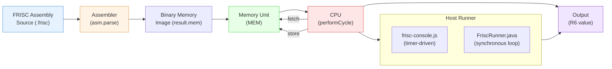
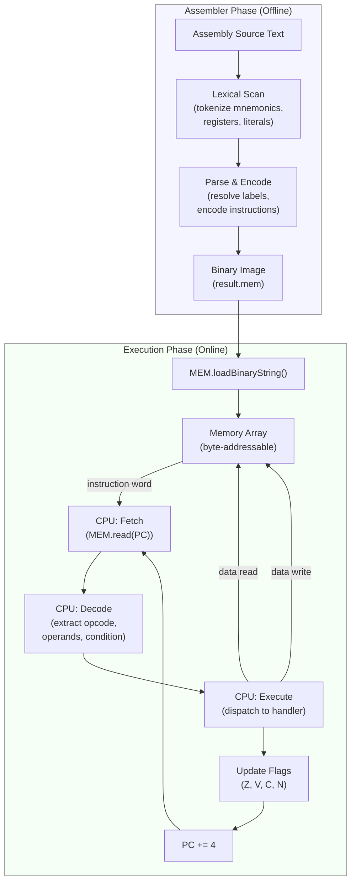
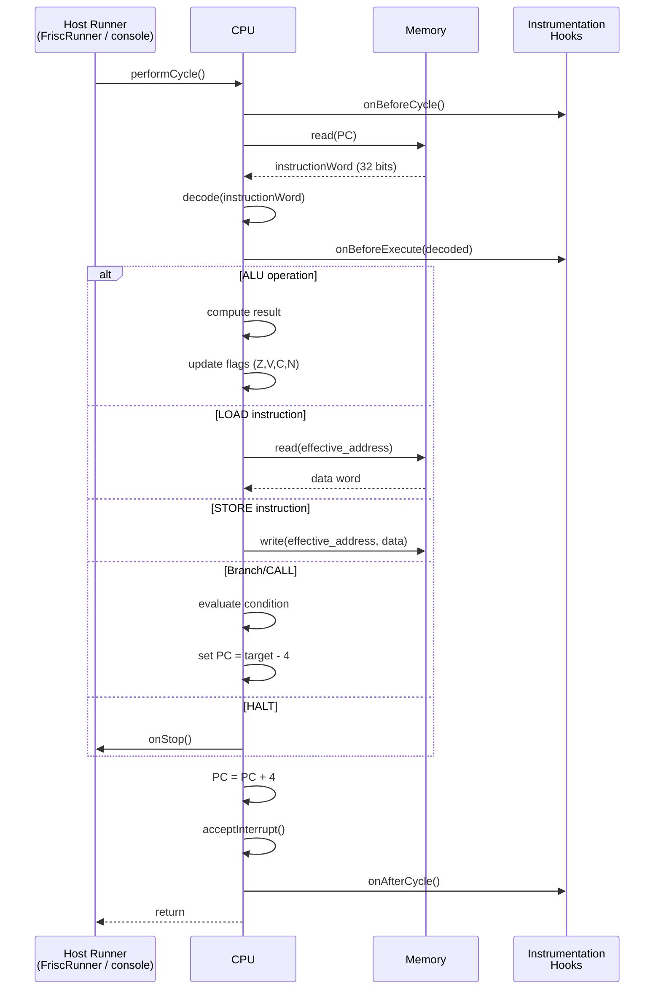
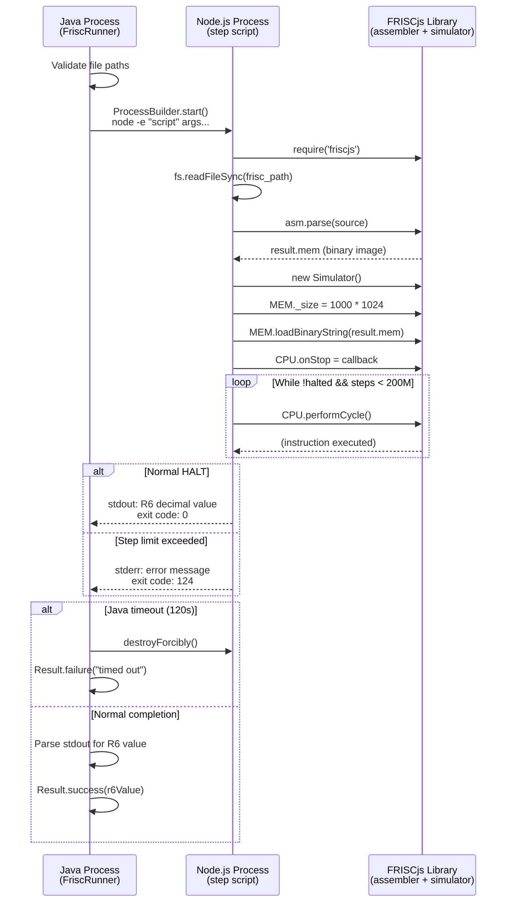
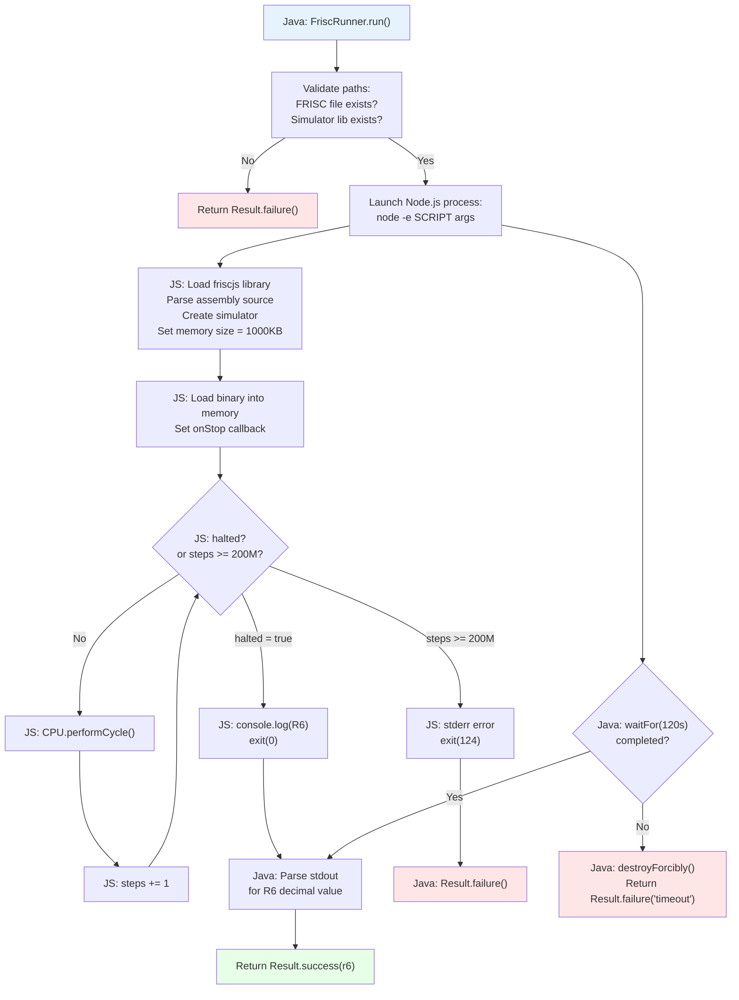
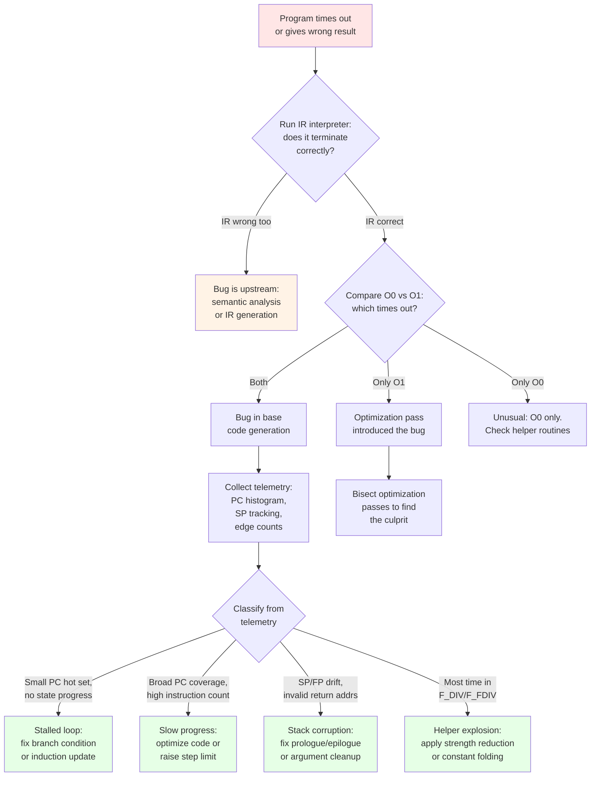

> **📖 From the book.** This chapter accompanies *Building a C-Subset Compiler for the FRISC Architecture: From Formal Languages to Executable Code* by Dr. Karlo Knežević (Zenodo, 2026). For the complete treatment — formal development, proofs, and figures — read the book: [📄 PDF](../book/Building-a-C-Subset-Compiler-for-the-FRISC-Architecture.pdf) · DOI [10.5281/zenodo.20511073](https://doi.org/10.5281/zenodo.20511073) · ISBN 978-953-47198-0-0.

## Scope and Source Grounding

This chapter provides a detailed guide to the FRISC simulator as used in this compiler project, written for compiler engineers who need to understand and debug end-to-end behavior from generated assembly to final register state. The focus is implementation-level: what the simulator actually does in code, not what an abstract ISA reference might specify.

\index{FRISC simulator}
\index{FRISCjs}

The analysis is grounded in three repository sources:

- `node_modules/friscjs/consoleapp/frisc-console.js` -- the upstream standalone runner.
- `node_modules/friscjs/lib/friscjs-browser.js` -- the core simulator library (assembler, memory, CPU).
- `cli/src/main/java/hr/fer/ppj/cli/FriscRunner.java` -- the project-specific Java wrapper.

The project pipeline is:

```text
C source -> Lexer -> Parser -> Semantics -> IR -> FRISC Codegen -> FRISC Simulator
```

The simulator is the final execution stage, and its behavior determines whether a compiled program produces the correct result.

## Architecture Overview

The FRISCjs simulator consists of three logical layers:

1. **Assembler frontend** (`asm.parse`): converts FRISC assembly text into a binary memory image.
2. **Memory and CPU runtime** (`MEM` and `CPU` objects): the core execution engine.
3. **Host runner integration**: either the upstream `frisc-console.js` or the project-specific `FriscRunner.java`.

\index{assembler frontend}
\index{CPU runtime}
\index{memory model}

The following diagram shows the overall simulator architecture and the data flow from assembly source to program output:



The execution flow proceeds as follows:

1. `asm.parse(source)` parses the assembly source and produces `result.mem`, a binary string representing the assembled program image.
2. `simulator = new Simulator()` creates fresh `MEM` and `CPU` instances with default state.
3. `MEM._size` is set to the desired memory capacity in bytes.
4. `MEM.loadBinaryString(result.mem)` writes the assembled bytes into memory starting at address 0.
5. Execution begins, either via `CPU.run()` (timer-driven, used by `frisc-console.js`) or via a manual loop calling `CPU.performCycle()` (used by `FriscRunner`).
6. Execution ends when the CPU encounters a `HALT` instruction (triggering `onStop`) or when the host runner's watchdog limits are exceeded.

### Internal Component Interaction

The three core components -- assembler, memory, and CPU -- interact through well-defined interfaces. The assembler produces a flat binary image that the memory unit stores verbatim. The CPU reads instructions from memory via address-based fetch operations and writes results back through store operations. This separation of concerns means that the assembler is entirely offline: it runs once before execution begins and has no role during simulation.



## CPU State Model

### Registers

\index{register file}
\index{program counter}
\index{status register}

The CPU register file `CPU._r` contains:

| Register | Name | Purpose |
|----------|------|---------|
| `r0`-`r7` | General-purpose | Computation and addressing |
| `pc` | Program counter | Address of the current instruction |
| `sr` | Status register | Condition flags and interrupt control |
| `iif` | Interrupt-in-flight | Internal interrupt state tracking |

In the compiler's ABI, these registers are mapped as:

| Register | ABI Role |
|----------|----------|
| `R7` | Stack pointer (SP), initialized to `0x40000` |
| `R5` | Frame pointer (FP) |
| `R6` | Return value register |
| `R0`-`R4` | Caller-saved scratch registers |

All registers are 32-bit unsigned integers internally. Signed interpretation is applied by the condition evaluation logic based on the N (negative) and V (overflow) flags.

### Register Initialization and Reset

At simulator creation, all registers are initialized to zero. The compiler's entry stub immediately sets R7 (SP) to `0x40000` (hexadecimal, equal to 262144 decimal). This value places the stack at the 256KB boundary, growing downward. With the `FriscRunner`'s 1000KB memory, the stack can grow from `0x40000` downward to address 0, providing approximately 256KB of stack space. The code section occupies memory starting at address 0 and growing upward, so the stack and code occupy opposite ends of the address space.

```text
Memory Layout (1000 KB total):

0x00000 +-----------------------------+
        | Code section                |
        | (assembled instructions)    |
        | grows upward -->            |
0x????? +-----------------------------+
        |                             |
        | Free space                  |
        |                             |
0x3FFFC +-----------------------------+
        | <-- Stack grows downward    |
        | (frames, locals, temps)     |
0x40000 +-----------------------------+  <-- Initial SP (R7)
        |                             |
        | Unused high memory          |
        | (up to 0xF9FFF)             |
0xF9FFF +-----------------------------+
```

### Status Flags

\index{status flags}
\index{condition codes}

The status register contains condition flags updated by ALU operations:

| Flag | Bit | Meaning |
|------|-----|---------|
| `Z` | Zero | Result is zero |
| `V` | Overflow | Signed overflow occurred |
| `C` | Carry | Unsigned carry/borrow occurred |
| `N` | Negative | Result bit 31 is set |

Additional interrupt-related bits (`INT0`, `INT1`, `INT2`, `EINT0`, `EINT1`, `EINT2`, `GIE`) control the interrupt system. This compiler project does not use interrupts, so these bits remain in their default state.

Conditional control-flow instructions (`JP_*`, `JR_*`, `CALL_*`, `RET_*`) evaluate conditions through the internal `_testCond(cond)` function, which examines flag combinations:

| Condition | Test | Common Use |
|-----------|------|------------|
| `EQ` / `Z` | Z = 1 | Equal comparison |
| `NE` / `NZ` | Z = 0 | Not-equal comparison |
| `UGT` | C = 1 AND Z = 0 | Unsigned greater-than |
| `UGE` / `NC` | C = 1 | Unsigned greater-or-equal |
| `ULT` / `C` | C = 0 | Unsigned less-than |
| `ULE` | C = 0 OR Z = 1 | Unsigned less-or-equal |
| `SGT` | (N = V) AND Z = 0 | Signed greater-than |
| `SGE` | N = V | Signed greater-or-equal |
| `SLT` | N != V | Signed less-than |
| `SLE` | (N != V) OR Z = 1 | Signed less-or-equal |
| `M` | N = 1 | Negative (minus) |
| `P` | N = 0 | Positive (or zero) |

ALU operations update flags directly after each result computation. Shift operations set the carry flag according to the last bit shifted out, and mask the shift amount with `0x1F` (limiting shifts to 0-31 positions).

### Flag Update Rules

Not all instructions update the status flags. Understanding which instructions do and do not update flags is critical for correct code generation:

| Instruction Category | Updates Flags | Notes |
|---------------------|---------------|-------|
| `ADD`, `SUB`, `CMP` | Yes | All four flags (Z, V, C, N) |
| `AND`, `OR`, `XOR` | Yes | V and C cleared; Z and N from result |
| `SHL`, `SHR`, `ASHR`, `ROTL`, `ROTR` | Yes | C from last shifted bit; Z, N from result |
| `MOVE` | No | Preserves all flags |
| `LOAD`, `STORE` | No | Preserves all flags |
| `PUSH`, `POP` | No | These are SP-adjusting load/store aliases |
| `JP`, `JR`, `CALL`, `RET` | No | Control flow only |
| `HALT` | No | Terminates execution |

The `CMP` instruction performs `operand1 - operand2` and updates flags without storing the result. This is the primary mechanism for conditional branches: the compiler emits `CMP` followed by a conditional `JP_*` that tests the resulting flags.

## Memory Model and Access Semantics

### Address Space and Layout

\index{memory model}
\index{little-endian}

The default simulator memory size is `256 * 1024` bytes (256 KB), configurable before loading the program. The `FriscRunner` overrides this to 1000 KB (`1000 * 1024` bytes) to provide additional stack space for deeply recursive programs.

Memory is byte-addressable and little-endian. Three access widths are supported:

| Operation | Width | FRISC Instructions |
|-----------|-------|--------------------|
| Byte | 8-bit | `LOADB` / `STOREB` |
| Halfword | 16-bit | `LOADH` / `STOREH` |
| Word | 32-bit | `LOAD` / `STORE` |

All multi-byte accesses pack and unpack bytes in little-endian order: the least significant byte occupies the lowest address.

### Alignment Behavior

\index{alignment}

The simulator applies alignment masks silently:

| Operation | Alignment mask | Effect |
|-----------|---------------|--------|
| `LOAD` / `STORE` | `address & ~0x03` | Rounds down to 4-byte boundary |
| `LOADH` / `STOREH` | `address & ~0x01` | Rounds down to 2-byte boundary |
| `LOADB` / `STOREB` | none | No alignment required |

Unaligned word or halfword accesses are silently rounded down to the nearest aligned address. This can cause subtle bugs when the backend emits incorrect offset calculations: the program appears to work but reads/writes the wrong memory location.

**Example of silent alignment hazard.** Consider the following scenario where the compiler computes a struct field offset incorrectly:

```text
Intended access:  LOAD R0, (R5-10)   ; address = FP - 0x10 = 0x3FFF0 (aligned)
Buggy access:     LOAD R0, (R5-11)   ; address = FP - 0x11 = 0x3FFEF
                                      ; aligned to: 0x3FFEC (reads wrong slot!)
```

The simulator does not raise an error; it silently reads from the aligned-down address. The loaded value is from the wrong memory slot, producing a subtle data corruption that may not manifest until much later in execution.

### Bounds Behavior

The `loadBinaryString` method checks that the program image fits in memory and raises an error if it does not. However, runtime reads and writes do not perform strict per-access bounds checking in the hot path. Accessing memory beyond the allocated size can produce silent corruption or undefined behavior at the JavaScript host level.

### Memory-Mapped I/O Regions

The FRISCjs simulator includes a basic programmable I/O (PIO) unit that occupies specific memory-mapped addresses. The compiler project does not use PIO, but awareness of these regions is important to avoid accidental collisions:

| Address Range | Function |
|---------------|----------|
| `0xFFFF0000` - `0xFFFF000F` | PIO Control and Data registers |

Programs that inadvertently access these addresses (for example, through stack overflow or pointer bugs) may trigger unexpected I/O behavior or nondeterministic results.

## Instruction Execution Cycle

\index{instruction cycle}
\index{fetch-decode-execute}

The cycle engine is concentrated in `CPU.performCycle()`, which executes one instruction per call:

```text
procedure performCycle():
    onBeforeCycle()                    // hook: pre-cycle callback
    instructionWord = MEM.read(PC)     // 32-bit fetch from current PC
    decoded = decode(instructionWord)  // extract opcode, operands, condition
    if decoded invalid:
        stop and throw error
    onBeforeExecute(decoded)           // hook: pre-execute callback
    execute(decoded)                   // dispatch to instruction handler
    PC = PC + 4                        // unconditional PC advance
    acceptInterrupt()                  // check pending interrupts
    onAfterCycle()                     // hook: post-cycle callback
```

The following sequence diagram illustrates the interaction between the host runner, CPU, and memory during a single simulation cycle:



**Critical design point.** The `PC += 4` increment happens unconditionally after every instruction, including control-flow instructions. Branch and call instructions compensate for this by writing `target - 4` to the PC internally. This means:

- `JP target`: sets `PC = aligned(target) - 4`, so after the `+4`, PC equals `aligned(target)`.
- `CALL target`: pushes the current aligned PC to the stack, then sets `PC = aligned(target) - 4`.
- `RET`: loads the return address from the stack into PC (already aligned), so after `+4`, execution resumes at the instruction after the original `CALL`.

This centralized increment simplifies the execution loop but makes manual PC tracing error-prone if the `+4` is forgotten.

### Detailed Fetch-Decode-Execute Walkthrough

To make the execution cycle concrete, consider the execution of a single `ADD R0, R1, R2` instruction:

**Fetch phase:**
1. The CPU reads a 32-bit word from `MEM[PC]`.
2. For `ADD R0, R1, R2`, the instruction word encodes the opcode (ADD), the destination register (R2), the source registers (R0, R1), and the condition code (unconditional).

**Decode phase:**
3. The decoder extracts the opcode field, identifies the instruction as ALU-type ADD.
4. It extracts the source register specifiers (R0, R1) and the destination register specifier (R2).
5. It extracts the condition code field (unconditional in this case).

**Execute phase:**
6. The condition is tested via `_testCond()`. For unconditional execution, this always returns true.
7. The CPU reads `CPU._r.r0` and `CPU._r.r1`, computes their sum.
8. The result is written to `CPU._r.r2`.
9. The four ALU flags are updated: Z (is result zero?), N (is bit 31 set?), V (did signed overflow occur?), C (did unsigned carry occur?).

**Epilogue:**
10. `PC += 4` advances to the next instruction.
11. `acceptInterrupt()` checks for pending interrupts (none in this project).
12. The cycle returns control to the host runner.

### CALL and RET Semantics

\index{CALL instruction}
\index{RET instruction}

**CALL execution:**
1. Decrement `R7` by 4 (push return address space).
2. Store current aligned PC at `[R7]`.
3. Set `PC = aligned(destination) - 4`.
4. After cycle epilogue: `PC += 4`, so PC now equals `aligned(destination)`.

**RET execution:**
1. Load return address from `[R7]` with alignment mask.
2. Increment `R7` by 4 (pop return address).
3. Set `PC = loaded_address` (not minus 4, because the return address was the CALL's PC, and the `+4` in the epilogue advances past the CALL instruction).

### JP and JR Semantics

- **JP (absolute jump)**: sets PC to the register or immediate target, aligned to 4 bytes, minus 4.
- **JR (relative jump)**: adds a signed offset to the current PC, aligns to 4 bytes, then subtracts 4.

Both instructions support conditional execution via the condition code field, evaluated by `_testCond`.

### PUSH and POP Semantics

`PUSH` and `POP` are composite operations that combine SP manipulation with memory access:

**PUSH Rx:**
1. Decrement R7 by 4: `R7 = R7 - 4`.
2. Store Rx at the new R7 address: `MEM[R7] = Rx`.

**POP Rx:**
1. Load from current R7 address into Rx: `Rx = MEM[R7]`.
2. Increment R7 by 4: `R7 = R7 + 4`.

The compiler uses PUSH/POP extensively for saving and restoring registers across function calls and for passing arguments on the stack.

## Numeric Literal Parsing

This section is critical for compiler backends emitting FRISC assembly.

\index{numeric literals}
\index{hexadecimal default}

### Default Base

The FRISC assembler initializes `defaultBase = 16` (hexadecimal). Bare numeric literals without an explicit base prefix are interpreted as hexadecimal. This means:

- `MOVE 40000, R7` loads `0x40000` (262144 decimal), not 40000 decimal.
- `MOVE 10, R0` loads `0x10` (16 decimal), not 10 decimal.
- `SUB R4, 1, R4` subtracts 1 (which is the same in both hex and decimal).

### Explicit Base Prefixes

The assembler supports explicit base selection via `%` prefix:

| Prefix | Base | Example | Decimal Value |
|--------|------|---------|---------------|
| `%B` | Binary | `%B 11010` | 26 |
| `%O` | Octal | `%O 177` | 127 |
| `%D` | Decimal | `%D 40000` | 40000 |
| `%H` | Hexadecimal | `%H FF` | 255 |

The compiler backend uses hexadecimal by default (matching the assembler's default base), so constants like frame sizes and offsets are emitted as hex values. The `LoweringSupport.formatImmediate()` method handles this conversion.

### The BASE Directive

The `` `BASE D `` directive changes the default parsing base to decimal for all subsequent unqualified literals. Similarly for `B`, `O`, and `H`. This directive is not used by the compiler's code generator.

### Numeric Literal Pitfalls

The hexadecimal default is the single most common source of "wrong value" bugs when manually writing or modifying FRISC assembly. A quick reference for commonly confused values:

| Written | Interpreted As | Decimal Value | If Decimal Was Intended |
|---------|---------------|---------------|------------------------|
| `10` | 0x10 | 16 | Write `%D 10` |
| `20` | 0x20 | 32 | Write `%D 20` |
| `100` | 0x100 | 256 | Write `%D 100` |
| `255` | 0x255 | 597 | Write `FF` |
| `1000` | 0x1000 | 4096 | Write `%D 1000` |

## FriscRunner.java Integration

\index{FriscRunner}
\index{Java wrapper}

The project uses `FriscRunner.java` rather than the upstream `frisc-console.js` for all automated testing and pipeline execution. This choice has significant implications for performance and debugging.

### Architecture

`FriscRunner` launches a Node.js process with an inline JavaScript script that:

1. Loads the FRISCjs library via `require`.
2. Reads and parses the FRISC assembly file.
3. Creates a simulator instance with configured memory size.
4. Executes instructions in a synchronous `while` loop calling `performCycle()`.
5. Enforces a step limit (instruction count watchdog).
6. On successful halt, outputs the decimal value of `R6` to stdout.

The following diagram shows the complete lifecycle of a FriscRunner execution:



The Java side manages process lifecycle, timeout enforcement, and output parsing:

```java
Process process = pb.start();
boolean finished = process.waitFor(timeout.toMillis(), TimeUnit.MILLISECONDS);
if (!finished) {
    process.destroyForcibly();
    return Result.failure("Execution timed out after " + timeout.getSeconds() + " seconds");
}
```

### Default Parameters

| Parameter | Default value | Source |
|-----------|---------------|--------|
| Timeout | 120 seconds | `DEFAULT_TIMEOUT = Duration.ofSeconds(120)` |
| Memory size | 1000 KB | `DEFAULT_MEM_SIZE_KB = "1000"` |
| Step limit | 200,000,000 | `DEFAULT_STEP_LIMIT = "200000000"` |

### Termination Conditions

Execution terminates for one of three reasons:

1. **Normal halt**: the program executes a `HALT` instruction, triggering `CPU.onStop`. The step loop exits, and the decimal value of `R6` is printed to stdout. Java-side exit code is 0.
2. **Step limit exceeded**: the loop counter reaches `stepLimit` without a halt. The script prints an error to stderr and exits with code 124. Java side reports failure.
3. **Java timeout**: the Node.js process does not complete within `timeout` duration. Java destroys the process forcibly and reports a timeout error.

### Result Parsing

`FriscRunner` parses the simulator's stdout to extract the R6 value. It scans output lines from the end, looking for a line matching the regex `^-?\d+$` (an optionally negative decimal integer). The `Result` class provides convenience methods:

- `r6ValueAsInt()`: returns the raw signed 32-bit integer.
- `r6ValueAsFloat()`: interprets the value as Q16.16 and returns the corresponding Java `float` (divides by 65536.0).
- `r6ValueAsFloatString()`: formats the Q16.16 value as a human-readable float string.

### Result Interpretation for Q16.16 Float Values

When the compiled program returns a `float` value, the R6 register contains a Q16.16 fixed-point encoding. The interpretation requires understanding the bit layout:

```text
Q16.16 encoding in R6:
  Bits 31-16: integer part (signed, two's complement)
  Bits 15-0:  fractional part (unsigned)

Example: R6 = 196608 (decimal)
  Binary: 0000 0000 0000 0011  0000 0000 0000 0000
  Integer part: 3
  Fractional part: 0
  Float value: 3.0

Example: R6 = 98304 (decimal)
  Binary: 0000 0000 0000 0001  1000 0000 0000 0000
  Integer part: 1
  Fractional part: 0.5 (0x8000 / 0x10000)
  Float value: 1.5
```

The `r6ValueAsFloat()` method performs this conversion by dividing the raw integer by 65536.0 (which is 2^16).

## frisc-console.js vs FriscRunner: Key Differences

| Aspect | frisc-console.js | FriscRunner |
|--------|-----------------|-------------|
| Execution model | Timer-driven via `setInterval` | Synchronous loop via `performCycle()` |
| Speed control | `-cpufreq` parameter (Hz) | Not applicable; runs at full CPU speed |
| Termination | `HALT` only (no step limit) | `HALT`, step limit, or Java timeout |
| Output | Verbose CPU state dump (`-v`) | Decimal R6 value only |
| Memory size | `-memsize` parameter (default 256 KB) | Fixed at 1000 KB |
| Use case | Interactive debugging | Automated testing and CI |
| Host language | JavaScript (standalone Node.js) | Java (launching Node.js subprocess) |
| Instrumentation | Built-in `-v` flag | Custom hooks via script modification |

The timer-driven model of `frisc-console.js` throttles execution to the configured frequency. With the default `-cpufreq 1000`, the simulator executes approximately 1000 cycles per second, making programs with millions of instructions take minutes to hours. `FriscRunner` eliminates this bottleneck by executing cycles as fast as the JavaScript engine allows, typically achieving millions of cycles per second.

**Common confusion**: the `-cpufreq` flag has no effect when using `FriscRunner`, because `FriscRunner` does not call `CPU.run()`. Attempts to "speed up" execution by increasing `-cpufreq` in project tests are ineffective.

## Debugging Workflow

\index{debugging}
\index{execution trace}

Debugging generated FRISC assembly is a critical skill for compiler development. This section describes the practical workflow for tracing execution, inspecting state, and isolating bugs.

### Trace-Based Debugging

The most effective debugging technique for the FRISC simulator is execution tracing. By instrumenting the `performCycle()` loop, the developer can capture a complete record of execution:

```javascript
// Instrumented step loop for debugging
let steps = 0;
let traceEnabled = true;
let traceStart = 0;      // Start tracing at this step
let traceEnd = 1000;     // Stop tracing at this step

while (!halted && steps < stepLimit) {
    if (traceEnabled && steps >= traceStart && steps <= traceEnd) {
        let pc = simulator.CPU._r.pc;
        let r0 = simulator.CPU._r.r0;
        let r5 = simulator.CPU._r.r5;  // FP
        let r6 = simulator.CPU._r.r6;  // RETVAL
        let r7 = simulator.CPU._r.r7;  // SP
        console.error(`[${steps}] PC=${hex(pc)} R0=${r0} FP=${hex(r5)} ` +
                       `R6=${r6} SP=${hex(r7)}`);
    }
    simulator.CPU.performCycle();
    steps += 1;
}
```

This produces output like:

```text
[0] PC=0x00000 R0=0 FP=0x00000 R6=0 SP=0x40000
[1] PC=0x00004 R0=0 FP=0x00000 R6=0 SP=0x40000
[2] PC=0x00010 R0=0 FP=0x00000 R6=0 SP=0x3FFFC
...
```

### Register Inspection Points

Strategic inspection points reveal the program's execution state at critical moments:

| Inspection Point | What to Check | How to Detect |
|-----------------|---------------|---------------|
| Function entry | SP decremented, FP set | PC at function label, R7 decreasing |
| Function exit | R6 contains return value | PC at RET instruction |
| Loop iteration | Induction variable progress | Repeated PC range with changing R0 |
| Helper call | Arguments on stack | PC at F_MUL/F_DIV/etc. labels |
| HALT | Final R6 value | CPU.onStop triggered |

### Breakpoint Emulation

The simulator does not have built-in breakpoint support, but breakpoints can be emulated through the `onBeforeCycle` hook:

```javascript
// Set breakpoints by PC address
const breakpoints = new Set([0x0040, 0x0080, 0x00C0]);

simulator.CPU.onBeforeCycle = function() {
    let pc = simulator.CPU._r.pc;
    if (breakpoints.has(pc)) {
        console.error(`BREAK at PC=${hex(pc)}`);
        dumpRegisters(simulator.CPU);
        dumpStack(simulator.MEM, simulator.CPU._r.r7, 8); // 8 words
    }
};
```

### PC Histogram Collection

A PC histogram reveals which instructions execute most frequently, identifying hot loops and potential infinite loops:

```javascript
const pcHistogram = new Map();
simulator.CPU.onAfterCycle = function() {
    let pc = simulator.CPU._r.pc;
    pcHistogram.set(pc, (pcHistogram.get(pc) || 0) + 1);
};

// After execution, sort and display top entries
const sorted = [...pcHistogram.entries()].sort((a, b) => b[1] - a[1]);
for (let i = 0; i < Math.min(20, sorted.length); i++) {
    console.error(`PC=0x${sorted[i][0].toString(16)} count=${sorted[i][1]}`);
}
```

### Stack Frame Inspection

Inspecting the stack frame is essential for diagnosing calling convention bugs:

```text
Stack frame layout (growing downward):

High address (caller's frame)
    +--------------------+
    | argument N-1       | [FP + 4*(N)]
    | ...                |
    | argument 0         | [FP + 8]
    | return address     | [FP + 4]
    | saved FP (old R5)  | [FP + 0]  <-- FP points here
    +--------------------+
    | local 0            | [FP - 4]
    | local 1            | [FP - 8]
    | ...                |
    | temp 0             | [FP - locals_size - 4]
    | temp 1             | [FP - locals_size - 8]
    | ...                |
    +--------------------+  <-- SP (R7)
Low address
```

To dump the current stack frame:

```javascript
function dumpStack(mem, sp, fp, words) {
    console.error("=== Stack Frame ===");
    console.error(`FP = 0x${fp.toString(16)}, SP = 0x${sp.toString(16)}`);
    console.error(`Frame size = ${fp - sp} bytes`);
    for (let addr = fp + 16; addr >= sp; addr -= 4) {
        let val = mem.read(addr);
        let label = "";
        if (addr === fp)     label = " <-- FP (saved old FP)";
        if (addr === fp + 4) label = " <-- return address";
        if (addr === sp)     label = " <-- SP (top of stack)";
        console.error(`  [0x${addr.toString(16)}] = ${val} (0x${val.toString(16)})${label}`);
    }
}
```

## Timing Model and Performance Reality

### No Pipeline Modeling

\index{timing model}
\index{instruction count}

The FRISCjs simulator does not model pipeline hazards, forwarding, bubbles, branch prediction, or cache behavior. One call to `performCycle()` dispatches exactly one decoded instruction. This makes instruction count a perfectly deterministic and reproducible performance metric, independent of host machine speed.

### Instruction Count as Cost Metric

For compiler-level performance analysis, the instruction count (number of `performCycle()` calls before halt) is the primary metric. Wall-clock time varies with host CPU speed, JavaScript engine optimization state, and whether verbose tracing is enabled. Instruction count is stable across runs and machines.

### Instruction Hooks

The simulator provides three hook points per cycle (`onBeforeCycle`, `onBeforeExecute`, `onAfterCycle`). These hooks can be used for instrumentation (PC histograms, edge counters, register snapshots) but introduce overhead proportional to the hook callback complexity. For performance benchmarks, hooks should be minimal or disabled.

### Instrumentation Overhead

The following table characterizes the overhead of common instrumentation approaches:

| Instrumentation | Overhead per Cycle | Typical Impact |
|-----------------|-------------------|----------------|
| No hooks | 0 | Baseline |
| Step counter only | ~1 ns | Negligible |
| PC histogram (Map) | ~50 ns | ~2x slowdown |
| Full register dump | ~500 ns | ~10x slowdown |
| Memory write log | ~200 ns | ~5x slowdown |
| Verbose stderr output | ~5 us | ~100x slowdown |

For performance measurements, use the minimal instrumentation configuration (step counter only). For debugging, use targeted tracing windows (trace only steps N through M) rather than full-execution traces.

## Simulation Loop Deep Dive

The following diagram illustrates the complete simulation loop as implemented in `FriscRunner`, including all termination conditions and the relationship between the Java and JavaScript layers:



## Troubleshooting Matrix

\index{troubleshooting}

| Symptom | Likely Cause | Confirmation Method | Resolution |
|---------|-------------|-------------------|------------|
| Timeout with no output | Infinite or stalled loop in generated code | PC histogram shows 1-2 dominant PCs with no state progress | Fix loop update or branch logic in codegen |
| Step limit exceeded | Same as above, or legitimately huge workload | Edge counters show repeated back-edge with no monotonic progress | Fix logic, or raise limit only after proving convergence |
| Wrong R6 value | Hex/dec base mismatch, bad branch, or stack corruption | Compare IR interpreter result vs FRISC; inspect literal values | Fix literal formatting, condition lowering, or frame discipline |
| Immediate values wrong | Decimal intended but hex parsed | Test `MOVE 10, R0` and inspect R0 (should be 16 if hex) | Emit `%D` prefix where decimal is intended |
| `Memory too small to fit program` | Memory size too low for binary image | Re-run with larger `-memsize` | Increase memory configuration |
| Very slow under console mode | `-v` enabled or low `-cpufreq` | Observe per-cycle stderr output; check launch flags | Disable verbose; increase freq; use FriscRunner instead |
| Nondeterministic I/O behavior | PIO input randomization in simulator I/O unit | Check for PIO memory-mapped reads in program | Disable I/O randomness or avoid PIO paths in tests |
| R6 = 0 unexpectedly | Missing `return` statement or missing `MOVE Rx, R6` in codegen | Trace function epilogue; verify R6 assignment | Fix return value lowering in backend |
| Stack overflow / corruption | Deep recursion or large local arrays | Monitor SP value; check if SP crosses code region | Increase memory size or reduce recursion depth |

## Timeout and Non-Termination Debugging

\index{non-termination}
\index{infinite loop detection}

When a program times out, root-cause localization follows a systematic procedure:

**Step 1: Validate semantics independently.** Run the IR interpreter on the same program. If the IR result is wrong, the bug is upstream (semantic analysis, IR generation, or optimization). Simulator tuning will not help.

**Step 2: Compare optimization levels.** If only the optimized build times out, inspect the optimization pass that introduced the failure. If both O0 and O1 time out, the bug is in base code generation.

**Step 3: Collect FRISC telemetry.** Instrument the execution loop to collect:
- Total instruction count
- PC histogram (execution frequency by program counter value)
- CFG edge histogram (frequency of PC transitions)
- Same-PC streak counter (consecutive cycles at the same PC)
- Approximate call stack (tracked via CALL/RET decoding)

**Step 4: Classify the issue.**
- **Stalled loop**: PC histogram shows a small hot set with no progress in induction variables. Fix: repair the loop update or branch condition.
- **Slow progress**: PC histogram shows broad coverage, instruction count is large but growing. Fix: optimize the generated code or raise the step limit.
- **Stack corruption**: SP/FP drift over time, RET jumps to nonsensical addresses. Fix: repair prologue/epilogue or argument cleanup.
- **Helper explosion**: the majority of instructions are inside `F_DIV`, `F_MOD`, or `F_FDIV` calls. Fix: reduce helper call frequency via strength reduction or constant folding.

**Decision criteria for raising timeout vs fixing bug:**

Raise the timeout or step limit only if all of the following are true:
1. PC histogram shows broad progression, not a tiny cycle hotspot.
2. Loop counters and key state variables move toward termination.
3. Instruction count is high due to expected algorithmic cost or helper-heavy arithmetic.
4. The same input under the IR interpreter terminates with identical semantics.

Fix the bug first if any of the following are true:
1. A single PC or edge dominates with no state progress.
2. An induction variable is constant or oscillating.
3. SP or FP drift indicates stack imbalance.
4. Return addresses become invalid.
5. The result differs from the IR interpreter.

### Debugging Decision Flowchart



## Common Non-Termination Patterns

Most persistent timeout causes in this compiler project are:

- **Branch polarity inversion**: true and false edges are swapped during control-flow lowering, causing loops to run until overflow rather than until the intended condition.
- **Missing induction increment**: the loop variable update was removed or misplaced by an optimization pass.
- **Compare opcode confusion**: `SLT`/`SLE`/`SGT`/`SGE` mixed up, causing off-by-one or off-by-infinity iteration counts.
- **Char/int load mismatch**: `LOAD` used where `LOADB` is required for `char` arrays, reading 4 bytes instead of 1 and producing unexpected values that prevent loop termination.
- **Helper edge-case bugs**: signed overflow or absolute-value edge cases in `F_MUL` or `F_DIV` creating unexpectedly long inner loops.
- **Excessive helper density**: float-heavy programs where every arithmetic operation maps to a software helper, producing millions of instructions for moderate input sizes.

### Pattern: Branch Polarity Inversion

This is the most common non-termination bug. Consider a `while (i < n)` loop:

```text
Correct lowering:
    CMP R0, R1        ; compare i, n
    JP_SLT L_BODY     ; if i < n, enter body
    JP L_EXIT          ; else exit

Inverted lowering (BUG):
    CMP R0, R1        ; compare i, n
    JP_SGE L_BODY     ; if i >= n, enter body  (WRONG!)
    JP L_EXIT
```

With the inversion, the loop runs when `i >= n` (initially false if `i = 0, n = 20`), so the loop never executes. Alternatively, if the true/false targets are swapped:

```text
    JP_SLT L_EXIT     ; if i < n, EXIT (WRONG!)
    JP L_BODY          ; else enter body
```

The loop body executes only when `i >= n`, which after the first increment causes `i` to grow without bound.

## Simulator Parameters Reference

### frisc-console.js Parameters

| Parameter | Flag | Default | Type | Effect |
|-----------|------|---------|------|--------|
| Verbose trace | `-v` | disabled | boolean | Enables per-cycle CPU state dump to stderr |
| CPU frequency | `-cpufreq <n>` | 1000 | integer (Hz) | Timer interval for `setInterval` pacing |
| Memory size | `-memsize <n>` | 256 | integer (KB) | Total memory capacity (`n * 1024` bytes) |

### FriscRunner Parameters

| Parameter | Default | Configured in | Effect |
|-----------|---------|--------------|--------|
| Timeout | 120 seconds | `DEFAULT_TIMEOUT` | Java process timeout; destroys process on expiry |
| Memory size | 1000 KB | `DEFAULT_MEM_SIZE_KB` | Passed to `MEM._size = kb * 1024` |
| Step limit | 200,000,000 | `DEFAULT_STEP_LIMIT` | Instruction count watchdog; exit code 124 on expiry |

### Parameter Tuning Guidelines

| Scenario | Recommended Adjustment |
|----------|----------------------|
| Deep recursion (e.g., quicksort on 100+ elements) | Increase memory to 2000+ KB |
| Float-heavy computation (e.g., ML workloads) | Increase step limit to 500M+ |
| CI pipeline (fast feedback) | Keep timeout at 120s; whitelist known-slow programs |
| Interactive debugging | Use frisc-console.js with `-v` and low `-cpufreq` |
| Performance benchmarking | Use FriscRunner with no hooks; measure instruction count |

## Practical Command Cookbook

### Run with frisc-console.js directly

```bash
# Basic execution
node node_modules/friscjs/consoleapp/frisc-console.js program.frisc

# With increased memory (for large programs)
node node_modules/friscjs/consoleapp/frisc-console.js -memsize 1000 program.frisc

# Verbose trace mode (for debugging -- very slow!)
node node_modules/friscjs/consoleapp/frisc-console.js -v -cpufreq 2000 program.frisc

# High-speed console execution
node node_modules/friscjs/consoleapp/frisc-console.js -cpufreq 100000 program.frisc
```

### Run via project pipeline (FriscRunner)

Use the standard compiler CLI which invokes `FriscRunner` internally. The runner automatically applies 1000 KB memory, 200M step limit, and 120-second timeout. For debugging, instrument the embedded Node.js step script in `FriscRunner.java` and emit telemetry to stderr.

### Direct Node.js execution (for custom instrumentation)

For maximum control, run the step script directly with custom parameters:

```bash
# Custom memory and step limit
node -e "
const fs = require('fs');
const friscLib = require('./node_modules/friscjs/lib/index.js');
const asm = friscLib.assembler;
const Simulator = friscLib.simulator;

const source = fs.readFileSync('program.frisc', 'utf8');
const parsed = asm.parse(source);
const sim = new Simulator();
sim.MEM._size = 2000 * 1024;  // 2000 KB
sim.MEM.loadBinaryString(parsed.mem);

let halted = false;
sim.CPU.onStop = function() { halted = true; };

let steps = 0;
while (!halted && steps < 500000000) {
    sim.CPU.performCycle();
    steps++;
}

if (halted) {
    console.log('R6 = ' + sim.CPU._r.r6);
    console.log('Steps = ' + steps);
} else {
    console.error('Step limit exceeded');
}
"
```

## CI Verification Invariants

\index{continuous integration}
\index{test invariants}

For each generated FRISC test case in continuous integration, the following machine-checkable invariants should hold:

1. Execution terminates before `stepLimit`.
2. Maximum same-PC streak remains below a threshold (unless whitelisted for known tight loops).
3. Stack pointer returns to expected post-main state or remains within valid range.
4. Return value in `R6` matches the IR interpreter result.
5. No memory watchpoint violations on reserved regions.

```text
for each test program:
    irResult = runIrInterpreter(program.ir)
    friscResult, telemetry = runFriscWithTelemetry(program.frisc)
    assert telemetry.terminated
    assert telemetry.steps < stepLimit
    assert friscResult == irResult
    assert telemetry.maxSamePcStreak < threshold or whitelisted
```

This dual-execution approach (IR interpreter + FRISC simulator) is the most reliable path to root cause isolation. If the IR result is correct and FRISC stalls, focus on control-flow lowering and stack discipline. If both disagree, the bug is upstream and simulator tuning is irrelevant.

### CI Performance Regression Detection

Beyond correctness, CI should also track instruction counts for performance regression detection:

```text
for each benchmark program:
    current_count = measure_instructions(program.frisc)
    baseline_count = load_baseline(program.name)
    tolerance = baseline_count * 0.05  // 5% tolerance

    if current_count > baseline_count + tolerance:
        WARN("Performance regression: {program.name} "
             "increased from {baseline_count} to {current_count}")

    if current_count < baseline_count - tolerance:
        INFO("Performance improvement: {program.name} "
             "decreased from {baseline_count} to {current_count}")
        update_baseline(program.name, current_count)
```

This ensures that optimization regressions (for example, a pass change that accidentally disables constant folding) are caught before they reach the main branch.
