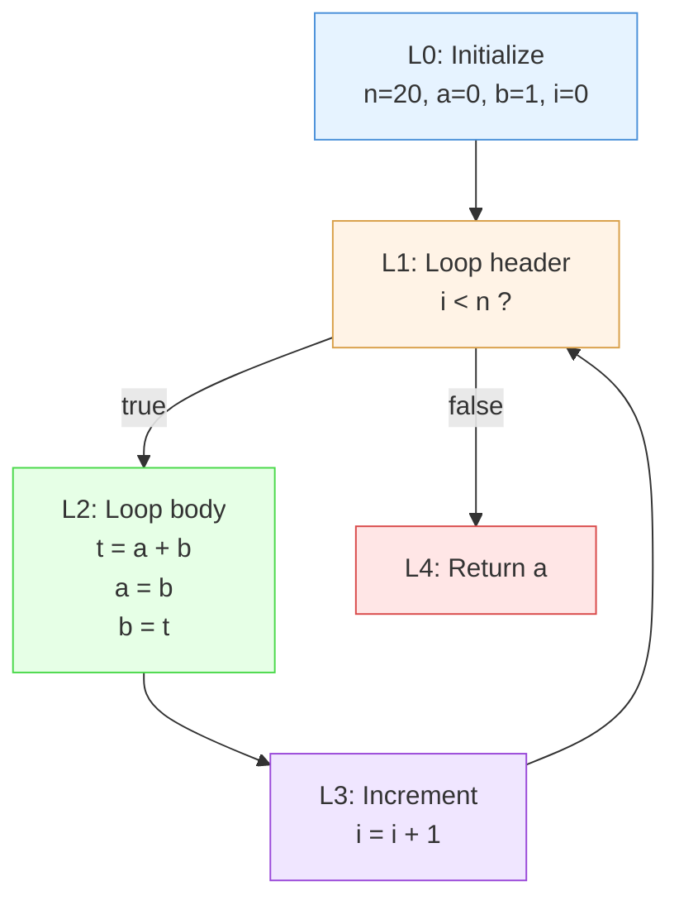
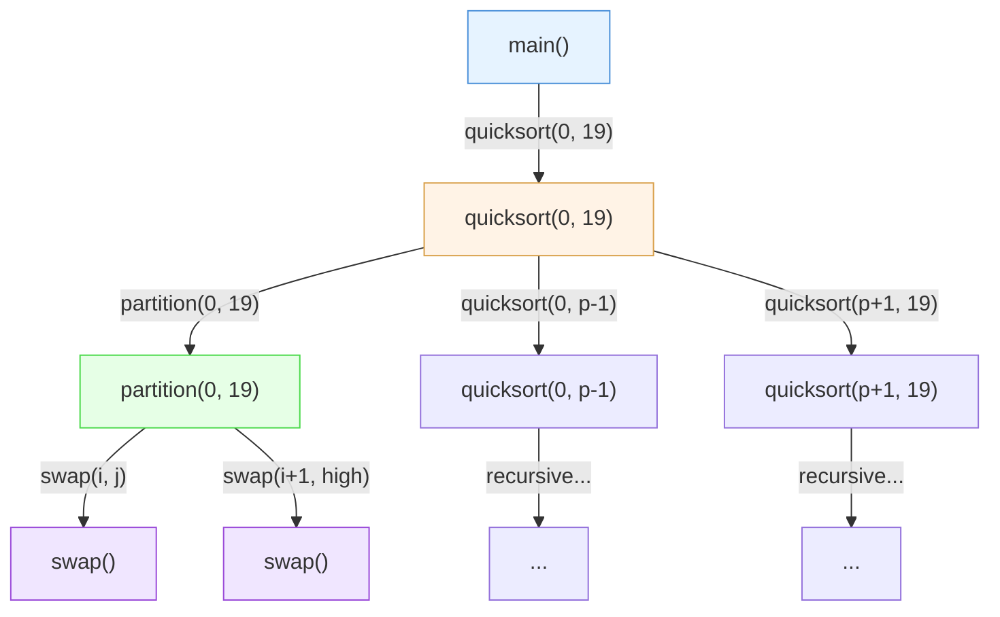
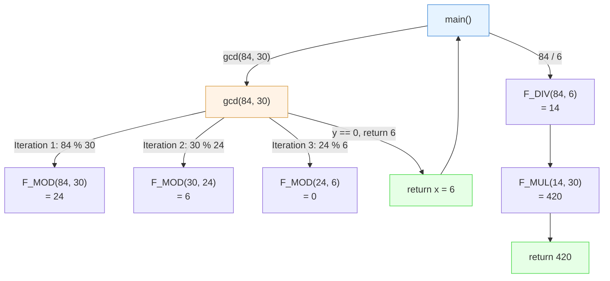
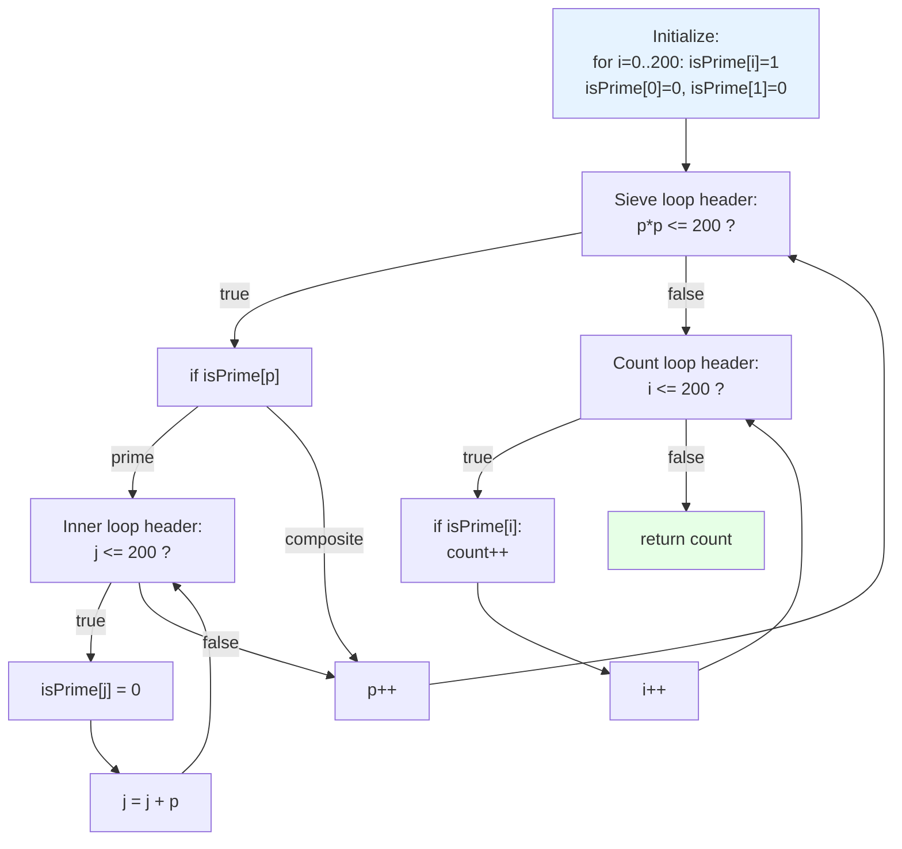
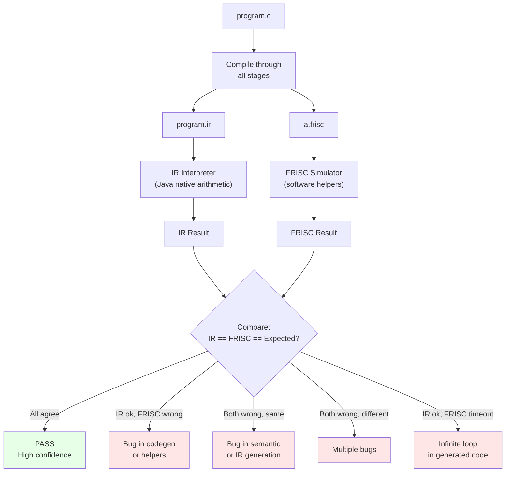

> **📖 From the book.** This chapter accompanies *Building a C-Subset Compiler for the FRISC Architecture: From Formal Languages to Executable Code* by Dr. Karlo Knežević (Zenodo, 2026). For the complete treatment — formal development, proofs, and figures — read the book: [📄 PDF](../book/Building-a-C-Subset-Compiler-for-the-FRISC-Architecture.pdf) · DOI [10.5281/zenodo.20511073](https://doi.org/10.5281/zenodo.20511073) · ISBN 978-953-47198-0-0.

## Why Example Suites Matter

A compiler is only as trustworthy as the behaviors it can reproduce across diverse programs. Unit tests on minimal expressions verify individual transformations, but they cannot expose the interaction effects that arise when multiple language features, optimization passes, and runtime helpers operate simultaneously on realistic code. This project uses structured example suites to validate both correctness and regression resilience. The suites are not random program collections; they are curated by language feature, complexity, and expected outcome category, forming a systematic validation framework.

\index{example suite}
\index{validation}

The fundamental insight driving the example suite design is that compiler bugs are often latent: they emerge only when specific combinations of features interact. A division helper that works correctly in isolation may fail when called from inside a nested loop where register pressure forces spills. An optimization that is sound for integer code may misfire when applied to fixed-point expressions. Only a broad and deep example suite can surface these interaction bugs.

## Suite Taxonomy

\index{test taxonomy}

The repository contains four top-level example families, each serving a distinct validation purpose.

| Suite | Path | Purpose | Approximate Count |
|-------|------|---------|-------------------|
| Valid programs | `examples/valid/` | Must compile and execute correctly; return value matches expectation | ~150 |
| Invalid programs | `examples/invalid/` | Must fail compilation with appropriate diagnostics | ~30 |
| FER compatibility | `examples/fer/` | Large regression corpus from academic course exercises | ~50 |
| Real-world algorithms | `examples/real_world/` | Algorithmically rich workloads stressing all compiler subsystems | ~30 |

Each program directory typically contains `program.c` (source), and the pipeline produces `program.ir` (intermediate representation) and `a.frisc` (FRISC assembly output). Expected outputs are encoded in the test harness or in companion metadata files.

### Program Taxonomy by Features Tested

\index{feature coverage}

The following table categorizes the complete example suite by the language features and compiler subsystems each program exercises. This taxonomy guides test selection when a specific compiler component changes.

| Feature Category | Representative Programs | Language Features | Compiler Subsystems Stressed |
|-----------------|------------------------|-------------------|------------------------------|
| Basic arithmetic | `arithmetic_int/*`, `math_fibonacci_iter` | `+`, `-`, `*`, `/`, `%` | Codegen ALU ops, helper calls (F_MUL, F_DIV, F_MOD) |
| Float arithmetic | `arithmetic_float/*`, `ml_linear_regression_step` | Q16.16 `float`, `+`, `-`, `*`, `/` | F_FMUL, F_FDIV, F_I2F, F_F2I helpers |
| Array operations | `arrays/*`, `real_prime_sieve`, `real_quicksort_max` | Array declaration, indexing, bounds | Index linearization, bounds checking, LOAD/STORE offsets |
| Struct operations | `structs/*` | Struct declaration, field access, assignment | Layout computation, field offset calculation, multi-word copy |
| Pointer operations | `pointers/*` | `&`, `*`, pointer parameters | Address computation, indirect LOAD/STORE |
| Control flow | `control_flow/*`, `eng_dijkstra_shortest_path` | `if`/`else`, `while`, `for`, `do-while`, `switch`, `break`, `continue` | Branch lowering, condition codes, CFG construction |
| Function calls | `math_gcd_lcm`, `real_quicksort_max` | Recursive calls, multi-argument passing | CALL/RET, stack frame, argument push/pop |
| Mixed features | `ml_kmeans_1d`, `physics_damped_oscillator` | Arrays + floats + loops + functions | All subsystems simultaneously |
| Global variables | `math_gcd_lcm`, `real_quicksort_max` | Global int/array declarations, initialization | Global data section, label addressing |
| Nested loops | `real_prime_sieve`, `math_matrix_vector` | 2-3 level loop nesting | Loop header/latch/exit lowering, register pressure |

### Real-World Suite Categories

The `examples/real_world/` suite is organized by application domain:

| Category | Representative Programs | Primary Stress |
|----------|------------------------|----------------|
| Mathematics | `math_fibonacci_iter`, `math_gcd_lcm`, `math_integer_sqrt`, `math_polynomial_horner`, `math_matrix_vector` | Loop iteration, integer helpers, array indexing |
| Machine Learning | `ml_linear_regression_step`, `ml_logistic_forward`, `ml_kmeans_1d`, `ml_confusion_matrix_accuracy`, `ml_moving_average_anomaly` | Q16.16 arithmetic, helper call density, mixed int/float |
| Physics Simulation | `physics_projectile_steps`, `physics_damped_oscillator`, `physics_energy_balance`, `physics_kinematics_position`, `physics_rocket_thrust` | Floating-point loops, accumulation precision, deep nesting |
| Engineering | `eng_activity_selection`, `eng_dijkstra_shortest_path`, `eng_grid_min_cost`, `eng_pid_control`, `eng_queue_simulation` | Graph algorithms, dynamic programming, control flow complexity |
| Classic Algorithms | `real_quicksort_max`, `real_prime_sieve`, `real_bfs_shortest_path`, `real_knapsack_dp`, `real_dot_product` | Recursion, array-heavy computation, large iteration counts |
| Numerical Methods | `real_gradient_descent_quadratic`, `real_tan_taylor`, `real_perceptron_sigmoid`, `real_checksum_crc` | Convergence loops, Taylor series, bitwise operations |

## Validation Dimensions

Examples are used to validate four independent dimensions of compiler correctness.

| Dimension | What is checked | Checked by |
|-----------|----------------|------------|
| Front-end correctness | Lexical analysis produces correct tokens; parser builds correct AST; semantic analysis detects type errors and scope violations | Invalid suite (must reject); Valid suite (must accept) |
| IR correctness | IR is typed, grammar-conformant, and semantically faithful to the source | IR interpreter execution; IR textual comparison |
| Backend correctness | Generated FRISC assembly preserves IR behavior | FRISC simulator execution compared to IR interpreter |
| Runtime behavior | Simulator output (R6 value) matches the expected return value | Automated test assertions |

A mature workflow cross-validates multiple execution paths. The key insight is that no single execution path is trusted unconditionally. The IR interpreter provides a reference oracle, and the FRISC simulator provides the target-level confirmation. Agreement between both provides strong evidence of correctness.

## Reference Workflow for One Program

\index{validation workflow}

Given a source file `program.c`, the validation workflow proceeds as follows:

**Step 1: Compile through all stages.**

```text
program.c  -->  [Lexer]  -->  token stream
           -->  [Parser]  -->  AST
           -->  [Semantic Analysis]  -->  annotated AST
           -->  [IR Generation]  -->  program.ir
           -->  [Optimization (optional)]  -->  program.ir (optimized)
           -->  [FRISC Codegen]  -->  a.frisc
```

**Step 2: Execute via IR interpreter.**

```text
ir_result := run_ir(program.ir)
```

The IR interpreter walks the IR representation directly, evaluating each instruction according to the IR's semantic specification. It maintains a virtual memory and register file, and returns the value in the virtual return register.

**Step 3: Execute via FRISC simulator.**

```text
frisc_result := run_frisc(a.frisc)
```

The FRISC simulator (via `FriscRunner`) assembles and executes the FRISC assembly, returning the decimal value of register R6.

**Step 4: Triangulate results.**

```text
assert ir_result == expected        // IR matches specification
assert frisc_result == expected     // FRISC matches specification
assert ir_result == frisc_result    // IR and FRISC agree
```

This three-way comparison is more powerful than any single check:
- If IR succeeds but FRISC fails, the bug is in code generation or the runtime helpers.
- If both fail identically, the bug is likely in semantic analysis or IR generation.
- If both fail differently, there are multiple bugs or a fundamental misunderstanding of the expected behavior.
- If FRISC succeeds but IR fails, the IR interpreter has a bug (rare but possible).

## Detailed Walkthrough: Fibonacci Iterative

\index{Fibonacci}

This walkthrough traces the `math_fibonacci_iter` program through every compiler stage, providing a concrete end-to-end example.

### Source Code

```c
// EXPECT: 6765

int main(void) {
  int n = 20;
  int a = 0;
  int b = 1;
  int i;
  int t;

  for (i = 0; i < n; i++) {
    t = a + b;
    a = b;
    b = t;
  }

  return a;
}
```

The program computes the 20th Fibonacci number (0-indexed: F(0)=0, F(1)=1, ..., F(20)=6765) using iterative computation. It returns 6765 in R6.

### IR Representation

The IR for this program uses five local variables allocated in a 20-byte frame:

```text
.func main():int32
  .frame locals=20 bytes align=4
  .slots
    local n@0:int32      ; offset 0 from frame base
    local a@4:int32      ; offset 4
    local b@8:int32      ; offset 8
    local i@12:int32     ; offset 12
    local t@16:int32     ; offset 16
```

The control flow consists of four basic blocks:



Key IR instructions in the loop body (block L2):

```text
L2:
    t9 = addr_of_symbol local:a          ; &a
    t10 = load t9 : int32                ; load a
    t11 = addr_of_symbol local:b          ; &b
    t12 = load t11 : int32                ; load b
    t13 = add t10, t12 : int32            ; a + b
    t14 = addr_of_symbol local:t          ; &t
    store t14, t13 : int32                ; t = a + b
    t15 = load t11 : int32                ; load b
    store t9, t15 : int32                 ; a = b
    t16 = load t14 : int32                ; load t
    store t11, t16 : int32                ; b = t
```

This is a pure address-based IR: every variable access goes through `addr_of_symbol` followed by `load` or `store`. The optimizer can eliminate many of these redundant address computations and loads.

### FRISC Assembly (Key Excerpts)

The generated assembly follows the standard pattern: entry stub, function prologue, loop with comparisons, and epilogue.

**Entry stub:**
```asm
        MOVE 40000, R7          ; SP = 0x40000 (hex)
        CALL F_MAIN             ; Call main
        HALT                    ; Program end
```

**Function prologue:**
```asm
F_MAIN
        PUSH R5                 ; Save old FP
        MOVE R7, R5             ; Set FP = SP
        SUB R7, 6C, R7          ; Allocate 0x6C = 108 bytes
                                ; (20 bytes locals + 88 bytes temps)
```

**Loop comparison (L1):**
```asm
L_MAIN_L1
        ; Load i into R0
        LOAD R0, (R5-2C)        ; t5 = i
        ; Load n into temp
        LOAD R0, (R5-34)        ; t7 = n
        ; Compare i < n
        CMP R0, R1
        JP_SLT L_CMP_TRUE_3     ; if i < n, set flag = 1
        MOVE 0, R0               ; else flag = 0
        JP L_CMP_END_4
L_CMP_TRUE_3
        MOVE 1, R0               ; flag = 1
L_CMP_END_4
        ; Branch on flag
        CMP R0, 0
        JP_NE L_MAIN_L2          ; if true, enter loop body
        JP L_MAIN_L4              ; else exit
```

**Loop body -- addition (L2):**
```asm
L_MAIN_L2
        ; Load a and b, compute a + b
        LOAD R0, (R5-40)        ; t10 = a
        LOAD R0, (R5-48)        ; t12 = b
        ADD R0, R1, R0           ; t13 = a + b
        STORE R0, (R5-4C)       ; store to temp t13
```

This program uses no helper calls (no multiplication, division, or modulo), so it executes entirely with plain `ADD`, `LOAD`, `STORE`, `CMP`, and `JP` instructions. This makes it one of the fastest programs in the suite, at approximately 2,000 instructions for 20 iterations.

### Execution Trace (First 3 Iterations)

| Step | PC | Instruction | Key Registers | Note |
|------|-----|-------------|---------------|------|
| 0 | 0x0000 | `MOVE 40000, R7` | R7=0x40000 | SP init |
| 1 | 0x0004 | `CALL F_MAIN` | SP=0x3FFFC | Push return addr |
| 2 | 0x000C | `PUSH R5` | SP=0x3FFF8 | Save FP |
| 3 | 0x0010 | `MOVE R7, R5` | R5=0x3FFF8 | Set FP |
| 4 | 0x0014 | `SUB R7, 6C, R7` | SP=0x3FF8C | Allocate frame |
| ... | ... | (frame zeroing) | ... | Clear 27 words |
| ~35 | ... | (initialize n=20, a=0, b=1, i=0) | ... | Store to locals |
| ~50 | L1 | Compare i(0) < n(20) | R0=0, R1=20 | Enter loop |
| ~60 | L2 | a(0) + b(1) = 1 | R0=1 | t = 1 |
| ~70 | L2 | a = b (1), b = t (1) | a=1, b=1 | Update |
| ~80 | L3 | i = 0 + 1 = 1 | i=1 | Increment |
| ~90 | L1 | Compare i(1) < n(20) | true | Continue |
| ~100 | L2 | a(1) + b(1) = 2 | R0=2 | t = 2 |
| ~110 | L2 | a = 1, b = 2 | a=1, b=2 | Update |
| ... | ... | ... | ... | 18 more iterations |
| ~400 | L4 | Return a = 6765 | R6=6765 | Done |

### Complexity Analysis

- **Source-level operations per iteration:** 1 addition, 2 assignments, 1 comparison, 1 increment = 5 operations.
- **FRISC instructions per iteration (O0):** approximately 80 instructions (due to redundant loads/stores of temporaries).
- **Total instructions (20 iterations):** approximately 80 * 20 + 100 (setup/teardown) = 1,700 instructions.
- **Optimization opportunity:** with register allocation, the loop body could be reduced to approximately 10 instructions (load a, load b, add, store t, move b to a, move t to b, increment i, compare, branch), a potential 8x reduction.

## Detailed Walkthrough: Quicksort

\index{quicksort}
\index{recursion}

The `real_quicksort_max` program sorts a 20-element integer array using recursive quicksort and returns the maximum element (the last element after sorting).

### Source Code

```c
// EXPECT: 50

int A[20] = {12, -3, 45, 7, 7, 0, -50, 23, 5, -1,
             45, 9, 16, -20, 33, 2, -8, 50, -4, 12};

void swap(int i, int j) {
  int t = A[i];
  A[i] = A[j];
  A[j] = t;
}

int partition(int low, int high) {
  int pivot = A[high];
  int i = low - 1;
  int j;
  for (j = low; j < high; j++) {
    if (A[j] <= pivot) {
      i++;
      swap(i, j);
    }
  }
  swap(i + 1, high);
  return i + 1;
}

void quicksort(int low, int high) {
  if (low < high) {
    int p = partition(low, high);
    quicksort(low, p - 1);
    quicksort(p + 1, high);
  }
}

int main(void) {
  quicksort(0, 19);
  return A[19];
}
```

This program exercises multiple compiler subsystems simultaneously: global arrays with initializers, function calls with argument passing, recursion, array indexing with bounds checking, comparisons, and conditional control flow.

### Call Graph

The call graph for quicksort illustrates the recursive structure:



### IR Structure

The IR for quicksort is more complex than Fibonacci, involving four functions and inter-procedural calls:

**`swap` function IR (key instruction):**
```text
.func swap(i:int32, j:int32):void
  L0:
    t0 = addr_of_symbol global:A
    t1 = addr_of_symbol param:i
    t2 = load t1 : int32
    t3 = addr_index t0, t2, 4     ; A + i*4 (element size = 4 bytes)
    t4 = load t3 : int32           ; t = A[i]
    ...
```

The `addr_index` instruction computes the address of an array element: `base + index * stride`. The backend lowers this to a shift-and-add sequence (`SHL R1, 2, R1` followed by `ADD R0, R1, R0`) with bounds checking.

**`quicksort` function IR (recursive structure):**
```text
.func quicksort(low:int32, high:int32):void
  L0:
    t0 = addr_of_symbol param:low
    t1 = load t0 : int32
    t2 = addr_of_symbol param:high
    t3 = load t2 : int32
    t4 = cmp_lt t1, t3 : bool
    br t4, L1, L2                  ; if low < high, recurse
  L1:
    ...
    t9 = call func:partition(t6, t8) : int32
    ...
    call func:quicksort(t11, t13) : void   ; left partition
    ...
    call func:quicksort(t15, t16) : void   ; right partition
```

### Key Assembly Sequences

**Array access with bounds checking:**
```asm
        MOVE G_A, R0            ; Base address of global array A
        ; ... load index into R1 ...
        CMP R1, 0               ; Bounds check: index >= 0?
        JP_SLT L_BOUNDS_ERROR
        CMP R1, 14              ; Bounds check: index < 20 (0x14)?
        JP_SGE L_BOUNDS_ERROR
        SHL R1, 2, R1           ; Index * 4 (word size)
        ADD R0, R1, R0          ; Effective address = base + offset
        LOAD R0, (R0)           ; Load element
```

**Recursive call sequence:**
```asm
        ; Push arguments for quicksort(low, p-1)
        PUSH R0                 ; arg: p-1
        PUSH R1                 ; arg: low
        CALL F_QUICKSORT
        ADD R7, 8, R7           ; Clean 2 arguments (2 * 4 bytes)
```

### Stack Depth Analysis

For quicksort on 20 elements, the recursion depth depends on the pivot selection. With the last-element pivot strategy:
- **Best case** (balanced partitions): depth ~ log2(20) ~ 5
- **Worst case** (sorted input): depth ~ 20
- **Typical case** for this specific input: depth ~ 8-10

Each stack frame consumes: 4 (return address) + 4 (saved FP) + locals + temps bytes. For `quicksort`, the frame is approximately 60-80 bytes. At maximum depth 10, the total stack usage is approximately 800 bytes from quicksort alone, plus frames for `partition` and `swap` calls within each level.

### Instruction Count Breakdown

| Function | Approx. Calls | Approx. Instructions/Call | Total |
|----------|--------------|--------------------------|-------|
| `quicksort` | ~35 (including base cases) | ~50 | ~1,750 |
| `partition` | ~19 (one per non-base call) | ~400 (loop over subarray) | ~7,600 |
| `swap` | ~80 (within all partitions) | ~100 | ~8,000 |
| `main` | 1 | ~50 | ~50 |
| Bounds checks | ~200 (3 per swap + 1 per partition compare) | ~5 | ~1,000 |
| **Total** | | | **~18,400** |

The dominance of `swap` and `partition` reflects the O(n log n) algorithm with constant overhead per comparison and swap. No helper routines (F_MUL, F_DIV) are needed because the array index multiplication by 4 is handled by the `SHL R1, 2, R1` shift instruction.

## Detailed Walkthrough: GCD and LCM

\index{GCD}
\index{LCM}
\index{Euclidean algorithm}

The `math_gcd_lcm` program computes the LCM of 84 and 30 via the relationship LCM(a,b) = a / gcd(a,b) * b.

### Source Code

```c
// EXPECT: 420

int a = 84;
int b = 30;

int gcd(int x, int y) {
  int t;
  while (y != 0) {
    t = x % y;
    x = y;
    y = t;
  }
  return x;
}

int main(void) {
  int g = gcd(a, b);
  int l = (a / g) * b;
  return l;
}
```

### Call Graph and Execution Flow



### IR Key Sections

The `gcd` function's IR shows the while-loop structure with the modulo operation:

```text
L1:                                    ; Loop header
    t0 = addr_of_symbol param:y
    t1 = load t0 : int32
    t2 = cmp_ne t1, #0:int32 : bool   ; y != 0 ?
    br t2, L2, L3                      ; if true -> body, else -> exit
L2:                                    ; Loop body
    t3 = addr_of_symbol param:x
    t4 = load t3 : int32
    t5 = addr_of_symbol param:y
    t6 = load t5 : int32
    t7 = mod t4, t6 : int32           ; x % y -> F_MOD call
    ...
```

The `main` function's IR shows the division and multiplication:

```text
    t8 = div t6, t7 : int32           ; a / g -> F_DIV call
    t10 = mul t8, t9 : int32          ; (a/g) * b -> F_MUL call
```

### Helper Call Profile

This program is helper-dominated despite its simplicity:

| Helper | Calls | Approx. Cost/Call | Total Instructions |
|--------|-------|-------------------|--------------------|
| F_MOD | 3 | ~280 | ~840 |
| F_DIV | 1 | ~310 | ~310 |
| F_MUL | 1 | ~100 | ~100 |
| Plain code | - | - | ~400 |
| **Total** | | | **~1,650** |

Approximately 76% of the total instruction count is spent inside helper routines. The actual algorithmic work (three modulo operations, one division, one multiplication) is trivial, but the software implementation of these operations on FRISC (which lacks hardware multiply/divide) expands each one to hundreds of instructions.

### Euclidean Algorithm Convergence

The Euclidean algorithm for gcd(84, 30) converges in 3 iterations:

| Iteration | x | y | t = x % y |
|-----------|---|---|-----------|
| 1 | 84 | 30 | 24 |
| 2 | 30 | 24 | 6 |
| 3 | 24 | 6 | 0 |
| Exit | 6 | 0 | - |

Each iteration requires one F_MOD call (~280 instructions) plus approximately 30 instructions for the loop overhead (load/store/compare/branch). The total loop cost is approximately 3 * 310 = 930 instructions.

## Detailed Walkthrough: Prime Sieve

\index{Sieve of Eratosthenes}

The `real_prime_sieve` program implements the Sieve of Eratosthenes to count primes up to 200 using a `char` array.

### Source Code

```c
// EXPECT: 46

char isPrime[201];

int main(void) {
  int i;
  int p;
  int count = 0;

  for (i = 0; i <= 200; i++) {
    isPrime[i] = 1;             // Initialize all as prime
  }
  isPrime[0] = 0;
  isPrime[1] = 0;

  p = 2;
  while (p * p <= 200) {        // Only check up to sqrt(200)
    if (isPrime[p]) {
      int j = p * p;
      while (j <= 200) {
        isPrime[j] = 0;          // Mark as composite
        j = j + p;
      }
    }
    p++;
  }

  for (i = 2; i <= 200; i++) {
    if (isPrime[i]) {
      count++;
    }
  }

  return count;
}
```

### Feature Stress Points

This program exercises several important compiler features simultaneously:

1. **`char` array**: the `isPrime` array uses byte-width storage, requiring `STOREB`/`LOADB` instructions instead of word-width `STORE`/`LOAD`. A codegen bug that uses `LOAD` instead of `LOADB` would read 4 bytes at a time, producing incorrect values.

2. **Nested loops**: the sieve has two levels of nesting (outer `while p*p <= 200` containing inner `while j <= 200`), testing the compiler's loop nesting support.

3. **Multiplication in loop condition**: `p * p` requires an F_MUL call on each iteration of the outer loop, and `p * p` is also used to initialize `j` in the inner loop.

4. **Global char array**: the 201-byte `isPrime` array is allocated in the global data section, requiring correct byte-addressable access through global labels.

### Control Flow Structure



### Instruction Count Analysis

| Phase | Iterations | Key Operations | Approx. Instructions |
|-------|-----------|----------------|---------------------|
| Initialization loop | 201 | `STOREB` per element | ~2,000 |
| Outer sieve loop | 14 (p=2..14) | F_MUL for p*p, LOADB for check | ~5,000 |
| Inner sieve loops | ~170 total | STOREB to mark composites | ~3,000 |
| Counting loop | 199 | LOADB + conditional increment | ~4,000 |
| Setup/teardown | 1 | Prologue, epilogue, misc | ~500 |
| **Total** | | | **~14,500** |

The F_MUL calls for `p * p` computation account for a significant portion of the sieve phase cost. Since `p` only ranges from 2 to 14, there are only about 13 F_MUL calls, but each costs approximately 100-200 instructions.

## Complexity Analysis of Generated Code

\index{complexity analysis}

The relationship between source-level algorithmic complexity and generated instruction counts reveals the constant-factor overhead introduced by the compiler:

| Program | Algorithm | Source O() | Instructions (O0) | Effective Constant |
|---------|-----------|-----------|-------------------|-------------------|
| `math_fibonacci_iter` | Fibonacci (n=20) | O(n) | ~2,000 | ~100 instr/iter |
| `math_gcd_lcm` | Euclidean GCD + LCM | O(log(min(a,b))) | ~1,650 | ~550 instr/iter |
| `real_prime_sieve` | Sieve of Eratosthenes (n=200) | O(n log log n) | ~14,500 | ~27 instr/element |
| `real_quicksort_max` | Quicksort (n=20) | O(n log n) avg | ~18,400 | ~16 instr/compare |
| `real_knapsack_dp` | 0/1 Knapsack DP | O(nW) | ~35,000 | varies |
| `ml_linear_regression_step` | Gradient descent | O(n * features) | ~200,000 | ~1000 instr/element |

The "effective constant" varies dramatically between integer-only programs (Fibonacci: ~100 per iteration) and helper-heavy programs (linear regression: ~1000 per element). This 10x difference is entirely due to the software arithmetic helpers.

### Instruction Amplification Factor

A useful metric for comparing generated code quality is the instruction amplification factor: the ratio of FRISC instructions executed to source-level operations performed.

| Program | Source Operations | FRISC Instructions | Amplification |
|---------|------------------|--------------------|---------------|
| `math_fibonacci_iter` | ~100 (5 ops * 20 iters) | ~2,000 | 20x |
| `math_gcd_lcm` | ~15 (3 mod + 1 div + 1 mul + misc) | ~1,650 | 110x |
| `real_quicksort_max` | ~400 (comparisons + swaps) | ~18,400 | 46x |

The high amplification for `math_gcd_lcm` reflects the helper call overhead: each modulo or division translates to 250-300 instructions, whereas each Fibonacci addition translates to a single `ADD` instruction plus load/store overhead.

## Walkthrough: Iterative vs Recursive Fibonacci Comparison

\index{iterative vs recursive}

Although the test suite uses iterative Fibonacci, comparing it with a hypothetical recursive implementation illustrates the compiler's handling of different algorithmic approaches:

### Iterative (actual implementation)

```c
int fib_iter(int n) {
    int a = 0, b = 1, t, i;
    for (i = 0; i < n; i++) {
        t = a + b; a = b; b = t;
    }
    return a;
}
```

**Characteristics:**
- Single stack frame, no recursion overhead
- Loop body: 1 addition + 2 assignments per iteration
- O(n) time, O(1) space
- Estimated FRISC instructions for n=20: ~2,000

### Recursive (hypothetical)

```c
int fib_rec(int n) {
    if (n <= 1) return n;
    return fib_rec(n-1) + fib_rec(n-2);
}
```

**Characteristics:**
- Exponential function calls: ~2^20 = ~1,048,576 calls for n=20
- Each call: prologue (~15 instr) + comparison (~10 instr) + epilogue (~10 instr) + 2 recursive calls
- O(2^n) time, O(n) stack space
- Estimated FRISC instructions for n=20: ~35,000,000 (35M)

### Comparison Summary

| Metric | Iterative | Recursive |
|--------|-----------|-----------|
| Function calls | 1 (main) | ~1,048,576 |
| Stack depth | 1 frame | ~20 frames |
| Stack usage | ~120 bytes | ~2,400 bytes (20 * ~120) |
| Total instructions | ~2,000 | ~35,000,000 |
| Ratio | 1x | ~17,500x |

This comparison illustrates why algorithmic choice has a much larger impact on execution cost than compiler optimization. No optimization pass can reduce the recursive Fibonacci to iterative complexity; only the programmer can make that choice.

## Real-World Suite as Stress Harness

The `examples/real_world/` suite includes workloads specifically designed to expose interaction effects that simpler tests miss:

- **Nested loops with helper calls**: programs like `real_prime_sieve` and `ml_kmeans_1d` call `F_MOD` or `F_FMUL` inside tight inner loops, creating high instruction counts that test both correctness and performance.
- **Mixed arithmetic domains**: programs like `ml_linear_regression_step` combine integer indexing with Q16.16 float computation, stressing the type conversion helpers `F_I2F` and `F_F2I` alongside `F_FMUL` and `F_FDIV`.
- **Large temporary pressure**: programs with many live variables simultaneously test the register allocator's spill/reload logic and the frame layout's slot assignment.
- **Branch-heavy CFG patterns**: programs like `eng_dijkstra_shortest_path` and `real_bfs_shortest_path` have complex control flow graphs with many conditional branches, testing the backend's branch lowering and condition code mapping.
- **Deep recursion**: while most programs use iterative algorithms (to fit within the stack-only memory model), some programs test moderate recursion depths, stressing the stack frame discipline.
- **Accumulation precision**: physics simulations like `physics_damped_oscillator` accumulate Q16.16 values over many iterations, testing whether rounding errors remain within acceptable bounds.

## Invalid Suite and Diagnostic Quality

\index{error diagnostics}

The `examples/invalid/` suite tests that the compiler rejects ill-formed programs with appropriate diagnostics. Each invalid program targets a specific error class:

| Error Class | Examples | Expected Phase | Diagnostic Quality Criteria |
|-------------|----------|----------------|-----------------------------|
| Lexical errors | Unterminated strings, invalid characters | Lexer | Report character position and the offending character |
| Syntax errors | Missing semicolons, malformed expressions | Parser | Report token position and expected alternatives |
| Type errors | `int + float` without conversion, wrong argument types | Semantic analysis | Report the types involved and the operation |
| Scope errors | Undeclared variables, duplicate declarations | Semantic analysis | Report the identifier name and scope context |
| Array errors | Non-constant array size, out-of-bounds constant index | Semantic analysis | Report the array name and the problematic size/index |

The quality criterion for invalid-program handling is specificity: the compiler should report the error phase, the source location, and a message that distinguishes the specific error from other errors in the same class. A generic "compilation failed" message is insufficient.

## IR Interpreter vs FRISC Simulator Triangulation

\index{triangulation}

The triangulation methodology is the backbone of the project's correctness assurance. The two execution paths exercise fundamentally different code:

| Aspect | IR Interpreter | FRISC Simulator |
|--------|---------------|-----------------|
| Execution level | IR instructions (high-level) | FRISC machine code (low-level) |
| Arithmetic | Java native `int` and `float` | Software helpers (shift-and-add, long division) |
| Memory model | Virtual register file + memory array | Byte-addressable simulated RAM |
| Control flow | Direct IR block traversal | PC-based instruction fetch |
| Calling convention | Implicit (Java call stack) | Explicit (PUSH/POP/CALL/RET on simulated stack) |

When both paths agree, confidence in correctness is high because the same semantic intent was realized through two independent implementations. When they disagree, the differing aspect (arithmetic, memory, control flow) immediately narrows the bug search.

### Triangulation Failure Modes

| IR Result | FRISC Result | Diagnosis |
|-----------|-------------|-----------|
| Correct | Correct | Likely correct |
| Correct | Wrong | Bug in code generation, helper routines, or stack discipline |
| Wrong | Wrong (same) | Bug in semantic analysis or IR generation |
| Wrong | Wrong (different) | Multiple bugs, or IR interpreter bug |
| Correct | Timeout | Infinite loop in generated code (see Chapter 10 debugging) |
| Timeout | Timeout | Likely a source-level infinite loop or IR generation bug |

### Triangulation Workflow Diagram



## Regression Testing Strategy

### Deterministic Artifact Comparison

For stable phases (lexer, parser, IR generation), the test harness can compare output artifacts byte-for-byte against golden references. This catches unintended changes to formatting, ordering, or content that might indicate a regression.

### Semantic Equivalence Checks

For phases where formatting may change but meaning must not (e.g., after optimization), the test harness compares execution results rather than textual output. Both IR interpreter and FRISC simulator results must match the expected value.

### Optimization Level Comparison

When adding or modifying optimization passes, the regression strategy compares:
- O0 (no optimization) vs O1 (with optimization passes enabled) for every program in the valid and real_world suites.
- Both must produce the same return value.
- Instruction count may decrease (expected) but must not increase beyond a threshold.

Any program where O0 and O1 disagree on the return value indicates an unsound optimization.

### Periodic Full-Suite Execution

The complete suite (`valid`, `invalid`, `fer`, `real_world`) should be executed periodically (ideally on every commit in CI). Programs that are known to exceed the step limit due to legitimate algorithmic cost are whitelisted with their expected instruction counts, so that genuine regressions (instruction count increase beyond a tolerance) are still detected.

### Test Corpus Design Principles

For building a similar compiler, example suites should be structured in three tiers:

1. **Micro-tests** (tier 1): one test per language feature, minimal code, fast execution. Purpose: verify each feature in isolation. Example: a program that returns `3 + 4` tests integer addition.

2. **Integration tests** (tier 2): programs combining 2-5 features. Purpose: verify feature interactions. Example: a program that uses arrays inside loops with function calls tests array indexing, loop control flow, and calling convention together.

3. **Algorithmic workloads** (tier 3): complete algorithms with nontrivial input sizes. Purpose: stress backend robustness, helper correctness, and performance. Example: quicksort on a 20-element array tests recursion depth, array access patterns, comparison lowering, and swap sequences.

The third tier is where many backend and optimization defects become visible, because these programs exercise long execution paths where small per-instruction errors accumulate into observable failures.

## Case Study: Helper-Dominated Runtime

\index{helper call overhead}
\index{Q16.16 arithmetic}

In helper-heavy programs (for example, `real_perceptron_sigmoid` which performs sigmoid approximation using Q16.16 fixed-point arithmetic), correctness may hold while simulation time grows sharply. The program computes weighted sums, applies a piecewise sigmoid approximation, and updates weights, all using `F_FMUL` and `F_FDIV`.

The diagnostic workflow for such programs:

1. **IR interpreter confirms semantic correctness quickly** (milliseconds), because it uses native Java arithmetic.
2. **FRISC trace confirms backend/runtime consistency**, but takes much longer due to the software helper overhead.
3. **Performance analysis** (Chapter 12) identifies `F_FDIV` as the dominant cost center, consuming approximately 700-800 instructions per call and being invoked thousands of times.
4. **Optimization focus** targets helper call reduction: strength reduction to replace division by constants with multiplication by reciprocals, loop-invariant code motion to hoist repeated conversions, and constant folding to eliminate unnecessary `F_I2F`/`F_F2I` pairs.

This case study illustrates that correctness and performance are often orthogonal concerns: the program produces the right answer, but the path to that answer is orders of magnitude longer than necessary.

### Helper Cost Visualization

The following table summarizes the cost profile for representative helper-dominated programs:

| Program | Total Instr. | Helper % | Dominant Helper | Calls | Instr/Call |
|---------|-------------|----------|----------------|-------|------------|
| `ml_linear_regression_step` | ~200K | ~80% | F_FMUL | ~350 | ~350 |
| `physics_damped_oscillator` | ~500K | ~85% | F_FDIV | ~300 | ~750 |
| `real_perceptron_sigmoid` | ~1M | ~70% | F_FMUL + F_FDIV | ~1600 | ~450 avg |
| `real_gradient_descent_quadratic` | ~800K | ~75% | F_FDIV | ~500 | ~750 |
| `math_gcd_lcm` | ~1.6K | ~76% | F_MOD | 3 | ~280 |

In every case, the software arithmetic helpers account for the majority of execution time. This is the fundamental performance characteristic of a RISC ISA without hardware multiply/divide support.

## Adding New Test Programs

\index{test program guidelines}

When adding a new program to the test suite:

1. Place the source file in the appropriate directory (`valid`, `invalid`, or `real_world`).
2. Document the expected return value in a comment: `// EXPECT: <value>`.
3. Run the program under both IR interpreter and FRISC simulator.
4. Verify that both agree on the result.
5. Record the instruction count for regression tracking.
6. If the program exercises a new language feature or optimization, add it to the relevant test category in the taxonomy table.
7. If the program is known to be slow (high instruction count), whitelist it with the expected count and a tolerance margin.
8. Include a brief comment describing what features the program tests and why it was added.

### New Program Checklist

```text
[ ] Source file placed in correct directory
[ ] EXPECT comment with correct return value
[ ] IR interpreter produces correct result
[ ] FRISC simulator produces correct result
[ ] IR and FRISC results agree
[ ] Instruction count recorded in baseline
[ ] Optimization levels (O0, O1) both produce correct result
[ ] Program categorized in feature taxonomy
[ ] If slow (>100K instructions): added to whitelist with tolerance
```
