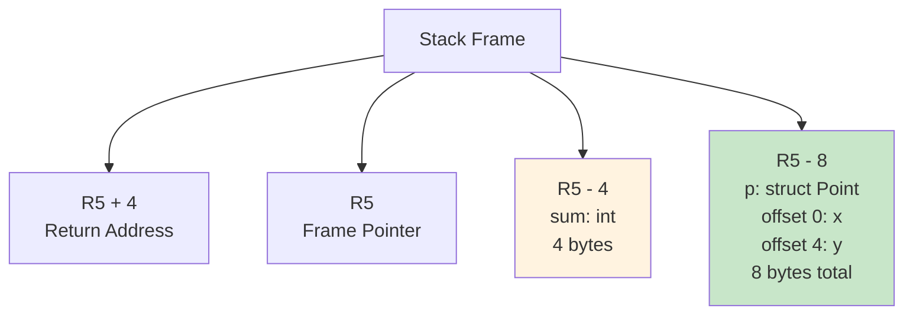
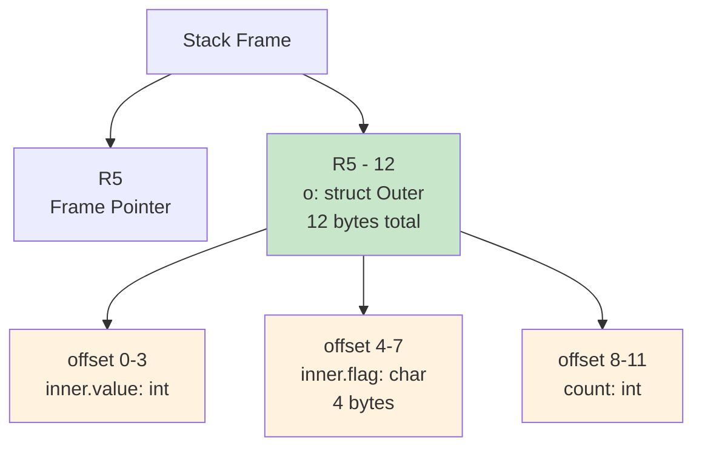

# Struct Examples and Case Studies

## Overview

This appendix provides comprehensive examples and case studies demonstrating struct implementation in the PPJ compiler. Each example includes complete C source code, memory layout diagrams, symbol table snapshots, and generated FRISC assembly code with detailed commentary.

## Case Study 1: Simple Struct with Field Access

### Source Code

```c
struct Point {
    int x;
    int y;
};

int main(void) {
    struct Point p;
    int sum;
    
    p.x = 10;
    p.y = 20;
    sum = p.x + p.y;
    
    return sum;
}
```

### Memory Layout



**Field Offsets:**
- `p.x`: offset 0 (first field)
- `p.y`: offset 4 (second field, after 4-byte int)

**Total Struct Size:** 8 bytes

### Symbol Table Snapshot

```
Global Scope:
  Point: StructType(tag="Point", fields={x→int, y→int})
  
Function Scope (main):
  p: VariableSymbol(name="p", type=StructType("Point"), isConst=false)
  sum: VariableSymbol(name="sum", type=PrimitiveType.INT, isConst=false)
```

### Generated FRISC Code

```frisc
; Function: main
MAIN:
    PUSH R5                      ; Save old frame pointer
    MOVE R7, R5                  ; Set frame pointer
    SUB R7, %D 12, R7           ; Allocate locals (p: 8 bytes, sum: 4 bytes)

    ; p.x = 10
    MOVE %D 10, R0               ; Load constant 10
    MOVE R0, R1                  ; Save value
    MOVE R5, R0                  ; Base address (frame pointer)
    ADD R0, -8, R0               ; Add struct offset (p at R5 - 8)
    ADD R0, %D 0, R0             ; Add field offset (x at offset 0)
    STORE R1, (R0)               ; Store to p.x

    ; p.y = 20
    MOVE %D 20, R0               ; Load constant 20
    MOVE R0, R1                  ; Save value
    MOVE R5, R0                  ; Base address
    ADD R0, -8, R0               ; Struct offset
    ADD R0, %D 4, R0             ; Add field offset (y at offset 4)
    STORE R1, (R0)               ; Store to p.y

    ; sum = p.x + p.y
    ; Evaluate p.x
    MOVE R5, R0                  ; Base address
    ADD R0, -8, R0               ; Struct offset
    ADD R0, %D 0, R0             ; Field offset (x)
    LOAD R0, (R0)                ; Load p.x
    PUSH R0                      ; Save p.x on stack
    
    ; Evaluate p.y
    MOVE R5, R0                  ; Base address
    ADD R0, -8, R0               ; Struct offset
    ADD R0, %D 4, R0             ; Field offset (y)
    LOAD R0, (R0)                ; Load p.y
    MOVE R0, R1                  ; p.y in R1
    
    ; Add: p.x + p.y
    POP R0                       ; Restore p.x
    ADD R0, R1, R0               ; p.x + p.y
    STORE R0, (R5-4)             ; Store sum

    ; Return sum
    LOAD R6, (R5-4)              ; Load sum
    ADD R7, %D 12, R7            ; Deallocate locals
    POP R5                       ; Restore frame pointer
    RET                          ; Return
```

### Compilation Walkthrough

1. **Syntax Analysis**: Parser recognizes `struct Point` definition and `p.x`, `p.y` member accesses
2. **Semantic Analysis**: Type checker validates struct definition, field accesses, and assignment compatibility
3. **Code Generation**:
   - Allocates 8 bytes for `p` at offset -8 from frame pointer
   - Generates field access code using base address + field offset pattern
   - Generates addition code combining two field accesses

## Case Study 2: Nested Structs

### Source Code

```c
struct Inner {
    int value;
    char flag;
};

struct Outer {
    struct Inner inner;
    int count;
};

int main(void) {
    struct Outer o;
    
    o.inner.value = 42;
    o.inner.flag = 1;
    o.count = 10;
    
    return o.inner.value;
}
```

### Memory Layout



**Field Offsets:**
- `o.inner.value`: offset 0 (first field of Inner, which is first field of Outer)
- `o.inner.flag`: offset 4 (second field of Inner)
- `o.count`: offset 8 (second field of Outer, after Inner struct)

**Total Struct Sizes:**
- `Inner`: 8 bytes (int: 4 + char: 4)
- `Outer`: 12 bytes (Inner: 8 + int: 4)

### Symbol Table Snapshot

```
Global Scope:
  Inner: StructType(tag="Inner", fields={value→int, flag→char})
  Outer: StructType(tag="Outer", fields={inner→StructType("Inner"), count→int})
  
Function Scope (main):
  o: VariableSymbol(name="o", type=StructType("Outer"), isConst=false)
```

### Generated FRISC Code (Excerpt)

```frisc
; o.inner.value = 42
MOVE %D 42, R0                   ; Load constant 42
MOVE R0, R1                      ; Save value
MOVE R5, R0                      ; Base address (frame pointer)
ADD R0, -12, R0                  ; Add struct offset (o at R5 - 12)
ADD R0, %D 0, R0                 ; Add offset of inner field (0)
                                  ; inner is a nested struct, so we add its field offset
ADD R0, %D 0, R0                 ; Add offset of value field within Inner (0)
STORE R1, (R0)                   ; Store to o.inner.value

; o.inner.flag = 1
MOVE %D 1, R0                    ; Load constant 1
MOVE R0, R1                      ; Save value
MOVE R5, R0                      ; Base address
ADD R0, -12, R0                  ; Struct offset
ADD R0, %D 0, R0                 ; inner field offset (0)
ADD R0, %D 4, R0                 ; flag field offset within Inner (4)
STOREB R1, (R0)                  ; Store byte to o.inner.flag

; o.count = 10
MOVE %D 10, R0                   ; Load constant 10
MOVE R0, R1                      ; Save value
MOVE R5, R0                      ; Base address
ADD R0, -12, R0                  ; Struct offset
ADD R0, %D 8, R0                 ; count field offset (8)
STORE R1, (R0)                   ; Store to o.count

; return o.inner.value
MOVE R5, R0                      ; Base address
ADD R0, -12, R0                  ; Struct offset
ADD R0, %D 0, R0                 ; inner field offset
ADD R0, %D 0, R0                 ; value field offset
LOAD R0, (R0)                    ; Load o.inner.value
MOVE R0, R6                      ; Return value
```

### Key Observations

- Nested struct fields are laid out inline: `Inner`'s fields appear directly in `Outer`'s memory layout
- Member access code chains offsets: base address + `inner` offset + `value` offset
- The code generator recursively processes nested member access expressions

## Case Study 3: Struct with Array Field

### Source Code

```c
struct Buffer {
    int data[10];
    int count;
};

int main(void) {
    struct Buffer buf;
    int i = 5;
    
    buf.data[i] = 100;
    buf.count = i;
    
    return buf.data[i];
}
```

### Memory Layout

```mermaid
graph TB
    A[Stack Frame] --> B[R5<br/>Frame Pointer]
    A --> C[R5 - 48<br/>buf: struct Buffer<br/>44 bytes total]
    
    C --> D[offset 0-39<br/>data[10]: 10 * 4 = 40 bytes]
    C --> E[offset 40-43<br/>count: int<br/>4 bytes]
    
    style C fill:#c8e6c9
    style D fill:#fff3e0
    style E fill:#fff3e0
```

**Field Offsets:**
- `buf.data`: offset 0 (array base address)
- `buf.count`: offset 40 (after 10 * 4 = 40 bytes of array)

**Total Struct Size:** 44 bytes

### Array Size Extraction

The code generator extracts array sizes from the parse tree:

```java
StructArraySizeExtractor extractor = new StructArraySizeExtractor(parseTree);
Map<String, Integer> arraySizes = extractor.extractArraySizes("Buffer");
// Result: {"data": 10}
```

### Generated FRISC Code

```frisc
; buf.data[i] = 100
MOVE %D 100, R0                  ; Load constant 100
MOVE R0, R1                      ; Save value

; Compute base address of buf
MOVE R5, R0                      ; Frame pointer
ADD R0, -48, R0                  ; Struct offset (buf at R5 - 48)

; Add offset of data field (offset 0)
ADD R0, %D 0, R0                 ; Base address of array

; Load index i (assuming i is at R5 - 4)
LOAD R2, (R5-4)                 ; Load index

; Calculate element address: base + index * element_size
SHL R2, 2, R2                   ; Multiply index by 4 (int size)
ADD R0, R2, R0                  ; Element address: buf.data[i]

STORE R1, (R0)                  ; Store to buf.data[i]

; buf.count = i
LOAD R0, (R5-4)                 ; Load i
MOVE R0, R1                      ; Save value
MOVE R5, R0                      ; Base address
ADD R0, -48, R0                  ; Struct offset
ADD R0, %D 40, R0                ; count field offset (40)
STORE R1, (R0)                  ; Store to buf.count

; return buf.data[i]
MOVE R5, R0                      ; Base address
ADD R0, -48, R0                  ; Struct offset
ADD R0, %D 0, R0                 ; data field offset
LOAD R2, (R5-4)                 ; Load index
SHL R2, 2, R2                   ; Multiply by 4
ADD R0, R2, R0                  ; Element address
LOAD R0, (R0)                   ; Load buf.data[i]
MOVE R0, R6                      ; Return value
```

### Key Observations

- Array fields require array size extraction from the parse tree
- Array element access combines struct field offset with array indexing
- Element address calculation: `struct_base + field_offset + index * element_size`

## Case Study 4: Struct Assignment

### Source Code

```c
struct Point {
    int x;
    int y;
};

int main(void) {
    struct Point p, q;
    
    q.x = 10;
    q.y = 20;
    p = q;  // Struct assignment
    
    return p.x;
}
```

### Memory Layout

```
Stack Frame:
  R5 - 8:  p (struct Point, 8 bytes)
  R5 - 16: q (struct Point, 8 bytes)
```

### Generated FRISC Code

```frisc
; p = q (struct assignment)
; Compute source address (q)
MOVE R5, R2                      ; Frame pointer
ADD R2, -16, R2                  ; Source struct offset (q at R5 - 16)

; Compute destination address (p)
MOVE R5, R3                      ; Frame pointer
ADD R3, -8, R3                   ; Dest struct offset (p at R5 - 8)

; Copy loop: copy 8 bytes word-by-word
MOVE %D 8, R4                    ; Struct size (8 bytes)
L_LOOP:
    CMP R4, %D 0                 ; Check if counter is zero
    JP_EQ L_END                  ; Done if counter == 0
    
    LOAD R0, (R2)                ; Load word from source
    STORE R0, (R3)               ; Store word to destination
    
    ADD R2, %D 4, R2             ; Increment source pointer
    ADD R3, %D 4, R3             ; Increment dest pointer
    SUB R4, %D 4, R4             ; Decrement counter
    
    JP L_LOOP                    ; Continue loop
L_END:

; return p.x
MOVE R5, R0                      ; Base address
ADD R0, -8, R0                   ; Struct offset
ADD R0, %D 0, R0                 ; Field offset (x)
LOAD R0, (R0)                    ; Load p.x
MOVE R0, R6                      ; Return value
```

### Assignment Algorithm

1. **Compute Source Address**: Address of `q` (R5 - 16)
2. **Compute Destination Address**: Address of `p` (R5 - 8)
3. **Initialize Counter**: Struct size (8 bytes)
4. **Copy Loop**: 
   - Load word from source
   - Store word to destination
   - Increment both pointers by 4 bytes
   - Decrement counter by 4 bytes
   - Repeat until counter reaches zero

## Case Study 5: Struct Return from Function

### Source Code

```c
struct Point {
    int x;
    int y;
};

struct Point makePoint(int x, int y) {
    struct Point p;
    p.x = x;
    p.y = y;
    return p;
}

int main(void) {
    struct Point p;
    p = makePoint(10, 20);
    return p.x;
}
```

### Calling Convention

The compiler uses a **hidden return pointer** convention for struct-returning functions:

- **Caller**: Passes destination struct address in register R2 before CALL
- **Callee**: Writes struct directly to address in R2, avoiding extra copy

### Generated FRISC Code (Caller)

```frisc
; p = makePoint(10, 20)
; Compute destination address (p)
MOVE R5, R0                      ; Frame pointer
ADD R0, -8, R0                   ; Struct offset (p at R5 - 8)

; Save return pointer in R1 (temporary)
MOVE R0, R1

; Evaluate and push arguments (right-to-left)
MOVE %D 20, R0                   ; y = 20
PUSH R0
MOVE %D 10, R0                   ; x = 10
PUSH R0

; Set return pointer in R2
MOVE R1, R2                      ; Destination address in R2

; Call function
CALL F_MAKEPOINT

; Clean up arguments
ADD R7, %D 8, R7                 ; Remove 2 arguments (2 * 4 bytes)

; Struct already written to p by callee, no copy needed
```

### Generated FRISC Code (Callee)

```frisc
; Function: makePoint
F_MAKEPOINT:
    PUSH R5                      ; Save old frame pointer
    MOVE R7, R5                  ; Set frame pointer
    
    ; Allocate local struct
    SUB R7, %D 8, R7             ; Allocate local struct p (8 bytes)
    
    ; Access parameters (R5 + 8 = first arg, R5 + 12 = second arg)
    LOAD R0, (R5+8)              ; Load x parameter
    STORE R0, (R5-8)             ; Store to p.x (offset 0)
    
    LOAD R0, (R5+12)             ; Load y parameter
    STORE R0, (R5-4)             ; Store to p.y (offset 4)
    
    ; Copy local struct to return pointer (R2)
    ; Source: local struct at R5 - 8
    ; Destination: return pointer in R2
    MOVE R5, R0                  ; Source base
    ADD R0, -8, R0               ; Source offset
    MOVE R2, R1                  ; Destination (return pointer)
    
    ; Copy first word (p.x)
    LOAD R0, (R0)                ; Load p.x
    STORE R0, (R1)               ; Store to destination
    ADD R0, %D 4, R0             ; Increment source
    ADD R1, %D 4, R1             ; Increment destination
    
    ; Copy second word (p.y)
    LOAD R0, (R0)                ; Load p.y
    STORE R0, (R1)               ; Store to destination
    
    ; Return
    MOVE %D 0, R6                ; Return value (void-like for struct return)
    ADD R7, %D 8, R7             ; Deallocate locals
    POP R5                       ; Restore frame pointer
    RET                          ; Return
```

### Key Observations

- Hidden return pointer avoids extra copy operation
- Caller computes destination address and passes it in R2
- Callee writes struct directly to caller's destination
- More efficient than copying struct to return value register

## Case Study 6: Complex Nested Structure

### Source Code

```c
struct Inner {
    int value;
    int arr[3];
};

struct Middle {
    struct Inner inner;
    int data;
};

struct Outer {
    struct Middle middle;
    int count;
    struct Inner second;
};

int main(void) {
    struct Outer o;
    int i = 1;
    
    o.middle.inner.value = 42;
    o.middle.inner.arr[i] = 10;
    o.middle.data = 5;
    o.count = 3;
    o.second.arr[0] = 100;
    
    return o.middle.inner.value;
}
```

### Memory Layout

```mermaid
graph TB
    A[o: struct Outer<br/>at R5 - 32<br/>32 bytes total] --> B[offset 0-15<br/>middle: struct Middle<br/>16 bytes]
    B --> C[offset 0-15<br/>inner: struct Inner<br/>16 bytes]
    C --> D[offset 0-3<br/>value: int]
    C --> E[offset 4-15<br/>arr[3]: 3 * 4 = 12 bytes]
    B --> F[offset 16-19<br/>data: int]
    A --> G[offset 20-23<br/>count: int]
    A --> H[offset 24-31<br/>second: struct Inner<br/>16 bytes]
    H --> I[offset 24-27<br/>value: int]
    H --> J[offset 28-31<br/>arr[3]: 12 bytes<br/>only first element shown]
    
    style A fill:#c8e6c9
    style B fill:#fff3e0
    style C fill:#e1f5fe
    style H fill:#e1f5fe
```

**Field Offsets:**
- `o.middle.inner.value`: offset 0
- `o.middle.inner.arr`: offset 4
- `o.middle.data`: offset 16
- `o.count`: offset 20
- `o.second.value`: offset 24
- `o.second.arr`: offset 28

**Total Struct Sizes:**
- `Inner`: 16 bytes (int: 4 + array: 12)
- `Middle`: 20 bytes (Inner: 16 + int: 4)
- `Outer`: 32 bytes (Middle: 20 + int: 4 + Inner: 16)

### Generated FRISC Code (Excerpt)

```frisc
; o.middle.inner.value = 42
MOVE %D 42, R0
MOVE R0, R1
MOVE R5, R0                      ; Base: o
ADD R0, -32, R0                  ; Struct offset
ADD R0, %D 0, R0                 ; middle field offset (0)
ADD R0, %D 0, R0                 ; inner field offset within Middle (0)
ADD R0, %D 0, R0                 ; value field offset within Inner (0)
STORE R1, (R0)

; o.middle.inner.arr[i] = 10
MOVE %D 10, R0
MOVE R0, R1
MOVE R5, R0                      ; Base: o
ADD R0, -32, R0                  ; Struct offset
ADD R0, %D 0, R0                 ; middle offset
ADD R0, %D 0, R0                 ; inner offset
ADD R0, %D 4, R0                 ; arr field offset within Inner (4)
LOAD R2, (R5-4)                  ; Load index i (assuming at R5 - 4)
SHL R2, 2, R2                    ; Multiply by 4
ADD R0, R2, R0                   ; Element address
STORE R1, (R0)

; o.second.arr[0] = 100
MOVE %D 100, R0
MOVE R0, R1
MOVE R5, R0                      ; Base: o
ADD R0, -32, R0                  ; Struct offset
ADD R0, %D 24, R0                ; second field offset (24)
ADD R0, %D 4, R0                 ; arr field offset within Inner (4)
ADD R0, %D 0, R0                 ; Index 0 (no offset needed)
STORE R1, (R0)
```

### Key Observations

- Deeply nested structures require chaining multiple field offsets
- Array fields within nested structs require array size extraction
- Multiple struct fields of the same type (e.g., `inner` and `second`) have different offsets

## Edge Cases and Error Diagnostics

### Case 1: Undefined Struct Tag

**Source Code:**
```c
struct Point p;  // Error: Point not defined
```

**Semantic Error:**
```
Error: struct tag 'Point' not defined
```

### Case 2: Duplicate Field Name

**Source Code:**
```c
struct Point {
    int x;
    int x;  // Error: duplicate field name
};
```

**Semantic Error:**
```
Error: duplicate field name 'x' in struct
```

### Case 3: Member Access on Non-Struct

**Source Code:**
```c
int x;
x.field;  // Error: x is not a struct
```

**Semantic Error:**
```
Error: member access on non-struct type 'int'
```

### Case 4: Field Not Found

**Source Code:**
```c
struct Point { int x; int y; };
struct Point p;
p.z;  // Error: field 'z' does not exist
```

**Semantic Error:**
```
Error: struct 'Point' has no field 'z'
```

## Summary

These case studies demonstrate:

- **Simple structs**: Basic field access and assignment
- **Nested structs**: Recursive member access and inline layout
- **Array fields**: Array size extraction and element access
- **Struct assignment**: Memory copy algorithm
- **Function returns**: Hidden return pointer convention
- **Complex structures**: Deeply nested structs with arrays

Each example shows the complete compilation pipeline from source code through memory layout to generated assembly, providing a comprehensive understanding of struct implementation in the PPJ compiler.
