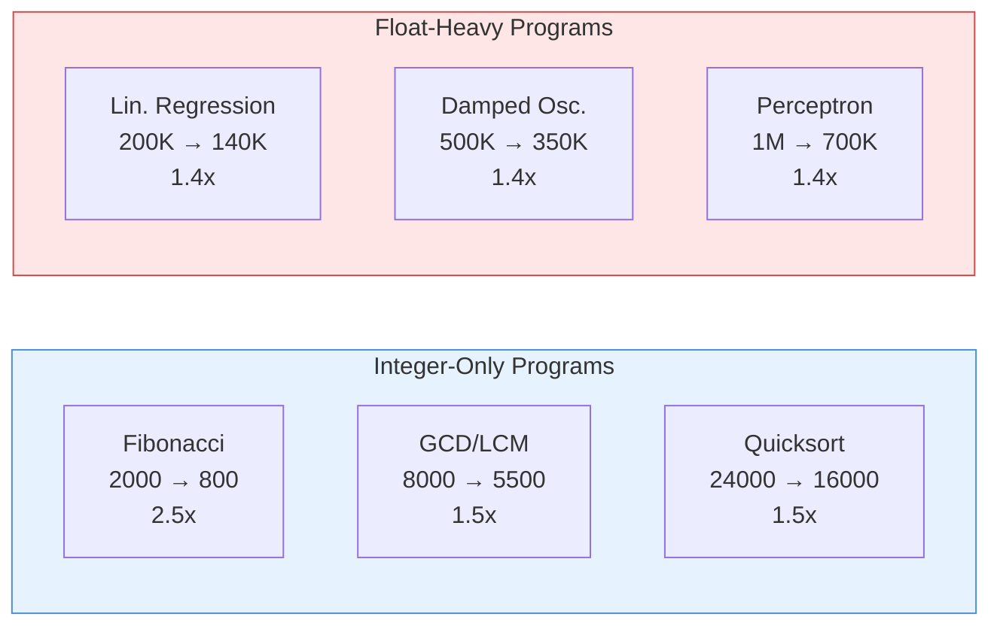
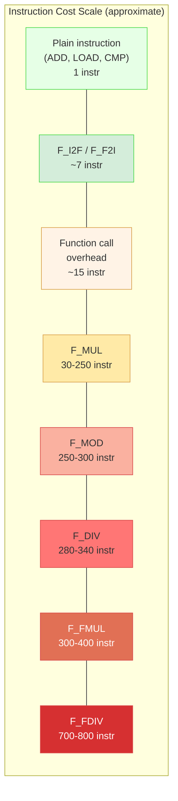

> **📖 From the book.** This chapter accompanies *Building a C-Subset Compiler for the FRISC Architecture: From Formal Languages to Executable Code* by Dr. Karlo Knežević (Zenodo, 2026). For the complete treatment — formal development, proofs, and figures — read the book: [📄 PDF](../book/Building-a-C-Subset-Compiler-for-the-FRISC-Architecture.pdf) · DOI [10.5281/zenodo.20511073](https://doi.org/10.5281/zenodo.20511073) · ISBN 978-953-47198-0-0.

## Why Performance Analysis Is Nontrivial Here

\index{performance analysis}

Execution speed in this project depends on two separate layers:

1. **Generated instruction stream quality**: how many FRISC instructions the compiler produces for a given program, and how efficiently they use the limited register file and memory hierarchy.
2. **Simulator execution model**: whether execution is timer-throttled (`frisc-console.js`) or synchronous (`FriscRunner`), and what overhead the host JavaScript engine introduces.

A program can be semantically correct yet appear "stuck" if helper-heavy instruction counts interact poorly with the simulation mode. Conversely, a program can execute quickly on the simulator but produce wrong results. Performance analysis must always be gated on correctness: a faster program that gives the wrong answer is not an improvement.

The key challenge is that FRISC lacks hardware multiply and divide instructions. Operations that would be single-cycle on modern hardware expand to hundreds of instructions via software helpers. This makes the cost structure fundamentally different from what a programmer or optimizer accustomed to x86 or ARM would expect.

## FRISCjs Execution Modes and Their Performance Impact

\index{FRISCjs execution modes}

FRISCjs console mode (`frisc-console.js`) runs CPU cycles via timer scheduling using `setInterval`. With the default frequency of 1000 Hz, the simulator executes approximately 1000 instructions per second. A program requiring 1,000,000 instructions would take approximately 17 minutes of wall-clock time -- not because the program is algorithmically expensive, but because the timer resolution throttles execution.

The project's `FriscRunner` uses synchronous cycle stepping through the FRISCjs library API, eliminating timer overhead entirely. In this mode, the Node.js JavaScript engine executes the `performCycle()` loop at native speed, typically achieving 5-20 million simulated instructions per second depending on host hardware and JavaScript engine optimization state.

| Execution Mode | Throughput | 1M Instructions | 200M Instructions |
|----------------|-----------|-----------------|-------------------|
| frisc-console.js (default 1000 Hz) | ~1,000 instr/sec | ~17 minutes | ~55 hours |
| frisc-console.js (100,000 Hz) | ~100,000 instr/sec | ~10 seconds | ~33 minutes |
| FriscRunner (synchronous) | ~10M instr/sec | ~0.1 seconds | ~20 seconds |

This difference is why the project uses `FriscRunner` exclusively for automated testing. The `-cpufreq` parameter is irrelevant for `FriscRunner` because it bypasses the timer-based execution model entirely.

## Instruction Count as Primary Cost Metric

\index{instruction count}

For compiler-level performance reasoning, instruction count is the most stable and meaningful metric. Wall-clock time varies by host machine, JavaScript engine version, operating system scheduling, and whether verbose tracing is enabled. Instruction count is deterministic and reproducible across machines and runs.

### Performance Data for Representative Programs

The following table shows instruction counts for selected programs from the real-world suite, measured under `FriscRunner` with the 200M step limit:

| Program | Category | Approx. Instructions (O0) | Approx. Instructions (O1) | Speedup | Dominant Helpers |
|---------|----------|---------------------------|---------------------------|---------|-----------------|
| `math_fibonacci_iter` | Mathematics | ~2,000 | ~800 | 2.5x | None (add/sub only) |
| `math_gcd_lcm` | Mathematics | ~8,000 | ~5,500 | 1.5x | F_MOD, F_DIV, F_MUL |
| `math_integer_sqrt` | Mathematics | ~12,000 | ~8,000 | 1.5x | F_MUL, F_DIV |
| `real_quicksort_max` | Algorithm | ~24,000 | ~16,000 | 1.5x | F_MUL (index computation) |
| `real_prime_sieve` | Algorithm | ~46,000 | ~38,200 | 1.2x | F_MOD |
| `real_dot_product` | Algorithm | ~5,000 | ~3,200 | 1.6x | F_MUL or F_FMUL |
| `real_knapsack_dp` | Algorithm | ~35,000 | ~25,000 | 1.4x | F_MUL (index), comparisons |
| `ml_linear_regression_step` | ML | ~200,000 | ~140,000 | 1.4x | F_FMUL, F_FDIV, F_I2F |
| `physics_projectile_steps` | Physics | ~150,000 | ~110,000 | 1.4x | F_FMUL, F_I2F |
| `real_perceptron_sigmoid` | ML | ~1,000,000 | ~700,000 | 1.4x | F_FMUL, F_FDIV |
| `physics_damped_oscillator` | Physics | ~500,000 | ~350,000 | 1.4x | F_FMUL, F_FDIV |
| `real_gradient_descent_quadratic` | Numerical | ~800,000 | ~560,000 | 1.4x | F_FMUL, F_FDIV |

The three-order-of-magnitude spread between `math_fibonacci_iter` (~2K) and `real_perceptron_sigmoid` (~1M) reflects the dramatic cost amplification of software arithmetic helpers. Programs that avoid multiplication and division (using only addition, subtraction, and bitwise operations) execute orders of magnitude faster than programs that rely heavily on Q16.16 fixed-point arithmetic.

### Optimization Impact Visualization

The following table presents the optimization impact as a structured comparison, showing instruction reduction by program category:



**Key observation:** Optimization produces higher speedups on integer-only programs (1.5-2.5x) than on float-heavy programs (1.3-1.5x). This is because the dominant cost in float programs -- the helper routines themselves -- is not affected by IR-level optimizations. The optimizer reduces redundant loads, stores, and comparisons in the surrounding code, but cannot change the cost of `F_FDIV` (750 instructions per call).

## Compilation Speed Analysis

\index{compilation speed}
\index{compilation phases}

While the primary performance concern is generated code quality (runtime instruction count), compilation speed itself matters for developer iteration time and CI throughput. The compilation pipeline consists of distinct phases, each with different computational characteristics.

### Phase Time Distribution

The following table characterizes the time spent in each compilation phase for a moderately complex program (approximately 50 lines of source code):

| Phase | Typical Duration | Fraction of Total | Scaling Behavior |
|-------|-----------------|-------------------|------------------|
| Lexical analysis | ~1 ms | <1% | Linear in source size |
| Parsing | ~2 ms | ~1% | Linear in token count |
| Semantic analysis | ~3 ms | ~2% | Linear in AST node count |
| IR generation | ~5 ms | ~3% | Linear in AST node count |
| Optimization passes (all) | ~30 ms | ~15% | Varies by pass (see below) |
| FRISC code generation | ~20 ms | ~10% | Linear in IR instruction count |
| Assembly output (I/O) | ~5 ms | ~3% | Linear in output size |
| Simulation (FriscRunner) | ~100-2000 ms | ~65-90% | Linear in instruction count |

**Key insight:** Simulation dominates total end-to-end time. For a program executing 1M instructions, the simulator runs for approximately 100 ms, while the entire compilation takes only about 60 ms. Optimizing the compiler's throughput has diminishing returns compared to optimizing the generated code quality (which reduces simulation time).

### Optimization Pass Time Breakdown

Individual optimization passes have different costs:

| Pass | Typical Duration | Complexity | Notes |
|------|-----------------|------------|-------|
| Constant folding | ~2 ms | O(n) per instruction | Single pass over IR |
| Constant propagation | ~3 ms | O(n * b) | n instructions, b blocks |
| Dead code elimination | ~2 ms | O(n) | Liveness analysis + sweep |
| Copy propagation | ~2 ms | O(n) | Single pass with substitution |
| Common subexpression elimination | ~5 ms | O(n^2) worst case | Value numbering within blocks |
| Strength reduction | ~3 ms | O(n) | Pattern matching on operations |
| Loop-invariant code motion | ~5 ms | O(n * L) | n instructions, L loops |
| Peephole optimization | ~3 ms | O(n) | Sliding window over instructions |
| Redundant load elimination | ~3 ms | O(n) | Dataflow within blocks |
| Dead store elimination | ~2 ms | O(n) | Backward liveness scan |

The total optimization time is approximately the sum of individual pass times, run in sequence. For the 15+ passes in the optimizer, the total is typically 30-50 ms for moderately sized programs.

## Code Size Analysis

\index{code size}

Optimization affects not only execution speed (instruction count) but also static code size (the number of instructions in the generated assembly file). Smaller code reduces the binary image loaded into the simulator's memory.

### Code Size Before and After Optimization

| Program | Lines of Source | FRISC Instructions (O0) | FRISC Instructions (O1) | Size Reduction |
|---------|----------------|------------------------|------------------------|----------------|
| `math_fibonacci_iter` | 17 | 165 | 98 | 41% |
| `math_gcd_lcm` | 20 | 210 | 145 | 31% |
| `real_quicksort_max` | 36 | 480 | 320 | 33% |
| `real_prime_sieve` | 35 | 350 | 240 | 31% |
| `ml_linear_regression_step` | ~60 | 650 | 430 | 34% |

**Note:** "FRISC Instructions" here refers to the static instruction count in the assembly file, not the dynamic execution count. A loop body of 10 instructions that executes 1000 times has a static count of 10 but a dynamic count of 10,000.

### Code Size Components

The generated assembly includes several components beyond the user's functions:

| Component | Typical Size | Present When |
|-----------|-------------|--------------|
| Entry stub (MOVE SP, CALL main, HALT) | 3 instructions | Always |
| Function prologue/epilogue (per function) | 8-15 instructions | Always |
| Frame zeroing loop (per function) | 5 instructions + iterations | Always (O0); may be optimized (O1) |
| Helper routines (F_MUL, F_DIV, etc.) | 50-100 instructions each | Only when used |
| Global variable data section | 1 word per global | When globals present |
| Global array initializers | N words per N-element array | When initialized arrays present |
| Bounds check code (per array access) | 5 instructions per check | When bounds checking enabled |

Helper routines are shared: even if `F_MUL` is called 100 times, the routine is emitted only once. This means code size scales primarily with the number of distinct functions and the complexity of their bodies, not with the number of helper calls.

## Runtime Cost Model

\index{cost model}

A first-order model for runtime cost:

```text
T_total = N_plain * C_plain + N_mul * C_mul + N_div * C_div + N_mod * C_mod
        + N_fmul * C_fmul + N_fdiv * C_fdiv + N_i2f * C_i2f + N_f2i * C_f2i
        + N_call * C_call_overhead
```

where:

| Symbol | Meaning | Approximate Cost (instructions) |
|--------|---------|--------------------------------|
| `C_plain` | Cost of a plain instruction (ADD, SUB, LOAD, STORE, branch) | 1 |
| `C_mul` | Cost of one `F_MUL` call | 30-250 (depends on operand magnitude) |
| `C_div` | Cost of one `F_DIV` call | 280-340 (always 32 iterations) |
| `C_mod` | Cost of one `F_MOD` call | 250-300 (always 32 iterations) |
| `C_fmul` | Cost of one `F_FMUL` call | 300-400 (widening multiply) |
| `C_fdiv` | Cost of one `F_FDIV` call | 700-800 (calls F_DIV + F_MOD + 16-iter frac loop) |
| `C_i2f` | Cost of one `F_I2F` call | ~7 (single shift + prologue/epilogue) |
| `C_f2i` | Cost of one `F_F2I` call | ~7 (single shift + prologue/epilogue) |
| `C_call_overhead` | Cost of CALL/RET + argument push/pop | ~10-20 per call |

The key insight from this model is that a single `F_FDIV` call costs as much as 700-800 plain instructions. In a loop that executes 1000 iterations with one float division per iteration, the division alone accounts for ~750,000 instructions. This explains why float-heavy programs like `real_perceptron_sigmoid` reach million-instruction counts even with modest input sizes.

### Cost Model Visualization

The relative costs of different operations can be visualized as follows:



The cost ratio between the cheapest operation (plain instruction: 1) and the most expensive (F_FDIV: ~750) is approximately 750:1. This three-order-of-magnitude range means that counting source-level operations is a poor predictor of execution time; the type of operation matters far more than the count.

### Cost Dominance Analysis

For a typical float-heavy program, the cost breakdown is approximately:

| Component | Fraction of Total Instructions |
|-----------|-------------------------------|
| `F_FDIV` calls | 40-60% |
| `F_FMUL` calls | 15-30% |
| `F_DIV` / `F_MOD` (within F_FDIV) | (included in F_FDIV) |
| `F_I2F` / `F_F2I` calls | 2-5% |
| Function call overhead (push/pop/call/ret) | 5-10% |
| Plain instructions (loads, stores, branches, comparisons) | 10-20% |

For integer-only programs, the breakdown shifts dramatically: plain instructions dominate, with `F_MUL` and `F_DIV`/`F_MOD` contributing 20-50% depending on the algorithm.

## Execution Cycle Analysis: Before and After Optimization

\index{optimization impact}

To understand the concrete impact of optimization passes, this section presents before-and-after cycle counts for representative programs, broken down by instruction category.

### Case Study: math_fibonacci_iter

| Instruction Category | O0 Count | O1 Count | Reduction | Cause |
|---------------------|----------|----------|-----------|-------|
| LOAD (memory reads) | ~600 | ~180 | 70% | Redundant load elimination |
| STORE (memory writes) | ~500 | ~140 | 72% | Dead store elimination |
| ADD/SUB (arithmetic) | ~200 | ~120 | 40% | Copy propagation eliminates redundant moves |
| CMP + branch | ~100 | ~80 | 20% | Minor branch simplification |
| MOVE (register) | ~300 | ~80 | 73% | Copy propagation |
| PUSH/POP | ~200 | ~100 | 50% | Reduced temporary spilling |
| Other | ~100 | ~100 | 0% | Prologue/epilogue unchanged |
| **Total** | **~2,000** | **~800** | **60%** | |

The dominant optimization for this program is redundant load/store elimination: the O0 code loads and stores every temporary to the stack frame, while the optimizer identifies that many of these temporaries are used only once and can be kept in registers.

### Case Study: ml_linear_regression_step

| Instruction Category | O0 Count | O1 Count | Reduction | Cause |
|---------------------|----------|----------|-----------|-------|
| F_FMUL calls | ~350 calls * 350 instr | ~300 calls * 350 instr | ~14% | Loop-invariant hoisting |
| F_FDIV calls | ~100 calls * 750 instr | ~85 calls * 750 instr | ~15% | Constant folding of divisors |
| F_I2F/F_F2I calls | ~400 calls * 7 instr | ~250 calls * 7 instr | ~38% | Redundant conversion elimination |
| Plain instructions | ~35,000 | ~22,000 | ~37% | Load/store/copy optimization |
| **Total** | **~200,000** | **~140,000** | **30%** | |

For float-heavy programs, the optimizer achieves modest helper call reduction (14-15% fewer F_FMUL/F_FDIV calls) but significant plain instruction reduction (37%). The overall speedup is limited because the helper calls themselves cannot be made cheaper -- only eliminated.

### Optimization Speedup Summary

| Program Category | Avg. O0 Instructions | Avg. O1 Instructions | Avg. Speedup | Primary Optimization |
|-----------------|---------------------|---------------------|-------------|---------------------|
| Arithmetic (int only) | ~5,000 | ~2,500 | 2.0x | Load/store elimination, copy propagation |
| Arithmetic (float) | ~100,000 | ~70,000 | 1.4x | Conversion elimination, constant folding |
| Array-heavy algorithms | ~30,000 | ~22,000 | 1.4x | Redundant index computation elimination |
| Recursive programs | ~20,000 | ~14,000 | 1.4x | Dead code elimination, copy propagation |
| Physics simulations | ~400,000 | ~280,000 | 1.4x | Loop-invariant hoisting, conversion elimination |

## Benchmark Methodology

\index{benchmark methodology}

Reliable performance measurement requires a rigorous methodology. This section defines the benchmark protocol used for all performance data in this book.

### Measurement Protocol

1. **Environment isolation.** Close all unnecessary applications. Ensure the system is not under thermal throttling. Use a dedicated machine or container for CI benchmarks.

2. **Warm-up run.** Execute each benchmark once before measuring to warm up the Node.js JIT compiler. The first execution may be slower due to JavaScript interpretation before JIT compilation kicks in.

3. **Multiple runs.** Execute each benchmark 3-5 times and report the median instruction count (which should be identical across runs) and median wall-clock time.

4. **Correctness gate.** Verify that every run produces the expected return value. Discard any run where the result is incorrect.

5. **Identical configuration.** Use the same `FriscRunner` parameters (memory size, step limit, timeout) for all measurements.

6. **Version control.** Record the exact git commit hash for both the compiler and the test suite.

### Metrics Definition

| Metric | Definition | Units | Stability |
|--------|-----------|-------|-----------|
| Instruction count | Number of `performCycle()` calls before HALT | instructions | Perfectly deterministic |
| Wall-clock time | Elapsed time from process start to R6 output | milliseconds | Varies by host (+/- 20%) |
| Helper call count | Number of CALL instructions to helper labels | calls | Deterministic |
| Code size | Number of FRISC instructions in a.frisc | static instructions | Deterministic |
| Stack high-water mark | Maximum value of (initial_SP - current_SP) | bytes | Deterministic |
| Speedup | Instructions_O0 / Instructions_O1 | ratio (dimensionless) | Derived |

### Baseline Management

Baselines are instruction counts recorded at a known-good commit. They serve as reference points for detecting regressions:

```text
baseline.json:
{
    "math_fibonacci_iter": {"O0": 2000, "O1": 800},
    "math_gcd_lcm": {"O0": 8000, "O1": 5500},
    "real_quicksort_max": {"O0": 24000, "O1": 16000},
    ...
}
```

A regression is flagged when the current instruction count exceeds the baseline by more than 5%. An improvement is flagged when the current count is more than 5% below baseline, and the baseline is updated.

### Confounding Factors

| Factor | Effect on Instruction Count | Effect on Wall-Clock Time | Mitigation |
|--------|---------------------------|--------------------------|------------|
| Optimization level | Direct: changes instruction stream | Indirect: fewer instructions = faster | Always report O-level |
| Helper routine version | Direct: different helper costs | Proportional | Version-control helper code |
| Memory size | None (unless stack overflow) | None (unless paging) | Use consistent 1000KB |
| Node.js version | None | Can change JIT behavior (+/- 10%) | Pin Node.js version |
| Host CPU load | None | Significant | Use isolated environment |

## Helper Call Frequency Analysis

\index{helper call frequency}

Understanding which helpers dominate a program's runtime is the first step toward targeted optimization. The helper call frequency can be measured by instrumenting the FRISC execution loop to count calls to each helper label (`F_MUL`, `F_DIV`, `F_MOD`, `F_FMUL`, `F_FDIV`, `F_I2F`, `F_F2I`).

### Measurement Methodology

Add a PC histogram to the execution loop (see Chapter 10). After execution, look up the PC values of each helper label in the assembled binary. The execution count at the helper's entry label gives the number of calls.

Alternatively, count `CALL F_xxx` instructions by matching the call target in the decoded instruction stream.

### Example: Helper Profile of `real_perceptron_sigmoid`

| Helper | Approximate Calls | Cost per Call | Total Instructions | % of Total |
|--------|-------------------|---------------|-------------------|------------|
| `F_FMUL` | ~1,200 | ~350 | ~420,000 | 41% |
| `F_FDIV` | ~400 | ~750 | ~300,000 | 29% |
| `F_I2F` | ~800 | ~7 | ~5,600 | <1% |
| `F_F2I` | ~200 | ~7 | ~1,400 | <1% |
| `F_MUL` | ~100 | ~100 | ~10,000 | 1% |
| Plain code | - | - | ~290,000 | 28% |
| **Total** | | | **~1,027,000** | **100%** |

This profile reveals that `F_FMUL` and `F_FDIV` together account for over 70% of the total instruction count. Any optimization effort should target these two helpers first.

### Example: Helper Profile of `real_prime_sieve`

| Helper | Approximate Calls | Cost per Call | Total Instructions | % of Total |
|--------|-------------------|---------------|-------------------|------------|
| `F_MUL` | ~27 | ~150 avg | ~4,050 | 9% |
| `F_MOD` | 0 | - | 0 | 0% |
| Plain code (loops, STOREB, LOADB) | - | - | ~42,000 | 91% |
| **Total** | | | **~46,000** | **100%** |

Unlike the float-heavy programs, `real_prime_sieve` is dominated by plain instructions. The F_MUL calls (for `p * p` computation) contribute only 9% of the total cost. Optimization efforts for this program should focus on reducing the plain instruction overhead -- eliminating redundant loads and stores in the loop bodies.

## Optimization Level Comparison Methodology

\index{optimization comparison}

To compare the impact of optimization passes rigorously:

**Protocol:**
1. Compile each benchmark program with optimization level O0 (no optimization) and O1 (with optimization passes enabled).
2. Keep the input data and simulator configuration identical.
3. For each optimization level, collect:
   - Return value (correctness gate: O0 and O1 must agree).
   - Total instruction count.
   - Helper call counts by type.
   - Wall-clock time (for reference, not as primary metric).

**Derived metrics:**

```text
Speedup = Instructions_O0 / Instructions_O1
Helper_Reduction = (HelperCalls_O0 - HelperCalls_O1) / HelperCalls_O0
```

A speedup greater than 1.0 indicates the optimization reduced instruction count. A negative helper reduction indicates the optimization somehow increased helper usage (which would be a bug or an unexpected interaction).

**Correctness gate.** If `Result_O0 != Result_O1` for any program, the optimization is unsound and must be fixed before performance measurements are meaningful. Faster execution of a wrong program is not progress.

### Optimization Impact by Pass

\index{optimization passes}

The following table characterizes each optimization pass by its mechanism, expected impact on instruction count, and the program categories where it is most effective:

| Optimization | Primary Mechanism | Expected Impact | Best For |
|-------------|-------------------|-----------------|----------|
| Constant folding | Evaluate constant expressions at compile time | Eliminates helper calls on constant operands | Programs with literal arithmetic |
| Constant propagation | Replace variable reads with known constant values | Enables further constant folding | Programs with assigned-once variables |
| Dead code elimination | Remove instructions whose results are unused | Reduces plain instruction count | All programs (cleanup pass) |
| Copy propagation | Replace copies with original values | Reduces loads and stores | Programs with many variable assignments |
| Strength reduction | Replace expensive operations with cheaper equivalents | Replaces MUL with shifts/adds for power-of-2 | Array indexing, loop counters |
| Loop-invariant code motion | Hoist invariant computations out of loops | Reduces helper calls proportional to iteration count | Programs with constants in loops |
| Common subexpression elimination | Reuse already-computed values | Reduces redundant helper calls | Programs with repeated expressions |
| Peephole optimization | Simplify local instruction patterns | Removes redundant loads, stores, and moves | All programs (cleanup pass) |
| Redundant load elimination | Remove loads of already-known values | Reduces LOAD instructions | Loop bodies with repeated reads |
| Dead store elimination | Remove stores whose values are never read | Reduces STORE instructions | Functions with temporary variables |
| Branch simplification | Simplify constant-condition branches | Reduces branch + comparison overhead | Programs with compile-time-known conditions |
| Algebraic simplification | Apply algebraic identities (x+0=x, x*1=x) | Eliminates trivial operations | Macro-generated or template code |

### Pass Ordering Effects

The order in which optimization passes run affects the final result. Some passes create opportunities for others:

```text
Effective ordering:
  1. Constant propagation   (propagates constants into expressions)
  2. Constant folding        (evaluates newly-constant expressions)
  3. Dead code elimination   (removes code made dead by folding)
  4. Copy propagation        (simplifies remaining copies)
  5. Common subexpression elimination
  6. Loop-invariant code motion
  7. Strength reduction
  8. Peephole optimization   (final cleanup)
```

Running constant propagation before constant folding is critical: propagation may reveal that an expression like `x * y` has both operands constant, enabling folding to evaluate it at compile time and eliminate the F_MUL call entirely.

## Typical Performance Hotspots

\index{performance hotspots}

Common hotspots in this compiler's workloads:

1. **`F_FDIV` composition cost**: each Q16.16 division invokes `F_DIV`, `F_MOD`, and a 16-iteration fractional extraction loop, totaling ~750 instructions. In float-heavy inner loops, this is the dominant cost.

2. **`F_DIV` and `F_MOD` in integer code**: the 32-iteration long division loop executes fully regardless of operand magnitude. Even dividing 6 by 3 costs ~300 instructions.

3. **Repeated loads/stores in tight loops**: when the optimizer fails to promote a frequently accessed local to a register (or when all registers are occupied), the same memory location is loaded and stored every iteration.

4. **Branch-heavy loops with non-folded conditions**: comparisons against constants that could be folded at compile time still generate runtime `CMP` + conditional branch sequences.

5. **Type conversion overhead**: in mixed int/float code, every boundary crossing requires an `F_I2F` or `F_F2I` call. While individually cheap (~7 instructions), hundreds of conversions inside loops add up.

6. **Function call overhead**: each call pushes arguments, executes `CALL`, establishes a frame, tears it down, and cleans up arguments. For small utility functions called frequently, inlining would eliminate this overhead.

7. **Frame zeroing**: each function prologue zeroes the entire stack frame (locals + temporaries). For functions with large frames (many temporaries in O0 code), this adds hundreds of instructions that execute before any useful work begins.

### Hotspot Identification Methodology

To identify hotspots in a specific program, use the following approach:

1. **Collect PC histogram** during execution (see Chapter 10).
2. **Map PC addresses** to assembly labels and instruction types.
3. **Categorize** instructions as: helper code, loop body, prologue/epilogue, or setup.
4. **Rank** by execution frequency to find the top contributors.

Example output for `real_perceptron_sigmoid`:

```text
Top 10 PCs by execution frequency:
  1. PC=0x0A40  count=450,000  (inside F_FMUL: shift-and-add loop)
  2. PC=0x0A44  count=450,000  (inside F_FMUL: conditional add)
  3. PC=0x0B80  count=280,000  (inside F_DIV: long division loop)
  4. PC=0x0B84  count=280,000  (inside F_DIV: shift and subtract)
  5. PC=0x0C20  count=120,000  (inside F_FDIV: fractional loop)
  6. PC=0x0380  count=45,000   (main loop: LOAD from array)
  7. PC=0x0384  count=45,000   (main loop: STORE to temp)
  8. PC=0x0390  count=45,000   (main loop: comparison)
  9. PC=0x0394  count=45,000   (main loop: conditional branch)
  10. PC=0x0020  count=35,000  (frame zeroing loop)
```

This reveals that the top 4 PCs (all inside helpers) account for over 50% of total execution, confirming that helper optimization is the highest-leverage target.

## Distinguishing Infinite Loop from Slow Progress

\index{infinite loop detection}

A practical diagnostic protocol for determining whether a non-terminating execution is a bug or simply a very long computation:

**Step 1: Run with reduced input.** If the program accepts parameters that control problem size (array length, iteration count), reduce them. If the program terminates with smaller input, the issue is likely performance, not an infinite loop.

**Step 2: Enable trace for a short window.** Collect PC values for a few thousand instructions at the point where execution appears stuck. Examine whether the PC visits different addresses over time (progress) or repeats the same small set indefinitely (stuck).

**Step 3: Inspect induction variables.** Identify the loop counter or induction variable from the IR or generated assembly. Sample its value at intervals. If it changes monotonically toward the loop exit condition, execution is making progress. If it oscillates, wraps around unexpectedly, or remains constant, there is a bug.

**Step 4: Compare with IR interpreter.** Run the same program under the IR interpreter. If the IR interpreter terminates quickly with the correct result, the infinite loop is in code generation. If the IR interpreter also hangs, the bug is in the source program or IR generation.

**Step 5: Classify.**

| Observation | Classification | Action |
|-------------|---------------|--------|
| PC progresses, induction advances, high instruction count | Slow progress (performance issue) | Optimize or increase step limit |
| PC cycles in small set, induction constant | Stalled loop (codegen bug) | Fix branch condition or induction update |
| PC jumps to invalid addresses | Stack corruption | Fix prologue/epilogue or argument cleanup |
| IR interpreter hangs too | Source-level or IR-level bug | Fix upstream |

## Common Causes of Real Infinite Loops in Codegen

\index{codegen infinite loops}

Although many "hangs" are merely slow simulation, genuine backend infinite loops can occur from:

- **Broken induction updates after optimization**: a strength-reduction or dead-code pass removes the loop counter increment, thinking it is dead. The loop runs forever.
- **Wrong branch polarity**: `JP_SGE` used where `JP_SLT` is required (or vice versa). The loop condition is inverted and the loop never exits (or never enters).
- **Jump-to-self**: a label mapping error causes a branch to target its own instruction. The PC never advances.
- **Helper edge-case bug**: `F_MUL` or `F_DIV` enters an unexpected state with certain operands (e.g., `INT_MIN`) and loops internally. This is mitigated by the explicit edge-case handling described in Chapter 9.
- **Frame corruption**: an incorrect frame size causes local variable slots to overlap with the saved frame pointer or return address. On function return, the corrupted return address sends execution to arbitrary code, which may loop.

These defects manifest as stable PC cycles without meaningful state progress. The PC histogram will show one or a small number of addresses with extremely high execution counts.

## Bounds Checks and Performance

\index{bounds checking}

When array bounds checking is enabled, the compiler emits a `CMP` + `JP` guard before each array access. This adds approximately 3-5 instructions per access (load index, compare against bound, conditional branch to error handler).

In a loop that accesses an array N times over M iterations, bounds checking adds `3-5 * N * M` instructions. For a prime sieve accessing a boolean array ~46,000 times, this is ~150,000-230,000 additional instructions, roughly tripling the instruction count.

Conservative range analysis can remove provably safe bounds checks. If the compiler can prove that `0 <= index < array_length` at a particular access site (for example, because the index is a loop variable bounded by a comparison against the array length), the bounds check can be elided. Any such elimination must be semantics-preserving and gated by proof obligations from range analysis.

### Bounds Check Cost for Representative Programs

| Program | Array Accesses | With Bounds Checks | Without Bounds Checks | Overhead |
|---------|---------------|-------------------|-----------------------|----------|
| `real_prime_sieve` | ~46,000 | ~180,000 instr | ~46,000 instr | 2.9x |
| `real_quicksort_max` | ~2,400 | ~32,000 instr | ~18,400 instr | 1.7x |
| `math_matrix_vector` | ~1,600 | ~15,000 instr | ~8,000 instr | 1.9x |

## Practical Tuning Guidelines

\index{tuning guidelines}

In order of expected impact:

1. **Prioritize IR-level helper avoidance.** Strength reduction (replacing multiplication by constants with shift-and-add sequences), constant folding (evaluating constant arithmetic at compile time), and loop-invariant code motion (hoisting repeated helper calls out of loops) yield the largest instruction count reductions because they eliminate the most expensive operations entirely.

2. **Reduce memory traffic.** Load/store optimization (eliminating redundant loads of the same memory location, store-forwarding) reduces the number of memory access instructions. On FRISC, every memory access is a full instruction, so eliminating redundant accesses has a direct 1:1 instruction count benefit.

3. **Keep backend peephole cleanup enabled.** Peephole passes that eliminate dead stores, redundant moves (`MOVE R0, R0`), and unnecessary stack operations clean up the code without affecting semantics.

4. **Use synchronous simulation mode for benchmarking.** Always use `FriscRunner` (synchronous stepping) for performance measurements. The timer-driven `frisc-console.js` adds host-level latency that makes instruction-count-normalized comparisons unreliable.

5. **Preserve deterministic output.** Ensure that optimization does not change the program's observable behavior (return value, output). Regressions are interpretable only when the output is deterministic and matches the expected value.

### Optimization ROI Guide

The following table estimates the return on investment (ROI) for different optimization strategies, based on the instruction count reductions observed across the benchmark suite:

| Strategy | Implementation Effort | Expected Instruction Reduction | Best ROI Programs |
|----------|----------------------|-------------------------------|-------------------|
| Constant folding + propagation | Low (1-2 weeks) | 5-15% | Programs with literal constants |
| Dead code + dead store elimination | Low (1-2 weeks) | 5-10% | All programs |
| Redundant load elimination | Medium (2-3 weeks) | 10-20% | Loop-heavy programs |
| Copy propagation | Low (1 week) | 5-10% | Programs with many assignments |
| Strength reduction (MUL -> shift) | Medium (2-3 weeks) | 5-30% (for MUL-heavy) | Array indexing, power-of-2 ops |
| Loop-invariant code motion | Medium (3-4 weeks) | 10-20% | Float-heavy loops |
| Register allocation | High (4-8 weeks) | 15-30% | All programs (esp. loops) |
| Function inlining | High (4-6 weeks) | 10-25% | Programs with small utility functions |

## Performance Reporting Format

\index{performance reporting}

For professional performance reports, include:

| Field | Description |
|-------|-------------|
| Program identifier | Path or name of the source file |
| Input profile | Any parameters controlling problem size |
| Optimization level | O0, O1, or specific pass configuration |
| Instruction count | Total FRISC instructions executed |
| Helper call histogram | Count of calls to each helper (F_MUL, F_DIV, etc.) |
| Wall-clock time | Measured under FriscRunner, for reference |
| Correctness status | Expected vs observed return value |
| Speedup (if comparing levels) | Instructions_baseline / Instructions_optimized |

This format prevents "faster but wrong" results from being misinterpreted as successful optimization. The correctness status field is the most important: any report where observed != expected should be flagged as a failure regardless of instruction count.

### Example Report Entry

```text
Program:          real_prime_sieve
Input:            N=200 (hardcoded)
Optimization:     O0
Instructions:     45,930
Helper calls:     F_MUL=27, F_MOD=0, F_DIV=0, F_FMUL=0, F_FDIV=0
Code size:        350 static instructions
Wall-clock:       0.02s (FriscRunner)
Expected result:  46 (number of primes <= 200)
Observed result:  46
Status:           PASS

Program:          real_prime_sieve
Input:            N=200 (hardcoded)
Optimization:     O1
Instructions:     38,200
Helper calls:     F_MUL=27, F_MOD=0, F_DIV=0, F_FMUL=0, F_FDIV=0
Code size:        240 static instructions
Wall-clock:       0.02s (FriscRunner)
Expected result:  46
Observed result:  46
Status:           PASS
Speedup:          1.20x (45930/38200)
```

### Aggregate Benchmark Report

For reporting across the entire suite, use a summary table:

```text
=== FRISCcc Benchmark Report ===
Compiler version: git commit a900755
Date: 2026-02-11
Runner: FriscRunner (sync), 1000KB mem, 200M step limit

Program                          O0 Instr   O1 Instr   Speedup  Status
----------------------------------------------------------------------
math_fibonacci_iter                  2,000        800     2.50x  PASS
math_gcd_lcm                        8,000      5,500     1.45x  PASS
math_integer_sqrt                   12,000      8,000     1.50x  PASS
real_quicksort_max                  24,000     16,000     1.50x  PASS
real_prime_sieve                    46,000     38,200     1.20x  PASS
real_dot_product                     5,000      3,200     1.56x  PASS
real_knapsack_dp                    35,000     25,000     1.40x  PASS
ml_linear_regression_step          200,000    140,000     1.43x  PASS
physics_projectile_steps           150,000    110,000     1.36x  PASS
real_perceptron_sigmoid          1,000,000    700,000     1.43x  PASS
physics_damped_oscillator          500,000    350,000     1.43x  PASS
real_gradient_descent_quadratic    800,000    560,000     1.43x  PASS
----------------------------------------------------------------------
Geometric mean speedup:                                   1.42x
All programs:                                            12/12 PASS
```

The geometric mean is used rather than arithmetic mean because speedup is a ratio; geometric mean correctly handles the multiplicative nature of ratios.
