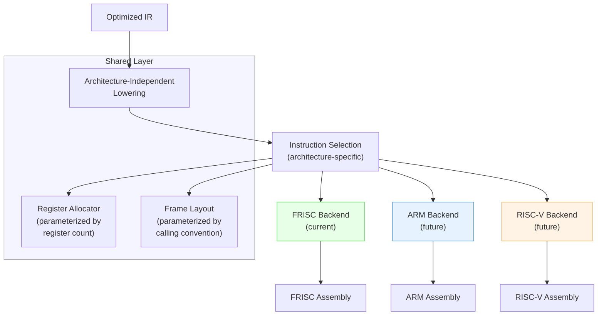

## Language Extensions Roadmap

\index{language extensions}

The current compiler supports a well-defined C subset: integer and Q16.16 float types, arrays, structs, pointers, control flow (`if`/`else`, `while`, `for`, `do-while`, `switch`), functions with local variables, and global declarations. A natural evolution path extends the supported subset while preserving deterministic, testable semantics.

### Priority Language Extensions

| Extension | Complexity | Benefit | Prerequisites |
|-----------|-----------|---------|---------------|
| `enum` declarations | Low | Named constants, switch exhaustiveness | Lexer + parser additions |
| `typedef` | Low | Type aliasing for readability | Symbol table enhancement |
| Multi-dimensional arrays | Medium | Matrix computations, image processing | Index linearization in codegen |
| Function pointers | Medium | Callbacks, dispatch tables, virtual methods | Indirect CALL lowering in backend |
| `const` qualifier | Medium | Enables more aggressive constant propagation | Semantic analysis enforcement |
| String operations | Medium | String comparison, concatenation, formatting | Runtime helper library extension |
| `union` types | Medium | Variant storage, type punning | Overlapping layout in frame allocation |
| Variadic functions | High | `printf`-style formatting | Stack-based argument traversal |
| Dynamic memory (`malloc`/`free`) | High | Linked lists, trees, graphs | Heap allocator runtime |
| Separate compilation and linking | High | Multi-file programs, libraries | Linker implementation, symbol resolution |

### Preprocessor Support

\index{preprocessor}

The current compiler lacks a preprocessor entirely. Adding preprocessor support would follow the standard C model:

**Phase 1 -- Minimal preprocessor:**
- `#define` for simple constants (no macro functions).
- `#include` for file inclusion.
- `#ifdef` / `#ifndef` / `#endif` for conditional compilation.

**Phase 2 -- Function-like macros:**
- `#define NAME(args) body` with argument substitution.
- Token pasting (`##`) and stringification (`#`).
- Variadic macros (`__VA_ARGS__`).

**Phase 3 -- Pragmas and extensions:**
- `#pragma once` for include guards.
- `#pragma pack` for struct alignment control.
- Custom pragmas for optimization hints.

The preprocessor should be implemented as a separate translation phase that runs before lexical analysis, producing a "preprocessed" source file that the existing lexer can consume without modification. This preserves the clean phase separation of the compiler.

### Multi-File Compilation and Linking

\index{separate compilation}
\index{linker}

Separate compilation is perhaps the most impactful language-level extension, enabling real-world project structures. The implementation requires:

1. **Object file format.** Define a simple relocatable object format containing:
   - Code section (assembled instructions with unresolved symbol references).
   - Data section (global variables and initialized arrays).
   - Symbol table (exported and imported symbols with types).
   - Relocation table (locations requiring address patching).

2. **Linker.** Resolve external symbol references across object files:
   - Merge code and data sections.
   - Patch relocation entries with resolved addresses.
   - Detect duplicate definitions and missing symbols.
   - Produce a single FRISC assembly file as output.

3. **Extern declarations.** Extend the language with `extern` declarations:
   ```c
   extern int compute(int x, int y);  // defined in another file
   extern int global_counter;          // defined in another file
   ```

4. **Static linkage.** Extend with `static` keyword for file-local symbols that should not be exported.

### Pointer Arithmetic Refinement

\index{pointer arithmetic}

The current pointer support allows dereferencing and address-of operations but constrains pointer arithmetic. Full C-compatible pointer arithmetic would require:

- Stride-aware addition and subtraction (pointer + integer, pointer - pointer).
- Pointer comparison semantics (relational operators on pointers within the same allocation).
- Pointer decay from array types to pointer types in function arguments.
- Null pointer constant recognition and null-safety warnings.

The primary challenge is not parsing or type checking but code generation: pointer arithmetic must account for the pointed-to type's size, which requires type information to survive into the backend.

### Union Types

\index{union types}

Union support requires modifications at several compiler levels:

**Semantic analysis:** Verify that only one field is written at a time (optional, as C itself does not enforce this). Track the maximum field size for layout purposes.

**IR generation:** Emit load/store instructions that access the same base address with different types. The IR must represent that a union's fields share the same memory location.

**Code generation:** All fields begin at offset 0 within the union. The union size is the maximum of all field sizes, aligned to the maximum field alignment.

```c
union Value {
    int i;          // 4 bytes at offset 0
    float f;        // 4 bytes at offset 0 (Q16.16)
    char bytes[4];  // 4 bytes at offset 0
};
// sizeof(union Value) = 4
```

### Struct and Aggregate Enhancement

Current struct support covers declaration, field access, assignment, and passing by value. Extensions would include:

- Nested struct initialization with designated initializers.
- Anonymous structs and unions within structs.
- Struct return values larger than one word (currently structs are returned via R6 as a pointer or value, depending on size).
- Packed structs with explicit alignment control, relevant for I/O device interaction.

### Control Flow Extensions

- `break` and `continue` within nested loops (currently supported, but further nesting depth testing is warranted).
- `goto` with label targets (increases CFG complexity significantly).
- `switch` with fall-through semantics and Duff's device patterns.

Each extension must be integrated into the semantic analysis, IR generation, and optimization passes before code generation, maintaining the principle that each phase boundary is a complete, validated representation.

## IR Evolution

\index{intermediate representation}

The current IR is a typed, three-address representation with explicit basic blocks and control-flow edges. It serves the compiler well for current optimization passes (constant folding, dead code elimination, copy propagation, peephole cleanup) but has limitations that constrain future optimization depth.

### Static Single Assignment (SSA) Form

\index{SSA form}
\index{phi function}

Converting the IR to SSA form is the single most impactful IR evolution. In SSA form, every variable is assigned exactly once, and phi-functions are inserted at control flow join points to merge values from different predecessors.

**What SSA enables:**

- **Efficient dataflow analysis**: def-use chains become trivial, as each value has exactly one definition point.
- **Global value numbering (GVN)**: detecting redundant computations across basic blocks, not just within a single block.
- **Sparse conditional constant propagation (SCCP)**: combining constant propagation with dead branch elimination in a single pass.
- **Loop-closed SSA (LCSSA)**: simplifying loop-carried dependency analysis for loop optimizations.

**How to implement SSA conversion:**

The standard algorithm for SSA construction (Cytron et al., 1991) proceeds in three steps:

1. **Compute dominance frontiers.** For each basic block B, the dominance frontier DF(B) is the set of blocks where B's dominance ends -- the "boundary" where a definition in B needs a phi-function because another path can also reach that block.

2. **Insert phi-functions.** For each variable V defined in block B, insert phi-functions at every block in DF(B). Iterate until no new phi-functions are needed (iterated dominance frontier).

3. **Rename variables.** Walk the dominator tree, assigning fresh version numbers to each definition and replacing uses with the appropriate version. Phi-function operands are filled in from predecessor blocks.

**Example: Fibonacci loop in SSA form:**

```text
L0:
    n_0 = 20
    a_0 = 0
    b_0 = 1
    i_0 = 0
    jmp L1

L1:
    n_1 = phi(n_0 from L0, n_1 from L3)    ; n is loop-invariant
    a_1 = phi(a_0 from L0, a_2 from L3)    ; a changes each iteration
    b_1 = phi(b_0 from L0, b_2 from L3)    ; b changes each iteration
    i_1 = phi(i_0 from L0, i_2 from L3)    ; loop counter
    cond = cmp_lt i_1, n_1
    br cond, L2, L4

L2:
    t_1 = add a_1, b_1      ; t = a + b
    a_2 = b_1               ; a = b
    b_2 = t_1               ; b = t
    jmp L3

L3:
    i_2 = add i_1, 1        ; i++
    jmp L1

L4:
    ret a_1
```

In this SSA form, every use of a variable (e.g., `a_1`) has exactly one reaching definition. The phi-function at L1 merges the initial value (`a_0` from L0) with the loop-carried value (`a_2` from L3). This makes def-use chains explicit and trivially computable.

**Engineering effort:** Converting the existing IR to SSA requires:
- Implementing dominance tree and dominance frontier computation (~500 lines of code).
- Implementing phi-function insertion and variable renaming (~800 lines of code).
- Updating all existing optimization passes to handle phi-functions (~200 lines per pass, 15+ passes).
- Implementing SSA destruction (phi elimination) before code generation (~400 lines of code).
- Total: approximately 4,000-6,000 lines of code, or 4-8 weeks of engineering effort.

### Alias Analysis

\index{alias analysis}

The current IR treats all memory operations as potentially aliasing, which prevents the optimizer from reordering loads and stores or eliminating redundant loads across intervening stores. A basic alias analysis framework would include:

- **Type-based alias analysis (TBAA)**: exploiting the C type system to determine that accesses through different types cannot alias (strict aliasing rule).
- **Intra-procedural points-to analysis**: tracking which pointers can point to which allocations within a single function.
- **Escape analysis**: determining whether a locally allocated object's address escapes the current function, enabling stack allocation optimizations.

Even a conservative alias analysis (where "may-alias" is the default and "must-not-alias" is proven for specific cases) would enable significant optimization improvements, particularly for load/store elimination in loops.

### Memory Model Annotations

Enriching the IR with explicit memory model annotations would enable:

- Marking loads as `readonly` (the value does not change during the function's execution).
- Marking stores as `noalias` (no other pointer can observe the written value).
- Annotating function parameters with aliasing constraints.
- Expressing volatile semantics for memory-mapped I/O regions.

These annotations would flow from the semantic analysis phase (type qualifiers, scope analysis) and be consumed by optimization passes to make sound transformation decisions.

### Debug Metadata

\index{debug metadata}

Current IR does not carry source location information. Adding debug metadata (source file, line number, column) to IR instructions would enable:

- Source-level step debugging in the simulator.
- Meaningful error messages when runtime failures (bounds check violations, stack overflow) are detected.
- Correlation between IR-level and source-level performance profiles.

The metadata should be stored as annotations that do not affect the IR's operational semantics:

```text
L2:                                      ; source: program.c:11
    t9 = addr_of_symbol local:a          ; source: program.c:11  col:5
    t10 = load t9 : int32               ; source: program.c:11  col:9
    t11 = addr_of_symbol local:b          ; source: program.c:11  col:13
    t12 = load t11 : int32               ; source: program.c:11  col:13
    t13 = add t10, t12 : int32            ; source: program.c:11  col:11
```

## Optimization Research Directions

\index{optimization research}

The current optimization pipeline includes constant folding, constant propagation, dead code elimination, copy propagation, and backend peephole cleanup. The following research directions would significantly improve generated code quality.

### Robust Sparse Conditional Constant Propagation (SCCP)

\index{SCCP}

SCCP combines constant propagation with dead branch elimination. It operates on the SSA CFG, maintaining a lattice state for each SSA value (top = unknown, constant = known value, bottom = not constant). The algorithm propagates constants along CFG edges, marking unreachable branches as dead. This is strictly more powerful than separate constant propagation and dead code elimination passes.

**Algorithm outline:**

1. Initialize all SSA values to TOP (unknown).
2. Initialize all CFG edges to "not executable."
3. Mark the entry block's incoming edge as executable.
4. Process the worklist: for each newly executable instruction, evaluate its operands:
   - If all operands are constant, the result is constant.
   - If any operand is BOTTOM, the result is BOTTOM.
   - For phi-functions, only consider operands from executable edges.
5. For conditional branches with constant conditions, mark only the taken edge as executable.
6. Iterate until the worklist is empty.
7. Replace all constant-valued SSA names with their constant, and remove unreachable blocks.

**Research question**: how much additional code is eliminated by SCCP compared to the current sequential constant-propagation + DCE approach? The answer depends on the frequency of constant-dependent control flow in the test suite.

### Global Value Numbering (GVN)

\index{GVN}

GVN assigns a unique number to each distinct computation. If two computations produce the same value number (even across basic blocks), the second can be replaced with the first's result. This subsumes common subexpression elimination and extends it across block boundaries.

For this compiler, GVN would be particularly effective at eliminating redundant helper calls: if `a * b` is computed in two different branches that merge, GVN can compute it once and reuse the result.

**Alias-aware guards**: GVN must be aware that memory operations may invalidate previously computed values. Without alias analysis, GVN must conservatively assume that any store invalidates all previously computed loads. With TBAA, GVN can prove that certain loads are unaffected by intervening stores.

### Loop Nest Optimization

\index{loop optimization}

Current loop optimization is limited. More advanced loop optimizations include:

- **Loop-invariant code motion (LICM)**: hoisting computations that produce the same result on every iteration to the loop preheader. This is partially implemented but could be strengthened with alias analysis.
- **Induction variable simplification**: replacing complex induction expressions with simpler ones (e.g., replacing `i * sizeof(element)` with an incremented pointer).
- **Loop unrolling**: duplicating the loop body to reduce branch overhead and enable cross-iteration optimization. On FRISC, where branch cost is one instruction, the benefit is modest unless combined with other optimizations.
- **Loop strength reduction**: replacing multiplications in induction expressions with additions. For example, replacing `i * 4` computed each iteration with a variable incremented by 4.
- **Range analysis for bounds check elimination**: proving that array indices are within bounds based on loop induction variable analysis, enabling the removal of runtime bounds checks.

### Float Helper Specialization

\index{Q16.16 optimization}

For Q16.16 arithmetic, domain-specific optimizations can reduce helper costs:

- **Multiplication by small constants**: if one operand of `F_FMUL` is a small compile-time constant, the multiplication can be expanded into a shift-and-add sequence that is much shorter than the general helper. For example, multiplying by 2.0 (Q16.16 value 0x20000) is a single left shift by 1.
- **Division by powers of two**: `F_FDIV` by 2.0 is a right shift by 1. The optimizer can detect constant divisors that are powers of two and replace the ~750-instruction helper call with a single shift.
- **Reciprocal multiplication**: for constant non-power-of-two divisors, the optimizer can compute the reciprocal at compile time and replace division with multiplication by the reciprocal. The error from fixed-point reciprocal approximation is bounded and can be analyzed.
- **Bounded-error policy**: for applications that tolerate small numerical errors (e.g., physics simulations), less precise but faster helper implementations could be substituted. This requires a user-facing configuration option and clear documentation of the error bounds.

### Register Allocation

\index{register allocation}
\index{graph coloring}
\index{linear scan}

The current backend uses a simple frame-based allocation where all temporaries are assigned stack slots. A proper register allocator would dramatically reduce load/store traffic.

**Graph coloring approach:**

The classic Chaitin-Briggs algorithm works as follows:

1. **Build interference graph.** For each pair of live ranges that are simultaneously live at some program point, add an edge between them. Two values that interfere cannot share the same register.

2. **Coalesce.** Merge live ranges connected by copy instructions if they do not interfere. This eliminates copies by assigning both values to the same register.

3. **Simplify.** Remove nodes with fewer than K neighbors (where K = 5 allocatable registers on FRISC). These nodes can always be colored after the remaining graph is colored.

4. **Spill.** If no node can be simplified, choose a node to spill to memory. Prefer spilling nodes with long live ranges but low use frequency.

5. **Select.** Assign colors (registers) to nodes in reverse removal order. Each node gets a color not used by any of its remaining neighbors.

6. **Rewrite.** Insert load/store instructions for spilled values. Re-run the algorithm if new spills create new interference.

**Linear scan approach:**

For faster compilation at the cost of slightly worse allocation quality:

1. **Order live ranges by start point.**
2. **Scan forward.** For each live range, assign it to an available register. If no register is free, spill the live range with the farthest endpoint (Poletto and Sarkar, 1999).

**FRISC-specific considerations:**

The FRISC register file has only 8 registers, of which 3 are committed:
- R7: Stack pointer (SP) -- not allocatable.
- R5: Frame pointer (FP) -- not allocatable if frame-based addressing is used.
- R6: Return value -- available except at function boundaries.

This leaves R0-R4 plus conditionally R6 = 5-6 allocatable registers. Despite this constraint, even keeping the 2-3 most frequently accessed values in registers (instead of the stack) would reduce instruction counts by 15-30% in loop-heavy programs, based on analysis of the current generated code.

**Estimated impact:**

| Program | Current Load/Store Count | Estimated After Reg. Alloc. | Reduction |
|---------|-------------------------|-----------------------------|-----------|
| `math_fibonacci_iter` | ~1,100 | ~300 | 73% |
| `real_prime_sieve` | ~28,000 | ~12,000 | 57% |
| `ml_linear_regression_step` | ~45,000 | ~22,000 | 51% |

## Backend Engineering Improvements

### Instruction Selection Templates

The current instruction selection is done imperatively in Java code. A template-based approach would:

- Define FRISC instruction patterns declaratively.
- Allow pattern matching on IR subtrees to select multi-instruction sequences.
- Enable automated verification that all IR opcodes are covered.
- Simplify the addition of new instructions or addressing modes.

### Architecture-Aware Register Pressure Heuristics

When generating code for expressions with many live values, the code generator should estimate register pressure and choose an evaluation order that minimizes spills. For example, evaluating the less register-intensive subexpression first can reduce peak register demand.

### Calling Convention Optimization

\index{calling convention}

- **Leaf function optimization**: functions that do not call other functions (leaf functions) can avoid saving and restoring the frame pointer, reducing prologue/epilogue overhead by 2-4 instructions.
- **Tail call optimization**: when the last action of a function is a call to another function, the callee can reuse the caller's frame, avoiding stack growth. This is particularly valuable for recursive programs.
- **Register-based argument passing**: passing the first 1-2 arguments in registers instead of on the stack would reduce memory traffic for small functions. This requires a calling convention change that propagates through the entire backend.

### Function Inlining

\index{function inlining}

Inlining replaces a function call with the function's body, eliminating call overhead and enabling cross-function optimization. The inlining decision should consider:

| Factor | Inline if... | Do not inline if... |
|--------|-------------|---------------------|
| Function size | Small (< 20 IR instructions) | Large (> 50 IR instructions) |
| Call frequency | Called many times (in loops) | Called once |
| Recursion | Non-recursive | Recursive (cannot inline) |
| Side effects | Pure (no global writes) | Has side effects (may change semantics) |

For the FRISCcc test suite, inlining the `swap` function in `real_quicksort_max` would eliminate approximately 80 function calls at 15 instructions of overhead each, saving ~1,200 instructions (approximately 6% of total).

### Profile-Guided Code Layout

Using execution profiles (PC histograms from instrumented runs) to guide code layout:

- Place hot basic blocks on fall-through paths to reduce taken-branch counts.
- Place cold paths (error handling, unlikely branches) at the end of the function.
- Align loop headers to instruction fetch boundaries (though on FRISC, all instructions are 4-byte aligned, so this is less relevant than on x86).

## Additional Target Architectures

\index{target architecture}
\index{ARM}
\index{RISC-V}

The current compiler targets only FRISC. Adding support for additional architectures would validate the compiler's architecture-independence and expand its utility.

### ARM (AArch32 / AArch64)

**Feasibility: Medium.** ARM is a natural extension because:
- ARM is a RISC architecture with similar instruction format (load/store, register-register ALU).
- ARM has hardware multiply (MUL) and optionally divide (SDIV/UDIV on ARMv7+), eliminating the need for software helpers.
- ARM has 16 general-purpose registers (32-bit) or 31 (64-bit), significantly reducing register pressure.

**Key differences from FRISC:**
- Conditional execution on most instructions (ARM mode) vs. only branches.
- Barrel shifter as part of ALU operands (e.g., `ADD R0, R1, R2, LSL #2` computes R0 = R1 + R2*4 in one instruction).
- Hardware floating-point (VFP/NEON) could replace the entire Q16.16 emulation.

**Implementation effort:** Approximately 3,000-5,000 lines of code for a new backend, plus calling convention adaptation.

### RISC-V (RV32I / RV64I)

**Feasibility: Medium-Low.** RISC-V is the most natural target for a FRISC replacement:
- RV32I has a similar philosophy to FRISC (simple load/store RISC with 32 registers).
- The M extension adds hardware multiply/divide.
- The F/D extensions add hardware floating-point.
- Open-source simulators (Spike, QEMU) are available for testing.

**Key differences from FRISC:**
- 32 registers (vs. 8), dramatically reducing spill pressure.
- Variable-length encoding (compressed instructions in the C extension).
- Standard calling convention (RISC-V ABI) differs from FRISC's stack-only convention.

**Implementation effort:** Similar to ARM, approximately 3,000-5,000 lines for the backend.

### Architecture Abstraction Layer

To support multiple backends without duplicating the entire code generator, the compiler should introduce an architecture abstraction layer:



The shared layer handles register allocation (parameterized by register count), frame layout (parameterized by calling convention), and instruction scheduling (parameterized by latency tables). The architecture-specific layer handles instruction selection, encoding, and target-specific optimizations.

## Tooling and Observability Enhancements

\index{tooling}

### Standardized Timeout Report Format

When execution times out, the runner should produce a structured report containing:

- Total instructions executed.
- Top-N PCs by execution frequency.
- Top-N CFG edges by frequency.
- Maximum same-PC streak.
- Approximate call stack at the point of timeout.
- SP and FP values at timeout.
- Classification hint (stalled loop, slow progress, stack corruption).

This report format should be machine-parseable (JSON or structured text) for automated CI analysis.

### Integrated Telemetry in Runner Output

The `FriscRunner` output currently consists of a single line (the R6 value). Extending it to include instruction count and helper call counts (on stderr, to avoid interfering with stdout parsing) would enable performance tracking without separate instrumentation runs.

### Trace Slicing and Replay

For debugging complex failures, the ability to record a full execution trace (PC, register state, memory writes) and replay it with breakpoints and watchpoints would be invaluable. The trace file format should be compact (delta-encoded register states) and the replay tool should support:

- Forward and backward stepping.
- Conditional breakpoints on register values or memory addresses.
- Source-level correlation (when debug metadata is available).
- Automatic detection of anomalies (SP going above initial value, PC jumping to non-code regions).

### Visualization Tools

- **CFG visualization**: render the control flow graph of generated FRISC code with execution counts on edges, highlighting hot paths.
- **Stack frame visualization**: display the frame layout for each function with slot assignments, overlaid with actual values during a trace.
- **IR diff visualization**: side-by-side comparison of IR before and after an optimization pass, highlighting added, removed, and modified instructions.

### Web-Based Interactive Compiler Explorer

A web-based tool (similar to Compiler Explorer / godbolt.org) that shows:

1. Source code in the left pane.
2. Generated IR in the center pane.
3. FRISC assembly in the right pane.
4. Clicking on a source line highlights the corresponding IR and assembly instructions.
5. Toggle optimization passes on/off and see the effect in real-time.
6. Run the program in the browser using the FRISCjs simulator directly.

This tool would serve both educational and development purposes, making the compiler's behavior transparent and interactive.

## Research-Grade Platform Vision

The long-term vision for this project is to evolve from a teaching compiler into a research-grade platform suitable for:

### Compilation Research

- **Optimization correctness**: formal verification of optimization passes using translation validation or proof-carrying code techniques.
- **Optimization interaction**: systematic study of how optimization pass ordering affects code quality, using the example suite as a benchmark.
- **Cost modeling**: developing precise cost models for FRISC that predict instruction counts from IR characteristics, validated against actual execution.

### Architecture Research

- **Instruction set extensions**: evaluating hypothetical FRISC extensions (hardware multiply, larger register file, SIMD) by measuring their impact on instruction counts for the existing benchmark suite.
- **Memory hierarchy simulation**: adding cache simulation to the FRISC simulator to study the impact of memory access patterns on hypothetical cached FRISC implementations.

### Education

\index{education}

- **Interactive compilation**: a web-based interface that shows each compilation stage side-by-side (source, tokens, AST, IR, optimized IR, FRISC assembly) with clickable navigation from source to generated code.
- **Optimization playground**: an interface that allows students to enable/disable individual optimization passes and observe their effect on instruction count and code quality.
- **Bug injection exercises**: deliberately introducing bugs at various pipeline stages and challenging students to diagnose them using the debugging tools described in this book.

### Reproducible Benchmarking

- **Benchmark tables from CI**: automated generation of performance tables (instruction counts, helper call profiles, optimization speedups) directly from CI pipeline output, ensuring that published numbers always reflect the current codebase.
- **Historical tracking**: maintaining a time-series database of instruction counts for each benchmark program across commits, enabling immediate detection of performance regressions.
- **Cross-compiler comparison**: if multiple FRISC-targeting compilers exist, the benchmark suite and reporting format provide a common basis for comparison.

## Evolution Roadmap

\index{roadmap}

The following diagram summarizes the evolution path from the current compiler to a research-grade platform, showing dependencies between features:

```mermaid
graph TD
    CURRENT["Current Compiler\n(C subset → FRISC)"] --> LANG["Language Extensions"]
    CURRENT --> IR_EVO["IR Evolution"]
    CURRENT --> BE_EFF["Backend Efficiency"]
    CURRENT --> TOOL["Tooling"]

    LANG --> ENUM["enum, typedef\n(Low effort)"]
    LANG --> UNION["union types\n(Medium effort)"]
    LANG --> FPTR["Function pointers\n(Medium effort)"]
    LANG --> PREPROC["Preprocessor\n(Medium effort)"]
    LANG --> SEPARATE["Separate compilation\n+ linking\n(High effort)"]

    IR_EVO --> SSA["SSA Form\n(High effort,\nhigh impact)"]
    IR_EVO --> ALIAS["Alias Analysis\n(Medium effort)"]
    IR_EVO --> DEBUG_META["Debug Metadata\n(Low effort)"]

    SSA --> SCCP["SCCP\n(requires SSA)"]
    SSA --> GVN["GVN\n(requires SSA)"]
    ALIAS --> LICM_ADV["Advanced LICM\n(requires alias)"]
    ALIAS --> LSE["Load/Store\nElimination\n(requires alias)"]

    BE_EFF --> REG_ALLOC["Register Allocation\n(High effort,\nhigh impact)"]
    BE_EFF --> ISEL_TEMPL["Instruction Selection\nTemplates"]
    BE_EFF --> CALL_OPT["Calling Convention\nOptimization"]
    BE_EFF --> INLINE["Function Inlining"]

    REG_ALLOC --> MULTI_ARCH["Multi-Architecture\nSupport"]
    ISEL_TEMPL --> MULTI_ARCH

    TOOL --> TIMEOUT_RPT["Timeout Reports"]
    TOOL --> TELEMETRY["Integrated Telemetry"]
    TOOL --> TRACE_REPLAY["Trace Replay"]
    TOOL --> WEB_EXPLORE["Web Explorer"]

    SCCP --> RESEARCH["Research Platform"]
    GVN --> RESEARCH
    LICM_ADV --> RESEARCH
    REG_ALLOC --> RESEARCH
    MULTI_ARCH --> RESEARCH
    WEB_EXPLORE --> RESEARCH

    style CURRENT fill:#e6f3ff,stroke:#4a90d9
    style SSA fill:#ffe6e6,stroke:#d94a4a
    style REG_ALLOC fill:#ffe6e6,stroke:#d94a4a
    style RESEARCH fill:#e6ffe6,stroke:#4ad94a
    style ENUM fill:#fff3e6,stroke:#d9a04a
    style SCCP fill:#f0e6ff,stroke:#9a4ad9
    style GVN fill:#f0e6ff,stroke:#9a4ad9
```



### Phased Implementation Plan

**Phase 1: Foundation (1-3 months)**
- Add `enum` and `typedef` support (low-hanging fruit for language coverage).
- Add debug metadata to IR (enables source-level debugging).
- Implement standardized timeout reports (improves developer workflow).
- Implement integrated telemetry in FriscRunner (enables performance tracking).

**Phase 2: Core Optimizations (3-6 months)**
- Convert IR to SSA form (enables all advanced optimizations).
- Implement SCCP on SSA IR.
- Implement GVN on SSA IR.
- Implement basic alias analysis (TBAA).

**Phase 3: Backend Modernization (6-9 months)**
- Implement graph-coloring register allocator (largest single performance improvement).
- Implement leaf function optimization and tail call optimization.
- Refactor instruction selection into template-based system.
- Add function inlining for small callees.

**Phase 4: Language and Architecture Expansion (9-12 months)**
- Add union types, function pointers, and preprocessor.
- Implement architecture abstraction layer.
- Add ARM or RISC-V backend.
- Implement separate compilation and linking.

**Phase 5: Research Platform (12+ months)**
- Build web-based compiler explorer.
- Implement trace replay tool.
- Add formal verification infrastructure for optimization passes.
- Develop comprehensive benchmark infrastructure with historical tracking.

### Priority vs Impact Matrix

| Feature | Implementation Effort | Performance Impact | Functionality Impact |
|---------|----------------------|--------------------|--------------------|
| SSA form | High | Enables 10-30% further optimization | Prerequisite for advanced passes |
| Register allocation | High | 15-30% instruction reduction | None (internal improvement) |
| Constant folding improvements | Low | 5-15% on affected programs | None |
| Debug metadata | Low | None | Enables source-level debugging |
| enum/typedef | Low | None | Broadens language coverage |
| Separate compilation | High | None | Enables real-world project structures |
| Multi-architecture backend | High | None | Broadens platform coverage |
| Web explorer | Medium | None | Major educational benefit |
| Function inlining | Medium | 5-15% on call-heavy programs | None |
| Union types | Medium | None | Broadens language coverage |

The highest-priority items are those that combine high impact with reasonable effort: register allocation and SSA form for performance, and debug metadata and enum/typedef for functionality. These should be the first targets after the current compiler is stabilized.

Each layer in the roadmap builds on the previous ones. SSA form enables SCCP and GVN. Alias analysis enables LICM and load/store elimination. Register allocation enables calling convention optimization. Telemetry enables profile-guided optimization. Together, these improvements would transform the compiler from a correct-but-simple educational tool into a platform capable of generating code competitive with hand-written FRISC assembly for the supported C subset.
