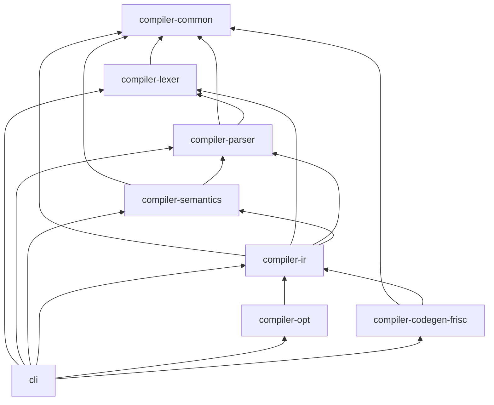
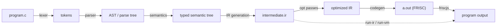
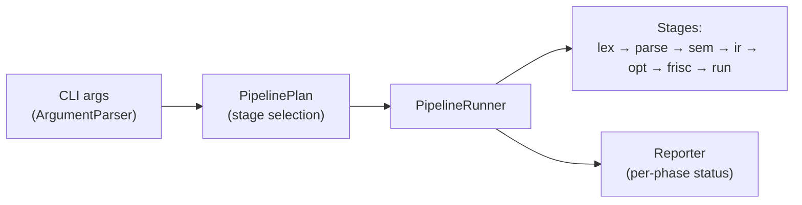

# Architecture

FRISCcc is a Maven multi-module project. Each compilation phase is an
independent module with a narrow, well-defined boundary; the `cli` module wires
them into runnable pipelines. Cross-cutting concerns — diagnostics and source
locations — live in `compiler-common`, which every other module depends on.

## Modules

| Module | Responsibility | Key entry points |
|--------|----------------|------------------|
| `compiler-common` | Diagnostics framework, source locations | `Diagnostic`, `DiagnosticReporter`, `SourceLocation` |
| `compiler-lexer` | Tokenization (ε-NFA → DFA, maximal munch) | `Lexer`, `NFAToDFAConverter`, `Token` |
| `compiler-parser` | LR(1) table construction and parsing, AST | `Parser`, `LRTable`, `LRTableCache`, `ast/*` |
| `compiler-semantics` | Symbol tables, type system, semantic legality | `SemanticAnalyzer`, `TypeSystem` |
| `compiler-ir` | Lowering the semantic tree to a typed IR | `IrPipeline`, `IrVerifier`, `ir.types.*` |
| `compiler-opt` | IR-to-IR optimization passes (fixpoint) | `IrOptimizer`, `PassPipeline`, `rules/*` |
| `compiler-codegen-frisc` | Typed IR → FRISC assembly | `FriscCodeGenerator`, emitters |
| `cli` | Orchestration, IR interpreter, bytecode VM, simulator driver | `CCompilerMain`, `PipelineRunner`, `cli.ir.*`, `cli.vm.*` |

## Module dependency graph

Dependencies point from a consumer to the module it builds on. The graph is
acyclic; `compiler-common` is the shared leaf and `cli` is the root that
assembles everything.

The front-end modules form a linear chain (`lexer` → `parser` → `semantics` →
`ir`). Past the IR, the dependency graph fans out: both `compiler-opt` and
`compiler-codegen-frisc` depend only on `compiler-ir`, never on each other or on
the front end. That is the structural expression of the typed IR being the
pipeline's interface — the back end knows nothing about how the IR was produced.

## Data flow

The phases exchange concrete artifacts. The `cli` orchestrator runs them in
order, gating later phases on the success of earlier ones, and writes
intermediate artifacts under `compiler-bin/`.

## Orchestration

The `cli` module defines the pipeline as an ordered sequence of stages. A
requested flag selects the last stage to run; earlier stages are implied and
executed first (so `--frisc` runs lexing through code generation). The same
module hosts the two IR execution back ends (`cli.ir`, `cli.vm`) and the
simulator driver (`FriscRunner`).

The compilation phases are pure transformations over artifacts; the `cli`
layer owns I/O, stage gating, and reporting. See [Build & run](build-and-run.md)
to drive the pipeline and the [CLI reference](reference/cli.md) for every flag.

## Design properties

- **Phase isolation.** A module exposes only the artifact the next phase needs;
  internal representations do not leak across boundaries.
- **One IR, three back ends.** The FRISC code generator, the IR interpreter, and
  the bytecode VM all consume the same typed IR and agree on results.
- **Structured diagnostics.** Errors are `Diagnostic` objects (severity, stage,
  source location, message), not strings; library modules never call
  `System.exit` or print errors directly.
- **Deterministic output.** Given the same source and flags, the compiler
  produces byte-identical artifacts — the basis for golden-file testing.
