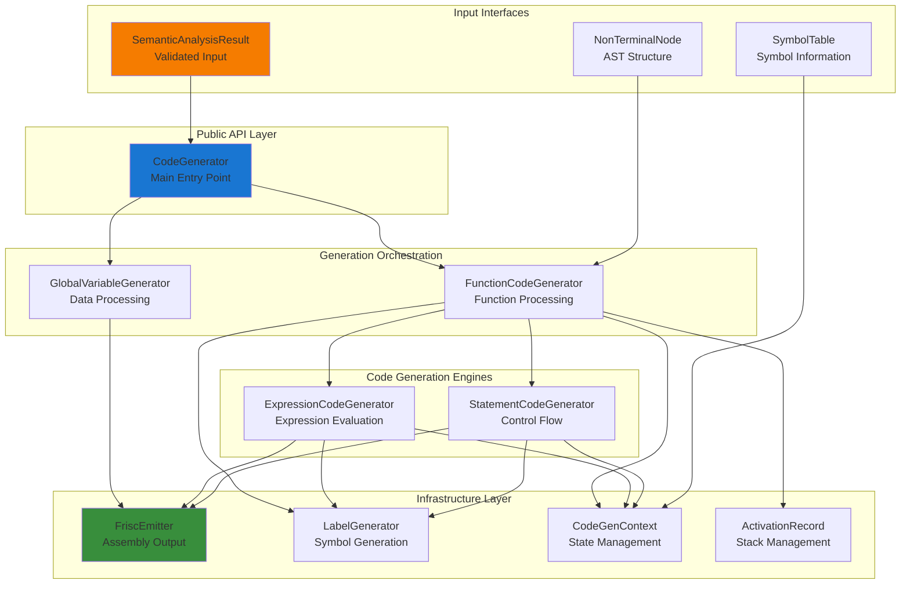

# Code Generation Implementation

This document provides a comprehensive technical reference for the FRISC code generation implementation in the PPJ compiler. It covers detailed algorithms, data structures, implementation patterns, and technical decisions that enable the transformation of semantically validated C programs into executable FRISC assembly code.

## Table of Contents

- [Implementation Architecture](#implementation-architecture)
- [Core Data Structures](#core-data-structures)
- [Code Generation Algorithms](#code-generation-algorithms)
- [Expression Code Generation](#expression-code-generation)
- [Statement Code Generation](#statement-code-generation)
- [Function Code Generation](#function-code-generation)
- [Memory Management](#memory-management)
- [Register Allocation](#register-allocation)
- [Optimization Techniques](#optimization-techniques)
- [Error Recovery](#error-recovery)
- [Testing and Validation](#testing-and-validation)

## Implementation Architecture

### Module Organization

The code generation implementation follows a layered architecture with clear separation of concerns:



### Package Structure

```
hr.fer.ppj.codegen/
├── CodeGenerator.java              # Main orchestrator
├── CodeGenContext.java             # Shared state management
├── CodeGenerationException.java    # Error handling
├── FriscEmitter.java              # Assembly output
├── LabelGenerator.java            # Label management
├── GlobalVariableGenerator.java   # Global data
│
├── expr/
│   └── ExpressionCodeGenerator.java   # Expression evaluation
│
├── stmt/
│   └── StatementCodeGenerator.java    # Statement processing
│
└── func/
    ├── FunctionCodeGenerator.java     # Function processing
    └── ActivationRecord.java          # Stack frame management
```

### Design Patterns

**Visitor Pattern**: Systematic AST traversal
```java
public void generateStatement(NonTerminalNode statement) {
    NonTerminalNode child = (NonTerminalNode) statement.children().get(0);
    switch (child.symbol()) {
        case "<slozena_naredba>" -> generateCompoundStatement(child);
        case "<izraz_naredba>" -> generateExpressionStatement(child);
        case "<naredba_grananja>" -> generateIfStatement(child);
        case "<naredba_petlje>" -> generateLoopStatement(child);
        case "<naredba_skoka>" -> generateJumpStatement(child);
        default -> throw new CodeGenerationException("Unknown statement: " + child.symbol());
    }
}
```

**Strategy Pattern**: Different generation strategies for different constructs
```java
public interface CodeGenerationStrategy {
    void generate(NonTerminalNode node, CodeGenContext context);
}

public class BinaryOperatorStrategy implements CodeGenerationStrategy {
    public void generate(NonTerminalNode node, CodeGenContext context) {
        // Binary operator specific generation logic
    }
}
```

**Builder Pattern**: Complex instruction sequence construction
```java
public class InstructionSequenceBuilder {
    private List<Instruction> instructions = new ArrayList<>();
    
    public InstructionSequenceBuilder add(String mnemonic, String operands) {
        instructions.add(new Instruction(mnemonic, operands));
        return this;
    }
    
    public void emit(FriscEmitter emitter) {
        instructions.forEach(emitter::emit);
    }
}
```

## Core Data Structures

### CodeGenContext

Central state management for code generation process:

```java
/**
 * Context object maintaining shared state during code generation.
 * Provides access to symbol tables, emission facilities, and current scope information.
 */
public final class CodeGenContext {
    private final SymbolTable globalScope;
    private final FriscEmitter emitter;
    private final LabelGenerator labelGenerator;
    private final ActivationRecord activationRecord;
    
    /**
     * Creates context for child scope (function body, block statement).
     */
    public CodeGenContext forChildScope(ActivationRecord newActivationRecord) {
        return new CodeGenContext(globalScope, emitter, labelGenerator, newActivationRecord);
    }
    
    /**
     * Resolves symbol in current scope hierarchy.
     */
    public Optional<Symbol> resolveSymbol(String name) {
        // Check local scope first, then global scope
        if (activationRecord != null && activationRecord.hasLocalVariable(name)) {
            return Optional.of(activationRecord.getLocalVariable(name));
        }
        return globalScope.lookup(name);
    }
}
```

### ActivationRecord

Stack frame management for function calls:

```java
/**
 * Represents function activation record (stack frame) layout.
 * Manages local variable allocation and parameter access.
 */
public final class ActivationRecord {
    private final SymbolTable functionScope;
    private final Map<String, VariableInfo> localVariables = new LinkedHashMap<>();
    private int currentOffset = 0;  // Offset from R7 (stack pointer)
    
    /**
     * Information about a local variable's stack location.
     */
    public static class VariableInfo {
        private final Type type;
        private final int offset;    // Offset from R7 (negative for locals)
        private final int size;      // Size in bytes
        
        public VariableInfo(Type type, int offset, int size) {
            this.type = type;
            this.offset = offset;
            this.size = size;
        }
        
        public int offset() { return offset; }
        public int size() { return size; }
        public Type type() { return type; }
    }
    
    /**
     * Adds local variable to activation record.
     */
    public void addLocalVariable(String name, Type type, int size) {
        currentOffset += size;  // Stack grows downward
        localVariables.put(name, new VariableInfo(type, currentOffset, size));
    }
    
    /**
     * Gets stack offset for local variable access.
     */
    public int getOffset(String name) {
        VariableInfo info = localVariables.get(name);
        return info != null ? info.offset() : 0;
    }
    
    /**
     * Total size of all local variables for stack allocation.
     */
    public int getTotalLocalVariableSize() {
        return currentOffset;
    }
}
```

### FriscEmitter

Assembly code output management with formatting and comments:

```java
/**
 * Handles FRISC assembly code emission with proper formatting and comments.
 */
public final class FriscEmitter implements Closeable {
    private static final String INDENT = "        ";  // 8 spaces for instructions
    private static final String COMMENT_PREFIX = "; ";
    private static final int COMMENT_COLUMN = 40;     // Alignment for comments
    
    private final PrintWriter writer;
    
    /**
     * Emits FRISC instruction with operands and optional comment.
     */
    public void emitInstruction(String mnemonic, String operands, String comment) {
        StringBuilder line = new StringBuilder(INDENT);
        line.append(mnemonic);
        
        if (operands != null && !operands.isEmpty()) {
            line.append(" ").append(operands);
        }
        
        if (comment != null && !comment.isEmpty()) {
            // Pad to comment column for alignment
            while (line.length() < COMMENT_COLUMN) {
                line.append(" ");
            }
            line.append(COMMENT_PREFIX).append(comment);
        }
        
        writer.println(line);
    }
    
    /**
     * Emits label at beginning of line.
     */
    public void emitLabel(String label, String comment) {
        if (comment != null && !comment.isEmpty()) {
            writer.println(label + " " + COMMENT_PREFIX + comment);
        } else {
            writer.println(label);
        }
    }
    
    /**
     * Emits section header comment.
     */
    public void emitSectionHeader(String title) {
        writer.println();
        writer.println("; " + "=".repeat(76));
        writer.println("; " + title);
        writer.println("; " + "=".repeat(76));
        writer.println();
    }
}
```

### LabelGenerator

Unique label generation with consistent naming conventions:

```java
/**
 * Generates unique labels for functions, variables, and control flow constructs.
 */
public final class LabelGenerator {
    private int labelCounter = 0;
    private final Set<String> usedLabels = new HashSet<>();
    
    /**
     * Generates unique generic label.
     */
    public String generateLabel() {
        String label;
        do {
            label = "L_" + (labelCounter++);
        } while (usedLabels.contains(label));
        
        usedLabels.add(label);
        return label;
    }
    
    /**
     * Gets function label with standard naming convention.
     */
    public String getFunctionLabel(String functionName) {
        String label = "F_" + functionName.toUpperCase();
        usedLabels.add(label);
        return label;
    }
    
    /**
     * Gets global variable label with standard naming convention.
     */
    public String getGlobalVariableLabel(String variableName) {
        String label = "G_" + variableName.toUpperCase();
        usedLabels.add(label);
        return label;
    }
    
    /**
     * Generates labels for control flow constructs.
     */
    public ControlFlowLabels generateControlFlowLabels(String prefix) {
        String base = prefix + "_" + (labelCounter++);
        return new ControlFlowLabels(
            "L_" + base + "_START",
            "L_" + base + "_END", 
            "L_" + base + "_CONTINUE"
        );
    }
    
    public record ControlFlowLabels(String start, String end, String continueLabel) {}
}
```

## Code Generation Algorithms

### AST Traversal Algorithm

The code generator uses a recursive descent approach with visitor pattern:

```java
/**
 * Main AST traversal algorithm for code generation.
 */
public class ASTTraverser {
    
    /**
     * Processes translation unit (top-level program structure).
     */
    public void processTranslationUnit(NonTerminalNode translationUnit, CodeGenContext context) {
        // <prijevodna_jedinica> ::= <vanjska_deklaracija> | <prijevodna_jedinica> <vanjska_deklaracija>
        
        for (ParseNode child : translationUnit.children()) {
            if (child instanceof NonTerminalNode nonTerminal) {
                switch (nonTerminal.symbol()) {
                    case "<vanjska_deklaracija>" -> processExternalDeclaration(nonTerminal, context);
                    case "<prijevodna_jedinica>" -> processTranslationUnit(nonTerminal, context);
                }
            }
        }
    }
    
    /**
     * Processes external declarations (functions and global variables).
     */
    private void processExternalDeclaration(NonTerminalNode externalDeclaration, CodeGenContext context) {
        NonTerminalNode child = (NonTerminalNode) externalDeclaration.children().get(0);
        
        switch (child.symbol()) {
            case "<definicija_funkcije>" -> {
                FunctionCodeGenerator funcGen = new FunctionCodeGenerator(context);
                funcGen.generateFunctionDefinition(child);
            }
            case "<deklaracija>" -> {
                GlobalVariableGenerator globalGen = new GlobalVariableGenerator(context);
                globalGen.processGlobalDeclaration(child);
            }
        }
    }
}
```

### Symbol Resolution Algorithm

Efficient symbol lookup with scope hierarchy:

```java
/**
 * Symbol resolution with proper scope handling.
 */
public class SymbolResolver {
    
    /**
     * Resolves symbol reference to its declaration.
     */
    public ResolvedSymbol resolveSymbol(String name, CodeGenContext context) {
        // 1. Check local scope (current function's activation record)
        if (context.activationRecord() != null) {
            VariableInfo localVar = context.activationRecord().getLocalVariable(name);
            if (localVar != null) {
                return new ResolvedSymbol(name, localVar.type(), SymbolScope.LOCAL, 
                                        localVar.offset());
            }
        }
        
        // 2. Check global scope
        Optional<Symbol> globalSymbol = context.globalScope().lookup(name);
        if (globalSymbol.isPresent()) {
            Symbol symbol = globalSymbol.get();
            return new ResolvedSymbol(name, symbol.type(), SymbolScope.GLOBAL, 
                                    context.labelGenerator().getGlobalVariableLabel(name));
        }
        
        throw new CodeGenerationException("Undefined symbol: " + name);
    }
    
    public enum SymbolScope { LOCAL, GLOBAL, PARAMETER }
    
    public record ResolvedSymbol(String name, Type type, SymbolScope scope, Object location) {}
}
```

### Type-Directed Code Generation

Code generation strategies based on type information:

```java
/**
 * Type-directed code generation for expressions and operations.
 */
public class TypeDirectedGenerator {
    
    /**
     * Generates code for binary operation based on operand types.
     */
    public void generateBinaryOperation(String operator, Type leftType, Type rightType, 
                                      CodeGenContext context) {
        // Handle type conversions
        if (needsConversion(leftType, rightType)) {
            generateTypeConversion(leftType, rightType, context);
        }
        
        // Generate operation based on result type
        Type resultType = getResultType(operator, leftType, rightType);
        
        switch (operator) {
            case "+" -> generateAddition(resultType, context);
            case "-" -> generateSubtraction(resultType, context);
            case "*" -> generateMultiplication(resultType, context);
            case "/" -> generateDivision(resultType, context);
            case "%" -> generateModulo(resultType, context);
            case "<" -> generateComparison("JP_SLT", resultType, context);
            case ">" -> generateComparison("JP_SGT", resultType, context);
            case "<=" -> generateComparison("JP_SLE", resultType, context);
            case ">=" -> generateComparison("JP_SGE", resultType, context);
            case "==" -> generateComparison("JP_EQ", resultType, context);
            case "!=" -> generateComparison("JP_NE", resultType, context);
            default -> throw new CodeGenerationException("Unknown operator: " + operator);
        }
    }
    
    /**
     * Determines if type conversion is needed between operands.
     */
    private boolean needsConversion(Type leftType, Type rightType) {
        // PPJ-C allows implicit conversion between char and int
        return (leftType == PrimitiveType.CHAR && rightType == PrimitiveType.INT) ||
               (leftType == PrimitiveType.INT && rightType == PrimitiveType.CHAR);
    }
    
    /**
     * Generates type conversion code.
     */
    private void generateTypeConversion(Type fromType, Type toType, CodeGenContext context) {
        if (fromType == PrimitiveType.CHAR && toType == PrimitiveType.INT) {
            // char to int: sign extension (already handled by FRISC load operations)
            context.emitter().emitComment("char to int conversion (implicit)");
        } else if (fromType == PrimitiveType.INT && toType == PrimitiveType.CHAR) {
            // int to char: truncation to lower 8 bits
            context.emitter().emitInstruction("AND", "R0, 255, R0", "int to char conversion");
        }
    }
}
```

## Expression Code Generation

### Expression Evaluation Strategy

The expression code generator uses a stack-based evaluation model with register optimization:

```java
/**
 * Expression evaluation with register management and temporary storage.
 */
public class ExpressionEvaluator {
    
    /**
     * Evaluates expression and leaves result in R0.
     */
    public void evaluateExpression(NonTerminalNode expression, CodeGenContext context) {
        switch (expression.symbol()) {
            case "<primarni_izraz>" -> evaluatePrimaryExpression(expression, context);
            case "<postfiks_izraz>" -> evaluatePostfixExpression(expression, context);
            case "<unarni_izraz>" -> evaluateUnaryExpression(expression, context);
            case "<multiplikativni_izraz>" -> evaluateMultiplicativeExpression(expression, context);
            case "<aditivni_izraz>" -> evaluateAdditiveExpression(expression, context);
            case "<odnosni_izraz>" -> evaluateRelationalExpression(expression, context);
            case "<jednakosni_izraz>" -> evaluateEqualityExpression(expression, context);
            case "<log_i_izraz>" -> evaluateLogicalAndExpression(expression, context);
            case "<log_ili_izraz>" -> evaluateLogicalOrExpression(expression, context);
            case "<izraz_pridruzivanja>" -> evaluateAssignmentExpression(expression, context);
            default -> throw new CodeGenerationException("Unknown expression type: " + expression.symbol());
        }
    }
    
    /**
     * Evaluates primary expressions (identifiers, constants, parenthesized expressions).
     */
    private void evaluatePrimaryExpression(NonTerminalNode primaryExpr, CodeGenContext context) {
        ParseNode child = primaryExpr.children().get(0);
        
        if (child instanceof TerminalNode terminal) {
            switch (terminal.symbol()) {
                case "IDN" -> {
                    String varName = terminal.lexeme();
                    ResolvedSymbol symbol = resolveSymbol(varName, context);
                    generateVariableLoad(symbol, context);
                }
                case "BROJ" -> {
                    int value = Integer.parseInt(terminal.lexeme());
                    context.emitter().emitInstruction("MOVE", value + ", R0", 
                                                    "load constant " + value);
                }
                case "ZNAK" -> {
                    char charValue = parseCharLiteral(terminal.lexeme());
                    context.emitter().emitInstruction("MOVE", ((int) charValue) + ", R0", 
                                                    "load char '" + charValue + "'");
                }
                case "NIZ_ZNAKOVA" -> {
                    String stringLabel = generateStringLiteral(terminal.lexeme(), context);
                    context.emitter().emitInstruction("MOVE", stringLabel + ", R0", 
                                                    "load string address");
                }
            }
        } else if (child instanceof NonTerminalNode && child.symbol().equals("<izraz>")) {
            // Parenthesized expression
            evaluateExpression((NonTerminalNode) child, context);
        }
    }
    
    /**
     * Generates variable load based on symbol scope and location.
     */
    private void generateVariableLoad(ResolvedSymbol symbol, CodeGenContext context) {
        switch (symbol.scope()) {
            case LOCAL -> {
                int offset = (Integer) symbol.location();
                context.emitter().emitInstruction("LOAD", "R0, (R7-" + offset + ")", 
                                                "load local variable " + symbol.name());
            }
            case GLOBAL -> {
                String label = (String) symbol.location();
                context.emitter().emitInstruction("LOAD", "R0, (" + label + ")", 
                                                "load global variable " + symbol.name());
            }
            case PARAMETER -> {
                int offset = (Integer) symbol.location();
                context.emitter().emitInstruction("LOAD", "R0, (R7+" + offset + ")", 
                                                "load parameter " + symbol.name());
            }
        }
    }
}
```

### Binary Expression Evaluation

Efficient evaluation of binary expressions with temporary storage:

```java
/**
 * Binary expression evaluation with stack-based temporary storage.
 */
public class BinaryExpressionEvaluator {
    
    /**
     * Evaluates binary expression: left op right.
     */
    public void evaluateBinaryExpression(NonTerminalNode leftExpr, String operator, 
                                       NonTerminalNode rightExpr, CodeGenContext context) {
        // Evaluate left operand (result in R0)
        evaluateExpression(leftExpr, context);
        
        // Save left operand on stack
        context.emitter().emitInstruction("PUSH", "R0", "save left operand");
        
        // Evaluate right operand (result in R0)
        evaluateExpression(rightExpr, context);
        
        // Move right operand to R1
        context.emitter().emitInstruction("MOVE", "R0, R1", "right operand to R1");
        
        // Restore left operand to R0
        context.emitter().emitInstruction("POP", "R0", "restore left operand");
        
        // Generate operation
        generateBinaryOperation(operator, context);
    }
    
    /**
     * Generates specific binary operation.
     */
    private void generateBinaryOperation(String operator, CodeGenContext context) {
        switch (operator) {
            case "+" -> context.emitter().emitInstruction("ADD", "R0, R1, R0", "addition");
            case "-" -> context.emitter().emitInstruction("SUB", "R0, R1, R0", "subtraction");
            case "*" -> generateMultiplication(context);
            case "/" -> generateDivision(context);
            case "%" -> generateModulo(context);
            case "&" -> context.emitter().emitInstruction("AND", "R0, R1, R0", "bitwise AND");
            case "|" -> context.emitter().emitInstruction("OR", "R0, R1, R0", "bitwise OR");
            case "^" -> context.emitter().emitInstruction("XOR", "R0, R1, R0", "bitwise XOR");
            default -> throw new CodeGenerationException("Unknown binary operator: " + operator);
        }
    }
    
    /**
     * Generates multiplication using repeated addition (FRISC has no MUL instruction).
     */
    private void generateMultiplication(CodeGenContext context) {
        String loopStart = context.labelGenerator().generateLabel();
        String loopEnd = context.labelGenerator().generateLabel();
        
        context.emitter().emitComment("Multiplication: R0 * R1");
        context.emitter().emitInstruction("MOVE", "0, R2", "initialize result");
        context.emitter().emitInstruction("CMP", "R1, 0", "check if multiplier is zero");
        context.emitter().emitInstruction("JP_EQ", loopEnd, "skip if zero");
        
        context.emitter().emitLabel(loopStart, "multiplication loop");
        context.emitter().emitInstruction("ADD", "R2, R0, R2", "add multiplicand to result");
        context.emitter().emitInstruction("SUB", "R1, 1, R1", "decrement multiplier");
        context.emitter().emitInstruction("JP_NE", loopStart, "continue if not zero");
        
        context.emitter().emitLabel(loopEnd, "end multiplication");
        context.emitter().emitInstruction("MOVE", "R2, R0", "move result to R0");
    }
}
```

### Short-Circuit Evaluation

Implementation of short-circuit evaluation for logical operators:

```java
/**
 * Short-circuit evaluation for logical AND and OR operators.
 */
public class ShortCircuitEvaluator {
    
    /**
     * Evaluates logical AND with short-circuit behavior.
     */
    public void evaluateLogicalAnd(NonTerminalNode leftExpr, NonTerminalNode rightExpr, 
                                 CodeGenContext context) {
        String falseLabel = context.labelGenerator().generateLabel();
        String endLabel = context.labelGenerator().generateLabel();
        
        context.emitter().emitComment("Logical AND with short-circuit evaluation");
        
        // Evaluate left operand
        evaluateExpression(leftExpr, context);
        context.emitter().emitInstruction("CMP", "R0, 0", "test left operand");
        context.emitter().emitInstruction("JP_EQ", falseLabel, "short-circuit: left is false");
        
        // Left is true, evaluate right operand
        evaluateExpression(rightExpr, context);
        context.emitter().emitInstruction("CMP", "R0, 0", "test right operand");
        context.emitter().emitInstruction("JP_EQ", falseLabel, "right is false");
        
        // Both true
        context.emitter().emitInstruction("MOVE", "1, R0", "AND result: true");
        context.emitter().emitInstruction("JP", endLabel, "skip false case");
        
        // Either false
        context.emitter().emitLabel(falseLabel, "AND result: false");
        context.emitter().emitInstruction("MOVE", "0, R0", "AND result: false");
        
        context.emitter().emitLabel(endLabel, "end of logical AND");
    }
    
    /**
     * Evaluates logical OR with short-circuit behavior.
     */
    public void evaluateLogicalOr(NonTerminalNode leftExpr, NonTerminalNode rightExpr, 
                                CodeGenContext context) {
        String trueLabel = context.labelGenerator().generateLabel();
        String endLabel = context.labelGenerator().generateLabel();
        
        context.emitter().emitComment("Logical OR with short-circuit evaluation");
        
        // Evaluate left operand
        evaluateExpression(leftExpr, context);
        context.emitter().emitInstruction("CMP", "R0, 0", "test left operand");
        context.emitter().emitInstruction("JP_NE", trueLabel, "short-circuit: left is true");
        
        // Left is false, evaluate right operand
        evaluateExpression(rightExpr, context);
        context.emitter().emitInstruction("CMP", "R0, 0", "test right operand");
        context.emitter().emitInstruction("JP_NE", trueLabel, "right is true");
        
        // Both false
        context.emitter().emitInstruction("MOVE", "0, R0", "OR result: false");
        context.emitter().emitInstruction("JP", endLabel, "skip true case");
        
        // Either true
        context.emitter().emitLabel(trueLabel, "OR result: true");
        context.emitter().emitInstruction("MOVE", "1, R0", "OR result: true");
        
        context.emitter().emitLabel(endLabel, "end of logical OR");
    }
}
```

### Assignment Expression Handling

Implementation of assignment operators with L-value analysis:

```java
/**
 * Assignment expression handling with L-value address generation.
 */
public class AssignmentExpressionHandler {
    
    /**
     * Generates assignment: lvalue = rvalue.
     */
    public void generateAssignment(NonTerminalNode lvalueExpr, NonTerminalNode rvalueExpr, 
                                 CodeGenContext context) {
        // Evaluate right-hand side first
        evaluateExpression(rvalueExpr, context);
        
        // Generate L-value address and store
        generateLValueStore(lvalueExpr, context);
    }
    
    /**
     * Generates code to store R0 into L-value location.
     */
    private void generateLValueStore(NonTerminalNode lvalueExpr, CodeGenContext context) {
        if (isSimpleVariable(lvalueExpr)) {
            // Simple variable assignment
            String varName = extractVariableName(lvalueExpr);
            ResolvedSymbol symbol = resolveSymbol(varName, context);
            generateVariableStore(symbol, context);
        } else if (isArrayAccess(lvalueExpr)) {
            // Array element assignment
            generateArrayElementStore(lvalueExpr, context);
        } else {
            throw new CodeGenerationException("Invalid L-value in assignment");
        }
    }
    
    /**
     * Generates variable store based on symbol scope.
     */
    private void generateVariableStore(ResolvedSymbol symbol, CodeGenContext context) {
        switch (symbol.scope()) {
            case LOCAL -> {
                int offset = (Integer) symbol.location();
                context.emitter().emitInstruction("STORE", "R0, (R7-" + offset + ")", 
                                                "store to local variable " + symbol.name());
            }
            case GLOBAL -> {
                String label = (String) symbol.location();
                context.emitter().emitInstruction("STORE", "R0, (" + label + ")", 
                                                "store to global variable " + symbol.name());
            }
            case PARAMETER -> {
                int offset = (Integer) symbol.location();
                context.emitter().emitInstruction("STORE", "R0, (R7+" + offset + ")", 
                                                "store to parameter " + symbol.name());
            }
        }
    }
    
    /**
     * Generates array element store: array[index] = value.
     */
    private void generateArrayElementStore(NonTerminalNode arrayAccess, CodeGenContext context) {
        // Extract array base and index expressions
        NonTerminalNode arrayBase = extractArrayBase(arrayAccess);
        NonTerminalNode indexExpr = extractArrayIndex(arrayAccess);
        
        // Save value to store (currently in R0)
        context.emitter().emitInstruction("PUSH", "R0", "save value to store");
        
        // Calculate array element address
        generateArrayElementAddress(arrayBase, indexExpr, context);
        
        // Restore value and store to calculated address
        context.emitter().emitInstruction("POP", "R1", "restore value to store");
        context.emitter().emitInstruction("STORE", "R1, (R0)", "store to array element");
    }
    
    /**
     * Generates array element address calculation.
     */
    private void generateArrayElementAddress(NonTerminalNode arrayBase, NonTerminalNode indexExpr, 
                                           CodeGenContext context) {
        // Get array base address
        String arrayName = extractVariableName(arrayBase);
        ResolvedSymbol arraySymbol = resolveSymbol(arrayName, context);
        
        // Evaluate index expression
        evaluateExpression(indexExpr, context);
        
        // Calculate element address: base + (index * element_size)
        context.emitter().emitInstruction("SHL", "R0, 2, R0", "multiply index by 4 (word size)");
        
        switch (arraySymbol.scope()) {
            case LOCAL -> {
                int baseOffset = (Integer) arraySymbol.location();
                context.emitter().emitInstruction("ADD", "R7, -" + baseOffset + ", R1", 
                                                "get local array base address");
                context.emitter().emitInstruction("ADD", "R1, R0, R0", "calculate element address");
            }
            case GLOBAL -> {
                String baseLabel = (String) arraySymbol.location();
                context.emitter().emitInstruction("MOVE", baseLabel + ", R1", 
                                                "get global array base address");
                context.emitter().emitInstruction("ADD", "R1, R0, R0", "calculate element address");
            }
        }
    }
}
```

## Statement Code Generation

### Control Flow Implementation

Systematic implementation of control flow constructs:

```java
/**
 * Control flow statement generation with proper label management.
 */
public class ControlFlowGenerator {
    
    /**
     * Generates if-else statement with proper branching.
     */
    public void generateIfStatement(NonTerminalNode ifStatement, CodeGenContext context) {
        // Extract components: condition, then-statement, optional else-statement
        NonTerminalNode condition = extractCondition(ifStatement);
        NonTerminalNode thenStatement = extractThenStatement(ifStatement);
        NonTerminalNode elseStatement = extractElseStatement(ifStatement); // may be null
        
        // Generate unique labels
        String elseLabel = context.labelGenerator().generateLabel();
        String endLabel = context.labelGenerator().generateLabel();
        
        context.emitter().emitComment("If statement");
        
        // Generate condition evaluation
        evaluateExpression(condition, context);
        context.emitter().emitInstruction("CMP", "R0, 0", "test condition");
        context.emitter().emitInstruction("JP_EQ", elseLabel, "jump to else if false");
        
        // Generate then block
        generateStatement(thenStatement, context);
        
        if (elseStatement != null) {
            // Has else block
            context.emitter().emitInstruction("JP", endLabel, "skip else block");
            context.emitter().emitLabel(elseLabel, "else block");
            generateStatement(elseStatement, context);
            context.emitter().emitLabel(endLabel, "end of if-else");
        } else {
            // No else block
            context.emitter().emitLabel(elseLabel, "end of if");
        }
    }
    
    /**
     * Generates while loop with proper loop structure.
     */
    public void generateWhileLoop(NonTerminalNode whileLoop, CodeGenContext context) {
        NonTerminalNode condition = extractLoopCondition(whileLoop);
        NonTerminalNode body = extractLoopBody(whileLoop);
        
        // Generate loop labels
        ControlFlowLabels labels = context.labelGenerator().generateControlFlowLabels("WHILE");
        
        context.emitter().emitComment("While loop");
        context.emitter().emitLabel(labels.start(), "while loop start");
        
        // Generate condition test
        evaluateExpression(condition, context);
        context.emitter().emitInstruction("CMP", "R0, 0", "test loop condition");
        context.emitter().emitInstruction("JP_EQ", labels.end(), "exit loop if false");
        
        // Generate loop body with break/continue context
        LoopContext loopContext = new LoopContext(labels.end(), labels.continueLabel());
        CodeGenContext bodyContext = context.withLoopContext(loopContext);
        generateStatement(body, bodyContext);
        
        // Continue point and loop back
        context.emitter().emitLabel(labels.continueLabel(), "continue point");
        context.emitter().emitInstruction("JP", labels.start(), "jump back to condition");
        context.emitter().emitLabel(labels.end(), "end of while loop");
    }
    
    /**
     * Generates for loop with initialization, condition, and update.
     */
    public void generateForLoop(NonTerminalNode forLoop, CodeGenContext context) {
        NonTerminalNode initialization = extractForInitialization(forLoop);
        NonTerminalNode condition = extractForCondition(forLoop);
        NonTerminalNode update = extractForUpdate(forLoop);
        NonTerminalNode body = extractForBody(forLoop);
        
        // Generate loop labels
        ControlFlowLabels labels = context.labelGenerator().generateControlFlowLabels("FOR");
        
        context.emitter().emitComment("For loop");
        
        // Generate initialization
        if (initialization != null) {
            generateStatement(initialization, context);
        }
        
        // Loop condition test
        context.emitter().emitLabel(labels.start(), "for loop condition");
        if (condition != null) {
            evaluateExpression(condition, context);
            context.emitter().emitInstruction("CMP", "R0, 0", "test loop condition");
            context.emitter().emitInstruction("JP_EQ", labels.end(), "exit loop if false");
        }
        
        // Generate loop body
        LoopContext loopContext = new LoopContext(labels.end(), labels.continueLabel());
        CodeGenContext bodyContext = context.withLoopContext(loopContext);
        generateStatement(body, bodyContext);
        
        // Continue point and update
        context.emitter().emitLabel(labels.continueLabel(), "for loop update");
        if (update != null) {
            evaluateExpression(update, context);
        }
        
        context.emitter().emitInstruction("JP", labels.start(), "jump back to condition");
        context.emitter().emitLabel(labels.end(), "end of for loop");
    }
}
```

### Jump Statement Implementation

Implementation of break, continue, and return statements:

```java
/**
 * Jump statement generation with proper context handling.
 */
public class JumpStatementGenerator {
    
    /**
     * Generates return statement with optional expression.
     */
    public void generateReturnStatement(NonTerminalNode returnStmt, CodeGenContext context) {
        NonTerminalNode returnExpr = extractReturnExpression(returnStmt); // may be null
        
        context.emitter().emitComment("Return statement");
        
        if (returnExpr != null) {
            // Evaluate return expression
            evaluateExpression(returnExpr, context);
            context.emitter().emitInstruction("MOVE", "R0, R6", "set return value");
        } else {
            // Void return
            context.emitter().emitInstruction("MOVE", "0, R6", "default return value");
        }
        
        // Deallocate local variables and return
        ActivationRecord activation = context.activationRecord();
        if (activation != null && activation.getTotalLocalVariableSize() > 0) {
            context.emitter().emitInstruction("ADD", "R7, " + activation.getTotalLocalVariableSize() + ", R7", 
                                            "deallocate local variables");
        }
        
        context.emitter().emitInstruction("RET", "return to caller");
    }
    
    /**
     * Generates break statement (jump to loop end).
     */
    public void generateBreakStatement(CodeGenContext context) {
        LoopContext loopContext = context.getCurrentLoopContext();
        if (loopContext == null) {
            throw new CodeGenerationException("Break statement outside of loop");
        }
        
        context.emitter().emitComment("Break statement");
        context.emitter().emitInstruction("JP", loopContext.breakLabel(), "break from loop");
    }
    
    /**
     * Generates continue statement (jump to loop continue point).
     */
    public void generateContinueStatement(CodeGenContext context) {
        LoopContext loopContext = context.getCurrentLoopContext();
        if (loopContext == null) {
            throw new CodeGenerationException("Continue statement outside of loop");
        }
        
        context.emitter().emitComment("Continue statement");
        context.emitter().emitInstruction("JP", loopContext.continueLabel(), "continue loop");
    }
    
    /**
     * Context information for nested loops.
     */
    public record LoopContext(String breakLabel, String continueLabel) {}
}
```

## Function Code Generation

### Function Definition Processing

Complete function definition handling with proper stack management:

```java
/**
 * Function definition processing with complete stack frame management.
 */
public class FunctionDefinitionProcessor {
    
    /**
     * Generates complete function definition.
     */
    public void generateFunctionDefinition(NonTerminalNode functionDef, CodeGenContext context) {
        // Extract function components
        FunctionInfo funcInfo = extractFunctionInfo(functionDef);
        
        // Generate function label
        String funcLabel = context.labelGenerator().getFunctionLabel(funcInfo.name());
        context.emitter().emitLabel(funcLabel, "Function: " + funcInfo.signature());
        
        // Create activation record for this function
        ActivationRecord activation = new ActivationRecord(context.globalScope());
        
        // Process function parameters
        processParameters(funcInfo.parameters(), activation);
        
        // Process local variable declarations
        processLocalDeclarations(funcInfo.body(), activation);
        
        // Generate function prolog
        generateFunctionProlog(activation, context);
        
        // Generate function body
        CodeGenContext functionContext = context.forChildScope(activation);
        generateFunctionBody(funcInfo.body(), functionContext);
        
        // Generate function epilog
        generateFunctionEpilog(activation, context);
        
        context.emitter().emitEmptyLine();
    }
    
    /**
     * Generates function prolog (stack frame setup).
     */
    private void generateFunctionProlog(ActivationRecord activation, CodeGenContext context) {
        int localSize = activation.getTotalLocalVariableSize();
        
        if (localSize > 0) {
            context.emitter().emitComment("Function prolog: allocate " + 
                                        activation.getLocalVariableCount() + " local variables");
            context.emitter().emitInstruction("SUB", "R7, " + localSize + ", R7", 
                                            "allocate " + localSize + " bytes for locals");
        }
    }
    
    /**
     * Generates function epilog (stack frame cleanup and return).
     */
    private void generateFunctionEpilog(ActivationRecord activation, CodeGenContext context) {
        int localSize = activation.getTotalLocalVariableSize();
        
        context.emitter().emitComment("Function epilog");
        
        if (localSize > 0) {
            context.emitter().emitInstruction("ADD", "R7, " + localSize + ", R7", 
                                            "deallocate local variables");
        }
        
        context.emitter().emitInstruction("MOVE", "0, R6", "default return value");
        context.emitter().emitInstruction("RET", "return to caller");
    }
    
    /**
     * Processes function parameters and adds them to activation record.
     */
    private void processParameters(List<ParameterInfo> parameters, ActivationRecord activation) {
        int paramOffset = 4; // Start after return address
        
        for (ParameterInfo param : parameters) {
            activation.addParameter(param.name(), param.type(), paramOffset);
            paramOffset += 4; // All parameters are 4 bytes (int/char/pointer)
        }
    }
    
    /**
     * Processes local variable declarations in function body.
     */
    private void processLocalDeclarations(NonTerminalNode functionBody, ActivationRecord activation) {
        // Traverse compound statement to find local declarations
        List<LocalVariableInfo> locals = extractLocalVariables(functionBody);
        
        for (LocalVariableInfo local : locals) {
            int size = calculateVariableSize(local.type());
            activation.addLocalVariable(local.name(), local.type(), size);
        }
    }
    
    /**
     * Calculates storage size for a variable type.
     */
    private int calculateVariableSize(Type type) {
        if (type instanceof PrimitiveType) {
            return 4; // All primitive types are 4 bytes in FRISC
        } else if (type instanceof ArrayType arrayType) {
            return arrayType.size() * calculateVariableSize(arrayType.elementType());
        } else {
            throw new CodeGenerationException("Cannot calculate size for type: " + type);
        }
    }
}
```

### Function Call Implementation

Complete function call mechanism with parameter passing:

```java
/**
 * Function call implementation with stack-based parameter passing.
 */
public class FunctionCallGenerator {
    
    /**
     * Generates function call with arguments.
     */
    public void generateFunctionCall(NonTerminalNode functionCall, CodeGenContext context) {
        // Extract function name and arguments
        String functionName = extractFunctionName(functionCall);
        List<NonTerminalNode> arguments = extractArguments(functionCall);
        
        // Validate function exists
        FunctionSymbol function = validateFunction(functionName, context);
        
        context.emitter().emitComment("Function call: " + functionName + 
                                    "(" + arguments.size() + " arguments)");
        
        // Evaluate and push arguments in reverse order (right-to-left)
        for (int i = arguments.size() - 1; i >= 0; i--) {
            NonTerminalNode arg = arguments.get(i);
            evaluateExpression(arg, context);
            context.emitter().emitInstruction("PUSH", "R0", "push argument " + (i + 1));
        }
        
        // Generate function call
        String functionLabel = context.labelGenerator().getFunctionLabel(functionName);
        context.emitter().emitInstruction("CALL", functionLabel, "call " + functionName);
        
        // Clean up arguments from stack (caller responsibility)
        int argumentsSize = arguments.size() * 4; // 4 bytes per argument
        if (argumentsSize > 0) {
            context.emitter().emitInstruction("ADD", "R7, " + argumentsSize + ", R7", 
                                            "clean up " + arguments.size() + " arguments");
        }
        
        // Result is now in R6, move to R0 for expression evaluation
        context.emitter().emitInstruction("MOVE", "R6, R0", "function result");
    }
    
    /**
     * Validates function call against declaration.
     */
    private FunctionSymbol validateFunction(String functionName, CodeGenContext context) {
        Optional<Symbol> symbol = context.globalScope().lookup(functionName);
        
        if (symbol.isEmpty()) {
            throw new CodeGenerationException("Undefined function: " + functionName);
        }
        
        if (!(symbol.get() instanceof FunctionSymbol function)) {
            throw new CodeGenerationException("Symbol is not a function: " + functionName);
        }
        
        return function;
    }
    
    /**
     * Validates argument count and types against function signature.
     */
    private void validateArguments(List<NonTerminalNode> arguments, FunctionSymbol function, 
                                 CodeGenContext context) {
        FunctionType funcType = (FunctionType) function.type();
        List<Type> paramTypes = funcType.parameterTypes();
        
        if (arguments.size() != paramTypes.size()) {
            throw new CodeGenerationException("Function " + function.name() + 
                                            " expects " + paramTypes.size() + 
                                            " arguments, got " + arguments.size());
        }
        
        // Type checking would be done here if needed
        // (already validated by semantic analysis)
    }
}
```

## Memory Management

### Stack Frame Layout

Detailed stack frame management for function calls:

```java
/**
 * Stack frame layout and management for FRISC calling convention.
 */
public class StackFrameManager {
    
    /**
     * Standard FRISC stack frame layout:
     * 
     * Higher Addresses
     * ┌─────────────────────────┐ ← R7 + offset
     * │    Parameter N          │
     * │    Parameter N-1        │
     * │    ...                  │
     * │    Parameter 1          │
     * ├─────────────────────────┤
     * │    Return Address       │ ← Saved by CALL
     * ├─────────────────────────┤ ← R7 (current SP)
     * │    Local Variable 1     │ ← R7 - 4
     * │    Local Variable 2     │ ← R7 - 8
     * │    ...                  │
     * │    Local Variable N     │ ← R7 - (4*N)
     * └─────────────────────────┘ Lower Addresses
     */
    
    /**
     * Calculates parameter offset from stack pointer.
     */
    public static int calculateParameterOffset(int parameterIndex, int totalParameters) {
        // Parameters are above return address
        // Return address is at R7+0 (implicitly)
        // First parameter is at R7+4, second at R7+8, etc.
        return 4 + (parameterIndex * 4);
    }
    
    /**
     * Calculates local variable offset from stack pointer.
     */
    public static int calculateLocalOffset(int variableIndex, int variableSize) {
        // Local variables are below stack pointer
        // First local at R7-4, second at R7-8, etc.
        return 4 + (variableIndex * variableSize);
    }
    
    /**
     * Generates stack allocation for local variables.
     */
    public static void generateStackAllocation(int totalSize, CodeGenContext context) {
        if (totalSize > 0) {
            context.emitter().emitInstruction("SUB", "R7, " + totalSize + ", R7", 
                                            "allocate " + totalSize + " bytes on stack");
        }
    }
    
    /**
     * Generates stack deallocation for local variables.
     */
    public static void generateStackDeallocation(int totalSize, CodeGenContext context) {
        if (totalSize > 0) {
            context.emitter().emitInstruction("ADD", "R7, " + totalSize + ", R7", 
                                            "deallocate " + totalSize + " bytes from stack");
        }
    }
}
```

### Global Variable Management

Global variable declaration and initialization:

```java
/**
 * Global variable management and initialization.
 */
public class GlobalVariableManager {
    
    /**
     * Generates global variable declarations.
     */
    public void generateGlobalVariables(SymbolTable globalScope, CodeGenContext context) {
        context.emitter().emitSectionHeader("Global Variables");
        
        // Process all global symbols
        for (Symbol symbol : globalScope.getAllSymbols()) {
            if (symbol instanceof VariableSymbol variable) {
                generateGlobalVariable(variable, context);
            }
        }
    }
    
    /**
     * Generates single global variable declaration.
     */
    private void generateGlobalVariable(VariableSymbol variable, CodeGenContext context) {
        String label = context.labelGenerator().getGlobalVariableLabel(variable.name());
        Type type = variable.type();
        
        if (variable.hasInitializer()) {
            generateInitializedVariable(label, variable, context);
        } else {
            generateUninitializedVariable(label, type, context);
        }
    }
    
    /**
     * Generates initialized global variable.
     */
    private void generateInitializedVariable(String label, VariableSymbol variable, 
                                           CodeGenContext context) {
        Type type = variable.type();
        
        if (type instanceof PrimitiveType) {
            int value = extractInitializerValue(variable);
            context.emitter().emitDataWord(label, value, 
                                         variable.name() + " = " + value);
        } else if (type instanceof ArrayType arrayType) {
            generateArrayInitializer(label, variable, arrayType, context);
        } else {
            throw new CodeGenerationException("Cannot initialize global variable of type: " + type);
        }
    }
    
    /**
     * Generates uninitialized global variable (zero-initialized).
     */
    private void generateUninitializedVariable(String label, Type type, CodeGenContext context) {
        if (type instanceof PrimitiveType) {
            context.emitter().emitDataWord(label, 0, "uninitialized " + type);
        } else if (type instanceof ArrayType arrayType) {
            int elementCount = arrayType.size();
            context.emitter().emitComment("Array " + label + "[" + elementCount + "]");
            
            for (int i = 0; i < elementCount; i++) {
                String elementLabel = (i == 0) ? label : "";
                context.emitter().emitDataWord(elementLabel, 0, "element " + i);
            }
        }
    }
    
    /**
     * Generates array initializer.
     */
    private void generateArrayInitializer(String label, VariableSymbol variable, 
                                        ArrayType arrayType, CodeGenContext context) {
        List<Integer> initialValues = extractArrayInitializer(variable);
        int elementCount = arrayType.size();
        
        context.emitter().emitComment("Array " + variable.name() + 
                                    "[" + elementCount + "] with initializer");
        
        for (int i = 0; i < elementCount; i++) {
            String elementLabel = (i == 0) ? label : "";
            int value = (i < initialValues.size()) ? initialValues.get(i) : 0;
            context.emitter().emitDataWord(elementLabel, value, 
                                         "element " + i + " = " + value);
        }
    }
}
```

## Register Allocation

### Simple Register Allocation Strategy

Basic register allocation for expression evaluation:

```java
/**
 * Simple register allocation strategy for FRISC code generation.
 */
public class RegisterAllocator {
    
    // FRISC register usage conventions
    public static final String ACCUMULATOR = "R0";      // Primary computation register
    public static final String OPERAND = "R1";          // Secondary operand register
    public static final String TEMP1 = "R2";            // First temporary register
    public static final String TEMP2 = "R3";            // Second temporary register
    public static final String TEMP3 = "R4";            // Third temporary register
    public static final String TEMP4 = "R5";            // Fourth temporary register
    public static final String RETURN_VALUE = "R6";     // Function return value
    public static final String STACK_POINTER = "R7";    // Stack pointer (reserved)
    
    /**
     * Allocates register for expression evaluation.
     */
    public String allocateRegister(ExpressionContext context) {
        // Simple strategy: use R0 for most computations
        // Complex expressions use stack for temporary storage
        return ACCUMULATOR;
    }
    
    /**
     * Allocates temporary register for complex expressions.
     */
    public String allocateTemporary(int index) {
        return switch (index) {
            case 0 -> TEMP1;
            case 1 -> TEMP2;
            case 2 -> TEMP3;
            case 3 -> TEMP4;
            default -> throw new CodeGenerationException("Too many temporaries needed");
        };
    }
    
    /**
     * Generates register spill to stack when registers are exhausted.
     */
    public void spillRegister(String register, CodeGenContext context) {
        context.emitter().emitInstruction("PUSH", register, "spill " + register + " to stack");
    }
    
    /**
     * Generates register restore from stack.
     */
    public void restoreRegister(String register, CodeGenContext context) {
        context.emitter().emitInstruction("POP", register, "restore " + register + " from stack");
    }
}
```

## Optimization Techniques

### Peephole Optimization

Basic peephole optimizations for generated code:

```java
/**
 * Peephole optimization for generated FRISC code.
 */
public class PeepholeOptimizer {
    
    /**
     * Optimizes instruction sequences for common patterns.
     */
    public List<Instruction> optimize(List<Instruction> instructions) {
        List<Instruction> optimized = new ArrayList<>(instructions);
        
        // Apply optimization passes
        optimized = eliminateRedundantMoves(optimized);
        optimized = combineArithmeticOperations(optimized);
        optimized = eliminateDeadCode(optimized);
        
        return optimized;
    }
    
    /**
     * Eliminates redundant MOVE instructions.
     */
    private List<Instruction> eliminateRedundantMoves(List<Instruction> instructions) {
        List<Instruction> result = new ArrayList<>();
        
        for (int i = 0; i < instructions.size(); i++) {
            Instruction current = instructions.get(i);
            
            // Skip MOVE R0, R0 and similar
            if (current.mnemonic().equals("MOVE")) {
                String[] operands = current.operands().split(",");
                if (operands.length == 2 && 
                    operands[0].trim().equals(operands[1].trim())) {
                    continue; // Skip redundant move
                }
            }
            
            result.add(current);
        }
        
        return result;
    }
    
    /**
     * Combines arithmetic operations where possible.
     */
    private List<Instruction> combineArithmeticOperations(List<Instruction> instructions) {
        List<Instruction> result = new ArrayList<>();
        
        for (int i = 0; i < instructions.size() - 1; i++) {
            Instruction current = instructions.get(i);
            Instruction next = instructions.get(i + 1);
            
            // Combine ADD R0, 1, R0 followed by ADD R0, 1, R0 into ADD R0, 2, R0
            if (canCombineAdditions(current, next)) {
                Instruction combined = combineAdditions(current, next);
                result.add(combined);
                i++; // Skip next instruction
            } else {
                result.add(current);
            }
        }
        
        // Add last instruction if not processed
        if (!instructions.isEmpty()) {
            result.add(instructions.get(instructions.size() - 1));
        }
        
        return result;
    }
    
    /**
     * Eliminates unreachable code after unconditional jumps.
     */
    private List<Instruction> eliminateDeadCode(List<Instruction> instructions) {
        List<Instruction> result = new ArrayList<>();
        boolean reachable = true;
        
        for (Instruction instruction : instructions) {
            if (reachable) {
                result.add(instruction);
                
                // Check if this instruction makes following code unreachable
                if (isUnconditionalJump(instruction)) {
                    reachable = false;
                }
            } else {
                // Check if this is a label (makes code reachable again)
                if (instruction.isLabel()) {
                    result.add(instruction);
                    reachable = true;
                }
            }
        }
        
        return result;
    }
    
    private boolean isUnconditionalJump(Instruction instruction) {
        return instruction.mnemonic().equals("JP") || 
               instruction.mnemonic().equals("RET") || 
               instruction.mnemonic().equals("HALT");
    }
}
```

## Error Recovery

### Comprehensive Error Handling

Robust error handling and recovery mechanisms:

```java
/**
 * Comprehensive error handling for code generation phase.
 */
public class CodeGenerationErrorHandler {
    
    /**
     * Handles code generation errors with context information.
     */
    public static void handleError(Exception error, CodeGenContext context, 
                                 NonTerminalNode currentNode) {
        // Log error with context
        System.err.println("Code generation error: " + error.getMessage());
        
        if (currentNode != null) {
            System.err.println("At AST node: " + currentNode.symbol());
            
            // Try to find source location if available
            SourceLocation location = extractSourceLocation(currentNode);
            if (location != null) {
                System.err.println("Source location: line " + location.line() + 
                                 ", column " + location.column());
            }
        }
        
        // Print stack trace for debugging
        error.printStackTrace();
        
        // Clean up resources
        cleanupResources(context);
        
        // Throw wrapped exception
        throw new CodeGenerationException("Code generation failed", error);
    }
    
    /**
     * Validates preconditions before code generation.
     */
    public static void validatePreconditions(SemanticAnalysisResult semanticResult) {
        Objects.requireNonNull(semanticResult, "Semantic analysis result cannot be null");
        Objects.requireNonNull(semanticResult.globalScope(), "Global scope cannot be null");
        Objects.requireNonNull(semanticResult.parseTree(), "Parse tree cannot be null");
        
        // Validate that main function exists
        Optional<Symbol> mainFunction = semanticResult.globalScope().lookup("main");
        if (mainFunction.isEmpty()) {
            throw new CodeGenerationException("No main function found");
        }
        
        if (!(mainFunction.get() instanceof FunctionSymbol)) {
            throw new CodeGenerationException("main is not a function");
        }
    }
    
    /**
     * Cleans up resources on error.
     */
    private static void cleanupResources(CodeGenContext context) {
        try {
            if (context != null && context.emitter() != null) {
                context.emitter().close();
            }
        } catch (Exception e) {
            System.err.println("Error during cleanup: " + e.getMessage());
        }
    }
    
    /**
     * Extracts source location from AST node if available.
     */
    private static SourceLocation extractSourceLocation(NonTerminalNode node) {
        // Try to find terminal node with line information
        return findFirstTerminal(node)
            .map(terminal -> new SourceLocation(terminal.line(), terminal.column()))
            .orElse(null);
    }
    
    private static Optional<TerminalNode> findFirstTerminal(ParseNode node) {
        if (node instanceof TerminalNode terminal) {
            return Optional.of(terminal);
        } else if (node instanceof NonTerminalNode nonTerminal) {
            for (ParseNode child : nonTerminal.children()) {
                Optional<TerminalNode> result = findFirstTerminal(child);
                if (result.isPresent()) {
                    return result;
                }
            }
        }
        return Optional.empty();
    }
    
    public record SourceLocation(int line, int column) {}
}
```

## Testing and Validation

### Code Generation Testing Framework

Comprehensive testing infrastructure for validating generated code:

```java
/**
 * Testing framework for validating FRISC code generation.
 */
public class CodeGenerationTester {
    
    /**
     * Validates generated FRISC code for correctness.
     */
    public ValidationResult validateGeneratedCode(String friscCode, String sourceCode) {
        List<ValidationError> errors = new ArrayList<>();
        
        // Validate syntax
        errors.addAll(validateFriscSyntax(friscCode));
        
        // Validate structure
        errors.addAll(validateProgramStructure(friscCode));
        
        // Validate calling conventions
        errors.addAll(validateCallingConventions(friscCode));
        
        // Validate label consistency
        errors.addAll(validateLabels(friscCode));
        
        return new ValidationResult(errors.isEmpty(), errors);
    }
    
    /**
     * Validates FRISC assembly syntax.
     */
    private List<ValidationError> validateFriscSyntax(String friscCode) {
        List<ValidationError> errors = new ArrayList<>();
        String[] lines = friscCode.split("\n");
        
        for (int i = 0; i < lines.length; i++) {
            String line = lines[i].trim();
            if (line.isEmpty() || line.startsWith(";")) {
                continue; // Skip empty lines and comments
            }
            
            try {
                validateInstructionSyntax(line, i + 1);
            } catch (ValidationException e) {
                errors.add(new ValidationError(i + 1, e.getMessage()));
            }
        }
        
        return errors;
    }
    
    /**
     * Validates program structure (entry point, functions, globals).
     */
    private List<ValidationError> validateProgramStructure(String friscCode) {
        List<ValidationError> errors = new ArrayList<>();
        
        // Check for required entry point
        if (!friscCode.contains("MOVE 40000, R7")) {
            errors.add(new ValidationError(0, "Missing stack pointer initialization"));
        }
        
        if (!friscCode.contains("CALL F_MAIN")) {
            errors.add(new ValidationError(0, "Missing main function call"));
        }
        
        if (!friscCode.contains("HALT")) {
            errors.add(new ValidationError(0, "Missing program termination"));
        }
        
        // Check for F_MAIN function
        if (!friscCode.contains("F_MAIN:")) {
            errors.add(new ValidationError(0, "Missing F_MAIN function definition"));
        }
        
        return errors;
    }
    
    /**
     * Validates function calling conventions.
     */
    private List<ValidationError> validateCallingConventions(String friscCode) {
        List<ValidationError> errors = new ArrayList<>();
        
        // Find all function definitions
        Pattern functionPattern = Pattern.compile("^F_\\w+:", Pattern.MULTILINE);
        Matcher matcher = functionPattern.matcher(friscCode);
        
        while (matcher.find()) {
            String functionName = matcher.group();
            int startPos = matcher.start();
            
            // Validate function has proper RET instruction
            String functionCode = extractFunctionCode(friscCode, startPos);
            if (!functionCode.contains("RET")) {
                errors.add(new ValidationError(getLineNumber(friscCode, startPos), 
                                             "Function " + functionName + " missing RET instruction"));
            }
        }
        
        return errors;
    }
    
    /**
     * Validates label consistency (all references have definitions).
     */
    private List<ValidationError> validateLabels(String friscCode) {
        List<ValidationError> errors = new ArrayList<>();
        
        Set<String> definedLabels = extractDefinedLabels(friscCode);
        Set<String> referencedLabels = extractReferencedLabels(friscCode);
        
        for (String referenced : referencedLabels) {
            if (!definedLabels.contains(referenced)) {
                errors.add(new ValidationError(0, "Undefined label: " + referenced));
            }
        }
        
        return errors;
    }
    
    public record ValidationResult(boolean isValid, List<ValidationError> errors) {}
    public record ValidationError(int line, String message) {}
}
```

This comprehensive implementation documentation covers all major aspects of the FRISC code generation system, providing detailed algorithms, data structures, and implementation patterns necessary for understanding and extending the code generator.

