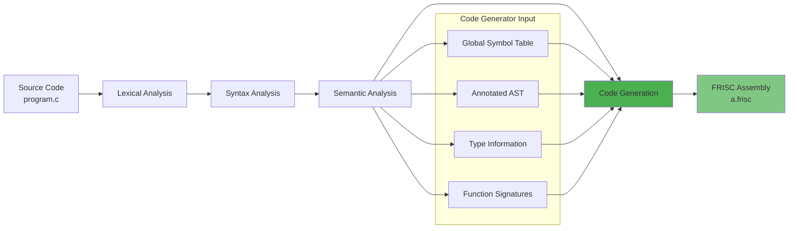
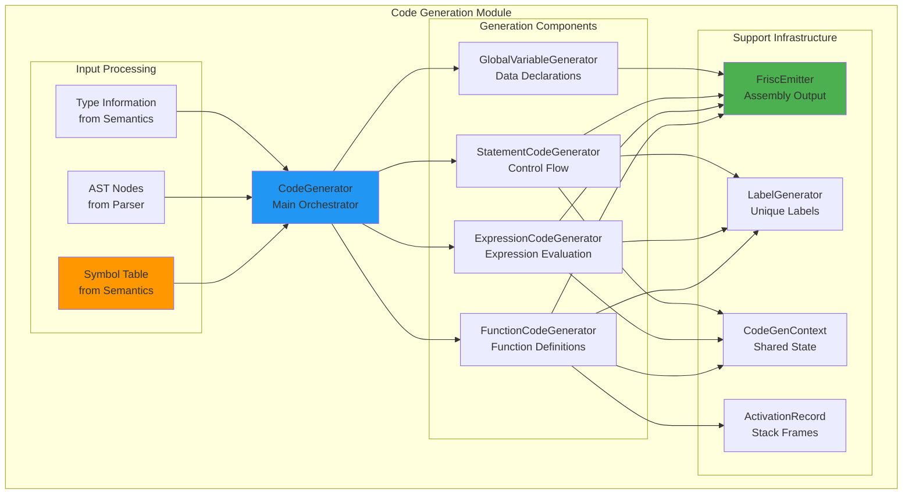
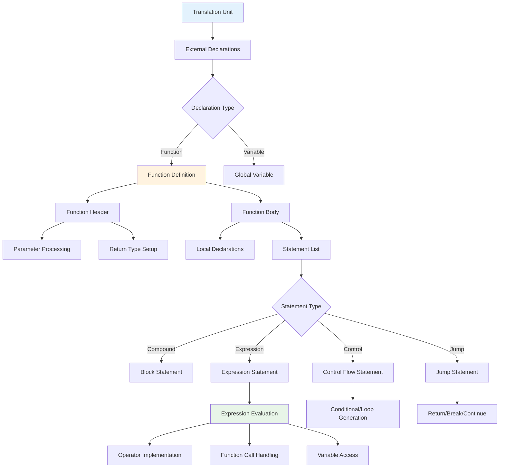

# Code Generation Overview

The code generation phase represents the final stage of the PPJ compiler pipeline, transforming semantically validated abstract syntax trees into executable FRISC assembly code. This phase bridges the gap between high-level language constructs and low-level machine instructions, implementing the runtime semantics of the PPJ-C language.

## Table of Contents

- [Compilation Pipeline Integration](#compilation-pipeline-integration)
- [Design Philosophy](#design-philosophy)
- [Architecture Overview](#architecture-overview)
- [Code Generation Strategy](#code-generation-strategy)
- [Runtime Model](#runtime-model)
- [Memory Organization](#memory-organization)
- [Function Calling Convention](#function-calling-convention)
- [Expression Evaluation](#expression-evaluation)
- [Control Flow Implementation](#control-flow-implementation)
- [Error Handling and Diagnostics](#error-handling-and-diagnostics)
- [Output Format](#output-format)

## Compilation Pipeline Integration

The code generator operates as the final phase in the compilation pipeline, receiving validated semantic information and producing executable assembly code:



### Input Contract

The code generator receives the following validated inputs from semantic analysis:

**Global Symbol Table**: Complete symbol information including:
- Function declarations and definitions with parameter lists
- Global variable declarations with types and initialization
- Scope hierarchy with proper symbol resolution

**Annotated Abstract Syntax Tree**: Semantic tree with type annotations:
- Expression nodes annotated with result types
- L-value/R-value classifications for expressions
- Resolved identifier references to symbol table entries
- Validated control flow structures

**Type System Information**: Complete type information including:
- Primitive types (void, char, int) with size information
- Composite types (arrays, functions) with element/parameter types
- Const-qualified types with immutability constraints
- Type compatibility and conversion rules

### Output Contract

The code generator produces:

**FRISC Assembly Code**: Human-readable assembly file containing:
- Complete program with entry point and initialization
- Function definitions with proper calling conventions
- Global variable declarations and initialization
- Comprehensive comments for debugging and understanding

**Execution Semantics**: Generated code implements:
- Correct PPJ-C language semantics for all constructs
- Proper memory management and stack discipline
- Standard function calling conventions
- Exception-free execution for semantically valid programs

## Design Philosophy

### Code Quality Principles

The code generator is designed with the following quality principles:

**Correctness First**: Generated code must correctly implement PPJ-C semantics
- All language constructs produce semantically correct behavior
- Type conversions and operations follow specification exactly
- Control flow structures maintain proper execution order
- Memory access patterns respect language safety guarantees

**Human Readability**: Assembly output should be understandable and debuggable
- Comprehensive comments explaining code sections
- Meaningful label names following consistent conventions
- Clear separation between program sections
- Structured formatting for easy reading

**Maintainable Architecture**: Code generator implementation should be extensible
- Modular design with clear separation of concerns
- Visitor pattern for systematic AST traversal
- Strategy pattern for different code generation rules
- Clean interfaces between generation phases

**Educational Value**: Implementation should demonstrate compiler principles
- Clear mapping between language constructs and assembly code
- Explicit implementation of runtime concepts
- Well-documented algorithms and data structures
- Traceable connection between source and generated code

### Implementation Constraints

**No External Dependencies**: Code generation uses only standard Java libraries
- Manual instruction generation without assembly frameworks
- Direct file I/O for output generation
- Custom data structures for code generation state

**Canonical Implementations**: Standard algorithms and techniques
- Stack-based expression evaluation
- Activation record management for function calls
- Standard register allocation strategies
- Conventional assembly code organization

## Architecture Overview

### Module Structure

The code generation module is organized into specialized components:



### Component Responsibilities

**CodeGenerator**: Main orchestration and program structure
- Coordinates overall code generation process
- Manages program initialization and termination
- Integrates function and global variable generation
- Handles output file management and error reporting

**FunctionCodeGenerator**: Function definition and management
- Generates function prologs and epilogs
- Manages local variable allocation and stack frames
- Handles parameter passing and return value management
- Coordinates function body code generation

**ExpressionCodeGenerator**: Expression evaluation and computation
- Implements expression evaluation strategies
- Handles type conversions and operator semantics
- Manages temporary value storage and register usage
- Implements short-circuit evaluation for logical operators

**StatementCodeGenerator**: Control flow and statement execution
- Generates code for conditional statements (if/else)
- Implements loop constructs (while, for) with proper control flow
- Handles jump statements (break, continue, return)
- Manages compound statements and block scoping

**GlobalVariableGenerator**: Global data management
- Generates global variable declarations and initialization
- Manages constant data and string literals
- Handles memory layout and alignment requirements
- Coordinates with symbol table for variable placement

### Support Infrastructure

**FriscEmitter**: Assembly code output management
- Formats and writes FRISC assembly instructions
- Manages code comments and documentation
- Handles label generation and placement
- Ensures proper assembly syntax and formatting

**LabelGenerator**: Unique identifier generation
- Generates unique labels for functions, variables, and control flow
- Maintains consistent naming conventions
- Prevents label conflicts and ensures uniqueness
- Supports different label types (functions, loops, conditionals)

**CodeGenContext**: Shared state management
- Maintains current generation context and scope information
- Provides access to symbol tables and type information
- Manages activation records and stack frame information
- Coordinates between different generation components

**ActivationRecord**: Function stack frame management
- Tracks local variable offsets and stack layout
- Manages parameter locations and calling conventions
- Handles stack space allocation and deallocation
- Supports nested function calls and recursion

## Code Generation Strategy

### AST Traversal Pattern

The code generator uses a systematic visitor pattern to traverse the annotated AST:



### Generation Phases

Code generation proceeds through distinct phases:

**Phase 1: Program Structure Setup**
```assembly
; Generated program header
        MOVE 40000, R7          ; Initialize stack pointer
        CALL F_MAIN             ; Call main function
        HALT                    ; Program termination
```

**Phase 2: Function Code Generation**
- Process each function definition in dependency order
- Generate function labels and entry points
- Implement function prologs with stack frame setup
- Generate function body code with proper scoping
- Implement function epilogs with cleanup and return

**Phase 3: Global Data Generation**
- Process global variable declarations
- Generate initialized data sections
- Handle constant data and string literals
- Ensure proper memory layout and alignment

**Phase 4: Code Optimization and Cleanup**
- Optimize register usage and instruction sequences
- Eliminate redundant operations where possible
- Ensure proper code formatting and documentation
- Validate generated code for correctness

## Runtime Model

### Memory Layout

The generated code assumes a specific memory layout:

```
High Memory (0xFFFFFFFF)
┌─────────────────────────┐
│    I/O Devices          │ ← Memory-mapped peripherals
├─────────────────────────┤ 0x40000000
│    Stack (grows down)   │ ← Function calls, local variables
│         ↓               │
├─────────────────────────┤ 0x40000 (SP initialization)
│    Unused Space         │
├─────────────────────────┤
│    Heap (unused)        │ ← Available for dynamic allocation
├─────────────────────────┤
│    Global Variables     │ ← Initialized and uninitialized data
├─────────────────────────┤
│    Program Code         │ ← Instructions and function definitions
├─────────────────────────┤ 0x0000
│    Interrupt Vectors    │ ← System initialization
└─────────────────────────┘ Low Memory (0x00000000)
```

### Register Usage Conventions

**General Purpose Registers**:
- **R0-R5**: General computation and temporary storage
- **R6**: Function return values (by convention)
- **R7**: Stack pointer (SP) - managed automatically

**Register Allocation Strategy**:
- **Expression Evaluation**: Use R0 as primary accumulator
- **Binary Operations**: Use R0 (left), R1 (right), result in R0
- **Function Calls**: Arguments passed via stack, result in R6
- **Local Variables**: Stored on stack, accessed via R7 offsets

### Stack Frame Layout

Each function call creates a stack frame with the following layout:

```
Higher Addresses
┌─────────────────────────┐ ← R7 + offset
│    Parameter N          │ ← Function arguments
│    Parameter N-1        │
│    ...                  │
│    Parameter 1          │
├─────────────────────────┤
│    Return Address       │ ← Saved by CALL instruction
├─────────────────────────┤ ← R7 (current SP)
│    Local Variable 1     │ ← R7 - 4
│    Local Variable 2     │ ← R7 - 8
│    ...                  │
│    Local Variable N     │ ← R7 - (4*N)
└─────────────────────────┘ Lower Addresses
```

## Memory Organization

### Program Structure

Generated FRISC programs follow a standard organization:

```assembly
; ============================================================================
; Program Entry Point
; ============================================================================
        MOVE 40000, R7          ; Initialize stack pointer to 0x40000
        CALL F_MAIN             ; Call main function
        HALT                    ; End program execution, R6 contains exit code

; ============================================================================
; Function Definitions
; ============================================================================
F_MAIN:                         ; Main function entry point
        ; Function prolog
        SUB R7, local_size, R7  ; Allocate space for local variables
        
        ; Function body
        ; ... generated code for function statements ...
        
        ; Function epilog
        MOVE return_value, R6   ; Set return value
        ADD R7, local_size, R7  ; Deallocate local variables
        RET                     ; Return to caller

F_OTHER_FUNCTION:               ; Other function definitions
        ; ... similar structure ...

; ============================================================================
; Global Variables
; ============================================================================
G_GLOBAL_VAR    DW %D 0         ; Global integer variable
G_ARRAY_VAR     DW %D 1, 2, 3   ; Global array initialization
G_CONST_VAR     DW %D 42        ; Global constant
```

### Label Naming Conventions

**Function Labels**: `F_<FUNCTION_NAME>`
- `F_MAIN` for main function
- `F_FACTORIAL` for factorial function
- `F_HELPER` for helper functions

**Global Variable Labels**: `G_<VARIABLE_NAME>`
- `G_COUNTER` for global counter variable
- `G_ARRAY` for global array variables
- `G_BUFFER` for global buffer storage

**Control Flow Labels**: `L_<TYPE>_<NUMBER>`
- `L_IF_1`, `L_ELSE_1`, `L_END_1` for conditional statements
- `L_LOOP_START_1`, `L_LOOP_END_1` for loop constructs
- `L_SC_1` for short-circuit evaluation points

## Function Calling Convention

### Parameter Passing

The code generator implements a stack-based parameter passing convention:

**Caller Responsibilities**:
1. Evaluate arguments in left-to-right order
2. Push arguments onto stack in reverse order (right-to-left)
3. Execute CALL instruction to transfer control
4. Clean up stack after function return (caller-cleans-stack)

**Callee Responsibilities**:
1. Access parameters via stack offsets from R7
2. Allocate space for local variables
3. Preserve any registers that will be modified
4. Place return value in R6 before returning
5. Restore preserved registers and return via RET

### Function Call Example

**Source Code**:
```c
int add(int a, int b) {
    return a + b;
}

int main(void) {
    int result = add(5, 3);
    return result;
}
```

**Generated Assembly**:
```assembly
F_MAIN:
        SUB R7, 4, R7           ; Allocate space for 'result'
        
        ; Call add(5, 3)
        MOVE 5, R0              ; Load first argument
        PUSH R0                 ; Push first argument
        MOVE 3, R0              ; Load second argument  
        PUSH R0                 ; Push second argument
        CALL F_ADD              ; Call function
        ADD R7, 8, R7           ; Clean up arguments (2 * 4 bytes)
        
        ; Store result
        STORE R6, (R7+0)        ; Store return value to 'result'
        
        ; Return result
        LOAD R6, (R7+0)         ; Load 'result' as return value
        ADD R7, 4, R7           ; Deallocate local variables
        RET

F_ADD:
        ; Access parameters: a at (R7+4), b at (R7+8)
        LOAD R0, (R7+4)         ; Load parameter 'a'
        LOAD R1, (R7+8)         ; Load parameter 'b'
        ADD R0, R1, R6          ; Compute a + b, result in R6
        RET                     ; Return to caller
```

## Expression Evaluation

### Evaluation Strategy

The code generator uses a stack-based evaluation strategy for expressions:

**Simple Expressions**: Direct register allocation
```c
x + y    // Load x to R0, load y to R1, ADD R0, R1, R0
```

**Complex Expressions**: Stack-based temporary storage
```c
(a + b) * (c - d)    // Evaluate subexpressions, use stack for intermediates
```

**Short-Circuit Evaluation**: Conditional jumps for logical operators
```c
a && b    // Evaluate a, jump to false if zero, evaluate b
a || b    // Evaluate a, jump to true if non-zero, evaluate b
```

### Operator Implementation

**Arithmetic Operators**:
```assembly
; Addition: left + right
LOAD R0, left_operand
LOAD R1, right_operand  
ADD R0, R1, R0          ; Result in R0

; Subtraction: left - right
LOAD R0, left_operand
LOAD R1, right_operand
SUB R0, R1, R0          ; Result in R0
```

**Comparison Operators**:
```assembly
; Less than: left < right
LOAD R0, left_operand
LOAD R1, right_operand
CMP R0, R1              ; Set flags based on comparison
JP_SLT L_TRUE_1         ; Jump if signed less than
MOVE 0, R0              ; False result
JP L_END_1
L_TRUE_1:
MOVE 1, R0              ; True result
L_END_1:
```

**Assignment Operators**:
```assembly
; Assignment: variable = expression
; Evaluate right-hand side
LOAD R0, rhs_value      ; or complex expression evaluation
; Store to left-hand side
STORE R0, variable_address
```

## Control Flow Implementation

### Conditional Statements

**If Statement**:
```c
if (condition) {
    then_statement;
}
```

**Generated Code**:
```assembly
        ; Evaluate condition
        ; ... condition evaluation code ...
        CMP R0, 0               ; Test condition result
        JP_EQ L_END_1           ; Jump to end if false
        
        ; Then block
        ; ... then statement code ...
        
L_END_1:                        ; End of if statement
```

**If-Else Statement**:
```c
if (condition) {
    then_statement;
} else {
    else_statement;
}
```

**Generated Code**:
```assembly
        ; Evaluate condition
        ; ... condition evaluation code ...
        CMP R0, 0               ; Test condition result
        JP_EQ L_ELSE_1          ; Jump to else if false
        
        ; Then block
        ; ... then statement code ...
        JP L_END_1              ; Jump over else block
        
L_ELSE_1:                       ; Else block
        ; ... else statement code ...
        
L_END_1:                        ; End of if-else statement
```

### Loop Constructs

**While Loop**:
```c
while (condition) {
    body_statement;
}
```

**Generated Code**:
```assembly
L_LOOP_START_1:                 ; Loop entry point
        ; Evaluate condition
        ; ... condition evaluation code ...
        CMP R0, 0               ; Test condition result
        JP_EQ L_LOOP_END_1      ; Exit loop if false
        
        ; Loop body
        ; ... body statement code ...
        
        JP L_LOOP_START_1       ; Jump back to condition test
        
L_LOOP_END_1:                   ; Loop exit point
```

**For Loop**:
```c
for (init; condition; update) {
    body_statement;
}
```

**Generated Code**:
```assembly
        ; Initialization
        ; ... init statement code ...
        
L_LOOP_START_1:                 ; Loop condition test
        ; Evaluate condition
        ; ... condition evaluation code ...
        CMP R0, 0               ; Test condition result
        JP_EQ L_LOOP_END_1      ; Exit loop if false
        
        ; Loop body
        ; ... body statement code ...
        
L_LOOP_CONTINUE_1:              ; Continue target
        ; Update expression
        ; ... update statement code ...
        
        JP L_LOOP_START_1       ; Jump back to condition test
        
L_LOOP_END_1:                   ; Loop exit point
```

### Jump Statements

**Return Statement**:
```c
return expression;
```

**Generated Code**:
```assembly
        ; Evaluate return expression
        ; ... expression evaluation code ...
        MOVE R0, R6             ; Move result to return register
        ADD R7, local_size, R7  ; Deallocate local variables
        RET                     ; Return to caller
```

**Break Statement** (within loop):
```assembly
        JP L_LOOP_END_1         ; Jump to loop exit
```

**Continue Statement** (within loop):
```assembly
        JP L_LOOP_CONTINUE_1    ; Jump to loop update/condition
```

## Error Handling and Diagnostics

### Code Generation Errors

The code generator handles several categories of errors:

**Internal Errors**: Programming errors in the generator itself
- Assertion failures for impossible semantic states
- Null pointer exceptions for missing symbol information
- Stack overflow from excessive recursion

**Resource Errors**: System-level failures during generation
- File I/O errors when writing assembly output
- Memory allocation failures for large programs
- Disk space exhaustion during output generation

**Semantic Inconsistencies**: Unexpected semantic analysis results
- Missing symbol table entries for declared identifiers
- Type information inconsistencies between phases
- Malformed AST structures from parser/semantic phases

### Error Reporting Strategy

**Fail-Fast Principle**: Stop generation immediately on first error
- Prevents cascading errors from invalid intermediate state
- Ensures clean error messages without confusion
- Maintains code generator invariants and assumptions

**Detailed Error Messages**: Provide comprehensive diagnostic information
- Source location information when available
- Context about what operation was being performed
- Suggested fixes or workarounds when applicable

**Clean Termination**: Ensure proper cleanup on error conditions
- Close output files and clean up temporary resources
- Reset generator state for potential retry operations
- Report error status to calling compilation infrastructure

### Diagnostic Output

**Progress Reporting**: Inform user of generation progress
```
Code generation started...
Processing function 'main'...
Processing function 'factorial'...
Generating global variables...
Code generation completed successfully.
```

**Warning Messages**: Report potential issues without stopping generation
```
Warning: Large stack frame (256 bytes) in function 'process_array'
Warning: Unused local variable 'temp' in function 'calculate'
```

**Error Messages**: Report fatal errors that prevent code generation
```
Error: Cannot generate code for undefined function 'missing_function'
Error: Failed to write output file 'a.frisc': Permission denied
Error: Internal error: Invalid expression type in binary operator
```

## Output Format

### Assembly File Structure

The generated assembly file follows a consistent structure:

```assembly
; ============================================================================
; PPJ Compiler - Generated FRISC Assembly Code
; Source: program.c
; Generated: 2024-11-26 16:30:45
; ============================================================================

; Program entry point and initialization
        MOVE 40000, R7          ; Initialize stack pointer
        CALL F_MAIN             ; Call main function  
        HALT                    ; End program, R6 holds exit code

; ============================================================================
; Function Definitions
; ============================================================================

F_MAIN:                         ; Function: int main(void)
        ; Allocate local variables (8 bytes)
        SUB R7, 8, R7           ; Local: int x, y
        
        ; Function body
        MOVE 10, R0             ; Load constant 10
        STORE R0, (R7+0)        ; x = 10
        MOVE 20, R0             ; Load constant 20  
        STORE R0, (R7+4)        ; y = 20
        
        ; Return statement
        LOAD R0, (R7+0)         ; Load x
        LOAD R1, (R7+4)         ; Load y
        ADD R0, R1, R6          ; return x + y
        
        ; Deallocate local variables
        ADD R7, 8, R7           ; Restore stack pointer
        RET                     ; Return to caller

; ============================================================================
; Global Variables  
; ============================================================================

G_COUNTER       DW %D 0         ; int counter = 0
G_MESSAGE       DW %D 72, 101, 108, 108, 111, 0  ; "Hello"
```

### Comment Conventions

**Section Headers**: Major program sections
```assembly
; ============================================================================
; Function Definitions
; ============================================================================
```

**Function Documentation**: Function signatures and purpose
```assembly
F_FACTORIAL:                    ; Function: int factorial(int n)
```

**Instruction Comments**: Explain complex or non-obvious operations
```assembly
        SUB R7, 12, R7          ; Allocate locals: int result, temp, i
        LOAD R0, (R7+16)        ; Load parameter 'n' from stack
        CMP R0, 1               ; Compare n with 1 for base case
```

**Control Flow Comments**: Explain jumps and branches
```assembly
        JP_LE L_BASE_CASE_1     ; Jump to base case if n <= 1
        JP L_LOOP_START_1       ; Jump to loop condition test
L_END_1:                        ; End of if statement
```

### Code Formatting Standards

**Indentation**: Consistent spacing for readability
- Instructions indented 8 spaces from left margin
- Comments aligned at column 40 when possible
- Labels at left margin with no indentation

**Label Formatting**: Clear and consistent label naming
- Function labels: `F_<NAME>` in uppercase
- Global variables: `G_<NAME>` in uppercase  
- Control flow: `L_<TYPE>_<NUMBER>` with descriptive type

**Instruction Formatting**: Readable instruction layout
- Mnemonic, operands, and comments clearly separated
- Consistent operand spacing and alignment
- Register names and constants clearly distinguished

This comprehensive overview provides the foundation for understanding how the PPJ compiler transforms high-level C constructs into executable FRISC assembly code, maintaining correctness, readability, and educational value throughout the process.

