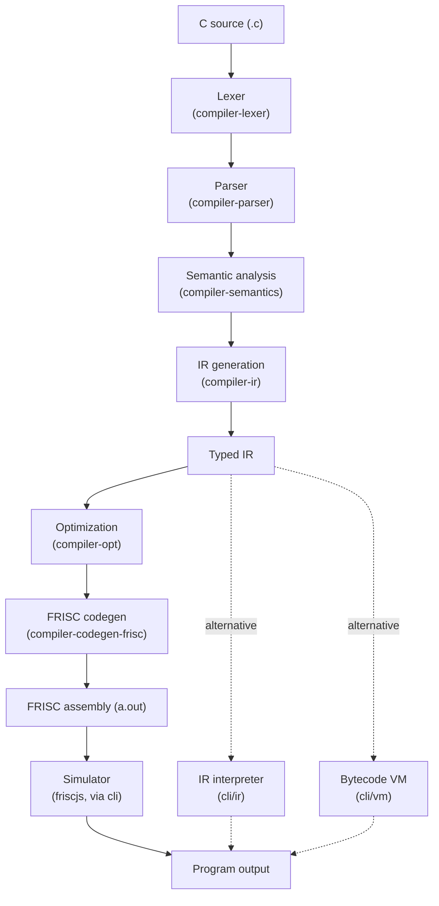

# Overview

FRISCcc is a complete compiler for a deterministic subset of C. It lowers source
programs to **FRISC** assembly (the educational RISC instruction set used at the
University of Zagreb) through a fully typed intermediate representation, and can
additionally execute that IR directly on a tree-walking interpreter and a
bytecode virtual machine. Every phase is implemented as a separate Maven module.

## The pipeline

A program flows through seven compilation phases to native FRISC assembly, with
two alternative execution paths branching off the typed IR:

Each phase consumes the artifact of the previous one and produces a
well-defined output. The typed IR is the central interface: the front end
(lexer, parser, semantics, IR generation) produces it, and three independent
back ends (FRISC code generation, the interpreter, and the VM) consume it.

## Phases at a glance

| Phase | Module | Input → Output | Reference |
|-------|--------|----------------|-----------|
| Lexical analysis | `compiler-lexer` | characters → tokens | [lexer](pipeline/lexer.md) |
| Syntax analysis | `compiler-parser` | tokens → parse tree / AST | [parser](pipeline/parser.md) |
| Semantic analysis | `compiler-semantics` | AST → typed semantic tree | [semantics](pipeline/semantics.md) |
| IR generation | `compiler-ir` | semantic tree → typed IR | [ir](pipeline/ir.md) |
| Optimization | `compiler-opt` | IR → optimized IR | [optimization](pipeline/optimization.md) |
| Code generation | `compiler-codegen-frisc` | IR → FRISC assembly | [codegen](pipeline/codegen.md) |
| Execution (native) | `cli` + `friscjs` | assembly → output | [simulator](reference/simulator.md) |
| Execution (IR) | `cli/ir`, `cli/vm` | IR → output | [interpreter & VM](pipeline/interpreter-vm.md) |

## The typed IR as the backbone

The intermediate representation carries an explicit type on every value and
operation, makes control flow explicit through basic blocks (`br`, `jmp`,
`ret`), and records frame and slot metadata so the back-end ABI is stable. This
is what makes three interchangeable back ends possible: all of them — the FRISC
code generator, the [IR interpreter, and the bytecode VM](pipeline/interpreter-vm.md) —
agree on the result of every program, an equivalence enforced by the test suite.

## What the compiler accepts

A constrained, deterministic subset of C: scalar types (`int`, `char`,
`float`), arrays, selected `struct` usage, the `if`/`else`, `while`, `for`, and
`return` control-flow constructs, functions with locals/globals and recursion,
and self-contained programs with no standard-library dependence. Arithmetic the
FRISC ISA lacks in hardware — 32-bit integer multiply/divide/modulo and
floating point — is lowered to [software helper routines](pipeline/runtime-abi.md).

## Where to go next

- To build and run the compiler, see [Build & run](build-and-run.md).
- For the module layout and dependencies, see [Architecture](architecture.md).
- For a specific phase, follow the table above into `pipeline/`.
