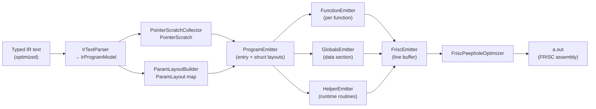
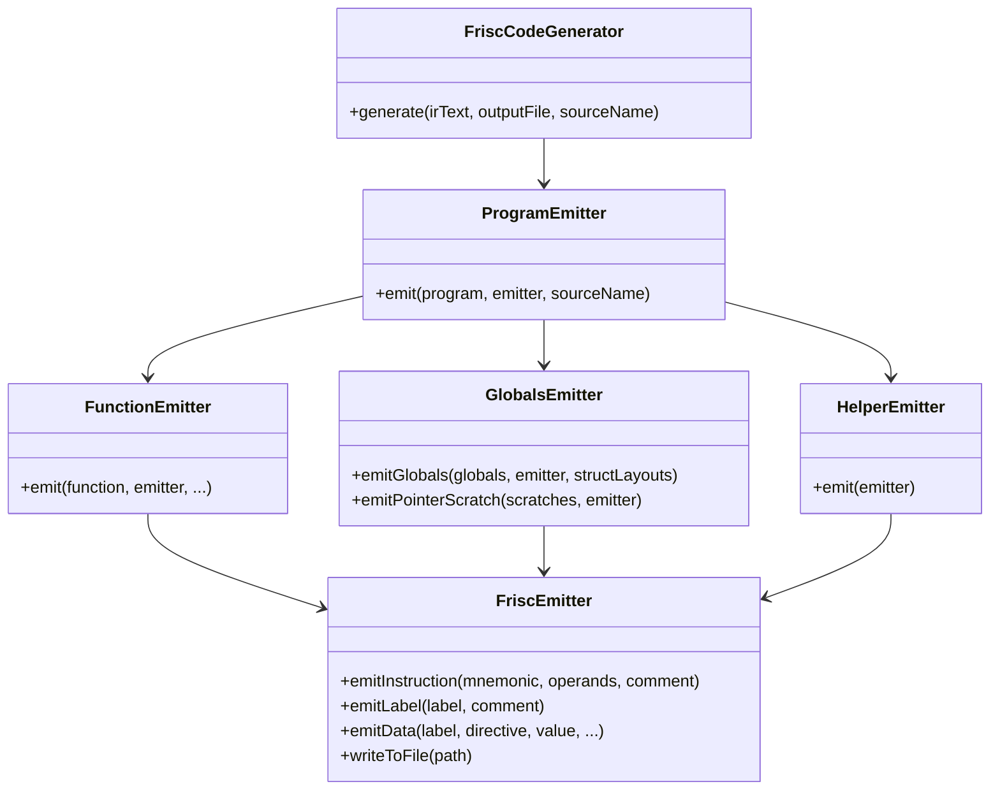

# FRISC Code Generation

Translates optimized typed IR text into FRISC assembly. The entry point is
`FriscCodeGenerator` (`compiler-codegen-frisc`, package
`hr.fer.ppj.codegen.frisc`); calling `generate(irText, outputFile, sourceName)`
parses the IR, drives all emission sub-components, runs the peephole optimizer,
and writes the result to `compiler-bin/a.out` (or a caller-specified path).

---

## Pipeline overview



---

## Component overview



---

## Invocation

```bash
./run.sh --frisc <program>          # compile to compiler-bin/a.out
./run.sh --O1 --frisc <program>     # with optimizer enabled
./run.sh --dump-ir <program>        # emit pre/post-opt IR alongside assembly
./run.sh --all --run <program>      # full pipeline + FRISC simulator
```

`FriscCodeGenerator.generate` is also called directly by the CLI's
`PipelineRunner` (`cli/src/main/java/hr/fer/ppj/cli/pipeline/PipelineRunner.java`).

---

## IR parsing

`IrTextParser` (`ir/IrTextParser.java`) is the public entry point; it delegates to
`IrProgramParser`, which orchestrates a family of composable sub-parsers:

| Sub-parser | Responsibility |
|---|---|
| `IrProgramParser` | Top-level `.program` / `.endprogram` envelope |
| `IrStructParser` | Struct definitions (`struct` blocks) |
| `IrGlobalsParser` | Global variable declarations |
| `IrFunctionParser` | Function headers, slot tables, `locals_bytes` |
| `IrBlockParser` | Basic block boundaries and labels |
| `IrInstructionParser` | `assign`, `store`, `call` instructions |
| `IrRhsParser` | RHS forms: `binop`, `cmpop`, `load`, `addr_of_symbol`, `addr_index`, `addr_field`, `cast`, `const` |
| `IrValueParser` | Temporaries (`t0`, `t1`, …) and inline constants |
| `IrLineCursor` | Line-oriented cursor with peek/advance |

The result is an `IrProgramModel` record (`ir/IrProgramModel.java`), a
hierarchical value type: `IrProgramModel` → `Function` → `Block` →
`Instruction`/`Terminator`. All IR instruction and RHS variants are represented
as sealed-interface subtypes (`Assign`, `Store`, `VoidCall`; `BinOp`, `CmpOp`,
`Load`, `Call`, `AddrOfSymbol`, `AddrIndex`, `AddrField`, `UnaryOp`, `CastOp`,
`ConstRhs`).

---

## Pre-emission analysis

Before any assembly is emitted, `ProgramEmitter` runs two whole-program analyses:

### PointerScratchCollector

`analysis/PointerScratchCollector.java` identifies pointer-typed local slots that
are never reassigned after their initial `addr_of_symbol` binding. For each such
slot, it allocates a labeled static scratch buffer in the global data section
(`G_SCRATCH_<FUNCNAME>_<LOCALNAME>`). The function prologue then loads the
scratch label into the local slot rather than pointing it into an arbitrary stack
location. This avoids the need for the function to allocate heap memory for
simple pointer locals.

The result is a `PointerScratch` record containing a per-function map of
`localName → scratchLabel` and a flat list of `Scratch` descriptors (label,
size, alignment) for `GlobalsEmitter.emitPointerScratch`.

### ParamLayoutBuilder

`frame/ParamLayoutBuilder.java` builds a `Map<String, ParamLayout>` from the slot
table in each function's IR. Each `ParamLayout` holds an ordered list of
`ParamInfo(type, offset)` and the total parameter-area size in bytes. `CallLowerer`
uses the layout to emit stack-based argument passing with correct per-parameter
offsets and aggregate copy semantics.

### TempAnalyzer

`analysis/TempAnalyzer.java` runs per-function and combines two sub-analyses:

- **`TempUsageAnalyzer`**: single-pass scan to find `maxTempIndex` (number of
  IR temporaries), `maxCallArgs` (maximum argument count across all call sites),
  and a `Map<Integer, IrType>` of each temporary's type. These three values
  directly determine frame size.
- **`AddrIndexAnalyzer`**: dataflow-style analysis that identifies
  `addr_index` temporaries used as store/load addresses with non-statically-bounded
  indices. These are recorded in a `Set<Integer>` (`addrIndexNeedsCheck`) so that
  `AddressLowerer` emits a bounds-check call (`L_BOUNDS_ERROR`) before the
  index-scaled address computation. Static constant-index accesses that are
  provably within array bounds are exempted.

---

## Register assignment and ABI

| Register | Role | Saved by |
|---|---|---|
| R0 | Primary expression result; accumulator for all RHS evaluation | Caller |
| R1 | Secondary operand (binary ops, call helpers) | Caller |
| R2–R4 | Scratch (scale loops, helper internals) | Caller |
| R5 | Frame pointer (FP) | **Callee** |
| R6 | Function return value | Caller |
| R7 | Stack pointer (SP); grows downward from `40000` | Managed structurally |

R5 is the only callee-saved register. The compiler never holds a live value in
any register across a `CALL`; all intermediates are spilled to frame temporaries
before calls are emitted.

For a complete ABI specification including struct argument layout, Q16.16 float
representation, and helper-routine calling conventions, see
[`../pipeline/runtime-abi.md`](runtime-abi.md).

---

## Function emission

`FunctionEmitter` (`FunctionEmitter.java`) emits one function at a time in three
phases: prologue, block body, epilogue.

### Frame size computation

`FunctionEmitter.emit` computes the frame size before emitting any instructions:

```
localsAreaSize  = alignTo(function.localsBytes() + 3, 4)   [if temps/args needed; else localsBytes() as-is]
tempAreaSize    = (maxTempIndex + 1) * 4
argScratchSize  = maxCallArgs * 4
frameSize       = alignTo(localsAreaSize + tempAreaSize + argScratchSize, 4)
```

The `+3` padding on `localsAreaSize` prevents byte stores into trailing `char`
locals from clobbering the first byte of the word-aligned temp area
(`LoweringSupport.alignTo`).

Frame offsets relative to FP (R5):

| Region | FP offset |
|---|---|
| Saved old FP | `+0` |
| Return address (pushed by `CALL`) | `+4` |
| Parameters (from caller) | `+8` upward |
| Local variables | `-4` downward (`localsAreaSize` bytes) |
| IR temporaries t_i | `-(localsAreaSize + 4*(i+1))` |
| Arg scratch slot j | `-(localsAreaSize + tempAreaSize + 4*(j+1))` |

`FunctionContext` (`lowering/FunctionContext.java`) pre-computes
`Map<Integer,Integer> tempOffsets` and `argOffsets` from these formulas and
passes them to all lowering sub-components.

### Prologue

```frisc
F_FUNCNAME                        ; Function label (LabelGenerator.functionLabel)
        PUSH R5                   ; Save caller's FP
        MOVE R7, R5               ; Establish new FP
        SUB R7, <frameSize>, R7   ; Allocate frame
        ; zero-initialize locals via a counted STORE loop
L_ZERO_n
        STORE R2, (R0)
        ADD R0, 4, R0
        SUB R1, 1, R1
        JP_NE L_ZERO_n
        ; (initialize pointer-scratch locals if any)
```

The zero-initialize loop runs `alignTo(localsAreaSize, 4) / 4` iterations. If
there are no locals the loop is omitted entirely. Pointer-scratch locals are
then initialized by loading each `G_SCRATCH_…` label into the corresponding
local slot.

### Epilogue

A single shared epilogue label `L_EXIT_F_<FUNCNAME>` is emitted after all blocks.
Every `ret` in the IR jumps to it:

```frisc
L_EXIT_F_FUNCNAME
        ADD R7, <frameSize>, R7   ; Deallocate frame
        POP R5                    ; Restore caller's FP
        RET                       ; Pop return address into PC
```

---

## Instruction selection (lowering)

`StatementLowerer` (`lowering/StatementLowerer.java`) is the per-instruction
dispatcher. After evaluating any RHS, the result is in R0; `FrameAccess.storeTemp`
then spills it to the temp slot.

Sub-lowerers:

| Class | Handles |
|---|---|
| `ExpressionLowerer` | Top-level RHS dispatch + `emitValue` |
| `BinaryLowerer` | `BinOp`: native ALU ops; `CALL F_MUL/F_DIV/F_MOD` for mul/div/mod |
| `CompareLowerer` | `CmpOp`: `CMP` + conditional branch to materialize 0/1 |
| `UnaryLowerer` | `UnaryOp` (NEG, NOT); cast ops (TRUNC/SEXT/ZEXT/PTRCAST/ITOF/FTOI) |
| `CallLowerer` | Argument evaluation into scratch, stack layout, `CALL`, result in R6→R0 |
| `AddressLowerer` | `AddrOfSymbol`, `AddrIndex` (with bounds check), `AddrField`, `memcpy` |
| `FrameAccess` | `LOAD`/`STORE` to/from temp slots and arg-scratch slots |
| `ImmediateEmitter` | 20-bit immediate check (`LoweringSupport.fitsSigned20`); multi-instruction encoding for values outside ±524287 via high/low split |

### Calling convention in emitted code

`CallLowerer` uses layout-based argument passing when a `ParamLayout` is
available (the common case for user-defined functions):

1. Evaluate each argument into R0, spill to arg-scratch slot in the caller's
   frame.
2. `SUB R7, totalBytes, R7` — allocate the full parameter area.
3. Load each arg from scratch, store at `R7 + param.offset()` (word: `STORE`;
   byte: `STOREB`; aggregate: inline memcpy via `AddressLowerer.emitMemCopy`).
4. `CALL F_FUNCNAME`.
5. `ADD R7, totalBytes, R7` — caller cleans the stack.
6. `MOVE R6, R0` — move return value to accumulator if non-void.

When a `ParamLayout` is unavailable, the fallback pushes arguments in
right-to-left order (`PUSH R0` per argument) and cleans by `argCount * 4`.

---

## Global variables emission

`GlobalsEmitter` (`GlobalsEmitter.java`) emits the entire data section after
all function bodies. It handles four cases:

| IR type | FRISC directive | Notes |
|---|---|---|
| Scalar `int32`/`bool`/`float`/pointer | `DW <value>` | 4 bytes; float stored as Q16.16 fixed-point via `LoweringSupport.floatToQ16_16` |
| Scalar `char` | `DB <value>` | 1 byte |
| Array of `char` | `DB v0, v1, …` | N bytes, no alignment padding |
| Array of word types | `DW v0, v1, …` | N × 4 bytes |
| Struct / uninitialized array | `` `DS <n> `` | n bytes reserved |

All labels are generated by `LabelGenerator.globalLabel` → `G_<NAME>`.
Uninitialized scalars emit `DW 0` or `DB 0`; struct initializers are not
supported and throw `CodeGenerationException`.

After globals, `GlobalsEmitter.emitPointerScratch` emits `` `DS <n> `` entries
for each scratch buffer identified by `PointerScratchCollector`, labeled
`G_SCRATCH_<FUNCNAME>_<LOCALNAME>`.

---

## Helper routines

`HelperEmitter` delegates to `HelperLibrary` (`helpers/HelperLibrary.java`),
which conditionally emits only the helpers marked as needed during function
emission. `FriscEmitter` carries eight boolean flags (`needsMul`, `needsDiv`,
`needsMod`, `needsFmul`, `needsFdiv`, `needsF2i`, `needsI2f`,
`needsBoundsCheck`); lowering sub-components call `emitter.markXxxNeeded()`
when the corresponding operation is encountered.

| Helper label | Source class | Purpose |
|---|---|---|
| `F_MUL` | `IntMathHelpers` | Software 32-bit signed multiply (shift-and-add) |
| `F_DIV` | `IntMathHelpers` | Software 32-bit signed divide (restoring) |
| `F_MOD` | `IntMathHelpers` | Software 32-bit signed modulo |
| `F_FMUL` | `FloatHelpers` | Q16.16 × Q16.16 multiply (64-bit accumulation via `ADC`) |
| `F_FDIV` | `FloatHelpers` | Q16.16 ÷ Q16.16 divide |
| `F_I2F` | `FloatHelpers` | `int32 → Q16.16` (shift left 16) |
| `F_F2I` | `FloatHelpers` | `Q16.16 → int32` (arithmetic shift right 16) |
| `L_BOUNDS_ERROR` | `BoundsHelper` | Array-bounds trap (jump target, not a CALL) |

All integer helper routines use their own stack frames (prologue/epilogue) and
read arguments from `FP+8`, `FP+12`. Return value is in R6. Details and
Q16.16 encoding are documented in [`../pipeline/runtime-abi.md`](runtime-abi.md).

---

## Label generation

`LabelGenerator` (`util/LabelGenerator.java`) produces all assembly labels. It
holds a single `AtomicInteger` counter for uniqueness within a compilation:

| Factory method | Label pattern | Example |
|---|---|---|
| `functionLabel(name)` | `F_<NAME>` | `F_MAIN`, `F_FIB` |
| `globalLabel(name)` | `G_<NAME>` | `G_COUNTER` |
| `blockLabel(func, block)` | `L_<FUNC>_<BLOCK>` | `L_MAIN_L0` |
| `newLabel(prefix)` | `<prefix>_<n>` | `L_CMP_TRUE_3`, `L_ZERO_7` |

All names are upper-cased via `Locale.ROOT`. Block labels are scoped to their
function, preventing collisions across functions with identically-named blocks.

---

## Peephole optimizer

`FriscPeepholeOptimizer` (`emitter/FriscPeepholeOptimizer.java`) runs as a
post-pass on the raw line buffer inside `FriscEmitter.outputLines()`. It iterates
to a fixpoint (repeat until no changes):

| Pattern | Action |
|---|---|
| `MOVE Rx, Rx` | Delete (self-move) |
| `ADD/SUB/OR/XOR/SHL/SHR Rx, 0, Rx` | Delete (identity operation) |
| `PUSH Rx` immediately followed by `POP Rx` | Delete both |
| `JP label` where `label` is the next non-blank line | Delete jump |

The optimizer works at the text level (parses mnemonic and operands from each
line string) and has no semantic model of the program; it cannot reorder
instructions or reason about liveness. It eliminates the most common artifacts
of the spill-everywhere evaluation strategy (notably, push/pop pairs around
address computations that were folded by constant propagation, and self-moves
introduced by `MOVE R6, R0` immediately followed by `MOVE R0, R6`).

---

## Representative FRISC output

The following snippet is from `examples/real_world/math_fibonacci_iter/a.frisc`
(compiled at O1). It shows the program entry, a function prologue, the loop body
with spill-based temporary handling, and a conditional branch:

```frisc
; Program entry point and initialization
        MOVE 40000, R7          ; Initialize stack pointer (SP)
        CALL F_MAIN             ; Call main
        HALT                    ; Program end

F_MAIN                          ; Function: main
        PUSH R5                 ; Save old FP
        MOVE R7, R5             ; Set FP
        SUB R7, 6C, R7          ; Allocate locals/temps
        MOVE 1B, R1             ; Zero words
        MOVE R7, R0             ; Zero ptr
        MOVE 0, R2              ; Zero
L_ZERO_2
        STORE R2, (R0)          ; Clear
        ADD R0, 4, R0
        SUB R1, 1, R1
        JP_NE L_ZERO_2
L_MAIN_L1
        ; ... load loop counter and compare ...
        LOAD R0, (R5-2C)        ; Load temp t5
        PUSH R0                 ; Save left
        LOAD R0, (R5-34)        ; Load temp t7
        MOVE R0, R1             ; Right
        POP R0                  ; Left
        CMP R0, R1
        JP_SLT L_CMP_TRUE_3
        MOVE 0, R0              ; False
        JP L_CMP_END_4
L_CMP_TRUE_3
        MOVE 1, R0              ; True
L_CMP_END_4
        STORE R0, (R5-38)       ; Store temp t8
        LOAD R0, (R5-38)        ; Load temp t8
        CMP R0, 0               ; Branch on condition
        JP_NE L_MAIN_L2
        JP L_MAIN_L4
```

---

## See also

- [`../pipeline/runtime-abi.md`](runtime-abi.md) — full ABI, helper-routine
  specification, Q16.16 encoding, parameter layout, `L_BOUNDS_ERROR` protocol
- [`../pipeline/ir.md`](ir.md) — typed IR format consumed by this module
- [`../reference/frisc-isa.md`](../reference/frisc-isa.md) — FRISC ISA
  instruction reference
