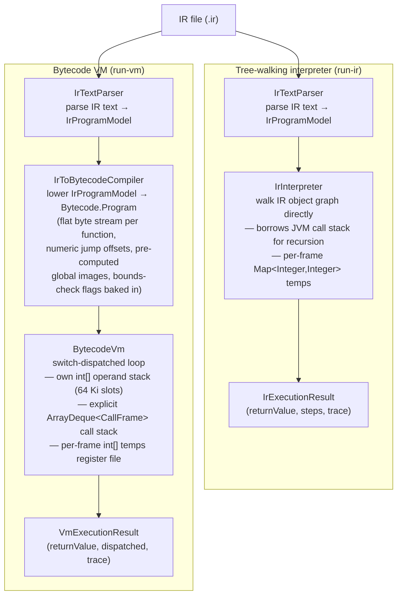
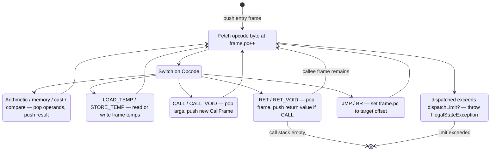

# IR Execution Back Ends: Tree-Walking Interpreter and Bytecode VM

FRISCcc ships two alternative execution back ends that run a compiled IR program directly, bypassing FRISC code generation and the JavaScript simulator. Both accept a `.ir` file, execute `main`, and return its integer result. They exist to allow IR-level testing and profiling without the overhead of the FRISC toolchain.

---

## Execution paths compared



The interpreter and VM are behaviorally identical: same arithmetic, same memory model (byte-addressable sparse map starting at `0x1000`), same Q16.16 fixed-point routines, same divide-by-zero convention (yields 0), same out-of-bounds trap code (-6). Their results are validated against each other by `BytecodeVmExecutionTest`.

---

## Tree-walking interpreter

**Source:** `cli/src/main/java/hr/fer/ppj/cli/ir/`

| Class | Role |
|---|---|
| `IrCommandRunner` | Parses the `.ir` file, constructs `IrInterpreter`, calls `executeMain()` |
| `IrInterpreter` | Evaluates the `IrProgramModel` object graph directly |
| `IrInterpreterOptions` | `stepLimit` (int), `trace` (boolean) |
| `IrExecutionResult` | `returnValue` (int), `steps` (int), `trace` (String) |

### How it evaluates

`IrInterpreter` walks the `IrProgramModel` produced by `IrTextParser`. Execution flows through `executeFunction`, which iterates over `IrProgramModel.Block` objects in order, dispatching each `Instruction` via `executeInstruction` and each `Terminator` at the end of each block.

Operand evaluation is recursive: `evaluateRhs` handles the full RHS variant set (`AddrOfSymbol`, `AddrIndex`, `AddrField`, `Load`, `BinOp`, `CmpOp`, `Call`, `UnaryOp`, `CastOp`, `ConstRhs`). Function calls recurse into `executeFunction` directly, placing each new activation on the **host JVM stack**.

Per-activation state lives in a `Frame` object:
- `Map<Integer, Integer> temps` — the IR temporary register file (indexed by `Temp.index()`)
- `Map<String, Integer> localAddresses` / `paramAddresses` — slot addresses in the sparse byte-addressable `Memory` heap
- `Map<Integer, IrType> tempTypes` — required for bounds-check type inference at runtime

The `Memory` inner class is a `HashMap<Integer,Integer>` of individual bytes. Words are stored and loaded as four consecutive little-endian bytes. Allocation starts at `0x1000` and advances linearly.

### Step accounting and watchdog

Every `Instruction` and every `Terminator` increments `steps` via `tick()`. If `steps > stepLimit`, `tick` throws `IllegalStateException`. The default limit is **2,000,000 steps** (`IrInterpreterOptions.DEFAULT_STEP_LIMIT`). Steps are also the unit reported in `IrExecutionResult.steps`.

### Bounds checking

`IrInterpreter` runs a per-function dataflow pass (`analyzeAddrIndexChecks`) before execution begins. It identifies which `addr_index` temporaries are used as load/store addresses (and propagates back through field/index chains). Only those temporaries get live bounds checks during evaluation via `evaluateAddrIndex`. An out-of-bounds index throws `TrapSignal(-6, ...)`, which is caught in `executeMain` and returned as the exit code.

### Arithmetic

- Integer binary ops: `ADD`, `SUB`, `MUL`, `DIV`, `MOD`, `AND`, `OR`, `XOR`, `SHL`, `SHR`
- Float (Q16.16): `ADD` and `SUB` are plain 32-bit integer addition/subtraction; `MUL` uses `q16Mul = (int)((long)a * b >> 16)`; `DIV` uses `q16Div = (int)(((long)a << 16) / b)`.
- Casts: `TRUNC`/`ZEXT` → `value & 0xFF`; `SEXT` → `(value << 24) >> 24`; `PTRCAST` → identity; `ITOF` → `value << 16`; `FTOI` → `value >> 16`.
- Float constants are converted to Q16.16 at load time via `Math.round(f * 65536.0f)`.

---

## Bytecode VM

**Source:** `cli/src/main/java/hr/fer/ppj/cli/vm/`

| Class | Role |
|---|---|
| `VmCommandRunner` | Parses `.ir`, invokes `IrToBytecodeCompiler`, then either runs `BytecodeVm` or disassembles |
| `IrToBytecodeCompiler` | Lowers `IrProgramModel` → `Bytecode.Program` |
| `Bytecode` | Data model: `Program`, `Function`, `SlotInfo`, `ParamBind`, `GlobalImage` |
| `Opcode` | Enum of all opcodes with `operandCount()` and `encodedSize()` |
| `BytecodeVm` | Switch-dispatched execution loop |
| `BytecodeDisassembler` | Renders `Bytecode.Program` as human-readable assembly text |
| `VmExecutionOptions` | `dispatchLimit` (long), `trace` (boolean) |
| `VmExecutionResult` | `returnValue` (int), `dispatched` (long), `trace` (String) |

### Encoding

Each instruction is one opcode byte (`Opcode.ordinal()`) followed by zero or more 4-byte little-endian integer operands. `Opcode.encodedSize()` returns `1 + 4 * operandCount()`. Jump targets and function references are stored as absolute byte offsets and function indices respectively; block-label → offset fixups are applied after the full function stream is emitted.

### Opcode set

All opcodes are defined in `Opcode.java`. Operand counts are in parentheses.

| Category | Opcodes |
|---|---|
| Stack / register file | `PUSH_CONST(1)`, `LOAD_TEMP(1)`, `STORE_TEMP(1)` |
| Address computation | `ADDR_SYM(1)`, `ADDR_FIELD(1)`, `ADDR_INDEX(1)`, `ADDR_INDEX_CHK(2)` |
| Memory | `LOAD_WORD(0)`, `LOAD_BYTE(0)`, `STORE_WORD(0)`, `STORE_BYTE(0)`, `MEMCPY(1)` |
| Integer arithmetic | `ADD(0)`, `SUB(0)`, `MUL(0)`, `DIV(0)`, `MOD(0)`, `AND(0)`, `OR(0)`, `XOR(0)`, `SHL(0)`, `SHR(0)` |
| Q16.16 fixed-point | `MUL_Q16(0)`, `DIV_Q16(0)` |
| Comparison | `CMP_EQ(0)`, `CMP_NE(0)`, `CMP_LT(0)`, `CMP_LE(0)`, `CMP_GT(0)`, `CMP_GE(0)` |
| Unary | `NEG(0)`, `NOT(0)` |
| Cast | `CAST_BYTE(0)`, `CAST_SEXT(0)`, `CAST_ITOF(0)`, `CAST_FTOI(0)` |
| Calls | `CALL(2)` (pushes return value), `CALL_VOID(2)` (discards return value) |
| Control flow | `JMP(1)`, `BR(2)`, `RET(0)`, `RET_VOID(0)` |

`ADDR_INDEX_CHK` carries both `elemSize` and `arraySize` as operands; the VM traps with code -6 if `index < 0 || index >= arraySize`.

`CALL` and `CALL_VOID` carry a function index and an argument count as operands. The `producesValue` flag on the callee's `CallFrame` controls whether `RET`/`RET_VOID` pushes the return value back onto the operand stack when returning.

### IR → bytecode lowering (`IrToBytecodeCompiler`)

`IrToBytecodeCompiler.compile()` iterates over every `IrProgramModel.Function` and calls `lowerFunction`. The lowering:

1. Builds a `defOf` map (temp index → defining RHS) for static type inference.
2. Runs the same `analyzeAddrIndexChecks` dataflow as `IrInterpreter` to determine which `addr_index` instructions need `ADDR_INDEX_CHK` vs. `ADDR_INDEX`.
3. Emits instructions into a `CodeBuffer` (a growable `byte[]`). Each IR instruction is lowered by `emitInstruction`; each terminator by `emitTerminator`. The three-address IR's named temporaries survive as a per-frame register file addressed by `LOAD_TEMP`/`STORE_TEMP` index; intermediate sub-expressions become pushes onto the operand stack.
4. Branch targets are first emitted as placeholder `0` operands and back-patched via a `Fixup` list once all block offsets are known.
5. Globals are pre-computed into flat `byte[]` images (`GlobalImage`) so the VM never touches the IR type system at runtime.
6. All type information (result types, struct field offsets, array sizes, slot sizes and alignments) is resolved once at lowering time and encoded as opcode operands. The running VM is typeless.

The `maxTemps` field per `Bytecode.Function` is the highest temporary index plus one; the VM allocates exactly that many `int` slots per frame.

### VM execution (`BytecodeVm`)

`BytecodeVm` runs a single `while(true)` dispatch loop in `run()`. It maintains:

- `int[] operandStack` (fixed-size, 65,536 slots) with `int sp` as the stack pointer
- `Deque<CallFrame> callStack` — each `CallFrame` holds a reference to its `Bytecode.Function`, a program counter `int pc`, and a `int[] temps` array of size `maxTemps`
- `long dispatched` — count of opcodes dispatched

On `CALL`/`CALL_VOID`, the dispatch loop pops arguments from the operand stack, constructs a `CallFrame` for the callee (allocating slot memory from `Memory`), binds arguments into parameter slots, and pushes the frame onto `callStack`. The loop then picks up the callee's code on the next iteration — no Java recursion. On `RET`/`RET_VOID`, `returnFrom` pops the callee frame; if `callStack` is now empty, the run exits; otherwise the loop resumes in the caller's frame.



### Dispatch-limit watchdog

After each opcode dispatch, `BytecodeVm` checks `dispatched > dispatchLimit`. The default limit is **16,000,000 dispatches** (`VmExecutionOptions.DEFAULT_DISPATCH_LIMIT`). This is higher than the interpreter's step limit because each IR instruction lowers to multiple bytecode opcodes. Exceeding the limit throws `IllegalStateException`.

### Disassembler (`BytecodeDisassembler`)

`BytecodeDisassembler.disassemble(Bytecode.Program)` produces assembly-style text. Each line is prefixed with its byte offset. Block labels are restored from the `blockLabels` side-table stored in each `Bytecode.Function`. Symbolic operands are printed by name rather than as raw indices:
- `LOAD_TEMP`/`STORE_TEMP` → `tN`
- `ADDR_SYM` → `local:name`, `param:name`, or `global:name`
- `CALL`/`CALL_VOID` → `functionName/argc`
- `JMP`/`BR` → block label strings or `@offset` fallback
- `PUSH_CONST` → `#value`

Example excerpt from `examples/real_world/math_fibonacci_iter/program.ir`:

```
; FRISCcc bytecode disassembly

.func main  (params=0, temps=22, code=369 bytes)
L0:
     0: ADDR_SYM      local:n
     5: STORE_TEMP    t0
    10: LOAD_TEMP     t0
    15: PUSH_CONST    #20
    20: STORE_WORD    
    21: ADDR_SYM      local:a
    26: STORE_TEMP    t1
    31: LOAD_TEMP     t1
    36: PUSH_CONST    #0
    41: STORE_WORD    
    42: ADDR_SYM      local:b
    47: STORE_TEMP    t2
```

---

## Differential-equivalence guarantee

`BytecodeVmExecutionTest` (`cli/src/test/java/hr/fer/ppj/cli/BytecodeVmExecutionTest.java`) validates both back ends against each other on the full `examples/real_world/` corpus.

**`matchesExpectedReturnValuesOnAnchorPrograms`** — runs the VM against four anchor programs and asserts fixed expected return values: `real_prime_sieve` → 46, `math_fibonacci_iter` → 6765, `real_checksum_crc` → 142, `real_bfs_shortest_path` → 14.

**`agreesWithInterpreterAcrossTheRealWorldSuite`** — walks the entire `examples/real_world/` tree, finds every `program.ir`, runs both back ends on the same `IrProgramModel`, and asserts `returnValue` equality. The interpreter runs with step limit 5,000,000; the VM with dispatch limit 50,000,000. Any disagreement indicates a bug in exactly one of the two back ends.

The test requires at least 20 IR files to be present in the corpus (the assertion `assertTrue(irFiles.size() >= 20, ...)`).

---

## Invocation and flags

Both subcommands are invoked via `run.sh` as positional subcommand names, not `--flags`.

### `run-ir`

```
./run.sh run-ir <file.ir> [options]
```

| Flag | Default | Description |
|---|---|---|
| `--trace-ir` | off | Emit a per-step trace line: `[N] funcName:blockLabel -> event` |
| `--ir-step-limit <n>` | 2,000,000 | Hard cap on steps (instructions + terminators counted). Watchdog aborts with exception if exceeded. |

Parsed by `ArgumentParser.parseRunIrCommand`. Dispatched via `IrCommandRunner.run(Path, IrInterpreterOptions)`.

### `run-vm`

```
./run.sh run-vm <file.ir> [options]
```

| Flag | Default | Description |
|---|---|---|
| `--trace-vm` | off | Emit a per-dispatch trace line: `[N] funcName@pc OPCODE [operands]   \| sp=S top=T` |
| `--dump-bytecode` | off | Disassemble the lowered bytecode to stdout via `VmCommandRunner.disassemble`; do not execute. Mutually exclusive with `--trace-vm` (disassembly exits before execution). |
| `--vm-dispatch-limit <n>` | 16,000,000 | Hard cap on total dispatched opcodes. Must be a positive `long`. |

Parsed by `ArgumentParser.parseRunVmCommand`. Dispatched via `VmCommandRunner.run(Path, VmExecutionOptions)` or `VmCommandRunner.disassemble(Path)`.

Both commands exit non-zero if execution fails (exception thrown during evaluation or limit exceeded).

---

## Return values and error codes

`IrExecutionResult.returnValue` / `VmExecutionResult.returnValue` hold the integer value returned by `main`. A trap (array out-of-bounds) returns code **-6** as the exit value rather than throwing out of the runner.

---

*See also:* [`ir.md`](ir.md) for the IR structure, [`../reference/ir-grammar.md`](../reference/ir-grammar.md) for the IR grammar, and [`../reference/cli.md`](../reference/cli.md) for the full CLI reference.
