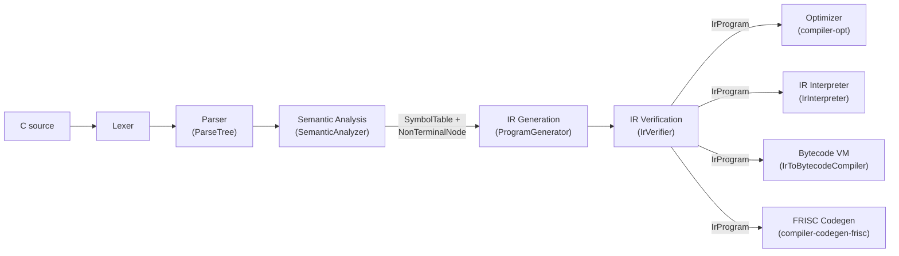
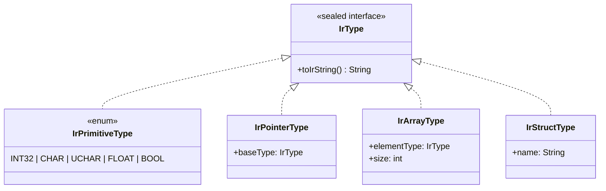
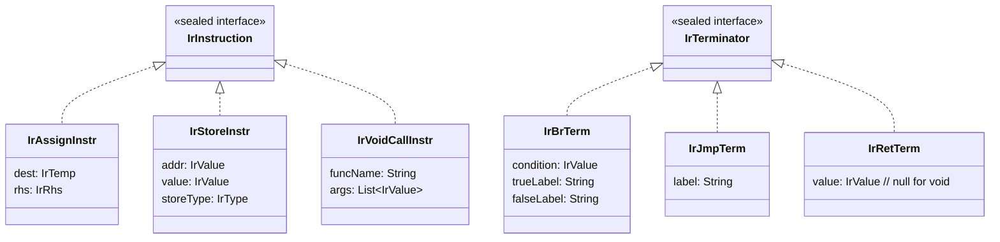

# Typed Intermediate Representation (IR)

The FRISCcc IR is a typed, three-address, basic-block-structured intermediate representation that sits between semantic analysis and all downstream consumers (optimizer, IR interpreter, bytecode compiler, FRISC code generator). It is defined formally in `config/ir_definition.txt` and implemented in the `compiler-ir` Maven module (`hr.fer.ppj.ir`).

---

## Pipeline position



The public entry point is `IrPipeline` (`hr.fer.ppj.ir.IrPipeline`). Its two primary static methods are:

```java
// From a pre-built semantic tree:
IrProgram program = IrPipeline.generate(globalScope, semanticTree);

// From a raw parse tree (runs semantic analysis internally):
IrProgram program = IrPipeline.generate(parseTree, reporter);
```

Both methods call `IrVerifier.verify(program)` before returning. Invalid IR is never silently produced; any failure throws `IrCompilationException`.

---

## Program structure

An IR program maps directly to the `Program` production in `config/ir_definition.txt`:

```
.program
  [.type struct Name { ... }]*
  [.globals
    global name : Type [= Const]
    ...
  ]
  [.func name(params) : RetType
    .frame locals=N bytes align=M
    .slots
      (param|local|spill) name@offset : Type
      ...
    .blocks
      Label:
        instructions...
        terminator
      ...
  .endfunc]*
.endprogram
```

The in-memory representation is the `IrProgram` record (`hr.fer.ppj.ir.model.IrProgram`):

```java
public record IrProgram(
    List<IrGlobalVar> globals,
    Map<String, IrStructDef> structDefs,
    List<IrFunction> functions)
```

Output ordering: struct type definitions first, then the `.globals` section, then function definitions. `IrProgram` is immutable after construction; the `IrProgram.Builder` is used during lowering.

### Global declarations

```
.globals
  global counter : int32 = #0:int32
  global buffer  : array<char,256>
  global root    : ptr<struct Node> = null:ptr<struct Node>
```

Each `IrGlobalVar` carries a name, `IrType`, and an optional `IrConst` initializer. Global addresses are resolved to labeled data regions during FRISC code generation; within the IR they are accessed via `addr_of_symbol global:name`.

### Struct type definitions

```
.type struct Point {
  x : int32 @0
  y : int32 @4
}
```

Each field has a name, an `IrType`, and an explicit byte offset computed during lowering by `StructLayoutRegistry` and `TypeAlignmentCalculator`. The offsets are embedded in the IR so downstream consumers need not recompute layout. `IrStructDef` is keyed by struct name in `IrProgram.structDefs`; `IrStructType` holds only the name.

---

## Type system

`IrType` is a sealed interface (`hr.fer.ppj.ir.types.IrType`) with four permitted implementations:



| IR type | Syntax | Size (bytes) | Notes |
|---|---|---|---|
| `INT32` | `int32` | 4 | Signed 32-bit two's complement |
| `CHAR` | `char` | 1 | Signed 8-bit |
| `UCHAR` | `uchar` | 1 | Unsigned 8-bit |
| `FLOAT` | `float` | 4 | Semantic float; Q16.16 in FRISC backend |
| `BOOL` | `bool` | 1 | Comparison result only; consumed by `br` |
| `IrPointerType` | `ptr<T>` | 4 | Typed pointer |
| `IrArrayType` | `array<T,N>` | N × sizeof(T) | Fixed-size, compile-time N |
| `IrStructType` | `struct Name` | Sum of fields | Nominal; layout in `.type` block |
| void | `void` | 0 | Function return type only |

All type conversions are explicit: `sext`, `zext`, `trunc`, `ptrcast`, `itof`, `ftoi`. There are no implicit promotions anywhere in the IR.

`bool` is produced exclusively by comparison operations (`cmp_eq`, `cmp_ne`, `cmp_lt`, `cmp_le`, `cmp_gt`, `cmp_ge`). There are no boolean constants.

---

## Function structure

`IrFunction` (`hr.fer.ppj.ir.model.IrFunction`) holds:

| Field | Type | Meaning |
|---|---|---|
| `name` | `String` | Function name, matches `.func` label |
| `parameters` | `List<Parameter>` | Ordered `(name, IrType)` pairs |
| `returnType` | `IrType` | `null` for void |
| `localsBytes` | `int` | Total bytes for local frame zone |
| `alignBytes` | `int` | Frame alignment (typically 4) |
| `slots` | `List<IrSlot>` | All addressable storage (params, locals, spills) |
| `blocks` | `List<IrBlock>` | Basic blocks; index 0 is the entry |

### Frame and slot model

The `.frame` directive captures frame metadata consumed verbatim by the FRISC prologue/epilogue generator:

```
.frame locals=20 bytes align=4
```

`IrSlot` (`hr.fer.ppj.ir.model.IrSlot`) represents one named addressable location:

```java
public record IrSlot(Kind kind, String name, int offset, IrType type)
```

`Kind` is one of `PARAM`, `LOCAL`, or `SPILL`. Params and locals use independent offset spaces — the same numeric offset can appear in both namespaces without conflict.

FRISC frame addressing from the frame pointer (FP):

| Slot kind | Address formula |
|---|---|
| `param@k` | `FP + 8 + k` |
| `local@k` | `FP - 4 - k` |

Slot names are unique within each kind. When a C block-scoped variable shadows an outer variable of the same name, `VariableSlotManager.getUniqueVariableName()` appends `_1`, `_2`, etc. to disambiguate.

### Basic blocks

`IrBlock` (`hr.fer.ppj.ir.model.IrBlock`) holds a label, a list of `IrInstruction` records, and exactly one `IrTerminator`:

```java
public record IrBlock(String label, List<IrInstruction> instructions, IrTerminator terminator)
```

Block labels are generated deterministically per function by `LabelFactory`: `L0`, `L1`, `L2`, …. `L0` is always the entry block.

---

## Instructions and terminators

The instruction hierarchy is based on sealed interfaces and records, enabling exhaustive `switch` dispatch.



### Instructions (`IrInstruction`)

| Form | Grammar | Purpose |
|---|---|---|
| `IrAssignInstr` | `Temp "=" Rhs` | Bind an RHS expression to a new temporary |
| `IrStoreInstr` | `"store" Value "," Value ":" Type` | Write a typed value to a memory address |
| `IrVoidCallInstr` | `"call" "func:" Ident "(" [ArgList] ")" ":" "void"` | Call a void-returning function |

### RHS expressions (`IrRhs`)

All variants implement `IrRhs.resultType()`:

| Variant | Syntax | Notes |
|---|---|---|
| `AddrOfSymbol` | `addr_of_symbol (local\|param\|global):name` | Address of a named slot or global |
| `AddrIndex` | `addr_index base, idx, elemSize` | Array element address; `elemSize` in bytes is explicit |
| `AddrField` | `addr_field base, StructName.fieldName` | Struct field address; offset from `.type` block |
| `Load` | `load addr : Type` | Typed memory read |
| `BinOp` | `(add\|sub\|mul\|div\|mod\|and\|or\|xor\|shl\|shr) v1, v2 : Type` | Typed arithmetic/bitwise |
| `CmpOp` | `(cmp_eq\|cmp_ne\|cmp_lt\|cmp_le\|cmp_gt\|cmp_ge) v1, v2 : bool` | Always returns `bool` |
| `UnaryOp` | `(neg\|not\|bitnot) v : Type` | Arithmetic negate, logical NOT, bitwise complement |
| `IncDecOp` | `(preinc\|postinc\|predec\|postdec) v : Type` | Pre/post increment/decrement |
| `CastOp` | `(trunc\|sext\|zext\|ptrcast\|itof\|ftoi) v : Type` | Explicit type conversion |
| `Call` | `call func:name(args) : Type` | Value-returning function call |
| `ConstRhs` | `#N:Type`, `#'c':char`, `#f:float`, `null:Type`, `{...}:array<T,N>` | Typed literal |

### Terminators (`IrTerminator`)

| Variant | Syntax | Notes |
|---|---|---|
| `IrBrTerm` | `br cond, trueLabel, falseLabel` | `cond` must be `bool`; both targets must exist in the same function |
| `IrJmpTerm` | `jmp label` | Unconditional; target must exist |
| `IrRetTerm` | `ret [value]` | `value` is `null` for void; non-null must match function return type |

Every block must end with exactly one terminator. No instructions may follow a terminator.

### Temporaries (`IrTemp`) and values (`IrValue`)

`IrValue` is a sealed interface permitting `IrTemp` and `IrConst` only. `IrSymbolRef` is not a value; it appears only inside `AddrOfSymbol.symbolRef`.

```java
public record IrTemp(int index, IrType type) implements IrValue
```

Temporaries are named `t0`, `t1`, … and numbered sequentially per function by `TempFactory`. Each temporary carries its type. Temporaries are block-scoped: a temp defined in one block cannot be used in another. When a value must cross a block boundary it is stored to a named slot and reloaded.

---

## IR lowering

Lowering is a single-pass, top-down traversal of the semantic tree. `IrPipeline.generate()` delegates to `ProgramGenerator`, which wires together three specialized generators and dispatches each top-level declaration:

```
ProgramGenerator
 ├── StructGenerator        — .type struct definitions
 ├── GlobalGenerator        — .globals declarations
 └── FunctionGenerator
      ├── ParameterExtractor    — param slots + IrFunction.parameters
      ├── FrameLayoutGenerator  — .frame locals/align, slot offsets
      ├── StatementGenerator
      │    ├── IfStatementGenerator       — if/else → br/jmp
      │    ├── LoopStatementGenerator     — while/for → condLabel/bodyLabel/afterLabel
      │    ├── JumpStatementGenerator     — return/break/continue → ret/jmp
      │    └── ExpressionStatementGenerator
      └── ExpressionGenerator
           ├── PrimaryExpressionGenerator
           ├── BinaryExpressionGenerator
           ├── ComparisonExpressionGenerator
           ├── LogicalExpressionGenerator  — short-circuit via separate blocks
           ├── CastExpressionGenerator
           ├── AssignmentExpressionGenerator
           ├── PostfixExpressionGenerator  — function calls, array subscript, field access
           └── LValueGenerator             — emitLValue for assignment LHS, &x, *p, arr[i]
```

`ExpressionGenerator` implements both `ExpressionEmitter` (r-value: loads the value) and `LValueEmitter` (l-value: produces the address without loading). All variable reads follow the pattern `addr_of_symbol` → `load`; all writes follow `addr_of_symbol` → `store`. This uniformity is intentional: it makes all memory access visible to optimization passes as explicit instruction pairs.

`LoopContext` is threaded through statement generation to record `condLabel`/`stepLabel`/`afterLabel` for `continue` and `break` resolution.

---

## IR verification

`IrVerifier` (`hr.fer.ppj.ir.verify.IrVerifier`) is always invoked by `IrPipeline.generate()` before the program is returned. It is composed of five focused sub-verifiers:

| Sub-verifier | Checks |
|---|---|
| `InstructionVerifier` | Def-before-use for temporaries within blocks; store address must be `ptr<T>`; `store` type must match pointer base type; type match between `IrAssignInstr.dest` and `IrRhs.resultType()` |
| `TerminatorVerifier` | Every block has exactly one terminator; `br`/`jmp` targets are defined labels in the same function; `br` condition must be reachable (defined in `definedTemps`) |
| `ValueVerifier` | Every `IrTemp` used as a value is in the `definedTemps` set at point of use |
| `RhsVerifier` | All operand values in RHS expressions are valid; `addr_of_symbol` symbol refs exist in `.slots` or `.globals` |
| `SlotVerifier` | No duplicate slot names within the same `Kind`; no overlapping offsets within the same `Kind`; slot types are valid; `localsBytes` is large enough to cover all `LOCAL` slots |

The standard call path:

```java
IrVerifier.verify(program);            // throws IrCompilationException on failure
```

For diagnostic collection without immediate throw:

```java
DiagnosticCollector collector = new DiagnosticCollector();
boolean ok = IrVerifier.verifyWithDiagnostics(program, collector);
```

`VerificationContext` accumulates errors keyed by `(functionName, blockLabel, instructionIndex)`. `IrCompilationException` carries the full `List<Diagnostic>` on failure.

---

## Representative IR excerpt

`examples/real_world/math_fibonacci_iter/program.ir` — iterative Fibonacci, single function, no globals:

```
.program

.func main():int32
  .frame locals=20 bytes align=4
  .slots
    local n@0:int32
    local a@4:int32
    local b@8:int32
    local i@12:int32
    local t@16:int32
  .blocks
  L0:
    t0 = addr_of_symbol local:n
    store t0, #20:int32 : int32
    t1 = addr_of_symbol local:a
    store t1, #0:int32 : int32
    t2 = addr_of_symbol local:b
    store t2, #1:int32 : int32
    t3 = addr_of_symbol local:i
    store t3, #0:int32 : int32
    jmp L1
  L1:
    t4 = addr_of_symbol local:i
    t5 = load t4 : int32
    t6 = addr_of_symbol local:n
    t7 = load t6 : int32
    t8 = cmp_lt t5, t7 : bool
    br t8, L2, L4
  L2:
    t9 = addr_of_symbol local:a
    t10 = load t9 : int32
    t11 = addr_of_symbol local:b
    t12 = load t11 : int32
    t13 = add t10, t12 : int32
    t14 = addr_of_symbol local:t
    store t14, t13 : int32
    t15 = load t11 : int32
    store t9, t15 : int32
    t16 = load t14 : int32
    store t11, t16 : int32
    jmp L3
  L3:
    t17 = addr_of_symbol local:i
    t18 = load t17 : int32
    t19 = add t18, #1:int32 : int32
    store t17, t19 : int32
    jmp L1
  L4:
    t20 = addr_of_symbol local:a
    t21 = load t20 : int32
    ret t21
.endfunc

.endprogram
```

Notable properties visible here:

- Every local read is `addr_of_symbol` + `load`; every write is `addr_of_symbol` + `store`.
- Temporaries are block-local: `t4`–`t8` defined and consumed within `L1`; `t9`–`t16` within `L2`.
- The loop back edge is `jmp L1` from `L3`; the exit is `br t8, L2, L4` with the false branch going to `L4`.
- All types are explicit on every instruction.

---

## Invocation

```bash
# Generate and print IR (output to compiler-bin/):
./run.sh --ir examples/real_world/math_fibonacci_iter/program.c

# Full pipeline with pre-optimization and post-optimization IR dumps:
./run.sh --dump-ir examples/real_world/math_fibonacci_iter/program.c

# Run directly on an .ir file with the tree-walking interpreter (skips codegen):
./run.sh run-ir examples/real_world/math_fibonacci_iter/program.ir

# Compile .ir to bytecode and run on the bytecode VM:
./run.sh run-vm examples/real_world/math_fibonacci_iter/program.ir
```

`IrPipeline.print(IrProgram)` serializes any `IrProgram` back to the canonical text format via `IrPrettyPrinter`. Output is deterministic: repeated calls with the same program produce identical text.

`IrNormalizer` (`hr.fer.ppj.ir.util.IrNormalizer`) normalizes IR text for golden-file comparison by stripping blank lines and trailing whitespace without altering semantic content. Used in test infrastructure.

---

## See also

- Full IR grammar: [`../reference/ir-grammar.md`](../reference/ir-grammar.md) (authoritative source: `config/ir_definition.txt`)
- Upstream phase: [`semantics.md`](semantics.md)
- Downstream consumers: [`optimization.md`](optimization.md), [`codegen.md`](codegen.md)
