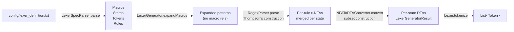
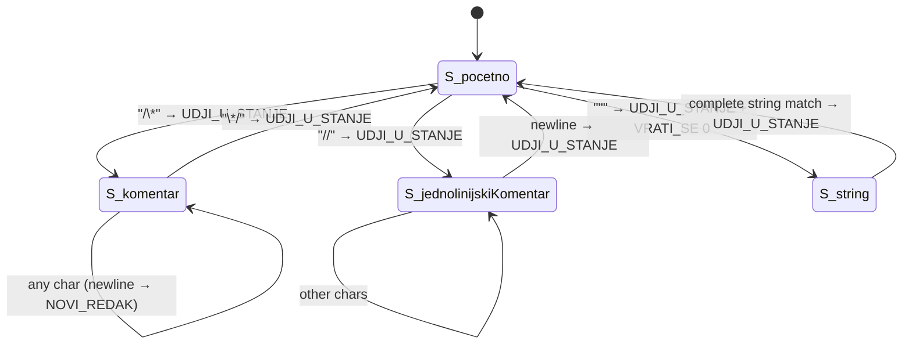
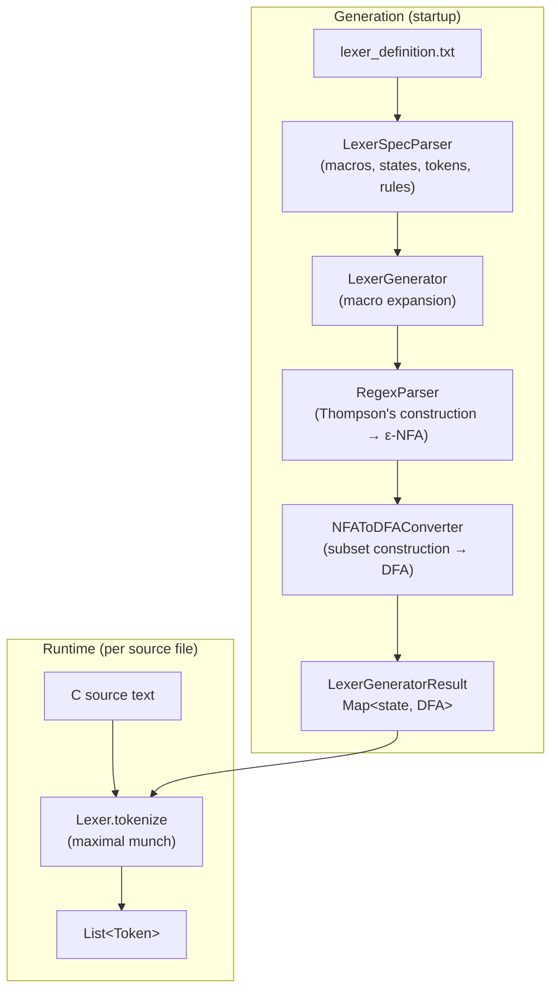
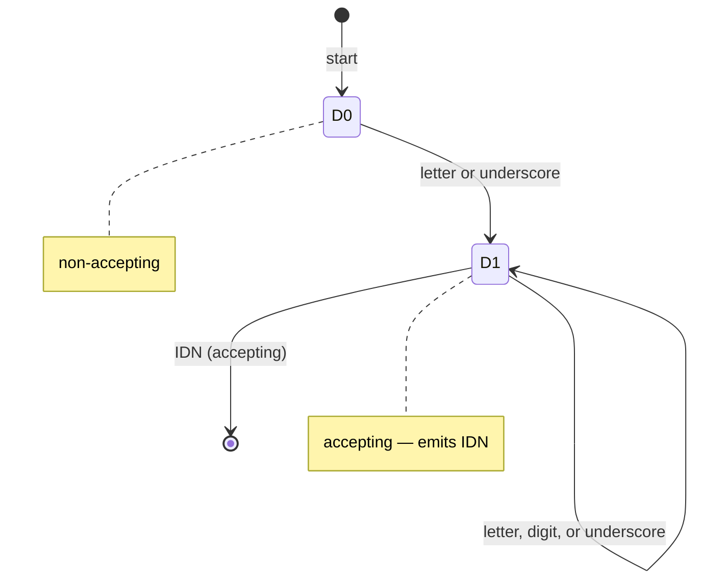

# Lexer (Lexical Analysis Phase)

The lexer is the first pipeline phase. It transforms a raw C source character stream into a flat sequence of typed tokens. It is implemented in the `compiler-lexer` Maven module (`compiler-lexer/src/main/java/hr/fer/ppj/lexer/`). The runtime is not hand-written: at startup the compiler generates per-state DFAs from a declarative specification file (`config/lexer_definition.txt`) and uses those DFAs to drive maximal-munch tokenization.

---

## Table of Contents

1. [Phase Inputs and Outputs](#phase-inputs-and-outputs)
2. [Module Layout](#module-layout)
3. [Lexer Specification Format](#lexer-specification-format)
4. [Token Model](#token-model)
5. [Token Catalogue](#token-catalogue)
6. [Construction Pipeline](#construction-pipeline)
   - [Spec Parsing — LexerSpecParser](#spec-parsing--lexerspecparser)
   - [Macro Expansion — LexerGenerator](#macro-expansion--lexergenerator)
   - [ε-NFA Construction — RegexParser / NFA](#ε-nfa-construction--regexparser--nfa)
   - [Subset Construction — NFAToDFAConverter / DFA](#subset-construction--nfatodfaconverter--dfa)
7. [Lexer States](#lexer-states)
8. [Maximal-Munch Tokenization Driver — Lexer](#maximal-munch-tokenization-driver--lexer)
   - [scanToken algorithm](#scantoken-algorithm)
   - [Action dispatch](#action-dispatch)
   - [Error recovery (Algorithm C)](#error-recovery-algorithm-c)
9. [Symbol Table](#symbol-table)
10. [Configuration](#configuration)
11. [Invocation](#invocation)
12. [Mermaid Diagrams](#mermaid-diagrams)

---

## Phase Inputs and Outputs

| | Detail |
|---|---|
| **Input** | Raw C source text (`Reader`) |
| **Output** | `List<Token>` (ordered, whitespace/comment-free) |
| **Side output** | `compiler-bin/tokens.txt` (text dump, one token per line) |
| **Errors** | Reported to `DiagnosticReporter` (stage `Stage.LEXER`); panic-mode recovery continues after each error |

---

## Module Layout

```
compiler-lexer/src/main/java/hr/fer/ppj/lexer/
├── config/
│   └── LexerConfig.java          # path resolution for lexer_definition.txt
├── gen/
│   ├── LexerGenerator.java       # orchestrates parse → expand → NFA → DFA
│   ├── LexerGeneratorResult.java # record: states, tokens, stateDFAs, rules
│   └── LexerSpecParser.java      # parses lexer_definition.txt into structured data
├── nfa/
│   └── NFA.java                  # ε-NFA: transitions + epsilon-transitions + accepting states
├── dfa/
│   ├── DFA.java                  # DFA: transitions + accepting states + token/action maps
│   └── NFAToDFAConverter.java    # subset construction (NFA → DFA)
├── regex/
│   └── RegexParser.java          # Thompson's construction (regex string → NFA fragment)
├── io/
│   ├── Lexer.java                # maximal-munch tokenizer; entry point for the phase
│   └── Token.java                # immutable token record
└── state/
    └── LexerState.java           # current DFA state name, state stack, line/col tracking
```

---

## Lexer Specification Format

`config/lexer_definition.txt` is the authoritative declarative source for the lexer. It is parsed at compiler startup by `LexerSpecParser`. The file has four line types:

### Macro definitions

```
{name} pattern
```

Defines a reusable regex fragment. References use `{name}` syntax in other macros and in rule patterns. Expansion is recursive; circular references are guarded by a 100-iteration limit. Macros defined in `lexer_definition.txt`:

| Macro | Meaning |
|---|---|
| `{znak}` | All 52 ASCII letters (a–z, A–Z) |
| `{znamenka}` | Decimal digits 0–9 |
| `{hexZnamenka}` | Hex digits: `{znamenka}` + a–f + A–F |
| `{bjelina}` | Whitespace: tab, newline, space (`\t\|\n\|\_`) |
| `{eksponent}` | Float exponent: `(e\|E)($\|+\|-){znamenka}{znamenka}*` |
| `{sviZnakovi}` | All printable ASCII + whitespace (explicit enumeration) |
| `{sveOsimDvostrukogNavodnikaINovogReda}` | All except `"` and `\n` (string body chars) |
| `{sveOsimJednostrukogNavodnikaNovogRedaITaba}` | All except `'`, `\n`, `\t` (char literal body) |
| `{sveOsimNovogRedaITaba}` | All except `\n` and `\t` (escape-seq body) |

The `$` symbol in patterns denotes ε (empty string), not end-of-input. Backslash escapes: `\n` → newline, `\t` → tab, `\_` → space.

### State declarations

```
%X S_pocetno S_komentar S_jednolinijskiKomentar S_string
```

Declares the four lexer states. Each state gets its own DFA built from the rules applicable to it.

### Token declarations

```
%L IDN BROJ ZNAK NIZ_ZNAKOVA KR_BREAK ...
```

Declares the 47 token type names. These names are passed unmodified to the parser.

### Lexer rules

```
<state>pattern
{
    token_name_or_dash
    [UDJI_U_STANJE new_state]
    [VRATI_SE n]
    [NOVI_REDAK]
}
```

- `<state>` — the lexer state in which this rule is active (e.g., `<S_pocetno>`).
- `pattern` — a regex pattern (possibly macro-expanded). Quoted patterns (`"break"`) are treated as literals unless they contain regex operators.
- `token_name_or_dash` — the token type to emit; `-` means consume the match silently (whitespace, comments).
- Actions are optional and may appear in any order.

Rule order within the file determines tie-breaking priority: earlier rules win over later rules that match a prefix of the same length.

---

## Token Model

`compiler-lexer/.../io/Token.java` is a Java record:

```java
public record Token(
    String type,          // token type name, e.g. "KR_INT", "IDN", "BROJ"
    String value,         // matched source text, e.g. "int", "factorial", "42"
    int line,             // 1-based source line
    int column,           // 1-based source column at token start
    int symbolTableIndex  // index into the Lexer's symbol table; -1 if not tracked
)
```

Factory methods:
- `Token.of(type, value, line, column)` — `symbolTableIndex = -1`.
- `Token.withIndex(type, value, line, column, index)` — used by `Lexer.scanToken`.

`type` carries the exact string from the `%L` declaration (or from the rule action). `value` is the raw matched text before any semantic interpretation. Whitespace and comment rules produce `null` / empty `type`; those tokens are filtered out by `tokenize` before the list is returned.

---

## Token Catalogue

The specification declares 47 token types across six categories.

### Keywords (13)

| Token | Lexeme |
|---|---|
| `KR_BREAK` | `break` |
| `KR_CHAR` | `char` |
| `KR_CONST` | `const` |
| `KR_CONTINUE` | `continue` |
| `KR_ELSE` | `else` |
| `KR_FLOAT` | `float` |
| `KR_FOR` | `for` |
| `KR_IF` | `if` |
| `KR_INT` | `int` |
| `KR_RETURN` | `return` |
| `KR_STRUCT` | `struct` |
| `KR_VOID` | `void` |
| `KR_WHILE` | `while` |

All keyword rules appear before the identifier rule in `lexer_definition.txt`; rule-order priority ensures `int` emits `KR_INT` rather than `IDN`. An input like `integer` still emits `IDN` because it is four characters and therefore a strictly longer match for the identifier rule than any keyword.

### Value Literals (4)

| Token | Pattern (simplified) | Notes |
|---|---|---|
| `IDN` | `(_\|letter)(_\|letter\|digit)*` | Standard C identifier rules |
| `BROJ` | Decimal / hex (`0x`/`0X`) / float (4 patterns) | All numeric forms share one token name |
| `ZNAK` | `'c'` or `'\c'` | Single character or escape sequence |
| `NIZ_ZNAKOVA` | `"..."` with `\"` support | Matched via two-phase state mechanism |

`BROJ` is matched by four separate rules emitting the same token name. Semantic analysis is responsible for numeric interpretation and range checking.

### Operators — Arithmetic/Assignment (9)

`PLUS` (`+`), `OP_INC` (`++`), `MINUS` (`-`), `OP_DEC` (`--`), `ASTERISK` (`*`), `OP_DIJELI` (`/`), `OP_MOD` (`%`), `OP_PRIDRUZI` (`=`), `OP_TILDA` (`~`).

### Operators — Relational/Equality (6)

`OP_LT` (`<`), `OP_LTE` (`<=`), `OP_GT` (`>`), `OP_GTE` (`>=`), `OP_EQ` (`==`), `OP_NEQ` (`!=`).

### Operators — Logical/Bitwise (7)

`OP_NEG` (`!`), `OP_I` (`&&`), `OP_ILI` (`||`), `AMPERSAND` (`&`), `OP_BIN_ILI` (`|`), `OP_BIN_XILI` (`^`), `OP_TILDA` (`~`, counted above).

### Punctuation/Delimiters (8)

`ZAREZ` (`,`), `TOCKAZAREZ` (`;`), `TOCKA` (`.`), `L_ZAGRADA` (`(`), `D_ZAGRADA` (`)`), `L_UGL_ZAGRADA` (`[`), `D_UGL_ZAGRADA` (`]`), `L_VIT_ZAGRADA` (`{`), `D_VIT_ZAGRADA` (`}`).

`TOCKAZAREZ` and `D_VIT_ZAGRADA` are used as synchronization tokens in parser error recovery.

---

## Construction Pipeline

At startup, `LexerGenerator.generate(Reader)` reads `lexer_definition.txt` and produces a `LexerGeneratorResult` — a map from state names to `DFA` instances. The pipeline has four stages:



### Spec Parsing — LexerSpecParser

`compiler-lexer/.../gen/LexerSpecParser.java`

Parses the spec file line-by-line. Each line is classified by prefix:

- `{name}` → macro definition
- `%X` → state declaration (space-separated names)
- `%L` → token declaration (space-separated names)
- `<` → rule (reads the subsequent action block in `{...}`)

Quoted patterns are disambiguated: if the quoted content contains regex operators (`|`, `*`, `(`, `)`, `{`, `}`) the quotes are retained as part of the regex; otherwise the quotes are stripped and the content treated as a literal. Escape sequences (`\\`, `\"`, `\n`, `\t`) are unescaped.

Rules are stored as `LexerSpecParser.LexerRule` records:

```java
public record LexerRule(
    String state,         // e.g. "S_pocetno"
    String pattern,       // raw pattern after quote handling
    String token,         // token name, or null for no-emit rules
    List<String> actions  // e.g. ["UDJI_U_STANJE S_komentar"]
) {}
```

### Macro Expansion — LexerGenerator

`compiler-lexer/.../gen/LexerGenerator.java`

Each `{MacroName}` reference in a rule pattern is replaced with `(value)` — parentheses preserve alternation precedence at the expansion site. The loop runs until no references remain (fixed-point), with a 100-iteration safety cap. Expansion applies both during macro-on-macro substitution and during per-rule `expandPattern`.

Example: `{hexZnamenka}` → `({znamenka}|a|b|c|d|e|f|A|B|C|D|E|F)` → `((0|1|2|3|4|5|6|7|8|9)|a|b|c|d|e|f|A|B|C|D|E|F)`.

### ε-NFA Construction — RegexParser / NFA

`compiler-lexer/.../regex/RegexParser.java`  
`compiler-lexer/.../nfa/NFA.java`

`RegexParser` implements Thompson's construction. Every regex string is recursively decomposed into fragments; each fragment is represented as a `StatePair(int start, int end)` inside the shared `NFA`. States are allocated from a shared `IntSupplier` so all rule NFAs for a state share a globally unique number space.

**Operators supported:**

| Operator | Handling |
|---|---|
| Single character `a` | Two new states, one character transition `start → end` |
| `$` (epsilon) | Two new states, one ε-transition `start → end` |
| `\\` prefix | Escape: `\t` → tab, `\n` → newline, `\_` → space, other → literal char |
| `(expr)` | Recurse on inner expression; return inner `StatePair` |
| `A|B` (union) | `splitByUnion` splits at top-level `|`; new wrapper states + ε-transitions to/from each alternative |
| `A*` (Kleene star) | New wrapper states; four ε-transitions for enter/exit/skip/repeat |
| `AB` (concatenation) | Implicit; fragments connected via ε from `A.end` to `B.start` |

`splitByUnion` correctly handles nested parentheses (tracks depth, skips escaped characters) when identifying top-level `|` separators.

After all rule NFAs for a state are built, `LexerGenerator.buildDFAForState` wires them together: a new start state 0 gets ε-transitions to each rule's NFA start state. NFA accepting states carry a `(token, ruleOrderIndex, actions)` triple.

**NFA data structures** (`NFA.java`):

```java
Map<Integer, Map<Character, Set<Integer>>> transitions        // symbol transitions
Map<Integer, Set<Integer>>                 epsilonTransitions  // ε-transitions
Set<Integer>                               acceptingStates
int                                        startState
```

`getEpsilonClosure(Set<Integer> states)` — fixed-point iteration over epsilon edges; returns all reachable states including the input set.

`move(Set<Integer> states, char symbol)` — follows all symbol transitions from the given state set, then applies `getEpsilonClosure` to the result.

### Subset Construction — NFAToDFAConverter / DFA

`compiler-lexer/.../dfa/NFAToDFAConverter.java`  
`compiler-lexer/.../dfa/DFA.java`

Converts the merged ε-NFA for each state into a DFA using standard subset construction.

**Algorithm sketch:**

1. Compute `startSet = εClosure({nfa.startState})`. Register as DFA state 0.
2. Worklist loop: for each unprocessed DFA state `S` (a set of NFA states):
   a. Collect the alphabet from all transitions of states in `S`.
   b. For each symbol `c`: `T = nfa.move(S, c)`. If non-empty, create or look up DFA state for `T`; record transition `S --c--> T`.
   c. If any NFA state in `S` is an accepting state, the DFA state is accepting.
3. Accepting state conflict resolution: when multiple NFA accepting states appear in one DFA state, sort by `ruleOrderIndex` (lower = higher priority); the first entry's token name is used. State number is a secondary tie-break for determinism.

**DFA data structures** (`DFA.java`):

```java
Map<Integer, Map<Character, Integer>> transitions          // δ(state, char) → state
Set<Integer>                          acceptingStates
Map<Integer, String>                  acceptingStateTokens  // state → token name
Map<Integer, List<String>>            acceptingStateActions // state → action list
int                                   startState
```

`getTransition(int state, char symbol)` returns `null` (no transition) or the successor state. `isAccepting(int state)` and `getToken(int state)` are the runtime hot-path accessors.

The final `LexerGeneratorResult` record bundles `List<String> states`, `List<String> tokens`, `Map<String, DFA> stateDFAs`, and `List<LexerRule> rules`.

---

## Lexer States

The spec declares four states via `%X`. Each state has its own DFA.

| State | Purpose | Rules active |
|---|---|---|
| `S_pocetno` | Initial / main scanning state | All keyword, identifier, operator, literal, whitespace rules (~50 rules) |
| `S_komentar` | Inside `/* ... */` block comment | `*/` (exit), `\n` (line count), `{sviZnakovi}` (consume) |
| `S_jednolinijskiKomentar` | Inside `// ...` line comment | `\n` (line count + exit), `{sviZnakovi}` (consume) |
| `S_string` | Inside `"..."` string literal | Full `"..."` pattern (emit `NIZ_ZNAKOVA` + exit) |

State is tracked by `LexerState` (`compiler-lexer/.../state/LexerState.java`), which maintains a `String currentState`, a `Stack<String> stateStack`, and `int lineNumber` / `int columnNumber`. The stack is pushed by `enterState` (called when `UDJI_U_STANJE` fires) and popped by `returnToPreviousState`.

**String literal entry (two-phase mechanism):**  
When `S_pocetno` sees `"`, the rule fires `UDJI_U_STANJE S_string` + `VRATI_SE 0`. `VRATI_SE 0` returns all consumed characters (the opening quote) to the buffer; no token is emitted. Now in `S_string` with the quote still at buffer head, the single string rule `"({sveOsimDvostrukogNavodnikaINovogReda}|\\")*"` matches the complete `"content"` span and emits `NIZ_ZNAKOVA`.



---

## Maximal-Munch Tokenization Driver — Lexer

`compiler-lexer/.../io/Lexer.java`

`Lexer` is constructed with a `LexerGeneratorResult`. The public entry point is:

```java
public List<Token> tokenize(Reader input,
                            DiagnosticReporter reporter) throws IOException
```

Input is read line-by-line into a `StringBuilder` buffer. The outer loop processes the buffer until it is empty; each iteration calls `scanToken`.

### scanToken algorithm

`scanToken(StringBuilder input, LexerState lexerState)` implements maximal munch:

1. Look up the DFA for `lexerState.getCurrentState()`.
2. Walk the DFA character by character from its start state.
3. Each time the current DFA state is an accepting state, record it as `lastAcceptingState` and update `lastAcceptingMatch` / `lastAcceptingToken` / `lastAcceptingActions`.
4. Stop when `dfa.getTransition(currentState, c)` returns `null` (dead end) or input is exhausted.
5. If `lastAcceptingMatch == 0`, return `null` (no match).
6. Otherwise, consume `actualMatch` characters from the buffer (see VRATI_SE below) and return a `Token`.

**Special case — string closing quote:** When `longestToken == "NIZ_ZNAKOVA"` and the current state is `S_string` and the just-matched character is an unescaped `"`, scanning stops immediately to prevent overrun into text following the string.

### Action dispatch

After computing the match length, `scanToken` processes the action list in order:

| Action | Meaning | Implementation |
|---|---|---|
| `UDJI_U_STANJE <state>` | Switch lexer state | Calls `lexerState.enterState(parts[1])` |
| `VRATI_SE n` | Keep first `n` chars; push rest back | Sets `actualMatch = n`; `input.delete(0, actualMatch)` |
| `NOVI_REDAK` | Increment line counter | Calls `lexerState.newLine()` if no `\n` was found in the consumed text |

`VRATI_SE 0` is used only by the string-entry rule: it transitions state without consuming input.

A null or empty `token` name (or the sentinel value `"-"`) causes `scanToken` to return `null`, and the outer loop discards the match silently.

### Error recovery (Algorithm C)

When `scanToken` returns `null` and neither the buffer length nor the state name changed, the lexer is stuck:

1. Report the unrecognized character at `(lineNumber, columnNumber)` via `DiagnosticReporter`.
2. Discard `buffer.charAt(0)`.
3. If the discarded character was `\n`, call `lexerState.newLine()`; otherwise `lexerState.advanceColumn()`.
4. Resume the outer loop.

**Unterminated string literals** are a special case of stuck-in-`S_string`: if the buffer head is `\n` (or the buffer is empty and state is `S_string`), the lexer reports "nezatvoren string literal", deletes up to the next newline, returns to `S_pocetno`, and increments the line counter.

---

## Symbol Table

`Lexer` maintains a `List<SymbolTableEntry>` (a list of `(String token, String text)` pairs). Every emitted token is deduplicated: `getOrAddSymbol` performs a linear scan and returns the existing index if `(token, text)` is already present, or appends a new entry. The `symbolTableIndex` field of `Token` references this list. Multiple occurrences of the same source lexeme share the same index — e.g., all uses of `int` share index 0.

```java
public record SymbolTableEntry(String token, String text) {}
```

The symbol table is exposed via `getSymbolTable()` and `getSymbolTableTexts()`.

---

## Configuration

`compiler-lexer/.../config/LexerConfig.java` centralizes the spec file path:

- **Environment variable override:** `LEXER_DEFINITION_PATH` — if set and the path exists, it is used directly.
- **Auto-discovery:** Walk up the directory tree from `user.dir` until a directory containing both `pom.xml` and a `config/` subdirectory is found; return `<root>/config/lexer_definition.txt`.
- **Fallback:** `<user.dir>/config/lexer_definition.txt`.

---

## Invocation

### CLI

```bash
./run.sh --lex <prog.c>           # tokenize only; writes compiler-bin/tokens.txt
./run.sh --parse <prog.c>         # tokenize + parse (lexer runs as first stage)
./run.sh --all --run <prog.c>     # full pipeline; lexer runs first
```

`compiler-bin/tokens.txt` contains one token per line in the format `<TYPE> <value>` (the exact format produced by the CLI reporting layer in `cli/`).

### Programmatic

```java
// 1. Build the DFAs from the spec file
LexerGenerator gen = new LexerGenerator();
LexerGeneratorResult result = gen.generate(
    new FileReader(LexerConfig.getLexerDefinitionPath().toFile()));

// 2. Construct the lexer
Lexer lexer = new Lexer(result);

// 3. Tokenize
List<Token> tokens = lexer.tokenize(new FileReader("prog.c"), reporter);
```

The `Lexer` instance is not thread-safe (the symbol table and `LexerState` are mutable); create one per compilation unit.

---

## Mermaid Diagrams

### Full construction and runtime pipeline



### Example DFA fragment — identifier recognition

After subset construction collapses the ~238-state NFA for `(_|letter)((_|letter|digit)*)`, the resulting DFA has the following structure:



---

See also: Chapter 3 ("Lexical Analysis") of *Building a C-Subset Compiler for the FRISC Architecture* for the formal development, proofs, and detailed worked examples. See [parser.md](parser.md) for how the token stream is consumed downstream.
