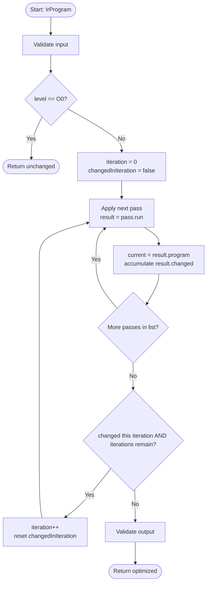
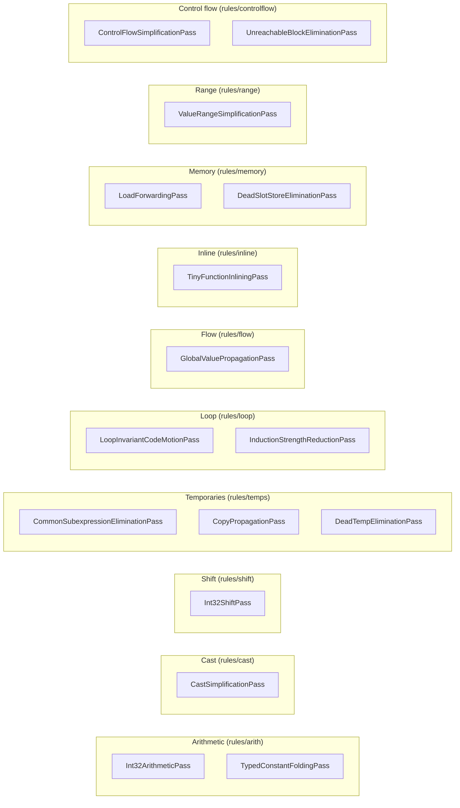

# IR-to-IR Optimization Pass Pipeline

The `compiler-opt` module (`compiler-opt/src/main/java/hr/fer/ppj/opt/`) implements a deterministic fixpoint pass pipeline that transforms a typed `IrProgram` into an equivalent, more efficient `IrProgram`. At `-O0` the program passes through unchanged; at `-O1` a sequence of 19 pass invocations (16 distinct classes, three of which run twice) is applied repeatedly until no pass reports a change or `maxIterations` is exhausted.

---

## Enabling optimization

### CLI flags

| Flag | Effect |
|---|---|
| `--O0` | `OptimizationLevel.O0` — skips all passes; IR is returned as-is |
| `--O1` | `OptimizationLevel.O1` — runs the full 19-invocation pass sequence |
| (default) | Same as `--O1`; `OptimizationOptions.defaults()` resolves to `O1` |

To inspect the IR before and after optimization:

```
./run.sh --O1 --dump-ir <source.c>
```

### Programmatic API

```java
IrOptimizer optimizer = new IrOptimizer();
IrProgram optimized = optimizer.optimize(program, OptimizationOptions.O1);
```

`OptimizationOptions` is a Java record with three fields:

| Field | Type | Default |
|---|---|---|
| `level` | `OptimizationLevel` | `O1` |
| `maxIterations` | `int` | `5` |
| `validateAfterEachPass` | `boolean` | `false` |

`OptimizationOptions.O0` and `OptimizationOptions.O1` are pre-built constants. Custom instances can be constructed directly via the record constructor.

---

## Pipeline internals

### Entry point: `IrOptimizer`

`IrOptimizer.optimize(IrProgram, OptimizationOptions)` is the sole public entry point for the module. It:

1. Validates the input `IrProgram` via `IrOptimizationValidator`.
2. If `level == O0`, returns the program unchanged.
3. Constructs a `PassPipeline` with the ordered list of 19 pass instances (see §Pass catalogue below).
4. Runs the pipeline.
5. Validates the output `IrProgram` via `IrOptimizationValidator`.

### Fixpoint loop: `PassPipeline`

`PassPipeline` (`pipeline/PassPipeline.java`) drives the fixpoint iteration:

```
for iteration in 0 .. maxIterations-1:
    changedInIteration = false
    for each pass in passes:
        result = pass.run(current, context)
        current = result.program()
        changedInIteration |= result.changed()
        if validateAfterEachPass:
            validator.validate(current)
    if not changedInIteration:
        break          // fixpoint reached
return current
```

Key properties:

- **Deterministic**: passes are applied in a fixed, defined order on every iteration.
- **Fixpoint-bounded**: the outer loop terminates when no pass changes the program, or after `maxIterations` (default: 5) iterations, whichever comes first.
- **Immutable IR**: each pass returns a new `IrProgram`; the original is never mutated.



### `IrPass` contract

Every pass implements `IrPass` (`pipeline/IrPass.java`):

```java
public interface IrPass {
    String name();                                          // diagnostic name
    PassResult run(IrProgram program, PassContext context); // transforms the program
}
```

`PassResult` (`pipeline/PassResult.java`) is a record holding:

- `IrProgram program` — the (possibly identical) result program.
- `boolean changed` — `true` if the pass made at least one modification.

Factory methods: `PassResult.unchanged(program)` and `PassResult.changed(program)`.

### `PassContext`

`PassContext` (`pipeline/PassContext.java`) is a record carrying `OptimizationOptions` and an `IrOptimizationValidator` reference. It is threaded through every pass invocation so passes can read options and, when `validateAfterEachPass` is enabled, trigger mid-pipeline validation.

### Validator: `IrOptimizationValidator`

`IrOptimizationValidator` (`validation/IrOptimizationValidator.java`) delegates to `IrPipeline.verify(program)` from the `compiler-ir` module. It is called twice unconditionally (pre- and post-pipeline) and optionally after each pass when `validateAfterEachPass = true`. Any structural violation of the IR well-formedness rules throws at this point.

---

## Pass catalogue

The 19 invocations registered in `IrOptimizer` in their exact run order:

| # | Pass class | `name()` | Package (`rules/…`) | Description |
|---|---|---|---|---|
| 1 | `Int32ArithmeticPass` | `int32-arithmetic` | `arith` | Applies algebraic identities and constant folding for `INT32` binary and unary ops (e.g. `x+0→x`, `x*0→0`, `x-x→0`, double-negation elimination, fully-constant binary/unary evaluation). Operates within single basic blocks using a local definition map. |
| 2 | `TypedConstantFoldingPass` | `typed-constant-folding` | `arith` | Folds all-constant binary ops, comparisons, unary ops, and casts to literal constants, across all IR types including `FLOAT` (Q16.16 arithmetic). Also folds constant branches in terminators and constant return values. Skips folding of Q16.16 results that are not round-trip stable. |
| 3 | `CastSimplificationPass` | `cast-simplification` | `cast` | Eliminates redundant casts where the operand type already equals the result type, replacing the cast assignment with an alias. Propagates aliases through all instruction operands and terminators within a block; invalidates stale aliases on assignment. |
| 4 | `Int32ShiftPass` | `int32-shift` | `shift` | Replaces `INT32` multiplications by positive powers of two with left-shift equivalents (e.g. `x*8 → x<<3`). Also eliminates shift-by-zero. |
| 5 | `CommonSubexpressionEliminationPass` | `local-cse` | `temps` | Local (within-block) CSE for side-effect-free RHS expressions. Hashes expression keys; on a hit, replaces the destination with an alias to the earlier result. Commutative ops (`ADD`, `MUL`, `AND`, `OR`, `XOR`) and symmetric comparisons (`EQ`, `NE`) use canonically ordered keys. Loads, calls, and `IncDecOp` are excluded as impure. |
| 6 | `LoopInvariantCodeMotionPass` | `loop-invariant-code-motion` | `loop` | Conservative LICM: detects loop blocks (via back-edge analysis), identifies pure assignments whose operands are defined before the loop, and reorders them to the top of the loop block. Avoids cross-block temp motion to maintain IR validity under verifier constraints. |
| 7 | `GlobalValuePropagationPass` | `global-value-propagation` | `flow` | Function-level constant and copy propagation through local and parameter slots. Tracks slot contents across the entire function's block sequence; substitutes known constant or temp values at load sites. |
| 8 | `TinyFunctionInliningPass` | `tiny-function-inlining` | `inline` | Inlines tiny, pure, leaf `INT32`-returning functions whose body contains at most `MAX_INLINE_ASSIGNMENTS` (8) assignment instructions. Replaces call sites with the inlined instruction sequence with fresh temp indices. |
| 9 | `LoadForwardingPass` | `load-forwarding` | `memory` | Replaces redundant slot loads with the last known stored value when the slot has not been modified between the store and the load. Constants are propagated across blocks conservatively; temp forwarding is local to one block to avoid invalid cross-block temp references. |
| 10 | `DeadSlotStoreEliminationPass` | `dead-slot-store-elimination` | `memory` | Eliminates stores to tracked slots when the stored value is never loaded before the slot is overwritten again or the function exits. Operates at function scope. |
| 11 | `ValueRangeSimplificationPass` | `value-range-simplification` | `range` | Uses conservative `INT32` range analysis to simplify comparison and branch instructions. Resolves comparisons whose outcome is statically determined by tracked value ranges to constant `BOOL` results, enabling downstream constant folding of branches. |
| 12 | `CopyPropagationPass` | `copy-propagation` | `temps` | Local (within-block) copy/alias propagation for temp values. When a temp is assigned another temp (`tA = tB`), subsequent uses of `tA` are replaced by `tB`. |
| 13 | `DeadTempEliminationPass` | `dead-temp-elimination` | `temps` | Removes pure temp assignments whose result is never used. Uses a backward liveness scan within each block. *(First invocation.)* |
| 14 | `ControlFlowSimplificationPass` | `control-flow-simplification` | `controlflow` | Folds constant conditional branches to unconditional jumps; merges trivial jump-only blocks. *(First invocation.)* |
| 15 | `UnreachableBlockEliminationPass` | `unreachable-block-elimination` | `controlflow` | Removes basic blocks not reachable from the function entry block via BFS/DFS over the CFG. *(First invocation.)* |
| 16 | `InductionStrengthReductionPass` | `induction-strength-reduction` | `loop` | Detects simple induction variables in loops and replaces multiplications of the induction variable by the loop stride with additions, reducing expensive multiply operations to additions. |
| 17 | `DeadTempEliminationPass` | `dead-temp-elimination` | `temps` | Second invocation — cleans up temporaries made dead by `InductionStrengthReductionPass` and other earlier passes in the same iteration. |
| 18 | `ControlFlowSimplificationPass` | `control-flow-simplification` | `controlflow` | Second invocation — folds any constant branches introduced or revealed by the preceding passes. |
| 19 | `UnreachableBlockEliminationPass` | `unreachable-block-elimination` | `controlflow` | Second invocation — removes any newly unreachable blocks exposed by the second `ControlFlowSimplificationPass`. |

### Pass families



---

## Iteration count and convergence

The default `maxIterations` is `5` (constant `OptimizationOptions.DEFAULT_MAX_ITERATIONS`). In practice most programs converge in 2–3 outer iterations. Programs dominated by straight-line or recursion-only code may converge in a single iteration. Programs with loop-heavy arithmetic may require more iterations as LICM and strength reduction expose further constant-folding and dead-temp opportunities.

The `validateAfterEachPass` flag (default `false`) is available for debugging: it invokes `IrPipeline.verify` after every individual pass invocation, surfacing the first pass that produces a malformed IR.

---

## Invocation examples

```bash
# Compile with no optimization; emit FRISC assembly
./run.sh --O0 examples/valid/math_fibonacci_iter.c

# Compile with O1 optimization; dump pre- and post-optimization IR
./run.sh --O1 --dump-ir examples/valid/math_fibonacci_iter.c

# Full pipeline including simulator
./run.sh --all --run examples/real_world/real_prime_sieve.c
```

---

## See also

- `docs/pipeline/ir.md` — IR model, instruction set, and type system.
- `docs/pipeline/codegen.md` — FRISC code generator consuming the optimized IR.
