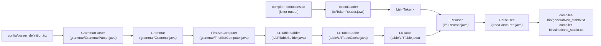

# Parser (Syntax Analysis)

The parser transforms the flat token stream produced by the lexer into a parse tree, then into an abstract syntax tree (AST), using a canonical LR(1) table-driven algorithm. The implementation lives in the Maven module `compiler-parser` at `compiler-parser/src/main/java/hr/fer/ppj/parser/`.

---

## Data flow



The entry point is `Parser.parse(ParserConfig.Config)` in `compiler-parser/src/main/java/hr/fer/ppj/parser/Parser.java`. Downstream phases (semantic analysis and IR lowering) consume the `ParseTree` object directly via `Parser.parseTokens(List<Token>)`.

---

## Invocation

```
./run.sh --parse <program>
```

Reads `compiler-bin/tokens.txt`, writes:
- `compiler-bin/generativno_stablo.txt` — full concrete parse tree (indented, depth-first)
- `compiler-bin/sintaksno_stablo.txt` — simplified syntax tree (intermediate unit-production nodes elided)

The grammar definition path defaults to `config/parser_definition.txt`. The environment variable `PARSER_DEFINITION_PATH` overrides this. `ParserConfig.getParserDefinitionPath()` walks up from `System.getProperty("user.dir")` until it finds a directory containing both `pom.xml` and `config/`, making the resolver robust to invocation from any module subdirectory.

---

## Grammar definition format (`config/parser_definition.txt`)

The grammar file uses a custom line-oriented format parsed by `GrammarParser` (no regex; manual parsing only):

| Directive | Syntax | Purpose |
|-----------|--------|---------|
| `%V` | `%V <nt1> <nt2> ...` | Declare nonterminal symbols (angle-bracket names). The first listed nonterminal becomes the grammar's start symbol. |
| `%T` | `%T TOK1 TOK2 ...` | Declare terminal symbols (uppercase token names matching lexer output). |
| `%Syn` | `%Syn TOK1 TOK2 ...` | Declare synchronisation tokens for error recovery. Currently `TOCKAZAREZ` (`;`) and `D_VIT_ZAGRADA` (`}`). |

Productions follow the declarations. A nonterminal name on its own unindented line begins a new rule block; indented lines are alternative right-hand sides for that nonterminal. An epsilon production is written as `$` (or an empty line after the nonterminal).

Example (from the actual grammar file):

```
<primarni_izraz>
 IDN
 BROJ
 ZNAK
 NIZ_ZNAKOVA
 L_ZAGRADA <izraz> D_ZAGRADA
```

### Nonterminal naming

All 47 nonterminals use Croatian identifiers, reflecting the grammar's origin in the PPJ (Programming Languages and Translators) course at FER Zagreb. The mapping to English semantics is:

| Croatian nonterminal | English equivalent |
|---|---|
| `<prijevodna_jedinica>` | translation unit (root) |
| `<vanjska_deklaracija>` | external declaration |
| `<definicija_funkcije>` | function definition |
| `<deklaracija>` | declaration |
| `<specifikatori_deklaracije>` | declaration specifiers |
| `<specifikator_tipa>` | type specifier |
| `<deklarator>` / `<izravni_deklarator>` | declarator / direct declarator |
| `<pokazivac>` | pointer |
| `<inicijalizator>` | initializer |
| `<primarni_izraz>` | primary expression |
| `<postfiks_izraz>` | postfix expression |
| `<unarni_izraz>` / `<unarni_operator>` | unary expression / unary operator |
| `<cast_izraz>` | cast expression |
| `<multiplikativni_izraz>` | multiplicative expression |
| `<aditivni_izraz>` | additive expression |
| `<odnosni_izraz>` | relational expression |
| `<jednakosni_izraz>` | equality expression |
| `<bin_i_izraz>` / `<bin_xili_izraz>` / `<bin_ili_izraz>` | bitwise AND / XOR / OR expression |
| `<log_i_izraz>` / `<log_ili_izraz>` | logical AND / OR expression |
| `<izraz_pridruzivanja>` | assignment expression |
| `<izraz>` | comma expression |
| `<naredba>` | statement |
| `<slozena_naredba>` | compound statement (block) |
| `<izraz_naredba>` | expression statement |
| `<naredba_grananja>` | if / if-else statement |
| `<naredba_petlje>` | while / for loop |
| `<naredba_skoka>` | break / continue / return |
| `<lista_naredbi>` / `<lista_deklaracija>` | statement list / declaration list |
| `<struct_specifikator>` | struct specifier |
| `<lista_parametara>` / `<deklaracija_parametra>` | parameter list / parameter declaration |

The 46 terminals are ALL-CAPS token names (`IDN`, `BROJ`, `KR_INT`, `PLUS`, `TOCKAZAREZ`, etc.) matching the output of the lexer verbatim.

---

## Grammar statistics

| Quantity | Count |
|----------|-------|
| Nonterminals | 47 |
| Terminals | 46 |
| Productions | 184 |
| Expression precedence levels | 13 (plus postfix and primary) |
| LR(1) states (approximate) | ~823 reported in `Parser.java` Javadoc; safety limit in `LRTableBuilder` is 50,000 |

### Operator precedence encoding

Precedence is encoded structurally through a chain of nonterminals. Each level delegates to the next-higher precedence level as its base case, using left recursion for left-associative operators and right recursion for right-associative ones.

| Level (low → high) | Nonterminal | Operators | Associativity |
|---|---|---|---|
| 1 | `<izraz>` | `,` | Left |
| 2 | `<izraz_pridruzivanja>` | `=` | Right |
| 3 | `<log_ili_izraz>` | `\|\|` | Left |
| 4 | `<log_i_izraz>` | `&&` | Left |
| 5 | `<bin_ili_izraz>` | `\|` | Left |
| 6 | `<bin_xili_izraz>` | `^` | Left |
| 7 | `<bin_i_izraz>` | `&` | Left |
| 8 | `<jednakosni_izraz>` | `==`, `!=` | Left |
| 9 | `<odnosni_izraz>` | `<`, `>`, `<=`, `>=` | Left |
| 10 | `<aditivni_izraz>` | `+`, `-` | Left |
| 11 | `<multiplikativni_izraz>` | `*`, `/`, `%` | Left |
| 12 | `<cast_izraz>` | `(type)` | Right (prefix) |
| 13 | `<unarni_izraz>` | `++`, `--`, `&`, `*`, `+`, `-`, `~`, `!` | Right (prefix) |
| — | `<postfiks_izraz>` | `[]`, `()`, `.`, `++`, `--` | Left (postfix) |
| — | `<primarni_izraz>` | atoms | — |

---

## FIRST-set computation

`FirstSetComputer` (`grammar/FirstSetComputer.java`) computes FIRST sets used during LR(1) closure:

- **Terminal:** `FIRST(a) = {a}`.
- **Nonterminal:** union of `FIRST(α)` for each production `A → α`, computed by `computeFirstForNonTerminal` using a recursion guard (`computedNonTerminals` set) to avoid infinite loops on left-recursive rules.
- **Sequence:** `FIRST(X₁X₂…Xₙ)` accumulates terminals from each `FIRST(Xᵢ)`, stopping at the first symbol that cannot derive ε; if all symbols derive ε, adds ε to the result.
- **Epsilon symbol:** represented as the string `"$"` throughout.
- Results are memoised in `firstCache` (a `HashMap<String, Set<String>>`). The cache is invalidated by `clearCache()`.

FIRST sets are queried thousands of times during table construction and are never recomputed.

---

## LR(1) table construction

### Item representation

`LRItem` (`lr/LRItem.java`) represents an LR(1) item `[A → α·β, L]`:

```java
private final Production production;   // the grammar production
private final int dotPosition;          // position of the dot within RHS
private final Set<String> lookahead;   // lookahead terminal set L
```

An item is a **reduce item** when `dotPosition >= production.rhs().size()`. `getNextSymbol()` returns the symbol immediately right of the dot, or `null` for a reduce item. `advance()` returns a new item with `dotPosition + 1`. `merge(other)` returns a new item with the union of lookahead sets (used when the same core item is generated with different lookaheads during closure).

### Closure

`LRClosure.closure(LRItemSet)` (`lr/LRClosure.java`) implements the standard fixed-point algorithm. For each item `[A → α·Bβ, L]` where `B` is a nonterminal, it adds `[B → ·γ, T]` for each production `B → γ`, where `T = FIRST(β)` if β cannot derive ε, and `T = FIRST(β) ∪ L` if β can derive ε. The loop runs until no new items are added (iteration capped at 1000 for safety).

### GOTO

`LRGoto.gotoSet(LRItemSet, String symbol)` (`lr/LRGoto.java`) collects all items in the set where the dot precedes `symbol`, advances the dot, and returns the closure of the resulting set. Returns `null` or empty if no items match.

### Canonical collection and table build

`LRTableBuilder.build()` (`lr/LRTableBuilder.java`) proceeds in two steps:

**Step 1 — canonical collection.** BFS over item sets starting from `CLOSURE({[S' → ·<prijevodna_jedinica>, {#}]})`. The grammar is augmented with the start production `<pocetni_nezavrsni_znak> → <prijevodna_jedinica>` by `Grammar` (`grammar/Grammar.java`). Existing states are found via `HashMap<LRItemSet, Integer>` keyed by the full item set (including lookaheads), giving O(1) lookup. A safety limit of 50,000 states prevents runaway construction.

**Step 2 — ACTION/GOTO tables.** For each state and each item in that state:

- Shift item `[A → α·aβ, L]` where `a` is terminal: `ACTION[s, a] = shift j` where `j = GOTO(s, a)`.
- Reduce item `[A → α·, L]` where `A ≠ S'`: `ACTION[s, a] = reduce pᵢ` for each `a ∈ L`, where `pᵢ` is the production's index in `Grammar.getAllProductions()`.
- Accept item `[S' → <prijevodna_jedinica>·, {#}]`: `ACTION[s, #] = acc`.
- GOTO: for each nonterminal `B`, `GOTO[s, B] = j` where `j` is the state for `GOTO(Iₛ, B)`.

#### Conflict resolution

| Conflict type | Resolution |
|---|---|
| SHIFT/REDUCE | Always choose SHIFT. The dangling-else (`KR_ELSE`) conflict is expected and logged at INFO; other S/R conflicts log at WARNING. |
| REDUCE/REDUCE | Choose the production with the lower index in `getAllProductions()` (earlier in grammar definition order). |

`LRTable` (`table/LRTable.java`) stores ACTION and GOTO as `HashMap<Integer, HashMap<String, String>>` and `HashMap<Integer, HashMap<String, Integer>>` respectively. Action strings are encoded as `"sN"` (shift to state N), `"rN"` (reduce production N), and `"acc"`.

### On-disk table cache

`LRTableCache` (`table/LRTableCache.java`) serialises the completed `LRTable` (which implements `Serializable`) to `target/parser-cache/lr_table.ser` after first construction and deserialises it on subsequent runs. Cache is invalidated by deleting the file (e.g., after a grammar change). `LRTableCache.clearCache()` deletes it programmatically.

Construction is expensive (full canonical LR(1) over a ~184-production grammar); the cache makes repeated invocations fast. No grammar-hash check is performed — cache validity must be managed manually.

---

## Shift/reduce parse loop

`LRParser.parse(List<Token>)` (`lr/LRParser.java`) operates two stacks: `Stack<Integer> stateStack` and `Stack<ParseTree> treeStack`.

The end-of-input sentinel token is `Token("#", lastLine, "")` appended to the token list.

```
stateStack.push(0)
loop:
  s = stateStack.peek()
  action = table.getAction(s, token.type())

  if action == null:
    handleError(token, s, stateStack, treeStack)   // error recovery
    tokenIndex++; continue

  if action == "acc":
    return treeStack.pop()   // single root node

  if action starts with "s":
    j = parseInt(action.substring(1))
    stateStack.push(j)
    treeStack.push(new ParseTree(token.type(), token.line(), token.lexicalUnit()))
    tokenIndex++

  if action starts with "r":
    pᵢ = parseInt(action.substring(1))
    prod = grammar.getAllProductions().get(pᵢ)
    pop prod.rhs().size() entries from both stacks (skipped for epsilon productions)
    parent = new ParseTree(prod.lhs())
    parent.addChildren(reversed children)
    treeStack.push(parent)
    gotoState = table.getGoto(stateStack.peek(), prod.lhs())
    stateStack.push(gotoState)
    // token index NOT advanced on reduce
```

On error, `handleError` builds a diagnostic message (currently in Croatian: "Sintaksna greška na retku N. Pročitan uniformni znak: X. Očekivani uniformni znakovi: Y, Z, ...") listing all terminals that have valid ACTION entries in the current state. If a `DiagnosticReporter` is wired in, the error is also forwarded to it. After logging, a `ParseException` is thrown; full panic-mode recovery (scanning forward to a sync token) is marked as a TODO in the source.

---

## Token input format

`TokenReader` (`io/TokenReader.java`) parses the lexer output file in two formats:

**Full format** (two-section, produced by the lexer's default output):
```
tablica znakova:
indeks   uniformni znak   izvorni tekst
     0   KR_INT            int
     ...
niz uniformnih znakova:
uniformni znak    redak    indeks u tablicu znakova
KR_INT               1       0
...
```

**Simplified format** (fallback, one-token-per-line):
```
TOKEN_TYPE LINE_NUMBER LEXICAL_UNIT
```

`readTokens` first attempts the full format; if no `"niz uniformnih znakova:"` section is found, it falls back to the simplified format. The result is `List<TokenReader.Token>` where each `Token` is a record `(String type, int line, String lexicalUnit)`.

---

## Parse tree vs. syntax tree

`ParseTree` (`tree/ParseTree.java`) serves as both the concrete parse tree and the simplified syntax tree — the distinction is in how the tree is serialised to disk.

**Generative tree** (`toGenerativeTreeString()`): every node is printed; indentation is `4 × depth` spaces. Leaf nodes are written as `SYMBOL , lexeme`. This file represents the complete grammar derivation.

**Syntax tree** (`toSyntaxTreeString()`): selected intermediate nodes are elided via `shouldSkipInSyntaxTree()`. A node is skipped (its children are printed at the parent's depth level) when:

- The symbol starts with `<lista_` and contains `_naredba` (statement list wrappers).
- The symbol starts with `<izraz>` and contains `_i_`.
- The symbol is `<slozena_naredba>` with exactly one child.
- The symbol starts with `<specifikator_` and has exactly one child.

The simplified tree is what downstream phases (semantic analysis in `compiler-semantics`) consume.

---

## AST node hierarchy

The `ast/` package defines a Java sealed-interface hierarchy for a higher-level AST, distinct from the `ParseTree` text-format nodes. This hierarchy is the typed representation passed to semantic analysis.

```mermaid
classDiagram
    class ASTNode {
        <<sealed interface>>
        +int line()
        +int column()
    }
    class Expression {
        <<sealed interface>>
    }
    class Statement {
        <<sealed interface>>
    }
    class Declaration {
        <<sealed interface>>
    }
    class Type {
        <<sealed interface>>
    }
    class Program {
        +List&lt;Declaration&gt; declarations
    }
    class BinaryExpression {
        +Expression left
        +String operator
        +Expression right
    }
    class UnaryExpression {
        +String operator
        +Expression operand
    }
    class PrimaryExpression {
        +String type
        +String value
    }
    class AssignmentExpression {
        +Expression left
        +Expression right
    }
    class IfStatement {
        +Expression condition
        +Statement thenBranch
        +Statement elseBranch
    }
    class BlockStatement {
        +List&lt;Declaration&gt; declarations
        +List&lt;Statement&gt; statements
    }
    class ReturnStatement
    class BreakStatement
    class ContinueStatement
    class ForStatement
    class WhileStatement
    class ExpressionStatement
    class FunctionDeclaration {
        +Type returnType
        +String name
        +List&lt;VariableDeclaration&gt; parameters
        +BlockStatement body
    }
    class VariableDeclaration {
        +Type type
        +String name
        +Expression initializer
    }
    class StructDeclaration
    class PrimitiveType
    class PointerType
    class ArrayType
    class StructType

    ASTNode <|-- Expression
    ASTNode <|-- Statement
    ASTNode <|-- Declaration
    ASTNode <|-- Type
    ASTNode <|-- Program
    Expression <|-- BinaryExpression
    Expression <|-- UnaryExpression
    Expression <|-- PrimaryExpression
    Expression <|-- AssignmentExpression
    Statement <|-- IfStatement
    Statement <|-- BlockStatement
    Statement <|-- ReturnStatement
    Statement <|-- BreakStatement
    Statement <|-- ContinueStatement
    Statement <|-- ForStatement
    Statement <|-- WhileStatement
    Statement <|-- ExpressionStatement
    Declaration <|-- FunctionDeclaration
    Declaration <|-- VariableDeclaration
    Declaration <|-- StructDeclaration
    Type <|-- PrimitiveType
    Type <|-- PointerType
    Type <|-- ArrayType
    Type <|-- StructType
```



All concrete node types are Java `record` classes implementing their respective sealed interface. The `permits` clause on each interface is exhaustive: adding a new node type requires updating the interface declaration.

`ASTNode` is the root: `sealed interface ASTNode permits Expression, Statement, Declaration, Type, Program`. All records carry `int line()` and `int column()` for source location tracking.

---

## Key classes summary

| Class | Package | Role |
|---|---|---|
| `Parser` | `hr.fer.ppj.parser` | Entry point; orchestrates the full pipeline |
| `ParserConfig` | `hr.fer.ppj.parser.config` | Path resolution for grammar and I/O files |
| `GrammarParser` | `hr.fer.ppj.parser.grammar` | Parses `parser_definition.txt` into `Production` records |
| `Grammar` | `hr.fer.ppj.parser.grammar` | Augmented CFG; production index map; epsilon tests |
| `FirstSetComputer` | `hr.fer.ppj.parser.grammar` | Memoised FIRST-set computation for symbols and sequences |
| `LRClosure` | `hr.fer.ppj.parser.lr` | Fixed-point closure over LR(1) item sets |
| `LRGoto` | `hr.fer.ppj.parser.lr` | GOTO operation: advance dot, closure |
| `LRItem` | `hr.fer.ppj.parser.lr` | Single LR(1) item `[A → α·β, L]` |
| `LRItemSet` | `hr.fer.ppj.parser.lr` | Set of LR(1) items; equality includes lookaheads |
| `LRTableBuilder` | `hr.fer.ppj.parser.lr` | Canonical collection + ACTION/GOTO table construction |
| `LRTable` | `hr.fer.ppj.parser.table` | ACTION and GOTO maps; serialisable |
| `LRTableCache` | `hr.fer.ppj.parser.table` | Serialize/deserialize `LRTable` to `target/parser-cache/lr_table.ser` |
| `LRParser` | `hr.fer.ppj.parser.lr` | Shift/reduce runtime engine; builds `ParseTree` |
| `ParseTree` | `hr.fer.ppj.parser.tree` | Concrete parse tree node; produces generative and syntax tree text |
| `TokenReader` | `hr.fer.ppj.parser.io` | Reads full or simplified lexer token output format |
| `ASTNode` and subtypes | `hr.fer.ppj.parser.ast` | Typed sealed-interface AST used by semantic analysis |

---

## See also

Book chapter: *LR(1) Parsing and the Grammar of C-Subset* (Chapter 4).

Sibling pipeline docs: [lexer.md](lexer.md) · [semantics.md](semantics.md) · [../reference/cli.md](../reference/cli.md)
