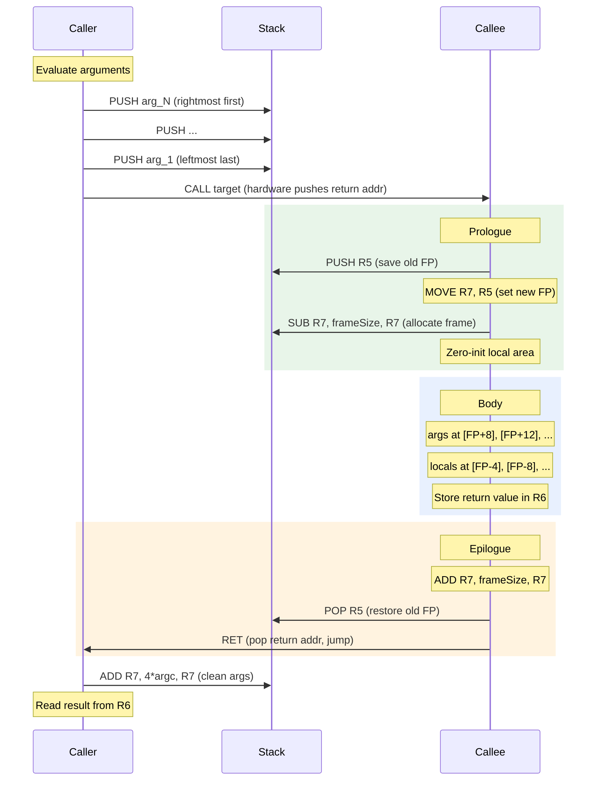

# FRISC Runtime Model, Calling Convention, and Software Helpers

The FRISCcc compiler targets the FRISC educational ISA, which lacks hardware multiply, divide, and floating-point instructions. This document specifies the complete runtime model: the register file contract, entry sequence, calling convention, stack frame layout, software helper routines, and the array bounds trap. All details are grounded in `ProgramEmitter.java`, `FunctionEmitter.java`, `HelperLibrary.java`, `IntMathHelpers.java`, `FloatHelpers.java`, and `BoundsHelper.java`.

---

## Register File

| Register | Role | Saved by | Notes |
|----------|------|----------|-------|
| `R0` | Primary expression result / scratch | Caller | General-purpose accumulator; clobbered across any `CALL` |
| `R1` | Scratch / second operand | Caller | Used in binary operations; clobbered across any `CALL` |
| `R2` | Scratch | Caller | Used internally by helpers (sign tracker, remainder, prod-lo) |
| `R3` | Scratch | Caller | Used internally by helpers (result accumulator, quotient, prod-hi) |
| `R4` | Scratch | Caller | Used internally by helpers (loop counter, bit-test, zero constant) |
| `R5` | Frame pointer (FP) | Callee | Points to saved-FP slot of the current activation record; must be restored by every epilogue |
| `R6` | Return value | Caller | Every function writes its result here before `RET`; also used as sign tracker inside `F_DIV`/`F_MOD`/`F_FDIV` |
| `R7` | Stack pointer (SP) | Callee (implicitly) | Grows downward; always 4-byte aligned; initialized to `40000` (hex) = 262144 at program start |

`R0`–`R4` and `R6` are caller-saved: the callee may freely modify them. The caller must push any live values before a `CALL` and restore them afterward. `R5` is the sole explicitly callee-saved register; every function prologue saves it and every epilogue restores it.

---

## Entry Sequence

`ProgramEmitter.emit()` unconditionally emits three instructions at address `0x00000` before any function body:

```
MOVE 40000, R7    ; Initialize SP to top of 256 KB address space (hex default)
CALL F_main       ; Call the user's main function
HALT              ; Terminate execution
```

`40000` is in the FRISC assembler's default hexadecimal base, equaling `0x40000` = 262,144 decimal. Because the stack grows downward from this address and code/data occupy low addresses, this maximizes available stack depth. There is no `.bss` zeroing pass, no environment setup, and no `argc`/`argv` parsing in the stub.

After `HALT`, `R6` holds the return value of `main`. The simulator and test harness inspect `R6` to determine the program's exit value.

---

## Memory Map

```
0x40000  ┌─────────────────────────────┐  ← initial SP
         │  Stack (grows downward)      │
         │  activation records          │
         │  locals, temps, args         │
         ├─────────────────────────────┤  ← SP at deepest call
         │  (free space)               │
         ├─────────────────────────────┤
         │  Data segment               │
         │  globals (DW/DB/DS)         │
         │  pointer scratch areas      │
         ├─────────────────────────────┤
         │  Code segment               │
         │  startup stub (3 instr)     │
         │  function bodies            │
         │  helper routines            │
0x00000  └─────────────────────────────┘
```

Stack overflow is not detected at runtime. If the stack collides with static data or code, behavior is undefined (silent corruption).

---

## Calling Convention

### Argument Passing

Arguments are pushed onto the stack in **right-to-left order** before `CALL`. For a call `f(a, b, c)`, `c` is pushed first, then `b`, then `a`. After the callee's prologue establishes its frame, parameters are at positive offsets from FP:

| Offset | Contents |
|--------|----------|
| `[FP+4]` | Return address (pushed by `CALL` hardware) |
| `[FP+8]` | First argument (leftmost, pushed last) |
| `[FP+12]` | Second argument |
| `[FP+4+4*N]` | N-th argument |

### Caller Responsibilities

1. Evaluate each argument and `PUSH` it right-to-left.
2. Execute `CALL target`.
3. After return, clean up argument space: `ADD R7, 4*argc, R7`.
4. Read the return value from `R6`.
5. Do not assume `R0`–`R4` or `R6` survive the `CALL`.

### Callee Prologue (from `FunctionEmitter.emit()`)

```
PUSH R5               ; Save caller's FP
MOVE R7, R5           ; Establish new FP
SUB  R7, frameSize, R7  ; Allocate locals + temps + arg-scratch
```

If the function has local variables, a word-at-a-time zeroing loop follows immediately after the `SUB` to clear the local area to zero. This ensures deterministic values for uninitialized locals:

```
; Zero-init loop (emitted when wordCount > 0)
MOVE <wordCount>, R1
MOVE R5, R0
SUB  R0, <localsAreaSize>, R0
MOVE 0, R2
L_ZERO:
    STORE R2, (R0)
    ADD   R0, 4, R0
    SUB   R1, 1, R1
    JP_NE L_ZERO
```

### Callee Epilogue

```
ADD R7, frameSize, R7  ; Deallocate locals/temps
POP R5                 ; Restore caller's FP
RET                    ; Return; hardware pops return address into PC
```

Early returns (via IR `ret` instructions) jump to a shared exit label (`L_EXIT_F_<name>`) that falls through to the epilogue, ensuring `R5` and `R7` are always correctly restored on every control-flow path.

### Call Sequence Diagram



---

## Stack Frame Layout

The frame layout for a function with `N` arguments and local storage:

| Address | Contents | Description |
|---------|----------|-------------|
| `[FP + 4 + 4*N]` | arg N | Last (rightmost) argument |
| `...` | ... | |
| `[FP + 8]` | arg 1 | First (leftmost) argument |
| `[FP + 4]` | return address | Pushed by `CALL` hardware |
| `[FP + 0]` | saved FP | `PUSH R5` in prologue; **FP points here** |
| `[FP - localsAreaSize]` | local variables | Zero-initialized; char/int/float/arrays |
| below locals | temp slots | IR temporaries spilled by codegen (4 bytes each) |
| `[FP - frameSize]` | arg scratch area | Space for arguments of outgoing calls |
| ← SP after prologue | | |

**Frame size computation** (`FunctionEmitter.java`):

```java
int localsAreaSize = function.localsBytes();
if (tempCount > 0 || argScratchCount > 0) {
    // Pad locals to 4-byte boundary to prevent byte-stores into char locals
    // from clobbering adjacent word-aligned temp slots.
    localsAreaSize = LoweringSupport.alignTo(function.localsBytes() + 3, 4);
}
int tempAreaSize   = tempCount * 4;
int argScratchSize = argScratchCount * 4;
int frameSize      = LoweringSupport.alignTo(localsAreaSize + tempAreaSize + argScratchSize, 4);
```

The padding between `localsArea` and `tempArea` prevents byte stores into trailing `char` locals from corrupting adjacent 4-byte temp slots.

---

## Software Helper Routines

FRISC has no hardware multiply, divide, or floating-point instructions. The compiler emits software helpers on demand. All helpers use the same calling convention as user functions: arguments pushed right-to-left before `CALL`, result in `R6`.

| Label | Operation | Input types | Triggered by |
|-------|-----------|-------------|-------------|
| `F_MUL` | Signed 32-bit integer multiplication | `int × int → int` | Integer `*` operator |
| `F_DIV` | Signed 32-bit integer division (truncates toward zero) | `int ÷ int → int` | Integer `/` operator; also called by `F_FDIV` |
| `F_MOD` | Signed 32-bit integer modulo (sign follows dividend) | `int % int → int` | Integer `%` operator; also called by `F_FDIV` |
| `F_FMUL` | Q16.16 fixed-point multiplication | `float × float → float` | Float `*` operator |
| `F_FDIV` | Q16.16 fixed-point division | `float ÷ float → float` | Float `/` operator |
| `F_I2F` | Convert `int` to Q16.16 `float` (left-shift by 16) | `int → float` | `(float)` cast or implicit widening |
| `F_F2I` | Convert Q16.16 `float` to `int` (logical right-shift by 16) | `float → int` | `(int)` cast or implicit narrowing |

`L_BOUNDS_ERROR` is **not** a called helper. It is a jump target reached by conditional branches emitted inline at each array access. See [Array Bounds Trap](#array-bounds-trap) below.

### Conditional Emission

`HelperLibrary.emit()` checks per-program boolean flags set by the lowering phase and emits only the required routines (in the order: `F_FMUL`, `F_FDIV`, `F_F2I`, `F_I2F`, `F_MUL`, `F_DIV`, `F_MOD`, `L_BOUNDS_ERROR`). Programs that use only addition, subtraction, comparison, and bitwise operations produce no helper code at all.

**Emission dependency**: `F_FDIV` calls `F_DIV` and `F_MOD` internally. When fixed-point division is used, all three (`F_FDIV`, `F_DIV`, `F_MOD`) are emitted regardless of whether integer division appears in the source.

---

## Integer Helper Details

### F_MUL — Shift-and-Add Multiplication

Arguments: `arg1` at `[FP+8]`, `arg2` at `[FP+12]`.

Algorithm: sign-normalize both operands (negate if negative, XOR a sign tracker), then iterate: test the low bit of `b`; if set, add the current shifted value of `a` to the accumulator; shift `a` left and `b` right; repeat until `b == 0`; apply sign correction to the accumulator.

**Register allocation inside F_MUL:**

| Register | Role |
|----------|------|
| `R0` | Multiplicand `a` (shifted left each iteration) |
| `R1` | Multiplier `b` (shifted right each iteration) |
| `R2` | Sign tracker (XOR'd when an operand is negated) |
| `R3` | Result accumulator |
| `R4` | Scratch: zero constant, bit-test result |

**Iteration count**: 1–31, depending on how many bits `b` has. Worst case ≈262 instructions.

### F_DIV — Binary Long Division

Arguments: dividend at `[FP+8]`, divisor at `[FP+12]`.

**Edge cases handled before the main loop:**
- Divisor = 0: returns 0 immediately.
- Divisor = −1, dividend ≠ `INT_MIN`: returns `−dividend`.
- Divisor = −1, dividend = `INT_MIN` (0x80000000): returns `INT_MIN` (wrap-around; avoids undefined behavior).

Main loop: sign-normalize; run exactly 32 iterations of binary long division using the carry flag from `SHL` to shift bits of the dividend into the running remainder; set the quotient bit when remainder ≥ divisor; decrement bit counter (`R4` initialized to `0x20` = 32 decimal); apply sign correction.

**Register allocation inside F_DIV:**

| Register | Role |
|----------|------|
| `R0` | Dividend (consumed bit-by-bit, shifted left) |
| `R1` | Divisor (constant throughout loop) |
| `R2` | Running remainder |
| `R3` | Quotient accumulator |
| `R4` | Bit counter (initialized to `0x20` = 32) |
| `R6` | Sign tracker (reused for result at end) |

**Always 32 iterations.** Approximately 280–340 instructions total.

### F_MOD — Binary Long Division (Remainder)

Arguments: dividend at `[FP+8]`, divisor at `[FP+12]`.

Structurally identical to `F_DIV` but:
- Returns `R2` (remainder) instead of `R3` (quotient).
- Sign of the result follows the dividend only (C99 truncation-toward-zero semantics).
- Divisor = −1 fast path returns 0 (since `x % −1 == 0` for all `x`).

---

## Q16.16 Fixed-Point Helper Details

The compiler represents the `float` type as Q16.16: a 32-bit signed integer where the raw value equals `actual_value × 65536`. Integer part occupies bits 31–16; fractional part occupies bits 15–0. Addition and subtraction require no helper (plain `ADD`/`SUB` work correctly). Only multiplication, division, and conversion need helpers.

### F_FMUL — Widening Fixed-Point Multiplication

Arguments: `a` at `[FP+8]`, `b` at `[FP+12]`.

Computing `a × b` in Q16.16 requires `(raw_a × raw_b) >> 16`. Since `raw_a × raw_b` can be 64 bits, the helper maintains a 64-bit accumulator across two registers (`R2` = low word, `R3` = high word). `ADC` propagates carry between words.

After the loop, the 64-bit product is combined: `(R2 >> 16) | (R3 << 16)`, extracting the middle 32 bits (the correctly scaled Q16.16 result). The shift immediate is `0x10` (= 16 decimal in the hex-default assembler).

**Register allocation inside F_FMUL:**

| Register | Role |
|----------|------|
| `R0` | Multiplicand low word (shifted left each iteration) |
| `R1` | Multiplier (shifted right; carry determines add) |
| `R2` | Product low word |
| `R3` | Product high word |
| `R4` | Multiplicand high word (overflow from shifting `R0`) |
| `R6` | Sign tracker |

### F_FDIV — Fixed-Point Division via Integer Helpers

Arguments: `a` at `[FP+8]`, `b` at `[FP+12]`.

Divisor = 0 returns 0. Otherwise:
1. Sign-normalize `a` and `b`; save sign in `R6`.
2. Push `R6`, `R0`, `R1` to preserve across nested calls.
3. `CALL F_DIV(a, b)` → integer part in `R6`; move to `R3`.
4. Restore `a`, `b`; `CALL F_MOD(a, b)` → remainder in `R6`; move to `R2`.
5. Restore divisor (`b`) to `R4`; restore sign to `R6`.
6. Run a 16-iteration fractional extraction loop: `R2 <<= 1`; if `R2 >= b` then `R2 -= b`, set low bit of fraction (`R1`).
7. Combine: `R3 = (int_part << 16) | frac`; apply sign; move to `R6`.

Loop count is `0x10` = 16 decimal (FRISC hex default). Total cost: ~700–800 instructions (two full integer helper calls plus a 16-iteration loop).

### F_I2F — Integer to Q16.16

```
LOAD  R0, (R5+8)    ; Load int argument
SHL   R0, 10, R0    ; Shift left by 16 (0x10 hex)
MOVE  R0, R6        ; Return Q16.16 value
```

7 instructions total (including prologue/epilogue).

### F_F2I — Q16.16 to Integer

```
LOAD  R0, (R5+8)    ; Load Q16.16 argument
SHR   R0, 10, R0    ; Logical right-shift by 16 (0x10 hex); truncates toward zero
MOVE  R0, R6        ; Return int value
```

7 instructions total. `SHR` is logical (unsigned), so negative Q16.16 values are truncated toward zero. For negative inputs, the IR ensures conversion semantics are applied correctly at the call site.

---

## Array Bounds Trap

`L_BOUNDS_ERROR` is a jump target, not a callable routine. The lowering phase (`AddressLowerer`) emits an inline 4-instruction check before each array index operation:

```
CMP  R1, 0             ; index < 0?
JP_SLT L_BOUNDS_ERROR  ; trap if so
CMP  R1, <size>        ; index >= array length?
JP_SGE L_BOUNDS_ERROR  ; trap if so
```

`R1` holds the index value at this point. The check is emitted only for arrays whose size is statically known (declared globals, declared locals). Pointer arithmetic on unknown-size buffers is not checked.

`BoundsHelper.emitBoundsError()` emits the handler:

```
L_BOUNDS_ERROR:
    MOVE FFFFFFFA, R6  ; Error code −6 in R6
    HALT               ; Abort execution
```

The error code −6 (`0xFFFFFFFA`) in `R6` distinguishes out-of-bounds termination from normal program exit when the simulator inspects the final register state.

---

## Helper Emission Summary

| Source operation | Helpers emitted | Reason |
|-----------------|----------------|--------|
| `a * b` (int) | `F_MUL` | No hardware multiply |
| `a / b` (int) | `F_DIV` | No hardware divide |
| `a % b` (int) | `F_MOD` | No hardware modulo |
| `a * b` (float) | `F_FMUL` | Q16.16 widening multiply |
| `a / b` (float) | `F_FDIV` + `F_DIV` + `F_MOD` | `F_FDIV` calls both integer helpers |
| `(float) i` | `F_I2F` | Shift-based encoding |
| `(int) f` | `F_F2I` | Shift-based decoding |
| `arr[i]` (checked) | `L_BOUNDS_ERROR` | Jump target for inline guards |
| `a + b`, `a - b` (any) | none | Native `ADD`/`SUB` instructions |

---

## Correctness Invariants

A generated program is considered ABI-correct when all of the following hold:

1. Every function prologue saves `R5` and every epilogue restores it, on all control-flow paths including early returns.
2. The caller adds `4 * argc` to `R7` after every `CALL`, unconditionally.
3. Every function stores its return value in `R6` before any `RET` (including void functions, which leave `R6` unchanged by convention).
4. `R7` is 4-byte aligned at all times; misalignment causes silent corruption because `LOAD`/`STORE` apply alignment masks.
5. Helper semantics match middle-end assumptions: `F_DIV(−7, 2)` returns −3 (truncation toward zero, not floor division); `F_MOD` sign follows the dividend; `F_DIV(x, 0)` returns 0 deterministically.
6. `F_DIV(INT_MIN, −1)` returns `INT_MIN` (wrap-around), matching the compiler's two's-complement overflow contract.

---

*See also*: [`../pipeline/codegen.md`](codegen.md) for IR-to-FRISC lowering; [`../reference/frisc-isa.md`](../reference/frisc-isa.md) for the FRISC instruction set reference; [`../reference/simulator.md`](../reference/simulator.md) for the simulator configuration and inspection API.
