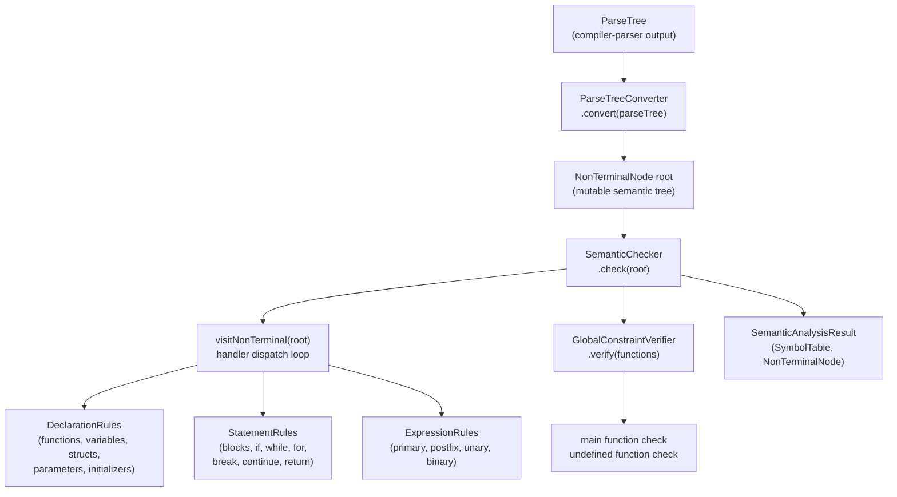
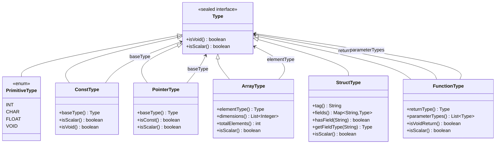

# Semantic Analysis

Semantic analysis is the phase that verifies a grammatically correct program is *meaningful* under the language's typing and scoping rules. The implementation lives in `compiler-semantics/src/main/java/hr/fer/ppj/semantics/` and is invoked via `./run.sh --sem <file>`.

---

## Role and Pipeline Position

The semantic phase sits between the parser and IR lowering. It receives a `ParseTree` from `compiler-parser`, validates all semantic constraints defined in `config/semantics_definition.txt`, and produces:

1. An annotated semantic tree — a `NonTerminalNode` graph with `SemanticAttributes` attached to every internal node (computed types, l-value flags, cast categories, identifier names, parameter lists, struct fields).
2. A completed `SymbolTable` rooted at global scope, containing the full lexical scope tree.
3. Diagnostics for any violation, routed through `compiler-common`'s `DiagnosticReporter`.

The IR lowering stage (`compiler-ir`) consumes only programs that pass all semantic checks. It relies on the annotated tree and symbol table as inputs.

---

## Analysis Flow



---

## Entry Point and Facade

**`SemanticAnalyzer`** (`analysis/SemanticAnalyzer.java`) is the public facade. Callers use one of two methods:

- `analyze(ParseTree, DiagnosticReporter)` — validates and discards results (used by the `--sem` pipeline stage).
- `analyzeWithResults(ParseTree, DiagnosticReporter, SemanticReport)` — validates and returns a `SemanticAnalysisResult` record bundling `(SymbolTable globalScope, NonTerminalNode parseTree)`. This is the method called by the IR lowering stage.

Both methods delegate to the same internal sequence:

1. `ParseTreeConverter.convert(parseTree)` — converts the immutable parser `ParseTree` into a mutable `NonTerminalNode`/`TerminalNode` tree.
2. Construct a fresh `SymbolTable` for global scope.
3. Construct a `SemanticChecker` wired to that scope and the reporter.
4. Call `SemanticChecker.check(root)`, which traverses the tree and then calls `verifyGlobalConstraints()`.
5. On success, optionally generate debug files via `SemanticReport.generateDebugFiles(globalScope, root)`.
6. On `SemanticException`, propagate immediately — debug files are not generated.

---

## Parse Tree Conversion

**`ParseTreeConverter`** (`analysis/ParseTreeConverter.java`) performs a one-time, top-down recursive conversion from the parser's `ParseTree` to the semantic tree model. Terminal nodes become `TerminalNode` instances (carrying symbol, line number, and lexeme); non-terminal nodes become `NonTerminalNode` instances (carrying symbol, children list, and a fresh `SemanticAttributes`). The conversion preserves child ordering. The root must correspond to `<prijevodna_jedinica>`; any other root causes an `IllegalArgumentException`.

### Semantic Tree Node Types

| Class | Package | Role |
|---|---|---|
| `ParseNode` | `tree/` | Sealed base interface; permits `NonTerminalNode` and `TerminalNode` |
| `NonTerminalNode` | `tree/` | Mutable internal node; holds `SemanticAttributes` |
| `TerminalNode` | `tree/` | Leaf node; holds symbol, line, lexeme; immutable |
| `SemanticAttributes` | `tree/` | Per-node mutable attribute bag |

**`SemanticAttributes`** fields populated during the walk:

| Field | Type | Set by |
|---|---|---|
| `type` | `Type` | Expression rules, type-spec rules |
| `lValue` | `boolean` | Expression rules |
| `constValue` | `boolean` | Primary expression rules |
| `functionType` | `FunctionType` | Declaration rules |
| `parameterTypes` | `List<Type>` | Parameter rules |
| `parameterNames` | `List<String>` | Parameter rules |
| `initializerElementTypes` | `List<Type>` | Initializer rules |
| `containsReturn` | `boolean` | Statement rules |
| `inheritedType` | `Type` | Declaration rules (type inheritance) |
| `elementCount` | `int` | Array declarator rules |
| `identifier` | `String` | Primary expression, declarator rules |
| `stringLiteral` | `boolean` | Primary expression rules |
| `stringLiteralLength` | `int` | Primary expression rules |
| `structFields` | `Map<String,Type>` | Struct rules |
| `castSourceType` | `Type` | Unary cast rules |
| `castCategory` | `CastCategory` | Unary cast rules |

`CastCategory` is an inner enum of `SemanticAttributes` with values `TRUNC`, `SEXT`, `ZEXT`, `PTRCAST`, `ITOF`, `FTOI`. It is consumed directly by IR lowering to select the appropriate IR cast instruction.

---

## Semantic Checker Architecture

**`SemanticChecker`** (`analysis/SemanticChecker.java`) is the core engine. It holds:

- `SemanticContext` — current `SymbolTable` pointer, current `FunctionType`, loop nesting depth.
- `SemanticErrorReporter` — wraps `DiagnosticReporter`; emits a `Diagnostic` with `Stage.SEMANTICS` and `Severity.ERROR`.
- `TypeChecker` (`analysis/util/TypeChecker.java`) — `ensureIntConvertible`, `ensureAssignable`, `ensureNotVoid`, `requiresInitialization`.
- `LiteralParser` (`analysis/util/LiteralParser.java`) — parses integer, float, character, and string literals and validates ranges.
- `SymbolManager` (`analysis/util/SymbolManager.java`) — `declareVariable`, `registerFunctionPrototype`, `registerFunctionDefinition`, `declareFunctionParameters`, struct tag management.
- `GlobalConstraintVerifier` (`analysis/GlobalConstraintVerifier.java`) — post-traversal global checks.
- A `LinkedHashMap<String, Consumer<NonTerminalNode>> handlers` — maps grammar non-terminal symbol strings to rule handlers. Populated during construction.

**Handler dispatch** (`visitNonTerminal`): looks up `node.symbol()` in the handlers map. If a handler exists, it is called and the call returns. Otherwise, the default behavior recursively visits all `NonTerminalNode` children. This means non-terminals without explicit handlers are transparent to the walk.

### Rule Handler Classes

| Class | Registers handlers for |
|---|---|
| `DeclarationRules` | `<prijevodna_jedinica>`, `<vanjska_deklaracija>`, `<definicija_funkcije>`, `<deklaracija>`, `<lista_deklaracija>`, `<lista_init_deklaratora>` |
| `TypeSpecificationRules` | `<specifikator_tipa>`, `<lista_specifikatora_kvalifikatora>`, `<ime_tipa>`, `<pokazivac>` |
| `DeclaratorRules` | `<izravni_deklarator>`, `<init_deklarator>` |
| `StructRules` | `<struct_specifikator>`, `<struct_lista_deklaracija>`, `<struct_deklaracija>`, `<struct_lista_deklaratora>`, `<struct_deklarator>` |
| `ParameterRules` | `<lista_parametara>`, `<deklaracija_parametra>` |
| `InitializerRules` | `<inicijalizator>`, `<lista_izraza_pridruzivanja>` |
| `ControlFlowRules` | `<slozena_naredba>`, `<lista_naredbi>`, `<naredba>`, `<izraz_naredba>`, `<naredba_grananja>`, `<naredba_petlje>` |
| `JumpStatementRules` | `<naredba_skoka>` |
| `PrimaryExpressionRules` | `<primarni_izraz>` |
| `PostfixExpressionRules` | `<postfiks_izraz>` |
| `UnaryExpressionRules` | `<unarni_izraz>`, `<unarni_operator>`, `<cast_izraz>` |
| `BinaryExpressionRules` | `<multiplikativni_izraz>`, `<aditivni_izraz>`, `<odnosni_izraz>`, `<jednakosni_izraz>`, `<bin_i_izraz>`, `<bin_xili_izraz>`, `<bin_ili_izraz>`, `<log_i_izraz>`, `<log_ili_izraz>`, `<izraz_pridruzivanja>`, `<izraz>` |

---

## Scope and Symbol Table Model

**`SymbolTable`** (`symbols/SymbolTable.java`) is a hierarchical, single-threaded scope node. Each instance represents one lexical scope and holds:

- `Map<String, Symbol> entries` (`LinkedHashMap`, preserves insertion order) — symbols declared in this scope only.
- `SymbolTable parent` — `null` for global scope.
- `List<SymbolTable> children` — child scopes, populated on `enterChildScope()` for debug output.

**Scope creation**: `enterChildScope()` allocates a new `SymbolTable` whose parent is the current table and appends it to `children`. The caller is responsible for restoring the previous scope pointer. `SemanticContext.withNewScope(Runnable)` wraps this as a `try/finally`.

**Symbol lookup**: `lookup(name)` walks up the parent chain from the current scope, returning the first match (inner declarations shadow outer ones). `lookupLocal(name)` searches only the current scope. `declare(Symbol)` fails and returns `false` if the name is already present in the current scope. `update(Symbol)` replaces an existing entry in the current scope; fails if absent.

**Symbol types** — the `Symbol` sealed interface permits exactly two implementations:

- `VariableSymbol(String name, Type type, boolean isConst)` — variables, constants, and function parameters.
- `FunctionSymbol(String name, FunctionType type, boolean defined)` — function declarations (`defined=false`) and definitions (`defined=true`). `markDefined()` returns a new instance with `defined=true`.

**Scope lifecycle during traversal**:

- Global scope: created once at the start of `SemanticAnalyzer.analyzeWithResults`.
- Function body: `DeclarationRules.visitDefinicijaFunkcije` opens a new scope, declares parameters into it, then processes the compound statement. `SemanticContext.currentFunction` is set to the `FunctionType` for the duration.
- Compound statement: `ControlFlowRules.visitSlozenaNaredba` calls `checker.withNewScope(...)`, which pushes a child scope for the block's local declarations and restores after.
- Loop depth: `SemanticContext.withinLoop(Runnable)` increments/decrements `loopDepth` around loop bodies.

**Struct tag registry**: `SymbolManager` maintains a `Map<String, StructType> structTags` (separate from the `SymbolTable` tree) to support forward declarations. Tagged structs are registered via `registerStructTagForward` (empty fields) or `registerStructTag` (full fields). Forward declarations are replaced when the full definition is seen.

---

## Type System



All `Type` implementations are immutable value objects and can be freely shared between tree nodes.

### PrimitiveType

`PrimitiveType` is a Java enum with four constants: `INT` (32-bit signed), `CHAR` (8-bit signed), `FLOAT` (32-bit IEEE 754), `VOID`. Only `VOID` returns `true` from `isVoid()`. `INT`, `CHAR`, and `FLOAT` return `true` from `isScalar()`.

### ConstType

`ConstType(Type baseType)` wraps any non-void type. `isScalar()` and `isVoid()` delegate to `baseType`. Const cannot be applied to `void` (constructor throws `IllegalArgumentException`). Use `TypeSystem.stripConst(type)` to unwrap.

### PointerType

`PointerType(Type baseType, boolean isConst)` where `isConst` represents `T * const` (the pointer itself is const; pointed-to constness is represented by wrapping `baseType` with `ConstType`). Pointers are always scalar (`isScalar() == true`).

### ArrayType

`ArrayType(Type elementType, List<Integer> dimensions)` where `dimensions` is outermost-first. An empty dimensions list represents an unsized array (used in function parameters). `elementType` cannot be `void`. Arrays are not scalar.

Multi-dimensional example: `int arr[3][2]` → `ArrayType(PrimitiveType.INT, [3, 2])`.

### StructType

`StructType(String tag, Map<String, Type> fields)` where `tag` is `null` for anonymous structs. Fields are stored in declaration order via `LinkedHashMap`. Tagged structs compare by tag name to enable forward declarations; anonymous structs compare by structural equality. Structs are not scalar.

`StructLayout` (`types/StructLayout.java`) computes the memory layout of a struct for IR generation: field offsets, field sizes, struct size and alignment (32-bit target: `char`=1, `int`=4, `float`=4, pointers=4). Layout is computed via `StructLayout.compute(StructType, TypeSizeCalculator, TypeAlignmentCalculator)` and cached in `SemanticInfo`.

### FunctionType

`FunctionType(Type returnType, List<Type> parameterTypes)`. A `void` parameter list is represented as an empty `parameterTypes` list. Return type may be any type including `void`. Functions are not scalar.

### TypeSystem

`TypeSystem` (`types/TypeSystem.java`) is the unified static API. It delegates to:

- `TypeCompatibility` (`types/TypeCompatibility.java`) for `canAssign`, `canCast`, `equalsIgnoringConst`.
- `TypePromotion` (`types/TypePromotion.java`) for `isIntConvertible`, `arithmeticResult`.

Direct operations on `TypeSystem`: `stripConst(Type)`, `isConst(Type)`, `withConst(Type)`.

---

## Type Compatibility and Promotion Rules

### Assignment Compatibility (`TypeCompatibility.canAssign`)

Determines whether a value of `source` type can be implicitly assigned to `target`:

| Target | Accepted sources |
|---|---|
| `int` | `int`, `char`, `float` |
| `char` | `char`, `int` |
| `float` | `int`, `char`, `float` |
| pointer `T*` | `T*` with same base (ignoring pointed-to const), array decaying to `T*`, `int` (NULL literal) |
| struct (tagged) | exact same struct by tag |
| array or function | exact equality only |
| `void` | nothing |

Const qualification is stripped from both types before the comparison. Non-const values can be assigned to const targets; the reverse is checked at a higher level by the expression rules.

### Cast Validity (`TypeCompatibility.canCast`)

Explicit casts:

- Numeric ↔ numeric (`char`, `int`, `float`): always legal.
- Pointer ↔ numeric scalar: legal (pointer-to-integer, integer-to-pointer).
- Pointer ↔ pointer: legal if base types are equal ignoring const.
- Any type → `void`: legal (value discarded).
- Struct → same struct: legal.
- Arrays and functions: not castable.

### Arithmetic Promotion (`TypePromotion.arithmeticResult`)

Implements C's usual arithmetic conversions:

1. If either operand is `float` → result is `float`.
2. Otherwise → result is `int` (both `char` operands are promoted to `int`).

### Boolean Context (`TypePromotion.isIntConvertible`)

A type is usable in a boolean context (`if`, `while`, `for` condition; logical operators) if and only if it is scalar: `int`, `char`, `float`, or any pointer. Const qualification is stripped before the check.

---

## Key Semantic Checks

### Expressions

**Primary expressions** (`<primarni_izraz>`):
- Identifier (`IDN`): looked up via `currentScope().lookup(name)`. If not found, error. If found as `VariableSymbol`, type and l-value flag are set. If found as `FunctionSymbol`, the function type is stored in `attributes.functionType()`.
- Integer literal (`BROJ`): type is `PrimitiveType.INT`, not an l-value.
- Character literal (`ZNAK`): type is `PrimitiveType.CHAR`, not an l-value. Escape sequence validity is verified by `LiteralParser`.
- String literal (`NIZ_ZNAKOVA`): type is `ArrayType(ConstType(PrimitiveType.CHAR), length+1)` where length includes the implicit null terminator. String literals are not l-values.
- Parenthesized expression: attributes propagated from the inner expression.

**Array indexing** (`<postfiks_izraz> [ <izraz> ]`): base must be array or pointer type; index must be int-convertible. Result type is the element type; result is an l-value.

**Function call** (`<postfiks_izraz> ( ... )`): base expression must have a `FunctionType` in its attributes. Argument count and types are checked against parameter types via `TypeSystem.canAssign`. Result type is the function's return type; result is not an l-value.

**Struct field access** (`<postfiks_izraz> . IDN`): base must be `StructType` (not a pointer). Field must exist in the struct. Result type is the field type; result is an l-value if and only if the base is an l-value.

**Postfix increment/decrement**: operand must be an l-value and must be a scalar type. Not applicable to const types. Result type equals the operand type; result is not an l-value.

**Address-of** (`& <cast_izraz>`): operand must be an l-value that is not a function or array. Result type is `PointerType(operand_type, false)`.

**Dereference** (`* <cast_izraz>`): operand must be a pointer type. Result type is the pointer's base type; result is an l-value.

**Unary arithmetic operators** (`+`, `-`): operand must be scalar. `+` and `-` require numeric scalars. Result is `int` if operand is `int` or `char`; `float` if operand is `float`.

**Bitwise NOT** (`~`): operand must be int-convertible. Result is `int`.

**Logical NOT** (`!`): operand must be int-convertible. Result is `int`.

**Binary arithmetic** (`*`, `/`, `%`, `+`, `-`): both operands must be scalar; result determined by `TypePromotion.arithmeticResult`. For pointer arithmetic (`+`, `-`), one operand may be a pointer and the other an integer, resulting in the pointer type.

**Relational and equality operators**: operands must be int-convertible (including pointers). Result is always `PrimitiveType.INT`.

**Bitwise operators** (`&`, `^`, `|`): operands must be int-convertible. Result is `PrimitiveType.INT`.

**Logical operators** (`&&`, `||`): operands must be int-convertible. Result is `PrimitiveType.INT`.

**Assignment** (`<postfiks_izraz> = <izraz_pridruzivanja>`): left side must be an l-value and must not be const-qualified. Right side must be assignable to the left side's type via `TypeSystem.canAssign`.

### Declarations

**Variable declarations**: type must not be `void`. Redeclaration in the same scope is an error. `const`-qualified variables require an initializer (`TypeChecker.requiresInitialization`). Array declarations require element count ≤ `SemanticConstants.MAX_ARRAY_LENGTH` (1024). Array initializers are checked element-by-element.

**Function declarations (prototypes)**: if a function with the same name already exists in scope, its `FunctionType` must match exactly. If a `VariableSymbol` with the same name exists, error.

**Function definitions**: must not redefine an already-defined function (`fn.defined() == true` → error). If a prior declaration exists, types must match exactly. Parameter names are declared into a new child scope opened for the function body.

### Statements

**Compound statement** (`<slozena_naredba>`): opens a new lexical scope via `withNewScope`; declarations within the block are local to that scope.

**If statement**: condition expression must be int-convertible.

**While loop**: condition must be int-convertible. Body is executed within `withinLoop`.

**For loop**: condition expression (if present) must be int-convertible. Body is within `withinLoop`.

**Break / Continue**: only legal when `loopDepth > 0`; otherwise error.

**Return without expression**: only legal when the current function's return type is `void`.

**Return with expression**: the expression's type must be assignable to the current function's return type via `TypeSystem.canAssign`. Return outside any function (`currentFunction == null`) is an error.

---

## Global Constraints

`GlobalConstraintVerifier` (`analysis/GlobalConstraintVerifier.java`) is invoked after the tree traversal completes. It verifies two program-level requirements against the `Map<String, FunctionSymbol>` collected by `SymbolManager`:

1. **Main function**: a function named `"main"` (constant `SemanticConstants.MAIN_FUNCTION_NAME`) must exist, must be defined (not merely declared), must have an empty parameter list, and its return type — after stripping const — must be either `PrimitiveType.INT` or `PrimitiveType.FLOAT`. FRISCcc intentionally accepts `float main(void)` in addition to `int main(void)`.

2. **All declared functions must be defined**: every `FunctionSymbol` with `defined == false` is an error. Error message token: `"funkcija"` (`SemanticConstants.ERROR_UNDEFINED_FUNCTION`).

Both errors are reported via `SemanticErrorReporter.reportGlobalError(String)` and result in a `SemanticException` with `Stage.SEMANTICS` / `Severity.ERROR`.

---

## Error Reporting

`SemanticErrorReporter` (`errors/SemanticErrorReporter.java`) wraps `DiagnosticReporter` from `compiler-common`. All errors pass through `compiler-common`'s `Diagnostic(Stage, Severity, SourceLocation, String)`.

On the first error at a tree node (`reportError(NonTerminalNode)`), the reporter:

1. Finds the line number by walking to the leftmost terminal child.
2. Formats the production via `ProductionFormatter.formatProduction(node)`.
3. Reports a `Diagnostic` at that location.
4. Throws `SemanticException` to immediately abort the traversal.

A boolean `errorReported` flag prevents double-reporting (subsequent calls throw immediately without re-reporting). For testing, `reset()` clears the flag.

The error format output by `ProductionFormatter` is: the non-terminal symbol followed by ` ::= ` and the space-separated list of child symbols (terminals with their lexeme, non-terminals with their symbol string), matching the PPJ specification format.

`SemanticException` (`errors/SemanticException.java`) is an unchecked exception used only as a control-flow mechanism within the semantic phase; callers catch it at the `SemanticAnalyzer` boundary.

---

## `config/semantics_definition.txt`

This file specifies the grammar of the PPJ-C language as recognized by the semantic analyzer. It is the normative source for the non-terminal symbols that `SemanticChecker` dispatches on. The grammar uses Croatian non-terminal names (e.g., `<primarni_izraz>` = primary expression, `<prijevodna_jedinica>` = translation unit, `<definicija_funkcije>` = function definition). A complete Croatian–English mapping is maintained in `book/backmatter/A_glossary.tex`. The file covers:

- Expressions: primary, postfix, argument lists, unary, cast, type names, pointer declarators, struct specifiers, binary operators through logical-or, assignment, comma.
- Statements: compound, statement lists, expression statements, if/else, while/for loops, jump statements (break, continue, return).
- Declarations: translation unit, external declarations, function definitions, parameter lists, variable declarations, init declarators, initializers.

`SemanticConstants` (`analysis/SemanticConstants.java`) centralizes all terminal and non-terminal symbol string constants used in rule implementations.

---

## `SemanticInfo` API for IR Lowering

`SemanticInfo` (`api/SemanticInfo.java`) provides a clean interface for `compiler-ir` to consume semantic results without accessing `SemanticAttributes` fields directly. Key methods:

- `getType(ParseNode)` — returns the computed `Type` from `NonTerminalNode.attributes().type()`.
- `getResolvedSymbol(ParseNode, SymbolTable)` — identifier lookup from a given scope.
- `getFunctionType(Symbol)` — extracts `FunctionType` from a `FunctionSymbol`.
- `getStructLayout(String structTag)` — lazily computes and caches `StructLayout` for a struct tag.
- `getArrayDimensions(Type)` — extracts the dimensions list from an `ArrayType`.
- `isAddressableExpression(ParseNode)` — determines l-value status by examining expression form (identifier, dereference `*expr`, array indexing `expr[i]`, field access `expr.field`) without relying on the `lValue` attribute.
- `getStorageClass(Symbol, SymbolTable)` — classifies a symbol as `LOCAL`, `PARAM`, or `GLOBAL`.

---

## Invocation

```bash
./run.sh --sem <prog>            # semantic analysis only (exits after sem phase)
./run.sh --ir <prog>             # semantic + IR lowering
./run.sh --frisc <prog>          # full pipeline through codegen
```

When `--sem` is used, the pipeline halts after `SemanticAnalyzer.analyze(...)`. Errors are printed to stdout in the PPJ production format. Exit code is non-zero on error.

---

See also: [parser.md](parser.md) (parse tree format consumed by this phase), [ir.md](ir.md) (typed IR produced from the annotated tree).
