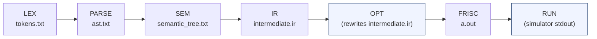

# FRISCcc CLI Reference

The compiler is invoked via `./run.sh <flags> <file>` from the repo root, or directly as `java -jar cli/target/ccompiler.jar <flags> <file>`. `run.sh` is a thin Bash wrapper that locates the JAR, checks Java ≥ 21, rebuilds if sources are newer than the binary, and then delegates every argument verbatim to the JAR.

---

## Synopsis

```
./run.sh [stage-flag] [opt-flags] [output-flags] <source.c>
./run.sh run-ir [ir-flags] <program.ir>
./run.sh run-vm [vm-flags] <program.ir>
./run.sh --run-ir-all-real-world [ir-flags]
./run.sh -h | --help
./run.sh -v | --version
```

---

## Compilation stage flags

Each flag names the *furthest* stage to execute. All prerequisite stages run automatically (see [Stage implication](#stage-implication)). Output artifacts are written to `compiler-bin/` unless overridden with `--bin`.

| Flag | Stages executed | Artifact written to `compiler-bin/` |
|------|----------------|--------------------------------------|
| `--lex` | Lexical Analysis | `tokens.txt` |
| `--parse` | Lexical → Syntax Analysis | `tokens.txt`, `ast.txt` |
| `--sem` | Lexical → Semantic Analysis | `tokens.txt`, `ast.txt`, `semantic_tree.txt` |
| `--ir` | Lexical → IR Generation | `tokens.txt`, `ast.txt`, `semantic_tree.txt`, `intermediate.ir` |
| `--frisc` | Lexical → IR Optimization → FRISC Code Generation | all above + `a.out` |
| `--all` | Lexical → FRISC Code Generation | all above + `a.out` |
| `--run` | Lexical → FRISC Code Generation → FRISC Execution | all above; simulator output to stdout |

`--all` is equivalent to requesting all compile stages up to and including `--frisc`. `--run` additionally spawns the FRISC simulator (requires Node.js and `node_modules/friscjs`).

On any failure the output directory is cleared and replaced with a single `errors.txt` containing a structured failure report (timestamp, failing stage, diagnostics, hint, root cause).

### Stage implication

The pipeline always runs every stage from LEX up to the highest-numbered requested stage. Requesting `--frisc` therefore implies LEX, PARSE, SEMANTIC, IR, OPT, and FRISC in that order — it is not possible to skip intermediate stages. The OPT stage is always inserted between IR and FRISC when codegen is requested; its behavior is controlled by `--O0` / `--O1`.



---

## Optimization flags

| Flag | Behavior | Default |
|------|----------|---------|
| `--O0` | Disable all IR optimization passes; IR is passed to codegen as-is | **Yes** |
| `--O1` | Run the full 16-pass peephole optimizer on the IR before codegen | No |
| `--dump-ir` | Write pre- and post-optimization IR to `compiler-bin/ir-dumps/<program>/` | Off |
| `--verify-each` | Run the IR well-formedness verifier after every individual optimization pass (debugging aid; significant performance cost) | Off |

`--O0` is the default. Specifying neither `--O0` nor `--O1` is equivalent to `--O0`. The two flags are mutually exclusive; the last one on the command line wins.

`--dump-ir` requires at least `--frisc` or `--all` (the OPT stage must run). Combined with `--O1` it produces three files per program: `pre_opt.ir`, `post_opt.ir`, and a per-pass diff log. With `--O0` the pre- and post-optimization IR are identical; `--dump-ir` still writes both.

---

## Output directory flag

| Flag | Argument | Default |
|------|----------|---------|
| `--bin` | `<dir>` — writable directory path | `compiler-bin` |

On success the directory contains the artifacts listed in the stage table above. On failure it contains only `errors.txt`.

---

## IR interpreter subcommand (`run-ir`)

Interprets a pre-compiled `.ir` file using the tree-walking IR interpreter. Skips lexing, parsing, semantic analysis, and FRISC codegen entirely. Accepts either the form `run-ir` or `--run-ir` as the first argument.

```
./run.sh run-ir [--trace-ir] [--ir-step-limit <N>] <program.ir>
```

| Flag | Argument | Default | Description |
|------|----------|---------|-------------|
| `--trace-ir` | — | off | Print a one-line trace per interpreter step to stdout |
| `--ir-step-limit` | `<N>` (positive integer) | `2,000,000` | Abort interpretation after N steps; guards against infinite loops |

On completion, reports the program's return value and total step count. On step-limit exhaustion or runtime error, exits with code 1.

---

## Bytecode VM subcommand (`run-vm`)

Lowers a pre-compiled `.ir` file to stack bytecode and executes it on the bytecode VM. Accepts either `run-vm` or `--run-vm` as the first argument.

```
./run.sh run-vm [--trace-vm] [--dump-bytecode] [--vm-dispatch-limit <N>] <program.ir>
```

| Flag | Argument | Default | Description |
|------|----------|---------|-------------|
| `--trace-vm` | — | off | Print a one-line trace per bytecode dispatch to stdout |
| `--dump-bytecode` | — | off | Disassemble the lowered bytecode to stdout instead of executing |
| `--vm-dispatch-limit` | `<N>` (positive long) | `16,000,000` | Abort execution after N dispatched instructions |

`--trace-vm` and `--dump-bytecode` are mutually exclusive in effect: `--dump-bytecode` prints the disassembly and exits without running the VM; `--trace-vm` traces a normal execution run.

On completion, reports the program's return value and total dispatch count. On dispatch-limit exhaustion or runtime error, exits with code 1.

---

## Batch interpreter flag (`--run-ir-all-real-world`)

Script-level batch command handled by `run.sh` before the JAR is invoked. Finds every `program.ir` and `main.ir` file under `examples/real_world/` (sorted), runs the IR interpreter on each, and prints a pass/fail summary.

```
./run.sh --run-ir-all-real-world [--trace-ir] [--ir-step-limit <N>]
```

All additional flags are forwarded to the interpreter unchanged. Exit code is 0 if all programs pass, 1 if any fail.

---

## General options

| Flag | Description |
|------|-------------|
| `-h`, `--help` | Print usage for `run.sh`, then print the JAR's built-in help, then exit 0 |
| `-v`, `--version` | Print JAR version from the manifest, file size, and `java -version` output, then exit 0 |

---

## Exit codes

| Code | Meaning |
|------|---------|
| 0 | Success |
| 1 | Compilation failure, interpreter/VM error, or invalid arguments |
| 2 | JAR not found and automatic rebuild failed (`run.sh` only) |
| 3 | Java runtime not found in `PATH` (`run.sh` only) |

---

## Examples

**Lex only — inspect tokens:**
```bash
./run.sh --lex examples/real_world/math_fibonacci_iter/program.c
# → compiler-bin/tokens.txt
```

**Full compile, no optimization:**
```bash
./run.sh --frisc examples/real_world/math_fibonacci_iter/program.c
# → compiler-bin/a.out  (FRISC assembly)
```

**Full compile with O1 optimization, dump IR diff:**
```bash
./run.sh --frisc --O1 --dump-ir examples/real_world/real_prime_sieve/program.c
# → compiler-bin/a.out
# → compiler-bin/ir-dumps/program/pre_opt.ir
# → compiler-bin/ir-dumps/program/post_opt.ir
```

**Compile and simulate in one step:**
```bash
./run.sh --all --run examples/real_world/math_fibonacci_iter/program.c
```

**Run the IR interpreter on an existing .ir file:**
```bash
./run.sh run-ir examples/real_world/math_fibonacci_iter/program.ir
```

**Run the IR interpreter with a trace and raised step limit:**
```bash
./run.sh run-ir --trace-ir --ir-step-limit 500000 \
    examples/real_world/math_fibonacci_iter/program.ir
```

**Disassemble bytecode for a program:**
```bash
./run.sh run-vm --dump-bytecode examples/real_world/real_prime_sieve/program.ir
```

**Run on the bytecode VM with dispatch trace:**
```bash
./run.sh run-vm --trace-vm examples/real_world/real_prime_sieve/program.ir
```

**Run the interpreter across all real-world examples:**
```bash
./run.sh --run-ir-all-real-world --ir-step-limit 500000
```

**Send output to a custom directory:**
```bash
./run.sh --frisc --O1 --bin /tmp/myout examples/real_world/math_gcd_lcm/program.c
```

**Invoke the JAR directly (bypassing the shell wrapper):**
```bash
java -jar cli/target/ccompiler.jar --frisc --O1 \
    examples/real_world/math_fibonacci_iter/program.c
```

---

## Artifact reference

| File | Stage that writes it | Description |
|------|---------------------|-------------|
| `compiler-bin/tokens.txt` | LEX | Symbol table and token stream |
| `compiler-bin/ast.txt` | PARSE | Concrete syntax tree |
| `compiler-bin/semantic_tree.txt` | SEMANTIC | Annotated parse tree after type-checking |
| `compiler-bin/intermediate.ir` | IR (then overwritten by OPT) | Typed three-address IR; final version reflects optimization level |
| `compiler-bin/a.out` | FRISC | FRISC assembly ready for simulation |
| `compiler-bin/ir-dumps/<program>/pre_opt.ir` | OPT (requires `--dump-ir`) | IR before optimization |
| `compiler-bin/ir-dumps/<program>/post_opt.ir` | OPT (requires `--dump-ir`) | IR after optimization |
| `compiler-bin/errors.txt` | Any failing stage | Structured failure report; replaces all other artifacts on error |

---

See also: [../README.md](../README.md)
