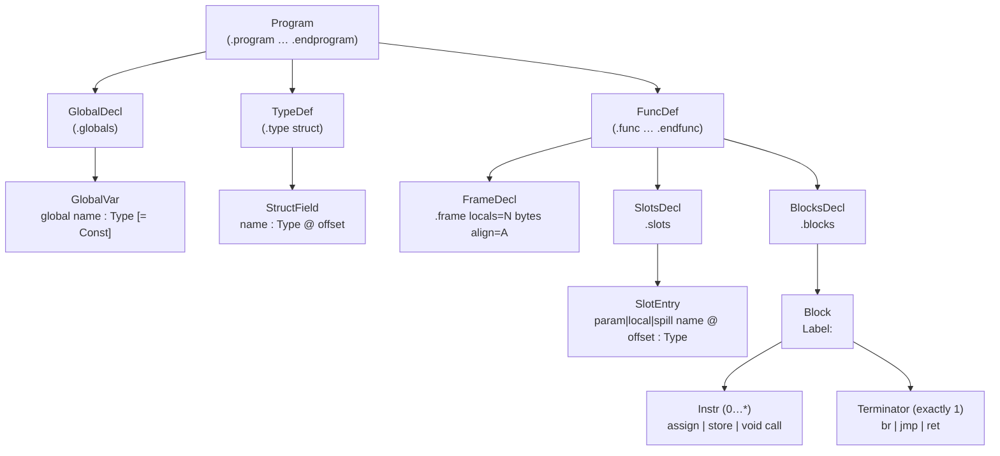

# IR Grammar Reference

The FRISCcc intermediate representation (IR) grammar is defined canonically in [`config/ir_definition.txt`](../../config/ir_definition.txt). This document reproduces that grammar in full, grouped by production category, with technical notes on each section.

See also: [../pipeline/ir.md](../pipeline/ir.md)

---

## Program structure

```bnf
Program
  ::= ".program" NL
      { TopLevel }
      ".endprogram" NL? ;

TopLevel
  ::= GlobalDecl
   |  TypeDef
   |  FuncDef ;
```

An IR file is a flat sequence of top-level declarations enclosed in `.program` / `.endprogram` delimiters. The three declaration kinds may appear in any order and any count. A well-formed program must contain at least one `FuncDef`.

---

## Global declarations

```bnf
GlobalDecl
  ::= ".globals" NL
      { GlobalVar } ;

GlobalVar
  ::= "global" Ident ":" Type [ "=" Const ] NL ;
```

The `.globals` section declares zero or more module-level variables. Each `GlobalVar` carries an explicit type and an optional scalar or aggregate initializer. The initializer, if absent, is zero-initialized. Global names share a flat namespace; there is no linkage qualifier in the IR.

---

## Type definitions

```bnf
TypeDef
  ::= ".type" "struct" Ident "{" NL
      { StructField }
      "}" NL ;

StructField
  ::= Ident ":" Type "@" Int NL ;
```

Named struct types are declared at the top level with `.type struct`. Each field carries its name, type, and **explicit byte offset** (`@Int`). The compiler does not infer or recompute offsets; the byte offset recorded here is the authoritative layout used by `addr_field` instructions and by the FRISC code generator.

---

## Function definitions

```bnf
FuncDef
  ::= ".func" Ident "(" [ ParamList ] ")" ":" Type NL
      FrameDecl
      SlotsDecl
      BlocksDecl
      ".endfunc" NL ;

ParamList
  ::= Param { "," Param } ;

Param
  ::= Ident ":" Type ;

FrameDecl
  ::= ".frame" "locals" "=" Int "bytes" "align" "=" Int NL ;

SlotsDecl
  ::= ".slots" NL
      { SlotEntry } ;

SlotEntry
  ::= SlotKind Ident "@" Int ":" Type NL ;

SlotKind
  ::= "param" | "local" | "spill" ;
```

Every function definition has four required sub-sections in order: signature, `.frame`, `.slots`, and `.blocks`.

- **Signature**: function name, typed parameter list, and return type. A `void` return type means `ret` carries no value.
- **`.frame`**: total size of the stack frame in bytes and the required alignment. The frame size covers all locals and spill slots.
- **`.slots`**: a flat table of named storage entries. Each entry is one of:
  - `param` — a function parameter, allocated at a negative offset from FP (caller-passed).
  - `local` — a source-level local variable.
  - `spill` — a compiler-generated temporary that could not be register-allocated.
  
  The `@Int` offset is a byte offset within the frame; its interpretation relative to the frame pointer follows the FRISC ABI (see [`../pipeline/ir.md`](../pipeline/ir.md)).

---

## Basic blocks

```bnf
BlocksDecl
  ::= ".blocks" NL
      { Block } ;

Block
  ::= Label ":" NL
      { Instr NL }
      Terminator NL ;

Label
  ::= Ident ;
```

The `.blocks` section contains the function's control-flow graph as an ordered sequence of labeled basic blocks. Each block has:

1. A label (any `Ident`, typically `L0`, `L1`, …, or a descriptive name).
2. Zero or more non-terminating instructions, one per line.
3. Exactly one terminator as the final line.

The first block in `.blocks` is the function entry. Labels are function-scoped; the same label name may be reused across different functions.

---

## Instructions

```bnf
Instr
  ::= AssignInstr
   |  StoreInstr
   |  VoidCallInstr ;

AssignInstr
  ::= Temp "=" Rhs ;

StoreInstr
  ::= "store" Value "," Value ":" Type ;

VoidCallInstr
  ::= "call" "func:" Ident "(" [ ArgList ] ")" ":" "void" ;
```

There are three non-terminating instruction forms:

- **`AssignInstr`**: defines a temporary `tN` by evaluating an `Rhs` expression. Each temporary is defined exactly once (static single-assignment discipline).
- **`StoreInstr`**: writes a typed value to a memory address. The syntax is `store <addr>, <value> : <type>` where `<addr>` is the target address and `<type>` is the type of the stored value.
- **`VoidCallInstr`**: invokes a function that returns `void`. Distinguished from `Call` (an `Rhs` form) by the `: void` suffix.

---

## Terminators

```bnf
Terminator
  ::= BrTerm
   |  JmpTerm
   |  RetTerm ;

BrTerm
  ::= "br" Value "," Label "," Label ;

JmpTerm
  ::= "jmp" Label ;

RetTerm
  ::= "ret" [ Value ] ;
```

Every basic block ends with exactly one terminator. Terminators are not assignments; they do not define a temporary.

- **`br`**: conditional branch. The condition must be `bool`-typed. Transfers to the first label if true, the second if false.
- **`jmp`**: unconditional transfer to a label within the same function.
- **`ret`**: returns from the function. If the function's return type is `void`, `Value` is omitted. Otherwise, `Value` must be type-compatible with the declared return type.

---

## Right-hand-side expressions (Rhs)

```bnf
Rhs
  ::= AddrOfSymbol
   |  AddrIndex
   |  AddrField
   |  Load
   |  BinOp
   |  CmpOp
   |  Call
   |  UnaryOp
   |  IncDecOp
   |  CastOp
   |  Const ;
```

The right-hand side of an `AssignInstr` is one of the following expression forms:

### Address computation

```bnf
AddrOfSymbol
  ::= "addr_of_symbol" SymbolRef ;

SymbolRef
  ::= ("local:" | "param:" | "global:") Ident ;

AddrIndex
  ::= "addr_index" Value "," Value "," Int ;

AddrField
  ::= "addr_field" Value "," Ident "." Ident ;
```

- `addr_of_symbol` produces the address of a named slot from the `.slots` table or the `.globals` section. The `local:`, `param:`, or `global:` prefix selects the namespace.
- `addr_index` computes `base + index * elemSize` for array element access. The element size is an integer literal, not a value.
- `addr_field` computes `base + offset` for struct field access, where the offset is looked up in the `.type` definition for the named struct and field.

### Memory load

```bnf
Load
  ::= "load" Value ":" Type ;
```

Reads a value of the given type from the memory address in `Value`. The type annotation determines how many bytes are read and how they are interpreted.

### Binary operations

```bnf
BinOp
  ::= BinOpName Value "," Value ":" Type ;

BinOpName
  ::= "add" | "sub" | "mul" | "div" | "mod"
   |  "and" | "or"  | "xor"
   |  "shl" | "shr" ;
```

All binary operations are **typed**: the `: Type` suffix specifies the result type and implicitly the operand interpretation. Both operands must be the same type as the result. The `float` type routes through the software-emulated Q16.16 fixed-point helpers at code-generation time.

### Comparisons

```bnf
CmpOp
  ::= CmpOpName Value "," Value ":" "bool" ;

CmpOpName
  ::= "cmp_eq" | "cmp_ne"
   |  "cmp_lt" | "cmp_le"
   |  "cmp_gt" | "cmp_ge" ;
```

Comparisons always produce `bool`. Both operands must be the same base type. The result is typically used as the condition of a `br` terminator.

### Unary operations

```bnf
UnaryOp
  ::= UnaryOpName Value ":" Type ;

UnaryOpName
  ::= "neg" | "not" ;
```

- `neg`: arithmetic negation.
- `not`: bitwise complement (integer types) or logical negation (bool).

### Increment and decrement

```bnf
IncDecOp
  ::= IncDecName Value ":" Type ;

IncDecName
  ::= "preinc" | "postinc" | "predec" | "postdec" ;
```

These are value-producing forms corresponding to C's `++`/`--` operators. The IR lowerer typically expands these into explicit `load`, `add`/`sub`, and `store` sequences, but the forms exist as first-class `Rhs` nodes when lowering from the semantic tree.

### Function calls (value-returning)

```bnf
Call
  ::= "call" "func:" Ident "(" [ ArgList ] ")" ":" Type ;

ArgList
  ::= Value { "," Value } ;
```

A `Call` in `Rhs` position invokes a named function and produces a value of the declared return type. For `void`-returning functions, use `VoidCallInstr` instead (the `Instr` form).

### Cast operations

```bnf
CastOp
  ::= CastName Value ":" Type ;

CastName
  ::= "trunc" | "sext" | "zext"
   |  "ptrcast"
   |  "itof" | "ftoi" ;
```

| Cast | Semantics |
|---|---|
| `trunc` | Truncate to a narrower integer type (high bits discarded) |
| `sext` | Sign-extend to a wider integer type |
| `zext` | Zero-extend to a wider integer type |
| `ptrcast` | Reinterpret a pointer as a different pointer type (no-op at runtime) |
| `itof` | Convert `int32` to `float` (Q16.16 at codegen time) |
| `ftoi` | Convert `float` to `int32` (truncates toward zero) |

---

## Values and temporaries

```bnf
Temp
  ::= "t" Int ;

Value
  ::= Temp | Const ;
```

A `Value` is either a temporary or a constant. Temporaries are written `t0`, `t1`, `t2`, … and are defined by `AssignInstr`. The SSA discipline requires each `tN` to be defined exactly once within a function. Constants are inline and carry their own type annotation.

---

## Constants

```bnf
Const
  ::= ScalarConst | AggregateConst ;

ScalarConst
  ::= "#" Int ":" Type              ; integer literal with explicit type
   |  "#" CharLit ":" "char"        ; character literal (1 byte)
   |  "#" FloatLit ":" "float"      ; float literal
   |  "null" ":" Type ;             ; typed null (typically ptr<...>)

AggregateConst
  ::= ArrayConst ;

ArrayConst
  ::= "{" [ Const { "," Const } ] "}" ":" ArrayType ;

ArrayType
  ::= "array" "<" Type "," Int ">" ;
```

Every constant is annotated with its type. The `#` sigil introduces scalar literals. Aggregate constants are brace-enclosed comma-separated lists of `Const` elements and must match the declared element count `N` of the `array<T,N>` type.

---

## Types

```bnf
Type
  ::= "void"
   |  "int32" | "char" | "uchar" | "float" | "bool"
   |  "ptr" "<" Type ">"
   |  "array" "<" Type "," Int ">"
   |  "struct" Ident ;
```

| Type | Description |
|---|---|
| `void` | No value; legal only as a function return type |
| `int32` | Signed 32-bit integer |
| `char` | Signed 8-bit character |
| `uchar` | Unsigned 8-bit character |
| `float` | Floating-point; implemented as Q16.16 signed fixed-point at codegen time |
| `bool` | Boolean; produced by comparison operations |
| `ptr<T>` | Pointer to type `T`; parametric, supports nesting (`ptr<ptr<int32>>`) |
| `array<T,N>` | Fixed-size array of `N` elements of type `T`; `N` is a decimal integer literal |
| `struct Name` | Named struct type; must be declared by a `.type` directive earlier in the program |

Types are not inferred; every instruction, slot, constant, and operation carries an explicit type annotation.

---

## Lexical rules

```bnf
Ident
  ::= Letter { Letter | Digit | "_" } ;

Int
  ::= ["-"] Digit { Digit } ;

FloatLit
  ::= ["-"] Digit { Digit } "." Digit { Digit } ;

CharLit
  ::= "'" ( Escape | AnyCharExceptQuote ) "'" ;

Escape
  ::= "\n" | "\t" | "\\'" | "\\\\" ;

NL
  ::= "\n" ;

Letter
  ::= "A" | ... | "Z" | "a" | ... | "z" ;

Digit
  ::= "0" | "1" | "2" | "3" | "4" | "5" | "6" | "7" | "8" | "9" ;

AnyCharExceptQuote
  ::= ? any character except ' ? ;
```

Newlines (`NL`) are syntactically significant — they terminate statements and separate slot entries, struct fields, and instructions. Blank lines between instructions are permitted (as in the example below) and ignored. There is no line-continuation syntax.

Identifiers must begin with a letter. Underscores are permitted after the first character. Integer literals in the IR use decimal notation; there is no hex or octal form.

---

## Program structure diagram



---

## Annotated example: `math_fibonacci_iter`

The following is the complete IR for the iterative Fibonacci program at `examples/real_world/math_fibonacci_iter/program.ir`. It exercises the most common IR patterns: slot addressing, typed stores and loads, binary arithmetic, a comparison-driven conditional branch, and a scalar return.

```
.program

.func main():int32
  .frame locals=20 bytes align=4
  .slots
    local n@0:int32         ; slot at frame offset 0
    local a@4:int32         ; slot at frame offset 4
    local b@8:int32         ; slot at frame offset 8
    local i@12:int32        ; slot at frame offset 12
    local t@16:int32        ; slot at frame offset 16
  .blocks
  L0:                                           ; entry block
    t0 = addr_of_symbol local:n               ; AssignInstr: AddrOfSymbol
    store t0, #20:int32 : int32               ; StoreInstr: n = 20
    t1 = addr_of_symbol local:a
    store t1, #0:int32 : int32                ; a = 0
    t2 = addr_of_symbol local:b
    store t2, #1:int32 : int32                ; b = 1
    t3 = addr_of_symbol local:i
    store t3, #0:int32 : int32                ; i = 0
    jmp L1                                    ; JmpTerm → loop header

  L1:                                           ; loop header
    t4 = addr_of_symbol local:i
    t5 = load t4 : int32                      ; Load: read i
    t6 = addr_of_symbol local:n
    t7 = load t6 : int32                      ; Load: read n
    t8 = cmp_lt t5, t7 : bool                 ; CmpOp → bool
    br t8, L2, L4                             ; BrTerm: i < n → body, else exit

  L2:                                           ; loop body
    t9  = addr_of_symbol local:a
    t10 = load t9 : int32
    t11 = addr_of_symbol local:b
    t12 = load t11 : int32
    t13 = add t10, t12 : int32                ; BinOp: a + b
    t14 = addr_of_symbol local:t
    store t14, t13 : int32                    ; t = a + b
    t15 = load t11 : int32
    store t9, t15 : int32                     ; a = b
    t16 = load t14 : int32
    store t11, t16 : int32                    ; b = t
    jmp L3

  L3:                                           ; loop increment
    t17 = addr_of_symbol local:i
    t18 = load t17 : int32
    t19 = add t18, #1:int32 : int32           ; i = i + 1
    store t17, t19 : int32
    jmp L1                                    ; back-edge to header

  L4:                                           ; exit block
    t20 = addr_of_symbol local:a
    t21 = load t20 : int32
    ret t21                                   ; RetTerm: return a

.endfunc

.endprogram
```

### Grammar correspondence

| Line | Production |
|---|---|
| `.func main():int32` | `FuncDef` signature; return type `int32` |
| `.frame locals=20 bytes align=4` | `FrameDecl`; 20 bytes, 4-byte aligned |
| `local n@0:int32` | `SlotEntry`; `SlotKind=local`, offset 0 |
| `t0 = addr_of_symbol local:n` | `AssignInstr` with `AddrOfSymbol` as `Rhs` |
| `store t0, #20:int32 : int32` | `StoreInstr`; addr=`t0`, value=`#20:int32`, type=`int32` |
| `t8 = cmp_lt t5, t7 : bool` | `AssignInstr` with `CmpOp` as `Rhs`; result type is always `bool` |
| `br t8, L2, L4` | `BrTerm`; condition `t8`, true-target `L2`, false-target `L4` |
| `t13 = add t10, t12 : int32` | `AssignInstr` with `BinOp` (`add`) as `Rhs` |
| `ret t21` | `RetTerm` with an explicit `Value` |
| `jmp L1` | `JmpTerm` (unconditional back-edge) |

All temporaries (`t0`–`t21`) are defined exactly once. Every instruction and constant carries an explicit type. The five `.slots` entries cover the full 20-byte frame declared by `.frame`.
